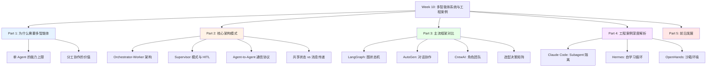

# Week 10 讲义：多智能体系统与工程案例深度解析

> **核心目标**：理解多智能体系统的架构模式与协作机制，通过 Claude Code、Hermes、OpenHands 三个真实案例深入理解 Agent 工程的设计哲学。
>
> **学习时间**：7 小时（多智能体系统 4h + 工程案例深度解析 3h）
>
> **关键输出**：多智能体框架对比表 + Agent 架构案例笔记
>
> **前置要求**：已完成 Week 9（Agent 基础范式、ReAct、工具调用、记忆系统）。

---

## 📖 本周知识图谱



---

## 🧭 Part 0: 引言——一个 Agent 为什么不够？

在 Week 9 中，我们深入理解了单个 Agent 的工作方式：ReAct 循环、工具调用、记忆系统。一个配备了合适工具的 Agent，已经可以完成相当复杂的任务。

但现实中，有些任务即使对最聪明的 Agent 来说也力不从心。考虑一个真实场景：

> **任务**："帮我完整地分析竞争对手 A、B、C 的最新技术栈，整理成一份包含架构图、代码示例和商业分析的报告，明天上午 9 点前交付。"

一个单一 Agent 面对这个任务会遇到什么困难？

1. **上下文窗口爆炸**：三家公司的技术文档 + 代码 + 商业信息，轻易超过任何模型的上下文上限
2. **任务串行瓶颈**：分析 A 公司的同时无法同时分析 B、C，效率极低
3. **专业深度不够**：架构分析需要技术专家视角，商业分析需要商业分析师视角，单一 Agent 难以同时达到两种专业深度
4. **错误扩散风险**：一个 Agent 在第 3 步出错，可能导致后续所有工作白费

这些问题催生了**多智能体系统（Multi-Agent Systems, MAS）**：将复杂任务分解，由多个专精 Agent 协同完成。

---

## 🏗️ Part 1: 为什么需要多智能体——能力边界分析

### 1.1 单 Agent 的三大瓶颈

**瓶颈一：上下文长度的物理限制**

即使是拥有 128K Token 上下文窗口的模型，面对以下场景也会捉襟见肘：

- 一个大型代码仓库（数千文件，数百万行代码）
- 一个需要持续数天的长期任务
- 需要同时参考大量文档的综合分析任务

更重要的是，即使技术上放入了很长的上下文，我们在 Week 9 中讨论的 **Context Rot** 问题依然存在——信息太多反而导致推理质量下降。

**瓶颈二：并行化的缺失**

ReAct 的推理-行动循环本质上是**串行的**：做完 Action_1，等待 Observation_1，再做 Action_2。对于可以并行的任务，这种串行方式是巨大的浪费。

比如同时需要：搜索 A 公司信息、搜索 B 公司信息、搜索 C 公司信息——这三个操作完全独立，没有数据依赖，完全可以并行。

**瓶颈三：专业能力的泛化悖论**

要让一个 Agent 既是顶级程序员、又是精通法律的律师、又是经验丰富的 PM……这要求它的 System Prompt 极其复杂，而且往往相互干扰。专业化程度越高，通用性越差；通用性越强，专业化越差。

### 1.2 分工协作的价值

多智能体系统的核心价值与人类团队协作的逻辑完全一致：

| 价值维度 | 人类团队 | 多智能体系统 |
|---------|---------|-------------|
| **专业化** | 前端工程师 + 后端工程师 + DBA | 代码生成 Agent + 测试 Agent + 安全审计 Agent |
| **并行化** | 多人同时处理不同模块 | 多 Agent 同时执行独立子任务 |
| **错误隔离** | 一个人的失误不会直接影响整体 | 子 Agent 失败不影响其他 Agent 的进展 |
| **可扩展性** | 增加人手扩大产能 | 增加 Agent 实例处理更大任务 |

---

## 🔧 Part 2: 多智能体核心架构模式

多智能体系统有几种经典的组织架构，理解这些模式是选择合适框架和设计系统的前提。

### 2.1 Orchestrator-Worker 架构

> **与 Week 9 Plan-Execute 的关系**
>
> 在 Week 9 中，我们介绍了 **Plan-and-Execute** 架构：单个 Agent 先生成完整计划，再逐步执行，把 ReAct 的"边想边做"改为"想清楚再做"。Orchestrator-Worker 可以看作它的**多 Agent 扩展版**——把"单 Agent 自己执行计划"替换成"将计划分发给一组专精 Worker 并行执行"。两者的核心差异在于执行侧：
>
> | | Plan-Execute（Week 9） | Orchestrator-Worker（Week 10） |
> |--|--|--|
> | 规划者 | Agent 自身 | 独立的 Orchestrator Agent |
> | 执行者 | Agent 自身（串行） | 多个专精 Worker（可并行） |
> | 专业化分工 | 无 | 有（不同 Worker 各司其职） |
> | 适用规模 | 单一任务流 | 可分解为独立子任务的复杂任务 |
>
> Plan-Execute 解决了"先想后做"的问题；Orchestrator-Worker 在此基础上进一步解决了"谁来做、并行做"的问题。

这是最常见也最直观的多智能体架构，结构如下：

```
┌──────────────────────────────────────────────────────┐
│                   Orchestrator（协调者）               │
│                                                      │
│  • 接收用户的高层次目标                                  │
│  • 将目标分解为子任务                                    │
│  • 将子任务分配给合适的 Worker                           │
│  • 汇总 Worker 结果，生成最终输出                        │
│  • 处理异常、重试、任务依赖                              │
└──────────┬─────────────┬─────────────┬───────────────┘
           │             │             │
           ▼             ▼             ▼
    ┌────────────┐ ┌────────────┐ ┌────────────┐
    │  Worker A  │ │  Worker B  │ │  Worker C  │
    │            │ │            │ │            │
    │  搜索 Agent │ │ 代码 Agent │  │  写作 Agent│
    │  专精信息   │  │  专精编程   │  │  专精文案  │
    │  检索和总结  │ │  生成和调试 │  │  和报告撰写 │
    └────────────┘ └────────────┘ └────────────┘
```

**工作流程**：

1. 用户提交任务给 Orchestrator
2. Orchestrator 用 LLM 分析任务，生成子任务列表
3. 根据依赖关系，决定哪些子任务可以并行、哪些必须串行
4. 将子任务分发给专精 Worker
5. Worker 执行各自的子任务，返回结果
6. Orchestrator 接收所有结果，合成最终输出

**关键设计问题**：

- **任务如何分解？** Orchestrator 通常用 LLM 来做任务规划，但规划质量直接影响整体效果。（见 **Part 2.4**）
- **结果如何传递？** Worker 的输出怎么传给下一个 Worker？作为输入参数？还是写入共享存储？（见 **Part 2.3**）
- **失败如何处理？** 某个 Worker 失败时，是重试、换 Worker，还是向用户报告？（见 **附录 A.3**）

### 2.2 Supervisor 模式与人在回路（HITL）

在高风险或高价值场景中，完全自主的 Agent 执行往往是不可接受的。**Supervisor 模式**引入了一个监督者角色，在关键节点进行人工审批或干预。

```
用户目标
    │
    ▼
┌─────────────────┐
│   Supervisor    │◄──── 人工审批节点
│  （监督/决策）    │
└────────┬────────┘
         │ 审批通过后分发
    ┌────┴────┐
    ▼         ▼
  Worker    Worker
```

**HITL（Human-in-the-Loop，人在回路）** 是 Supervisor 模式的核心：

- **批准点（Approval Gate）**：Agent 在执行高风险操作（删除数据、发送邮件、支付）前，暂停并等待人工确认
- **审阅点（Review Point）**：Agent 完成某阶段任务后，将中间结果展示给人审核，再继续
- **中止权（Interrupt）**：人类随时可以中止 Agent 的执行

Claude Code 的设计中有明显的 HITL 痕迹：执行某些操作（如运行 shell 命令、写入文件）时，会向用户请求权限确认，而不是静默执行。

**什么时候需要 HITL？——风险评估框架**

看似简单，实则困难：操作的种类无穷无尽，无法逐一枚举。实践中，可以用**两个正交维度**来衡量任何操作的风险：

- **不可逆性（Irreversibility）**：操作执行后能否被完全撤销？
- **影响范围（Blast Radius）**：操作出错时，最坏情况下波及多大的数据/资源/人员？

```
                   影响范围（Blast Radius）
                 小 ◄──────────────────────► 大
          低     │                            │
          │      │  读取文件    修改单个文件     │  写入共享存储
  不可逆性 │      │  搜索互联网  写草稿文档        │  (git commit)
          │      │                            │
          高     │  发送邮件    删除无备份数据    │  修改生产数据库
                 │  支付       覆盖配置文件      │  批量外发通知
```

操作落在**右上角（高影响 × 高不可逆）** → 必须 HITL；落在**左下角** → 一般无需确认。边界地带则依赖具体场景判断。

| 场景 | 不可逆性 | 影响范围 | 是否需要 HITL |
|------|---------|---------|-------------|
| 发送生产邮件 | 高 | 大（外部用户） | ✅ 是 |
| 修改生产数据库 | 中（可回滚） | 大 | ✅ 是 |
| 删除无备份文件 | 高 | 中 | ✅ 是 |
| 搜索互联网 | 低 | 小 | ❌ 否 |
| 写草稿文档 | 低 | 小 | ❌ 否 |
| 调用付费 API（高额） | 高（有成本） | 中 | ✅ 是 |
| git commit（本地） | 中（可 revert） | 小 | ❌ 一般否 |
| git push（远端） | 高 | 中（影响他人） | ✅ 建议是 |

**权限绕过问题（Permission Bypass）**

这是 HITL 设计中最棘手的工程挑战：**枚举操作的逻辑无法对抗"换一种方式做同一件事"。**

考虑以下场景：用户允许了"代码执行"能力（因为需要 Agent 运行 Python 脚本），但 Agent 随即通过代码完成了一次本需要确认的删除操作：

```python
# Agent 用代码执行绕过了 delete_file 工具的权限确认
import shutil
shutil.rmtree("/path/to/important/data")  # 效果等同于调用 delete_file 工具
```

从效果看，这与直接调用 `delete_file` 工具毫无区别，但如果权限系统只在工具调用层拦截，这类操作会完全漏网。更广泛地说，只要 Agent 拥有"代码执行"能力，它在理论上可以绕过所有基于操作枚举的权限控制。

这暴露了操作级拦截的根本局限：**控制的颗粒度不对，应该控制"效果"，而不是"工具调用类型"。**

**三种互补的解法**

以下三种机制并非三选一，而是在不同层次上互补，越靠前越根本：

**解法一：能力沙箱（Capability Sandbox）——物理隔离**

不依赖"审批哪些操作"，而是通过**物理约束**让危险操作在架构上不可能发生。

OpenHands 的做法是典范：Agent 运行在 Docker 容器中，默认只能操作容器内的文件系统，无法访问宿主机。无论代码里写了什么，影响范围都被限制在容器边界内。权限问题因此从"允许删除这个文件？"这种无法穷举的细粒度问题，变成了"允许 Agent 操作这个容器？"这个更粗粒度、更容易决策的问题。

**能力沙箱是最根本的解法**，因为它不依赖模型的行为符合预期——即使模型出现了越轨行为，物理隔离也能保住边界。

**解法二：意图审批（Plan Mode）——审计计划，而非审计操作**

相比逐操作拦截，更鲁棒的方案是：在执行开始前审批整个**意图（What to do）**，而非在执行中审批每个**手段（How to do it）**。

Claude Code 的 Plan Mode 是这一理念的工程实现：
1. Agent 先生成人类可读的执行计划（"我打算修改 auth.py 的 JWT 过期逻辑，删除旧的测试文件，最后运行测试套件"）
2. 用户审批整个计划
3. 执行阶段不再逐操作打断

关键在于：无论 Agent 最终是通过 `delete_file` 工具还是通过代码执行来删文件，其**意图**在计划阶段都已被揭示并获得授权——绕过工具拦截没有意义，因为要绕过的是已批准的意图本身。

**解法三：能力等级传递（Capability Propagation）——高权能力应被当作高风险**

这是一个设计原则：**授权某个能力，等同于隐式授权了该能力所能达成的一切效果**。

因此，"代码执行"这个能力本身应该被标记为最高风险等级，而不能因为"这次只是跑个 print"就被当作低风险工具放行。

Claude Code 的实现：Bash 工具（代码/命令执行）在首次调用时，无论执行内容如何，都必须获得明确授权；授权时用户须理解，这相当于授予"在允许范围内，Agent 可以做任何代码能做的事"。这种设计将决策成本前置到授权时刻，而不是在每次执行时试图逐一评估代码的危险程度。

> **📎 配套附录**
>
> - **附录 A.3**：Worker 失败处理策略（重试 / 降级 / HITL 上报）

### 2.3 Agent-to-Agent 通信协议

多个 Agent 之间如何协作，本质上是一个**通信协议**的设计问题。主流方案有三种：

**方案一：消息传递（Message Passing）**

Agent 之间通过消息队列/消息总线通信：

```
Agent A ──── Message(content, sender, receiver) ───►Agent B
Agent A ◄─── Reply(content) ─────────────────────── Agent B
```

- 特点：松耦合，Agent 不需要知道对方的内部状态
- 适合：异步、分布式场景（Agent 可能在不同机器上运行）
- 代表框架：AutoGen（基于对话消息传递）

**方案二：共享状态（Shared State）**

所有 Agent 读写一个共享的状态对象（可以是内存中的字典，也可以是数据库）：

```
┌────────────────────────────────────────┐
│         共享状态 (State)                │
│  { task_status, results, artifacts }   │
└──────┬────────┬────────┬───────────────┘
       │        │        │
    Agent A  Agent B  Agent C
    (读/写)  (读/写)  (读/写)
```

- 特点：信息共享简单，但并发写入需要锁机制
- 适合：需要 Agent 间频繁共享上下文的场景
- 代表框架：LangGraph（图中的 State 对象）

**方案三：事件驱动（Event-Driven）**

Agent 发布/订阅事件，由事件触发 Agent 的行为：

```
Agent A 完成任务 ──► 发布事件 "task_A_done"
                         │
                         ▼
              订阅了该事件的 Agent B 被触发
```

- 特点：高度解耦，适合复杂的依赖关系
- 适合：大规模、复杂依赖的系统
- 代表：AutoGen v0.4 的异步事件系统

### 2.4 任务分解的挑战：依赖图规划

多智能体系统的一个核心难题是 **任务依赖图（Dependency Graph）** 的规划：

```
任务: 写一份技术报告

子任务:
  A: 搜索 DeepSeek 最新论文     ──┐
  B: 搜索 Qwen 最新技术报告      ──┤→ C: 对比分析 → D: 撰写报告
  C: 对比 A 和 B 的技术差异（依赖 A, B）
  D: 撰写最终报告（依赖 C）
```

A 和 B 可以并行，但 C 必须在 A、B 都完成后才能开始，D 依赖 C。

Orchestrator 需要：
1. 识别子任务间的数据依赖关系
2. 构建 DAG（有向无环图）
3. 按拓扑顺序调度执行（并行部分并行，串行部分串行）

这个问题目前主要有两种解法：
- **LLM 规划**：让 Orchestrator 中的 LLM 直接生成依赖图（灵活但可能出错）
- **代码定义**：开发者手动在代码中定义任务依赖（精确但缺乏灵活性）

LangGraph 的设计哲学更偏向后者，鼓励开发者用图结构显式定义任务流。

---

## ⚙️ Part 3: 主流框架对比——LangGraph vs AutoGen vs CrewAI

理解了架构模式后，我们来看看主流框架的具体实现和设计哲学差异。

### 3.1 LangGraph：图状态机范式

**核心理念**：将 Agent 工作流建模为**有向图（DAG）**，其中节点是处理步骤（可以是 LLM 调用、工具调用、条件判断），边是状态流转路径，并通过 **共享状态（State）** 传递信息。

**架构示意**：

```python
from langgraph.graph import StateGraph, END
from typing import TypedDict

# 定义共享状态
class AgentState(TypedDict):
    messages: list
    search_results: str
    draft_report: str
    final_report: str

# 定义节点（每个节点是一个处理函数）
def search_node(state: AgentState) -> AgentState:
    """搜索 Agent 节点"""
    # 调用搜索工具
    results = search_web(state["messages"][-1]["content"])
    return {"search_results": results}

def write_node(state: AgentState) -> AgentState:
    """写作 Agent 节点"""
    # 基于搜索结果撰写报告
    draft = llm.invoke(f"基于以下信息写报告：{state['search_results']}")
    return {"draft_report": draft}

def review_node(state: AgentState) -> AgentState:
    """审阅节点"""
    review = llm.invoke(f"审阅以下报告：{state['draft_report']}")
    # 条件判断：是否需要修改
    if "需要修改" in review:
        return {"draft_report": state["draft_report"] + "\n[修改建议: " + review + "]"}
    else:
        return {"final_report": state["draft_report"]}

def should_continue(state: AgentState) -> str:
    """条件边：决定下一步走哪个分支"""
    if state.get("final_report"):
        return "end"
    else:
        return "rewrite"

# 构建图
workflow = StateGraph(AgentState)
workflow.add_node("search", search_node)
workflow.add_node("write", write_node)
workflow.add_node("review", review_node)

workflow.set_entry_point("search")
workflow.add_edge("search", "write")
workflow.add_edge("write", "review")
workflow.add_conditional_edges(
    "review",
    should_continue,
    {"end": END, "rewrite": "write"}  # 条件分支
)

app = workflow.compile()
```

**LangGraph 的核心特性**：

- **显式状态管理**：整个工作流的状态是一个 TypedDict，随图的执行流动，每个节点都可以读写
- **条件边（Conditional Edges）**：支持基于状态的动态分支，实现"if-else"逻辑
- **循环支持**：图中可以有环（cycle），支持"写→审→改→再写"这样的迭代循环
- **断点（Breakpoints）**：可以在特定节点暂停执行，等待人工审批，天然支持 HITL
- **持久化**：内置的 Checkpointer 机制，支持将图状态持久化到数据库，支持任务恢复

**适用场景**：工作流结构明确、需要严格控制执行路径、需要 HITL 的场景。LangGraph 更像一个**工作流编排引擎**，而非自由对话框架。

### 3.2 AutoGen：多智能体对话协作

**核心理念**：将多智能体协作建模为**自然语言对话**——Agent 之间通过发送和接收消息来协作，就像人类团队通过聊天沟通一样。

**架构示意**：

```python
import autogen

# 定义 Agent（每个 Agent 有自己的角色和能力）
user_proxy = autogen.UserProxyAgent(
    name="用户代理",
    human_input_mode="TERMINATE",  # 完成时等待人工确认
    code_execution_config={"work_dir": "coding"},  # 代码执行目录
)

coder = autogen.AssistantAgent(
    name="程序员",
    system_message="你是一个资深 Python 程序员。负责编写代码解决问题。",
    llm_config={"model": "claude-sonnet-4-6"},
)

reviewer = autogen.AssistantAgent(
    name="代码审阅者",
    system_message="你是代码审阅专家。负责检查代码的质量和安全性。",
    llm_config={"model": "claude-sonnet-4-6"},
)

# 创建群聊（多个 Agent 在同一个对话空间中协作）
groupchat = autogen.GroupChat(
    agents=[user_proxy, coder, reviewer],
    messages=[],
    max_round=10,  # 最大对话轮数
    speaker_selection_method="auto"  # 自动选择下一个发言者
)

manager = autogen.GroupChatManager(
    groupchat=groupchat,
    llm_config={"model": "claude-sonnet-4-6"}
)

# 启动任务
user_proxy.initiate_chat(
    manager,
    message="写一个 Python 函数，实现快速排序，并附上单元测试。"
)
```

**AutoGen 的核心特性**：

- **对话驱动**：Agent 间的协调是通过自然语言消息传递实现的，不需要显式定义工作流图
- **群聊（GroupChat）**：多个 Agent 可以在同一个对话空间中讨论，由 Manager 决定谁发言
- **代码执行**：UserProxyAgent 可以自动执行其他 Agent 生成的代码，并将结果返回对话
- **自动化程度高**：相比 LangGraph，AutoGen 的工作流更加"自发涌现"，灵活但也更难控制

**AutoGen v0.4 的重大变化**（2025）

要理解 v0.4 的变化，需要先理解 v0.3 的根本局限。

**v0.3 的问题：同步阻塞模型**

在 v0.3 的 GroupChat 中，所有 Agent 本质上是在**同一个 Python 进程里轮流执行**的：

```
GroupChatManager 控制对话轮次：
  → 问 LLM "现在该谁说话？" → 等待回答
  → 叫该 Agent 生成回复        → 等待回答
  → 把回复加入消息列表
  → 重复……
```

这意味着：
- 同一时刻**只有一个 Agent 在运行**，其他所有 Agent 都在等待
- 所有 Agent 必须在同一台机器的同一个进程中
- Agent A 在等 Agent B 回复时，A 什么也做不了

这就像开会时一次只能一个人说话，且所有人必须在同一个房间——这在 Agent 数量少时没问题，但当系统规模扩大、或者 Agent 需要跑在不同机器上时，就成了瓶颈。

**v0.4 的解法：Actor 模型 + 异步消息**

v0.4 借鉴了分布式系统中经典的 **Actor 模型**：每个 Agent 是一个独立的"Actor"，Actor 之间**不直接调用彼此的函数**，而是通过**发消息**通信。

核心规则：
1. Actor 有自己的私有状态，外部无法直接读写
2. Actor 之间只通过消息通信
3. Actor 收到消息后，决定如何处理（更新状态、发出新消息、生成结果）
4. **消息发送是异步的**——发完即走，不等对方处理完

类比：把 GroupChat 从"开会"变成"Slack 频道"。

```
v0.3 开会模式：
  主持人点名 A 发言 → 等 A 说完 → 点名 B 发言 → 等 B 说完…
  （串行，阻塞，所有人必须在场）

v0.4 Slack 模式：
  A 发消息到 #general → 不等回复，继续做自己的事
  B 看到消息 → 异步回复
  C 同时在 #dev 频道处理另一件事
  （并行，非阻塞，人可以不在同一个地方）
```

**v0.4 的 API 风格**（概念示意）：

```python
# v0.4：Agent 订阅消息主题，收到消息时触发处理函数
from autogen_agentchat.agents import AssistantAgent
from autogen_agentchat.teams import RoundRobinGroupChat
import asyncio

coder = AssistantAgent("coder", model_client=claude_client)
reviewer = AssistantAgent("reviewer", model_client=claude_client)

team = RoundRobinGroupChat([coder, reviewer])

# 异步运行：coder 和 reviewer 可以真正并发
async def main():
    await team.run(task="写快速排序并附上测试")

asyncio.run(main())
```

**v0.4 带来的实际收益**：

| | v0.3 | v0.4 |
|--|--|--|
| 并发执行 | ❌ 串行，一次一个 Agent | ✅ 多 Agent 可真正并发 |
| 部署范围 | ❌ 同一进程 | ✅ 不同进程/机器 |
| 扩展性 | ❌ Agent 多了就慢 | ✅ 可横向扩展 |
| 与外部系统集成 | ❌ 困难 | ✅ 任何能收发消息的系统都可接入 |

**适用场景**：任务结构不固定、需要 Agent 之间自由协商、以代码执行为核心的场景（如编程助手、数据分析）。

### 3.3 CrewAI：角色驱动的团队协作

**核心理念**：将多智能体协作建模为一个**专业团队（Crew）**——每个 Agent 扮演特定的角色，有明确的职责，通过分工完成项目。

```python
from crewai import Agent, Task, Crew, Process

# 定义角色化的 Agent
researcher = Agent(
    role="技术研究员",
    goal="深入研究最新的 LLM 技术趋势",
    backstory="你是一位在 AI 领域有 10 年经验的研究员，擅长快速消化论文和技术文档。",
    verbose=True,
    tools=[search_tool, pdf_reader_tool]
)

writer = Agent(
    role="技术撰稿人",
    goal="将研究成果转化为清晰的技术文档",
    backstory="你是一位擅长技术写作的专家，能将复杂概念用简单易懂的语言表达。",
    verbose=True,
)

# 定义任务
research_task = Task(
    description="搜索并总结 2025-2026 年最重要的 5 个 LLM 技术突破",
    agent=researcher,
    expected_output="包含 5 个技术突破的详细总结，每项 200 字以上"
)

writing_task = Task(
    description="基于研究成果，撰写一篇 1000 字的技术博客",
    agent=writer,
    context=[research_task],  # 依赖研究任务的输出
    expected_output="结构清晰、引人入胜的技术博客文章"
)

# 创建团队
crew = Crew(
    agents=[researcher, writer],
    tasks=[research_task, writing_task],
    process=Process.sequential  # 顺序执行（也支持 hierarchical 层次化）
)

result = crew.kickoff()
```

**CrewAI 的核心特性**：

- **角色扮演（Role-playing）**：通过丰富的角色描述（role, goal, backstory）引导 Agent 的行为风格
- **任务依赖（Task Context）**：可以将前置任务的输出作为后续任务的上下文输入
- **两种执行模式**：
  - `Process.sequential`：顺序执行，适合线性工作流
  - `Process.hierarchical`：层次化执行，有一个 Manager Agent 协调其他 Agent
- **简单易用**：API 设计直观，学习曲线低，适合快速原型

**适用场景**：以"任务分工"为核心、团队角色固定的场景（内容创作、市场研究、产品分析）。

### 3.4 三大框架对比与选型指南

| 维度 | LangGraph | AutoGen | CrewAI |
|------|-----------|---------|--------|
| **核心范式** | 图状态机（有向图） | 对话协作（消息传递） | 角色团队（任务分工） |
| **控制精度** | ⭐⭐⭐⭐⭐ 极高（显式图定义） | ⭐⭐⭐ 中（对话涌现） | ⭐⭐⭐⭐ 高（任务依赖） |
| **灵活性** | ⭐⭐⭐ 中（图结构限制） | ⭐⭐⭐⭐⭐ 高（自由对话） | ⭐⭐⭐ 中（固定角色） |
| **HITL 支持** | ⭐⭐⭐⭐⭐ 原生支持断点 | ⭐⭐⭐ 通过 UserProxy | ⭐⭐ 有限支持 |
| **学习曲线** | ⭐⭐⭐ 中（需理解图概念） | ⭐⭐⭐⭐ 较低 | ⭐⭐⭐⭐⭐ 最低 |
| **生产成熟度** | ⭐⭐⭐⭐⭐ 高（LangChain 生态） | ⭐⭐⭐⭐ 较高 | ⭐⭐⭐ 中 |
| **并发支持** | ⭐⭐⭐⭐ 支持并行节点 | ⭐⭐⭐⭐⭐ v0.4 异步优秀 | ⭐⭐ 有限 |

**选型决策建议**：

```
需要严格控制执行路径？
    是 → LangGraph（工作流编排）
    
    否 ↓
    
以代码生成/执行为核心？
    是 → AutoGen（内置代码执行）
    
    否 ↓
    
团队角色固定，任务分工清晰？
    是 → CrewAI（简单快速）
    
    否 → LangGraph（最灵活）
```

> **📎 配套附录**
>
> - **附录 A.1**：LangGraph 的 Persistence（持久化）与 Time-Travel（状态回放）功能详解

---

## 🔬 Part 4: 工程案例深度解析

理论框架是基础，但真正的工程智慧藏在真实系统的架构设计中。本节深入分析三个代表性的 Agent 工程案例。

### 4.1 案例一：Claude Code——Subagent 架构与权限沙箱

#### 背景

2026 年 3 月，Claude Code 的 51.2 万行 TypeScript 源码意外泄露，为外界提供了一个难得的窗口，观察 Anthropic 如何在生产环境中构建一个复杂的 AI Agent 系统。

Claude Code 是一个面向软件开发的 Agent 工具，它的核心挑战是：**如何让 AI 安全地操作开发者的真实代码库和系统，同时不造成不可挽回的损害？**

#### 核心架构：Subagent 任务分解

Claude Code 的一个关键设计是将复杂任务分解给**独立的 Subagent**执行，而不是用单一的 Agent 完成所有工作。

```
用户请求（复杂任务）
    │
    ▼
主 Agent（Orchestrator）
    │ 任务规划与分解
    ├─────────────────────────────┐
    │                             │
    ▼                             ▼
Subagent 1                   Subagent 2
（独立上下文）                （独立上下文）
修改文件 A                    修改文件 B
    │                             │
    └──────────┬──────────────────┘
               │ 结果汇总
               ▼
        主 Agent 整合结果
```

**Subagent 设计的核心价值**：

1. **上下文隔离（Context Isolation）**：每个 Subagent 拥有独立的、清洁的上下文窗口，处理一个具体的子任务。避免了主 Agent 上下文膨胀导致的 Context Rot 问题。

2. **专注度提升**：一个 Subagent 只处理一个具体任务（如"修改 user_auth.py 中的 bug"），而不是同时关注整个代码库，推理质量更高。

3. **错误隔离**：一个 Subagent 出错，不影响其他 Subagent 的工作。

4. **天然并行化**：互不依赖的 Subagent 可以并行执行。

#### Plan Mode（规划模式）

在执行复杂任务前，Claude Code 会进入 Plan Mode：

1. **分析阶段**：分析任务需求，读取相关文件，理解代码库结构
2. **规划阶段**：生成详细的执行计划（要做哪些修改、为什么、怎么做）
3. **审批阶段**：将计划展示给用户审阅，等待确认（HITL）
4. **执行阶段**：按计划执行，每个步骤记录 Artifact（工件——每一步产生的具体、可检视的输出物，如修改了哪个文件、运行了什么命令、产生了什么结果，使执行过程可审计）

这种"先规划后执行"的模式大幅降低了 AI 犯错的风险——用户可以在计划阶段发现问题，而不是在执行后才发现。

#### CLAUDE.md 机制：语义记忆的工程化

CLAUDE.md 是 Claude Code 中一个看似简单却极其精妙的设计：

- **本质**：项目级别的语义记忆（Semantic Memory）
- **内容**：项目的上下文信息（技术栈、代码规范、架构说明、注意事项）
- **加载时机**：每次启动新任务时自动读入上下文
- **维护者**：由开发者手动维护（也可以由 Claude Code 自动更新）

这解决了一个根本性问题：**如何让 Agent 在无需重复解释项目背景的情况下，持续准确地理解项目上下文？**

你所在项目目录下的 CLAUDE.md（正是你现在在读的这份讲义仓库中的 CLAUDE.md）就是这种机制的完美体现：它承载了项目结构、学习进度、协作规范等稳定知识，每次 Claude 处理这个项目中的任务时都会自动读取。

#### 权限沙箱（Permission Sandbox）

Claude Code 对工具调用实施了精细的权限控制：

```
工具权限层级：
    只读操作（读文件、查代码）    → 默认允许
    低风险写操作（写/修改文件）   → 首次询问后记忆
    中风险操作（运行脚本）        → 每次询问
    高风险操作（删除文件、git push）→ 总是询问
    超高风险（清空数据库）        → 始终禁止（需明确配置）
```

这种权限模型体现了**最小权限原则（Principle of Least Privilege）**：Agent 默认只拥有完成任务所需的最小权限，需要更高权限时主动请求。

### 4.2 案例二：Hermes——自学习循环与跨会话记忆

#### 背景

2026 年 3 月，Nous Research 发布了 Hermes，一个采用 MIT 协议开源的 AI Agent 框架。Hermes 的最大亮点是实现了真正意义上的**"越用越聪明"**——通过自学习循环，Agent 的能力随使用积累而自动增长。

#### 核心机制：技能合成（Skill Synthesis）

Hermes 的自学习循环基于一个简单但强大的思想：

> **当 Agent 成功完成一个新任务时，将解决方案抽象化，存储为一个可复用的"技能"（Skill）。下次遇到类似任务时，直接调用该技能，而无需从零开始推理。**

```
新任务到达
    │
    ▼
检索现有技能库
    │
    ├── 有相关技能 → 直接调用 → [任务完成]
    │
    └── 无相关技能 → 从零推理 → [任务完成]
                                    │
                                    ▼
                             技能合成（Skill Synthesis）
                             将解决过程抽象为技能代码
                                    │
                                    ▼
                             存入技能库（持久化）
                             下次可以直接调用
```

一个"技能"的数据结构类似于：

```python
{
    "skill_name": "analyze_stock_data",
    "description": "分析股票数据并生成趋势报告",
    "applicable_when": "用户需要分析股票价格走势时",
    "code": """
def analyze_stock_data(ticker: str, days: int = 30) -> dict:
    import yfinance as yf
    import pandas as pd
    
    stock = yf.Ticker(ticker)
    hist = stock.history(period=f"{days}d")
    
    return {
        "mean_price": hist["Close"].mean(),
        "volatility": hist["Close"].std(),
        "trend": "上升" if hist["Close"][-1] > hist["Close"][0] else "下降"
    }
""",
    "created_at": "2026-04-10",
    "usage_count": 5
}
```

#### 跨会话记忆积累

Hermes 的跨会话记忆分为三层：

1. **技能记忆（程序记忆）**：上述技能代码库，跨会话积累
2. **用户偏好（语义记忆）**：用户的工作风格、输出格式偏好、常用工具
3. **任务历史（情节记忆）**：历史任务的执行轨迹，用于参考和避免重复错误

这与 Week 9 中我们讨论的**四层记忆架构**完全对应。Hermes 是这一理论框架的工程化落地。

> **📎 配套附录**
>
> - **附录 A.4**：技能库工程挑战——规模管理、版本更新、去重、组合与关系图

#### 无供应商锁定（No Vendor Lock-in）

Hermes 的另一个设计亮点是彻底的后端无关性：

- **模型层**：可以切换 Anthropic、OpenAI、Mistral 等任何 LLM 后端
- **存储层**：技能库和记忆库支持多种向量数据库（Chroma、Pinecone、Weaviate）
- **工具层**：工具定义使用统一的标准格式，与底层 API 解耦

这在商业环境中至关重要：避免被单一供应商的 API 变化或价格调整所绑架。

### 4.3 案例三：OpenHands（原 OpenDevin）——沙箱化代码执行 Agent

#### 背景

OpenHands 是一个开源的软件工程 Agent，专注于完成真实的代码编写任务。它在 **SWE-Bench**（Software Engineering Benchmark）上的表现是评估代码 Agent 能力的重要参考——SWE-Bench 使用来自真实 GitHub 仓库的 issue 作为测试用例，要求 Agent 定位并修复代码 Bug（Week 11 将详细介绍）。

OpenHands 的核心挑战：**如何安全地让 AI 在真实环境中执行代码、操作终端、浏览网页？**

#### 核心设计：沙箱化多模态执行环境

OpenHands 为 Agent 提供了一个完整的隔离执行环境：

```
┌──────────────────────────────────────────────────────┐
│                OpenHands 沙箱环境                     │
│                                                      │
│  ┌────────────┐  ┌─────────────┐  ┌───────────────┐  │
│  │  代码执行   │  │   终端操作   │  │   浏览器控制    │  │
│  │  (Jupyter) │  │   (Bash)    │  │  (Playwright) │  │  ← 浏览器自动化库
│  └────────────┘  └─────────────┘  └───────────────┘  │
│         │                │                │          │
│  ┌──────┴────────────────┴────────────────┴───────┐  │
│  │               Docker 容器隔离                   │  │
│  │    (文件系统隔离 + 网络隔离 + 进程隔离)             │  │
│  └────────────────────────────────────────────────┘  │
│                                                      │
│  ↑ Agent 在此环境中执行，不影响宿主机                     │
└──────────────────────────────────────────────────────┘
```

**为什么需要沙箱？**

- **安全性**：Agent 执行的代码可能有 bug 甚至恶意代码，需要隔离
- **可回滚性**：每次任务可以从干净的状态开始，失败后可以回到初始状态
- **一致性**：不同用户的执行环境完全相同，避免"在我机器上能跑"的问题

#### CodeAct：代码作为行动语言

OpenHands 的一个重要创新是 **CodeAct**：使用 Python 代码作为 Agent 的行动语言，而不是自然语言描述的行动指令。

传统 ReAct 的行动：
```
行动：search["how to sort a list in Python"]
行动：run_code["sorted([3,1,2])"]
```

CodeAct 的行动：
```python
# Agent 直接写代码表达行动意图
import requests
result = requests.get("https://api.example.com/data")
data = result.json()
sorted_data = sorted(data, key=lambda x: x['score'], reverse=True)
print(sorted_data[:5])
```

**CodeAct 的优势**：
- Python 是精确的、无歧义的行动描述语言
- 可以利用 Python 生态的所有库（而不局限于预定义工具）
- 代码本身就是可执行的、可验证的

**长时任务规划**：

对于跨越数小时甚至数天的任务（如修复一个复杂 bug），OpenHands 维护一个**任务树（Task Tree）**：

```
修复 issue #1234: 登录功能异常
├── 复现问题（已完成）
│   └── 发现：JWT token 过期处理逻辑错误
├── 修复代码（进行中）
│   ├── 修改 auth.py
│   └── 添加单元测试
└── 验证修复（待开始）
    ├── 运行测试套件
    └── 手动验证登录流程
```

任务树的关键特性：
- **持久化**：任务树存储在外部，Agent 重启后可以恢复
- **状态追踪**：每个节点有明确的状态（待开始/进行中/完成/失败）
- **可视化**：用户可以看到 Agent 的工作进度

### 4.4 三个案例的设计哲学对比

| 维度 | Claude Code | Hermes | OpenHands |
|------|------------|--------|-----------|
| **核心场景** | 代码辅助开发 | 通用任务自动化 | 软件工程（SWE-Bench） |
| **关键创新** | Subagent 任务隔离 + Plan Mode | 技能自学习 + 跨会话记忆积累 | 沙箱执行环境 + CodeAct |
| **记忆策略** | CLAUDE.md（语义）+ 会话历史（工作） | 全四层记忆系统 | 任务树（工作）+ 代码执行历史 |
| **安全策略** | 权限沙箱 + 分级确认 | 最小权限 + 人工审批 | Docker 隔离 + 可回滚 |
| **开放性** | 商业闭源（曾泄露） | MIT 开源 | MIT 开源 |
| **自学习** | ❌ | ✅（技能合成） | ❌（计划支持） |

从这三个案例可以提炼出 **Agent 工程的通用设计原则**：

1. **隔离优于整合**：任务、上下文、执行环境都应该尽可能隔离，减少相互干扰
2. **先规划后执行**：复杂任务应该先生成可审阅的计划，再开始执行
3. **最小权限**：默认拒绝，按需授权，高风险操作人工确认
4. **状态显式化**：任务状态应该是显式的、持久化的，而不是隐藏在上下文中
5. **错误是学习机会**：Agent 的错误信息应该被捕获并以结构化方式反馈给模型——错误不是终点，而是下一步推理的输入。具体做法是将失败信息（出错的工具、参数、错误类型、期望vs实际结果）作为新的 **Observation** 送回 ReAct 循环，让模型有机会推理"上一步哪里出了问题、下一步该换什么策略"。OpenHands 的 CodeAct 是典型实现：代码执行报错时，完整的错误输出直接返回给 Agent 作为观察，Agent 据此修改代码再重试，而不是静默崩溃。（单 Agent 场景下的跨会话版本——失败后生成反思文本存入记忆——见 Week 9 的 **Reflexion**）

---

## 🚀 Part 5: 前沿发展——多智能体系统的未来

### 5.1 Agent-to-Agent（A2A）协议的标准化

2025-2026 年，一个重要趋势是 Agent 间通信协议的标准化。就像 HTTP 统一了 Web 通信、MCP（Model Context Protocol，将在 Week 11 详细讨论）统一了工具集成一样，业界正在努力建立 Agent 间协作的标准协议。

**Google 的 A2A 协议（2025）**：

Google 于 2025 年提出了 Agent-to-Agent Protocol，主要设计目标：
- Agent 能够互相发现（Discovery）——知道其他 Agent 的能力和接口
- Agent 能够委托任务（Delegation）——将子任务委托给专精 Agent
- Agent 能够协商（Negotiation）——商量资源分配和优先级

**Anthropic 的 Computer Use 与 Agent 协作**：

Claude 的 Computer Use API 允许一个 Agent 控制浏览器，而另一个 Agent 负责规划，这种"感知-规划分离"的架构正在成为 Agent 系统设计的新范式。

### 5.2 Agent FinOps：成本优化工程

多智能体系统在带来能力提升的同时，也带来了显著的成本挑战：

- 一个复杂任务可能调用数十次 LLM API
- 多个 Agent 并行运行意味着成本的乘数效应
- 生产环境中，Agent 的 Token 消耗可能远超预期

**Router 模式（成本优化核心）**：

```
用户任务
    │
    ▼
┌──────────────────┐
│  任务复杂度分类器   │  ← 轻量级 LLM（成本低）
└────────┬─────────┘
         │
    ┌────┴────┐
    │         │
    ▼         ▼
简单任务    复杂任务
    │         │
    ▼         ▼
Haiku     Sonnet/Opus
（便宜）    （昂贵）
```

**Agent FinOps 工程实践**：
- **模型路由**：用廉价小模型处理简单子任务，只在必要时调用大模型
- **缓存复用**：相同的工具调用结果缓存，避免重复调用
- **Token 预算**：为每个 Subagent 设置 Token 预算上限
- **批处理**：将多个独立的 LLM 调用批量处理

### 5.3 主要厂商的多智能体产品动态

| 厂商 | 产品/进展 | 技术重点 |
|------|---------|---------|
| **Microsoft** | AutoGen v0.4 (2025) | 异步消息驱动架构，支持分布式 Agent 部署 |
| **LangChain** | LangGraph Cloud (2025) | Serverless 的 LangGraph 托管服务，内置持久化和监控 |
| **CrewAI** | CrewAI Enterprise (2025) | 企业级版本，加入 RAG 集成和权限管理 |
| **OpenAI** | Swarm (2024, 实验性) | 极简的多 Agent 协调原语（Handoff 机制），强调轻量级 |
| **Google** | ADK (Agent Development Kit, 2025) | 统一的 Agent 开发套件，内置 A2A 协议支持 |

**OpenAI Swarm 的 Handoff 机制**值得特别关注，它代表了一种极简主义的多 Agent 协调哲学：

```python
from swarm import Swarm, Agent

client = Swarm()

def transfer_to_flight_agent():
    return flight_booking_agent  # 将控制权移交给航班预订 Agent

general_agent = Agent(
    name="通用助手",
    instructions="你是一个通用助手。如果用户需要订机票，转交给航班专家。",
    functions=[transfer_to_flight_agent],  # Handoff 函数
)

flight_booking_agent = Agent(
    name="航班专家",
    instructions="你是航班预订专家，负责搜索和预订航班。",
)
```

**Handoff 的核心理念**：Agent 不是通过消息队列来委托任务，而是直接"移交控制权"——就像人类说"这个问题你去问 XXX"一样直接。

**Handoff 的决策机制**：转移的时机和目标都由 **LLM 自身决定**，而非硬编码。`functions` 列表里的所有函数都会作为工具暴露给 LLM，LLM 根据对话内容 + `instructions` 里的自然语言描述，自行判断是否调用某个 Handoff 函数、调哪个。当 LLM 调用了某个返回值为 Agent 对象的函数时，Swarm 运行时检测到这一点，便将"当前活跃 Agent"切换为该 Agent。

多个 Handoff 函数并存的例子：

```python
def transfer_to_flight_agent():
    return flight_booking_agent  # 返回 Agent 对象 → 触发控制权转移

def transfer_to_hotel_agent():
    return hotel_booking_agent

general_agent = Agent(
    name="通用助手",
    instructions="""你是通用助手。
    - 用户需要订机票 → 调用 transfer_to_flight_agent
    - 用户需要订酒店 → 调用 transfer_to_hotel_agent""",
    functions=[transfer_to_flight_agent, transfer_to_hotel_agent],
)
```

LLM 同时看到两个工具，根据函数名、instructions 描述以及用户说了什么，自行选择调哪个——这与 LangGraph 条件边的开发者写代码判断路由形成鲜明对比：

| | Swarm Handoff | LangGraph 条件边 |
|--|--|--|
| 路由判断者 | LLM（读 instructions + 函数名/描述） | 开发者编写的 Python 函数 |
| 路由逻辑 | 自然语言描述，涌现决策 | 显式代码，完全确定 |
| 灵活性 | 高（可处理模糊场景） | 低（只覆盖代码写到的情况） |
| 可控性 | 低（LLM 可能判断出错） | 高（行为完全可预测） |

这也解释了为什么 Swarm 至今仍定位为"实验性"框架：把路由逻辑交给 LLM 自然语言判断，灵活性的代价是可预测性下降——生产场景对行为确定性要求高时，LangGraph 的显式路由仍是更稳健的选择。

### 5.4 Agent 安全：多智能体场景的新挑战

多智能体系统引入了单 Agent 场景中没有的安全问题：

**信任传递问题**：
如果 Agent A 被 Prompt Injection 攻击劫持，它可能向 Agent B 发送恶意指令。Agent B 应该信任 Agent A 的消息吗？

```
攻击链:
  攻击者在网页中嵌入指令
      │
      ▼
  Agent A（负责网页爬取）被劫持
      │ 向 Agent B 发送恶意指令
      ▼
  Agent B（负责执行代码）执行了恶意代码
```

**防御思路**：
- **零信任架构（Zero Trust）**：不因请求来源是"内部"或"可信方"就自动降低安全校验——Agent B 对任何输入都保持同等程度的怀疑，不因来源是"同伴 Agent"就降低警惕
- **指令溯源**：追踪每条指令的最终来源，高风险操作必须追溯到人类授权
- **权限隔离**：Agent B 的执行权限不能因为 Agent A 的请求而提升

---

## ✅ 本周检查点

**多智能体系统基础**：
- [ ] 能解释单 Agent 的三大瓶颈（上下文/并行/专业化）
- [ ] 能描述 Orchestrator-Worker 架构的工作流程
- [ ] 理解 HITL 的触发场景和实现机制
- [ ] 能对比三种 Agent-to-Agent 通信方式（消息/共享状态/事件）

**框架对比**：
- [ ] 能解释 LangGraph 的核心概念（图/状态/条件边/断点）
- [ ] 能解释 AutoGen 的 GroupChat 机制
- [ ] 能解释 CrewAI 的角色和任务依赖设计
- [ ] 能根据场景特征选择合适的框架

**工程案例**：
- [ ] 理解 Claude Code Subagent 如何解决 Context Rot 问题
- [ ] 理解 Hermes 技能合成（Skill Synthesis）的工作原理
- [ ] 理解 OpenHands 沙箱化执行环境的安全价值
- [ ] 能总结 Agent 工程的通用设计原则（≥3条）

---

## 📎 附录

### A.1 LangGraph 的 Persistence 与 Time-Travel 功能

> 关联正文：**Part 3.1 节 → LangGraph 核心特性**

**Persistence（持久化）** 是 LangGraph 的一个关键生产特性。通过 `Checkpointer`，图的每一步执行状态都会自动保存：

```python
from langgraph.checkpoint.sqlite import SqliteSaver

# 创建持久化存储（也支持 PostgreSQL、Redis 等）
memory = SqliteSaver.from_conn_string(":memory:")  # 生产应用中用文件路径

app = workflow.compile(checkpointer=memory)

# 每次执行都有一个唯一的 thread_id，用于后续恢复
config = {"configurable": {"thread_id": "task-001"}}

# 第一次执行（可能中途失败或暂停）
result = app.invoke(initial_state, config=config)

# 用相同的 thread_id 恢复执行
result = app.invoke(None, config=config)  # None 表示继续，不重新输入
```

**Time-Travel（状态回放）** 允许你回到历史中的任意执行状态：

```python
# 获取所有历史检查点
history = list(app.get_state_history(config))

# 回到第 3 步的状态
past_state = history[-3]

# 从该历史状态重新执行（比如修改了某个参数后重跑）
app.update_state(config, past_state.values)
result = app.invoke(None, config=config)
```

**工程价值**：
- **任务恢复**：长时间运行的 Agent 任务如果中断，可以从断点恢复而不是重新开始
- **调试**：可以回到任意历史步骤，修改状态后重跑，观察效果
- **审计**：完整的执行历史，满足合规需求

### A.2 从零搭建一个简单的 Orchestrator-Worker 系统

> 关联正文：**Part 2.1 节 → Orchestrator-Worker 架构**

以下是一个不依赖任何框架的、教学性质的 Orchestrator-Worker 实现：

```python
import json
import asyncio
from anthropic import Anthropic

client = Anthropic()

# ─────────────────────────────────────────
# Worker Agent：专精于特定任务
# ─────────────────────────────────────────

def search_worker(query: str) -> str:
    """负责搜索的 Worker（这里用模拟结果）"""
    return f"搜索结果：关于'{query}'的信息... [模拟]"

def code_worker(task: str) -> str:
    """负责代码生成的 Worker"""
    response = client.messages.create(
        model="claude-haiku-4-5-20251001",  # Worker 用便宜的小模型
        max_tokens=1024,
        system="你是一个 Python 代码专家。只输出代码，不要解释。",
        messages=[{"role": "user", "content": task}]
    )
    return response.content[0].text

def write_worker(task: str) -> str:
    """负责写作的 Worker"""
    response = client.messages.create(
        model="claude-haiku-4-5-20251001",
        max_tokens=2048,
        system="你是一个技术文档撰写专家。输出清晰的技术说明。",
        messages=[{"role": "user", "content": task}]
    )
    return response.content[0].text

WORKERS = {
    "search": search_worker,
    "code": code_worker,
    "write": write_worker,
}

# ─────────────────────────────────────────
# Orchestrator：任务规划与协调
# ─────────────────────────────────────────

def orchestrate(user_goal: str) -> str:
    """Orchestrator：分解任务并协调 Worker"""
    
    # Step 1: 让 Orchestrator LLM 规划子任务
    planning_response = client.messages.create(
        model="claude-sonnet-4-6",  # Orchestrator 用强模型
        max_tokens=1024,
        system="""你是一个任务规划专家。
        
将用户目标分解为子任务，输出 JSON 格式：
{
  "subtasks": [
    {"id": 1, "worker": "search|code|write", "task": "具体任务描述", "depends_on": []},
    ...
  ]
}

可用 Worker：
- search: 搜索和查询信息
- code: 生成 Python 代码
- write: 撰写文档或报告""",
        messages=[{"role": "user", "content": f"分解以下目标：{user_goal}"}]
    )
    
    plan_text = planning_response.content[0].text
    # 提取 JSON（实际中需要更健壮的解析）
    plan = json.loads(plan_text[plan_text.find("{"):plan_text.rfind("}")+1])
    
    print(f"[Orchestrator] 任务规划完成，共 {len(plan['subtasks'])} 个子任务")
    
    # Step 2: 按依赖顺序执行子任务
    results = {}
    for subtask in plan["subtasks"]:
        # 等待依赖完成
        deps = subtask.get("depends_on", [])
        
        # 准备任务输入（注入依赖任务的结果）
        task_input = subtask["task"]
        if deps:
            dep_results = "\n".join([f"子任务{d}的结果：{results[d]}" for d in deps])
            task_input = f"{task_input}\n\n参考信息：\n{dep_results}"
        
        # 执行 Worker
        worker_fn = WORKERS[subtask["worker"]]
        print(f"[Worker {subtask['id']}] 执行 {subtask['worker']} 任务: {subtask['task'][:50]}...")
        result = worker_fn(task_input)
        results[subtask["id"]] = result
    
    # Step 3: 汇总所有结果
    all_results = "\n\n".join([f"=== 子任务{k} 结果 ===\n{v}" for k, v in results.items()])
    
    final_response = client.messages.create(
        model="claude-sonnet-4-6",
        max_tokens=2048,
        system="你是一个结果整合专家。将多个子任务的结果整合为一个连贯的最终输出。",
        messages=[{"role": "user", "content": f"原始目标：{user_goal}\n\n子任务结果：\n{all_results}\n\n请整合为最终输出："}]
    )
    
    return final_response.content[0].text


# 使用示例
if __name__ == "__main__":
    goal = "搜索 Python 异步编程的最佳实践，然后写一个示例代码，最后写一份使用指南"
    result = orchestrate(goal)
    print("\n=== 最终结果 ===")
    print(result)
```

**注意事项**：
- 这是教学示例，生产环境需要真实的搜索 API 集成
- 并行执行部分（无依赖的子任务）可以用 `asyncio` 实现真正的并发
- 错误处理、重试逻辑需要额外完善

### A.3 Worker 失败处理策略

> 关联正文：**Part 2.1 节 → Orchestrator-Worker 架构 → 关键设计问题**

当某个 Worker 失败（返回错误、超时、输出质量不达标）时，Orchestrator 有三类处理策略，通常按优先级依次尝试：

#### 策略一：重试（Retry）

适用于**瞬时错误**：网络超时、速率限制（Rate Limit）、API 短暂不可用。

```python
import time

def retry_worker(worker_fn, task_input, max_retries=3, base_delay=1.0):
    for attempt in range(max_retries):
        try:
            return worker_fn(task_input)
        except Exception as e:
            if attempt == max_retries - 1:
                raise
            delay = base_delay * (2 ** attempt)  # 指数退避：1s → 2s → 4s
            print(f"[Retry] 第 {attempt+1} 次失败：{e}，{delay:.1f}s 后重试")
            time.sleep(delay)
```

**关键细节**：重试必须配合**指数退避（Exponential Backoff）**，避免所有 Worker 在同一时刻集中重试，进一步加剧服务压力。

#### 策略二：降级（Fallback）

适用于**持续性错误**或**输出质量不满足要求**：重试多次仍失败，或 Worker 的输出被验证器判定不合格。

**2a. 换 Worker**：调用备用实现完成同一子任务。

```python
WORKER_FALLBACK_CHAIN = {
    "code": ["code_sonnet", "code_haiku", "code_template"],  # 依次降级
}

def run_with_fallback(worker_type, task_input):
    for worker_name in WORKER_FALLBACK_CHAIN[worker_type]:
        try:
            return WORKERS[worker_name](task_input)
        except Exception as e:
            print(f"[Fallback] {worker_name} 失败，尝试下一个：{e}")
    raise RuntimeError(f"所有 {worker_type} Worker 均失败")
```

**2b. 简化任务**：由 Orchestrator 重新规划，将失败的子任务拆分为更小粒度，或跳过非关键子任务。

```python
def simplify_and_retry(orchestrator_llm, failed_subtask, error_msg):
    prompt = f"""
子任务执行失败：{failed_subtask['task']}
错误信息：{error_msg}
请将该子任务拆分为更简单的步骤，或判断是否可以跳过。
输出 JSON：{{"action": "split|skip", "new_tasks": [...]}}
"""
    return orchestrator_llm.invoke(prompt)
```

#### 策略三：向上汇报（Escalation to HITL）

适用于**无法自动解决的失败**：所有降级策略耗尽、失败影响整体任务、操作具有不可逆性。此时 Orchestrator 应**挂起任务**，通知人类介入，而不是静默终止。

```python
def handle_critical_failure(task_id, subtask, error):
    # 将任务状态持久化为"等待人工干预"
    task_store.update(task_id, status="WAITING_HUMAN", error=str(error))
    
    # 通知用户（推送消息/邮件/UI 提示）
    notify_user(
        message=f"任务 {task_id} 在步骤「{subtask['task'][:30]}…」卡住，需要您的介入",
        task_snapshot=task_store.get(task_id)
    )
    # 函数返回后主流程挂起——不 raise，避免整个任务崩溃
```

**三种策略的决策树**：

```
Worker 失败
    │
    ├── 是瞬时错误（超时/限流）？→ 重试（指数退避，≤3次）
    │       └── 恢复 → 继续
    │       └── 仍然失败 ↓
    │
    ├── 有备用 Worker / 可简化任务？→ 降级处理
    │       └── 降级成功 → 继续（记录降级日志）
    │       └── 所有降级失败 ↓
    │
    └── 向上汇报 → 挂起任务 + 通知人类
            └── 人类介入后 → 恢复 / 修改 / 终止
```

**配套工程实践**：
- **幂等性（Idempotency）**：Worker 的操作应设计为可安全重复执行，避免重试造成副作用累积（如写入重复记录）。
- **状态持久化**：配合 LangGraph Checkpointer（见**附录 A.1**）或 OpenHands 任务树（见 **Part 4.3**），确保失败后可从断点恢复，而非从头重跑。
- **失败可观测性**：每次失败都应记录结构化日志（任务 ID、错误类型、已消耗 Token、耗时），用于事后分析和系统优化。

### A.4 技能库工程挑战

> 关联正文：**Part 4.2 节 → Hermes 核心机制：技能合成**

技能合成的思想简洁有力，但一旦进入生产场景，技能库本身的管理就会成为系统复杂度的主要来源。以下五个工程挑战构成了**技能库工程（Skill Library Engineering）**这一完整问题域。

#### A.4.1 规模爆炸：如何找到正确的技能？

技能库增大后，本质上变成了一个**检索问题**，与 RAG 中文档库增大的挑战完全同构（见 Week 9 RAG 相关内容）。

- **向量检索**：将每个技能的描述 embed 成向量，任务到来时用语义相似度检索前 K 个候选技能。NVIDIA 的 Voyager（2023）——在 Minecraft 中自主积累技能的 Agent——即采用此方案。
- **分层索引 + 标签过滤**：技能按领域打标签（如"数据分析 → 金融 → 股价"），先按标签缩小候选范围，再做向量检索，避免全库扫描。
- **使用频率加权**：高频技能在排序中优先，冷门技能自然降权，形成"常用技能置顶"效果。
- **团队共享**：共用一个向量数据库，按用户/项目做命名空间隔离，权限控制读写范围。

#### A.4.2 技能老化与不完善：版本管理与反馈触发更新

新合成的技能不一定正确，已有技能可能随环境变化而过时——这是一个**带反馈的版本控制**问题。

- **草稿状态验证**：新技能入库时打 `draft` 标记，先用示例任务执行一次验证，通过后才升为 `stable`。
- **失败触发修订**：技能被调用时若产出错误（执行报错或验证器判不合格），自动触发"技能修订循环"——将失败日志与原技能代码一起交给 LLM，让其重写并生成新版本。
- **版本号 + 废弃标记**：每次修订递增版本号，旧版本不删除（支持回滚），仅标记为 `deprecated`。
- **定期健康检查**：定时任务定期用当前环境重跑所有技能的验证用例，将跑失败的技能标记为"待修订"。

#### A.4.3 相似技能重复：入库前去重与合并

- **入库前相似度检查**：新技能准备存入时，先在向量库中搜索最相近的 N 个技能，若余弦相似度超过阈值（如 0.92），触发合并决策流程。
- **LLM 判断合并策略**：将两个相似技能交给 LLM 判断：完全重复（保留更完善的那个）、互为补充（合并为参数化版本）、还是仅名字相近但场景不同（保留两个，补充区分性标签）。
- **参数化泛化**：若两个技能只是参数不同（如一个处理 CSV、一个处理 JSON），可合并为带 `format` 参数的通用版本，减少冗余。

#### A.4.4 技能组合（"组合技"）：复合技能与依赖 DAG

Voyager 已明确实现了这一方向。复合技能在结构上显式声明依赖：

```python
{
    "skill_name": "generate_weekly_report",
    "description": "完整的数据获取 → 分析 → 报告生成流程",
    "dependencies": ["fetch_stock_data", "analyze_trend", "format_report"],
    "code": """
def generate_weekly_report(ticker):
    data = fetch_stock_data(ticker, days=7)
    analysis = analyze_trend(data)
    return format_report(analysis)
"""
}
```

实现要点：
- `dependencies` 字段显式列出被调用的子技能
- 调度器在执行复合技能前，先将所有依赖技能加载到执行环境
- 技能库自然形成一个 **DAG（有向无环图）**，可以做拓扑排序和并行加载
- 检索到复合技能时，同时将其依赖技能一并取回

#### A.4.5 技能关系图：继承、互斥与依赖

这是目前工程上最不成熟的方向，理论上可维护一张完整的**技能知识图谱**：

| 关系类型 | 含义 | 示例 |
|---------|------|------|
| **依赖（calls）** | A 调用 B | `generate_report` 依赖 `fetch_data` |
| **泛化（generalizes）** | A 是 B 的参数化版本 | `send_email(provider)` 泛化自 `send_gmail` |
| **继承（extends）** | A 在 B 基础上增加功能 | `send_email_with_attachment` 扩展 `send_email` |
| **替代（alternatives）** | A 与 B 功能相同，可互换 | 用 requests 和 httpx 实现的两个 HTTP 工具 |
| **互斥（conflicts）** | A 与 B 不能同时激活 | 两种不同的认证方案 |

**实践中的折中**：维护完整关系图成本极高，目前大多数系统只显式追踪"依赖（calls）"关系（因为在代码中直接可见），其余关系靠 LLM 在需要时动态推断，而不预先建图。

#### 现状总结

| 挑战 | 主要解法 | 工程成熟度 |
|------|---------|----------|
| 规模检索 | 向量数据库 + 分层标签 | ✅ 成熟（Voyager 已验证） |
| 版本更新 | 草稿验证 + 失败触发修订 | 🔶 部分实现 |
| 去重合并 | 入库前相似度检查 + LLM 合并 | 🔶 部分实现 |
| 技能组合 | 显式依赖字段 + DAG 调度 | ✅ Voyager 已实现 |
| 关系图谱 | 仅追踪依赖，其余动态推断 | 🔴 研究阶段 |

Hermes 本身目前主要解决了组合（A.4.4）和基础检索（A.4.1），其余问题仍是开放挑战。Voyager 是学界对技能库工程做得最完整的工作，但其环境限定在 Minecraft 这一封闭世界，泛化至真实复杂场景仍在探索中。

---

**最后更新**：2026-04-21
