# Week 12 讲义：通用能力评测全景 + 垂直能力基准 + 对齐与偏好评测

> **核心目标**：建立"评测即方法论"的系统认知——理解通用能力基准（GLUE→MMLU→BIG-Bench）为何一代代被攻破又一代代被替换，掌握代码/数学/推理三大垂直基准的样例与评分方式，理解为什么"主观、无标准答案"的对齐能力必须依赖 LLM-as-Judge 与真实用户众包（Chatbot Arena），并认清这些评测方法各自的局限。这是 Phase 6（大模型评测体系）的第一周。
>
> **学习时间**：6 小时（通用能力评测全景 2h + 垂直能力基准 2h + 对齐与偏好评测 2h）
>
> **关键输出**：通用基准演进图 + 样例卡、垂直能力基准详解、偏好评测方法对比
>
> **前置要求**：完成 Phase 0（模型生命周期基础）；Week 11 已经从 Agent 视角介绍过 Outcome Eval / Trajectory Eval 与 SWE-Bench，本周会从"能力基准"的视角重新审视 SWE-Bench，并把评测方法论进一步向通用/垂直/偏好三个维度展开。

---

## 📖 本周知识图谱

```mermaid
flowchart TD
    A[Week 12: 评测体系 Part 1] --> B[Part 1: 通用能力评测全景]
    A --> C[Part 2: 垂直能力基准]
    A --> D[Part 3: 对齐与偏好评测]
    A --> E[Part 4: 前沿发展速览]

    B --> B1["GLUE → SuperGLUE：单任务打包时代"]
    B --> B2["MMLU：知识时代的到来"]
    B --> B3["评分方式分裂：Log-likelihood vs 生成式匹配"]
    B --> B4["饱和与反击：MMLU-Pro / BIG-Bench(Hard)"]

    C --> C1["代码：HumanEval → LiveCodeBench → SWE-Bench"]
    C --> C2["数学：GSM8K → MATH → AIME/FrontierMath"]
    C --> C3["推理：ARC-AGI / BBH / MuSR / DROP"]

    D --> D1["为什么知识/推理基准不够用"]
    D --> D2["LLM-as-Judge 谱系：MT-Bench→AlpacaEval(LC)→Arena-Hard"]
    D --> D3["Chatbot Arena：真实用户 + Elo/Bradley-Terry"]
    D --> D4["局限性：位置/长度/风格偏差"]

    E --> E1["Style Control 与 Arena-Hard v2"]
    E --> E2["FrontierMath 数据纠错事件"]
    E --> E3["SWE-bench Pro：下一代抗污染代码基准"]
    E --> E4["厂商评测实践对比"]

    style B fill:#e6f3ff
    style C fill:#ffe6e6
    style D fill:#e6ffe6
    style E fill:#f9e6ff
```



---

## 🧭 Part 0: 引言——"能力真的变强了吗？"为什么这是个难题

在 Phase 1-5 中，我们一路学习了模型是如何被"造出来"的：预训练学会语言的统计规律，SFT/RLHF/DPO 学会服从指令与人类偏好，推理优化让模型跑得更快，多模态让模型看懂图像和视频，Agent 系统让模型具备行动能力。但每一次技术改进之后，都会跟着一个朴素却难回答的问题：

> **这次真的变强了吗？强了多少？在哪些方面强、哪些方面没变甚至变弱了？**

这正是"评测（Evaluation）"要回答的问题，也是 Phase 6 的主题。乍看之下，这似乎是个"简单"问题——写几道题考一考不就知道了？但深入之后会发现，这件事比想象中难得多，原因有三层，也恰好对应本周三个 Part：

**难题一："通用能力"本身没有边界。** 语言模型不是为某个单一任务训练的，它理论上要处理人类所有的知识和语言任务。用什么题目才能代表"通用能力"？一套题目考完就意味着模型"聪明"了吗——这是 Part 1 要回答的问题。

**难题二：不同能力维度需要完全不同的评分方式。** 数学题有唯一正确答案，代码题需要真正跑起来验证，抽象推理题甚至没有"标准解法"只有"标准答案"。每个垂直领域都需要量身定制的题目设计和评分机制——这是 Part 2 要回答的问题。

**难题三：有一大类能力根本没有"正确答案"。** "这篇文章写得好不好""这个回答是否礼貌得体""两个回答哪个更有帮助"——这些对齐（Alignment）相关的能力评估，从根本上是主观的、多元的。这是 Part 3 要回答的问题：当没有标准答案时，我们如何评测？

这三层难题还有一个共同的历史规律，贯穿了 LLM 评测的整个发展史：**任何一套基准，从诞生到被"攻破"（Saturate）的周期都在急剧缩短**。GLUE 用了不到一年就被 BERT 刷穿了天花板；SuperGLUE 撑了两年；MMLU 从 2021 年发布到 2024 年顶尖模型突破 90%，也只用了三年；GSM8K 从"业界标杆"到"接近满分"用了五年——而这个周期在 2024-2026 年进一步压缩到几个月级别。理解这个"出现—攻破—升级"的循环，比记住某个基准的名字更重要，因为它揭示了评测这件事的本质：**基准不是能力的定义，只是能力的代理指标（Proxy Metric）**，代理指标一旦被针对性优化，就会与真实能力脱钩（这在统计学与经济学中称为 Goodhart's Law，我们会在 Week 13 深入讨论其对 Agent 评测和"评测即优化目标"的影响）。

带着这个"代理指标会失效"的警觉去看接下来的每一个基准，你会发现每一次基准迭代的动机几乎都是同一句话：**"上一代基准被刷穿/被污染/区分度不够了，所以我们需要一个更难/更干净/区分度更高的新基准。"**

---

## 📚 Part 1: 通用能力评测全景

### 1.1 LLM 之前：任务碎片化时代与 GLUE

在 2018 年之前，自然语言处理（NLP）领域没有"通用语言模型"的概念——每一类任务（情感分类、文本相似度、自然语言推理……）都有专门设计、专门训练的模型，彼此互不相通。这种碎片化带来一个直接问题：**如何知道一个新的模型架构或预训练方法是否真的更好？** 如果每个任务都要单独收集数据、单独训练、单独评测，不同论文之间的结果根本无法横向比较。

**GLUE**（General Language Understanding Evaluation，Wang et al., 2018，纽约大学/华盛顿大学/DeepMind）正是为解决这个问题而生：把 9 个具有代表性的语言理解任务打包成一套"综合体检套餐"，任何模型只要在这 9 个任务上分别微调、分别测试，就能得到一个可横向比较的综合分数。

| 任务 | 类型 | 示例 |
|------|------|------|
| **CoLA** | 语法可接受性判断 | "The book what Mary read was long." → 不合语法 |
| **SST-2** | 情感二分类 | "This movie is fantastic." → 正面 |
| **MRPC** | 句子对语义相似度 | 判断两句话是否表达同一个意思 |
| **STS-B** | 句子对相似度打分（0-5 连续值） | 比 MRPC 更细粒度 |
| **QQP** | Quora 问题对是否重复 | 判断两个提问是否是同一个问题 |
| **MNLI** | 自然语言推理（三分类） | 前提句能否推出/矛盾/无关于假设句 |
| **QNLI** | 问答式自然语言推理 | 句子是否包含问题的答案 |
| **RTE** | 文本蕴含判断 | 类似 MNLI 但数据规模更小 |
| **WNLI** | Winograd 代词消歧改编 | 需要常识才能确定代词指代对象 |

**评分方式**：每个子任务用各自最合适的指标（准确率、F1、皮尔逊相关系数等），最后取宏平均得到一个 GLUE 综合分。这是"多任务打包+统一排行榜"这一评测范式的开创性尝试，此后几乎所有的通用能力基准都沿用了"多任务合并成一个分数"的设计思路。（各任务的具体 Train/Dev/Test 数据量见**附录 A.3**——你会看到 9 个任务的数据规模差异很大，从几百到几十万不等，这本身也反映了当时 NLP 各任务"数据可得性"的巨大差异。）

**GLUE 的命运**：2018 年发布时，人类基线约 87 分，最好的模型只有 70 分左右，是一个真实存在的差距。但 2018 年底 BERT 发布后，仅用了几个月分数就逼近人类基线；到 2019 年，多个模型已经**超过了人类基线**——GLUE 在不到一年内被"攻破"。

### 1.2 SuperGLUE：拉大差距的尝试

GLUE 被攻破后，同一批作者在 2019 年推出了 **SuperGLUE**，思路很直接：既然 GLUE 的任务对模型来说太容易，那就换成一批人类和模型差距明显更大的任务。

| 任务 | 类型 | 为什么更难 |
|------|------|-----------|
| **BoolQ** | 段落理解 + 是非问答 | 需要真正读懂一整段文字 |
| **CB**（CommitmentBank） | 蕴含判断 | 需要判断说话者对命题的确信程度 |
| **COPA** | 因果推理二选一 | "前提事件的原因/结果最可能是选项1还是选项2" |
| **MultiRC** | 多句子联合推理问答 | 答案可能需要综合多个句子才能得出 |
| **WiC**（Word-in-Context） | 词义消歧 | 同一个词在两句话中是否表达相同含义 |
| **WSC**（Winograd Schema Challenge） | 代词指代消歧 | 经典常识推理挑战，如"奖杯放不进箱子里因为它太大"中"它"指代什么 |
| **RTE / ReCoRD** | 蕴含判断 / 阅读理解填空 | 沿用/升级自 GLUE |

SuperGLUE 上线时人类基线约 89.8 分，最好的模型只有 71.5 分，差距被重新拉开到接近 20 分。但这一次的"续命"只持续了约一年半——2021 年 1 月，微软的 **DeBERTa** 以 89.9 分**首次超过**人类基线，其 ensemble 版本进一步冲到 90.3；此后 ERNIE 3.0、Vega 等模型接连刷新纪录。SuperGLUE 从那时起就已经从"有区分度的基准"退役——今天的前沿模型技术报告基本不再汇报 SuperGLUE 分数，因为它早已失去区分度，这正是 Part 1.6 要总结的"基准被刷穿后被替代"规律的一次提前预演。

这里有一个容易搞混但很重要的细节：**真正刷穿 SuperGLUE 的是 T5、DeBERTa、ERNIE 3.0 这类针对每个任务单独微调的"专家模型"，而不是 GPT-3**。GPT-3 论文里用的是**少样本（few-shot，32 个示例）**设置测 SuperGLUE，报告的平均分只有 **71.8**——比人类基线低了 18 分，比同期微调 SOTA（89.0）也明显更低。这个对比恰好印证了 1.3 节讲过的"zero/few-shot 与微调是两种完全不同的评测协议"：同一个基准，用"少样本泛化"和"任务微调"两种方式测，同一时期的分数可以相差近 20 分，脱离协议谈"模型有没有超过人类"是没有意义的。（各任务的具体 Train/Dev/Test 数据量见**附录 A.3**——相比 GLUE，SuperGLUE 里有几个任务如 CB/COPA/WSC 的数据规模明显更小，这是"任务难度"与"数据规模"权衡的直接体现。）

这里出现了本周要反复看到的第一个规律：**每一次"造一个更难的基准"，本质上都只是在延缓被攻破的时间，而不是解决问题本身**。GLUE→SuperGLUE 的升级方式（换更难的任务、拉大与人类的差距）后来被证明只是权宜之计，真正的范式转变发生在下一步。

### 1.3 知识时代的到来：MMLU

GLUE/SuperGLUE 有一个共同的局限：它们测的都是"语言理解"任务（判断语法、判断相似度、判断蕴含关系），几乎不涉及"世界知识"。但 GPT-3 展示出的能力已经远超"语言理解"——它似乎在预训练过程中"记住"了大量百科式知识。怎么测这种知识广度？

**MMLU**（Massive Multitask Language Understanding，Hendrycks et al., 2021，UC Berkeley）给出的答案是：覆盖 **57 个学科**的选择题集合，从高中水平到大学专业水平再到职业资格考试水平都有，共约 1.4 万道测试题，涵盖 STEM（数学、物理、计算机……）、人文（历史、哲学、法律……）、社会科学（经济学、心理学、社会学……）和其他（营养学、市场营销……）四大类别。

**样例剖析**（改编自公开题库风格，展示典型的 MMLU 输入输出格式）：

```
学科：abstract_algebra（抽象代数）

问题：Find the degree for the given field extension Q(sqrt(2), sqrt(3), sqrt(18)) over Q.

选项：
(A) 0
(B) 4
(C) 2
(D) 6

参考答案：(B)
```

**Few-shot 提示格式**：MMLU 的标准评测协议是 **5-shot**（提供 5 个同学科的示例问答，再让模型回答第 6 个真正的测试问题），而不是 zero-shot 直接问。这个设计选择本身值得注意——它考察的不完全是模型"裸的"知识水平，还包含模型能否从少量示例中学会"这道题该用什么格式回答"的能力（**In-Context Learning**，情境学习）。

- **Zero-shot**：不给任何示例，直接问模型，最接近真实部署场景，但模型可能因为不理解题目格式而答错（并非真的不会）
- **Few-shot**：先给 K 个同类型的示例（通常 K=5），模型据此推断输出格式和答题风格，再回答目标问题——这是 MMLU 官方协议采用的方式

这个区分很重要：**同一个模型在 zero-shot 和 few-shot 设置下的 MMLU 分数可能相差好几个百分点**，如果两篇论文用不同的 shot 数汇报分数，直接比较数字是不公平的。这也是后续评测框架标准化（如开源的 `lm-evaluation-harness`）的动机之一——统一 shot 数、统一 prompt 模板，减少"同名基准、不同分数"的乱象。

### 1.4 评分方式的分裂：Log-likelihood 打分 vs 生成式匹配

MMLU 这类多选题基准还隐藏着一个容易被忽略、但工程上非常重要的细节：**同一道选择题，有两种完全不同的评分方式**，会导致同一个模型报出不同的分数。

**方式一：Log-likelihood 打分（对数似然打分）**

这是早期（GPT-2/GPT-3 时代非 Chat 模型）的标准做法。不要求模型真正"生成"答案，而是分别计算模型在给定题目+选项拼接后，对每个选项标签（A/B/C/D）token 的对数似然（log-probability），取概率最大的选项作为模型答案。

```python
# 伪代码：log-likelihood 打分方式
for choice in ["A", "B", "C", "D"]:
    prompt = f"{question}\n{choices_text}\nAnswer: {choice}"
    logprob = model.compute_logprob(prompt, target=choice)
    scores[choice] = logprob
predicted = argmax(scores)  # 取对数似然最大的选项
```

这种方式的优点是**不依赖模型的指令遵循能力**——即使模型从没学过"请输出 A/B/C/D"这种指令格式，只要它对正确答案的内在概率更高，就能被正确评分。缺点是**必须能拿到模型的 logits**，闭源 API（尤其是 Chat 模型的对话接口）往往不提供逐 token 概率，导致这种方式在 API 模型上无法直接使用。

**方式二：生成式匹配（Generative / Answer Extraction）**

让模型按照对话形式正常生成一段文本回答，再用规则（正则表达式）或者另一个模型从生成文本中抽取出最终选择的选项字母，与参考答案比较。

```python
# 伪代码：生成式匹配打分方式
response = model.generate(f"{question}\n{choices_text}\nPlease answer with the letter only.")
predicted = extract_answer_letter(response)  # 正则提取，如 "答案是 (B)" → "B"
```

这更接近真实使用场景（用户看到的就是生成文本），但**评分结果对 prompt 措辞、答案抽取规则的鲁棒性高度敏感**——如果模型输出"我认为答案应该是选项 B，因为……"而抽取规则只匹配"^[A-D]$"这种严格格式，就会误判为答错。

**这个分裂造成了真实的工程后果**：不同评测框架（官方论文 vs 开源 `lm-evaluation-harness` vs 各厂商自己的评测脚本）经常在同一个基准上因为评分方式不同，报出相差好几个百分点的分数，这也是"模型能力排行榜"长期存在争议的原因之一——**报出来的数字，一半取决于模型能力，另一半取决于评测框架的实现细节**。这是每一个想严肃对比模型能力的工程师都要面对的第一课：**永远先确认对方用的是什么评测框架、什么 shot 数、什么评分方式，再比较数字**。

### 1.5 饱和与反击：MMLU-Pro / BIG-Bench(Hard)

到 2024 年，顶尖模型在 MMLU 上的分数已经普遍超过 90%，逼近甚至超过"人类专家"基线（约 89.8%）。这一次饱和背后有两个原因交织在一起，而且很难分离：

1. **真实能力提升**：模型确实变得更博学、推理更强了
2. **训练数据污染**：MMLU 于 2021 年公开发布，此后大量出现在互联网文本、学术论文引用甚至教育类语料中，后续模型的预训练语料几乎不可能完全避开它——模型可能不是"推理"出答案，而是"背"出了答案

这两个原因无法通过分数本身区分，这正是 Week 13 会深入讨论的"污染检测"问题的根源。这里先给出针对 MMLU 饱和问题的两条应对路线：

**路线一：提高单题难度和区分度——MMLU-Pro**（TIGER-Lab, 2024）
- 选项数从 4 个增加到 **10 个**，大幅降低"瞎猜"的正确率（4 选项瞎猜 25%，10 选项瞎猜仅 10%）
- 过滤掉容易被模型"抄近道"解出的简单题目和存在噪声/歧义的题目
- 增加了需要多步推理才能解出的题目比例，而不只是知识回忆
- 结果：顶尖模型在 MMLU-Pro 上的分数普遍比 MMLU 低 15-20 个百分点，重新拉开了模型之间的区分度

**路线二：拓宽任务的"广度"和"怪异度"——BIG-Bench**（Google + 400 余位社区贡献者, 2022）
- 由社区众包贡献 **200 多个**风格迥异的任务，很多任务专门设计用来"钻模型的空子"（暴露反直觉的失败模式），比如需要理解讽刺、识别逻辑谬误、下国际象棋残局等
- 体现了与 MMLU（学科知识导向）完全不同的设计哲学：**不追求覆盖"标准知识"，而是追求捕捉模型意料之外的弱点**
- 衍生出 **BBH（BIG-Bench Hard）**（Suzgun et al., 2022）：从 200+ 任务中挑出 **23 个** 模型表现明显低于人类平均水平的困难子集，因为需要真正的多步推理，后来成为业界评测"推理能力"的标准子集之一，也是 Chain-of-Thought 提示方法最早期验证效果的重要测试床之一

### 1.6 演进逻辑总结

把本节的演进链画出来，能清楚看到每一步升级要解决的是上一代的哪个具体局限：

| 演进 | 上一代的局限 | 这一代解决了什么 | 这一代留下了什么新局限 |
|------|------------|-----------------|---------------------|
| GLUE → SuperGLUE | 任务太简单，模型很快追平人类 | 换成更难、更需要常识推理的任务 | 依然只是"语言理解"，缺乏世界知识考察 |
| SuperGLUE → MMLU | 不考察知识广度，任务类型单一（都是分类/推理） | 57 个学科的知识+推理综合测试 | few-shot 协议引入格式依赖；仍是静态数据集，会被记忆 |
| MMLU → MMLU-Pro | 4 选项瞎猜率高，简单题混入太多，2021 年数据已被广泛"记忆" | 10 选项 + 过滤简单题，重新拉开区分度 | 依然是静态数据集，长期来看仍会被"消化" |
| MMLU → BIG-Bench(Hard) | 学科知识框架内的任务同质化，缺乏"意外性" | 社区众包多样化任务，捕捉反直觉失败模式 | 200+ 任务质量参差不齐，需要挑出 BBH 子集才实用 |

**这条链背后真正的驱动力，从始至终都是同一句话：上一代基准"太容易被刷穿"（无论是因为任务简单，还是因为静态数据被训练数据"消化"）。** 这个规律不会在 MMLU-Pro 这里停止——你在 Part 2 会看到代码和数学基准完全重复了同一套逻辑，Part 3 里对齐评测则给出了一个更彻底的解法：**放弃静态数据集**。

---

## 🧮 Part 2: 垂直能力基准：代码/数学/推理

通用能力基准（Part 1）用选择题衡量"知识广度"，但选择题有一个本质缺陷：**它测的是"识别正确答案"的能力，而不是"生成正确答案"的能力**——这对代码、数学这类需要真正"做出来"才算会的任务是不够的。垂直能力基准的核心设计变化，正是从"选择题"转向"生成后验证"：让模型自由生成一段代码/一段推导，再用一套**可自动化、客观**的验证机制（跑测试用例、比对最终数值、检查证明逻辑）来判断对错。这种"生成+自动验证"的模式，也让代码和数学成为大模型评测中**受污染影响相对更容易应对**的领域——因为验证环境本身可以自动生成新题，而不必永远依赖同一批静态题目。

### 2.1 代码能力：HumanEval → LiveCodeBench → SWE-Bench

**HumanEval**（Chen et al., 2021，OpenAI Codex 论文）是代码生成评测的起点：164 道手写的 Python 编程题，每题包含函数签名、英文文档字符串（docstring）描述功能，以及若干隐藏的单元测试。

**样例剖析**（HumanEval 中最广为人知的第 0 题）：

```python
输入（函数签名 + docstring）：

def has_close_elements(numbers: List[float], threshold: float) -> bool:
    """ Check if in given list of numbers, are any two numbers closer
    to each other than given threshold.
    >>> has_close_elements([1.0, 2.0, 3.0], 0.5)
    False
    >>> has_close_elements([1.0, 2.8, 3.0, 4.0, 5.0, 2.0], 0.3)
    True
    """

期望输出：模型补全函数体，使其通过隐藏测试用例

评估方式：实际执行补全后的代码，跑通所有隐藏 unit test 才算通过
```

**评分指标：pass@k**。因为代码生成存在随机性（同样的 prompt，采样多次可能得到不同的实现），HumanEval 用 **pass@k** 衡量"给模型 k 次尝试机会，至少一次通过的概率"：对每道题采样 n 次（n≥k），统计其中通过测试的样本数 c，用无偏估计公式计算 pass@k 的期望值（完整推导见**附录 A.2**）。工程上常见的报告口径是 **pass@1**（单次生成尝试的正确率，最贴近真实使用体验）。

**MBPP**（Mostly Basic Python Problems, Austin et al., 2021，Google）是同一时期的姊妹基准，974 道众包收集的短 Python 编程题，题目风格更贴近初学者日常练习。

**局限与污染问题**：HumanEval/MBPP 都是短函数级任务，脱离真实软件工程的复杂度（真实 bug 往往涉及多文件、需要理解已有代码库上下文）；而且这两个数据集发布于 2021 年，早已被大量后续模型的预训练语料"消化"——高分不再能确定性地代表真实编程能力。

**LiveCodeBench**（Jain et al., 2024，UC Berkeley/MIT/Cornell）给出了一个思路清晰的解法：从 LeetCode、AtCoder、Codeforces 等平台持续抓取新题目，并**按题目发布时间切片**——只用"模型训练数据截止日期之后"发布的新题目来评测，从数据层面天然规避污染问题。这种"用时间戳防污染"的思路非常重要，你会在 Part 2.2 的数学基准和 Week 13 的污染检测方法中反复看到它的变体。LiveCodeBench 除了代码生成，还覆盖代码执行结果预测、代码自我修复（Self-Repair）等更贴近真实开发场景的任务类型。

**SWE-Bench**（Jimenez et al., 2023，Princeton）代表了代码评测"任务真实性"维度的一次跃升——我们在 **Week 11 Part 3.3** 已经从 Agent 评测的角度详细介绍过它（真实 GitHub issue、仓库级代码定位、Resolve Rate 指标、SWE-Bench Verified 的人工核验版本）。这里从"垂直能力基准"的视角重新定位它：与 HumanEval 相比，SWE-Bench 的本质区别不是"更难的算法题"，而是**任务粒度的根本改变**——从"给定清晰函数签名，补全一个独立函数"，跃升到"给定一句模糊的人类 bug 描述和一个几十万行代码的完整仓库，自主定位问题、跨文件修改、通过真实测试套件"。这正是为什么 SWE-Bench 常被同时归类为"代码能力基准"和"Agent 能力基准"——它考察的是"代码理解+定位+修改+验证"的完整闭环，而不只是单点的代码生成能力。Week 13 会从 Agent 视角对它做更深入的 Trajectory 分析。

### 2.2 数学能力评测

**GSM8K**（Grade School Math 8K, Cobbe et al., 2021，OpenAI）是数学推理评测的经典起点：8500 道小学水平的应用题，需要 2-8 步基础算术推理才能解出。

**样例剖析**（GSM8K 论文中被引用次数最多的例题，也是早期 Chain-of-Thought 论文中反复使用的示范案例）：

```
问题：Natalia sold clips to 48 of her friends in April, and then she sold
half as many clips in May. How many clips did Natalia sell altogether
in April and May?

参考解法（自然语言分步推导）：
Natalia sold 48/2 = 24 clips in May.
Natalia sold 48+24 = 72 clips altogether in April and May.

参考答案：72
评分方式：精确匹配最终数值答案（不要求推导过程完全一致）
```

GSM8K 的历史意义不只在于它本身，还在于它是 **Chain-of-Thought（思维链）提示方法**最早、最著名的验证测试床之一——"让模型先写出分步推理再给出答案"这一提示技巧，正是在 GSM8K 这类多步算术题上首次展现出压倒性的效果提升，此后成为几乎所有推理任务的标准提示范式。

**MATH**（Hendrycks et al., 2021，UC Berkeley）比 GSM8K 难得多：12500 道高中/数学竞赛水平的题目，覆盖代数、几何、数论、概率等分支，答案通常需要 LaTeX 格式的符号表达式而非单一数字，评分需要处理数学表达式的等价性判断（如 `1/2` 与 `0.5` 是否算匹配）。

**饱和与升级**：到 2024 年，GPT-4/o1 级别的模型在 GSM8K 上已经普遍超过 95%，在 MATH 上也大幅逼近满分——这两个基准对于评测最前沿模型已经**失去区分度**。业界的应对路径延续了 Part 1.5 见过的同一套逻辑：换更难的题。

- **AIME**（American Invitational Mathematics Examination，美国数学邀请赛）：这不是专门为 LLM 设计的基准，而是**真实存在的高中数学竞赛**（面向 AMC 竞赛的高分选手），社区直接把每年的真实赛题拿来评测模型。由于比赛**每年出新题**，天然具有类似 LiveCodeBench 的"时间切片抗污染"效果——只要用"模型发布日期之后"举行的那一年比赛题，就能保证模型没在训练数据中见过。2025 年的 AIME 赛题被广泛用作评测 o1/o3/DeepSeek-R1 等推理模型的核心基准之一。
- **OlympiadBench**（He et al., 2024）：奥林匹克竞赛级别的双语（中英）、多模态（部分题目含几何图形）数学与物理题库，比 AIME 覆盖的学科范围更广。
- **FrontierMath**（Glazer et al., 2024，Epoch AI）：由专业数学家专门为评测设计并撰写、**从未公开发表**的原创难题，覆盖数论、代数几何、微分方程等前沿数学分支。题目难度是"研究级"的——即使是相关分支的数学博士也常常需要数小时甚至数天才能解出一道题。FrontierMath 按难度分为 Tier 1-4，Tier 4（最难档）的题目最初被称为"数学界对 LLM 设的终极考题"，早期最强模型的解出率也只有个位数百分比。2026 年 6 月，Epoch AI 发布了一次重要的数据集修订，修正了此前约 42% 题目中存在的表述或答案错误，这个事件本身是一个很好的提醒：**即便是专家精心设计的高质量基准，数据质量问题也会持续暴露，评测基准本身需要像软件一样"打补丁"**。

### 2.3 通用推理能力评测

除了知识（Part 1）和特定领域技能（代码/数学），还有一类基准专门考察不依赖专业知识、更接近"抽象推理能力"本身的题目。

**ARC-AGI**（Abstraction and Reasoning Corpus，Chollet, 2019，出自论文《On the Measure of Intelligence》）设计理念极为独特：题目是一系列彩色方格构成的输入-输出网格变换对（类似 IQ 测试中的图形推理题），模型需要从少量示例中归纳出隐藏的变换规则，再应用到新的输入网格上。

```
示例任务（简化示意）：

示例1：输入网格中一个 2x2 的红色方块 → 输出网格中该方块被复制到镜像对称位置
示例2：输入网格中一个 2x2 的蓝色方块 → 输出网格中该方块被复制到镜像对称位置
测试：给定一个新的方块位置和颜色 → 模型需要推断"镜像复制"这条规则并生成正确输出网格
```

ARC-AGI 的核心设计哲学是**抗记忆、抗刷题**：每道题的变换规则都是独特的，模型无法通过"背下所有可能规则"来作弊，唯一能拿高分的方式是具备"少样本归纳新规则"的真正泛化能力。这也是它被作者称为衡量"智能"（而非"知识量"）的原因。2024 年 ARC Prize 竞赛设立后，社区涌现大量针对 ARC-AGI 的专门优化方案（包括程序合成、暴力搜索等技巧性很强的解法），暴露出"即使设计再巧妙的静态基准，也可能被针对性地'攻克'而非被'真正解决'"这一问题；为此 **ARC-AGI-2**（ARC Prize Foundation, 2025）作为升级版发布，进一步提高了对纯记忆/暴力枚举策略的抵抗力，强调任务必须要求真正的组合推理才能解出。

**BBH（BIG-Bench Hard）**：已在 Part 1.5 介绍过，是从 BIG-Bench 200+ 任务中筛选出的 23 个高难度推理子集，常与 Chain-of-Thought 提示搭配使用，作为衡量"多步推理能力"的标准子集。

**MuSR**（Multistep Soft Reasoning，Sprague et al., 2023）用程序化生成的叙事文本（如推理小说式的谜案、团队分配问题、物品摆放推理）考察模型的多步"软推理"能力——之所以称为"软"推理，是因为线索往往不是形式化的逻辑命题，而是嵌入在自然语言叙述中的隐含信息，需要模型综合多条线索才能得出唯一确定的结论。程序化生成的好处是可以按需生成任意数量的新题，天然规避了静态数据集被"记忆"的问题。

**DROP**（Discrete Reasoning Over Paragraphs，Dua et al., 2019）把阅读理解和离散数值推理结合起来：问题的答案不能直接从原文中摘抄，而需要对提取出的实体或数字进行加减、计数、排序等离散运算（例如"这篇报道中提到的两次进球时间相差多少分钟"），检验模型能否把"理解文本"和"符号化运算"两种能力结合起来。

### 2.4 共性规律总结

| 领域 | 早期基准 | 升级路径 | 核心评分机制 | 抗污染手段 |
|------|---------|---------|-------------|-----------|
| 代码 | HumanEval / MBPP | → LiveCodeBench → SWE-Bench | pass@k（自动执行测试） | 时间切片（按发布日期筛选新题） |
| 数学 | GSM8K → MATH | → AIME / OlympiadBench → FrontierMath | 精确匹配 / 符号等价判断 | 时间切片（真实赛题逐年更新）+ 专家原创未公开题库 |
| 通用推理 | BBH / DROP | → MuSR（程序化生成）→ ARC-AGI-2 | 精确匹配 / 规则应用正确性 | 程序化生成新题 / 提高组合推理门槛 |

三个领域走的其实是**同一条演进路径**：自然/众包题目 → 竞赛/专家级难题 → 用"时间切片"或"程序化生成"从数据源头解决污染问题。与 Part 1 的知识类基准（本质上很难摆脱"静态数据集终将被消化"的命运）相比，垂直能力基准因为"生成+自动验证"的评分范式，更容易接入"持续产生新题目"的动态更新机制——这也是为什么 Week 13 会专门讨论"动态 Benchmark"作为对抗饱和的通用解法。

---

## 🗳️ Part 3: 对齐与偏好评测

### 3.1 为什么知识/推理基准不够用了

Part 1、Part 2 的基准有一个共同前提：**每道题都有一个客观、唯一（或有限集合内）的正确答案**，可以用精确匹配、执行测试等自动化方式打分。但模型能力的另一大块——**对齐质量**（是否有帮助、是否诚实、是否符合人类偏好的表达风格、是否安全无害）——从根本上不满足这个前提：

- "请帮我写一封辞职信，语气要委婉但坚定" → 有无数种"好"的写法，没有唯一标准答案
- "解释一下量子纠缠给一个高中生听" → 好的解释和差的解释之间是连续的质量梯度，不是对/错二元判断
- 两个回答哪个"更有帮助" → 本质上是**偏好排序**问题，而不是"正确性判断"问题

这类任务传统上只能靠人类评审员逐条打分，但人类评审**成本高、速度慢、难以规模化**——每发布一个新模型版本都靠人工重新评一遍，在快速迭代的工程节奏下是不现实的。这就引出了对齐评测领域的核心工程思路：**用一个足够强的 LLM 来充当自动化评审员**，即 **LLM-as-Judge**。

### 3.2 LLM-as-Judge 谱系：MT-Bench → AlpacaEval(LC) → Arena-Hard

**MT-Bench**（Zheng et al., 2023，LMSYS）是 LLM-as-Judge 方法论的早期代表：设计 80 道覆盖 8 个类别（写作、角色扮演、信息抽取、推理、数学、编程、STEM 知识、人文社科）的多轮对话题目，让 **GPT-4** 扮演评委，对被测模型的回答按 1-10 分打分（或者做两两对比，判断谁的回答更好）。

```
MT-Bench 题目示例（第一类"写作"任务，广为引用的开场题）：

第一轮："Compose an engaging travel blog post about a recent trip to
Hawaii, highlighting cultural experiences and must-see attractions."

第二轮（多轮追问，考察上下文追踪能力）："Rewrite your previous response.
Start every sentence with the letter A."

评分方式：GPT-4 作为裁判，依据预设的评分 rubric（针对不同类别有不同侵入式提示词）
对每轮回答打 1-10 分；也可以两两对比裁定胜负
```

MT-Bench 的价值在于验证了"用强模型评审弱模型输出"这条路径是可行的——在多项研究中，GPT-4 作为裁判给出的判断与人类评审员的一致率能达到 80% 以上，接近人类评审员之间的一致率水平，这为后续大规模自动化对齐评测铺平了道路。

**AlpacaEval**（Li et al., 2023，Stanford）采用了另一种设计：**成对对比（Pairwise）胜率**评测——被测模型和一个固定的参考模型（早期用 text-davinci-003，后来升级为 GPT-4-Turbo）分别回答同一批问题，让 GPT-4 裁判判断哪个回答更好，统计被测模型的**胜率**作为最终得分。

**Length-Controlled AlpacaEval（LC 版本，Dubois et al., 2024）**：研究者发现一个系统性问题——无论回答内容质量如何，**更长的回答天然更容易在 LLM 裁判打分中获胜**（Verbosity Bias，冗长偏差）。这意味着"提高 AlpacaEval 胜率"的一条捷径是训练模型输出更啰嗦的答案，而不是真的提升有用性。LC-AlpacaEval 的解法是引入一个统计回归模型，把"回答长度"当作混淆变量剔除后，重新计算一个"控制长度后"的胜率，从而得到更贴近真实能力排序、而不是"啰嗦程度排序"的结果。

**Arena-Hard**（Li et al., 2024，LMSYS）进一步解决了 MT-Bench/AlpacaEval 的另一个问题：**固定题库的区分度不够**——很多题目对强模型和弱模型给出的分数差别不大，无法有效区分前沿模型之间的细微差距。Arena-Hard 的做法是从 Chatbot Arena 真实用户提问的海量数据中，用一套评分流程（依据"是否需要特定领域知识""是否需要复杂推理""问题是否足够具体"等 7 项标准）**自动筛选出 500 道最具区分度的高难度提示**，再用 GPT-4-Turbo 作为裁判进行成对对比打分。**Arena-Hard v2.0**（2025）在此基础上进一步扩展：题库刷新为 500 道涵盖真实软件工程和数学问题的高难度提示，外加 250 道从 Arena 真实流量中挑选的创意写作题目；裁判模型也升级为多裁判组合（如 GPT-4.1 与 Gemini-2.5 并用，减少单一裁判模型自身偏见的影响），据官方报告与人类偏好的相关性可达 98.6%，区分度是 MT-Bench 的 3 倍以上。

### 3.3 Chatbot Arena：真实用户众包 + Elo/Bradley-Terry

LLM-as-Judge 系列方法虽然自动化程度高，但仍然是"用一个模型的判断代表人类偏好"——裁判模型自身的偏见会传导到评测结果中。**Chatbot Arena**（Zheng et al., 2023，LMSYS，后品牌升级为 lmarena.ai）提出了一种更彻底的方案：**跳过 LLM 裁判，直接让海量真实用户来投票**。

**运行机制**：用户在网站上输入任意提示词，系统随机抽取两个**匿名**模型分别生成回答（模型身份对用户隐藏，避免品牌偏见），用户在看完两个回答后投票选出更好的一个（或判定平局）。系统积累海量真实用户的盲测投票后，用类似国际象棋 Elo 评分系统的统计模型，为每个模型计算一个可比较的分数并排名（关于 Elo 到 Bradley-Terry 模型演进的具体数学原理，见**附录 A.4**）。

**为什么被认为是当前最可信的榜单**：

1. **动态性**：新模型随时可以加入测试，不存在"静态数据集过时"的问题——这是相对 Part 1、Part 2 所有基准的根本性差异
2. **真实分布**：提问来自真实用户的真实使用需求，不是研究者构造出来、可能脱离实际场景的题目
3. **难以针对性刷题**：因为没有固定题库，模型无法靠"背答案"提升分数

**局限性也同样真实**：（1）无法针对性优化的说法并不绝对——虽然没有固定题库，但模型仍然可能被训练成"讨好 Arena 场景下典型用户的答题风格"（如偏好使用 Markdown 列表、加粗、恰到好处的长度），这是一种更隐蔽的 Goodhart 化，Chatbot Arena 团队在 2024 年底为此专门推出了 **Style Control**（风格控制）机制——用统计模型剔除回答长度、Markdown 格式密度等风格因素的影响后重新计算排名，这个功能现已内置到官方榜单中，用户可以随时切换"原始排名"和"风格控制后排名"对比查看；（2）众包评测需要持续的用户流量支撑才能保证统计显著性，运营成本不低；（3）真实用户的偏好本身也有偏差——普通用户未必总能准确判断哪个答案在专业性、事实准确性上更好，Arena 分数更接近"大众好感度"而非"专家质量评估"，这也是为什么 Arena-Hard（3.2 节）要专门从 Arena 流量中筛出"区分度高的难题"作为补充，而不是完全替代 Arena 本身。

### 3.4 局限性总览：位置/长度/风格偏差与成本

把 LLM-as-Judge 和 Chatbot Arena 的局限性汇总成一张表，能看到它们许多问题是共通的：

| 偏差类型 | 表现 | 典型缓解策略 |
|---------|------|-------------|
| **位置偏差（Position Bias）** | 成对比较时，裁判倾向于偏好排在特定位置（通常是先出现）的答案，与内容质量无关 | 双向评测：A-vs-B 和 B-vs-A 各跑一次，取平均结果，消除位置带来的系统性偏移 |
| **长度偏差（Verbosity Bias）** | 更长、更详细的回答容易获得更高分，即使信息密度并未真正提高 | Length-Controlled 统计回归（如 LC-AlpacaEval）；Chatbot Arena 的 Style Control |
| **风格偏差（Style Bias）** | 裁判模型自身的写作风格偏好会渗透进打分（偏好 Markdown 列表、偏好特定语气），导致"讨好裁判风格"成为可被针对性优化的捷径 | 多裁判组合交叉验证（如 Arena-Hard v2 用 GPT-4.1 + Gemini-2.5）；风格控制统计建模 |
| **自我偏好偏差（Self-Preference Bias）** | 裁判模型有时会偏爱与自己家族风格相近的回答（如 GPT 系列裁判偏爱 GPT 系列的回答风格） | 使用与被测模型不同家族的裁判模型；多裁判交叉验证 |
| **裁判能力天花板** | 裁判模型本身的判断力限制了整个评测体系的上限——"能否用一个模型评判比自己更强的模型"是一个尚无定论的自指问题 | 持续升级裁判模型；结合 Chatbot Arena 等真人评测做交叉校验 |
| **评估成本** | 人类众包评测（Arena）需要持续的用户流量支撑；高质量 LLM 裁判调用本身也有 API 成本 | 用 Arena-Hard 等"高区分度精选子集"降低所需样本量 |

2025-2026 年的一项有趣研究方向进一步揭示了这些偏差的复杂性：在成对比较评测（尤其是需要一个"锚点模型"作为参照基准的评测方式，例如 Arena-Hard 的基准回答）中，学界发现锚点模型的选择本身会显著影响评测结果与人类偏好的相关性，且呈现"倒 U 形"关系——**表现最强或最弱的模型都不适合做锚点，"中等水平"的模型反而是更好的参照基准**（我们会在 Part 4 展开这一发现）。这提示我们：LLM-as-Judge 类评测方法即使经过精心设计，仍然存在许多尚待厘清的统计学陷阱，"看到一个漂亮的胜率数字"和"这个数字真实反映了能力差距"之间，还有相当的距离需要审慎对待。

---

## 🚀 Part 4: 前沿发展速览——2026 年评测体系的最新进展

### 4.1 偏好评测方法论的持续修正

Part 3 提到的几类偏差并不是"发现即解决"的问题，而是一个持续被修正的研究领域：

- **Arena-Hard v2.0 的多裁判设计**：从单一裁判（GPT-4-Turbo）升级为 GPT-4.1 + Gemini-2.5 组合评审，直接针对"自我偏好偏差"和"单一裁判风格偏见"设计，这代表了业界对 LLM-as-Judge 局限性的应对已经从"接受偏差存在"转向"用系统性方法主动对冲偏差"。
- **锚点模型选择研究**（2026）：针对 Arena-Hard 这类需要固定"参照回答"进行成对比较的评测方式，学界通过对超过 85 万条成对比较数据的分析发现，选用中等水平的模型作为评测锚点，其打分结果与人类偏好的相关性反而高于用顶尖模型或弱模型做锚点——这是一个反直觉但很有工程指导意义的发现：**设计评测系统时，"用最强的模型做所有事"未必是最优解**，评审角色和被评角色对模型能力的要求可能是不同的。
- **风格与实质的持续张力**：学界持续在追问"Style Outweighs Substance"（风格压倒实质）这一失效模式——即使做了长度控制，裁判模型仍然可能被措辞的自信程度、结构的清晰度等更隐蔽的风格线索影响判断，这是当前 LLM-as-Judge 方法论中还未被完全解决的开放问题。

### 4.2 基准数据质量与污染问题的持续暴露

- **FrontierMath 数据纠错**（Epoch AI, 2026-06）：如 Part 2.2 提到，即使是专家精心设计的高难度原创题库，也在两年内发现约 42% 的题目存在表述或答案层面的问题并进行了修订。这提醒我们评测基准的可信度需要持续维护，"权威机构发布"不等于"数据永远正确"。
- **SWE-bench Pro**（Scale AI, 2025）：SWE-Bench Verified 依赖的静态历史 issue 数据同样面临"训练语料已包含真实修复方案"的污染质疑。SWE-bench Pro 作为下一代迭代，选用了 **41 个持续维护的活跃仓库**（覆盖 Python/Go/TypeScript/JavaScript 四种语言），任务设计上刻意提高了修复所需改动的规模（平均约 100+ 行代码、涉及 4 个以上文件），使任务从"定位并修复一处明显 bug"转向更接近真实工程工作量的"跨文件综合修改"，并采用标准化评测脚手架减少不同评测实现之间的差异。这与 LiveCodeBench 的"时间切片防污染"思路互补——一个从"数据新鲜度"下手，一个从"任务真实复杂度"下手。

### 4.3 厂商评测实践的透明度趋势

评测方法论的演进不仅发生在学术界，头部大模型厂商公开技术报告中的评测实践本身也是观察行业趋势的重要窗口：

| 厂商 | 评测实践观察 |
|------|-------------|
| **DeepSeek** | DeepSeek-V4-Pro（2026-04 发布）技术报告披露了覆盖代码、数学、知识、长上下文、Agent 能力等约 16 个维度的评测结果，体现出"单一通用分数"已不足以刻画模型能力画像，头部厂商越来越倾向于按能力维度分拆汇报 |
| **Qwen** | Qwen3-Coder 系列技术报告针对代码能力单独细化了多套评测（含仓库级任务、多语言代码修复），呼应了 Part 2.1 中"代码评测正从函数级走向仓库级"的趋势 |
| **Anthropic / OpenAI / Google** | 主流厂商的模型发布报告普遍在 Humanity's Last Exam（将在 Week 13 详细讨论）、ARC-AGI-2、SWE-bench 系列上同时汇报分数，反映"知识饱和基准+抗饱和高难度基准+真实任务基准"三线并行汇报正成为行业惯例 |

**一个值得警惕的现象**：随着评测越来越成为模型发布营销的一部分，网络上出现了大量自动生成、更新迅速的"排行榜聚合站点"。这类站点为了 SEO 流量会展示看起来精确到小数点的具体分数，但同一个基准、同一个模型，不同聚合站点给出的数字经常互相矛盾（例如同样查询 Humanity's Last Exam 的榜首分数，几个站点在同一时间窗口内给出的具体数值和排名就明显不一致）——这说明其中不少数据缺乏可验证的原始出处，或者统计口径本身就不一致。**作为工程师和学习者，查证评测数字时应始终追溯到官方技术报告、论文原文或基准官方仓库（如本讲义引用的 Epoch AI、LMSYS/lmarena 官方博客、arXiv 论文），而不是依赖二手聚合页面的数字**。这里还有一层更容易被忽略的陷阱值得单独强调：**"某个模型/产品名称是否真实存在"与"某条具体分数是否准确"是两个独立的问题，不能混为一谈**——前沿模型的发布节奏很快，一个陌生的名字很可能只是尚未进入你的知识范围（尤其是限制发行、未公开面向 API 开放的模型），而不能仅凭"没听过"就断定是编造；反过来，即便确认某个模型真实存在，聚合站点给它标注的具体分数依然可能不准确，仍需要交叉验证到一手来源。这本身也是评测体系可信度问题在信息生态层面的延伸，呼应了 Week 13 会讨论的"厂商透明度"话题。

---

## ✅ 本周检查点

**通用能力评测**：
- [ ] 能说出 GLUE 9 个子任务和 SuperGLUE 8 个子任务各自的任务类型
- [ ] 能画出 GLUE → SuperGLUE → MMLU → MMLU-Pro/BIG-Bench(Hard) 的演进链，并解释每一步升级解决了上一代的什么局限
- [ ] 能用 1 条具体样例解释 MMLU 的输入输出格式（57 学科、4 选项、5-shot 协议）
- [ ] 理解 Log-likelihood 打分与生成式匹配打分的区别，以及为什么同一模型在两种评分方式下会报出不同分数
- [ ] 理解 MMLU 饱和的两个纠缠原因（真实能力提升 vs 训练数据污染）以及 MMLU-Pro 的应对方式

**垂直能力基准**：
- [ ] 能说出 HumanEval / MBPP / LiveCodeBench / SWE-Bench 各自的任务粒度差异与评分方式
- [ ] 能推导 pass@k 的无偏估计公式并解释为什么需要"无偏估计"而不是简单的通过率
- [ ] 能说出 GSM8K / MATH / AIME / FrontierMath 的难度演进脉络，以及"时间切片防污染"这一思路的原理
- [ ] 理解 SWE-Bench Verified 相对原始 SWE-Bench 解决了什么问题（回顾 Week 11）
- [ ] 理解 ARC-AGI 系列"抗记忆、抗刷题"的设计哲学与其他基准的本质区别

**对齐与偏好评测**：
- [ ] 理解为什么知识/推理类评测方式不适用于对齐能力评估
- [ ] 能说出 MT-Bench / AlpacaEval(LC) / Arena-Hard 三者在评测机制设计上的递进关系
- [ ] 理解 Chatbot Arena 相对静态基准的核心优势（动态、真实分布、难以针对性刷题）与局限（风格优化空间、运营成本、大众偏好≠专家质量）
- [ ] 理解 LLM-as-Judge 的至少 4 种常见偏差（位置/长度/风格/自我偏好）及其对应缓解策略

> **本周未覆盖、留待 Week 13 深入的内容**：多模态与长上下文评测（MMMU/RULER/LongBench-v2）、Agent 与推理评测深入（结合 Week 11 基础的 Trajectory Eval 系统化）、Humanity's Last Exam、自定义评估设计方法论、污染检测方法（N-gram/Min-K%/Canary Strings）、Goodhart's Law 与"评测即优化目标"的风险。

---

## 📎 附录

### A.1 MMLU 两种评分方式的完整对比实现

> 关联正文：**1.4 节 → 评分方式的分裂**

以下伪代码完整展示同一道 MMLU 题目在两种评分方式下可能产生不同判定结果的具体机制，帮助建立"评分框架实现细节会实际影响报出的分数"这一工程直觉。

```python
# 假设模型对某道 4 选项题的真实内在偏好是选项 B（对数似然最高）
# 但模型的指令遵循能力不完美，生成式回答时输出格式不规范

# ---------- 方式一：Log-likelihood 打分（需要访问模型内部 logits）----------
def loglikelihood_scoring(model, question, choices):
    scores = {}
    for label, choice_text in choices.items():
        prompt = f"{question}\nAnswer: {choice_text}"
        # 计算模型对该选项文本的对数似然（不要求模型"生成"任何内容）
        scores[label] = model.compute_logprob(prompt)
    return max(scores, key=scores.get)  # 假设返回 "B"，与真实答案一致 → 判对

# ---------- 方式二：生成式匹配（依赖模型输出格式 + 正则抽取规则）----------
def generative_scoring(model, question, choices):
    prompt = f"{question}\n{format_choices(choices)}\nAnswer with the letter only."
    response = model.generate(prompt)
    # 若模型输出 "I believe the correct answer is option B because..."
    # 而抽取规则只匹配严格的 "^[A-D]$" 格式，则会抽取失败 → 判错（False Negative）
    extracted = re.match(r"^[A-D]$", response.strip())
    return extracted.group(0) if extracted else None  # 返回 None → 判定为错误

# 同一个模型、同一道题，两种方式可能得出不同的对错判定，
# 这正是不同评测框架报出的同名基准分数经常无法直接横向比较的根源之一。
```

### A.2 pass@k 无偏估计公式推导

> 关联正文：**2.1 节 → HumanEval 评分指标**

**问题**：给定一道编程题，模型采样生成 $n$ 个解，其中 $c$ 个通过了测试。如果只允许使用其中 $k$ 个样本（$k \le n$），"这 $k$ 个样本中至少有一个通过"的概率是多少？

一个朴素但有偏的估计是直接从 $n$ 个样本中截取前 $k$ 个来看是否有通过的——但这样做的结果会因为具体截取的是哪 $k$ 个样本而产生随机波动，方差很大。正确做法是计算**期望概率**：从 $n$ 个样本中随机抽取 $k$ 个（不放回），至少有一个是通过样本的概率。

利用其补事件（"抽出的 $k$ 个全部来自失败样本"）更容易计算：

$$
\text{pass@k} = \underset{\text{Problems}}{\mathbb{E}}\left[ 1 - \frac{\binom{n-c}{k}}{\binom{n}{k}} \right]
$$

其中 $\binom{n-c}{k}$ 表示"从 $n-c$ 个失败样本中选出 $k$ 个（即全部抽到失败样本）"的组合数，$\binom{n}{k}$ 是从全部 $n$ 个样本中选 $k$ 个的组合数，两者相除就是"$k$ 个样本全部失败"的概率，1 减去它即为"至少一个成功"的概率。对每道题目算出这个值后，再对整个题库取平均，就得到整体的 pass@k 分数。

**工程实践中的典型取值**：$n=200$（每题采样 200 次以获得稳定统计量），报告 pass@1、pass@10、pass@100 等不同 $k$ 值下的结果，分别对应"单次尝试成功率""给 10 次机会的成功率"等不同工程场景的参考意义。

### A.3 GLUE / SuperGLUE 任务全景速查（含 Train/Dev/Test 精确数据量）

> 关联正文：**1.1 节、1.2 节**

| 基准 | 任务 | 指标 | Train | Dev | Test |
|------|------|------|------:|----:|-----:|
| GLUE | CoLA | Matthews 相关系数 | 8,551 | 1,043 | 1,063 |
| GLUE | SST-2 | 准确率 | 67,349 | 872 | 1,821 |
| GLUE | MRPC | F1 / 准确率 | 3,668 | 408 | 1,725 |
| GLUE | STS-B | 皮尔逊/斯皮尔曼相关系数 | 5,749 | 1,500 | 1,379 |
| GLUE | QQP | F1 / 准确率 | 363,870 | 40,431 | 390,965 |
| GLUE | MNLI | 准确率 | 392,702 | ~9.8k(matched)+~9.8k(mismatched) | ~9.8k(matched)+~9.8k(mismatched) |
| GLUE | QNLI | 准确率 | 104,743 | 5,463 | 5,463 |
| GLUE | RTE | 准确率 | 2,490 | 277 | 3,000 |
| GLUE | WNLI | 准确率 | 635 | 71 | 146 |
| SuperGLUE | BoolQ | 准确率 | 9,427 | 3,270 | 3,245 |
| SuperGLUE | CB | 准确率/F1 | 250 | 56 | 250 |
| SuperGLUE | COPA | 准确率 | 400 | 100 | 500 |
| SuperGLUE | MultiRC | F1a / EM | 27,243 | 4,848 | 9,693 |
| SuperGLUE | WiC | 准确率 | 5,428 | 638 | 1,400 |
| SuperGLUE | WSC | 准确率 | 554 | 104 | 146 |
| SuperGLUE | RTE | 准确率 | 复用 GLUE RTE（2,490 / 277 / 3,000） | | |
| SuperGLUE | ReCoRD | F1 / EM | 100,730 | 10,000 | 10,000 |

**几个容易读错单位的细节**：

- **QQP 的 test 集异常大**（39 万，远超 train 的 3.6 万的合理测试集比例）：GLUE 官方为了防止参赛者通过反复提交、逼近测试集标签进行"探测式过拟合"，在真正的测试样本中混入了大量不计分的干扰样本，此后从公开渠道拿到的 QQP test 集标签也并不完整——这是**评测基准设计层面主动做的"反作弊"工程手段**，与 Part 2 讨论的"污染检测"呼应，但方向相反：这里不是检测污染，而是从测试集设计上主动增加"猜测/记忆测试集"的难度。
- **MultiRC 的计数单位是"候选答案样本数"而不是"问题数"**：MultiRC 每道阅读理解题都配有多个候选答案，模型需要对每个候选答案单独做二分类判断（是否为正确答案之一），因此表中 27,243 指的是"问题-候选答案对"的总数，实际的段落数和问题数远小于这个数字（约几百个段落、数千个问题）。
- **MNLI 的 dev/test 集拆成 matched（与训练数据领域一致）和 mismatched（跨领域）两份**：这是刻意的设计——用 mismatched 集单独检验模型的领域泛化能力，而不是只看同分布下的准确率。
- **ReCoRD 的 10 万+ 查询覆盖约 8 万个不同的新闻/维基百科段落**：属于 SuperGLUE 中规模最大的任务，任务形式是"完形填空式"阅读理解——给定一段新闻和一个抠掉实体的问题句，从段落中已出现的实体里选出正确答案。
- **CB / COPA / WSC 这三个任务的数据规模明显小于其他任务**（几百到一千量级）：这正是 Part 1.2 提到的"人类基线和模型差距被重新拉大"的另一面代价——难度更高、更依赖常识推理的任务，往往也更难大规模众包收集，SuperGLUE 在"任务难度"和"数据规模"之间做了明显的取舍。

### A.4 Elo 到 Bradley-Terry：Chatbot Arena 排名算法的数学原理

> 关联正文：**3.3 节 → Chatbot Arena 机制**

**经典 Elo 评分**（源自国际象棋）是一种**在线增量更新**算法：每完成一场对局，就根据"预期胜率"与"实际结果"的差异，用固定学习率更新双方分数：

$$
R_A' = R_A + K \cdot (S_A - E_A), \quad E_A = \frac{1}{1 + 10^{(R_B - R_A)/400}}
$$

其中 $E_A$ 是根据当前分数差算出的 A 预期胜率，$S_A$ 是实际结果（胜=1，负=0，平=0.5），$K$ 是学习率常数。这种增量更新方式简单高效，但有一个统计学缺陷：**结果依赖于对局发生的顺序**——同样一批对局按不同顺序输入，算出的最终分数可能不同，这在需要严格排名的场景下是不理想的。

Chatbot Arena 后续采用的是**离线拟合 Bradley-Terry 模型**：把每个模型的"实力"看作一个待估参数 $\theta_i$，两模型对战时 A 胜过 B 的概率建模为

$$
P(A \succ B) = \frac{e^{\theta_A}}{e^{\theta_A} + e^{\theta_B}}
$$

再用**全部**已收集到的成对投票数据，通过最大似然估计（等价于对这个式子做逻辑回归）一次性求解出所有模型的 $\theta_i$，而不是按对局顺序逐步更新。这样得到的排名**与数据到来的顺序无关**，统计上更稳健，也更容易加入置信区间估计（通过 Bootstrap 重采样得到每个模型分数的置信区间，避免"分数差 1 分"被误读为"能力有显著差距"）。这也是为什么 Chatbot Arena 官方榜单上，模型排名旁边总会附带一个分数区间，而不是一个单点数字。

### A.5 一个最小化的位置偏差验证实验设计

> 关联正文：**3.4 节 → 位置偏差**

如果想亲自验证"LLM 裁判是否存在位置偏差"，可以设计一个几乎不需要额外基础设施、任何人都能复现的小实验：

```python
# 最小化位置偏差验证实验（伪代码，可直接套用任意支持 Chat 接口的模型 API）

def judge_pairwise(question, response_first, response_second, judge_model):
    prompt = f"""问题：{question}
回答 1：{response_first}
回答 2：{response_second}
请判断哪个回答更好，只输出 "1" 或 "2"。"""
    return judge_model.generate(prompt).strip()

# 关键步骤：对同一对 (回答A, 回答B)，正反顺序各跑一次
result_AB = judge_pairwise(question, response_A, response_B, judge_model)  # A在前
result_BA = judge_pairwise(question, response_B, response_A, judge_model)  # B在前

# 如果不存在位置偏差：result_AB 应该判定 A 更好，result_BA 也应该判定 A 更好
# （即两次结果指向同一个"获胜者"，只是数字标签因顺序不同而互换）
# 如果两次结果出现矛盾（如都判定"排在前面的那个更好"），
# 就实测证实了裁判模型存在位置偏差，需要用双向平均的方式消偏
```

把这个实验在几十道不同类型的问题上重复运行，统计"两次结果矛盾"的比例，就能得到一个具体的位置偏差强度估计值——这正是 Part 3.4 提到的"双向评测"缓解策略在工程上的最小可行实现。
