# Week 13 讲义：多模态与长上下文评测 + Agent 评测深入 + 自定义评估设计 + 前沿趋势

> **本周定位**：Phase 6「大模型评测体系」收官周。Week 12 建立了评测体系的"编年史与方法学"（通用基准演进、垂直能力基准、偏好评测）；本周完成四块拼图：**多模态与长上下文**两大新模态维度的评测方法、**Agent 评测**从工程视角到评测体系视角的深化、**自定义评估设计**的工程方法论（直接服务实战项目），以及**动态基准与评测哲学**的前沿展望。
>
> **前置依赖**：Week 12（评测体系总框架，尤其是 MMLU 评分协议、LLM-as-Judge 偏差表、时间切片思想）；Week 11（Agent 评估的工程基础：Outcome vs Trajectory、SWE-Bench 评测流程、Meta-Harness 初步）；Week 8（VLM 架构与长上下文机制——本周评测的对象）。
>
> **本周时间投入**：约 7h（Part 1: 1.5h / Part 2: 2h / Part 3: 2.5h / Part 4: 1h）
>
> **贯穿全周的方法论提醒**：Week 12 确立的两条第一性原理在本周反复现身——
> 1. **基准的生命周期律**：出现 → 被广泛采用 → 被攻破/饱和 → 新一代替代（本周看 NIAH 与 MMMU 如何各自走完这个循环）；
> 2. **分数是系统的属性**：同一模型在不同评分协议、harness、环境版本下分数不同——本周在 Agent 评测中这个效应被放大到前所未有的程度。

## 📖 本周知识图谱

```mermaid
flowchart TD
    A[Week 13: 评测体系收官] --> B[Part 1: 多模态与长上下文评测]
    A --> C[Part 2: Agent 与推理评测深入]
    A --> D[Part 3: 自定义评估设计方法论]
    A --> E[Part 4: 前沿趋势与未来展望]

    B --> B1["多模态格局：MMMU/MathVista/Video-MME/OCRBench"]
    B --> B2["MMMU → MMMU-Pro：选项 4→10 的抗饱和"]
    B --> B3["NIAH 批判：信息定位 ≠ 长程推理"]
    B --> B4["RULER：有效上下文长度"]
    B --> B5["LongBench v2：真实长文档深度理解"]

    C --> C1["W11 工程视角 → 评测体系视角"]
    C --> C2["谱系矩阵：WebArena/OSWorld/GAIA/τ-bench/Terminal-Bench"]
    C --> C3["统计难题：方差/成本/环境漂移/pass^k"]
    C --> C4["harness 计分：分数 = f(模型, harness, 环境)"]
    C --> C5["METR 时间跨度：任务难度的标定"]

    D --> D1["三目标：通用保底/垂直提升/风格安全"]
    D --> D2["双轨框架"]
    D --> D3["污染检测：N-gram/Min-K%/Canary"]
    D --> D4["Judge 落地清单：Rubric/随机化/一致性"]
    D --> D5["离线-在线桥：回归/A-B/影子流量"]

    E --> E1["动态 Benchmark：题库从资产变成流"]
    E --> E2["Humanity's Last Exam 及其命运"]
    E --> E3["Goodhart：评测即优化目标"]
    E --> E4["第三方评测机构与监管"]
    E --> E5["Agent 评测开放问题"]

    style B fill:#e6f3ff
    style C fill:#ffe6e6
    style D fill:#e6ffe6
    style E fill:#f9e6ff
```



---

## 🧭 Part 0: 引言——评测体系的"下半场"：从公共基准到评估工程

Week 12 的旅程沿着公共基准的编年史展开：GLUE → MMLU → Arena，每个基准都试图给"模型有多强"一个公共标尺。但 Week 12 结尾埋下了一个明显的张力：**公共基准再完善，也回答不了工程中最常遇到的那个问题——"我这个经过 SFT/DPO 定制的模型，在我的业务场景里，到底变强了没有？"**

本周要补的正是这个"下半场"，它由四块拼图组成：

1. **两个新模态维度的公共基准**（多模态、长上下文）——评测对象的能力面扩展后，"做选择题"的评测范式如何跟着变异；
2. **Agent 评测的体系化**——Week 11 从"怎么建 Agent 系统"角度讲了评估，本周从"怎么设计可信评测"角度把它纳入评测体系的主线，并直面 Agent 评测独有的统计难题；
3. **自定义评估设计方法论**——把公共基准的思想拆解为可复用的工程组件（黄金集、污染检测、Judge 流水线、回归套件），这是 Phase 6 对实战项目（Qwen-VL + CameraBench，见 Week 4）最直接的交付；
4. **前沿趋势**——动态基准、HLE、Goodhart 定律与第三方评测生态，回答"评测本身往哪走"。

四块的内在逻辑是一条线：**评测对象的复杂度每上一个台阶，"评测"这件事就从"跑个数据集算个分"向"设计一个测量系统"退化一步**——多模态要求选项协议改造，长上下文要求区分"声称长度"与"有效长度"，Agent 要求给整个系统（模型+harness+环境）计分，自定义场景要求你亲手建这套系统。到 Part 4 会发现，评测科学正在从"静态题库"走向"动态测量工程"，这本身就是对 Week 12 第一性原理的最好印证。

---

## 📷 Part 1: 多模态与长上下文评测

### 1.1 多模态评测格局：VLM 时代的基准家族

Week 8 讲过 VLM 的架构（视觉编码器 + Projector + LLM 主干），评测的问题随之而生：VLM 的能力既是"看"的能力（视觉理解），又是"想"的能力（复用 LLM 的推理），还是"结合"的能力（跨模态对齐）。多模态基准的家族正是围绕"考哪一层"分化的：

| 基准 | 规模 | 考察重点 | 评分方式 | 一句话定位 |
|------|------|---------|---------|-----------|
| **MMMU**（Yue et al., 2023-11） | 11.5K 题，30 学科 183 子领域 | 大学级学科知识 + 图像理解（图表/图纸/乐谱/化学式混排） | 选择题精确匹配 | 多模态领域的"MMLU" |
| **MMBench**（Liu et al., 2023-07） | ~3000 单选题（中英双语） | 感知→推理的 20 项细粒度能力分层 | **CircularEval**：同一题的选项循环移位 N 次，全部答对才算对 | 防"选项位置运气分"的能力体检表 |
| **MathVista**（Lu et al., 2023-10） | 6141 题 | 视觉场景中的数学推理（几何图/函数图像/图表读数） | 答案精确匹配（含数值容差规则） | 数学推理 × 视觉理解的交叉带 |
| **Video-MME**（Fu et al., 2024-06） | 900 视频 2700 题 | 视频时序理解，刻意排除"看字幕作弊"（提供无字幕轨道分数） | 选择题匹配 | 从单帧图像走向时序模态 |
| **OCRBench**（Liu et al., 2024-05） | 1000 人工校验问答对 | 文本密集图像：文档解析/手写体/公式/表格/街景文字 | 字符串匹配+人工校过 | VLM 的"识字能力"摸底考 |

**两个值得点破的设计细节**：

- **CircularEval 为什么重要**：MMBench 发现 VLM 在单选题上的"位置敏感度"比 LLM 严重得多——把同一题的选项顺序循环移位三遍，要求模型在四种排列下全部答对才计分。这是 Week 12 附录 A.5 位置偏差思想在 VLM 评测中的对应设计：**VLM 的答案不仅受文本位置影响，还受"图像证据是否稳定激活"影响，CircularEval 相当于用排列组合做了一次鲁棒性抽检**。
- **Video-MME 的"无字幕"设计**：早期视频问答被揭露大量模型实际靠读 ASR 字幕文本而非理解画面拿分，Video-MME 因此同时报"带字幕/不带字幕"两个分数——**模态通道的消融分数**是防止"用强 LLM 通道掩盖弱视觉通道"的对冲设计，这与 Week 12 专题《VLM 与 LLM 的关系与开放难点》讨论的"多模态税"直接呼应。

### 1.2 MMMU → MMMU-Pro：多模态版的"饱和-升级"循环

MMMU 上线（2023-11）时 GPT-4V 得分约 56%，被寄望为"能用很多年的大学级基准"；但仅两年，2025 年下半年头部模型已突破 85%——Week 12 附录 A.6 总结的"基准生命周期律"在多模态领域原样重演，而且更快（视觉编码器能力 + 推理能力两股进步叠加）。

社区的回应是 **MMMU-Pro**（Yue et al., 2024-09），升级手法与 MMLU → MMLU-Pro 同构但多了一手：

1. **选项从 4 个扩到 10 个**：随机猜测基线从 25% 降到 10%，压缩"排除法+运气"的水分；
2. **新增纯视觉变体**：把题干文字直接嵌入图片（"screenshot 版"问题），模型必须真的"读图"才能看到题目本身——这直接打击了"靠文本先验常识猜答案"的通道（Week 12 Part 1.5 的"记忆污染"在 VLM 中的变种是"语言先验泄漏"）；
3. **题目难度再筛**：剔除可被 OCR+文本推理绕开的题。

**"偷来的分"从何而来**。这个说法的实证基础是：纯文本 LLM（完全不带视觉编码器）在 MMMU 上也能拿到相当高的分数（部分学科 40% 以上）。来源有两层：一是**题干本身泄漏答案线索**——不少题目的文字描述已足以推出答案，图片近乎装饰；二是**训练数据污染的变种**——教材题文本可能出现在预训练语料中，模型靠记忆而非看图作答。因此"语言先验泄漏"的准确定义是：基准想测的是多模态联合推理，但分数中有相当一部分是语言单通道挣的。值得注意的是，模型并没有"作弊"——它只是利用了"哪条通道够用就走哪条"的天性，责任在基准设计而非模型。

由此可以提炼出多模态评测的一般化原则：**要测通道 X，要么删掉其他通道（如 Video-MME 的无字幕变体），要么把必要信息搬进通道 X（MMMU-Pro 把题干渲染进图片，不看图连题目都读不到）**。这个原则在任何多通道模型（视频、音频、具身）的评测设计中都会反复出现。

MMMU-Pro 发布后头部模型分数掉到 50-70% 区间，区分度恢复——**"把语言通道偷来的分收回去"是多模态基准抗饱和的核心手段**，这个模式值得记住，因为它会在任何"多通道模型"的评测中反复出现。

### 1.3 NIAH 批判：为什么"大海捞针"不够

长上下文评测的起点是 **NIAH**（Needle-in-a-Haystack，Greg Kamradt, 2023）：把一句无关事实（"针"，如"最好的披萨配料是菠萝"）插入一篇长文档（"草垛"）的随机位置，然后问模型这个事实是什么。变体把"针"的插入深度（文档前/中/后）与上下文长度做成热力图，曾被广泛用作长上下文模型的标配展示图。

NIAH 的功绩是直观、便宜、可复现；但作为能力度量它有根本性缺陷：

- **信息定位 ≠ 长程理解**。NIAH 考的只是"局部语义检索"——找到那句话然后照抄。真实使用场景要的是跨段落的推理、归纳、矛盾检测——模型完全可以在 NIAH 满分的同时，在综合一份 200 页财报时丢三落四。
- **位置偏置的揭示恰恰是 NIAH 的意外贡献**：*Lost in the Middle*（Liu et al., 2023）用类似探针实验发现模型的检索成功率呈"U 形曲线"——开头和结尾的针找得好，中间的针找得差。这提示长上下文能力不是标量而是**位置的函数**，单一平均分掩盖了结构性缺陷。
- **针的分布太干净**：真实文档里"目标信息"不显眼（埋在表格脚注、跨页引用、否定句里），NIAH 的针是为检索而设计的孤立句，不能代表真实查询的信息形态。

结论不是"NIAH 无用"——它仍是便宜有效的**冒烟测试**（smoke test，快速验证长上下文机制没有彻底坏掉）；而是"**NIAH 通过是必要条件，远非充分条件**"。把 NIAH 分数当作长上下文能力的完整证据，是 2024-2025 年厂商营销中最常见的误导之一。

### 1.4 RULER：合成任务的系统化压力测试与"有效上下文长度"

**RULER**（Hsieh et al., 2024-04，NVIDIA）把 NIAH 的"探针"思想系统化为 **4 大类 13 种合成任务**（完整速查见附录 A.1）：检索类（单针/多针/多键/多值/多查询 NIAH）、多跳追踪类（变量追踪，模拟指代消解）、聚合类（常用词提取）、问答类（长文 QA）。每项任务在 4K/8K/…/128K 多个长度档位上分别打分。

RULER 的核心概念贡献是**有效上下文长度（Effective Context Length）**：厂商声称的"支持 128K"是**架构上限**（位置编码与注意力窗口能放下），而 RULER 测的是**性能上限**——在 128K 输入下任务分数是否仍然接近 4K 档位的水平。测评发现的普遍规律：**大多数声称 128K 的模型，其分数从 32K 或 64K 档位开始就明显下滑，有效长度往往只有声称长度的一半甚至更低**。这个"声称长度 vs 有效长度"的裂缝是阅读长上下文宣传材料时最重要的防御性概念之一——与 Week 12 AIME 附录中"分数不是模型固有属性"同属"测量口径防御"家族。

### 1.5 LongBench v2：真实长文档上的深度理解

如果说 RULER 用合成任务测"机制健康度"，**LongBench v2**（Bai et al., 2024-12，THU）则用**真实文档**测"任务完成度"：503 道多项选择题，文档长度 8K–2M 词，覆盖单文档 QA、多文档 QA、长上下文学习、长对话历史理解、代码仓库理解、结构化数据六类；每题经人类专家在限时条件下作答以标定难度（人类专家准确率仅 **53.7%**）。

LongBench v2 有两个载入史册的发现：

- **它在发布时难住了所有非推理模型**（GPT-4o 约 50%，勉强齐平人类），但**推理模型首次在长文基准上反超人类专家**——深度推理类模型（o1 类架构）达到 57%+。这标志长上下文评测从"能不能找到信息"进入"能不能在长证据链上推理"的时代，且链条的瓶颈已经从检索转向推理。
- **长度与正确率的关系非单调**：在某些任务上更长文档反而更好——更多上下文提供了更多自洽的证据。这再次提示"上下文长度"作为单一变量过于粗糙，任务结构才是主导变量。

**同场加映**：工业界同期的补位基准还有 InfiniteBench（2024-02，100K+ 词的首个超长篇基准）、Loong（2024-09，强调"信息散落在多处并需要聚合成答案"）、OpenAI 的 MRCR（多轮共指消解，测长对话中的指代一致性）、LongMemEval（2024-10，记忆系统专项）。共同点：都在用各自的方式回答同一个问题——**"记住"与"理解"之间的鸿沟怎么测**。

### 1.6 小结：多模态/长上下文速查逻辑

一个实用的速查心智模型，按"怀疑什么缺什么"选基准：

| 你的问题 | 该看的基准 | 不该被谁说服 |
|---------|-----------|-------------|
| VLM 学科推理能力？ | MMMU-Pro（默认） | 裸 MMMU 分数（已饱和） |
| VLM 是否在认真看图？ | MMMU-Pro 纯图变体、Video-MME 无字幕分数 | 单模态通道总分 |
| 长上下文机制是否健康？ | NIAH 热力图（冒烟） | NIAH 热力图（当结论用） |
| 声称长度的真实有效区间？ | RULER 分长度档曲线 | 宣传页的最大 token 数 |
| 长文档上的真实任务质量？ | LongBench v2 | 合成探针单项分数 |

> 📎 多模态/长上下文基准的完整速查表（含规模、评分协议、当前 SOTA 区间）见**附录 A.5**；RULER 13 类任务逐项说明见**附录 A.1**。

---

## 🤖 Part 2: Agent 与推理评测深入

### 2.1 从 Week 11 的"工程视角"到本周的"评测体系视角"

Week 11 Part 3 已经建立 Agent 评估的基础框架（Outcome vs Trajectory、SWE-Bench 评测流程、Meta-Harness 概念）。本周不是重复，而是换一副眼镜——Week 11 问"**怎么给我的 Agent 系统做评估**"（工程视角），本周问"**Agent 基准作为评测科学，设计得好不好、分数可信吗**"（评测体系视角）。

| 维度 | Week 11（已建立） | Week 13（本周深化） |
|------|------------------|--------------------|
| 评估对象 | 自己搭的 Agent 系统 | 作为公共基础设施的 Agent 基准 |
| 核心问题 | Outcome/Trajectory 怎么选、怎么落地 | 各基准的环境/评分/统计性质是否可信 |
| 典型活动 | 设计 harness、录制轨迹、规则启发式打分 | 读排行榜时该问哪些防御性问题 |
| 交付物 | 可运行的评估 pipeline | 评估结果的解读能力与难度标定概念 |

简言之：Week 11 教你**造尺子**，本周教你**校准尺子、并看懂别人尺子上的读数**。

### 2.2 Agent 基准谱系矩阵：环境类型 × 任务类型

把主流 Agent 基准放进"环境类型 × 任务类型"矩阵，比按名字罗列更能看清格局（任何新基准发布，先问它落在矩阵哪个格子）：

| 基准 | 环境 | 任务类型 | 评分 | 关键设计点 |
|------|------|---------|------|-----------|
| **WebArena**（Zhou et al., 2023-07） | 自托管的真实网站镜像（电商/论坛/GitLab/地图） | 网页操作（点击/填表/导航） | 功能正确性（URL/内容断言） | 首个把 web 任务从"模拟 DOM"搬到"真实站点"的基准，GPT-4 初期仅约 14% |
| **OSWorld**（Xie et al., 2024-04） | 真实 Ubuntu VM（可启动/截图/执行脚本） | 桌面操作（文件/应用/GUI 跨应用协作），369 任务 | **执行验证**：检查最终系统状态（文件内容、应用配置）而非动作序列 | "以状态计分"是 Agent 评测的重要范式——不规定路径，只看世界是否变成要求的样子 |
| **GAIA**（Mialon et al., 2023-11，Meta/HF） | 开放互联网 | 通用助理三级题（L1 简单查询 → L3 多工具复杂编排），466 题 | 精确匹配 | 人类 92%，发布时 GPT-4+插件仅约 15%——"人易机难"的典范设计 |
| **τ-bench**（Yao et al., 2024-06，Sierra） | 模拟 API + **LLM 扮演用户** | 客服对话（航空/零售政策遵守） | 规则检查对话终结状态 + **pass^k（一致性度量）** | 首次把"同任务跑 k 次全对"作为指标——Agent 不只考"能不能"，还考"稳不稳" |
| **Terminal-Bench**（2025-05，Stanford/Laude） | Docker 沙箱终端 | 命令行任务（编译/调试/系统管理/数据工程） | 测试脚本验证环境状态 | 终端是 Agent 的"最小公分母环境"；官方 tbench.ai 持续运营榜单 |
| **SWE-bench Verified** | Docker + 真实仓库 | 真实 GitHub issue 修复 | 测试通过 | Week 12 Part 2.1 已详讲，此处从 Agent 视角再看：它是"窄领域深任务"的代表 |

**阅读这张表的三个抓手**：

1. **"以状态计分" vs "以轨迹计分"**：OSWorld/Terminal-Bench 只检查环境终态（文件是否存在、服务是否在跑），不问过程；τ-bench 同时检查终态与政策违规。Week 11 的 Outcome/Trajectory 之分在这里落到非常具体的评分实现上。
2. **环境可控性光谱**：Terminal-Bench 的 Docker 沙箱（完全可复现）→ WebArena 自托管镜像（可复现但需运维）→ GAIA 开放互联网（不可复现，网页会变化甚至消失）。**环境越真实，可复现性越差**，这个张力是 Agent 评测独有的。
3. **LLM 参与评测环境本身**：τ-bench 用 LLM 扮演用户——环境的一部分由模型构成，引入了新误差源（用户模拟器的行为漂移会污染任务难度）。

### 2.3 Agent 评测的统计与工程难题

Agent 评测的分数解读远比单轮问答基准复杂，四个结构性难题：

**（1）方差大得惊人**。非确定性生成 × 长链路任务，意味着同一模型同一任务多次运行的成功率波动巨大。Terminal-Bench 官方榜单惯例是报**均值 ± 标准误**（如 51.8% ± 3.4）——±3.4 意味着相邻两名次的差距很可能在噪声范围内。看 Agent 排行榜不先看误差棒，等于没看。

**（2）成本决定了样本量天然不足**。一个 Terminal-Bench 任务单跑可能需要几十分钟与数十美元推理成本，全量评测动辄几万美元——于是多数提交只跑 2-3 个 seed，上述方差问题进一步恶化。这与 Week 12 附录 A.6 中 AIME 的"小样本统计噪声"同构但更尖锐：AIME 题少但每题便宜，Agent 基准是题多但每题贵。

**（3）环境漂移（Environment Drift）**。这里需要先点明 Agent 基准与普通 QA 基准的一个本质区别：Agent 的"题目"不是静态字符串，而是一个**可交互环境的快照**——环境本身有版本，换版本就换分数。具体有四类版本漂移：

- **开放互联网环境（最严重）**：测真实网页的基准（GAIA 等）会随网页改版、链接失效而"变质"——2024 年能完成的任务，2026 年可能因为目标网站改版而客观上变难或不可完成；
- **沙箱任务集更新**：Terminal-Bench / SWE-bench 的 Docker 镜像看似完全可控，但维护方会修 bug、更新依赖、增删任务——同一模型同一 harness 跑 v1 与 v2 的任务集，分数不可直接比较，不是模型变了，是考卷变了；
- **环境中的"活组件"**：τ-bench 用 LLM 扮演用户，换一个用户模拟器（或它背后的模型升级），任务难度就随之漂移——环境的一部分本身是模型；
- **与 harness 的纠缠**：镜像内依赖变化（如 Python 版本）可能直接破坏 harness 的工具脚本——环境版本与 harness 不是独立变量。

**基准的"半衰期"在 Agent 时代从"被记住"变成了"环境自己会动"**。

**（4）harness 会移动分数——Agent 时代的第一计分难题**。两个 2026 年的实证案例把"分数是系统属性"推到极致：

- **Terminal-Bench 官方对照实验**：同一模型在 Claude Code harness 下得分 83.8%，在 Terminus-2 参考 harness 下 80.4%——**3.4 个百分点的差距完全来自脚手架**；
- **ARC-AGI-3**（Week 12 2.3 节）：同一模型仅改 retained reasoning + compaction 两项 harness 配置，13.3% → 38.3%。

结论是一个公式化的心智模型：**Agent 分数 = f（模型，harness，环境版本，seed 数）**。排行榜上模型名的背后，是一个四维控制变量实验只公开了一个维度。**跨提交比较 Agent 分数时，第一问永远是"harness 和环境对齐了吗？"**——这也是为什么 Terminal-Bench 等认真运营的榜单要求提交者公开所用 harness，并把（模型 × harness）组合而非裸模型名作为榜单条目。

### 2.4 任务难度的标定：METR 时间跨度测量

所有 Agent 基准都隐含一个未回答的问题：**任务 A 和任务 B 谁更难？** 没有标定，就无法说"模型现在能做更难的任务了"。

**METR**（Model Evaluation & Threat Research）在 2025-03 的论文《Measuring AI Ability to Complete Long Tasks》中提出了一个优雅的标定方案：**用"人类专家完成该任务所需的墙钟时间"作为任务难度的统一单位**。把每个任务标注为"5 分钟任务""1 小时任务""8 小时任务"等，然后测量"模型能以 50% 成功率独立完成的任务，其人类时长中位数"——称为模型的**任务时间跨度（task time horizon）**。

该论文的核心发现广为人知且颇富戏剧性：2019-2025 年间，前沿模型的任务时间跨度近似每 **7 个月翻一倍**（从 GPT-2 时代的"数秒级"任务到 2025 年初的"约 1 小时级"任务）。若趋势外推，几年内模型将能独立完成人类需数周的任务——**这是把"Agent 在进步"变成一条量化曲线的第一次严肃尝试**，其框架意义大于其精确数值。

对它的批评同样值得记录，因为它们就是"难度标定"的开放前沿：任务时长与人类技能分布深度耦合（5 分钟的任务对程序员可能是天堑、对外行亦然）；任务集合内部的异质性使中位数摘要丢失信息；时长标注本身依赖少量人类计时样本。但即便带这些保留，"**用人类时间给任务称重**"作为概念工具已经不可逆地进入了 Agent 评测的话语体系。

---

## 🛠️ Part 3: 自定义评估设计方法论

### 3.1 为什么需要自定义评估：公共基准到不了的地方

实战场景（如 Qwen-VL + CameraBench 微调，见 Week 3-4 与实战路线图）：在一个垂直领域做了 SFT/DPO，需要回答三个问题——**通用能力有没有退化？垂直能力提升了多少？风格/安全约束是否满足？** 公共基准对这三个问题的回答是残缺的：MMLU 测不出垂直任务提升，业务黄金集又不存在于任何公共榜单。评测的最后一步只能自己走。

### 3.2 三目标与双轨框架

**评估目标的"三位一体"**（每次微调后都要同时回答）：

1. **通用保底**：核心通用能力（指令遵循、推理、知识）无显著退化——对齐税（alignment tax）的实测；
2. **垂直提升**：目标领域的能力增量被可信地量化；
3. **约束满足**：输出格式、风格、安全红线的遵守率。

与三目标对应的是**双轨评估框架**：

| 轨道 | 内容 | 规模 | 频率 | 判分 |
|------|------|------|------|------|
| **通用保底集** | 从公共基准抽取的代表性子集（MMLU 抽样、Arena-Hard 子集、NIAH 热图几点、自有回归用例集） | 300-1000 条 | 每次训练后必跑 | 自动（精确匹配/规则） |
| **垂直黄金集** | 业务专家标注的垂直任务（真实输入 + 期望输出/评分要点） | **50-200 条精标**远胜 1000 条粗标 | 关键节点跑 | LLM-as-Judge + 人工抽检 |

**工程经验的第一课是黄金集的铁律**：宁可 50 条专家逐字打磨，不要 1000 条自动合成却未人工过目的题——后者会把数据噪声注入评测信号，微调方向会被噪声带偏而难以察觉。黄金集是资产，质量就是它的全部价值。

### 3.3 数据卫生：训练集与评测集的污染防线

自定义评估最常见的自欺是**评测集泄漏进训练管线**（哪怕间接——比如从同一批原始日志采样）。防线从制度到技术有四层：

1. **时间硬隔离**：黄金集冻结时间点早于任何训练数据采集窗口；
2. **N-gram 重叠检测**：训练语料与评测题目做 n-gram（通常 n=8-13）重叠扫描，超阈值样本剔除；
3. **Min-K% Prob 成员推断**（Shi et al., 2023）：利用"模型对见过的文本赋更高 token 概率"，取题目中概率最低的 k% token 的平均对数概率作为"该题在训练集中"的分数——无需访问训练数据即可做黑盒检测（原理与伪代码见**附录 A.2**）；
4. **Canary Strings（金丝雀串）**：在评测文件里埋入全局唯一随机串（如 `canary: 9f3c…`），训练数据扫描时查杀该串即可发现泄漏源头的文件——BigCode/HuggingFace 系基准普遍采用，是最便宜也最常被忽视的手段。

此外还有一个思想值得记住：**评测集也会"过期"**——业务分布变化后，黄金集不再代表当前输入分布，需要像代码一样定期重构（建议每季度回顾一次）。

### 3.4 LLM-as-Judge 的工程落地清单

垂直轨道几乎必然用 LLM-as-Judge（Week 12 3.2 节的方法在此处落地为工程件）。一份经过实战检验的检查清单：

- **Rubric 设计**：维度分解（正确性/完整性/格式/语气）+ 每维 1-5 分锚点描述 + 每锚点配 1-2 个真实例子（完整模板见**附录 A.3**）。没有锚点示例的 rubric 约等于没有 rubric——judge 的自由发挥会淹没要测量的信号。
- **Pointwise vs Pairwise**：单点评分（1-5 分）适合绝对质量追踪；成对比较（v0.9 vs v1.0 谁好）适合版本间回归判定。回归场景强烈建议 Pairwise——"新版本是否更好"本质就是成对问题。
- **位置随机化**：Pairwise 必须对调 A/B 顺序各跑一次取双向结果（Week 12 附录 A.5 的机制在自家流水线上落地，不是可选项而是强制项）。
- **参考答案锚定**：给 judge 提供参考答案或关键评分点（要点命中制），判决稳定性显著提升——与 Week 12 附录 A.7 锚点思想同源："锚"定参照物是控制裁判自由度的通用手法。
- **一致性校验**：每次启用/更换 judge 模型时，在 50-100 条人工标注子样本上测量 judge 与人类的相关性（如 Spearman ρ 或 Cohen's κ），低于阈值（如 ρ < 0.7）不允许采信其判决。

### 3.5 离线 → 在线：评估的完整生命周期

离线评测分数好只是入场券，完整的生命周期是：**离线回归套件（每次训练后）→ 小规模人审（关键版本）→ 影子流量（线上真实输入、模型只记日志不响应）→ 金丝雀发布（1% 真实流量）→ A/B 测试（统计显著后放量）**。每一环回答一个离线回答不了的问题：影子流量回答"真实输入分布下会怎样"，A/B 回答"业务指标是否真的动"。把"离线分数提升"直接等同于"上线会好"是评估中最经典的跳步——Goodhart 定律在自家系统上同样生效。

### 3.6 红队与安全评估的嵌位

微调可能破坏基座的安全对齐（即使训练数据完全无害），因此每次重大微调后安全评测不可省：**HarmBench**（Mazeika et al., 2024）提供标准化的有害请求套件与自动判定器；越狱套件（JailbreakBench 等）测对抗提示下的防线；自定义垂直领域还要加领域特异红线（如医疗/金融场景的错误承诺）。把安全评测嵌进回归套件而非"上线前突击"，是工程节奏上最关键的一个决定。

---

## 🚀 Part 4: 前沿趋势与未来展望

### 4.1 动态 Benchmark：把题库从"资产"变成"流"

Week 12 的演进史揭示了一个反复出现的死结：静态题库无论设计多精良，终将被训练数据消化（污染）或被能力增长抹平（饱和）。动态基准的思路是釜底抽薪——**让题库成为持续更新的流，而非冻结的资产**：

- **LiveBench**（White et al., 2024-06）：每月发布新题（源自最新竞赛、最新 arXiv 论文、最新数据集），旧题按固定节奏退役；模型得分只对最近的题窗负责，从机制上消除"训练期见过全部题"的可能；
- **LiveCodeBench**（Week 12 2.1）：按 cutoff 时间切片持续纳入新竞赛题，同思想在代码域的先行者；
- **MathArena**（Week 12 A.6）：用最新竞赛（AIME/HMMT/USAMO 当年新题）滚动评测，确保同分母同新度；
- **AutoBencher**（Li et al., 2024-10）：更进一步，用 LLM **自动生成**针对特定主题的新题并自动筛选区分度高的——题库生产本身也被模型化，人类角色退到抽检。

动态化不是银弹：题流的生产成本转嫁给了运营方（LiveBench 需要永动机的维护团队），自动生成题目的质量控制是未解问题（AutoBencher 筛出的题仍需防"生成器-判官同构偏见"——出题模型和评分模型可能共享同一种错误）。但作为对抗饱和+污染的通用机制，"动态化"已经是 2026 年评测建设的默认语法。

### 4.2 Humanity's Last Exam：学术类评测的"最后一考"

**HLE**（Center for AI Safety & Scale AI，2025-01 发布）代表了静态题库难度的最后一次极限施压：2500 题、覆盖 100+ 学科、由近 1000 位来自 500+ 机构的领域专家出题并经多轮评审；**入选条件是题目必须先难倒 GPT-4o 与 Claude 3.5 Sonnet 级别的模型**——即题库只收"当下模型做不出的题"。两个独特设计：

1. **多模态原生**：部分题目必须读图（如图表、谱例、图纸），文本通道不可绕开；
2. **置信度校准测评**：HLE 不只评对错，还评**校准误差**（模型需对自己答案报告置信度，高置信但答错被重惩）——把"知道自己不知道"纳入正式评价，这在主流基准中几乎是孤例，直指"幻觉"问题。

HLE 的分数演变本身就是一部浓缩的评测生态史：发布时最佳模型约 8-10%（2025 年初）；一年之后的 2026 年初，头部模型已到 35-45%；2026 年中的聚合站点数据报告头部已达 55-65%——请注意，各聚合站点同一时刻的榜首数字互相矛盾（55.5 / 59.1 / 65.0 三个版本并存），**这正是 Week 12 Part 4.3 警告过的一手来源查证原则的活教材**。趋势本身确凿："最后一考"也在以年为单位被消化，学术类基准的难度天花板已逼近人类专家自产题目的边界。

这个名字的哲学也值得记：HLE 自我定位为"最后的学术考试"——不是说评测终结，而是宣告"**闭卷答题式**的评测走到了尽头"。之后的评测对象是作业、项目、协作、长周期任务——即 Agent 时代的评测（Part 2）。

### 4.3 Goodhart's Law：评测即优化目标的全面兑现

**Goodhart 定律**——"一项测量一旦成为目标，便不再是好的测量"——在 2025-2026 年的 LLM 生态中得到了迄今为止最全面的兑现。把 Week 12-13 两周串起来看，它在四个层次上生效：

1. **刷榜层**：模型被隐式优化去迎合已知基准的分布（Week 1 的污染检测、AIME 的 avg@k 灌溉）；
2. **风格层**：模型学会讨好投票者与裁判的偏好（Arena 的 markdown/长度问题、Style Control 的诞生）；
3. **提交流程层**：厂商提交优化版本而非发布版本（Llama 4 特供版事件，Week 12 3.3）；
4. **环境层**：Meta-Harness 思想（Week 11 3.4）把"评测环境/harness"本身变成可学习对象——当 harness 优化被默许，"模型分数"与"系统工程分数"彻底混同（本周 2.3 的两个 harness 案例）。

Goodhart 不是评测废止论，而是**评测设计必须预设受众是聪明且自利**的博弈论常识：动态基准防第 1 层，风格控制防第 2 层，平台审核政策防第 3 层，harness 透明化要求防第 4 层——防御体系是一层层长出来的，理解每一层攻击面才知道为什么要这些设计。

### 4.4 第三方评测机构与监管的崛起

厂商自报分数的可信度瓶颈催生了一个新角色：**独立第三方评测机构**。

- **METR**：除时间跨度研究外（本周 2.4），接受厂商委托在发布前对模型做危险能力评估（生物/网络/自主复制红线），GPT/Claude/Gemini 的系统卡中频繁出现其评估结果；
- **Apollo Research**：专注评估 **scheming**（谋划性行为）——模型是否会伪装顺从、关闭自己的监控、复制自身权重逃逸——2024 年底对 o1 的评估报告是 agentic safety 评测的标志性事件；
- **Epoch AI**：FrontierMath 运营方，同时维护模型算力/数据/成本趋势数据库，是"评测基础设施化"的另一形态。

监管维度：欧盟 AI Act 的通用目模型（GPAI）义务 2025-08 生效，要求系统性风险评估与披露；美国 2025 年行政令转向"创新优先"框架但保留了商务部的评测机构（CAISI）。评测从学术课题变成**合规要求**是 2025-2026 年最重要的外部环境变化——模型发布报告中的评测章节越来越像审计报告而非营销材料。

### 4.5 开放问题：Agent 评测往哪走

以一张开放问题清单收尾，它们大概率是未来两年的论文与产品热点：

1. **长时任务的评分标准化**：METR 时间跨度提供了单位，但跨基准的可比协议尚不存在；
2. **多 Agent 协作的归因评分**：任务成功/失败该记在哪个 agent 头上（Week 10 多智能体系统的评测悬空点）；
3. **过程监督的安全含义**：用 Trajectory Eval 训练"每一步都看起来合理"的 agent，会不会反而奖励了"更高明的伪装"（与 Apollo 的 scheming 评估对撞）；
4. **评测成本的爆炸**：全量 Agent 评测动辄数十万美元，谁能负担独立复现？这可能是第三方机构化的经济根源；
5. **污染检测的猫鼠游戏终局**：Min-K% 等方法对深度混合训练数据的检测效力正在下降，成员推断攻防战才刚开始。

---

## ✅ 本周检查点

**多模态与长上下文评测**：
- [ ] 能说出 MMMU / MMBench / MathVista / Video-MME / OCRBench 各自的考察重点与评分方式
- [ ] 理解 MMMU-Pro 的抗饱和手法（选项 4→10、纯图变体）与其针对的"语言先验泄漏"问题
- [ ] 能解释为什么 NIAH 通过只是长上下文能力的必要条件而非充分条件
- [ ] 理解 RULER "声称上下文长度 vs 有效上下文长度"的区分及其防御价值
- [ ] 知道 LongBench v2 上推理模型反超人类专家这一事实的意义

**Agent 与推理评测深入**：
- [ ] 能说出 WebArena / OSWorld / GAIA / τ-bench / Terminal-Bench 的环境类型与评分范式（状态计分 vs 轨迹计分）
- [ ] 理解 Agent 评测的四个统计/工程难题（方差、成本、环境漂移、harness 敏感）
- [ ] 能用"Agent 分数 = f(模型, harness, 环境版本, seed 数)"解释为何跨提交比较要先对齐 harness
- [ ] 理解 METR 用"人类任务时长"标定难度的思想与"每 7 个月翻倍"发现

**自定义评估设计**：
- [ ] 能说出评估的三位一体目标与双轨框架构成
- [ ] 能列出四层污染防线（时间隔离/N-gram/Min-K%/Canary Strings）
- [ ] 能按照落地清单设计 LLM-as-Judge 流水线（Rubric/Pairwise/位置随机化/参考答案锚定/一致性校验）
- [ ] 能画出离线回归到 A/B 的完整发布评估链路

**前沿趋势**：
- [ ] 理解动态基准为何是对抗饱和+污染的通用机制及其代价
- [ ] 能说出 HLE 的设计特点（难倒前代才入选/多模态/置信度校准）与分数演变趋势
- [ ] 能用 Goodhart 四层模型分析一个新出现的评测争议事件

---

## 📎 附录

### A.1 RULER 13 类任务速查表

> 关联正文：**1.4 节 → RULER：合成任务的系统化压力测试**

RULER 把长上下文能力拆为 4 大类 13 种合成任务，每个任务独立在多个长度档位上评测：

| 类别 | 任务 | 考察 |
|------|------|------|
| **检索**（NIAH 变体 ×8） | Single NIAH / Multi-keys NIAH / Multi-values NIAH / Multi-queries NIAH | 单针检索；干扰针下的多键检索；一键多值；多查询并行 |
| | VT（Variable Tracking）变量追踪 | 多跳指代消解：`x=3; y=x+1; z=y*2…` 链式依赖的终值 |
| **聚合** | CWE（Common Words Extraction）常用词提取 | 全局长度分布统计，测"浏览全文"而非局部检索 |
| **问答** | QA（SQuAD/HotpotQA 风格，文档加长版） | 真实 QA 在长上下文下的准确率衰减 |

关键设计理念：**NIAH 只是其中一类**——RULER 用多跳与聚合任务把"检索得到"与"算得对"剥离开，从而使"有效上下文长度"的测量不被单一检索能力伪装。

### A.2 Min-K% Prob 污染检测原理与伪代码

> 关联正文：**3.3 节 → 数据卫生第三条防线**

**原理**（Shi et al., 2023，*Detecting Pretraining Data from Large Language Models*）：若某段文本曾出现在模型训练集中，模型对该文本**整体**会赋予较高概率——但直接比较整段平均对数概率不可靠（流畅文本天然高概率）。Min-K% 的巧思是只看**每段文本中概率最低的那 k% 的 token**：对没见过的文本，这些"低概率谷点"非常深；对见过的文本，谷点相对浅（模型连最难的部分都留有印象）。取谷点的平均对数概率作为成员分数，阈值判定。

```python
# Min-K% Prob 伪代码（需要模型返回 token 级对数概率，如 logprobs 接口）
def min_k_percent_prob(text, model, k=20):
    logprobs = model.get_token_logprobs(text)   # 每个 token 的条件对数概率
    n = len(logprobs)
    k_count = max(1, int(n * k / 100))
    valley = sorted(logprobs)[:k_count]          # 取概率最低的 k% token（“谷底”）
    return sum(valley) / k_count                 # 谷底平均对数概率

# 使用：对一批已知“在训练集内”的文本和一批已知“不在”的文本标定阈值；
# 待检题目得分高于阈值 → 疑似被训练过
```

优点：纯黑盒（只需 logprobs 访问权）；局限：对经过改写/翻译混入训练数据的变体检测力弱——污染攻防的猫鼠游戏仍在演进。

### A.3 自定义评估 Rubric 设计模板

> 关联正文：**3.4 节 → LLM-as-Judge 的工程落地清单**

一份可直接套用的 rubric 骨架（以"客服回复质量"为例，维度按业务替换）：

```markdown
# 评分任务
你在评估客服系统对用户投诉的回复质量。请按以下四个维度分别打分（1-5 分）并给出一句理由。

## 维度与锚点
### 1. 事实正确性
- 5 分：所有声称均与客诉记录一致，无虚构（例：正确引用订单号与退款政策条款）
- 3 分：主体正确但有一处次要细节错误（例：金额正确但日期记错）
- 1 分：核心事实错误或有虚构内容
### 2. 问题解决度
- 5 分：给出明确可执行的下一步并在当轮闭环
- 3 分：部分解决，需要用户再次追问
- 1 分：答非所问
### 3. 语气与合规
- 5 分：共情恰当、无推诿措辞、未承诺政策外事项
- 1 分：出现推责/冷处理/违规承诺
### 4. 格式规范
- 5 分：符合回复模板（签名/段落结构/无多余标记）

## 参考评分点（本题专用）
- 必须提及退款窗口为 30 天
- 不得提及内部工单系统

## 输出格式
{"correctness": 分, "resolution": 分, "tone": 分, "format": 分, "reason": "一句话"}
```

使用配套协议：（1）每维度锚点必须有真实例子支撑；（2）Pairwise 场景将输出改为 A/B 判定并强制双向各跑一次；（3）上线 judge 前在人工标注子集上校验 ρ ≥ 0.7。

### A.4 HLE 题目样例与校准评分说明

> 关联正文：**4.2 节 → Humanity's Last Exam**

**题例风格**（示意，非原题）：给出一幅某赛事的象形图示（如一场击剑比赛的计分灯位图），问"图中右侧运动员此时应获得的判罚依据，出自该运动最新版规则的第几条"——需要同时读图 + 调用小众领域知识 + 排除常识干扰。HLE 题的共性：**专家在自己领域内能稳健作答，模型却极易被表面模式带跑偏**。

**校准评分的机制**：模型除答案外还需输出置信度（0-100%）。除准确率外，HLE 同时报告 **RMS 校准误差**——一个"说 90% 把握时确实约 90% 正确"的模型，校准误差趋近于零；而"总是自信满满却半数答错"的模型受到重惩。这个设计把"知道自己不知道"从软期望变成硬指标——在幻觉被广泛关注的当下，它的方法论前瞻性可能比 HLE 的难度本身更有长远影响。

### A.5 多模态 / 长上下文基准速查表

> 关联正文：**1.6 节 → 小结：多模态/长上下文速查逻辑**

| 基准 | 发布 | 规模 | 输入 | 评分 | 备注（2026 视角） |
|------|------|------|------|------|------------------|
| MMMU | 2023-11 | 11.5K / 30 学科 | 图文混排选择题 | 精确匹配 | 头部模型 85%+，已饱和，仅作保底体检 |
| **MMMU-Pro** | 2024-09 | 同上筛选 + 纯图变体 | 10 选项 | 精确匹配 | 当前多模态主榜，头部 50-70% |
| MMBench | 2023-07 | ~3K | 图文选择题 | CircularEval | 中英文双语；能力分层最细 |
| MathVista | 2023-10 | 6.2K | 图 + 数学推理 | 精确匹配 | 数学×视觉交叉带 |
| Video-MME | 2024-06 | 900 视频 / 2700 题 | 视频 | 选择题 | 报带字幕/无字幕双分 |
| OCRBench | 2024-05 | 1K 人工校验 | 文本密集图像 | 字符串匹配 | "识字"摸底 |
| NIAH | 2023 | 自定义 | 长文插针 | 检索成功热图 | 仅作冒烟测试 |
| **RULER** | 2024-04 | 13 类合成任务 | 合成文 | 任务准确率 | 产出"有效上下文长度" |
| **LongBench v2** | 2024-12 | 503 题 / 8K-2M 词 | 真实长文 + 选择题 | 精确匹配 | 推理模型已反超人类专家（53.7%） |
| LongMemEval | 2024-10 | 500 题 | 长对话历史 | 准确率 | 记忆系统专项 |

---

