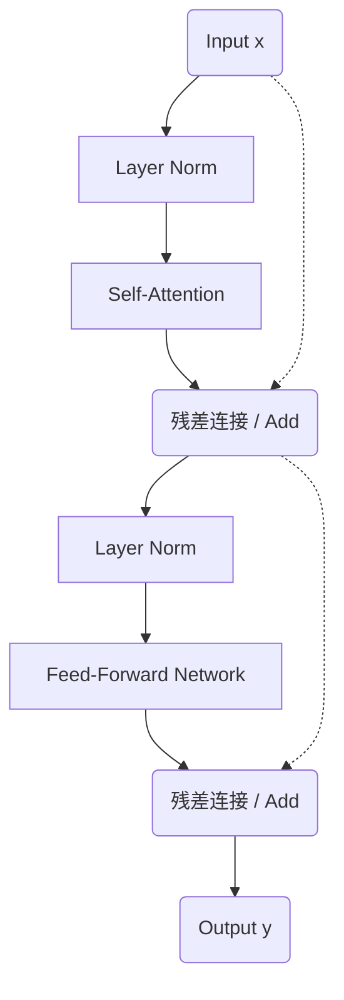

# Week 1 讲义：现代大模型架构设计原理

> **核心目标**：理解现代大模型架构的每个设计选择背后的"为什么"
>
> **学习时间**：6-7 小时
>
> **难度等级**：⭐⭐⭐（需要数学基础，但不需要编程）

---

## 📖 本周知识图谱

2017年 Transformer 论文发表后，大模型从 BERT 的 3.4 亿参数发展到今天的 7B、70B、175B。在这个过程中，架构设计不断演进：

- **Tokenizer**：字符级 → 子词（BPE/SentencePiece）→ 字节级 BPE（tiktoken）
- **激活函数**：ReLU → GELU → SiLU
- **归一化**：Layer Norm → RMSNorm，Post-LN → Pre-LN
- **位置编码**：绝对位置 → RoPE
- **注意力**：Multi-Head → Group Query Attention (GQA)

这些不是随意的改进，而是对"如何让大模型稳定、高效地扩展"这个根本问题的系统性思考。

本讲义的目标：理解这些设计选择的**为什么**。

---

## 🧭 Part 0: 从文字到 Token — Tokenizer 的工作原理

> 本讲义全程使用"token"这个词，但如果不先搞清楚 token 从哪里来、怎么来的，后面的讨论就会缺少根基。Part 0 正是为此而设：**它是理解整个架构的前置知识**。

### 0.1 大模型的第一步：文本不能直接喂给网络

神经网络的一切运算都基于数字。一段文字——比如"你好，世界"——要进入大模型，首先必须被转换成一串整数 ID。完成这个工作的模块叫做 **Tokenizer（分词器）**，它的核心职责是：

$$\text{原始文本（string）} \xrightarrow{\text{Tokenizer}} \text{Token 序列} \xrightarrow{\text{词表映射}} \text{整数 ID 序列}$$

这个过程看似简单，但设计决策（选什么粒度切分？词表多大？如何处理中文、代码和特殊符号？）会深刻影响模型的效率和能力。

### 0.2 为什么不按字符切分？为什么不按单词切分？

直觉上有两个极端选择：

**方案 A：字符级（Character-level）**

```
"hello" → ['h', 'e', 'l', 'l', 'o'] → [72, 101, 108, 108, 111]
```

- 词表极小（ASCII 只有 256 个字符，Unicode 也有限）
- **问题**：序列变得很长，5 个字符的单词需要 5 个 token；模型必须从字符级别自己学习语义组合，难度极大

**方案 B：单词级（Word-level）**

```
"hello world" → ['hello', 'world'] → [8577, 8899]
```

- 序列短，每个 token 语义完整
- **问题**：词表爆炸——英语词汇量 10 万+，加上时态、单复数变形会更多；对于从未见过的词（OOV，Out-Of-Vocabulary），模型完全束手无策

**现代方案：子词（Subword）级别**

介于两者之间——常见词保持完整，罕见词分解为更小的片段：

```
"unhappiness" → ['un', 'happiness']
"tokenization" → ['token', 'ization']
"你好世界" → ['你好', '世', '界']  （取决于词表）
```

这就是 BPE、WordPiece 等算法的核心思路：**用频率来决定粒度**。

### 0.3 BPE：现代 LLM 的主流算法

**BPE（Byte Pair Encoding，字节对编码）** 是 GPT 系列、LLaMA、Qwen 等大多数大模型所使用的分词算法。它最初是一种数据压缩算法，后来被引入 NLP。

#### 核心思想

**对高频相邻字符对反复合并，直到词表达到目标大小。**

算法分两个阶段：
1. **训练阶段**：在大规模语料上学习合并规则，构建词表（vocab）和合并规则表（merge rules）
2. **推理阶段**：对新文本按学好的规则逐步合并，转为 token ID 序列

#### BPE 训练过程（简化示例）

以一个极简的英文语料为例：

**初始状态**：将所有文字拆为字符级，统计词频

| 词（+词尾标记）| 频次 |
|--------------|------|
| `l o w </w>` | 5 |
| `l o w e r </w>` | 2 |
| `n e w e s t </w>` | 6 |
| `w i d e s t </w>` | 3 |

（`</w>` 是词尾标记，区分"low"中的"low"和"lower"中的"low"前缀，避免跨词合并。）

> **💡 表中"频次"是词频，不是字符频次。** BPE 将整个语料折叠为这张"加权词表"：语料中 "low" 出现 5 次，就不必存 5 份 `l o w </w>`，只需存一份并标注词频为 5。这是工程上的压缩，避免把数十亿个重复词例全部展开。**词频将在下一步作为权重，用来计算字符对频次。**

**第 1 轮**：统计所有相邻符号对的频次，找最高频者合并

字符对频次的计算方式：**含该字符对的词的词频之和**（即"这个字符对在整个语料中实际出现了多少次"）。

- `e s`：出现在 `n e w e s t </w>`（词频 6）+ 出现在 `w i d e s t </w>`（词频 3）= **9 次** ← 最高频，合并！

合并后，词表新增符号 `es`，语料变为：

| 词 | 频次 |
|---|------|
| `l o w </w>` | 5 |
| `l o w e r </w>` | 2 |
| `n e w es t </w>` | 6 |
| `w i d es t </w>` | 3 |

**第 2 轮**：再统计，`es t` 共 9 次，合并为 `est`……

如此反复，常见词序列逐渐被合并为单个 token，直到词表大小达到预设目标（如 50,000 或 150,000）。最终结果：
- 高频词（"the"、"and"、"is"）以完整词形式出现
- 低频词（"tokenization"）被拆为 ["token", "ization"]
- 极罕见字符退化为字节级表示（见 0.4 节）

> **📎 配套附录**
>
> - **附录 A.4**：BPE 完整推导示例，含中文文本的字节级处理方式

#### BPE 的本质：一个有损压缩算法

BPE 本质上在做"有损压缩"——它把高频序列压缩为单个符号，牺牲一点解码精确性（分词边界未必符合人类直觉），换取序列长度大幅缩短。**这是 token 概念的核心**：token 不是语言学意义上的"词"，而是频率统计的产物。

### 0.3.5 三种主流子词算法：BPE、WordPiece、Unigram LM

BPE 并不是子词分词的唯一方案。另外两种算法在学术界和工业界也有重要应用，尤其是 BERT 系列普遍采用 WordPiece。它们的核心差异在于**合并/选择子词的标准**不同。

#### WordPiece（BERT、DistilBERT 使用）

WordPiece 的训练流程和 BPE 完全相同（从字符级出发，逐步合并），唯一的区别在于**评分公式**：

$$\text{score}_\text{BPE}(A, B) = \text{count}(AB)$$

$$\text{score}_\text{WordPiece}(A, B) = \frac{\text{count}(AB)}{\text{count}(A) \times \text{count}(B)}$$

WordPiece 用的是**互信息（Mutual Information）**的简化版：衡量"这两个符号共同出现的概率，比它们各自独立出现的乘积高多少"。

**一个直观例子**：假设语料中：
- `e` 出现 100,000 次，`s` 出现 80,000 次，`es` 出现 60,000 次
- `x` 出现 100 次，`y` 出现 120 次，`xy` 出现 80 次

BPE 会优先合并 `es`（绝对频次 60,000 >> 80）；WordPiece 则会优先合并 `xy`，因为 $\frac{80}{100 \times 120}$ 远大于 $\frac{60000}{100000 \times 80000}$——`x` 和 `y` 单独很少见，但几乎每次都一起出现，说明它们在语义上强绑定。

**实际效果**：WordPiece 产生的子词往往更有语义凝聚力，而 BPE 更倾向于把高频字母组合压缩。两者在实践中的分词结果差异不大，但 WordPiece 在理论上更"聪明"。

**标记约定差异**：BERT 风格的 WordPiece 用 `##` 标记续词前缀：

```
"playing"      → ["play", "##ing"]
"tokenization" → ["token", "##ization"]
```

而 BPE/SentencePiece 用 `▁` 标记词首空格：

```
"playing" → ["▁play", "ing"]
```

#### Unigram LM（SentencePiece 可选模式）

Unigram LM 的思路与前两者完全相反：它**从大词表开始，逐步删减**，而不是从字符出发逐步合并。

- **初始化**：从一个非常大的候选词表（所有可能子字符串）出发
- **目标**：找到词表 $V$，使训练语料在以 $V$ 为词表的 Unigram 语言模型下，似然最大
- **迭代**：每次删去"删掉后对总体似然影响最小"的候选词，直到词表缩小到目标大小

Unigram LM 天然支持**概率化分词**——同一段文字可以有多种分法，每种都有概率。训练时按概率加权，起到正则化效果（SentencePiece 的 `--model_type=unigram` 选项）。

#### 三种算法对比

| 特性 | **BPE** | **WordPiece** | **Unigram LM** |
|------|---------|--------------|----------------|
| 构建方向 | 字符级 → 向上合并 | 字符级 → 向上合并 | 大词表 → 向下裁剪 |
| 合并/选择标准 | 频次最高的符号对 | 互信息最高的符号对 | 删去后似然损失最小的词 |
| 分词确定性 | 确定（按 merge rules 顺序）| 确定 | 概率化（支持多种分法）|
| 典型使用者 | GPT 系列、LLaMA、**Qwen** | **BERT**、DistilBERT、Electra | ALBERT、部分 SentencePiece 配置 |
| 现代 LLM 主流 | ✅ 是 | 仅 BERT 系列 | 较少 |

**结论**：对于现代大模型（GPT、LLaMA、Qwen），BPE（尤其是字节级 BPE via tiktoken）是绝对主流；WordPiece 在 BERT 系列中是标准配置，面试中经常作为对比考点；Unigram LM 了解思路即可。

### 0.4 工程实现：tiktoken vs SentencePiece

主流大模型使用两种主要的 Tokenizer 工程实现：

| 特性 | **tiktoken** | **SentencePiece** |
|------|-------------|------------------|
| 典型使用者 | OpenAI GPT 系列、**Qwen** | LLaMA 1/2、T5、BERT |
| 底层算法 | **字节级 BPE**（Byte-level BPE）| BPE 或 Unigram LM（可选）|
| 最小处理单位 | UTF-8 **字节**（0-255）| Unicode 字符（或字节，可配置）|
| OOV 处理 | 永不 OOV（任何字符都能拆为字节）| 同左（字节级模式下）|
| 实现语言 | Rust（极快）| C++（快）|
| 特点 | 空格编码进词首（`" hello"` ≠ `"hello"`）| 用特殊前缀 `▁` 表示词首空格 |

**字节级 BPE** 是关键工程创新：不以 Unicode 字符为最小粒度，而以 **UTF-8 字节**（共 256 种）为起点构建 BPE。这保证了：
- 任何语言、任何字符都能被处理，不存在"未登录词"
- 一个 Emoji 或生僻汉字，最多只会被拆为 1-4 个字节 token

**Qwen 的选择**：基于 tiktoken 的字节级 BPE，词表大小 151,936，对中文词组、代码关键字做了专项收录优化。

### 0.5 Special Tokens：大模型的"控制信号"

词表里除了自然语言子词，还有一类特殊 token，它们不对应任何自然文字，而是用来传递**结构控制信号**：

| Token | 用途 | 示例 |
|-------|------|------|
| `<\|endoftext\|>` | 序列结束标记 | 生成完毕时输出，告诉解码器停止 |
| `<\|im_start\|>` | 对话轮次开始 | Qwen ChatML 格式 |
| `<\|im_end\|>` | 对话轮次结束 | Qwen ChatML 格式 |
| `[PAD]` | 填充 | Batch 训练时将短序列补齐到相同长度 |
| `<s>` / `</s>` | 序列开始 / 结束 | LLaMA、Mistral 风格 |

一段 Qwen 对话在经过 tokenizer 处理后，实际上是这样的 token 序列（省略具体 ID）：

```
<|im_start|> system \n
你是一个有帮助的助手。 <|im_end|> \n
<|im_start|> user \n
今天天气怎么样？ <|im_end|> \n
<|im_start|> assistant \n
```

这个格式叫 **ChatML（Chat Markup Language）**，是将多轮对话结构化为单一 token 序列的约定。Special tokens 对模型来说就像"格式标点"，告诉它当前在哪个角色的发言里、对话在哪里结束。

> Week 3 微调部分和 Week 9 的 Agent 部分，会深入讨论 ChatML 格式如何影响 SFT 数据构建和工具调用设计。（见 **Week 3 讲义 → 3.1 节**）

### 0.6 词表大小与压缩率的工程权衡

#### 压缩率：衡量 Tokenizer 效率的核心指标

**压缩率** = 平均每个 token 对应多少字节（或字符）。压缩率越高，相同 context window 能处理的原始文本越多。

以 GPT-2（50K 词表）和 Qwen（152K 词表）为例：

| 内容类型 | GPT-2（50K 词表）| Qwen（152K 词表）|
|---------|-----------------|-----------------|
| 英文自然语言 | ~4 字节/token | ~4-5 字节/token |
| **中文** | ~1.5 字符/token（接近字符级，效率低）| ~2-2.5 字符/token |
| Python 代码 | ~3-4 字节/token | ~3-5 字节/token |

对中文影响尤为显著：GPT-2 词表中中文词组极少，几乎每个汉字都是独立 token；Qwen 词表收录了大量高频中文词组（"你好"、"什么"等），压缩率大幅提升。

#### 词表大小的系统性权衡

| 维度 | 词表过小（如 32K）| 词表过大（如 300K+）|
|------|-----------------|-------------------|
| 序列长度 | 长（低压缩率，占用更多 context）| 短（高压缩率）|
| Embedding 参数量 | 小 | 大（占总参数的较大比例）|
| 非英语语言效率 | 低（几乎退化为字符级）| 高 |
| 训练收敛 | 快（分类维度低）| 慢（softmax 维度更大）|
| 罕见词处理 | 需要更多 token 步骤 | 部分罕见词有专属 token |

**Qwen 选择 152K 词表**的逻辑：在"中英文双语高效编码 + 代码 + 多语言覆盖"和"embedding 参数量可控（≈622M，占总参数约 8%）"之间的工程折中。LLaMA 用 32K 是因为其设计目标是英文优先。

> 这里所说的 Embedding 参数量（152K × 4096 ≈ 622M），在 Part 5 讨论 Qwen-7B 完整配置时会再次出现，届时你能更直观地感受到词表大小对参数量的影响。

### 0.7 小结：Tokenizer 在完整流水线中的位置

理解了 Tokenizer，我们就能看清文本从"字符串"到"模型输出"的完整路径：

```
原始文本（string）
    │
    ▼  Tokenizer（BPE 分词 → ID 映射）
Token ID 序列（list[int]，长度 seq_len）
    │
    ▼  Embedding 层（词表大小 × d_model 的查找表）
Token Embedding 矩阵（[seq_len, d_model]）
    │
    ▼  + Position Encoding（RoPE，将在 Part 4 讲解）
带位置信息的表示（[seq_len, d_model]）
    │
    ▼  Transformer Blocks × L 层（Part 1-3 的核心）
隐藏表示（[seq_len, d_model]）
    │
    ▼  LM Head（d_model → vocab_size 的线性层）
    ▼  Softmax
下一个 token 的概率分布（[vocab_size]）
    │
    ▼  解码策略（将在 Phase 0 讲义中讨论）
输出 Token ID → Tokenizer 解码 → 输出文本（string）
```

这个图揭示了一个重要的**对称性**：Tokenizer 在输入端做编码，在输出端做解码。词表大小这个参数同时决定了 Embedding 层的查找表维度和 LM Head 的输出维度——这也是为什么大词表会同时增加模型头尾两端的参数量。

---

## 🧭 Part 1: Transformer 核心架构与数值稳定性

### 1.1 基本结构回顾

一个 Transformer Block 的标准流程：



看起来简单，但包含几个关键的设计问题：

1. **为什么用残差连接？**
2. **为什么用 Layer Norm？**
3. **为什么激活函数的选择很重要？**

这三个问题的答案决定了模型能否稳定地训练到 100+ 层。

### 1.2 残差连接的必要性

**问题**：在深层网络中，梯度在反向传播时会指数衰减。

不用残差时的梯度流：
$$
\frac{\partial L}{\partial \theta_{\text{layer1}}} = \frac{\partial L}{\partial \text{out}} \cdot \frac{\partial \text{out}}{\partial \text{layer32}} \cdot ... \cdot \frac{\partial \text{layer2}}{\partial \text{layer1}}
$$

如果每一项都 $< 1$（激活函数导数通常 $< 1$）：
$$
\text{梯度} \approx 0.9^{32} \approx 0.01 \quad (\text{底层无法学习})
$$

**解决方案**：残差连接提供**直接路径**

With residual：
  $$
\begin{aligned}
\frac{\partial L}{\partial \theta_{\text{layer1}}} &= \frac{\partial L}{\partial \text{out}} \cdot [\text{直接路径梯度}(=1) + \text{深层路径梯度}(\approx 0.01)] \\
&\approx \frac{\partial L}{\partial \text{out}} \cdot 1 \quad (\text{梯度不消失！})
\end{aligned}
$$

**结论**：残差连接是深层网络能够训练的基础。

### 1.3 注意力机制的数值稳定性

在 Attention 计算中有一个关键的缩放因子 $\frac{1}{\sqrt{d_k}}$。为什么？

#### 完整的 Attention 过程

**Step 1: 计算 $Q K^T$**

$$
\text{scores} = Q K^T \in \mathbb{R}^{{seq_{len}} \times {seq_{len}}}
$$

每个元素：$\text{scores}[i,j] = \sum_k Q[i,k] \cdot K[j,k]$ （$d_k$ 个随机变量之和）。宏观上这是矩阵乘法，微观上每个元素是一次向量点积——含数值例子的详细说明见**附录 A.3**。

**Step 2: 缩放和 softmax**
$$
  \text{attention}_{\text{weights}} = \text{softmax} \left( \frac{\text{scores}}{\sqrt{d_k}} \right) 
$$

**Step 3: 应用到 V**
$$
 \text{output} = \text{attention}_{\text{weights}} \cdot V  
$$

#### 为什么 $Q K^T$ 的方差是 $d_k$？

假设 Q 和 K 的每个元素独立地从 N(0, 1) 采样：

$$
\text{scores}[i,j] = \sum_{k=1}^{d_k} Q[i,k] \cdot K[j,k]
$$

每一项的方差：
$$
\text{Var}(Q[i,k] \cdot K[j,k]) = E[Q^2] \cdot E[K^2] = 1 \cdot 1 = 1
$$

总方差（独立项之和）：
$$
\text{Var}(\text{scores}[i,j]) = \sum d_k = d_k
$$

所以 $\text{scores}[i,j] \sim N(0, d_k)$

#### 为什么 scores 很大会导致 sharp softmax？

如果 $d_k = 128$，根据 $\text{Var}(\text{scores}) = d_k$，其标准差 $\sigma \approx 11.3$。在正态分布下，scores 的取值范围大约在 $[-3\sigma, 3\sigma]$ 即 $[-34, 34]$ 之间：

Softmax 函数定义为：
$$
\text{softmax}(x_i) = \frac{e^{x_i}}{\sum_j e^{x_j}}
$$

由于指数函数的特性，当输入 $x$ 的数值较大时，微小的差异会被放大。

**softmax 的指数运算示例：**
假设有两个得分 $x_1 = 30, x_2 = 31$，它们的绝对差异仅为 1。
但经过指数运算后：
$$
\exp(30) \approx 1.07 \times 10^{13}, \quad \exp(31) \approx 2.90 \times 10^{13}
$$
在 softmax 中，较大的值会迅速占据绝大部分权重，使得分布变得极其陡峭（Sharp）。

这会导致两个严重后果：

1. **输出极化**：结果接近 $[0, 0, ..., 1, 0, ...]$（几乎独热分布），模型失去了对多个相关信息的关注能力。
2. **梯度消失**：Softmax 在这些区域的导数极小，导致反向传播时梯度几乎为 0。

**问题：**

- $\exp(30)$ 数值溢出
- 梯度 $\to 0$（梯度消失）
- 模型无法有效训练

#### 加缩放因子后的效果

缩放后：$\text{scaled}_{scores} = \frac{\text{scores}}{\sqrt{128}} \approx \frac{\text{scores}}{11.3}$
  范围：约 $[-3, 3]$

softmax 的结果：
$$
\exp(3) \approx 20, \quad \exp(-3) \approx 0.05
$$

输出变成真正的分布：
  $[0.02, 0.05, 0.15, 0.3, 0.3, 0.15, 0.02, 0.01]$

梯度正常，训练稳定。

**结论**：缩放因子 $\frac{1}{\sqrt{d_k}}$ 是数值稳定性的关键。

---

## 🧭 Part 2: 激活函数设计

### 2.1 为什么激活函数很重要？

不用激活函数的网络：
$$
y = W_2 \cdot (W_1 \cdot x) = (W_2 \cdot W_1) \cdot x
$$
这只是线性变换的复合，本质上还是线性。
线性模型无法学习非线性关系。

激活函数的作用：**引入非线性**。

> **💡 Transformer 中非线性的位置**：激活函数（ReLU / GELU / SiLU）只出现在 FFN 里；Attention 的 Q/K/V 投影和输出投影均为纯线性变换。不过 Attention 中的 **Softmax** 本质上也是非线性操作（指数放大大 score、压制小 score），只是其目的是归一化为概率分布以实现"选择性聚焦"，通常不归入"激活函数"这个概念。

### 2.2 三种主要激活函数的对比

#### ReLU: Rectified Linear Unit

定义：$\text{ReLU}(x) = \max(0, x)$

**优点：**

- 计算简单快速
- 稀疏激活（负值输出 0）

**缺点：**

- **Dead ReLU 问题**：如果 $x < 0$ 的梯度为 0，该神经元"死亡"，永远停止学习
- 不平滑，在 $x=0$ 处不可导

#### GELU: Gaussian Error Linear Unit

**定义：**
$$
\text{GELU}(x) = x \cdot \Phi(x)
$$
其中 $\Phi(x)$ 是标准正态分布的**累积分布函数**（Cumulative Distribution Function, CDF）。

**数学定义：**
$$
\Phi(x) = P(X \le x) = \int_{-\infty}^{x} \frac{1}{\sqrt{2\pi}} e^{-\frac{t^2}{2}} dt
$$
它表示随机变量 $X$ 取值小于或等于 $x$ 的概率。

**直觉理解：**
$$
\Phi(x) = P(Z \le x), \quad Z \sim N(0, 1)
$$
$\text{GELU}(x) = x \cdot (x \text{ 来自高概率区的概率})$

- 当 $x = 2$ 时：$\Phi(2) \approx 0.977, \text{GELU}(2) \approx 1.95$（大部分通过）
- 当 $x = -2$ 时：$\Phi(-2) \approx 0.023, \text{GELU}(-2) \approx -0.05$（被阻止）

**优点：**

- 平滑曲线，处处可导
- 避免 dead neuron 问题

**缺点：**

- 计算复杂（需要计算 $\Phi(x)$）
- 比 ReLU 慢

#### SiLU (Swish): Sigmoid Linear Unit

**定义：**
$$
\text{SiLU}(x) = x \cdot \text{sigmoid}(x)
$$
$$
\text{sigmoid}(x) = 1 / (1 + e^{-x})
$$

**直觉理解：**
sigmoid 充当一个"门控"机制：

- 当 $x$ 很很大时：$\text{sigmoid}(x) \approx 1$，门完全打开
- 当 $x$ 很很小时：$\text{sigmoid}(x) \approx 0$，门关闭
- 当 $x = 0$ 时：$\text{sigmoid}(0) = 0.5$，门半开

**为什么 SiLU 比 GELU 更好？**

**数学分析：**
$$
\text{SiLU}'(x) = \text{sigmoid}(x) + x \cdot \text{sigmoid}(x) \cdot (1-\text{sigmoid}(x))
$$

- 当 $x$ 很大时：$\text{SiLU}'(x) \approx 1$（梯度通过，不消失）
- 当 $x$ 很小时：$\text{SiLU}'(x) \approx 0$（梯度缓和，不激进）
- 没有死亡区域

**相比 GELU：**

- 自门控机制更有效地调节信息流
- 实验表明性能好 2-3%

**相比 ReLU：**

- 更平滑，梯度流动更稳定

**优点：**

- 平滑性与 GELU 相同
- 自门控特性
- 性能最优
- 计算复杂度相似

现代大模型的标准选择：**SiLU**（LLaMA、Qwen 等）

#### SwiGLU: SiLU 在 FFN 层的应用

现代模型（LLaMA、Qwen、Mistral 等）不仅使用 SiLU 作为激活函数，还对 FFN 层的结构进行了改造，采用了 **SwiGLU (Swish-Gated Linear Unit)** 机制。

**传统 FFN 结构**（GPT 系列）：

```
x → Linear_up (d→4d) → GELU → Linear_down (4d→d) → output
```

**SwiGLU FFN 结构**（LLaMA/Qwen）：

```
x → gate_proj (d→intermediate) → SiLU ─┐
                                       × (逐元素相乘)
x → up_proj (d→intermediate) ──────────┘
                    ↓
              down_proj (intermediate→d) → output
```

**数学表达**：
$$\text{FFN}_{\text{SwiGLU}}(x) = (\text{SiLU}(xW_{\text{gate}}) \odot xW_{\text{up}}) W_{\text{down}}$$

其中 $\odot$ 表示逐元素相乘（Hadamard 积）。

**关键区别**：

| 特性       | 传统 FFN               | SwiGLU FFN                        |
| ---------- | ---------------------- | --------------------------------- |
| 投影层数量 | 2 个                   | **3 个** (gate + up + down)       |
| 激活函数   | GELU/ReLU              | SiLU                              |
| 门控机制   | 无                     | 有（gate_proj 提供）              |
| 参数量     | $2 \times d \times 4d$ | $3 \times d \times \frac{8d}{3}$ * |

*注：为保持总参数量相近，SwiGLU 的 intermediate_size 通常设为 $\frac{8d}{3}$ 而非 $4d$。

**为什么 SwiGLU 更好？**

1. **门控机制**：`gate_proj` 产生的门控信号可以**选择性地抑制或放大**不同维度的信息流，类似于 LSTM 中的门控思想
2. **更强的表达能力**：两路信息（gate 和 up）的交互比单纯的非线性激活更灵活
3. **实验验证**：PaLM、LLaMA 论文都证明 SwiGLU 比传统 FFN 性能提升 1-2%

> [!TIP]
> **面试重点**：当被问到"Qwen/LLaMA 的 FFN 层有什么特点"时，能够说出 SwiGLU 的三层结构（gate_proj, up_proj, down_proj）及其门控机制，是区分度很高的回答。

### 2.3 激活函数与 FFN 结构的选择决策

**激活函数选择：**

| 场景       | 推荐     | 说明                           |
| ---------- | -------- | ------------------------------ |
| 性能优先   | **SiLU** | 业界标准，已被 LLaMA/Qwen 验证 |
| 速度优先   | ReLU     | 最快，但性能有损失             |
| 兼容性考虑 | GELU     | 部分旧模型/框架使用            |

**FFN 结构选择：**

| 场景       | 推荐结构         | 说明                              |
| ---------- | ---------------- | --------------------------------- |
| 新模型开发 | **SwiGLU** (3层) | 性能最优，LLaMA/Qwen/Mistral 标配 |
| 兼容旧代码 | 传统 FFN (2层)   | GPT 系列使用，参数量略少          |

**结论：**

- **激活函数**：现代 7B+ 模型几乎都用 **SiLU**
- **FFN 结构**：2023 年后的主流开源模型一律采用 **SwiGLU**
- 两者结合（SiLU + 门控机制）是当前的最佳实践

---

## 🧭 Part 3: 归一化层的原理

### 3.1 为什么需要归一化？

**Internal Covariate Shift (ICS) 问题**（Batch Normalization 论文，Ioffe & Szegedy 2015）：

在深层网络中，前面几层的权重不断更新，导致后面各层的**输入分布不断变化**。这迫使后续层不断重新适应新的分布，学习效率低下。

**例子：**
第 $l$ 层的输出 $x_l$ 分布为 $N(\mu_l, \sigma_l^2)$
第 $l+1$ 层基于这个分布学到权重 $W_{l+1}$

但前 $l$ 层的权重更新导致 $\mu_l$ 和 $\sigma_l^2$ 变化
$W_{l+1}$ 需要不断重新适应
$\to$ 学习不稳定

**解决方案**：归一化

**通用公式：**
$$
\hat{y} = \frac{x - \mu}{\sqrt{\sigma^2 + \epsilon}}    \quad (\text{稳定分布})
$$
$$
y = \gamma \cdot \hat{y} + \beta                \quad (\text{恢复表达能力})
$$

**关键：**

- 移除均值、缩放方差 $\to$ 稳定分布
- $\gamma$ 和 $\beta$ 的学习 $\to$ 保持表达能力

### 3.2 不同归一化方式的对比

#### Batch Normalization

**计算：** 在 batch 维度求统计量
$$
\mu = \text{mean}(x_{\text{batch}})
$$
$$
\sigma^2 = \text{var}(x_{\text{batch}})
$$

**优点：**

- 在 CNN 中效果很好

**缺点（为什么不用于大模型）：**

- **依赖 batch size**：分布式训练中，每个 GPU 上 batch 很小，统计量不稳定
- **序列模型不适配**：对变长序列困难
- **推理时行为不同**：需要维护指数移动平均

#### Layer Normalization

**计算：** 在特征维度求统计量
$$
\mu = \text{mean}(x_{\text{feature}})
$$
$$
\sigma^2 = \text{var}(x_{\text{feature}})
$$

**归一化：**
$$
\text{LN}(x) = \frac{x - \mu}{\sqrt{\sigma^2 + \epsilon}} \cdot \gamma + \beta
$$

**逻辑：** 对每个样本的 $d_{\text{model}}$ 维度独立归一化，不同样本之间互不影响。

**优点：**

- 不依赖 batch size（稳定）
- 自然适配可变长序列
- 推理时与训练一致
- Transformer 的标准选择

现在的问题：是否所有步骤都需要？

#### Root Mean Square Normalization (RMSNorm)

**观察：**
在于大模型上，Layer Norm 的两个操作都必要吗？

- 移除均值（减去 $\mu$）
- 缩放方差（除以 $\sigma$）

**实验发现：**
在于大模型上，均值往往接近 0
真正的稳定作用来自"缩放方差"
移除均值反而不那么重要

**RMSNorm 的设计：**
$$
\text{RMS}(x) = \sqrt{\text{mean}(x^2)}
$$
$$
\text{RMSNorm}(x) = \frac{x}{\text{RMS}(x)} \cdot \gamma
$$
只保留方差缩放，去掉均值移除

**对比：**

- Layer Norm：$\hat{y} = \frac{x - \mu}{\sqrt{\sigma^2 + \epsilon}}$，然后 $y = \gamma \cdot \hat{y} + \beta$
- RMSNorm：$y = \frac{x}{\text{RMS}(x)} \cdot \gamma$

RMSNorm 少了一个操作：没有 $\beta$！

**为什么没有 $\beta$？**
RMSNorm 没有改变均值，只改变方差
所以均值的信息仍然存在
$\gamma \cdot \hat{y}$ 可以恢复方差，$\beta$ 不需要

**优势：**

- 计算更简单（一步变两步）
- 显存占用减少
- 推理速度快 7-8%
- 性能基本相同

**数据支持（Qwen、LLaMA 论文）：**

- 7B 模型：推理快 7-8%
- 70B 模型：推理快 10-12%

### 3.3 归一化在 Transformer 中的位置

**Post-LN vs Pre-LN**

**Post-LN（原始 Transformer）：**
$$
\text{Attention 输出} + \text{残差} + \text{LN}
$$
$$
\text{FFN 输出} + \text{残差} + \text{LN}
$$

- **问题**：深层网络时梯度在 LN 处增大 $\to$ 梯度爆炸
- 需要较小学习率

**Pre-LN（现代标准）：**
$$
\text{LN} + \text{Attention} + \text{残差}
$$
$$
\text{LN} + \text{FFN} + \text{残差}
$$

- **优势**：梯度直接通过残差路径 $\to$ 流动稳定
- 可以用更大学习率 $\to$ 收敛更快

现代模型的标准配置（GPT-3、LLaMA、Qwen）

**QK-Norm：一种针对 Attention 的归一化变体**

除了上述对残差流做归一化的方案，还有一种针对 Attention 内部的设计：在计算注意力 score 之前，对 Q 和 K 向量分别做 RMSNorm。其动机是，随着模型规模和序列长度增大，$QK^\top$ 点积可能失控增大，导致 Softmax 极度尖锐（attention entropy 坍缩，模型几乎只关注一个 token），影响训练稳定性。QK-Norm 通过钉住 Q/K 的模长从根源上防止这个问题。目前 Gemma 2（Google）等模型已采用此设计，但 LLaMA 3、Qwen、DeepSeek 系列尚未跟进——主流做法通过调好学习率、warmup 和梯度裁剪已能满足稳定性需求，QK-Norm 的收益在超长上下文和超大规模训练时更为突出。因此它目前是"有价值的非主流选项"，而非行业标准。

### 3.4 小结

大模型中的标准配置：
  ✓ 用 RMSNorm 而不是 Layer Norm
    计算快、显存少、性能相同

  ✓ 用 Pre-LN 而不是 Post-LN
    梯度流动更稳定、能用更大学习率

  ✓ 在每个 Attention 和 FFN 前都加 RMSNorm
    保证每一层的输入分布稳定

---

## 🧭 Part 4: 位置编码的演进

### 4.1 为什么需要位置编码？

Attention 的特性：
  $\text{scores} = Q K^T$

  这个计算对 token 的顺序是"对称的"

  例如："cat sat mat" 和 "mat sat cat"
  如果只看 Q、K、V 的值，可能得到相同结果

问题：NLP 中位置很重要
  "I love you" vs "You love I"
  含义完全不同

解决方案：编码位置信息

### 4.2 绝对位置编码

最初的方案（Vaswani et al. 2017）：

对于位置 $pos$ 和维度 $d$：
$$
\text{PE}(pos, 2i) = \sin(pos / 10000^{2i/d_{\text{model}}})
$$
$$
\text{PE}(pos, 2i+1) = \cos(pos / 10000^{2i/d_{\text{model}}})
$$

然后加到 token embedding 上：
$$
\text{input} = \text{token}_{\text{embedding}} + \text{position}_{\text{encoding}}
$$

**设计直觉：**

- 用不同频率的正弦波编码位置
- 低频波捕捉长距离关系
- 高频波捕捉短距离关系

**问题：**

- **外推性差**：训练长度 $\le 2048$，推理时 $4096 \to$ 性能下降 45%
- **量级匹配问题**：PE 可能被 embedding 学习覆盖

### 4.3 RoPE: Rotary Position Embedding

革命性的思想：**在注意力计算中直接旋转 Q 和 K**

**核心思想：**

- 与其在 embedding 中加位置信息
- 不如在注意力计算中旋转 Q 和 K

**数学设计：**

**RoPE 要求同时对 $Q$ 和 $K$ 进行旋转**（V 不旋转）。

我们将 $Q$ 和 $K$ 中的每个向量（即对应每个 token 的 $d_{\text{model}}$ 维向量）分成 $d_{\text{model}}/2$ 个二维对。

对于位于位置 $m$ 的向量（这里以 query 向量 $q$ 为例，key 向量 $k$ 的处理完全相同），其每一对分量 $(q_{2i}, q_{2i+1})$ 都会乘以一个 **2D 旋转矩阵**。

这个过程的几何与代数直觉非常清晰：

1.  **调整角度（几何意义）**：本质上就是把向量在二维平面上拨动了一个**角度 $m\theta_i$**（改变相位）。该角度由**位置 $m$** 与**频率 $\theta_i$** 乘积决定：位置越往后，旋转角度越大。这种设计巧妙之处在于，当计算 $Q$ 和 $K$ 的内积时，其结果仅取决于它们的**相对距离** $(m-n)$。
2.  **保持模长（正交性质）**：该矩阵是一个**正交矩阵**（Orthogonal Matrix）。正交变换是保长变换，只改变方向，不改变向量的模长（即保留了原始特征的强度）。
3.  **矩阵乘法（代数实现）**：这个“旋转过程”在数学形式上就是一次矩阵乘法。

旋转公式如下：
$$
\begin{bmatrix} q'_{2i} \\ q'_{2i+1} \end{bmatrix} = \begin{bmatrix} \cos(m\theta_i) & -\sin(m\theta_i) \\ \sin(m\theta_i) & \cos(m\theta_i) \end{bmatrix} \begin{bmatrix} q_{2i} \\ q_{2i+1} \end{bmatrix}
$$

其中：

- $m =$ 位置
- $\theta_i = 10000^{-2i/d_{\text{model}}}$（频率）
- $i =$ 维度对索引

**扩展到整个向量：分块对角矩阵**

如果我们把所有 $d/2$ 个二维对的旋转组合起来，对于整个 $d$ 维向量 $q$，其完整的旋转操作可以表示为一个巨大的 **$d \times d$ 分块对角矩阵** $R_{\Theta, m}$ 与 $q$ 的乘法：

$$
R_{\Theta, m} = \begin{pmatrix}
R(m\theta_0) & 0 & \cdots & 0 \\
0 & R(m\theta_1) & \cdots & 0 \\
\vdots & \vdots & \ddots & \vdots \\
0 & 0 & \cdots & R(m\theta_{d/2-1})
\end{pmatrix}
$$

$$
q_{\text{rotated}} = R_{\Theta, m} \cdot q
$$

*   **稀疏性**：注意这个大矩阵极度稀疏（除了对角线上的 $2 \times 2$ 块，其余全是 0）。
*   **高效实现**：在实际代码中，我们**绝不会**真的构建这个巨大的矩阵，而是利用其稀疏性质，直接进行逐对元素的计算（即上面的 $2 \times 2$ 公式），这就是为什么 RoPE 如此高效的原因。当 $Q$、$K$ 扩展为完整序列矩阵时，旋转是**逐行**施加的（每行对应一个 token、一个旋转矩阵），详见**附录 A.2**。

**复数表示（更简洁）：**

将二维分量对 $(q_{2i}, q_{2i+1})$ 视为复平面上的一个点：

- $x, y$：对应的原始特征分量（即 $q_{2i}, q_{2i+1}$）
- $z = x + iy$：特征的复数表示
- $z'$：旋转后的特征，$z' = z \cdot e^{im\theta}$

利用欧拉公式 $e^{im\theta} = \cos(m\theta) + i\sin(m\theta)$，其中 $m\theta$ 代表由位置 $m$ 与频率 $\theta$ 共同决定的**旋转角度（相位）**。在复数域中，乘以 $e^{im\theta}$ 这一操作在几何上完美等价于对向量进行旋转。

> **为什么完全等价？**
> 复数乘法 $(x + iy) \cdot (\cos\theta + i\sin\theta)$ 展开后得到：
> $(x\cos\theta - y\sin\theta) + i(x\sin\theta + y\cos\theta)$
> 这与 2D 旋转矩阵 $\begin{pmatrix} \cos\theta & -\sin\theta \\ \sin\theta & \cos\theta \end{pmatrix} \begin{pmatrix} x \\ y \end{pmatrix}$ 的计算结果在代数形式上完全一致。
>
> **是先有理论还是后发现的？**
> 这是**先有理论推导**。RoPE 的作者（Su et al.）并非偶然发现旋转矩阵好用，而是从一个明确的数学目标出发：寻找一个变换函数 $f(q, m)$，使得变换后的向量内积 $\langle f(q, m), f(k, n) \rangle$ 仅取决于它们的**相对距离** $(m-n)$。通过在二维空间求解这个泛函方程，推导出的唯一解就是这种旋转变换。复数表示则是描述这种旋转最自然、最优雅的数学语言。

---

#### 💡 核心疑问：为什么要分为"二维对"？

这主要源于数学上**旋转**（Rotation）操作的本质特性。

1.  **旋转本质上是二维平面上的操作**：
    在欧几里得几何中，**旋转**是围绕某个点（或轴）进行的。最基本、最自然的旋转定义是在二维平面上。一个二维向量 $\begin{pmatrix} x \\ y \end{pmatrix}$ 旋转角度 $\theta$ 的公式是完全封闭且完美的：
    $$
    R(\theta) = \begin{pmatrix} \cos\theta & -\sin\theta \\ \sin\theta & \cos\theta \end{pmatrix}
    $$
    或者利用**复数**（Complex Numbers）这一强大的数学工具来理解：二维向量 $(x, y)$ 可以完美映射为复数 $z = x + iy$。复数的乘法 $z \cdot e^{i\theta}$ 正好对应了几何上的旋转。这也是 RoPE（Rotary Positional Embedding）名字的由来和理论基石。

2.  **高维空间的旋转**：
    对于 $d$ 维空间（例如 $d=128$），我们并不直接定义一个复杂的 $128 \times 128$ 旋转矩阵，而是将其分解为 **$d/2$ 个独立的二维子空间**。就像把一根 $d$ 维的绳子看作 $d/2$ 对独立的线股，每一对都在自己的平面上旋转。

    这样做的好处是计算极其高效（$O(d)$ 而不是矩阵乘法的 $O(d^2)$），并且数学性质清晰。

3.  **对维度的要求**：
    是的，这种设计确实不仅**约定俗成**要求 $d$ 是偶数，而且在**数学实现上**也硬性要求维数必须能被 2 整除。

    - 在 Transformer 架构中，`head_dim`（每个注意力头的维度，即 $d_k$）通常都被设计为 64、128 等偶数（通常是 $2^n$），所以这在工程上从未成为障碍。
    - 如果遇到奇数维度（极罕见情况），通常会 pad 一个 0 维凑成偶数，或者保留最后一个维度不进行旋转。

**总结：**
分为“二维对”是因为**复数乘法（即二维旋转）是实现 RoPE 相对位置特性的最小数学单元**。

**补充：欧拉公式与相对位置的关联**

1.  **欧拉公式**：$e^{i\theta} = \cos\theta + i\sin\theta$。它允许我们将二维平面的坐标 $(x, y)$ 映射为复数 $z$，旋转操作则简化为复数乘法 $z \cdot e^{i\theta}$。
2.  **核心指数性质**：$e^{ia} \cdot e^{ib} = e^{i(a+b)}$。这意味着两次旋转的角度可以直接相加。
3.  **如何产生相对位置**：
    - $q$ 只知道自己的绝对位置 $m$
    - $k$ 只知道自己的绝对位置 $n$
    - 但是通过 $e^{i(a+b)}$，我们得到了 $q$ 和 $k$ 之间的相对位置 $(n-m)$ 的旋转角度。

---

#### 🌟 直观例子：时钟上的指针

想象一个时钟：
1.  **Token $q$** 是时针，它原本指向 12 点。
2.  **Token $k$** 也是时针，它也指向 12 点。
3.  **旋转操作**：根据 Token 在句子中的位置 $m$，我们将时针顺时针旋转 $m$ 个刻度。

*   如果 $q$ 在位置 2，它被旋转到 **2 点**。
*   如果 $k$ 在位置 5，它被旋转到 **5 点**。
*   **点积（计算关联度）**：点积的大小取决于两个向量之间的**夹角**。
*   在这个例子中，夹角是 $5 - 2 = 3$ 个刻度。

即使我们将整个句子向后平移 10 个位置（$q$ 到位置 12，$k$ 到位置 15），它们的夹角依然是 $15 - 12 = 3$ 个刻度。**注意力机制感知到的是它们之间的“距离”，而不是它们在钟面上的绝对位置。**

---

#### 💻 RoPE 的 PyTorch 实现

主流实现（LLaMA、Mistral、Qwen、DeepSeek 均采用此方式）基于**复数视图**：把相邻两个实数分量 $(x_{2i},\, x_{2i+1})$ 视为一个复数，旋转操作直接变为复数乘法 $z \cdot e^{im\theta}$，与上面的数学公式一一对应。

```python
import torch

def precompute_freqs_cis(seq_len: int, head_dim: int, theta: float = 10000.0):
    “””
    预计算旋转频率，返回复数张量 freqs_cis，shape [seq_len, head_dim/2]
    每个元素对应欧拉公式中的 e^{i·m·θ_k}
    “””
    # θ_k = 10000^{-2k/d}，共 head_dim/2 个不同频率，对应讲义中 d/2 个二维对
    freqs = 1.0 / (theta ** (torch.arange(0, head_dim, 2).float() / head_dim))
    t = torch.arange(seq_len).float()          # 位置索引 m = 0, 1, ..., seq_len-1
    freqs = torch.outer(t, freqs)              # [seq_len, head_dim/2]，第(m,k)项 = m·θ_k
    # torch.polar(r, φ) = r·e^{iφ}；模长为 1（正交变换），辐角为 m·θ_k
    return torch.polar(torch.ones_like(freqs), freqs)   # 复数张量 [seq_len, head_dim/2]

def apply_rotary_emb(xq: torch.Tensor, xk: torch.Tensor, freqs_cis: torch.Tensor):
    “””
    对 Q、K 施加 RoPE 旋转（V 不旋转）
    xq, xk:    [batch, seq_len, n_heads, head_dim]
    freqs_cis: [seq_len, head_dim/2]，复数张量
    “””
    # 步骤 1：将相邻两个实数视为一个复数
    # [x0, x1, x2, x3, ...] → [x0+i·x1, x2+i·x3, ...]
    # 对应讲义：将二维分量对 (q_{2i}, q_{2i+1}) 视为复平面上的一个点 z = q_{2i} + i·q_{2i+1}
    xq_ = torch.view_as_complex(xq.float().reshape(*xq.shape[:-1], -1, 2))
    xk_ = torch.view_as_complex(xk.float().reshape(*xk.shape[:-1], -1, 2))

    # 步骤 2：复数乘法 = 旋转
    # z' = z · e^{i·m·θ}，对应讲义公式：z' = z · e^{im\theta}
    freqs_cis = freqs_cis.unsqueeze(0).unsqueeze(2)          # → [1, seq_len, 1, head_dim/2]
    xq_out = torch.view_as_real(xq_ * freqs_cis).flatten(3)  # 复数 → 实数，还原 head_dim
    xk_out = torch.view_as_real(xk_ * freqs_cis).flatten(3)

    return xq_out.type_as(xq), xk_out.type_as(xk)
```

> **🔧 补充：分半旋转（GPT-NeoX 风格）**
>
> 另一种等价实现将向量**前后两半**配对：$(x_0,\, x_{d/2})$、$(x_1,\, x_{d/2+1})$…，用 `torch.cat([x1*cos - x2*sin,  x1*sin + x2*cos])` 实现，见于早期 HuggingFace 移植版本及 GPT-NeoX。两者施加的旋转角完全相同，只是维度排列不同，**混用会导致 KV Cache 错位**。
>
> `sampleCode/week1/rope_demo.py` 包含两种风格的完整实现与对比，以及相对位置性质的验证实验，可直接运行。

#### RoPE 的核心优势 1: 相对位置编码效果

表面上看：RoPE 是"绝对"位置编码（每个位置一个旋转角）

但实际上产生了"相对位置编码"的效果！

**证明：**
$$
Q'_m = \text{Rotate}(Q_m, m)
$$
$$
K'_n = \text{Rotate}(K_n, n)
$$

点积：
$$
Q'_m \cdot K'_n = Q_m \cdot \text{Rotate}(K_n, n-m)
$$

**关键：** 只依赖于 $(n - m)$（相对位置！）完整的矩阵代数推导（含旋转矩阵角度叠加性质的证明）见**附录 A.1**。

**效果：**

- 模型学到的是"相对位置信息"
- 而不是"绝对位置信息"

#### RoPE 的核心优势 2: 外推性强

**RoPE 的外推能力：**

- 训练长度：2048
- 推理长度：4096

**原始 PE：**

- PE 值超出训练范围
- 性能下降 45%

**RoPE（带 interpolation）：**

- 即使 $m > 2048$，旋转角仍有意义
- 性能下降 $< 5\%$（实验：LLaMA 论文）

**为什么？**

- 相对位置 $m-n$ 仍然有意义
- 不受序列长度的限制

#### RoPE 的核心优势 3: 数值稳定性

**旋转矩阵的正交性：**
$$
R^T \cdot R = I \quad (\text{单位矩阵})
$$

**后果：**
旋转不改变向量的模长
$$
\|Rx\| = \|x\|
$$

**好处：**

- 不会导致梯度爆炸或消失
- 数值稳定

**对比绝对 PE：**

- PE 直接加到 embedding
- 可能改变模长
- 可能导致数值不稳定

#### 正交矩阵的关键性质证明

**向量旋转后的模长：**

$v$ 的模长： $\|v\| = \sqrt{v^T \cdot v}$

旋转后 $v' = R \cdot v$ 的模长：
$$
\begin{aligned}
\|v'\| &= \sqrt{v'^T \cdot v'} \\
         &= \sqrt{(Rv)^T \cdot (Rv)} \\
         &= \sqrt{v^T \cdot R^T \cdot R \cdot v} \\
         &= \sqrt{v^T \cdot I \cdot v} \quad (\text{因为 } R^T \cdot R = I) \\
         &= \sqrt{v^T \cdot v} \\
         &= \|v\|
\end{aligned}
$$
所以模长完全不变！

### 4.4 RoPE 的改进方向

基础 RoPE 的局限：
  在超长序列上（> 100k tokens）
  性能仍有下降（5-15%）

改进 1: Position Interpolation
  思路：在训练和推理间内插
  方法：缩放旋转角 $θ_i' = λ·θ_i$，其中 $λ = L_train/L_test$
  效果：保持外推性同时减少性能下降

改进 2: YaRN (Yet another Rotation aNgle)
  更复杂的缩放策略
  对超长序列有更好的支持
  Qwen 等模型正在采用

改进 3: NTK-Aware RoPE
  基于数论的改进
  对某些特定长度特别有效

> **🔭 深入阅读**
>
> 以上三种外推方法（PI / NTK-Aware / YaRN）以及更进一步的 **LongRoPE** 的完整原理推导、数值示例与方案对比，将在 **Week 8 讲义 §4.2 节**（长序列外推策略）展开讲解，配套数学推导与具体计算过程见 **Week 8 讲义附录 A.5**。
>
> 此外，RoPE 如何扩展到图像、视频、音频等多模态场景（M-RoPE、TMRoPE），详见 **Week 8 讲义 §3.2 节**。

---

## 🧭 Part 5: 架构设计的综合决策

### 5.1 为什么 Qwen 的架构这样设计？

**Qwen-7B 的选择：**

1.  **激活函数：SiLU**
    - 性能最优（vs GELU ~2-3% 更好）
    - 足够快
    - 已被 LLaMA、PaLM 验证

2.  **归一化：RMSNorm + Pre-LN**
    - 推理快 7-8%
    - 梯度更稳定
    - 训练收敛更快

3.  **位置编码：RoPE**
    - 外推性强
    - 相对位置编码效果
    - 数值稳定

4.  **注意力机制：Group Query Attention (GQA)**
    - 参数量少 50%（vs Multi-Head）
    - KV Cache 显存减少 90%
    - 推理速度提升 10-20%
    - 精度基本无损

**共同点：**

- 都是 2021-2023 年验证有效
- 都能提升性能或效率
- 都是业界标准配置

### 5.2 架构参数的选择

给定总参数量 N，如何分配？

**Transformer Block 的参数分解：**

- **Self-Attention 参数数量：**
    - Q, K, V 投影：$3 \times d_{\text{model}} \times d_{\text{model}}$
    - 输出投影：$d_{\text{model}} \times d_{\text{model}}$
    - 总计：约 $4 \times d_{\text{model}}^2$

- **FFN 参数数量：**
    - 第一层：$d_{\text{model}} \times d_{\text{ffn}}$
    - 第二层：$d_{\text{ffn}} \times d_{\text{model}}$
    - 总计：$2 \times d_{\text{model}} \times d_{\text{ffn}}$
    - 其中 $d_{\text{ffn}} = 4 \times d_{\text{model}}$（标准）
    - 所以 FFN 参数 $\approx 8 \times d_{\text{model}}^2$

- **每个 Block 的总参数：**
    $$4d_{\text{model}}^2 + 8d_{\text{model}}^2 = 12d_{\text{model}}^2$$

- **总模型参数：**
    $$N \approx 12 \times d_{\text{model}}^2 \times \text{num\_layers} + \text{embedding} + \text{output}$$
    简化：$N \approx 12 \times d_{\text{model}}^2 \times L$

#### 宽度 vs 深度的权衡

**给定总参数 $N$，有两种极端配置：**

**配置 A: 宽而浅**

- $d_{\text{model}} = 2048, \text{num}_{layers} = 8$
- $N \approx 12 \times 2048^2 \times 8 \approx 4\text{B}$
- **问题**：深度不足，容量有限

**配置 B: 深而窄**

- $d_{\text{model}} = 512, \text{num}_{layers} = 32$
- $N \approx 12 \times 512^2 \times 32 \approx 1\text{B}$
- **问题**：显然计算有问题，但原理对

**实证结果（Scaling Law、LLaMA）：**

- 参数量相同时，深而窄优于宽而浅
- **原因**：深度带来的表达能力增益 > 宽度的增益

**建议：优先增加深度**

- 深的网络能学习复杂的多层特征交互

#### 其他关键参数

1.  **头数 (num\_heads) 和头维度 (head\_dim)**

    $$d_{\text{model}} = \text{num}_{heads} \times \text{head}_{dim}$$

    - **标准选择：** `num_heads = 32`, `head_dim = d_model / 32`
    - **为什么 32？**
        - 经验最优点
        - 太少（8）：每个头维度太大，难学习
        - 太多（128）：每个头维度太小，信息丢失

2.  **FFN 维度**

    - **标准**：$d_{\text{ffn}} = 4 \times d_{\text{model}}$
    - **为什么是 4 倍？**
        - 经验和实验的最优平衡
        - 太小（2倍）：容量不足
        - 太大（8倍）：收益递减

3.  **词表大小**

    - BERT：30K
    - GPT-2：50K
    - LLaMA：32K
    - Qwen：151,936（多语言）

    - **权衡：**
        - 太小：低效编码，中文等非英语语言序列极长
        - 太大：embedding 层参数增多，softmax 维度大

    > 词表大小背后的完整权衡（压缩率、语言效率、BPE 如何决定词表内容）见 **Part 0.6 节**。

#### Qwen-7B 的完整配置

**模型参数：**

- `num_layers` = 32
- `d_model` = 4096
- `d_ffn` = 11008 ($\approx 2.7 \times d_{\text{model}}$)
- `num_heads` = 32
- `num_key_value_heads` = 8  (GQA)
- `head_dim` = 128

**其他：**

- `vocab_size` = 151936
- `seq_length` = 2048  (预训练)
- `rope_theta` = 10000

**参数量计算：**

- Embedding: $151936 \times 4096 \approx 622\text{M}$
- 32 层：$32 \times (12 \times 4096^2) \approx 6.4\text{B}$
- Output: $4096 \times 151936 \approx 622\text{M}$
- 总计：$\approx 7.2\text{B}$（考虑其他参数，净值 ~7B）

**这个配置的特点：**

- 深度优先（32 层）
- 注意力足够细（32 头）
- FFN 适度过参数化
- 使用 GQA 节省 KV Cache
- 词表大（多语言支持）

---

## 🧭 Part 6: 预训练与微调的本质

### 6.1 预训练学到了什么？

**预训练的任务：**
给定前 $t$ 个 token，预测第 $t+1$ 个 token
$$P(\text{token}_t | \text{token}_1, ..., \text{token}_{t-1})$$

**数据量：**
$2.7\text{T tokens} \times 2 \text{ bytes/token} \approx 5-6 \text{ TB}$

**结果：模型学到**

- 语法知识（语言如何组织）
- 事实知识（世界的基本事实）
- 推理能力（逻辑推导）
- 常识（日常生活知识）

### 6.2 微调真正在做什么

**微调的任务：**
给定输入 $x$，生成符合某种风格的输出 $y$

**数据量：**
$\sim 100\text{K}$ 样本 $\times 300 \text{ tokens} \approx 30\text{M tokens}$
这只有预训练数据的 $0.001\%$

**微调学到的：**

- 如何理解和执行特定指令
- 特定任务的表现形式
- 如何与用户互动

**关键洞察：**
微调基本不增加"新知识"，而是

- 激活已有知识
- 调整权重优化特定任务
- 改变模型的"行为"和"风格"

**为什么？**
从信息论角度：

- 预训练用 5TB 数据填充 7B 参数容量
- 微调只有 30GB 数据
- 无法在这么少的数据中学到"新知识"

### 6.3 如果需要增加新知识怎么办？

**需要真正的新知识时：**

**方案 1: 继续预训练（Continued Pre-training / CPT）**

- 成本很高（大量计算）
- 通常最有效

> **💡 继续预训练 vs 中训练（Mid-training）**：两者都用自回归语言建模目标，但定位不同。继续预训练是泛称，指任何在已有预训练模型上继续训练的行为（加入新语言、新领域数据等）。**中训练**是 Llama 3 等近期模型明确提出的特定阶段，专指预训练和后训练（SFT + RLHF）之间的过渡期，有三个典型特征：切换到精心筛选的高质量数据混合、注入长上下文数据（将 context length 从 8K 扩展到 128K+）、以及对学习率做退火以平滑衔接后训练。简言之，中训练是继续预训练的一个特殊子集。

**方案 2: Retrieval Augmented Generation (RAG)**

- 在推理时动态检索相关信息
- 成本低，可扩展
- 通常比微调实用

**方案 3: 微调 + RAG**

- 用微调提升指令遵循
- 用 RAG 补充新知识
- 实际应用的标准方案

---

## Week 1 学习清单

### 理论理解部分

- [ ] **Tokenizer**
  - [ ] 理解为什么用子词（Subword）而不是字符或单词
  - [ ] 能描述 BPE 算法的训练过程（合并规则如何生成）
  - [ ] 理解 tiktoken 字节级 BPE 如何处理中文和生僻字
  - [ ] 知道 Special Tokens 的作用，能举出 3 个例子
  - [ ] 理解词表大小对序列长度和参数量的双向影响

- [ ] **Transformer 架构**
  - [ ] 理解残差连接如何解决梯度消失
  - [ ] 理解 Attention 的数值稳定性缩放

- [ ] **激活函数**
  - [ ] 能解释 ReLU、GELU、SiLU 的优缺点
  - [ ] 理解为什么 SiLU 是现代标准

- [ ] **归一化**
  - [ ] 理解 ICS 问题的本质
  - [ ] 能对比 Layer Norm 和 RMSNorm
  - [ ] 理解 Pre-LN vs Post-LN

- [ ] **位置编码**
  - [ ] 理解 RoPE 的旋转原理
  - [ ] 理解 RoPE 的相对位置编码效果
  - [ ] 理解为什么 RoPE 外推性强

- [ ] **架构设计**
  - [ ] 理解宽度 vs 深度的权衡
  - [ ] 能解释 Qwen-7B 的架构选择

- [ ] **预训练与微调**
  - [ ] 理解微调的局限性
  - [ ] 理解预训练是知识的主要来源

### 实践应用部分（可选）

- [ ] 用 tiktoken 库对中英文文本分词，观察 token 边界
- [ ] 用代码验证 Attention 数值稳定性
- [ ] 实现 RoPE 并可视化旋转效果
- [ ] 计算不同架构的参数量
- [ ] 阅读 Qwen 官方技术报告

---

## 核心公式速查表

| 概念               | 公式                             | 含义                   |
| ------------------ | -------------------------------- | ---------------------- |
| **Attention 缩放** | $\frac{1}{\sqrt{d_k}}$           | 保证数值稳定性         |
| **GELU**           | $x \cdot \Phi(x)$                | 概率门控激活           |
| **SiLU**           | $x \cdot \text{sigmoid}(x)$      | 自门控激活             |
| **Layer Norm**     | $(x - \mu) / \sqrt{\sigma² + ε}$ | 特征维度归一化         |
| **RMSNorm**        | $x / \text{RMS}(x)$              | 简化归一化             |
| **RoPE**           | $e^{imθ_i}$                      | 旋转位置编码           |
| **参数数量**       | $12d²L$                          | Transformer Block 参数 |

---

## 推荐的补充资源

如果想深入某个主题，以下是独立的补充讲义（可选）：

1. **补充讲义 A: 预训练分布式策略**
   - 数据并行、张量并行、管道并行
   - 实际配置案例
   - 显存优化技巧

2. **补充讲义 B: 注意力机制的改进演进**
   - Multi-Head → Group Query Attention
   - Flash Attention 优化
   - KV Cache 优化

3. **补充讲义 C: Scaling Law 完整指南**
   - Chinchilla 方法论
   - 计算量反推配置
   - 业界模型对标

---

## 常见问题解答

**Q: 为什么不用 Batch Norm？**
A: 分布式训练中，每个 GPU 的 batch 很小，统计量不稳定。Layer Norm 和 RMSNorm 不依赖 batch size，更稳定。

**Q: RoPE 为什么不需要缓存？**
A: RoPE 不需要学习参数，只需要旋转角度计算，可以动态生成。

**Q: 为什么 d_model = 4096？**
A: 这是基于 scaling law 和实验经验的选择。太小容量不足，太大显存压力大。

**Q: 微调能不能增加模型知识？**
A: 基本不能。微调数据只有预训练的 0.001%，无法添加新知识。如果需要新知识，应该用 RAG 或继续预训练。

---

## 总结与行动方案

### 核心收获

这一周你应该理解：

1. **数值稳定性**是深层网络的关键
   - 残差连接、缩放因子、归一化都是为了这个目标

2. **每个设计选择都有权衡**
   - 没有完美的选择，只有最适合的选择

3. **大模型架构是高度优化的**
   - 不是随意的，而是基于理论和实验

4. **预训练是知识的主要来源**
   - 微调是优化，不是学习

---

**讲义完成日期**：2025-12-24
**预计学习时间**：6-7 小时
**难度等级**：⭐⭐⭐（中等）

---

## 📎 附录

### A.1 RoPE：两个旋转矩阵在点积中如何相消

> 关联正文：**4.3 节 → 核心优势 1（相对位置编码效果）**

正文给出了结论 $Q'_m \cdot K'_n = Q_m \cdot \text{Rotate}(K_n, n-m)$，这里补全代数推导，以及旋转矩阵相乘的具体性质。

#### 逐步推导

对位置 $m$ 的 query 向量和位置 $n$ 的 key 向量各自施加旋转：

$$q'_m = R_{\Theta,m} \cdot q_m, \qquad k'_n = R_{\Theta,n} \cdot k_n$$

计算点积：

$$q'_m \cdot k'_n = (R_{\Theta,m}\, q_m)^\top (R_{\Theta,n}\, k_n) = q_m^\top \, R_{\Theta,m}^\top \, R_{\Theta,n} \, k_n$$

**关键一步**：$R_{\Theta,m}$ 是正交矩阵（旋转矩阵），正交矩阵的转置等于其逆，即：

$$R_{\Theta,m}^\top = R_{\Theta,m}^{-1} = R_{\Theta,-m}$$

这在几何上很直观：把一个向量顺时针旋转 $m$ 个角度，其逆操作就是逆时针旋转同样角度。

再利用旋转矩阵的角度叠加性质——两个旋转矩阵相乘等于角度相加：

$$R_{\Theta,-m} \cdot R_{\Theta,n} = R_{\Theta,n-m}$$

**直觉**：先"反转"旋转 $m$（撤回 $m$ 的绝对旋转），再施加旋转 $n$（$k$ 的绝对旋转），净效果就是相对旋转 $(n-m)$。

因此：

$$q'_m \cdot k'_n = q_m^\top \, R_{\Theta,n-m} \, k_n$$

结果**只依赖相对位置** $(n-m)$，而与绝对位置 $m$、$n$ 的具体值无关。

#### 为什么角度叠加性质成立？

对于分块对角结构，每个 $2 \times 2$ 块独立满足：

$$R(-m\theta_i) \cdot R(n\theta_i) = \begin{pmatrix} \cos(-m\theta_i) & -\sin(-m\theta_i) \\ \sin(-m\theta_i) & \cos(-m\theta_i) \end{pmatrix} \begin{pmatrix} \cos(n\theta_i) & -\sin(n\theta_i) \\ \sin(n\theta_i) & \cos(n\theta_i) \end{pmatrix}$$

利用三角恒等式 $\cos(a+b) = \cos a\cos b - \sin a\sin b$，展开后恰好等于 $R((n-m)\theta_i)$。整个 $d \times d$ 大矩阵由 $d/2$ 个这样的块组成，每块独立成立，因此整体也成立。

---

### A.2 RoPE 在矩阵层面的实现：逐行旋转与高效计算

> 关联正文：**4.3 节 → 分块对角矩阵、PyTorch 实现**

正文以单个向量 $q$（对应一个 token）为单位讲解旋转。这里解释当 $Q$、$K$ 是完整序列矩阵时，旋转如何进行，以及工程上为何没有任何额外开销。

#### 矩阵形状与旋转方向

实际训练中（以单头为例）：

| 张量 | 形状 | 含义 |
|------|------|------|
| $Q$ | `[seq_len, d_k]` | 每行是一个 token 的 query 向量 |
| $K$ | `[seq_len, d_k]` | 每行是一个 token 的 key 向量 |
| $R_{\Theta,m}$ | `[d_k, d_k]`（分块对角） | 位置 $m$ 专属的旋转矩阵 |

旋转是**逐行**进行的，每行用自己位置对应的矩阵：

```
Q[0, :]  ——→  R_{Θ,0}  · Q[0, :]    ← 位置 0 的行，用角度 0
Q[1, :]  ——→  R_{Θ,1}  · Q[1, :]    ← 位置 1 的行，用角度 θ
Q[2, :]  ——→  R_{Θ,2}  · Q[2, :]    ← 位置 2 的行，用角度 2θ
...
```

**不是逐列**——列代表特征维度，不携带位置信息，不应被区别对待。

#### 为什么不需要构建旋转矩阵？

$R_{\Theta,m}$ 是极度稀疏的分块对角矩阵，对第 $i$ 个维度对 $(q_{2i},\, q_{2i+1})$ 的作用只有：

$$q'_{2i} = q_{2i}\cos(m\theta_i) - q_{2i+1}\sin(m\theta_i)$$
$$q'_{2i+1} = q_{2i}\sin(m\theta_i) + q_{2i+1}\cos(m\theta_i)$$

这 $d_k/2$ 对运算彼此完全独立，可以并行向量化。以主流的 **LLaMA 风格实现**（相邻元素配对）为例，说明代码如何高效完成这件事：

**步骤 1：分离偶/奇列**

`reshape(..., d_k/2, 2)` 将最后一维从 $d_k$ 重排为 $(d_k/2,\, 2)$，相当于把向量按相邻配对拆成偶列和奇列：

$$Q_{even}[\ldots, i] = Q[\ldots, 2i], \qquad Q_{odd}[\ldots, i] = Q[\ldots, 2i+1]$$

形状：`[batch, seq_len, n_heads, d_k/2, 2]`，最后一维的 0 对应实部，1 对应虚部。

**步骤 2：用复数乘法一次完成所有旋转**

`view_as_complex` 将上述张量解读为复数 `[batch, seq_len, n_heads, d_k/2]`，每个复数 $z_i = q_{2i} + i\,q_{2i+1}$。

对每个位置 $m$，`freqs_cis[m]` 是 $d_k/2$ 个旋转因子 $e^{i m\theta_i}$（复数，模长为 1）。复数乘法自动完成旋转：

$$z'_i = z_i \cdot e^{im\theta_i} = \underbrace{(q_{2i}\cos - q_{2i+1}\sin)}_{q'_{2i}} + i\underbrace{(q_{2i}\sin + q_{2i+1}\cos)}_{q'_{2i+1}}$$

**步骤 3：还原为实数张量**

`view_as_real` 将复数 `[..., d_k/2]` 展开回 `[..., d_k/2, 2]`（实部/虚部），`flatten(3)` 合并最后两维，还原为 `[..., d_k]`，结果是正确的相邻交错顺序 $[q'_0, q'_1, q'_2, q'_3, \ldots]$。

整个过程没有任何矩阵乘法，`freqs_cis` 的形状仅为 `[seq_len, d_k/2]`（复数），不需要预先复制 $\cos$/$\sin$ 为完整的 $d_k$ 长度。时间复杂度 $O(\text{seq\_len} \cdot d_k)$，与 $d_k^2$ 的矩阵乘法相比节省巨大。

#### 注意力矩阵的含义

完成旋转后，正常做 $Q'K'^\top$。注意力矩阵第 $(m, n)$ 位置的标量值为：

$$\text{score}[m, n] = Q'[m] \cdot K'[n] = q_m^\top R_{\Theta,n-m} k_n$$

即**每个注意力分数天然只编码了对应 token 对的相对位置**，整个 $N \times N$ 矩阵由 $N^2$ 个不同的相对位置 $(n-m)$ 决定，而无需任何额外的相对位置后处理。

---

### A.3 $QK^\top$ 是矩阵乘法还是点积？

> 关联正文：**1.3 节 → Step 1: 计算 $QK^T$**

两种说法都没错，只是观察尺度不同。

#### 宏观：矩阵乘法

$Q \in \mathbb{R}^{N \times d_k}$，$K \in \mathbb{R}^{N \times d_k}$，转置后 $K^\top \in \mathbb{R}^{d_k \times N}$，相乘得到：

$$S = QK^\top \in \mathbb{R}^{N \times N}$$

这是一次标准矩阵乘法。

#### 微观：每个元素是一次向量点积

结果矩阵 $S$ 的第 $(m, n)$ 个元素：

$$S[m, n] = Q[m, :] \cdot K[n, :] = \sum_{i=1}^{d_k} Q[m, i] \cdot K[n, i]$$

即第 $m$ 个 token 的 query 向量与第 $n$ 个 token 的 key 向量的**点积**。$N \times N$ 矩阵里的每一个标量，都对应着序列中某对 token 之间的"关联度"。

#### 数值例子

设序列长度 $N=3$，$d_k=2$（极简示意）：

$$Q = \begin{bmatrix} 1 & 0 \\ 0 & 1 \\ 1 & 1 \end{bmatrix}, \quad K = \begin{bmatrix} 1 & 0 \\ 1 & 1 \\ 0 & 1 \end{bmatrix}$$

转置：

$$K^\top = \begin{bmatrix} 1 & 1 & 0 \\ 0 & 1 & 1 \end{bmatrix}$$

矩阵乘法：

$$S = QK^\top = \begin{bmatrix} 1{\cdot}1+0{\cdot}0 & 1{\cdot}1+0{\cdot}1 & 1{\cdot}0+0{\cdot}1 \\ 0{\cdot}1+1{\cdot}0 & 0{\cdot}1+1{\cdot}1 & 0{\cdot}0+1{\cdot}1 \\ 1{\cdot}1+1{\cdot}0 & 1{\cdot}1+1{\cdot}1 & 1{\cdot}0+1{\cdot}1 \end{bmatrix} = \begin{bmatrix} 1 & 1 & 0 \\ 0 & 1 & 1 \\ 1 & 2 & 1 \end{bmatrix}$$

逐格验证：$S[2,1] = q_2 \cdot k_1 = [1,1]\cdot[1,1] = 2$，正好等于矩阵乘法的结果。

**读法**：$S[m,n]$ 越大，说明 token $m$ 的 query 与 token $n$ 的 key "方向越对齐"，token $m$ 在做 attention 时会给 token $n$ 分配更多权重。

#### 小结

| 视角 | 操作 | 结果形状 |
|------|------|---------|
| 宏观 | $Q \times K^\top$（矩阵乘法） | $[N, N]$ |
| 微观 | $q_m \cdot k_n$（向量点积）× $N^2$ 次 | 每次得一个标量 |

矩阵乘法是把 $N^2$ 次点积**并行批量完成**的高效写法，本质上没有区别。

---

### A.4 BPE 完整推导：手工示例与中文字节级处理

> 关联正文：**0.3 节 → BPE 训练过程**

正文以简化示例说明了 BPE 的思路，这里给出一个更完整的手工推导，并展示 BPE 如何处理中文。

#### 完整推导：英文示例

**初始语料**（已拆分为字符，`</w>` 为词尾标记）：

```
语料：
"low low low low low newer newer newer newer widest widest"
```

字符频次统计（初始词表 = 所有出现字符）：

| 符号序列 | 频次 |
|---------|-----|
| `l o w </w>` | 5 |
| `n e w e r </w>` | 4 |
| `w i d e s t </w>` | 2 |

**初始词表**：`{l, o, w, </w>, n, e, r, i, d, s, t}`（11 个符号）

---

**第 1 轮合并**

统计所有相邻符号对的频次（遍历所有词×频次）：

| 符号对 | 频次来源 | 总频次 |
|-------|---------|-------|
| `l o` | low × 5 | 5 |
| `o w` | low × 5 | 5 |
| `w </w>` | low × 5 | 5 |
| `n e` | newer × 4 | 4 |
| `e w` | newer × 4 | 4 |
| `w e` | newer × 4 | 4 |
| `e r` | newer × 4 | 4 |
| `r </w>` | newer × 4 | 4 |
| `w i` | widest × 2 | 2 |
| ... | ... | ... |

最高频：`l o`、`o w`、`w </w>` 均为 5 次，取第一个（`l o`），合并：

新符号 `lo` 加入词表。语料变为：

| 符号序列 | 频次 |
|---------|-----|
| `lo w </w>` | 5 |
| `n e w e r </w>` | 4 |
| `w i d e s t </w>` | 2 |

---

**第 2 轮合并**

重新统计，`lo w` 出现 5 次为最高频，合并为 `low`：

| 符号序列 | 频次 |
|---------|-----|
| `low </w>` | 5 |
| `n e w e r </w>` | 4 |
| `w i d e s t </w>` | 2 |

---

**第 3、4 轮合并**（略去统计，直接给出结果）

- 合并 `e r` → `er`（4 次）
- 合并 `n e` → `ne`（4 次）

经过若干轮合并后，"low" 这个高频词已经被完整收入词表作为单一 token，而低频词 "widest" 仍以字符级或部分合并的状态存在。

**训练结束后得到的产物**：
1. **词表**（vocab）：初始字符 + 所有合并出的新符号（按词表大小上限截止）
2. **合并规则**（merge rules）：有序列表，记录每次合并操作，如 `(l, o) → lo`，`(lo, w) → low` 等

**推理时**：对新文本按合并规则顺序逐步应用，就能得到同样的分词结果。注意合并规则是**有序的**——后面的规则依赖于前面合并的结果。

---

#### 中文与多语言：字节级 BPE 的处理方式

中文字符在 UTF-8 编码下通常占 **3 个字节**。例如：

```
"你" → UTF-8 字节：0xE4 0xBD 0xA0（十进制：228, 189, 160）
"好" → UTF-8 字节：0xE5 0xA5 0xBD（十进制：229, 165, 189）
```

**字节级 BPE 的起点**：将每个字节视为一个初始符号（共 256 种，0x00–0xFF），词表初始大小 = 256。

BPE 训练在字节序列上运行：

| 初始字节序列（"你好"）|
|---------------------|
| `E4 BD A0 E5 A5 BD` |

在海量中文语料中，`E4 BD A0`（"你"的字节序列）出现频率极高，BPE 会逐步将其合并为单个 token：

```
第1步：E4 BD → 合并为 [E4BD]（高频）
第2步：[E4BD] A0 → 合并为 [E4BD-A0]（即 "你" 的完整 token）
```

最终，高频汉字（"的"、"了"、"你"、"是"等）会拥有专属 token；而生僻字（如"龘"、"靐"）则退化为 3 个字节 token 的组合，这是"字节级"设计的兜底保障。

对于 **Qwen 的 152K 词表**，其中专门收录了大量高频中文词组（双字、三字词），如"中国"、"可以"、"因为"等，使得这些常见词组只占 1 个 token，而不是逐字分开的 2-3 个 token。这是 Qwen 相较于 LLaMA（32K 词表）在中文处理上效率更高的根本原因。

#### 关键结论

| 问题 | 答案 |
|------|------|
| 为什么"龘"（生僻字）在 GPT 里会被分为多个 token？| 它在训练语料中频率极低，BPE 没有将其字节序列合并为单个 token |
| 为什么代码缩进（空格）有时会被单独 token 化？| 空格序列的合并频率不够高，或词表设计选择把每个缩进级别分开处理 |
| 为什么中文 LLM 需要更大词表？| 中文字符集远大于 ASCII，较小词表几乎退化为字节/字符级，序列极长 |
| tiktoken 是否会对同一词在句首/句中产生不同 token？| **是的**。" hello"（前有空格）和 "hello"（句首）是不同 token，因为空格被编码进 token 前缀 |
