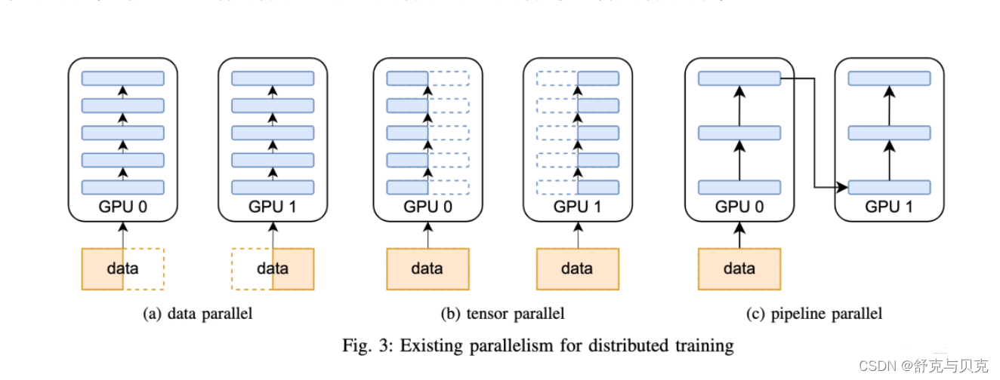
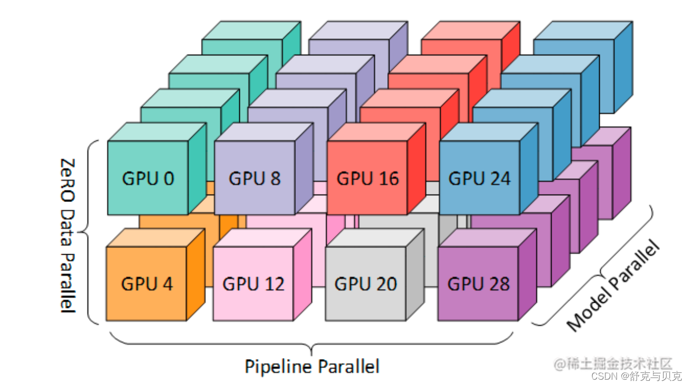

# Week 2 讲义：进阶架构与大规模训练工程

> **核心目标**：在掌握 Transformer 基础架构之上，深入理解让大模型"更大、更快、更强"的关键技术：**MOE (专家混合)**、**高级注意力优化**、**大模型专用优化器**以及**3D 并行工程体系**。
>
> **学习时间**：8 小时
>
> **关键输出**：Flash Attention 原理，MoE 原理与工程化，3D并行切分方案

---

## 📖 本周知识图谱

本周内容是连接"理论模型"与"工业级实战"的桥梁。我们不再关注基础组件（Week 1 已覆盖），而是聚焦于 SOTA 模型（如 Mixtral, Qwen-Next, DeepSeek）和训练框架（DeepSpeed, Megatron）的核心技术。

### 核心模块

1.  **高级注意力机制 (Advanced Attention)**
    *   **Flash Attention**: IO 感知的硬件级加速
    *   **Sliding Window Attention (SWA)**: Mistral 的长序列秘诀
    *   **GQA (Grouped Query Attention)**: 显存与速度的最佳平衡
    *   **MQA & MLA**: 极致压缩与 DeepSeek 的创新
    *   **PagedAttention**: vLLM 的显存管理革命 (推理优化)
2.  **MoE 专家混合架构 (Mixture of Experts)**
    *   **稀疏激活原理**: 如何用 10% 的计算量跑 100% 的参数？
    *   **Gating (Router)**: 专家路由机制 (Top-k)
    *   **负载均衡 (Load Balancing)**: 防止"专家过劳"的辅助 Loss
    *   **DeepSeek MoE**: 细粒度与共享专家策略
3.  **大模型优化器 (Optimizers)**
    *   **AdamW**: 权重衰减的正确姿势
    *   **8-bit Optimizers**: 显存减半的神器
    *   **ZeRO**: 优化器状态切片
4.  **工程体系：3D 并行与工具 (Parallelism & Tools)**
    *   **数据并行 (DP/FSDP)**: 分布式训练的基石
    *   **张量并行 (TP)**: Megatron-LM 的切分逻辑
    *   **流水线并行 (PP)**: 层的流水线与气泡
    *   **工具实战**: DeepSpeed Config 与 PyTorch FSDP

---

## 🧠 Part 1: 高级注意力机制

### 1.1 Flash Attention: 硬件级的极致优化

在 Week 1 中我们知道 Attention 的复杂度是 $O(N^2)$。但在实际 GPU 运行中，**显存带宽 (HBM)** 往往比计算单元 (SRAM) 更早成为瓶颈。

> #### 📌 GPU 存储层级速览
>
> GPU 内部有两种截然不同的存储：
>
> *   **SRAM（Static RAM，片上缓存）**：直接集成在 GPU 芯片上，读写速度极快（带宽约 20 TB/s），但容量极小（A100 上约 40 MB）。计算核心（CUDA Core / Tensor Core）只能直接操作 SRAM 里的数据。
> *   **HBM（High Bandwidth Memory，高带宽显存）**：即我们平时说的"显存"，A100 有 80 GB。容量大，但与芯片之间有物理距离，带宽约 2 TB/s，是 SRAM 的 1/10。
>
> 每次计算前，数据必须从 HBM 搬到 SRAM；计算完再写回 HBM。**搬运数据的时间（IO 时间）往往远超计算本身**，这就是"带宽瓶颈"的来源。

> #### 💡 直观理解： "厨房与冷库" 的比喻
>
> 可以将 GPU 的存储层级想象成**大厨做菜**：
> *   **计算单元 (SRAM)** = **案板** (速度快，但空间极小，伸手就能拿到)。
> *   **显存 (HBM)** = **冷库** (空间大，但距离远，拿一次菜要走很久)。
>
> **标准 Attention**：
> 就像大厨切完菜（算好 $S$），案板放不下了，必须跑去冷库把切好的菜存起来；下锅时（算 Softmax），又跑回冷库把菜搬出来。90% 的时间都浪费在"跑冷库"的路上（**Memory Bound**）。
>
> **Flash Attention**：
> 大厨学聪明了，每次只拿**一小篮**原料（**Tiling** 分块），在案板上一次性切好、炒好、装盘（**Kernel Fusion**），中间产生的厨余垃圾（中间矩阵）直接丢掉，绝不运回冷库。虽然干的活（计算量）没变，但少跑了几百趟冷库，效率飞升。

---

**为什么会这样？**

*   **访存受限 (Memory-bound)**：现代 GPU 的计算能力（TFLOPS）提升远快于显存带宽。对于 Attention 这种操作，瓶颈不在于计算次数，而在于数据搬运的速度。
*   **标准 Attention 由三个独立的 GPU kernel 组成**，每个 kernel 结束后必须把结果写回 HBM，下一个 kernel 再从 HBM 读出来：
    1. **$S = QK^T$**：从 HBM 读取 $Q, K$，计算后将 $N \times N$ 的分数矩阵 $S$ **写回 HBM**。
    2. **$P = \text{softmax}(S)$**：从 HBM **读取** $S$，计算 Softmax 后将 $N \times N$ 的概率矩阵 $P$ **写回 HBM**。
    3. **$O = PV$**：从 HBM **读取** $P$ 和 $V$，计算最终结果 $O$ 并**写回 HBM**。

**矩阵乘法本身是可以分块的**

你可能会问：计算 $QK^T$ 时，SRAM 根本装不下整个 $Q$ 或 $K$，这一步是怎么完成的？

矩阵乘法（GEMM）在数学上**天然支持分块计算**。$Q$（$N \times d$）按行切块，$K$（$N \times d$）也按行切块（等价于 $K^T$ 按列切块），每个输出小块独立可算：

$$\begin{bmatrix} Q_1 \\ Q_2 \end{bmatrix} \begin{bmatrix} K_1^T & K_2^T \end{bmatrix} = \begin{bmatrix} Q_1 K_1^T & Q_1 K_2^T \\ Q_2 K_1^T & Q_2 K_2^T \end{bmatrix}$$

每个输出块 $S_{ij} = Q_i K_j^T$ 的大小为 $B_r \times B_c$，可以单独放入 SRAM 计算，算完写回 HBM，再换下一对 $(Q_i, K_j)$。GPU 就这样用 SRAM 作**滑动的 tile 缓冲区**，拼出完整的 $N \times N$ 结果矩阵。**所以 $QK^T$ 这一步本身不是瓶颈，SRAM 不够用从来不是问题。**

**真正的瓶颈**在于：Softmax 需要看完整一行才能归一化，因此 $QK^T$ 的完整 $N \times N$ 结果矩阵必须先写入 HBM，Softmax kernel 才能启动。这打断了分块计算的连续性。Flash Attention 用 **Tiling + Online Softmax + Kernel Fusion** 同时解决 SRAM 容量不足和 Softmax 全局依赖这两个障碍，彻底消除 HBM 中转（详见**附录 A.3**）。

> **💡 S 矩阵有多大？** 以 N=4096、float16 为例，$S$ 的大小为 $4096 \times 4096 \times 2\text{ B} \approx 32\text{ MB}$，而 GPU 每个 SM 的 SRAM 通常只有 96～256 KB，相差两个数量级。$QK^\top$ 的分块计算（GEMM tiling）本身没有问题，但每块结果算完都必须写回 HBM 才能拼出完整的 S——这正是标准 Attention 产生 $O(N^2)$ HBM 读写的根源。Flash Attention 用 Online Softmax 让每块 $S_{ij}$ 用完即丢，S 矩阵从始至终不需要完整地出现在任何存储层级里。

**Flash Attention 的计算流程**

先对比两者的整体结构：

| | 标准 Attention | Flash Attention |
|--|--|--|
| 组织方式 | 3 个独立 GPU kernel，依次执行 | 1 个 kernel，一气呵成 |
| $QK^T$ 结果去哪里 | 写回 HBM，存为完整 $N \times N$ 矩阵 | 不写回，留在 SRAM 内继续处理 |
| Softmax 怎么做 | 从 HBM 读回完整 $S$，全行归一化 | Online Softmax，分块动态修正 |
| 最终输出来源 | 从 HBM 读 $P$ 和 $V$ 再算一遍 | 在 SRAM 内逐块累积 |
| HBM 读写量 | $O(N^2)$ | $O(N \cdot d)$ |

Flash Attention 的前向计算分以下几步：

**第一步：分块（Tiling）**

将 $Q$ 按行切成大小 $B_r$ 的块（$Q_1, Q_2, \ldots$），将 $K, V$ 按行切成大小 $B_c$ 的块（$K_1, V_1$; $K_2, V_2$; $\ldots$），块大小由 SRAM 容量决定，确保每次操作只需装入 $Q_i, K_j, V_j, O_i$ 这几块（详见**附录 A.2**）。

标准 Attention 同样会对 $QK^T$ 的计算做 tile 处理（GPU GEMM 的通用做法），但每块结果算完后都写回 HBM 拼成完整的 $S$。Flash Attention 的关键在于，每块 $S_{ij} = Q_i K_j^T$ 算完后**不写回 HBM，直接在 SRAM 内继续下一步**。

**第二步：SRAM 内完成 Softmax 与加权求和（Online Softmax）**

对于每对 $(Q_i, K_j)$，在 SRAM 内计算出 $S_{ij}$ 后，不等看完完整一行，就用 Online Softmax 更新统计量（当前全局最大值 $m$、归一化分母 $d$）并累积输出 $O_i$。处理下一块 $K_{j+1}$ 时，用新的最大值修正之前的累积结果。

**💡 类比**：计算全班相对排名（Softmax）。传统做法需要把所有卷子同时摆在桌上；Online 做法是每次只看几张，记下"当前最高分"和总和，看下一组时按新的最高分修正之前的记录——桌子（SRAM）只需放几张卷子，结果完全相同。

遍历完 $K, V$ 的所有块后，$O_i$ 即为第 $i$ 块 query 对应的精确 Attention 输出，数学上与全局计算完全等价。详细推导见**附录 A.1**。

**第三步：Kernel Fusion（算子融合）**

以上"计算 $S_{ij}$、更新 Online Softmax、累积 $O_i$"三步在同一个 GPU kernel 内完成，$S$ 和 $P$ 从未以完整 $N \times N$ 形式出现在 HBM 中。这是 Flash Attention 工程层面的核心——原本三个独立 kernel 之间的 HBM 中转被彻底消除。

**第四步：反向传播的重计算（Recomputation）**

反向传播需要用到 $S$ 矩阵（计算梯度），但 Flash Attention 从未将其写入 HBM。解决方案是**重新计算**：反向传播时，用保存的 $O$ 和 Online Softmax 统计量（$m, d$，大小均为 $O(N)$）在 SRAM 内重新算出 $S_{ij}$，而不是从 HBM 读取。额外增加了计算量，但完全避免了读写巨大的 $N \times N$ 矩阵，总耗时反而更短。

**💡 类比**：写完一段草稿后直接扔掉，复盘时重新推导，比跑去仓库翻找草稿还快。

**结果：**

*   **显存占用从 $O(N^2)$ 降为 $O(N)$**：HBM 中只需存储 $Q, K, V, O$（均为 $N \times d$）以及 Online Softmax 的统计向量（$N \times 1$），过程矩阵 $S, P$ 不再写入显存。
*   **速度提升 2-4 倍**：Flash Attention **计算复杂度不变**（FLOPs 仍为 $O(N^2 d)$），加速来自 HBM 读写次数从 $O(N^2)$ 降至 $O(N \cdot d)$。
*   **实战提示**：PyTorch 2.0+ 已原生支持 (`F.scaled_dot_product_attention`)，务必开启。

**Flash Attention 的适用范围：训练和推理都能用**

| 阶段 | 是否适用 | 核心收益 |
|---|---|---|
| **训练（前向）** | ✅ | HBM 读写从 $O(N^2)$ 降至 $O(N \cdot d)$，速度 2-4× |
| **训练（反向）** | ✅ | 用重计算替代读取 $S$，显存从 $O(N^2)$ 降至 $O(N)$，可训更长序列 |
| **推理 Prefill** | ✅ | 对 prompt 做全量 attention，与训练前向相同 |
| **推理 Decode** | ⚠️ 有限 | 每步只生成 1 个 token，attention 退化为 $1 \times N$，$O(N^2)$ 优化意义不大；此阶段瓶颈转移至 KV Cache 读取，由 **Flash Decoding** 专门处理（见 Week6）|

训练时收益最为显著——标准 Attention 要在显存里保存完整的 $S$ 矩阵（$O(N^2)$）用于反向传播，Flash Attention 只需保存 $O(N)$ 的统计量 $m$、$l$，使得相同显存下可训练更长的序列或更大的 batch。

### 1.2 Sliding Window Attention (SWA) vs. Global Attention

Mistral 7B 引入的机制，用于处理长序列。

*   **原理**：每个 token 只关注它之前的 $W$ 个 token（窗口大小），而不是所有 token。
*   **优势**：计算量从 $O(N^2)$ 降至 $O(N \times W)$。推理时 KV Cache 只需要存 $W$ 个大小 (Rolling Buffer Cache)。
*   **具体实现方式**：
    1.  **Rolling Buffer Cache (滚动缓存)**：在推理阶段，KV Cache 的大小固定为 $W$。当生成第 $i$ 个 token 时，其 KV 向量会覆盖掉缓存中第 $i \pmod W$ 位置的旧数据。这使得显存占用不再随序列长度无限增长。
    2.  **带状掩码 (Band Mask)**：在训练时，通过构造一个带状的 Attention Mask，使得每个位置 $i$ 只能计算与 $[i-W, i]$ 范围内 token 的注意力分数。
    3.  **感受野叠加 (Receptive Field)**：虽然单层只看 $W$，但经过 $L$ 层堆叠后，顶层 token 的有效感受野可以达到 $L \times W$。这种层级传递机制让模型能以较低成本获取长程信息。

> **💡 实战中的"混合策略" (Hybrid Attention)**
>
> SWA 很少单独使用，通常会配合 Global Attention 以避免"视线短浅"。主流做法是**交替层（Alternating Layers）**：某些层用 SWA，其余层用全局 Attention，比例可以调节。
>
> | 模型 | Local : Global 比例 | 窗口大小 | 备注 |
> |------|-------------------|---------|------|
> | **Gemma 2**（Google） | 1 : 1 | 4096 | 最保守，每层交替 |
> | **Gemma 3**（Google） | 5 : 1 | 1024 | 更激进；论文发现改到 3:1 或 7:1 对 perplexity 影响极小 |
> | **Llama 4**（Meta） | 3 : 1 | 8K 块 | Global 层使用 NoPE（无位置编码），Local 层用 RoPE；支持最长 1000 万 token 上下文 |
> | **Qwen 2**（阿里） | 分层设计 | — | 下层全局 Attention，上层 SWA；配合 Dual Chunk Attention 支持 128K 上下文 |
> | **Mistral 7B** | 纯 SWA | 4096 | 无 Global 层，是少数不做混合的例外，理论感受野靠层叠堆积 |
>
> **关键规律**：Global 层的比例不需要很高——Gemma 3 的实验表明，5:1 与 1:1 的模型质量差异很小，说明少量 Global 层就足以维持全局信息流动，其余层可以大胆使用 SWA 节省计算。

> **视野拓展：Sparse Attention (稀疏注意力)** 
>
> SWA 其实是 **Sparse Attention (稀疏注意力)** 的一种特例。这是目前解决 $O(N^2)$ 复杂度最主流的两个方向之一（另一个是 Linear Attention）。
>
> **🚀 前沿方向：找回全局信息的两种流派**
>
> 你的直觉非常敏锐。目前业界确实主要有两种"Local + Global"的结合方式，它们通常**分别使用**：
>
> 1.  **流派 A：空间混合 (Intra-layer Mixing)**
>     *   **代表**：**Longformer, BigBird**。
>     *   **做法**：在**同一层**内区分角色。99% 的 Token 只看局部 (SWA)，选出 1% 的特权 Token (如 `[CLS]` 或特定 Global Token) 看全局。
>     *   **特点**：稀疏度不规则，对硬件加速（CUDA Kernel）挑战大，多用于早期的专用长文本模型。
>
> 2.  **流派 B：深度混合 (Inter-layer Mixing)**
>     *   **代表**：**Gemma 2, Mistral**。
>     *   **做法**：在**不同层**之间轮换。例如 Layer $1,3,5$ 全员只看局部 (SWA)，Layer $2,4,6$ 全员看全局 (Global)。
    *   **特点**：硬件极其友好（每一层内部计算是规则的），且能通过层级堆叠有效传递信息。**这是目前通用大模型的主流选择**。
    *   **典型模型**：
        *   **Gemma 2 (2024)**：Google 最新发布的模型，严格采用 Sliding Window 与 Global Attention **交替堆叠**的架构。
        *   **Qwen 2 / 2.5**：阿里巴巴开源模型，通过在部分层引入 SWA 实现了 128k 甚至更高的上下文支持。
        *   **Mistral 7B / Codestral**：SWA 的早期普及者，在长代码和长文本任务中表现卓越。

### 1.3 Multi-Query Attention (MQA): 显存优化的极端尝试

在 GQA 出现之前，Google (Shazeer et al., 2019) 早就提出了一种极端的显存优化方案：**MQA**。

*   **核心原理**：
    *   **MHA (标准)**：$H$ 个 Query 头，对应 $H$ 个 Key 头和 $H$ 个 Value 头。
    *   **MQA (极致)**：$H$ 个 Query 头，共享**唯一的一对** Key 和 Value 头。
    *   **本质说明**：相当于将 Key 和 Value 的多头机制"坍缩"为单头。Query 依然保持多头以维持表达能力，但所有 Query 头在计算时都去读同一组 KV 缓存。这种设计并非去掉了 KV 映射，而是让它们在头维度上不再独立，从而极大地压缩了 KV Cache 的显存占用。
*   **计算收益**：
    *   **KV Cache 显存占用缩小 $H$ 倍**：由于所有 Query 头共享同一组 Key 和 Value，KV Cache 的大小从 $H$ 个头缩减为 1 个头，显存占用直接降低（例如从 32GB 降为 1GB）。
    *   **计算量减少**：
        *   **前向计算**：
            *   **MHA**：$H$ 个头的计算量为 $H \times N \times d_k$。
            *   **MQA**：$H$ 个头的计算量为 $N \times d_k$。
        *   **反向计算**：
            *   **MHA**：$H$ 个头的计算量为 $H \times N \times d_k$。
            *   **MQA**：$H$ 个头的计算量为 $N \times d_k$。
    *   **显存 I/O 减少**：在推理阶段，KV Cache 的读取是主要的性能瓶颈（Memory-Bound）。MQA 极大地减少了数据搬运量，使得推理速度大幅提升。
    *   **计算量分析**：
        *   **投影层**：KV 的线性映射计算量确实减少了 $H$ 倍。
        *   **Attention 阶段**：虽然 Query 依然是多头，总的计算量（FLOPs）在 $QK^T$ 环节变化不显著，但由于 I/O 带宽压力的释放，整体执行效率远高于 MHA。
*   **局限性**：
    *   "三个臭皮匠顶个诸葛亮" -> MQA 相当于辞退了所有臭皮匠，只留一个诸葛亮干活。模型表达能力下降明显，容易导致生成质量不稳定。

### 1.4 Grouped Query Attention (GQA): 平衡的艺术

GQA 是为了平衡 **MHA** 的性能和 **MQA** 的显存效率而设计的折中方案 (LLaMA-2/3, Qwen 的选择)。

*   **背景与动机**：
    *   发现 MQA 虽然快，但效果掉得太厉害；MHA 虽然效果好，但在长序列推理时显存又扛不住。
    *   **GQA** 提出了"分组"的概念：既不每人一把钥匙 (MHA)，也不全楼一把钥匙 (MQA)，而是**每层楼一把钥匙**。
*   **核心原理**：
    *   **分组共享**：Query 头总数保持不变，但大幅减少 $K$ 和 $V$ 的头数。Query 头被划分为若干组，每一组内的所有 Query 头共享同一对 $K$ 和 $V$ 头。
    *   **参数关系**：设 Query 头数为 $H_Q$，KV 头数为 $H_{KV}$。每个 KV 头服务于 $H_Q / H_{KV}$ 个 Query 头。
    *   **设计意图**：通过这种"按组对应"的机制，在维持多头注意力表达能力的同时，显著降低推理时的 KV Cache 显存占用。
    *   **灵活性**：当 $H_{KV} = 1$ 时，退化为 MQA；当 $H_{KV} = H_Q$ 时，等价于 MHA。

*   **实现逻辑**：
    假设 `num_heads = 32`，`num_kv_heads = 4`（8倍分组）。
    在计算 Attention Score 时，Q 有 32 个头，K, V 只有 4 个头。
    **广播 (Broadcasting)**：将每个 K, V 头复制 8 份，或者在 indexing 时让 Q 的第 0-7 个头都去索引 K 的第 0 个头。
*   **Upsampling 不增加显存**：在实际 CUDA kernel 中，不需要真的把 K, V 复制 8 份占显存，只是读取指针复用。这就是它节省显存的本质。

### 1.5 视野拓展：Attention 的演化脉络

> **💡 技术考古与演进**
>
> 值得注意的是，这些变体并非线性演进，而是一个**"极端 $\to$ 平衡"**的过程：

1.  **MQA (2019)**:
    *   **定位**：**极端压缩**。为了极致速度牺牲了太多性能。
    *   *One Write-Head is All You Need.*

2.  **GQA (2023)**:
    *   **定位**：**中庸之道**。在 MQA 的基础上往回退了一步，找回了大部分性能。
    *   *Generalized Multi-Query Transformer.*

3.  **MLA (Multi-Head Latent Attention) [DeepSeek, 2024]**:
    *   **定位**：**降维打击**。DeepSeek-V2 / V3 的核心创新。
    *   **原理**：不再单纯做"分组"，而是引入低秩压缩 (Low-Rank Compression) 将 KV 投影到 Latent Space。
    *   **效果**：在保持 MHA 级别性能的同时，把 KV Cache 压缩到了极小（甚至优于 MQA）。
    *   *Note: 由于 MLA 涉及复杂的矩阵压缩理论，我们将在 **W11 (先进架构演进)** 中进行深度拆解。*

**工业界应用现状：**
*   **Flash Attention**: **几乎所有** 现代开源模型（LLaMA-3, Qwen-2, Mistral）都在底层集成了它。
*   **GQA**: **LLaMA-2/3**, **Qwen-1.5/2**, **Mistral** 的标配。
*   **SWA**: **Mistral**, **Qwen** (部分版本) 用于处理长窗口。
*   **PagedAttention**: **vLLM**, **TGI**, **LMDeploy** 等高性能推理框架的标准配置。

> [!TIP]
> **推理的Attention优化：PagedAttention**
>
> **PagedAttention** (vLLM 的核心) 专注于解决**推理阶段**的显存碎片问题。为了保持知识连贯性，我们将它的**深度拆解与"图书架 vs 活页夹"比喻**移至 **[Week 6: 推理优化](Week6讲义.md#part-2-pagedattention-原理详解)** 详细讨论。在这里你只需把它作为"推理生态"的一部分即可。

---

## 🔀 Part 2: MoE (Mixture of Experts) 架构

这是 DeepSeek, Mixtral, Qwen-Next 等前沿模型的核心。

> **💡 核心提示**：在大模型语境下，MoE **特指对 FFN (Feed-Forward Network) 层的稀疏化改造**。自注意力（Self-Attention）层通常保持 Dense 结构，只有 FFN 层被替换为由多个专家组成的稀疏结构。

### 2.1 深入解构：MoE 的架构原理

你的理解非常到位。MoE 对模型的改造，正是发生在 Transformer Block 的 **FFN (Feed-Forward Network)** 位置。

#### 1. 结构本质：Router + 多专家
*   **原始 FFN (Dense)**：这也是我们常说的"升维-降维"结构。
    *   流程：输入 $x \xrightarrow{\text{Up (升维)}} \text{Hidden} \xrightarrow{\text{Act}} \xrightarrow{\text{Down (降维)}} \text{Output}$。
    *   特点：所有参数对每个 Token 都是可见且被激活的。
*   **MoE 改造**：我们将这个单一的 FFN 替换为一个 **"门控路由 (Router) + 多个专家 (Experts)"** 的组合系统。
    *   **专家 (Experts)**：每个专家 $E_i$ 本质上就是一个独立的 FFN（同样也是升维-降维结构，只是中间维度可能有所不同）。
    *   **路由 (Router)**：在专家之前增加一个轻量级的 Gate 网络。它负责"看病分诊"，决定当前的 Token 应该交给哪 $k$ 个专家处理。

**💡 实战案例 1：微观解剖 Qwen2-57B-A14B (Matrix Level)**

让我们深入到**矩阵维度**层面，对比一下 **Dense 模型 (同级 14B)** 与 **MoE 模型 (57B)** 在 单层 FFN 上的巨大差异：

| 组件 | 模型 | $d_{model}$ (I/O) | $d_{ff}$ (Hidden) | 数量 | 说明 |
| :--- | :--- | :--- | :--- | :--- | :--- |
| **Dense FFN** | Qwen1.5-14B | 5,120 | **13,696** (巨大) | 1 | "大锅饭"：所有知识都在这一个巨型矩阵里。 |
| **Routed Expert** | Qwen2-57B | 3,584 | **2,560** (小巧) | 64 | "专科医生"：每个只由极小的矩阵组成 (细粒度)。 |
| **Shared Expert** | Qwen2-57B | 3,584 | **20,480** (超大) | 8 | "全科医生"：负责兜底的通用知识库。 |

*   **计算量对比**：Dense 模型每次必须算那个 **13,696** 宽度的巨型矩阵；而 MoE 虽然总盘子大，但针对该 Token，它只调用了几个 **2,560** 宽度的小矩阵。

**💡 实战案例 2：宏观战场 SOTA MoE 横向测评 (2025版)**

如果说 Qwen2 还是"小试牛刀"，那么 **DeepSeek-V3, Qwen3, Kimi K2** 则是将 MoE 推向了极致的万亿参数战场。

| 核心指标 | Qwen2-57B (入门) | **DeepSeek-V3** (极致细粒度) | **Kimi K2** (万亿巨兽) | **Qwen3-235B** (大力出奇迹) |
| :--- | :--- | :--- | :--- | :--- |
| **总参数 (Total)** | 57B | **671B** | **~1000B (1T)** | **235B** |
| **激活参数 (Active)** | 2.5B | **37B** | **32B** | **22B** |
| **专家总数** | 64 | **256** 🔥 | **384** | 128 |
| **Experts $d_{in}$** | 3,584 | **7,168** | **7,168** | 10,240 |
| **Experts $d_{ff}$** | 2,560 (0.7x) | **2,048 (0.28x)** | **2,048 (0.28x)** | ~2,800 (Est. ~0.28x) |
| **Experts $d_{out}$** | 3,584 | **7,168** | **7,168** | 10,240 |
| **路由策略 (Top-k)** | Top-8 (Softmax) | **Top-8 (Sigmoid!)** | Top-8 (Softmax) | Top-8 (Softmax) |
| **核心理念** | 经典架构，探索为主 | **No Softmax**! 彻底解耦专家竞争，训练极其稳定。 | **Ultra-Large Experts**。暴力美学。 | 均衡之道。在规模与效率间寻找平衡。 |

*   **DeepSeek-V3 的创新**：它是唯一敢弃用 Softmax 的模型。使用 Sigmoid 让 256 个专家"独立打分"，谁行谁上，不再受归一化限制。
*   **DeepSeek & Kimi 的共识**：都选择了 **7k $\to$ 2k** 这种极端的"细粒度切分"。相比 Qwen2 的 0.7x 压缩比，它们将专家切得更碎 (0.28x)，这意味着每个专家的"技能树"更窄、更专精。
*   **Kimi K2 的野心**：利用 MoE 用 32B 的推理成本，撬动了 1T 的知识库。
*   **Qwen3 的进化**：从 57B 跃升至 235B，依然保持极高的 active/total 压缩比 (1:10)。

#### 2. 为什么能"快"？(Active Parameters)
这里的关键在于**按需加载**：
*   **Dense 逻辑**：就像去一家只有个**5000平米**大厅的餐厅，不管几个人吃饭，必须把整个大厅灯都打开，空调全开。
*   **MoE 逻辑**：把餐厅改成 **100个50平米** 的包间。
    *   **Capacity (容量)**：总面积 5000平米没变（甚至更大）。
    *   **Speed (速度)**：来一桌客人，我只开 **2个** 包间的灯和空调。
*   **结果**：虽然那是家"5000平米级"的大饭店（显存占用），但运营成本（计算量）却只有小饭馆的水平。

> **💡 总结**：Active Parameters (激活参数) 决定了**推理速度/成本**；Total Parameters (总参数) 决定了**知识容量/天花板**。MoE 实现了两者的解耦。

### 2.2 核心组件：Gating & Routing
谁来决定 token 给哪个专家？**Gating Network (Router)**。

*   **输入**：Token 的隐藏状态 $x$。
*   **计算流程**：
    1.  **打分 (Logits)**：$H(x) = x \cdot W_g$。
    2.  **Top-k 筛选**：从 $H(x)$ 中选出值最大的 $k$ 个索引。
    3.  **归一化 (Softmax)**：只对这 $k$ 个值进行 Softmax，得到权重 $G(x)_i$。
*   **输出**：$y = \sum_{i \in \text{Top-k}} G(x)_i \cdot E_i(x)$。

> **❓ 深度思考：Top-k 操作不可导，如何训练 Router？**
>
> 这是一个非常关键的数学问题。`Top-k` (Argmax) 本身是一个**离散操作**，梯度无法穿过"索引选择"这个动作。
>
> **数学上的梯度流向：**
> 1.  **索引无梯度**：必须明确，Router **学不到** "选第 3 个专家" 这个离散动作本身（$\partial L / \partial \text{Index} = 0$）。
> 2.  **权重有梯度**：但是，最终输出 $y = \sum p_i \cdot E_i(x)$ 中，**门控分数 $p_i$ (Softmax输出) 是连续可导的**！
>     *   反向传播时，梯度 $\frac{\partial L}{\partial p_i}$ 会告诉 Router："如果你之前给在这个专家上的打分 $p_i$ 再高一点，Loss 就会降低"。
>     *   因此，Router 是通过优化**打分权重 $W_g$** 来间接影响排序的。
> 3.  **"跨越边界"的难题与 Noisy Top-K**：
>     *   问题：如果你现在的打分太低，排到了第 $k+1$ 名（落选），那么 $p_i$ 直接被置为 0，梯度也消失了。Router 永远不知道"如果选了这个专家会怎样"。
>     *   解决：这就是 **Gating Noise** 存在的真正数学意义（不仅仅为了负载均衡）。加入噪声 $\text{Top-k}(x \cdot W_g + \text{Noise})$ 使得排序具有随机性，让落选的专家有机会偶尔被选中（获得梯度），从而让 Router 有机会"跳出局部最优"，探索出更好的专家组合。

### 2.3 负载均衡 (Load Balancing)

**问题：** Router 可能会"偷懒"，把所有 token 都发给同一个专家（导致该专家过载，其他专家没事干），退化成 Dense 模型。

**解决方案：辅助损失 (Auxiliary Loss)**。

$$L_{aux} = \alpha \cdot \sum_{i=1}^N f_i \cdot P_i$$

其中两个量的含义和计算方式如下：

*   **$f_i$：token 比例（硬统计量，不可微）**。对 batch 中的 $T$ 个 token，设专家 $i$ 实际收到 $c_i$ 个 token，则 $f_i = c_i / T$。这是根据 Top-K 路由的离散决策直接数出来的，没有梯度。

*   **$P_i$：平均路由概率（软统计量，可微）**。Router 对每个 token 都输出所有专家的 softmax 分数——即使某专家最终未被 Top-K 选中，其 softmax 分数仍然存在。$P_i$ 是该分数在整个 batch 上的均值：$P_i = \frac{1}{T} \sum_{x} p_i(x)$。

**为什么优化这个 Loss 就能均匀分配？**

$f_i$ 和 $P_i$ 在 Loss 中扮演不同角色：$f_i$ 作为**系数**，反映当前负载——专家越过载，$f_i$ 越大，该项对 Loss 贡献越大；$P_i$ 作为**梯度通道**，Loss 对 $P_i$ 求导后，会推动 Router 降低对过载专家的打分，从而在下一步把 token 转移给其他专家。

简单说：**$f_i$ 用负载情况加权，$P_i$ 接收梯度并反馈给 Router**，使 Router 主动把 token 从重载专家转移出去。数学上，当所有 $f_i = P_i = 1/N$ 时，$\sum f_i P_i$ 取到最小值——这正是完全均衡的状态。
>
> **💡 深度思考：Gating Noise 与 Aux Loss 的协同 (Synergy)**
>
> 你的直觉非常敏锐。单纯的 Noise 确实不够，它们其实是 **"机会 (Benefit of Doubt)"** 与 **"法规 (Law Enforcement)"** 的关系：
> *   **Gating Noise (给机会)**：不仅是为了微小的扰动，更是为了**打破"富者恒富"的死循环**。如果初始权重稍低，没有 Noise，这个专家永远选不上，梯度永远是 0，Aux Loss 再怎么惩罚不均衡也传导不过去（因为没有激活路径）。Noise 创造了那个"偶尔被选中"的概率通道。
> *   **Aux Loss (立规矩)**：有了通道还不够，Router 可能觉得"我就喜欢盯着一个专家薅"。Aux Loss 提供了明确的梯度惩罚，强迫 Router 在 Noise 提供的探索空间里，找到那个既能降低 Loss 又能满足负载均衡的解。
> *   **结论**：Noise 提供了**梯度流动的路径**，Aux Loss 提供了**梯度优化的方向**。缺一不可。

> **视野拓展：DeepSeek 的细粒度 MoE**
> 
> **💡 架构演进**
> 
> 标准的 Top-2 MoE (如 Mixtral) 存在一个问题：每个专家都很大（例如 7B 参数中每层专家可能有 1B），知识掌握比较"粗糙"。
> 
> **DeepSeek-MoE** 提出了 **Fine-Grained (细粒度)** 策略：
> *   **更小的专家**：把一个大专家切成许多小专家。
> *   **Shared Expert (共享专家)**：设置专门的专家，**每一个 token 必选**，用于捕获通用知识。
> *   **应用**：**DeepSeek-V2/V3**, **Qwen-2-MoE** (受此启发)。这种设计让模型在相同参数下性能更强。

### 2.4 前沿视野：Routing 的进化之路 (SOTA Evolution)

针对你提到的"可导函数替代"问题，学术界和工业界走出了两条不同的路：

#### 1. 学术界的尝试：Fully Differentiable MoE (Soft MoE)
*   **代表作**：Google DeepMind 的 **Soft MoE** (2023)。
*   **原理**：它不选 Top-k，而是把 Token 的向量"切碎"并混合，分发给所有专家（或多组专家）。这样操作完全可导，无需 Top-k 的离散跳跃。
*   **为什么没大规模普及？**
    *   **推理成本 (Inference Cost)**：工业界追求的是**稀疏性 (Sparsity)**。如果为了可导而让所有专家都参与计算（哪怕是加权参与），推理时的 FLOPs 会爆炸，失去了 MoE "大参数、低算力" 的核心优势。

#### 2. 工业界的 SOTA：Sigmoid Routing (DeepSeek-V2 / V3)
这是目前最高效的解决方案。DeepSeek 发现 Softmax 有一个致命缺陷：**专家竞争 (Expert Competition)**。
*   **Softmax 问题**：$\sum P_i = 1$。为了让 Router 选专家 A，它必须把专家 B 的分打低。这导致"一荣俱荣，一损俱损"，模型很难独立地评估每个专家的好坏。
*   **Sigmoid 创新**：放弃 Softmax，改用 **Sigmoid** 对每个专家独立打分。
    *   即 $P_i = \text{Sigmoid}(x \cdot u_i)$。
    *   **Top-k 依然存在**：打分后，依然只选分数最高的 $k$ 个（保持稀疏与高效）。
    *   **优势**：专家之间不再恶性竞争。我在训练专家 A 时，不需要刻意压低专家 B 的分。这极大地稳定了 Router 的训练，是 DeepSeek 系列模型强大的核心秘诀之一。

**3. 横向对比：三巨头的不同选择** (Kimi vs Qwen vs DeepSeek)
*   **DeepSeek (V2/V3)**:
    *   **策略**: **Sigmoid Routing** + Shared Expert + Fine-grained Experts。
    *   **特点**: 唯一放弃 Softmax 的模型。Sigmoid 实现了专家间的解耦，训练最稳定。
*   **Qwen (2.5-MoE / 3)**:
    *   **策略**: **Softmax Routing** + Shared Expert + Fine-grained Experts。
    *   **特点**: 架构上学习了 DeepSeek 的"共享专家"设计，但在路由函数上依然坚持使用经过验证的 Softmax，配合 Aux Loss 进行负载均衡。
*   **Kimi (K2)**:
    *   **策略**: **Softmax Routing** + Massive Experts (384个)。
    *   **特点**: 走的是"大力出奇迹"路线。Top-8 / 384 的选择。它没有改动路由公式 (Softmax)，而是通过极高的专家数量 (384个) 来实现极致的专精。

**工业界应用现状：**
*   **Mixtral 8x7B (Standard ToK-K)**: 使用经典的 Noisy Top-K + Softmax。
*   **Switch Transformer**: MoE 的鼻祖，证明了万亿参数的可行性。

---

## 🛠️ Part 3: 大模型优化器 (Optimizers)

训练大模型时，SGD 已经不够用了。

### 3.1 从 Adam 到 AdamW: 进化的必然

在大模型时代，**AdamW** 是预训练优化器的**绝对统治者**（Llama 3, DeepSeek V3, Qwen 2.5 均使用它）。要理解为什么是 "W"，我们需要先快速回顾一下 SGD 到了 Adam 经历了什么（完整演化路径，含 AdaGrad 与 RMSProp 的中间节点，见**附录 A.9**）：

1.  **从 SGD 到 Adam (能力升级)**：

    SGD 的问题是对所有参数用同一个学习率，无法适应各参数梯度差异。Adam 通过维护两个统计量来为每个参数定制步长：

    **① 一阶矩 $m_t$（动量）**：梯度的指数移动平均，提供更新**方向**（见**附录 A.7**）。

    $$m_t = \beta_1 m_{t-1} + (1-\beta_1)g_t \quad (\beta_1 = 0.9)$$

    其中 $g_t$ 是当前步对该参数的梯度，每个参数都有自己独立的一份（见**附录 A.8**）。

    指数移动平均赋予参数更新”惯性”——历史梯度的方向会持续影响当前更新，能抑制震荡、越过局部平坦区。

    **② 二阶矩 $v_t$（梯度平方的指数移动平均）**：反映梯度的波动幅度，作为自适应**分母**。

    $$v_t = \beta_2 v_{t-1} + (1-\beta_2)g_t^2 \quad (\beta_2 = 0.999)$$

    >    **关于"二阶矩"的含义**：这里 $g_t^2$ 是 $g_t$ 的**逐元素平方** $(g_t)^2$，不是二阶导数（Hessian）。"矩"是统计学术语，$k$ 阶矩定义为 $E[X^k]$，二阶矩即 $E[X^2]$，与微积分中的偏导数无关。
    >
    >    注意二阶矩 $E[g^2]$ 和**方差** $E[(g-\mu)^2]$ 是不同的：方差以均值为原点，而二阶矩以零为原点，两者关系为 $E[g^2] = \text{Var}(g) + \mu^2$。Adam 用的是**以零为原点的二阶矩**，直接反映梯度的典型幅度（而非散布程度），用 $\sqrt{E[g^2]}$ 做分母能把更新步长归一化到合理范围。大梯度会因平方使 $v_t$ 迅速增大，从而自动压制步长。
    >
    >    Adam 仍是**一阶方法**——真正的二阶方法（Newton 法）需要存储和求逆 $d \times d$ 的 Hessian 矩阵，对大模型（$d$ 达数十亿）完全不可行。

    $v_t$ 越大，说明该参数方向的梯度一直很大或波动剧烈，分母 $\sqrt{v_t}$ 增大，步长自动缩小（防震荡）；反之步长自动增大（防停滞）。注意 $v_t$ 对梯度的依赖是**平方**关系，而 $m_t$ 是**线性**关系，两者不能简单约掉（见**附录 A.5**，含具体数值例子见 **A.6**）。

    **③ 偏差修正**：$m_0 = v_0 = 0$，导致训练初期两者被严重低估。以 $t=1$ 为例：$m_1 = 0.1 g_1$，只有真实梯度的 10%。修正方法是除以 $(1-\beta^t)$：

    $$\hat{m}_t = \frac{m_t}{1-\beta_1^t}, \quad \hat{v}_t = \frac{v_t}{1-\beta_2^t}$$

    $t$ 越大，$\beta^t \to 0$，修正因子趋向 1，偏差自然消失。

    **④ 参数更新**：

    $$\theta_t = \theta_{t-1} - \eta \cdot \frac{\hat{m}_t}{\sqrt{\hat{v}_t} + \epsilon}$$

    $\epsilon$（如 $10^{-8}$）防止分母为零。更新量中梯度信息已被”吸收”进 $\hat{m}_t$ 和 $\hat{v}_t$，不再显式出现。

2.  **Adam 的隐形 Bug (L2 正则化失效)**：
    *   **背景**：Adam 本身**没有**正则化机制。L2 正则化是训练时人为加入的，做法是在损失函数上追加惩罚项 $\frac{\lambda}{2}\|\theta\|^2$，对参数求梯度后会多出一项 $\lambda\theta$，于是梯度变为 $g_t \leftarrow g_t + \lambda\theta_{t-1}$，再送入 Adam 正常计算。这在 SGD 中完全等价于 Weight Decay，但在 Adam 里出了问题。
    *   **Bug**：合并后的梯度（含 L2 项）会一起被自适应分母 $\sqrt{\hat{v}_t}$ 除掉。不同参数的 $\hat{v}_t$ 不同，导致 L2 惩罚被不均匀缩放——更新幅度大的参数惩罚被削减，更新幅度小的参数惩罚几乎不变，违背了正则化的初衷。

3.  **AdamW 的修复 (The "W" Fix)**：
    *   **Decoupled Weight Decay (解耦权重衰减)**：AdamW 说："别把正则化混进梯度里去算自适应了。等你们梯度更新完了，我再单独手动让权重衰减一点点。"
    *   $$ \theta_t = \theta_{t-1} - \eta \cdot \frac{\hat{m}_t}{\sqrt{\hat{v}_t} + \epsilon} - \eta \lambda \theta_{t-1} $$
    *   合并含 $\theta_{t-1}$ 的两项，可以得到等价形式：
    *   $$ \theta_t = \underbrace{(1 - \eta\lambda)}_{\text{先打折扣}} \theta_{t-1} - \eta \cdot \underbrace{\frac{\hat{m}_t}{\sqrt{\hat{v}_t} + \epsilon}}_{\text{纯梯度更新（不含 L2）}} $$
    *   这个形式揭示了"Weight Decay（权重衰减）"名字的本意：每步先将参数乘以一个略小于 1 的系数（如 $\eta=10^{-3},\lambda=0.1$ 时折扣率为 $0.9999$），让权重自然衰减；再叠加与 L2 完全解耦的梯度更新。每个参数受到的衰减强度均匀一致，不受自适应步长干扰。
    *   这看似微小的改动，修复了自适应优化器的泛化能力问题，成为了大模型训练稳定性的基石。


    > **📝 公式符号速查**：
    > *   $\theta_t$: 第 $t$ 步的模型**参数** (Weights)
    > *   $g_t$: 第 $t$ 步的**梯度** (Gradient)
    > *   $\eta$: **学习率** (Learning Rate, e.g., $3 \times 10^{-4}$)
    > *   $\lambda$: **权重衰减**系数 (Weight Decay, e.g., $0.1$)
    > *   $\beta_1, \beta_2$: **动量**衰减系数 (通常 $\beta_1=0.9, \beta_2=0.95$)
    > *   $\epsilon$: 防止分母为 0 的**平滑项** (e.g., $10^{-8}$)

 
> **🚀 视野拓展：那些试图挑战 AdamW 的对手**
>
> 虽然 AdamW 统治了当下，但学术界从未停止探索更高效的替代品：
>
> 1.  **Lion (Google, 2023)**:
>     *   **原理**：只用动量的符号 (+1/-1) 来更新，极其激进。
>     *   **优势**：省显存（不需要存二阶矩 $v_t$），且训练速度可能更快。
>     *   **现状**：在部分视觉任务上超越了 AdamW，但在 LLM 千亿参数级别的通用稳定性上，**AdamW 依然更胜一筹**。
> 2.  **Muon (Moonshot AI, 2024)**:
>     *   **原理**：利用 Newton-Schulz 迭代对动量进行正交化 (Momentum Orthogonalization)。
>     *   **优势**：收敛速度极快。Moonshot AI 披露其在 Kimi K2 (万亿参数 MoE) 训练中实现了**比 AdamW 快 2 倍**的训练效率。
>     *   **现状**：专用于 2D 矩阵参数（1D 向量如 LayerNorm 仍用 AdamW），是超大模型训练的"秘密武器"。
> 3.  **Adafactor**:
>     *   **原理**：不存储完整的 $v_t$ 矩阵，而是通过行列分解来近似。
>     *   **优势**：极度节省显存。这是 PaLM 和 T5 能够训练起来的关键功臣。
>     *   **现状**：通常只在显存极其受限时作为备选方案。

### 3.2 8-bit Optimizers (bitsandbytes)

*   **痛点**：Adam 需要存一阶矩 ($m$) 和二阶矩 ($v$)，都是 FP32。这意味每个参数需要额外 8 字节显存。对于 70B 模型，光优化器就要 560GB！
*   **解法**：Facebook Research (Tim Dettmers) 提出的 8-bit 优化器。它并非简单的舍弃精度，而是通过**两项关键技术**实现了几乎无损的压缩：
    1.  **Block-wise Quantization (分块量化)**：
        *   **挑战**：模型参数中常有极少数"离群值"（Outliers，特别大或特别小的数）。如果对整个矩阵统一量化，为了迁就这些离群值，大部分正常数值的精度就会被严重压缩。
        *   **黑科技**：将参数切分成一个个小块（Block，例如 2048 个参数为一块）。**每一块单独计算量化比例 (Scale)**。这样，离群值只会影响它所在的那一小块，不会拉低全局的精度。
    2.  **Dynamic Quantization (动态非线性量化)**：
        *   **挑战**：梯度二阶矩 $v_t$ 的数值分布极不均匀（有的参数变化极快，有的极慢），跨度可以达 $1000$ 倍以上，普通的线性量化（均匀分布）根本不够用。
        *   **黑科技**：专门设计了一种**非线性数据类型**（Dynamic Tree Quantization）。它不按均匀间隔存数，而是把更多的量化刻度分配给数值密集的区域（0 到 1 之间）。
*   **注意**：**主权重 (Master Weights)** 依然保持高精度 (BF16/FP32)，被量化的仅仅是**优化器状态 ($m, v$)**。
*   **效果**：优化器显存占用**减少 75%** (从 32-bit 降到 8-bit)，微调 70B 模型时的省显存神器 (QLoRA 的核心基石)。

> **📎 配套附录**
>
> Part 3 涉及的优化器知识体系较为庞杂，以下附录提供进一步的细节支撑：
>
> - **附录 A.9**：优化器完整演化路径（SGD → AdaGrad → RMSProp → Adam → AdamW），补全正文跳过的中间节点。
> - **附录 A.10**：学习率调度策略（Warmup + Cosine Decay + WSD），含主流模型对照表——调度策略与优化器同等重要，是训练稳定性的另一半。
> - **附录 A.11**：梯度裁剪（Gradient Clipping）原理与实战，含 Loss Spike 的检测与处理方案。
> - **附录 A.12**：优化器超参数实战指南，整理了主流大模型的实际超参配置，含预训练 vs. 微调的关键差异。

---

## 🚄 Part 4: 3D 并行与实战工具

当模型大到单机 ZeRO-3 都放不下，或者为了追求极致训练速度时，我们需要 3D 并行。

### 4.1 并行化技术图解

| 类型                        | 切分维度   | 依赖硬件          | 通信频率    | 适用场景               |
| :-------------------------- | :--------- | :---------------- | :---------- | :--------------------- |
| **Data Parallel (DP/FSDP)** | Batch      | Ethernet/IB       | 低/中       | 所有场景，微调首选     |
| **Tensor Parallel (TP)**    | Hidden Dim | **NVLink** (机内) | 极高 (每层) | 预训练，单机多卡       |
| **Pipeline Parallel (PP)**  | Layers     | Ethernet/IB       | 低          | 预训练，跨节点超大模型 |



*   **DP (Data Parallel)**:
    *   最基础的并行方式。每张卡存一份完整的模型，处理不同的数据 (Batch)。
    *   **同步**: 反向传播后，需要 All-Reduce 汇总所有卡的梯度，保证更新一致。
    *   缺点是显存浪费严重（存了 N 份模型），这正是 **ZeRO** (见下文) 要解决的问题。

*   **TP (Megatron-LM 方式)**：
    *   **列切分 (Column Parallel)**: 将 $W$ 竖着切，输出拼接。
    *   **行切分 (Row Parallel)**: 将 $W$ 横着切，输入分割，输出相加 (All-Reduce)。
    *   通常在由 NVLink 连接的 8 卡内部使用。

*   **PP (Pipeline)**:
    *   将 80 层模型切成 4 段，每段 20 层放在不同机器上。
    *   **Bubble 问题**: GPU-4 在算的时候，GPU-1 没事干。需要 **1F1B (One-Forward-One-Backward)** 策略来减少气泡。

> **💡 工业界实战组合**
>
> *   **BLOOM (176B)**: 使用了 Megatron-DeepSpeed 框架，结合了 TP + PP + DP。
> *   **LLaMA-3 (405B)**: Meta 构建了 16,000+ H100 的集群，使用了高度定制的 4D 并行策略（DP + TP + PP + **序列并行 SP**）。其中序列并行是在超长上下文场景下沿序列长度维度切分的第四个并行维度，基于 Ring Attention 机制实现——详见 **Week 8 附录 A.8**。
> *   **GPT-4**: 虽然未公开，但推测使用了大规模的 MoE + EP (Expert Parallelism) + TP + PP。


 **🧐 图解：3D 并行 (3D Parallelism) 的宏观视角**

而为了更高效地训练，可以将 PP、TP 和 DP 相结合，被业界称为 3D 并行，如下图所示。


由于每个维度至少需要 2 个 GPU，因此在这里你至少需要 8 个 GPU 才能实现完整的 3D 并行。
> **为什么是 8 张卡？ ($2 \times 2 \times 2$)**
> 很简单，因为"3D"意味着三个维度（DP、TP、PP）同时开启。为了让某个维度称得上"并行"，你至少得把它切成 2 份（毕竟 1 份就不叫并行了）。
> 所以最小配置是：**2(DP) × 2(TP) × 2(PP) = 8**。少于 8 张卡，必然有一个维度是在"裸奔"（Degree=1）。

这张图生动展示了业界（如 DeepSpeed/Megatron）是如何像**搭积木**一样将上述三种策略**正交组合**的。该立方体的构建过程如下：
 1.  **第一刀（显存维度 TP + PP）**：单卡放不下模型怎么办？
     *   先用 **PP (Pipeline)** 竖着切：把 100 层切成 4 段，像流水线工人一样接力；
     *   再用 **TP (Tensor)** 横着切：把每一层的超大矩阵切成 2 块，分摊计算压力。
     *   *结果*：模型被拆成了 $4 \times 2 = 8$ 块，完美塞进 8 张卡里。
 2.  **第二刀（速度维度 DP）**：模型拆好能跑了，但算得太慢怎么办？
    *   把这 8 张卡组成的"模型整体"视为一个 **Group**。
     *   复制 $N$ 个这样的 Group，每个 Group 喂不同的数据 (**Data Parallel**)。

 **最终形态**：一个极大规模的集群被组织成一个 3D 立方体网格 $(N_{data}, N_{tensor}, N_{pipeline})$，每个 GPU 都有明确的坐标 $(d, t, p)$，各司其职，共同突破算力和显存的物理极限。

### 4.2 DeepSpeed & ZeRO: 显存优化的核心

这里必须介绍一个业界标配工具：**DeepSpeed**。如果说 PyTorch 是造车的引擎，DeepSpeed 就是微软提供的"涡轮增压 + 自动变速箱"，它让训练大模型变得简单且高效。而 **ZeRO (Zero Redundancy Optimizer)** 正是 DeepSpeed 的杀手锏。

**1. 为什么要用 ZeRO？（拒绝显存冗余）**
在 4.1 节提到的 **Data Parallel (DP)** 中，我们发现了一个致命问题：**显存浪费**。
*   **现状**：如果你有 8 张卡做 DP，每张卡都要存一份完整的模型参数。这意味着 7/8 的显存都被用来存"重复的备份"了。
*   **ZeRO 的思路**：既然是并行的，为什么不把**模型参数**、**梯度**、**优化器状态**也都像数据一样切分（Shard）到各个卡上呢？这样每张卡只存 $1/N$，用的时候再去邻居家取。
    *   **深度辨析 (PP vs ZeRO)**：你的直觉非常敏锐！这里的"切分"和流水线并行 (PP) 的"切层"完全不同。
        *   **PP (Pipeline)** 是把模型结构切开（GPU-1 算 Layer 1-10，GPU-2 算 Layer 11-20）。
        *   **ZeRO (Data Parallel)** 是把**维护权**切开。每张卡依然要算完整的 Layer 1-100，但是它**只负责存储和更新** $1/N$ 的参数。
        *   换句话说，ZeRO 把"参数"当成了一种**共享资产**：每个人只保管一小块，要用的时候大家凑在一起拼个完整的，用完立刻归还。

**【前置概念】集合通信原语（Collective Communication Primitives）**

ZeRO 的三个阶段里会反复出现 **Reduce-Scatter** 和 **All-Gather** 两个词。它们是分布式训练最基础的通信操作，不理解它们就很难搞清楚 ZeRO 每一步到底在干什么，因此先在这里统一讲清楚。

假设有 4 张卡，各自完成了反向传播，每张卡都持有一份梯度向量（各自的版本略有差异）：

```
卡0: [a0, b0, c0, d0]
卡1: [a1, b1, c1, d1]
卡2: [a2, b2, c2, d2]
卡3: [a3, b3, c3, d3]
```

**① All-Reduce（基准：求和 + 每卡都得到完整结果）**

标准 Data Parallel 用这个操作同步梯度：

```
输出（每张卡都得到）：
[a0+a1+a2+a3, b0+b1+b2+b3, c0+c1+c2+c3, d0+d1+d2+d3]
```

每张卡都拿到了全局求和的**完整梯度向量**，然后各自独立更新完整参数——这正是传统 DP 的逻辑。

**② Reduce-Scatter（求和 + 按职责分片，每卡只拿属于自己的那段）**

ZeRO-1/2 在反向传播结束后用此操作处理梯度。同样先全局求和，但结果**不再每卡都给完整版**，而是切成 N 份各取一段：

```
卡0 得到: [a0+a1+a2+a3]   ← 只有第 0 段（负责第 0 段参数的梯度）
卡1 得到: [b0+b1+b2+b3]   ← 只有第 1 段
卡2 得到: [c0+c1+c2+c3]   ← 只有第 2 段
卡3 得到: [d0+d1+d2+d3]   ← 只有第 3 段
```

求和仍然发生了，但**每张卡只拿"归自己负责"的那段梯度**——因为卡0只需更新它所维护的那 $1/N$ 优化器状态，不需要其他段的梯度。

**③ All-Gather（每卡有一小块 → 每卡都得完整版）**

ZeRO-3 在前向/反向每层开始时，用此操作把被切分的参数临时拼回完整形态：

```
输入：每卡只有自己的参数分片
卡0: [A]   卡1: [B]   卡2: [C]   卡3: [D]

输出（每张卡都得到完整副本）：
[A, B, C, D]
```

每张卡把自己的分片广播出去，同时接收所有人的分片，完成拼合。计算完成后立刻丢弃借来的部分，只保留自己的 $1/N$ 分片。

**关键关系：All-Reduce = Reduce-Scatter + All-Gather**

这不是比喻，是字面意思——Ring All-Reduce 的标准高效实现，本质上就是先做一次 Reduce-Scatter，再做一次 All-Gather。因此：

*   标准 DP 的 All-Reduce 通信量 = Reduce-Scatter + All-Gather（各传一遍完整参数量 $\Phi$）
*   ZeRO-1/2 只做 Reduce-Scatter（省掉了后半段的 All-Gather）→ **通信量比标准 DP 减少约一半**
*   ZeRO-3 则是反过来，在前向和反向各额外做一次 All-Gather 来拉回完整参数，代价换来的是显存随卡数线性递减

理解了这三个原语，后面 ZeRO 各阶段的通信开销就一目了然了。

---

**2. ZeRO 的三个阶段 (Shucking the Onion)**
DeepSpeed 像剥洋葱一样，分阶段地把显存中的冗余砍掉。
为了理解 ZeRO，我们需要通过 **Mixed Precision Training (FP16/BF16)** 的显存模型来算一笔账。假设模型参数量为 $\Phi$，那么**每个参数**通常需要占用 **16 Bytes** 的显存：
*   **fp16 参数**: 2 Bytes
*   **fp16 梯度**: 2 Bytes
*   **Adam 状态 (fp32)**: 12 Bytes (fp32 Master Weights + fp32 Momentum + fp32 Variance)
*   **Total = 2 + 2 + 12 = 16 Bytes**。

ZeRO 就是针对这 16 Bytes 进行不同程度的切分：

> **💡 为什么三级按这个顺序？（设计哲学）**
>
> ZeRO 的层级设计同时遵循两个原则：**内存占比从大到小** 和 **通信代价从低到高**。
>
> | 分量 | 占 16Ψ 的比例 | 被访问的时机 | 切分后新增通信 |
> |------|-------------|------------|-------------|
> | 优化器状态 (12Ψ) | **75%** | 仅 optimizer step（每步一次）| 仅 opt step 做 All-Gather |
> | 梯度 (2Ψ) | 12.5% | backward（每步一次）| backward 中做 Reduce-Scatter |
> | 参数 (2Ψ) | 12.5% | **forward + backward 均需要** | 每个 micro-batch 都要 All-Gather |
>
> 三者被访问的频率依次升高，切分后带来的通信开销也依次升高。ZeRO 的策略是：**先切"最肥"且通信代价最低的**——优化器状态以 75% 的内存占比但最低的通信频率，成为 Stage 1 的切分目标，也是"性价比之王"的来源。到了 Stage 3，切参数虽然只能再省 12.5%，却换来了最频繁的通信（forward/backward 均触发），所以它是"终极形态"而非推荐默认选项。

*   **ZeRO-1 (Optimizer States)**: [最基础 & 性价比之王]
    *   **切分对象**: 那 **12 Bytes** 的 Adam 状态。
    *   **原理**: 每张卡在计算过程中保留完整的 FP16 模型参数，但仅维护 **$1/N$ 的优化器状态**。在更新阶段，每张卡仅更新其负责的参数分片；更新完成后，立即触发 **All-Gather** 通信，将各卡更新后的分片进行广播与拼接，从而在所有 GPU 上同步还原出完整的最新模型。
    *   **效果**: 显存从 $4\Phi$ 降到 $4\Phi + \frac{12\Phi}{N}$。四舍五入省了 **4 倍** (16 -> 4)。
*   **ZeRO-2 (Gradients)**: [进阶]
    *   **切分对象**: 12 Bytes 状态 + **2 Bytes 梯度**。
    *   **原理**: 既然每张卡只负责更新 $1/N$ 的参数，那它也只需要保存这 $1/N$ 参数对应的梯度。
    *   **效果**: 显存降到 $2\Phi + \frac{14\Phi}{N}$。四舍五入省了 **8 倍** (16 -> 2)。
*   **ZeRO-3 (Parameters)**: [终极形态]
    *   **切分对象**: 12 Bytes 状态 + 2 Bytes 梯度 + **2 Bytes 模型参数**。
    *   **原理**: 连最后这 2 Bytes 的 fp16 参数也切了！每张卡只存 $1/N$。
        *   *Q: 那前向计算的时候怎么办？*
        *   *A: 现用现借 (Parameter Fetch)*。计算 Layer-1 时，找所有邻居把 Layer-1 的参数拉过来凑齐，算完立刻扔掉 (Partition)。
    *   **效果**: 显存降到 $\frac{16\Phi}{N}$。**显存占用随卡数线性递减**。
    *   **代价**: 带来了额外的通信开销 (All-Gather 参数)，虽然重叠了计算，但通信量增加了 50%。

> **⚠️ 常见误区 (Common Misconception)**
> **千万不要以为 ZeRO-1/2/3 分别对应 DP、TP、PP！**
> *   **ZeRO 全家桶都是 Data Parallel 的优化**：它们的核心逻辑是"切分数据并行的冗余状态"，完全不涉及 Tensor 切分或 Pipeline 切分。
> *   **ZeRO-3 vs TP**: 哪怕 ZeRO-3 切分了参数，它的计算方式依然是 Data Parallel（每张卡算完整的 Layer，只是参数需要临时拉取），而 TP 是每张卡只算 Layer 的一部分。

> **🤔 深度释疑：ZeRO 是如何做到"既切分又完整"的？**
> 你可能会问：*"既然 ZeRO 把参数都切分到各张卡上了 (Sharding)，那每张卡手里只有 $1/N$ 的模型，计算的时候怎么算完整的层呢？"*
> *   这就是 ZeRO 的魔法：**物理上切分 (Storage Sharding)**，**逻辑上完整 (Computational Replication)**。
> *   **All-Gather 机制**：这是 ZeRO-3 最关键的一步。当 Card-0 需要计算 Layer-1 的时候，它会瞬间向其他卡 (Card-1~7) 发起广播：*"把你手里的 Layer-1 碎片给我！"*
> *   **瞬时重组**：Card-0 收到碎片后，在内存里拼出一个完整的 Layer-1，用完之后**立刻删除**，只保留自己负责的那 $1/N$ 碎片。
> *   所以，ZeRO-3 确实是 DP 的变种：它通过高频的通信（以时间换空间），让每张卡产生了一种"我拥有完整模型"的错觉。
>
> 注意：反向传播同样需要重新 All-Gather 参数，且更新后无需额外广播——完整的前向/反向/更新流程逐步拆解见**附录 A.13**。

**3. ZeRO 与 3D 并行的关系 (The Relationship)**
既然 ZeRO-3 也能切模型，那还需要 TP 和 PP 吗？
*   **中小规模 (百亿参数)**: **Only ZeRO-3** is enough.
    *   直接开 ZeRO-3 最省事，不需要写复杂的切分代码，DeepSpeed 帮你自动管理参数的 Fetch & Partition。
    *   这实际上是一种**动态的 Tensor Parallel**。
*   **超大规模 (千亿/万亿参数)**: **3D Parallelism (ZeRO + TP + PP)**.
    *   当模型大到 ZeRO-3 的通信开销（All-Gather 参数）大到无法接受时，我们需要引入 TP (减少机器内通信) 和 PP (减少气泡)。
    *   **此时的分工**：ZeRO 通常用于优化 **Data Parallel** 维度。即在 DP 这一层，不再死板地复制模型，而是用 ZeRO 去切分，从而榨干最后一滴显存。

### 4.3 实战工具指南

#### 工具 1: DeepSpeed (微软)
业界最常用的训练加速库。它的使用不仅仅是加个配置，通常遵循 **"改代码 -> 写配置 -> 跑命令"** 三部曲：

**Step 1: 极简代码改造 (The Magic Lines)**
DeepSpeed 接管了模型和优化器的初始化，你不再需要手动处理 DDP 的繁琐逻辑。
```python
import deepspeed

# [原生 PyTorch]
# model = MyModel().cuda()
# optimizer = torch.optim.Adam(model.parameters())

# [DeepSpeed 改造]
# deepspeed.initialize 返回一个封装好的 "引擎" (model_engine)
model_engine, optimizer, _, _ = deepspeed.initialize(
    args=cmd_args,
    model=model,
    model_parameters=model.parameters(),
    config='ds_config.json'
)

# [训练循环]
# loss.backward()      -> model_engine.backward(loss)
# optimizer.step()     -> model_engine.step()
```

**Step 2: 实战配置 (ds_config.json)**
这是一个开启了 **ZeRO-2** 和 **CPU Offload** 的典型配置。
*   **CPU Offload**: 当显存爆了怎么办？DeepSpeed 可以把优化器状态（那 12 Bytes）"踢"到 CPU 内存里去计算。虽然稍微慢一点，但显存承载能力直接翻倍！

```json
{
  "fp16": { "enabled": true },
  "zero_optimization": {
    "stage": 2,               // 开启 ZeRO-2 (切分优化器+梯度)
    "offload_optimizer": {
      "device": "cpu",        // 【核心】显存不够？把优化器状态挤到 CPU 内存去！
      "pin_memory": true      // 加速 CPU-GPU 数据传输
    },
    "allgather_bucket_size": 5e8,
    "reduce_bucket_size": 5e8
  },
  "optimizer": {
    "type": "AdamW",
    "params": { "lr": 3e-5 }
  }
}
```

**Step 3: 一键启动 (Launcher)**
*   **方法 A (推荐)**: 使用 `deepspeed` 启动器（自动处理环境变量，最无脑）：
    ```bash
    deepspeed --num_gpus=8 train.py
    ```
*   **方法 B (Torch 原生)**: 使用 `torchrun` (PyTorch 2.0+ 标准做法，适合与其他 PyTorch 工具链集成)：
    ```bash
    torchrun --nproc_per_node=8 train.py --deepspeed --deepspeed_config ds_config.json
    ```

#### 工具 2: FSDP (PyTorch 原生)
**Fully Sharded Data Parallel (FSDP)** 是 PyTorch 官方对 **ZeRO-3** 的原生实现（从 PyTorch 1.11+ 开始引入，2.0+ 趋于成熟）。
*   **定位**：DeepSpeed 的官方替代品。不需要安装第三方库，且与 PyTorch 生态（如 `torch.compile`）结合得更好。
*   **核心概念 (Wrap Policy)**：FSDP 不像 DeepSpeed 那样通过 JSON 全局控制，而是需要你告诉它 **"怎么切"**。通常我们按 **Transformer Block** 为单位进行切分（Wrapping）。

**实战代码片段 (Native ZeRO-3):**
```python
from torch.distributed.fsdp import FullyShardedDataParallel as FSDP
from torch.distributed.fsdp.wrap import (
    transformer_auto_wrap_policy,
    size_based_auto_wrap_policy,
)

# [核心策略] 告诉 FSDP：遇到 LlamaDecoderLayer 就把它包起来（切分单元）
# 这样 FSDP 就会把每个 Block 的参数切分到不同卡上，计算时再 All-Gather
llama_auto_wrap_policy = functools.partial(
    transformer_auto_wrap_policy,
    transformer_layer_cls={LlamaDecoderLayer},
)

# [初始化] 用 FSDP 包裹模型
model = FSDP(
    model,
    auto_wrap_policy=llama_auto_wrap_policy,  # 传入切分策略
    mixed_precision=bf16_policy,            # 混合精度配置
    device_id=torch.cuda.current_device(),
    # sharding_strategy=ShardingStrategy.FULL_SHARD  # 默认就是 ZeRO-3
)

# [训练] 正常写 loop 即可，FSDP 会自动处理参数的 Fetch 和 Partition
output = model(input)
loss.backward()
optimizer.step()
```
**对比建议**：
*   **DeepSpeed**: 工业界首选，功能最全 (Offload, Sparse Attention, etc.)，配置方便 (JSON)。
*   **FSDP**: 学术界或纯 PyTorch 党首选，调试方便，代码可控性更强。

### 4.4 进阶实战：TP 与 PP 怎么做？(Megatron-LM)
你可能发现了，DeepSpeed 和 FSDP 主要解决的是 **Data Parallel (DP/ZeRO)** 的问题。那 3D 并行图里的 **TP (Tensor Parallel)** 和 **PP (Pipeline Parallel)** 去哪了？

**真相是：这两个很难"一键开启"！**
*   **DP/ZeRO** 是通用的：任何模型都可以把参数切开存（DeepSpeed/FSDP 帮你做）。
*   **TP** 是**侵入式**的：它需要**修改模型代码**。你不能直接用 `nn.Linear`，必须用 `ColumnParallelLinear` 或 `RowParallelLinear`。
*   **PP** 是**结构强相关**的：需要把模型层切开，并处理复杂的流水线气泡（Bubble）。

#### (1) Tensor Parallel (TP) 的实现逻辑
业界标杆是 NVIDIA 的 **Megatron-LM**。它的核心思路是把矩阵乘法 $Y = X \times A$ 拆开算。

**代码直觉 (伪代码):**
```python
# [原始 PyTorch]
# layer = nn.Linear(4096, 4096)

# [Megatron-LM TP改造]
# 假设 TP=2，我们把这个大矩阵切成两半
# GPU-0 负责左半边 (Col-1), GPU-1 负责右半边 (Col-2)
class TensorParallelLinear(nn.Module):
    def __init__(self):
        # 每个 GPU 只存一半的权重！(4096, 2048)
        self.weight_shard = initialize_weight_shard() 
        
    def forward(self, x):
        # 1. 拷贝输入 X 到所有卡 (Identity / Broadcast)
        # 2. 本地计算：Y_partial = X * W_shard
        y_local = F.linear(x, self.weight_shard)
        
        # 3. 【关键】All-Reduce！
        # 把两张卡算出来的结果加在一起 (Row Parallel 时) 或 拼在一起 (Column Parallel 时)
        y_global = dist.all_reduce(y_local)
        return y_global
```
> **代价**：前向传播里多了 `All-Reduce` 通信。所以 TP 必须在**单机内部**（NVLink 高速互连）做，跨机必死。

#### (2) Pipeline Parallel (PP) 的实现逻辑
核心不再是 `forward()` 怎么写，而是 **Schedule（调度）** 怎么写。
*   你需要把 100 层 Transformer 这里的 `layers[:50]` 给 GPU-0，`layers[50:]` 给 GPU-1。
*   **1F1B (One-Forward-One-Backward)**：这是最经典的时间表。为了减少气泡，GPU-0 算完一个 micro-batch 的 Forward 立刻发给 GPU-1，然后自己转头去算下一个 micro-batch...

**实战现状**：
大多数人**不需要**手写 TP/PP。
*   如果你要训练千亿模型 (e.g., Llama-3-70B)，直接用 **Megatron-DeepSpeed** 或 **NVIDIA NeMo** 框架。它们已经替你把 Llama/GPT 的模型代码改写好了（集成了 TP/PP 的算子）。
*   **你要做的**：只是在启动脚本里设置 `--tensor-model-parallel-size 4 --pipeline-model-parallel-size 4`。

>    *   **Megatron-DeepSpeed**: 微软 DeepSpeed 团队维护。集大成者，结合了 Megatron-LM 的 **TP/PP** 能力和 DeepSpeed 的 **ZeRO/Offload** 能力。
>    *   **NVIDIA NeMo**: 英伟达官方维护。基于 Megatron-LM，但提供了更完善的 **End-to-End** 工具链（数据处理、Tokenizer、Checkpoint 转换、部署），企业级用户的最爱。
---

## 📝 思考与实战作业

1.  **MoE 思考**：为什么 MoE 模型通常对 Batch Size 要求很高？（提示：考虑 Router 的负载均衡，如果 Batch 太小，能不能填满所有专家的容量？）
2.  **Attention 计算**：计算一下，如果 sequence length 从 4k 增加到 16k，标准 Attention 的计算量增加多少倍？Flash Attention 虽然降低了显存，但计算量（FLOPs）变了吗？
3.  **工程调研**：去 HuggingFace 找一个 `Mixtral-8x7B` 的 `config.json`，找出它的 `num_local_experts` 和 `num_experts_per_tok` 参数。

> **下周预告**：掌握了这些"大规模"的武器后，Week 3 我们通过 **LoRA** 回归到"单卡/少卡"的微调世界，开始真正的实战操作。

---

## 📎 附录

### A.1 Online Softmax 数学推导

Online Softmax 的目标是：在分块读取 $QK^T$ 的各行时，不需要预先看完整行，就能维护正确的 Softmax 归一化结果。

**标准 Softmax 的问题**：对于向量 $x = [x_1, x_2, \ldots, x_N]$，

$$\text{softmax}(x)_i = \frac{e^{x_i}}{\sum_{j=1}^N e^{x_j}}$$

分母 $\sum e^{x_j}$ 需要全局数据，且直接计算 $e^{x_i}$ 在 $x_i$ 较大时容易数值溢出。实际中用减去最大值的技巧：

$$\text{softmax}(x)_i = \frac{e^{x_i - m}}{\sum_{j=1}^N e^{x_j - m}}, \quad m = \max_j x_j$$

这个 $m$ 同样需要看完整行，无法分块。

**Online 算法**：维护两个统计量——当前全局最大值 $m$ 和修正后的指数累加和 $d$。每读入一个新块时：

1. 计算新块的最大值 $m_{curr} = \max(\text{当前块的元素})$
2. 更新全局最大值：$m_{new} = \max(m_{old},\ m_{curr})$
3. 用修正因子 $e^{m_{old} - m_{new}}$ 对旧累加和进行尺度对齐，再加入新块贡献：

$$d_{new} = d_{old} \cdot e^{m_{old} - m_{new}} + \sum_{\text{新块}} e^{x_j - m_{new}}$$

4. 同步更新输出累积结果 $O$（当前已处理块对 $V$ 的加权和）：

$$O_{new} = \frac{d_{old} \cdot e^{m_{old} - m_{new}}}{d_{new}} O_{old} + \frac{1}{d_{new}} \sum_{\text{新块}} e^{x_j - m_{new}} V_j$$

遍历完所有块后，$O$ 即为精确的全局 Softmax 加权输出，与一次性计算结果完全等价。

**直觉**：每次看到更大的值（新的 $m$），之前所有的指数值都需要按 $e^{m_{old} - m_{new}}$ 缩小（因为分母变大了），用这个修正因子实时调整，始终保持分子分母在同一基准下。

**常见疑问：与 V 的乘积不是也需要完整的注意力权重吗？**

看起来必须先算出完整一行的 $p_{ij}$，才能计算 $o_i = \sum_j p_{ij} v_j$。但注意加权求和对加法满足分配律，可以拆成逐块累积：

$$o_i = \sum_j p_{ij} v_j = \frac{1}{l} \sum_j \exp(s_{ij} - m) \cdot v_j$$

其中 $l = \sum_j \exp(s_{ij} - m)$ 是归一化分母。每来一块新的 $(K_j, V_j)$，按以下步骤更新三个运行量：

```
初始: m = -∞, l = 0, O = 0

对每块 j:
  s_new  = Q_i · K_j^T              # 当前块的分数
  m_new  = max(m, max(s_new))        # 更新全局最大值
  
  # 用修正因子把旧累积量对齐到新基准
  O ← O · exp(m - m_new)
  l ← l · exp(m - m_new)
  
  # 累加新块的贡献
  O ← O + exp(s_new - m_new) · V_j
  l ← l + sum(exp(s_new - m_new))
  
  m ← m_new

最终: O_final = O / l
```

每当最大值更新，旧的累积 $O$ 必须乘以修正因子 $\exp(m_\text{old} - m_\text{new})$——因为旧结果是用偏小的基准算的，需要重新对齐。全部块处理完后，$O/l$ 与"先算完整 softmax 再乘 $V$"的结果**数学上完全等价**，但全程 $S$ 矩阵从未以完整形式出现在任何存储层级里。

---

### A.2 Tiling 的具体执行步骤

Flash Attention 将 $Q$ 按行切分为大小 $B_r$ 的块，将 $K, V$ 按行切分为大小 $B_c$ 的块，块大小由 SRAM 容量决定：

$$4 \cdot B_r \cdot d + 4 \cdot B_c \cdot d \leq \text{SRAM 容量}$$

（需同时装入 $Q_i, K_j, V_j, O_i$ 四块，fp16 下每个元素 2 bytes。A100 上典型值为 $B_r = B_c = 64$ 或 $128$。）

双重循环的执行流程：

```
外层循环：遍历 K, V 的各块 j = 1, 2, ..., T_c
    从 HBM 加载 K_j, V_j → SRAM
    内层循环：遍历 Q 的各块 i = 1, 2, ..., T_r
        从 HBM 加载 Q_i, O_i, 统计量 m_i, d_i → SRAM
        在 SRAM 内计算 S_ij = Q_i @ K_j^T
        用 Online Softmax 更新 m_i, d_i, O_i
        将更新后的 O_i, m_i, d_i 写回 HBM（覆盖旧值）
```

整个过程中，$N \times N$ 的 $S$ 和 $P$ 矩阵仅以 $B_r \times B_c$ 大小的块形式出现在 SRAM 中，计算完即丢弃，从不写入 HBM。HBM 读写的总量为 $O(N \cdot d)$，而非标准 Attention 的 $O(N^2)$。

---

### A.3 为什么标准 Attention 无法直接合并三个 kernel？

将三个 kernel 合并、在 SRAM 内一气呵成，面临两个具体障碍：

**障碍 1：$N \times N$ 的结果矩阵放不进 SRAM。** 即使 $QK^T$ 本身可以分块计算（见 A.2），每块结果算完后仍需写回 HBM 拼成完整的 $S$ 矩阵，才能交给 Softmax kernel 处理。以 A100（SRAM ≈ 40 MB）、$N = 32768$、fp16 为例，完整的 $S$ 约 2 GB；即便 $N = 4096$ 也达约 32 MB，接近 SRAM 上限。

**障碍 2：Softmax 有全局依赖性。** 即使 SRAM 装得下，普通 Softmax 也必须先看完整行（需要全行的最大值和指数和），才能对每个元素归一化，无法在处理每个小块时就得到正确结果。

**Flash Attention 的解法**：

- 用 **Tiling**（块大小设计为 $B_r \times B_c$，恰好能放入 SRAM）绕过障碍 1；
- 用 **Online Softmax**（动态维护全局最大值和累加和，详见 A.1）解决障碍 2；
- 用 **Kernel Fusion** 将三步合并为一个 kernel，彻底消除 HBM 中转。

标准 Attention 的代价：显存 $O(N^2)$，HBM 读写次数与 $N^2$ 成正比。Flash Attention 的收益：显存 $O(N)$，HBM 读写次数降至 $O(N \cdot d)$。

---

### A.4 题外话：SWA 是 Llama 4"失败"的原因吗？

Llama 4（2025 年 4 月发布）因表现不达预期引发了广泛讨论，部分声音将矛头指向其 iRoPE 架构中大量使用 SWA。这个说法**不准确，属于过度简化**。

**SWA/iRoPE 带来的真实限制：**
- 分块注意力的 8K 边界会损失跨块间的精确位置关系
- 官方宣称支持 1000 万 token 上下文，但实际训练只到 256K，超出部分依赖外推，并非精确训练能力

**但 Llama 4 更核心的问题在别处：**
- **基准不透明**：Meta 提交给 LMArena 排行榜的是专门优化过的"实验版本"，而非公开发布版本，引发社区强烈批评
- **编码性能落后**：独立评测（Rootly Labs）显示 Llama 4 Maverick 编码准确率约 69%，落后 DeepSeek V3（76%）和 GPT-4o（88%）；这与 SWA 关系不大，更可能源于训练数据和对齐策略的问题
- **发布质量问题**：多个用户报告输出稳定性异常，Meta 官方承认存在"跨云提供商的混合质量"问题

**结论：** SWA 本身是被 Gemma、Mistral 等广泛验证的合理架构选择。Llama 4 的争议主要来自过度宣传、基准测试不透明和发布仓促，而非 SWA 这个技术决策本身。

---

### A.5 Adam 中 $\hat{m}_t / \sqrt{\hat{v}_t}$ 为何不会"约掉"梯度？

一个常见困惑：$\hat{m}_t$ 是梯度的加权平均，$\sqrt{\hat{v}_t}$ 是梯度平方均值的开根号，两者都"正比于"梯度，一除之后梯度是否就抵消了，步长变成常数？

**问题出在"正比于"这个假设上**：$\hat{m}_t$ 对梯度是**线性**依赖，$\hat{v}_t$ 对梯度是**平方**依赖，两者对梯度大小的响应程度不同，不能简单约掉。

**用具体例子说明。** 假设某参数过去 10 步的梯度为：

$$g = [\underbrace{0.01, \ldots, 0.01}_{9\text{ 步}},\ \mathbf{10}]$$

前 9 步梯度极小，最后一步突然来了一个大梯度。

*   $\hat{m}_t$（线性平均）：大梯度贡献约 $10 \times 0.1 = 1$，整体适中。
*   $\hat{v}_t$（平方平均）：大梯度贡献约 $100 \times 0.001 = 0.1$，但平方操作让这一步的权重在分母上**被放大**，$\sqrt{\hat{v}_t}$ 的增长比 $\hat{m}_t$ 更快。

结果 $\hat{m}_t / \sqrt{\hat{v}_t} \ll \hat{m}_t$，这一步更新量被大幅压缩，避免了突发大梯度造成的剧烈抖动。

**本质区别：**

| | $\hat{m}_t$ | $\sqrt{\hat{v}_t}$ |
|--|--|--|
| 对梯度的依赖 | 线性 | 平方后开根，对大梯度响应更剧烈 |
| 作用 | 提供更新方向和量级 | 自适应分母：梯度波动大时变大，波动小时变小 |

这个除法的真正意义：**用历史梯度的波动程度来归一化当前更新幅度**。梯度一直稳定的参数方向，分母小，步子大；梯度忽大忽小的方向，分母大，步子小。这正是 Adam 相比 SGD 的核心优势——每个参数有自己的自适应学习率。

---

### A.6 Adam 完整计算过程数值示例

设超参数：$\eta = 0.001$，$\beta_1 = 0.9$，$\beta_2 = 0.999$，$\epsilon = 10^{-8}$，初始 $m_0 = v_0 = 0$。

连续 3 步梯度：$g_1 = 0.5,\ g_2 = 0.3,\ g_3 = 2.0$（第 3 步突发大梯度）。

**第 1 步（$t=1$，$g_1 = 0.5$）**

$$m_1 = 0.9 \times 0 + 0.1 \times 0.5 = 0.05$$
$$v_1 = 0.999 \times 0 + 0.001 \times 0.25 = 0.00025$$

偏差修正（$t=1$ 时修正幅度最大）：
$$\hat{m}_1 = \frac{0.05}{1-0.9} = 0.5, \quad \hat{v}_1 = \frac{0.00025}{0.001} = 0.25$$

若不修正：$m_1/\sqrt{v_1} = 0.05/0.0158 \approx 3.16$，严重高估；修正后：$\hat{m}_1/\sqrt{\hat{v}_1} = 0.5/0.5 = 1.0$，回到合理量级。

$$\Delta\theta_1 = -0.001 \times \frac{0.5}{\sqrt{0.25}} = -0.001 \times 1.0 = -0.00100$$

**第 2 步（$t=2$，$g_2 = 0.3$）**

$$m_2 = 0.9 \times 0.05 + 0.1 \times 0.3 = 0.075$$
$$v_2 = 0.999 \times 0.00025 + 0.001 \times 0.09 \approx 0.000340$$
$$\hat{m}_2 = \frac{0.075}{1-0.81} \approx 0.395, \quad \hat{v}_2 = \frac{0.000340}{1-0.998} \approx 0.170$$
$$\Delta\theta_2 = -0.001 \times \frac{0.395}{\sqrt{0.170}} \approx -0.00096$$

动量的平滑效果：梯度从 0.5 降到 0.3，但 $\hat{m}_2 = 0.395$，仍受第 1 步惯性影响，比纯 SGD 稳定。

**第 3 步（$t=3$，$g_3 = 2.0$，突发大梯度）**

$$m_3 = 0.9 \times 0.075 + 0.1 \times 2.0 = 0.2675$$
$$v_3 = 0.999 \times 0.000340 + 0.001 \times 4.0 \approx 0.00434$$
$$\hat{m}_3 = \frac{0.2675}{1-0.729} \approx 0.987, \quad \hat{v}_3 = \frac{0.00434}{1-0.997} \approx 1.448$$
$$\Delta\theta_3 = -0.001 \times \frac{0.987}{\sqrt{1.448}} \approx -0.001 \times 0.820 = -0.00082$$

SGD 这步会走 $-0.001 \times 2.0 = -0.002$，是 Adam 的 2.4 倍。大梯度让 $v_3$ 因平方迅速增大，$\sqrt{\hat{v}_3} = 1.203$ 对 $\hat{m}_3 = 0.987$ 形成显著压制。

**三步对比汇总：**

| 步 | $g_t$ | $\hat{m}_t$ | $\sqrt{\hat{v}_t}$ | $\Delta\theta$（Adam） | $\Delta\theta$（SGD） |
|--|--|--|--|--|--|
| 1 | 0.5 | 0.500 | 0.500 | −0.00100 | −0.00050 |
| 2 | 0.3 | 0.395 | 0.412 | −0.00096 | −0.00030 |
| 3 | **2.0** | 0.987 | **1.203** | −0.00082 | **−0.00200** |

---

### A.7 指数移动平均（EMA）直觉理解

> 关联正文：**3.1 节 → 一阶矩 $m_t$**

#### 为什么不用普通平均？

最直接的想法是对最近 $N$ 步梯度取均值，估计"平均方向"：

$$\bar{g} = \frac{g_1 + g_2 + \cdots + g_N}{N}$$

这有两个问题：**① 要存 $N$ 步历史梯度**，内存代价高；**② $N$ 步前的梯度与刚才的梯度权重相同**，但显然越近的梯度越有参考价值。

#### EMA 的做法

只维护一个累积量 $m_t$，每步递推更新：

$$m_t = \beta_1 \cdot m_{t-1} + (1 - \beta_1) \cdot g_t$$

用中文说就是：

> **新的方向估计 = 大部分沿用旧估计 + 小部分吸收新梯度**

典型值 $\beta_1 = 0.9$，即每步"记住 90% 的历史，吸收 10% 的新信息"。

#### 为什么叫"指数"？

将递推式展开：

$$m_t = (1-\beta_1)\sum_{i=1}^{t} \beta_1^{t-i} \cdot g_i$$

越久远的梯度，权重以**指数速度衰减**（$\beta_1^{t-i}$），近期梯度自然占主导：

| 时间步 | 权重（$\beta_1=0.9$）|
|--------|------|
| 当前 $g_t$ | $0.1$ |
| 上一步 $g_{t-1}$ | $0.09$ |
| 两步前 $g_{t-2}$ | $0.081$ |
| 十步前 $g_{t-10}$ | $\approx 0.035$ |

#### 直觉图示：平滑噪声梯度

mini-batch 梯度在方向上噪声很大，EMA 将多步方向加权叠加，得到更稳定的下降方向：

```
单步梯度:  ↗ ↘ ↗↗ ↘↘ ↗   ← 噪声大，方向震荡
EMA m_t:   →  →  →  →      ← 平滑后，方向稳定
```

这正是 $m_t$ 被称为"动量"（Momentum）的原因——它赋予参数更新"惯性"，历史方向会持续影响当前更新。

#### EMA 与 Adam 两个统计量的关系

| 统计量 | 公式 | 估计目标 | 在 Adam 中的作用 |
|--------|------|----------|-----------------|
| $m_t$（一阶矩） | $\beta_1 m_{t-1} + (1-\beta_1)g_t$ | 梯度均值 $E[g]$ | 提供更新**方向** |
| $v_t$（二阶矩） | $\beta_2 v_{t-1} + (1-\beta_2)g_t^2$ | 梯度方差 $E[g^2]$ | 提供自适应**步长缩放** |

两者都是 EMA，但 $v_t$ 对梯度取了**平方**，因此两者不能简单约掉（详见**附录 A.5**）。

规律：① 动量使更新方向比 SGD 更平滑；② 大梯度时 $\sqrt{\hat{v}_t}$ 的增长比 $\hat{m}_t$ 更剧烈（平方的非线性效果），自动压制步长；③ Adam 步长始终保持在同一量级，SGD 步长随梯度剧烈波动。

---

### A.8 【复习】梯度 $g_t$ 是怎么来的？每个参数有自己的梯度吗？

> 关联正文：**3.1 节 → 一阶矩 $m_t$ 公式**

#### 梯度的本质

设模型有损失函数 $\mathcal{L}$，参数向量 $\theta \in \mathbb{R}^d$（$d$ 可达数十亿），则梯度是 $\mathcal{L}$ 对每个参数的偏导数组成的向量：

$$\nabla_\theta \mathcal{L} = \left[\frac{\partial \mathcal{L}}{\partial \theta_1},\ \frac{\partial \mathcal{L}}{\partial \theta_2},\ \cdots,\ \frac{\partial \mathcal{L}}{\partial \theta_d}\right]$$

所以 $g_t$ 实际上是一个与 $\theta$ 等维的向量，**每个参数都有自己独立的梯度分量**。Adam 公式中写 $g_t$ 是向量记法，$m_t$、$v_t$、$\theta_t$ 也都是等维向量，所有运算（加法、乘法、$g_t^2$）均为**逐元素（element-wise）**操作。

#### 梯度如何计算：反向传播

梯度通过**反向传播（Backpropagation）**算法计算，核心是链式法则：

$$\frac{\partial \mathcal{L}}{\partial \theta_i} = \frac{\partial \mathcal{L}}{\partial z} \cdot \frac{\partial z}{\partial \theta_i}$$

其中 $z$ 是依赖 $\theta_i$ 的中间量。框架（PyTorch / JAX）会自动构建计算图并完成这一过程，调用 `loss.backward()` 后，每个参数的 `.grad` 属性就存储了对应的梯度分量。

#### 每步的 $g_t$：来自一个 mini-batch

实际训练中，$\mathcal{L}$ 是在一个 **mini-batch**（如 512 条样本）上计算的平均损失：

$$\mathcal{L} = \frac{1}{B}\sum_{i=1}^{B} \ell(x_i, \theta)$$

因此 $g_t$ 是该批次上的**随机梯度**——它是真实全量梯度的无偏估计，但有噪声，这正是 EMA（$m_t$）需要平滑它的原因。

#### Adam 的内存开销

正因为每个参数都有自己独立的 $m_t$ 和 $v_t$，Adam 需要为模型参数额外维护**两倍**的状态量：

| 存储项 | 大小 |
|--------|------|
| 参数 $\theta$ | $d$ |
| 一阶矩 $m$ | $d$ |
| 二阶矩 $v$ | $d$ |
| **合计** | $3d$ |

对于 70B 参数的模型（fp32），仅优化器状态就需要约 **560 GB**，这是大规模训练必须使用 ZeRO / 8-bit 优化器的根本原因（见 **3.2 节**）。

---

### A.9 优化器完整演化路径：从 SGD 到 AdamW

> 关联正文：**3.1 节**

正文已经从"为什么不用 SGD"直接切入 Adam 的推导，这里补全中间缺失的两个关键节点——**AdaGrad** 和 **RMSProp**，帮助你建立一条完整的直觉链。

#### 第一站：SGD（随机梯度下降）

最朴素的做法：用当前 mini-batch 的梯度直接更新参数，所有参数用同一个学习率。

$$\theta_t = \theta_{t-1} - \eta \cdot g_t$$

**两个致命缺陷：**
1. **不区分参数**：出现频繁的参数（如常见词的 embedding）和出现稀少的参数（如罕见词的 embedding），理应有不同的更新速率，但 SGD 对二者一视同仁。
2. **无惯性**：每步只看当前梯度，方向可能大幅震荡，在"峡谷形"损失曲面（即某个方向曲率极大、另一方向曲率极小）中尤为致命。

#### 第二站：带动量的 SGD（Momentum SGD）

解决了"震荡"问题，引入速度量 $v_t$：

$$v_t = \gamma v_{t-1} + g_t, \quad \theta_t = \theta_{t-1} - \eta v_t$$

$\gamma = 0.9$ 时，$v_t$ 相当于过去所有梯度的指数加权累加（这与 Adam 的一阶矩 $m_t$ 类似，区别是这里没有偏差修正，且没有归一化）。动量让更新方向有"惯性"，可以越过小的局部平坦区，但学习率仍然全局统一。

#### 第三站：AdaGrad（自适应梯度）

解决了"不区分参数"的问题，为每个参数维护一个历史梯度平方累加量 $G_t$：

$$G_t = \sum_{i=1}^{t} g_i^2, \quad \theta_t = \theta_{t-1} - \frac{\eta}{\sqrt{G_t} + \epsilon} \cdot g_t$$

**直觉：** 某参数历史梯度总是很大（更新频繁），$G_t$ 积累快，分母大，步子就自动变小；反之稀疏参数 $G_t$ 小，步子大，使其充分更新。这对**稀疏数据**（NLP 中词频分布极不均匀）效果极好——AdaGrad 最初正是为此而设计的。

**致命弱点：** $G_t$ 是累加量，只增不减。训练到中后期，所有参数的 $G_t$ 都积累得极大，导致学习率趋近于 0，模型停止学习。这对于需要持续大量训练步骤的 LLM 来说是灾难性的。

#### 第四站：RMSProp（Root Mean Square Propagation）

Hinton 在 Coursera 课程中非正式提出（从未发表论文），用 **EMA** 替换 AdaGrad 的累加，解决了学习率趋零的问题：

$$v_t = \rho v_{t-1} + (1-\rho) g_t^2, \quad \theta_t = \theta_{t-1} - \frac{\eta}{\sqrt{v_t} + \epsilon} \cdot g_t$$

$v_t$ 是梯度平方的指数移动平均（与 Adam 的二阶矩完全相同！），过期的历史贡献会逐渐消退，学习率不再单调递减。RMSProp 解决了 AdaGrad 的遗忘不足问题，但自身没有动量机制。

#### 第五站：Adam = Momentum + RMSProp

Adam（Adaptive Moment Estimation）的设计思路一句话概括：**把 Momentum SGD 和 RMSProp 合并在一起**。

| 组件来源 | 在 Adam 中对应 | 作用 |
|---------|-------------|------|
| Momentum SGD | 一阶矩 $m_t$（动量） | 提供平滑的更新**方向** |
| RMSProp | 二阶矩 $v_t$（梯度平方 EMA） | 提供自适应**步长缩放** |
| 额外创新 | 偏差修正 $\hat{m}_t, \hat{v}_t$ | 解决训练初期低估问题 |

正是这种组合让 Adam 在大规模训练中如此稳定：动量给出合理方向，自适应分母控制步长，两者协同工作。

#### 第六站：AdamW = Adam + 解耦权重衰减

正文 3.1 节已详细讲解，此处不赘述。完整演化关系如下：

```
SGD
 ↓ 加动量
Momentum SGD        AdaGrad（自适应步长，但会饱和）
                     ↓ 用 EMA 替换累加
                    RMSProp（解决饱和，但无动量）
 ↓ 合并两者
Adam（动量 + 自适应步长 + 偏差修正）
 ↓ 修复 L2 正则化 Bug
AdamW（当前 LLM 训练的绝对标准）
```

---

### A.10 学习率调度：Warmup + Cosine Decay

> 关联正文：**3.1 节**、**3.2 节**

优化器决定了"每步怎么走"，而**学习率调度（LR Scheduler）**决定了"这一步的步子该多大"。在 LLM 训练中，调度策略几乎与优化器本身同等重要，却常常被入门材料忽略。

#### 为什么需要 Warmup（预热）？

训练最开始，模型参数是随机初始化的，损失曲面极不规则，梯度方向可信度极低。此时如果用很大的学习率直接更新，参数会在高曲率区域大幅震荡，极难收敛甚至直接发散。

**Warmup 的做法**：从一个接近 0 的极小学习率开始，线性增大到目标峰值，让模型先在"小步测探"模式下找到粗略正确的参数范围，再切换到正常步伐。

$$\eta_t = \eta_{max} \cdot \frac{t}{T_{warmup}}, \quad 0 \leq t \leq T_{warmup}$$

典型 Warmup 持续步数：总训练步数的 **1%~3%**（例如 300B token 的训练，Warmup 约 2000 步）。

#### Cosine Decay（余弦衰减）

Warmup 结束后，学习率需要随训练推进而下降——不是因为"没东西可学了"，而是因为越到训练后期，模型越接近好的解，需要用更精细的步伐在好解附近精调，避免冲过头。

余弦衰减公式：

$$\eta_t = \eta_{min} + \frac{1}{2}(\eta_{max} - \eta_{min})\left(1 + \cos\frac{(t - T_{warmup}) \cdot \pi}{T_{total} - T_{warmup}}\right), \quad t > T_{warmup}$$

其中 $\eta_{min}$ 通常取 $\eta_{max}$ 的 10%（如峰值为 $3 \times 10^{-4}$，则终值为 $3 \times 10^{-5}$）。余弦曲线的特性是在中期平缓、两端（开始和结束）变化较快，与训练过程中损失曲线的形状自然匹配。

整体调度曲线示意：

```
  lr
  │
η_max │          ╭──────────────────╮
      │        ╱  (Warmup)           ╲  (Cosine Decay)
      │      ╱                        ╲──────────────
η_min │────╱                                         ────
      └─────────────────────────────────────────────→ step
           T_warmup                         T_total
```

#### WSD 调度（Warmup-Stable-Decay）

DeepSeek-V3、MiniCPM 等模型使用的新兴策略，将训练分为三阶段：

| 阶段 | 时长 | 学习率 | 目的 |
|------|------|--------|------|
| **Warmup** | ~1% 总步数 | $0 \to \eta_{max}$ 线性增长 | 避免初期发散 |
| **Stable（稳定期）** | ~85-90% | 保持 $\eta_{max}$ 不变 | 高效学习，可灵活延长 |
| **Decay（衰减期）** | ~10-15% | $\eta_{max} \to \eta_{min}$ 余弦衰减 | 精细收敛 |

**WSD 的核心优势**：在 Stable 阶段任意步骤存下的 Checkpoint 都可以作为起点，仅接续执行 Decay 阶段即可得到一个收敛好的模型。这让"按需训练、灵活扩展"变得非常容易——想多训练 20% 的 token？把 Stable 阶段延长即可，Decay 阶段照旧。标准 Cosine 则无法这样操作（整个曲线是强耦合的）。

#### 主流模型学习率调度对照

| 模型 | 峰值 lr | 调度策略 | Warmup 步数 |
|------|--------|---------|------------|
| GPT-3 (175B) | $6 \times 10^{-5}$ | Cosine Decay | 375M tokens |
| LLaMA 3 (70B) | $1.5 \times 10^{-4}$ | Cosine Decay | 2000 步 |
| DeepSeek-V3 (671B) | $2.2 \times 10^{-4}$ | **WSD** | 1000 步 |
| Qwen2 (72B) | $1 \times 10^{-4}$ | Cosine Decay | 约 500 步 |
| Kimi K2 (1T MoE) | — | Cosine Decay | — |

**规律总结**：模型越大，峰值学习率越低（参数量增大，每次更新幅度需更保守）；Warmup 步数绝对值差异不大（通常 500~2000 步），说明参数随机性要消除的噪声量级相对固定。

---

### A.11 梯度裁剪（Gradient Clipping）与训练稳定性

> 关联正文：**3.1 节**、**4.2 节 ZeRO**

梯度裁剪是所有 LLM 训练脚本中的标配，却鲜少被专门讲解。理解它，才能看懂 loss spike（损失尖峰）背后的处理逻辑。

#### 什么是梯度爆炸？

模型参数量大、层数深时，反向传播的梯度可能在某些步骤出现异常放大（数值上百乃至上万倍），这被称为**梯度爆炸（Gradient Explosion）**。常见触发原因包括：异常的 mini-batch（包含极端 token 序列）、学习率过大、或训练中遭遇的某类"险峻"损失曲面。

梯度爆炸会导致参数在一步之内发生极大偏移，破坏已经学到的知识，严重时直接发散（loss 变成 NaN）。

#### 全局梯度范数裁剪（Global Norm Clipping）

最常用的缓解策略，不改变梯度方向，只等比缩放幅度：

$$\|g\|_2 = \sqrt{\sum_{i} g_i^2}$$

$$g \leftarrow g \cdot \min\!\left(1,\ \frac{\text{max\_norm}}{\|g\|_2 + \epsilon}\right)$$

当全部参数的梯度向量的全局 L2 范数超过阈值 `max_norm` 时，等比例缩小所有梯度，使范数恰好等于 `max_norm`；如果范数未超阈值，梯度原样保留（乘以 1）。

**关键点**：这里计算的是**所有参数**梯度拼成的长向量的 L2 范数，而非各参数单独裁剪。全局范数保留了不同参数之间的相对梯度比例，只压缩整体幅度。

PyTorch 中的使用方式：

```python
# 在 loss.backward() 之后、optimizer.step() 之前
torch.nn.utils.clip_grad_norm_(model.parameters(), max_norm=1.0)
optimizer.step()
```

#### 典型阈值与监控

| 应用场景 | 典型 max_norm | 备注 |
|---------|-------------|------|
| LLM 预训练（通用） | **1.0** | 几乎所有大模型的标准配置 |
| LoRA 微调 | 0.3 ~ 1.0 | 更小模型/任务，可适当降低 |
| RLHF / PPO 阶段 | 0.5 | RL 梯度更不稳定，保守一点 |

监控梯度范数是训练健康度的"体温表"。正常训练时，梯度范数应在一个相对稳定的区间内小幅波动；若某步骤范数突然跳升至平时的 5 倍以上，通常是 **loss spike** 的前兆（有时 spike 本身就在该步），需要重点关注。

#### Loss Spike 的处理

大规模预训练中，loss spike（损失在某步突然上升数倍随后下降）几乎不可避免。DeepSeek-V3 技术报告明确记录了多次 spike 事件及处理方法：

1. **检测**：监控每步的 loss 和梯度范数，设定异常阈值（如 loss 超过历史滑动均值 2 倍）。
2. **回滚**：保留最近几个 Checkpoint（例如每 500 步一个），发现 spike 后回退到 spike 前的 Checkpoint。
3. **跳过**：跳过导致 spike 的那批数据（可记录 data index 以便复现排查）。
4. **梯度裁剪兜底**：即使 spike 没被提前检测到，裁剪也能限制单步破坏的上限，防止一次 spike 彻底毁掉训练。

**梯度裁剪与 AdamW 的协作关系**：裁剪在梯度计算完成后、优化器更新前发生，是一个"外部防护层"，独立于优化器本身（AdamW、Lion 等都要配合裁剪使用）。

---

### A.12 优化器超参数实战指南

> 关联正文：**3.1 节**、**3.2 节**

这里整理主流 LLM 训练中的**实际超参数配置**，帮助你在自己的实验中快速找到合理起点。

#### 主流大模型的 AdamW 超参数

| 模型 | 峰值 lr | $\beta_1$ | $\beta_2$ | $\epsilon$ | weight\_decay | grad\_clip |
|------|--------|-----------|-----------|------------|--------------|-----------|
| GPT-3 (175B) | $6\!\times\!10^{-5}$ | 0.9 | 0.95 | $10^{-8}$ | 0.1 | 1.0 |
| LLaMA 3 (8B) | $3\!\times\!10^{-4}$ | 0.9 | 0.95 | $10^{-5}$ | 0.1 | 1.0 |
| LLaMA 3 (70B) | $1.5\!\times\!10^{-4}$ | 0.9 | 0.95 | $10^{-5}$ | 0.1 | 1.0 |
| DeepSeek-V3 (671B) | $2.2\!\times\!10^{-4}$ | 0.9 | 0.95 | $10^{-8}$ | 0.1 | 1.0 |
| Qwen2 (72B) | $1\!\times\!10^{-4}$ | 0.9 | 0.95 | $10^{-8}$ | 0.1 | 1.0 |
| Mistral (7B) | $3\!\times\!10^{-4}$ | 0.9 | 0.95 | $10^{-8}$ | 0.1 | 1.0 |

**一眼就能看出的规律：**
- $\beta_1 = 0.9$，$\beta_2 = 0.95$ 是**大模型预训练的事实标准**——注意 $\beta_2$ 是 **0.95**，而非原始 Adam 论文中的 0.999！
- weight\_decay = 0.1 和 grad\_clip = 1.0 几乎无一例外。

#### 为什么 $\beta_2 = 0.95$ 而非 0.999？

这是一个经常被忽略的细节，背后有重要工程原因。

$\beta_2$ 控制二阶矩的"记忆时间"。$\beta_2 = 0.999$ 时，半衰期约为 693 步（当前梯度的权重仅 0.1%）；$\beta_2 = 0.95$ 时，半衰期约为 14 步（当前梯度权重 5%）。

**在 LLM 训练中选更小的 $\beta_2$ 有两个原因：**

1. **损失曲面变化快**：LLM 训练涉及大量 token，曲面曲率随 data mix 的变化而快速变化。更短的记忆允许自适应步长更迅速地响应当前的梯度尺度，而不是被数百步前的旧历史拖累。

2. **训练初期的偏差修正效果**：$\beta_2 = 0.999$ 意味着初期需要大约 1000 步才能让二阶矩充分"预热"；$\beta_2 = 0.95$ 约 20 步即可。对于需要 Warmup 就快速收敛的 LLM 训练，更小的 $\beta_2$ 意味着自适应步长更快进入稳定状态。

#### 微调（Fine-tuning）场景的超参数差异

微调与预训练在超参数上有显著差别：

| 项目 | 预训练 | 全量 SFT | LoRA/QLoRA |
|------|--------|---------|-----------|
| 峰值 lr | $10^{-4}$ ~ $3\!\times\!10^{-4}$ | $10^{-5}$ ~ $5\!\times\!10^{-5}$ | $10^{-4}$ ~ $5\!\times\!10^{-4}$ |
| weight\_decay | 0.1 | 0 ~ 0.01 | 0 |
| Warmup | 1~3% 总步数 | 3~10% 总步数 | 3~10% 总步数 |
| grad\_clip | 1.0 | 0.3 ~ 1.0 | 0.3 ~ 1.0 |
| $\beta_2$ | 0.95 | 0.999（通常用默认值） | 0.999 |

**关键差异解读：**
- **微调学习率要低得多**：已收敛的预训练参数一旦被大步长冲击，容易产生"遗忘"（Catastrophic Forgetting），小步子才能让模型在保留旧知识的同时适应新任务。
- **LoRA 的 lr 反而更大**：LoRA 只更新新加入的低秩矩阵 $A, B$（完全随机初始化，没有预训练历史），需要更大的步长让它们快速收敛。基础模型的参数被冻结，完全不用担心遗忘。
- **SFT 通常不用 weight\_decay**：微调数据量小，正则化强度过大反而会阻碍模型向目标分布充分拟合。

#### 实用调参建议

1. **先用表中默认值**，除非你有充分的消融实验依据。
2. **学习率是最敏感的超参数**：如果 loss 无法收敛，先怀疑 lr；如果 loss 收敛但性能差，再考虑其他。
3. **$\beta_1, \beta_2, \epsilon$ 几乎不需要调**：用 (0.9, 0.95, 1e-8) 或 (0.9, 0.95, 1e-5) 作为固定配置。
4. **Warmup 步数用比例而非绝对值**：不同数据集/训练时长，Warmup 占总步数 1~3% 是稳健的范围。
5. **梯度范数要监控**：在 WandB 或 TensorBoard 里加上 `grad_norm` 指标，它是训练健康度最直观的信号。

---

### A.13 ZeRO-3 完整计算流程：逐步拆解

> 关联正文：**4.2 节 → ZeRO-3**

正文对 ZeRO-3 的介绍集中在"物理切分、逻辑完整"这个总体思路上。这里补全一个常见的认知误区，并给出一次完整 iteration 的逐步执行过程。

#### 两个容易搞错的地方

**误区 1：只有前向传播需要 All-Gather 参数**

实际上，**反向传播同样需要重新 All-Gather**。原因在于反向传播计算梯度时，链式法则要用到前向对应层的权重矩阵——例如 $\partial L / \partial x$ 的计算依赖 $W$。ZeRO-3 在前向结束后已经丢弃了完整参数，反向时必须重新向邻居拉取一遍。

**误区 2：参数更新后需要"再广播一次"让所有卡同步**

实际上**不需要**。每张卡在更新步骤里只更新自己持有的那 $1/N$ 参数分片，各卡彼此独立，无需任何后续通信。下一个 iteration 的前向 All-Gather 自然会把各卡最新的分片拼给所有人用——这就是所谓"下一次用的时候再凑"。

---

#### 完整 Iteration 流程（以 2 卡、数据并行为例）

每张卡持有一半参数（自己的分片），处理不同的 mini-batch。

**【前向传播】逐层执行**

```
Layer 1:
  ① All-Gather：GPU-0 和 GPU-1 互换参数碎片
               → 每卡临时拥有 Layer 1 的完整参数
  ② 前向计算：两卡用相同的完整参数，各自对自己的数据做前向
              （这正是 Data Parallel 的本质：参数相同，数据不同）
  ③ 丢弃：删掉从邻居借来的参数碎片，只保留自己的 1/2 分片

Layer 2, 3, ..., N：同上，逐层 All-Gather → 计算 → 丢弃
```

**【反向传播】逐层执行（反序）**

```
Layer N:
  ① All-Gather：再次从邻居拼回完整的 Layer N 参数（前向已丢弃）
  ② 梯度计算：用完整参数，对本卡数据的 loss 做反向，得到所有参数的梯度
  ③ Reduce-Scatter：对梯度做汇聚与切分
     → 各卡只保留"属于自己那 1/2 参数"的梯度（两卡梯度求和后分片）
  ④ 丢弃：删掉借来的完整参数

Layer N-1, ..., 1：同上，逐层 All-Gather → 梯度计算 → Reduce-Scatter → 丢弃
```

> **All-Gather vs Reduce-Scatter**（两者的完整解释和 All-Reduce 的关系见正文**【前置概念】集合通信原语**一节）
>
> 简要回顾：
> - **All-Gather**：每卡持有一个分片 → 广播拼合 → 每卡都得到完整副本（ZeRO-3 拉参数时用）
> - **Reduce-Scatter**：每卡持有完整梯度 → 全局求和 → 按职责切分发给各卡（ZeRO-1/2/3 汇聚梯度时用）

**【参数更新】各卡独立，无通信**

```
GPU-0：用自己持有的 1/2 梯度分片 + 1/2 优化器状态分片
       → 独立更新自己负责的 1/2 参数分片

GPU-1：同理，与 GPU-0 完全并行，互不依赖
```

更新后无需任何同步。两卡各自持有最新的 $1/2$ 参数，下一个 iteration 的 All-Gather 会自动把它们拼起来。

---

#### 完整通信模式汇总

| 阶段 | 操作 | 通信类型 | 通信量 |
|------|------|---------|--------|
| 前向：每层开始 | 拉取完整参数 | **All-Gather** | $\Phi$ |
| 前向：每层结束 | 丢弃借来的碎片 | 无通信 | — |
| 反向：每层开始 | 再次拉取完整参数 | **All-Gather** | $\Phi$ |
| 反向：每层结束 | 汇聚并分发梯度 | **Reduce-Scatter** | $\Phi$ |
| 参数更新 | 各卡独立更新分片 | **无通信** | — |

与 ZeRO-1/2 相比，ZeRO-3 多了前向和反向的参数 All-Gather，通信总量比标准 Data Parallel 增加约 **50%**。这是"显存随卡数线性递减"的代价。

---

#### 梯度累积下的行为

使用梯度累积（Gradient Accumulation，累积 $K$ 个 micro-batch 再更新一次）时：

- 每个 micro-batch 走完前向 + 反向后，各卡在本地**累加自己分片的梯度**，无需任何额外通信。
- $K$ 个 micro-batch 结束后，执行一次 `optimizer.step()`，各卡独立更新自己的分片。

**梯度累积期间完全没有额外的卡间通信**（Reduce-Scatter 仍然在每个 micro-batch 的反向结束时发生，这是 ZeRO-3 本身逻辑的一部分，与是否用梯度累积无关）。
