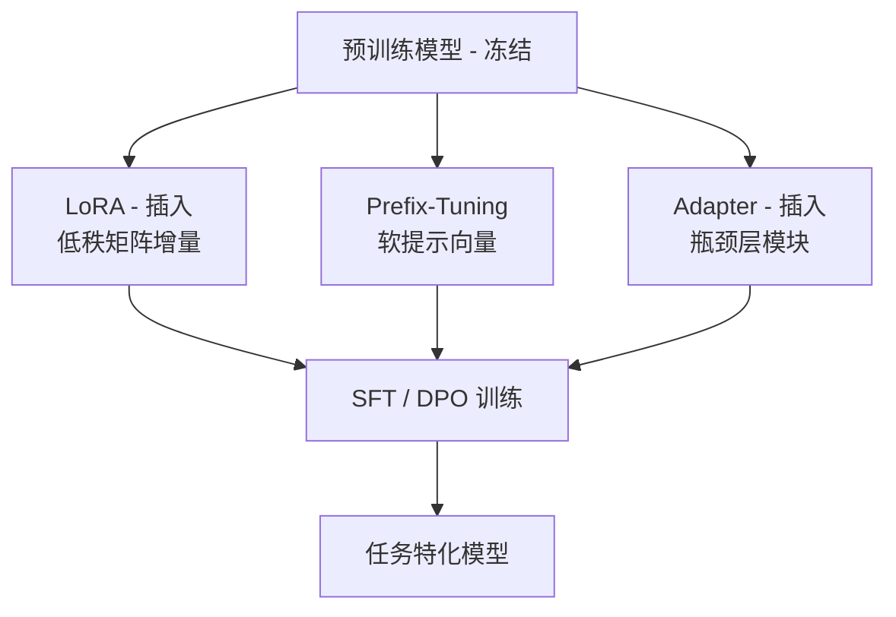
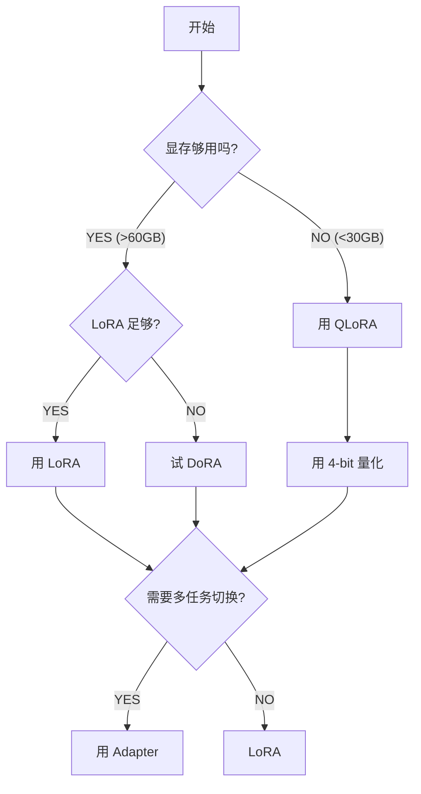
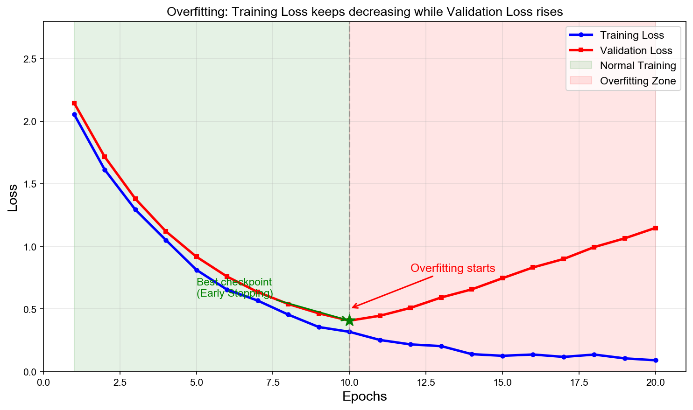

# Week 3 讲义：参数高效微调与 SFT 实战

> **核心目标**：理解参数高效微调的原理与选择，掌握 SFT 数据构建的最佳实践
>
> **学习时间**：6 小时
>
> **关键输出**：参数高效方案对比表 + SFT 数据格式模板 + 质量检查清单

---

## 📖 本周知识图谱



---

## 🔧 Part 1: 参数高效微调生态

### 1.1 为什么需要参数高效微调？

在 Phase 0 中，我们已经了解了 Full Fine-Tuning 的显存问题：

| 模型规模 | 权重 (FP32) | 梯度   | 优化器状态 (Adam) | **总计**   |
| -------- | ----------- | ------ | ----------------- | ---------- |
| 7B       | 28 GB       | 28 GB  | 56 GB             | **112 GB** |
| 13B      | 52 GB       | 52 GB  | 104 GB            | **208 GB** |
| 70B      | 280 GB      | 280 GB | 560 GB            | **1.1 TB** |

> [!WARNING]
> **Full FT 的核心瓶颈不是计算，而是显存。**
>
> A100 80GB 放不下 7B 模型的 Full FT；H100 80GB 放不下 13B 的 Full FT。

参数高效微调（PEFT）的核心思想：**冻结预训练权重，只训练少量新增参数**。

---

### 1.2 三大主流方案深度对比

#### 📌 方案 A：LoRA (Low-Rank Adaptation)

**发布时间**：2021 年（Microsoft）

**核心原理**：
- 冻结原始权重 $W$
- 插入低秩增量：$\Delta W = BA$，其中 $B \in \mathbb{R}^{d \times r}$，$A \in \mathbb{R}^{r \times d}$
- 前向传播：$h = Wx + BAx$

```text
原始层：      x → W → h
                    

LoRA 改造：   x → W → h     （冻结）
              └→ A → B → +   （训练）
```

**为什么有效？**

1. **低秩假设**：预训练模型的权重矩阵存在“秩缺陷”，有效秩远小于理论秩（详见 Phase 0 基础理论）。
2. **最小化调整**：$B$ 初始化为 0，确保训练开始时 $\Delta W = 0$，完全保留预训练知识
3. **即插即用**：推理时可将 $BA$ 合并到 $W$ 中，**零额外推理开销**

**完整的前向传播公式**：

$$h = Wx + \frac{\alpha}{r} \cdot BAx$$

其中 $\frac{\alpha}{r}$ 是**缩放因子**，用于控制 LoRA 增量对最终输出的贡献权重。

> [!NOTE]
> **为什么需要 alpha 缩放？**
>
> 当你改变 rank（如从 16 改到 64）时，矩阵 $BA$ 的"能量"会随之变化。通过固定 $\frac{\alpha}{r}$ 的比值（例如始终为 1 或 2），可以在调整 rank 时**无需重新调参学习率**，保持训练动态的稳定性。
>
> - `alpha = rank` → $\frac{\alpha}{r} = 1$（最常见，LoRA 增量不做额外放大）
> - `alpha = 2 * rank` → $\frac{\alpha}{r} = 2$（放大 LoRA 的影响，适合需要更大调整的任务）

**关键超参数**：

| 参数             | 含义         | 推荐值                  | 说明                                                                      |
| ---------------- | ------------ | ----------------------- | ------------------------------------------------------------------------- |
| `rank` (r)       | 低秩矩阵的秩 | 16-64                   | 越大性能越好，但显存开销增加                                              |
| `alpha` (α)      | 缩放系数     | `rank` 或 `2*rank`      | 调整 $\Delta W$ 的权重占比；固定 $\alpha/r$ 可在改变 $r$ 时保持学习率稳定 |
| `target_modules` | 应用层       | `q_proj`, `v_proj`, ... | 注意力层 + FFN 层（见下文）                                               |
| `lora_dropout`   | Dropout      | 0.05                    | 防止过拟合                                                                |

#### 🚀 1.2.1 LoRA 训练全流程详解

为了理解 LoRA 是如何工作的，我们需要看它在训练的各个阶段具体做了什么：

##### 1. 初始化阶段 (Initialization)

- Matrix $A$：使用高斯分布（Gaussian）或 Kaiming 初始化。这确保了在训练开始时，低秩支路有一定的随机“探索”能力。
- Matrix $B$：初始化为 **0**。
- 关键点：由于 $B=0$，初始状态下 $\Delta W = BA = 0$。这意味着模型在第一步训练时，逻辑上完全等价于原始预训练模型，不会出现由于随机插入层导致的”初始性能塌陷”。

> **💡 为何是 B=0 而非 A=0？**
>
> 两种方式在初始化时都能让 $\Delta W = BA = 0$，但选择 $B=0$ 而非 $A=0$ 有更深层的原因。
>
> 分析第一步训练的梯度（LoRA 分支输出 $y = B(Ax)$）：
>
> $$\frac{\partial L}{\partial B} \propto Ax \cdot (\text{上游梯度}), \qquad \frac{\partial L}{\partial A} \propto B^T \cdot (\text{上游梯度}) \cdot x$$
>
> - **当前方案（B=0，A=随机）**：$Ax \neq 0$，B 第一步就能收到有信息量的梯度，立即开始学习；与此同时，A 的随机值已在”探索”输入空间，为 B 提供了多样化的低秩投影。
> - **若反过来（A=0，B=随机）**：$Ax = 0$，B 第一步梯度为 0，只有 A 在动，B 要等 A 变为非零后才能跟上，整体学习更低效。
>
> 此外，这与残差网络（ResNet）中”**对新插入模块的最后一层做零初始化**”是同一设计哲学——B 是 LoRA 分支的输出端（最后一步），零初始化输出层确保插入的模块初始对主干网络的扰动为零，是标准的工程惯例。

##### 2. 前向传播阶段 (Forward Pass)

- 计算公式：$h = Wx + \frac{\alpha}{r} (BAx)$。
- 在实际硬件中，$Wx$ 和 $BAx$ 是**并行计算**的。
- 显存效率：在训练期间，只有输入 $x$ 需要被存储以用于梯度计算。由于 $W$ 是冻结的，我们不需要为 $W$ 存储 any 梯度相关的中间激活值。

##### 3. 反向传播阶段 (Backward Pass)

- 权重冻结：原始权重 $W$ 的梯度被封锁，不占用 any 显存空间（梯度张量为 None）。
- 梯度计算：只计算 $\frac{\partial \mathcal{L}}{\partial A}$ 和 $\frac{\partial \mathcal{L}}{\partial B}$。
- 由于 $A$ 和 $B$ 的参数量极小（通常不到 1%），梯度的存储 and 优化器状态（Adam 的一阶/二阶动量）的开销被极大压缩。

##### 4. 推理合并阶段 (Weight Folding)

- 训练完成后，我们可以利用矩阵乘法的分配律：
  $$h = Wx + \Delta Wx = (W + \Delta W)x$$
- 我们将训练好的 $BA$ 乘以缩放因子后，直接加回到 $W$ 中：
  $$W_{\text{new}} = W + \frac{\alpha}{r} BA$$
- 合并后：我们将 $W_{\text{new}}$ 保存，并移除 $A$ 和 $B$。在测试推理时，模型结构和原始模型完全一致，**没有 any 额外的延迟 (Latency)**。

---

**参数量计算**：

每个线性层添加 LoRA 后，新增参数量为：
$$\text{单层 LoRA 参数} = r \times d_{in} + d_{out} \times r$$

其中 $A \in \mathbb{R}^{r \times d_{in}}$，$B \in \mathbb{R}^{d_{out} \times r}$。

**详细例子**（Qwen2-7B，r=32，应用于全部 7 种 target_modules）：

| 模块类型      | 层名        | 维度 ($d_{in} \times d_{out}$) | 单层 LoRA 参数量                                 | 每 Block 数量 |
| ------------- | ----------- | ------------------------------ | ------------------------------------------------ | ------------- |
| **Attention** | `q_proj`    | $4096 \times 4096$             | $32 \times 4096 + 4096 \times 32 = 262\text{K}$  | 1             |
|               | `k_proj`    | $4096 \times 512$*             | $32 \times 4096 + 512 \times 32 = 147\text{K}$   | 1             |
|               | `v_proj`    | $4096 \times 512$*             | 同上 $= 147\text{K}$                             | 1             |
|               | `o_proj`    | $4096 \times 4096$             | $= 262\text{K}$                                  | 1             |
| **FFN**       | `gate_proj` | $4096 \times 11008$            | $32 \times 4096 + 11008 \times 32 = 483\text{K}$ | 1             |
|               | `up_proj`   | $4096 \times 11008$            | 同上 $= 483\text{K}$                             | 1             |
|               | `down_proj` | $11008 \times 4096$            | $32 \times 11008 + 4096 \times 32 = 483\text{K}$ | 1             |

*注：Qwen2 使用 GQA，KV 头数较少，所以 k_proj/v_proj 输出维度较小。

> [!NOTE]
> **FFN 层为什么有 3 个投影？（SwiGLU 结构）**
>
> 现代模型（LLaMA/Qwen）使用 **SwiGLU** 激活函数替代了传统的 GELU，其结构为：
> $$ \text{gate} = \text{SiLU}(x W_{\text{gate}}) \quad (\text{门控信号}) $$
> $$ \text{up} = x W_{\text{up}} \quad (\text{内容信号}) $$
> $$ \text{out} = (\text{gate} \odot \text{up}) W_{\text{down}} \quad (\text{逐元素相乘后降维}) $$
> 相比传统 2 层 FFN，SwiGLU 增加了一个 `gate_proj` 用于门控，实验证明性能更好。详见 Week 1 讲义中 SiLU 激活函数的讨论。

**汇总计算**：

- 每个 Transformer Block：$2.27\text{M}$
- 总层数：28 层
- **LoRA 总参数量**：$63.5\text{M}$（约 0.9%）

**显存对比**（BF16 精度）：

| 项目       | Full FT    | LoRA (r=32)   |
| ---------- | ---------- | ------------- |
| 模型权重   | 14 GB      | 14 GB (冻结)  |
| LoRA 参数  | -          | ~0.13 GB      |
| 梯度       | 14 GB      | ~0.13 GB      |
| 优化器状态 | 28 GB      | ~0.26 GB      |
| **总计**   | **~56 GB** | **~15-18 GB** |

---

#### 📌 方案 B：Prefix-Tuning

**发布时间**：2021 年（Stanford）

**核心原理**：
- 在每层的 Key/Value 前面拼接**可学习的前缀向量**
- 冻结整个模型，只训练前缀

```text
原始注意力：   [K_prompt] [V_prompt]
                  ↓          ↓
Prefix-Tuning：[P_k][K_prompt] [P_v][V_prompt]
               └─────────────────┘
                    可学习前缀
```

**数学表示**：
$$K' = [P_k; K], \quad V' = [P_v; V]$$

其中 $P_k, P_v \in \mathbb{R}^{l \times d}$，$l$ 是前缀长度（通常 10-100）。

**特点**：

- 完全不修改模型结构
- 推理时前缀可以缓存
- 前缀占用序列长度（影响有效上下文）
- 性能通常略低于 LoRA

---

#### 📌 方案 C：Adapter

**发布时间**：2019 年（Google）

**核心原理**：

- 在 Transformer 块内**插入小型瓶颈层**
- 冻结原始层，只训练 Adapter

```text
┌────────────────────────────────┐
│  原始 Transformer Block         │
│                                │
│  Attention → Adapter → Add&Norm │
│      ↓                         │
│  FFN → Adapter → Add&Norm      │
│                                │
└────────────────────────────────┘
```

**Adapter 结构**：

```text
              输入 (d)
                 │
          ┌──────┴──────┐
          │             │
          │      Down (d → r) ── 瓶颈层，r ≪ d
          │             ↓
          │          激活函数 (GeLU/ReLU)
          │             ↓
          │        Up (r → d)
          │             │
          └──── ⊕ ──────┘  ── 残差连接 (Add)
                 │
              输出 (d)
```

**数学表示与结合方式**：

一个 Adapter 层通常包含两个线性投影和一个非线性激活函数。其核心逻辑可以表示为：
$$\text{Adapter}(x) = \text{Linear}_{\text{up}}(\sigma(\text{Linear}_{\text{down}}(x)))$$

与原始表征的结合方式是**加法（Addition）**，即**残差连接**：
$$h_{\text{out}} = x + \text{Adapter}(x)$$

**为什么要这样设计？**

1. 瓶颈设计 (Bottleneck)：通过 $d \to r$ 再 $r \to d$（其中 $r \ll d$），极大压缩了可训练参数量。例如 $d=4096, r=64$，参数量只有全连接层的 $1/32$。
2. 残差连接 (Add)：
   - 初始化稳定：如果 Up 层的权重初始化为 0，那么在训练开始时 $\text{Adapter}(x) = 0$，整个模块等价于恒等映射 $h_{\text{out}} = x$。这保证了模型在初始阶段能完全保留预训练知识。
   - 防止退化：由于 Adapter 是插入到原始网络中的，加法结合方式确保了即使 Adapter 训练得不好，原始信号也能通过。
3. 结合位置：Adapter 通常插入在 Attention 后和 FFN 后，紧随在原始的 Add&Norm 之前。

---

### 1.3 三方案核心对比表

| 维度         | **LoRA**               | **Prefix-Tuning** | **Adapter**      |
| ------------ | ---------------------- | ----------------- | ---------------- |
| **核心思路** | 低秩矩阵增量           | 可学习软提示      | 瓶颈层插入       |
| **修改位置** | 注意力层投影           | KV 前缀           | Block 内插入     |
| **参数量**   | ~0.5%-1%               | ~0.1%-0.5%        | ~1%-5%           |
| **推理开销** | ✅ **零开销**（可合并） | ⚠️ 占用上下文      | ❌ **有额外计算** |
| **实现难度** | 简单                   | 简单              | 中等             |
| **性能**     | ⭐⭐⭐⭐⭐                  | ⭐⭐⭐               | ⭐⭐⭐⭐             |
| **适用场景** | 通用首选               | 受限环境          | 多任务切换       |

> [!TIP]
> **2024 年的实践共识**：LoRA 已成为事实标准。
>
> 除非有特殊需求（如极致参数压缩选 Prefix，或需要支持动态切换多任务选 Adapter），否则**直接选 LoRA**。

---

### 1.4 LoRA 变体与进阶

虽然 LoRA 已是事实标准，但为了进一步压榨性能和降低成本，业界延伸出了几种重要的进阶方案。

#### 📌 QLoRA：极致显存压缩

**原理**：不仅仅是 "4-bit + LoRA"，它包含三项核心创新：

1. 4-bit NormalFloat (NF4)：专门为符合正态分布的神经网络权重设计的非均匀量化数据类型。相比普通 4-bit Float，它能显著减少精度损失。
2. Double Quantization (双重量化)：对量化系数（Scaling factor / Absmax）再次进行量化。通常 absmax 也是 32-bit，QloRA 将其再次量化为 8-bit，单参数还能再省 0.37 bit。
3. Paged Optimizers (分页优化器) ：利用 NVIDIA 的存储管理机制，当 GPU 显存因长序列处理出现瞬时冲击（Spike）时，将优化器状态临时存储在 CPU 内存中，防止 OOM 报错。

**效果与代价**：

- **效果**：极度节省显存。7B 模型量化后权重仅占 ~5GB。
- **代价**：训练速度比标准 LoRA 稍慢（存在反量化开销），但在大部分任务上精度损失微乎其微。

**训练流程差异**：

1. 加载阶段：预训练权重 $W$ 以 4-bit NF4 格式加载进显存，而不是传统的 BF16/FP16。

2. 前向传播：计算 $Wx$ 时，系统会“即时”（On-the-fly）将 4-bit 的 $W$ 反量化回高精度，计算完成后立即丢弃高精度张量，仅保留量化权重。

3. 状态保存：分页优化器会将 Adam 的优化器状态设置为“可分页”，当 GPU 显存耗尽时，由驱动程序自动将其置换到 CPU RAM。

#### 📌 DoRA (Weight-Decomposed Low-Rank Adaptation)

**原理**：DoRA 将权重矩阵 $W$ 分解为**幅值 (Magnitude)** 和 **方向 (Direction)**：

$$W = m \cdot \frac{V}{||V||}$$

其中 $m$ 是长度为 $d$ 的向量（幅值），$V$ 是 $d \times k$ 的坐标矩阵（方向）。

- 在微调时，使用标准 LoRA 增量更新**方向矩阵 $V$**。
- **幅值向量 $m$** 则作为一个单独的参数参与梯度训练。

> [!TIP]
> **直观理解：如何从 $W$ 中分解出 $m$ 和 $V$？**
> 
> 假设原始预训练权重为 $W_0$（将其视为 $d$ 个 $k$ 维向量的集合）：
> 1. **提取幅值 $m$**：计算 $W_0$ 每一行（每个神经元）的 $L_2$ 范数。结果 $m$ 是一个 $d$ 维向量。
> 2. **提取方向 $V$**：初始化时直接令 $V = W_0$。注意 $V$ 本身不必是单位向量，真正的**方向向量**是 $\frac{V}{||V||}$（归一化后）。
> 3. **数学验证**：初始状态下 $W = m \cdot \frac{V}{||V||} = ||W_0||_c \cdot \frac{W_0}{||W_0||_c} = W_0$（其中 $||W_0||_c$ 表示按列计算的范数）。
>
> 💡 **核心洞察**：$\frac{V}{||V||}$ 才是真正的**单位方向向量**，$m$ 是**幅值**。这种设计实现了**解耦更新**：LoRA 负责旋转（改方向），$m$ 负责拉伸（改大小）。研究表明这种解耦更接近全参数微调的学习路径。


**效果与代价**：

- **效果**：解耦了权重的大小和方向更新，研究证明其学习路径更接近 Full Fine-tuning，性能通常优于标准 LoRA。
- **代价**：由于引入了归一化计算，训练时的显存占用略高于标准 LoRA（通常高出约 10%~20%），但在推理合并后依然是零开销。

**训练流程差异**：

1. 初始分解：将 $W$ 分解为幅值向量 $m$ 和方向矩阵 $W$。

2. 前向计算：公式变为 $h = m \frac{W + BA}{||W + BA||_c} x$。注意 $BA$ 是插入到内部的方向矩阵更新。

3. 梯度更新：优化器同时更新三个部分：幅值向量 $m$、低秩矩阵 $A$ 和 $B$。

#### 📌 LoRA+ (Differential Learning Rates)

**原理**：LoRA+ 的核心非常简单——**差异化学习率**：
$$\text{lr}_B = \lambda \cdot \text{lr}_A \quad (\lambda \text{ 通常推荐为 } 8 \sim 16)$$
在 LoRA 中，**矩阵 $A$ 负责将输入映射到低秩空间，矩阵 $B$ 负责将低秩表示恢复**。理论证明，对于较宽的网络，$B$ 矩阵需要更大的学习率才能实现更高效的特征学习。

**效果与代价**：

- **效果**：收敛速度提升约 2 倍，且能显著提高在大规模模型上的微调性能（通常提升 1-2% 准确率）。
- **代价**：没有任何额外的显存或推理负担，属于“白给”的优化。

**训练流程差异**：

1. 参数分组：在构建优化器之前，通过参数名识别出属于 $A$ 矩阵和 $B$ 矩阵的参数（例如包含 `lora_B` 关键字的参数）。

2. 优化器配置：为两组参数分配不同的学习率，而不是在网络传播逻辑中做修改。

---

### 1.5 参数高效方案决策树



---

### 1.6 实战实现：工具与代码库支持

在实际生产中，你不需要从零实现这些复杂的数学逻辑。Hugging Face 的 `peft` 库和 `transformers` 库已经提供了成熟的支持。

#### 📦 所需核心库

```bash
pip install transformers peft bitsandbytes accelerate
```

#### 🛠️ QLoRA 实现代码

QLoRA 主要通过 `BitsAndBytesConfig` 在模型加载阶段实现：

```python
from transformers import AutoModelForCausalLM, BitsAndBytesConfig
import torch

# 1. 配置 4-bit 量化
bnb_config = BitsAndBytesConfig(
    load_in_4bit=True,
    bnb_4bit_quant_type="nf4",               # 使用 NF4
    bnb_4bit_use_double_quant=True,         # 开启双重量化
    bnb_4bit_compute_dtype=torch.bfloat16    # 计算时用的精度
)

# 2. 加载量化后的基础模型
model = AutoModelForCausalLM.from_pretrained(
    "Qwen/Qwen2-7B",
    quantization_config=bnb_config,
    device_map="auto"
)
```

#### 🛠️ DoRA 实现代码

DoRA 仅需在 `LoraConfig` 中开启一个开关：

```python
from peft import LoraConfig, get_peft_model

config = LoraConfig(
    r=32,
    lora_alpha=64,
    target_modules=["q_proj", "v_proj"],
    use_dora=True,        # 👈 核心开关：开启方向/幅值分解
    lora_dropout=0.05,
    bias="none"
)

model = get_peft_model(model, config)
```

#### 🛠️ LoRA+ 实现代码

LoRA+ 既可以使用专门的 Trainer，也可以通过包装优化器实现：

```python
# 方案 A：使用专用 Trainer
from peft.optimizers import LoraPlusTrainingArguments
from trl import SFTTrainer # 或使用 LoraPlusTrainer

training_args = LoraPlusTrainingArguments(
    output_dir="./outputs",
    learning_rate=5e-5,
    loraplus_lr_ratio=16.0,  # 👈 核心参数：B 矩阵学习率是 A 的 16 倍
    per_device_train_batch_size=4,
)

# 方案 B：直接创建 LoRA+ 优化器（适合自定义训练循环）
from peft.optimizers import create_loraplus_optimizer

optimizer = create_loraplus_optimizer(
    model, 
    optimizer_cls=torch.optim.AdamW, 
    lr=5e-5, 
    loraplus_lr_ratio=16.0
)
```

#### 📊 库支持矩阵

| 变体      | 核心依赖库        | 主要实现方式                                     |
| :-------- | :---------------- | :----------------------------------------------- |
| **QLoRA** | `bitsandbytes`    | `BitsAndBytesConfig` + `LoraConfig`              |
| **DoRA**  | `peft` (>= 0.9.0) | `LoraConfig(use_dora=True)`                      |
| **LoRA+** | `peft`            | `LoraPlusTrainer` 或 `create_loraplus_optimizer` |

---

## 📝 Part 2: SFT 深入

### 2.1 SFT 的本质

**监督微调（Supervised Fine-Tuning）** 的目标很简单：
- 输入：{指令, 期望输出} 对
- 目标：让模型学会"看到指令 → 输出期望答案"

**数学表述**：
$$\mathcal{L} = -\sum_{i} \log P_\theta(y_i | x_i)$$

其中 $x_i$ 是指令，$y_i$ 是期望输出。

> [!IMPORTANT]
> **SFT 不是"教模型新知识"，而是"激活并格式化预训练知识"。**
>
> 如果预训练模型不具备某种能力，SFT 无法凭空创造。

#### 💡 如何判断预训练模型是否具备某种能力？

这是一个关键的实践问题。在投入 SFT 资源之前，应该先验证模型的能力边界。

**方法 1：Zero-shot / Few-shot 测试（最直接）**

在 SFT 之前，直接用 **base model** 进行推理：

```python
# 直接问 base model（不是 instruct/chat 版本）
prompt = "<video>这段视频中摄像机是如何运动的？"
output = base_model.generate(prompt)
```

| 输出表现                   | 能力判断     | SFT 预期效果                       |
| -------------------------- | ------------ | ---------------------------------- |
| 给出合理答案（即使格式乱） | ✅ 有能力     | SFT 可以格式化输出                 |
| 理解问题但答案模糊         | ⚠️ 有部分能力 | SFT 可能有效，需更多数据           |
| 完全无法理解 / 胡言乱语    | ❌ 缺乏能力   | SFT 无法创造，需换模型或继续预训练 |

**方法 2：查阅模型技术报告 / Model Card**

预训练数据决定了能力边界。例如 Qwen2-VL 技术报告明确说明：
- 训练数据包含大量视频-文本对
- 支持动态分辨率的图像/视频输入
- 在视频理解 benchmark 上有良好表现

**方法 3：相关 Benchmark 参考**

查看模型在相关任务上的公开表现。如果模型在类似任务（如 Video-MME、MVBench）上有不错的分数，说明基础能力存在。

**方法 4：渐进式探测（Probing）**

设计一系列由简到难的问题，观察模型在哪个难度级别开始失效：

```
Level 1: "视频中有什么？"           → 测试基础视觉理解
Level 2: "镜头在移动吗？"           → 测试运动感知
Level 3: "摄像机是向左还是向右平移？" → 测试精确判断
Level 4: "摄像机运动的速度如何？"    → 测试细粒度理解
```

> [!TIP]
> **实践建议**：在开始 SFT 之前，随机抽取 5-10 个目标任务样本，用 base model 直接推理。如果能给出"大致正确但格式不规范"的答案，那 SFT 就是在**激活并格式化**这个能力，成功率很高。

**能力边界案例对比**：

| 场景                     | 预训练是否覆盖   | SFT 效果                    |
| ------------------------ | ---------------- | --------------------------- |
| Qwen-VL + 摄像机运动理解 | ✅ 视频预训练包含 | 有效（格式化输出）          |
| 纯文本 LLM + 图像理解    | ❌ 从未见过图像   | 无效（需多模态预训练）      |
| LLM + 知识截止后的新闻   | ❌ 时间截止       | 无效（需 RAG 或继续预训练） |
| LLM + 特定编程风格       | ✅ 预训练含代码   | 有效（可以教特定风格）      |

#### 🔬 SFT 能力边界深入分析：模型"会回答但不准确"怎么办？

在实践中经常遇到一种**灰色地带**：模型理解了问题、尝试回答，但准确率不够高。这种情况 SFT 能否帮助？

**能力的两个层次**：

```text
层次 1：任务理解能力（Task Comprehension）
  → 模型知道你在问什么，尝试给出相关回答

层次 2：任务执行能力（Task Execution）
  → 模型能给出正确的答案
```

如果模型有层次 1 但层次 2 不完美，SFT 能否提升准确性**取决于不准确的根本原因**：

| 不准确的原因         | 表现                         | SFT 能解决吗？                |
| -------------------- | ---------------------------- | ----------------------------- |
| **概念映射模糊**     | 分不清 pan/tilt/zoom 的定义  | ✅ 可以 — 通过标注数据校准概念 |
| **注意力分散**       | 被画面内容干扰，忽略运动本身 | ✅ 可能 — 指令设计可引导聚焦   |
| **边界情况困难**     | 慢速运动、复杂背景下判断差   | ⚠️ 部分可以 — 需大量边界样本   |
| **视觉特征提取不足** | 根本"看不到"运动信息         | ❌ 不行 — 需更强的视觉编码器   |

**诊断方法**：

1. **简单 vs 复杂场景对比**：
   - 准备两组样本：纯色背景+明确运动 vs 复杂背景+多运动叠加
   - 如果简单场景准确率高、复杂场景低 → 注意力/鲁棒性问题，SFT 有希望
   - 如果都很低 → 可能是视觉能力不足，SFT 效果有限

2. **Few-shot 提示测试**：
   - 给模型几个正确示例后再测试
   - 如果准确率明显提升 → 模型有能力，只需校准，SFT 很可能有效
   - 如果仍然不准 → 更底层的能力问题

3. **错误模式分析**：
   - 收集 20-30 个错误样本，分析是否有规律
   - 规律性错误（如总把左右搞混）→ 概念校准问题，SFT 可解决
   - 随机错误 → 可能是更深层的能力问题

**预期效果估计**（假设 base model 准确率约 50%）：

| SFT 数据量 | 预期准确率 | 说明         |
| ---------- | ---------- | ------------ |
| 100-500 条 | 60-65%     | 初步校准     |
| 1k-5k 条   | 70-80%     | 明显提升     |
| 10k+ 条    | 85%+       | 接近任务上限 |

> [!WARNING]
> **存在上限**：如果视觉编码器本身能力不足，无论多少 SFT 数据都无法突破这个上限。此时需要考虑换用更强的多模态模型，或对视觉编码器进行继续预训练。

---

### 2.2 指令格式设计

#### 通用 Chat 模板

大多数开源模型使用类似的格式：

```markdown
<|im_start|>system
你是一个有帮助的助手。
<|im_end|>
<|im_start|>user
{用户问题}
<|im_end|>
<|im_start|>assistant
{模型回答}
<|im_end|>
```

**Qwen 系列的模板**：

```python
# Qwen2/Qwen2.5/Qwen3 的 chat template
messages = [
    {"role": "system", "content": "You are a helpful assistant."},
    {"role": "user", "content": "描述这个视频的摄像机运动"},
    {"role": "assistant", "content": "视频展示了从左到右的平移运动"}
]
```

#### 多模态数据格式（Qwen-VL 系列）

Qwen-VL 系列已经过多代升级，各版本的消息格式**外部结构基本一致**，但内部处理机制有差异。

**通用消息格式（适用于 Qwen2-VL / Qwen2.5-VL / Qwen3-VL）**：

```python
# 视频理解任务的标准格式
messages = [
    {
        "role": "user",
        "content": [
            {"type": "video", "video": "<video_path>"},
            {"type": "text", "text": "用一句话描述视频中的摄像机运动"}
        ]
    },
    {
        "role": "assistant",
        "content": "摄像机从左向右平移，同时略微向上倾斜"
    }
]
```

> [!WARNING]
> **版本差异注意事项**
>
> 虽然消息格式结构相同，但各版本在**视频处理参数**和**内部机制**上有重要差异：

**Qwen-VL 各版本对比**：

| 特性           | Qwen2-VL                   | Qwen2.5-VL                   | Qwen3-VL (2025.9+)                    |
| -------------- | -------------------------- | ---------------------------- | ------------------------------------- |
| **消息格式**   | ChatML JSON                | ChatML JSON（兼容）          | ChatML JSON（兼容）                   |
| **视频采样**   | 固定 FPS                   | 动态 FPS 采样                | 动态 FPS + Text-Timestamp Alignment   |
| **位置编码**   | MRoPE                      | 修正版 MRoPE（时间维度优化） | Interleaved-MRoPE（全频率覆盖）       |
| **长视频支持** | 一般                       | 1小时+                       | 多小时（256K原生，可扩展至1M tokens） |
| **关键超参数** | `min_pixels`, `max_pixels` | 新增 `tokens_per_second`     | 新增时间戳输出格式（秒/HMS）          |

**版本特定的参数配置**：

```python
# Qwen2-VL 基础配置
from qwen_vl_utils import process_vision_info

processor = AutoProcessor.from_pretrained(
    "Qwen/Qwen2-VL-7B-Instruct",
    min_pixels=256*28*28,
    max_pixels=1280*28*28
)

# Qwen2.5-VL 新增参数
processor = AutoProcessor.from_pretrained(
    "Qwen/Qwen2.5-VL-7B-Instruct",
    min_pixels=256*28*28,
    max_pixels=1280*28*28,
    # 新增：控制视频时间维度的 token 密度
    # tokens_per_second 影响时间位置编码的计算
)

# Qwen3-VL 时间戳对齐（新特性）
messages = [
    {
        "role": "user",
        "content": [
            {"type": "video", "video": "<video_path>"},
            {"type": "text", "text": "视频中的摄像机在第几秒开始向左平移？"}
        ]
    },
    {
        "role": "assistant",
        # Qwen3-VL 支持精确到秒的时间定位
        "content": "摄像机在第 3.5 秒开始向左平移，持续约 2 秒"
    }
]
```

**选择建议**：

| 你的任务需求           | 推荐版本                   |
| ---------------------- | -------------------------- |
| 快速验证、资源受限     | Qwen2-VL-7B                |
| 生产级部署、长视频     | Qwen2.5-VL-7B              |
| 时间定位任务、最新特性 | Qwen3-VL（如已发布稳定版） |

> **参考来源**：
> - [Qwen 官方文档](https://qwen.ai)
> - [Qwen2.5-VL 技术分析](https://towardsai.net)
> - [Qwen3-VL 论文](https://arxiv.org)

#### Tokenizer 如何将格式转化为训练输入

上面展示的都是**数据层**的格式——方便工程师标注和存储的 JSON 结构。但模型训练时，tokenizer 需要将其转换为**训练层**：一段带有特殊 token 的原始文本序列，再编码为整数 ID。

**第一步：`apply_chat_template()` — JSON → ChatML 原始文本**

HuggingFace `tokenizer` 的 `apply_chat_template()` 方法负责这个转换：

```python
from transformers import AutoTokenizer

tokenizer = AutoTokenizer.from_pretrained("Qwen/Qwen2.5-7B-Instruct")

messages = [
    {"role": "system", "content": "你是一个有帮助的助手。"},
    {"role": "user", "content": "描述这个视频的摄像机运动"},
    {"role": "assistant", "content": "视频展示了从左到右的平移运动"}
]

# 转换为带 special token 的原始文本
text = tokenizer.apply_chat_template(
    messages,
    tokenize=False,       # 先只看文本，不转 ID
    add_generation_prompt=False
)
```

输出的 `text` 正是那段 ChatML 原始文本：

```
<|im_start|>system
你是一个有帮助的助手。<|im_end|>
<|im_start|>user
描述这个视频的摄像机运动<|im_end|>
<|im_start|>assistant
视频展示了从左到右的平移运动<|im_end|>
```

再经 `tokenizer(text)` 编码为整数 ID 序列，送入模型。`<|im_start|>`、`<|im_end|>` 是 Week1 Part 0 中介绍的 special tokens，在 Qwen 词表中有固定的 ID。

**第二步：Loss Mask — 只对 assistant 轮计算损失**

token ID 序列准备好之后，训练框架还需要构造 **labels**（即 loss mask）。SFT 的目标是让模型学会生成 assistant 的回答，因此：

- `assistant` 轮的 token → label = 对应 token ID（参与损失计算）
- `system` / `user` 轮的 token → label = **-100**（PyTorch 的 ignore index，不计算损失）

```
Token:  <|im_start|> system  你是... <|im_end|>  <|im_start|> user  描述... <|im_end|>  <|im_start|> assistant  视频...  <|im_end|>
Label:     -100       -100    -100      -100          -100      -100   -100     -100          -100         -100      [计算Loss]   [计算Loss]
```

**为什么这样设计？** 如果对 system 和 user 轮也计算损失，模型会同时"学习"生成用户输入——这是我们不想要的。我们只希望模型学会在给定上文的条件下，生成正确的 assistant 回答。

> **📎 深入阅读**
>
> Week9 附录 A.6 包含这套机制更完整的展开，涵盖 Alpaca / ShareGPT / OpenAI messages 三种 JSON 格式与 ChatML 训练格式的对应关系，以及工具调用场景下 loss mask 的特殊处理。（见 **Week9 讲义 → 附录 A.6**）

---

### 2.3 SFT 数据质量要求

#### 黄金标准

| 维度       | 要求               | 反面案例                 |
| ---------- | ------------------ | ------------------------ |
| **准确性** | 答案必须正确       | "地球是平的"（事实错误） |
| **一致性** | 格式统一、风格一致 | 有时用中文，有时用英文   |
| **多样性** | 覆盖任务的各种变体 | 全是"是/否"问题          |
| **完整性** | 回答不能截断或缺失 | "答案是..."（未完成）    |
| **无害性** | 不含有害/偏见内容  | 歧视性表述               |

#### 常见质量问题及检测方法

```python
# 质量检查清单
def quality_check(sample):
    issues = []
    
    # 1. 长度检查
    if len(sample["output"]) < 10:
        issues.append("输出过短，可能不完整")
    if len(sample["output"]) > 2000:
        issues.append("输出过长，可能包含冗余")
    
    # 2. 格式检查
    if sample["output"].startswith(" "):
        issues.append("输出有前导空格")
    if sample["output"].endswith("..."):
        issues.append("输出可能被截断")
    
    # 3. 重复检查
    words = sample["output"].split()
    if len(words) != len(set(words)) * 0.5:  # 高重复率
        issues.append("存在大量重复词汇")
    
    # 4. 语言一致性
    if contains_mixed_language(sample["output"]):
        issues.append("存在中英混杂")
    
    return issues
```

---

### 2.4 数据规模与质量的权衡

#### Scaling Law 在 SFT 中的体现

**关键发现**（来自 LLaMA 2、Alpaca 等研究）：

1. **质量 > 数量**：1000 条高质量数据可能优于 10000 条低质量数据
2. **边际递减**：超过一定规模后，增加数据的收益递减
3. **多样性关键**：覆盖更多任务类型比重复相同类型更重要

**经验法则**：

| 任务复杂度 | 推荐数据量  | 说明           |
| ---------- | ----------- | -------------- |
| 简单分类   | 500-2000    | 如情感分析     |
| 中等任务   | 2000-10000  | 如 VQA、摘要   |
| 复杂推理   | 10000-50000 | 如数学题、代码 |

#### 你的任务（CameraBench VQA）：

- 任务类型：视觉问答（中等复杂度）
- 推荐起始规模：**5000-10000** 条高质量数据
- 验证集：保留 10-20% 用于验证

---

### 2.5 过拟合的征兆与缓解

#### 过拟合的表现



*图：过拟合的典型表现 — Training Loss 持续下降，而 Validation Loss 先降后升。绿色星号标记最佳检查点位置（Early Stopping）。*

| 现象                           | 说明               | 严重程度 |
| ------------------------------ | ------------------ | -------- |
| Train loss 下降，Val loss 上升 | 经典过拟合         | ⚠️ 高     |
| Train loss 接近 0              | 模型"记住"了训练集 | ⚠️ 高     |
| 输出风格与训练数据高度相似     | 格式过拟合         | ⚠️ 中     |
| 在新指令上表现差               | 泛化能力下降       | ⚠️ 高     |

#### 缓解策略

| 策略             | 具体做法                    | 效果  |
| ---------------- | --------------------------- | ----- |
| **早停**         | 监控 val_loss，在最优点停止 | ⭐⭐⭐⭐⭐ |
| **增加 Dropout** | LoRA dropout = 0.05-0.1     | ⭐⭐⭐   |
| **降低学习率**   | 使用更小的 peak_lr          | ⭐⭐⭐⭐  |
| **增加数据**     | 扩充训练集                  | ⭐⭐⭐⭐⭐ |
| **数据增强**     | 改写指令、添加噪声          | ⭐⭐⭐   |

---

### 2.6 SFT 超参配置推荐

#### 基础配置（7B 模型 + LoRA）

```yaml
# 训练配置
per_device_train_batch_size: 4
gradient_accumulation_steps: 4
effective_batch_size: 16  # 4 × 4

# 学习率
learning_rate: 2e-4
lr_scheduler_type: "cosine"
warmup_ratio: 0.03

# LoRA 配置
lora_rank: 32
lora_alpha: 64
lora_dropout: 0.05
target_modules: ["q_proj", "v_proj", "k_proj", "o_proj", "gate_proj", "up_proj", "down_proj"]

# 训练时长
num_train_epochs: 3
max_steps: -1  # 使用 epoch 控制

# 保存与评估
save_strategy: "steps"
save_steps: 500
eval_strategy: "steps"
eval_steps: 500

# 精度
bf16: true
```

#### 关键超参解释

| 参数            | 推荐值      | 说明                          |
| --------------- | ----------- | ----------------------------- |
| `learning_rate` | 1e-4 ~ 5e-4 | LoRA 可用比 Full FT 更大的 LR |
| `lora_rank`     | 16-64       | 任务越复杂，rank 应越大       |
| `lora_alpha`    | 2×rank      | 经验法则                      |
| `num_epochs`    | 1-3         | 过多容易过拟合                |
| `warmup_ratio`  | 0.03-0.1    | 稳定训练初期                  |

---

### 2.7 SFT 微调效果评估

微调完成后，如何系统地评估模型效果？这是决定模型能否上线的关键环节。

#### 评估的三个层次

```text
┌─────────────────────────────────────────────────────────────────┐
│                      SFT 评估金字塔                               │
├─────────────────────────────────────────────────────────────────┤
│                                                                 │
│                        ┌───────────┐                            │
│                        │  人工评估  │  ← 最可靠，但成本最高         │
│                        │ (Human Eval)│                          │
│                        └─────┬─────┘                            │
│                    ┌─────────┴─────────┐                        │
│                    │   LLM-as-Judge    │  ← 平衡成本与质量        │
│                    │  (GPT-4/Claude)   │                        │
│                    └─────────┬─────────┘                        │
│              ┌───────────────┴───────────────┐                  │
│              │        自动化指标评估          │  ← 快速迭代必备     │
│              │  (BLEU, ROUGE, F1, Accuracy)  │                  │
│              └───────────────────────────────┘                  │
│                                                                 │
└─────────────────────────────────────────────────────────────────┘
```

#### 层次 1：自动化指标评估

**通用 NLG 指标**：

| 指标          | 适用场景     | 计算方式                     | 局限性               |
| ------------- | ------------ | ---------------------------- | -------------------- |
| **BLEU**      | 翻译、摘要   | n-gram 精确匹配              | 忽略语义，惩罚多样性 |
| **ROUGE-L**   | 摘要、问答   | 最长公共子序列               | 对同义表达不敏感     |
| **F1 Score**  | 抽取式任务   | 精确率×召回率调和            | 需要精确匹配标签     |
| **Accuracy**  | 分类/选择题  | 完全匹配                     | 仅适用于封闭答案     |
| **BERTScore** | 通用文本生成 | 语义相似度（BERT embedding） | 计算成本较高         |

**VQA 任务的特定指标**：

```python
# 对于 CameraBench 这类 VQA 任务，推荐组合使用
evaluation_metrics = {
    # 1. 精确匹配（适用于选择题或短答案）
    "exact_match": lambda pred, gt: pred.strip().lower() == gt.strip().lower(),

    # 2. 包含匹配（适用于关键词判断）
    "contains_match": lambda pred, gt: gt.lower() in pred.lower(),

    # 3. F1 Score（适用于多词答案）
    "token_f1": compute_f1,  # 基于 token 重叠的 F1

    # 4. 语义相似度（适用于开放式回答）
    "semantic_sim": compute_bertscore,
}
```

**实现示例**：

```python
from collections import Counter

def compute_f1(prediction: str, ground_truth: str) -> float:
    """计算基于 token 的 F1 分数"""
    pred_tokens = prediction.lower().split()
    gt_tokens = ground_truth.lower().split()

    common = Counter(pred_tokens) & Counter(gt_tokens)
    num_same = sum(common.values())

    if num_same == 0:
        return 0.0

    precision = num_same / len(pred_tokens)
    recall = num_same / len(gt_tokens)
    f1 = 2 * precision * recall / (precision + recall)
    return f1

def evaluate_batch(predictions: list, ground_truths: list) -> dict:
    """批量评估"""
    exact_matches = []
    f1_scores = []

    for pred, gt in zip(predictions, ground_truths):
        exact_matches.append(pred.strip().lower() == gt.strip().lower())
        f1_scores.append(compute_f1(pred, gt))

    return {
        "exact_match": sum(exact_matches) / len(exact_matches),
        "avg_f1": sum(f1_scores) / len(f1_scores),
        "num_samples": len(predictions)
    }
```

#### 层次 2：LLM-as-Judge（推荐）

使用强大的 LLM（如 GPT-4、Claude）作为评判者，评估生成质量。

**优势**：
- 能理解语义等价性（"向左平移" ≈ "镜头左移"）
- 可评估多维度质量（准确性、流畅性、完整性）
- 成本比人工评估低，质量比自动指标高

**评估 Prompt 模板**：

```python
judge_prompt = "
你是一个专业的视频理解评估专家。请评估模型对摄像机运动的描述是否正确。

**视频问题**: {question}
**标准答案**: {ground_truth}
**模型回答**: {prediction}

请从以下维度评分（1-5分）：

1. **准确性** (Accuracy): 摄像机运动方向、类型是否正确？
2. **完整性** (Completeness): 是否描述了所有重要的运动？
3. **清晰度** (Clarity): 表述是否清晰易懂？

输出格式（JSON）：
{
    \"accuracy\": <1-5>,
    \"completeness\": <1-5>,
    \"clarity\": <1-5>,
    \"overall\": <1-5>,
    \"reasoning\": \"<简要说明评分理由>\"
}
"

def llm_judge(question, ground_truth, prediction, client):
    """使用 LLM 作为评判者"""
    response = client.chat.completions.create(
        model="gpt-4",
        messages=[
            {"role": "system", "content": "你是一个严格的评估专家。"},
            {"role": "user", "content": judge_prompt.format(
                question=question,
                ground_truth=ground_truth,
                prediction=prediction
            )}
        ],
        temperature=0
    )
    return parse_json(response.choices[0].message.content)
```

**成本控制建议**：

| 评估阶段 | 样本量     | 方法         | 预估成本 |
| -------- | ---------- | ------------ | -------- |
| 快速迭代 | 全量       | 自动指标     | 免费     |
| 版本对比 | 100-500 条 | LLM-as-Judge | $5-20    |
| 上线前   | 50-100 条  | 人工 + LLM   | $50-100  |

#### 层次 3：人工评估

**何时需要人工评估**：
- 模型即将上线部署
- 自动指标和 LLM 评估结果不一致
- 需要评估主观质量（如用户体验）

**人工评估设计**：

```text
┌─────────────────────────────────────────────────────┐
│                  评估任务说明                         │
├─────────────────────────────────────────────────────┤
│                                                     │
│  请观看视频并阅读模型的回答，评估以下维度：                │
│                                                     │
│  【1. 正确性 (1-5)】                                  │
│    5: 完全正确，准确描述了摄像机运动                     │
│    4: 基本正确，有小误差                               │
│    3: 部分正确，遗漏了重要信息                          │
│    2: 大部分错误                                      │
│    1: 完全错误                                       │
│                                                     │
│  【2. 与参考答案对比】                                 │
│    □ 比参考答案更好                                   │
│    □ 与参考答案相当                                   │
│    □ 比参考答案差                                     │
│                                                     │
│  【3. 是否可接受上线】                                 │
│    □ 可以                                           │
│    □ 需要改进                                        │
│    □ 不可接受                                        │
│                                                     │
└─────────────────────────────────────────────────────┘
```

#### 评估流程最佳实践

**评估检查清单**：

```text
□ 评估准备
  ├─ [ ] 准备独立的测试集（未用于训练）
  ├─ [ ] 测试集覆盖各种难度和类型
  ├─ [ ] 确定评估指标和目标阈值
  └─ [ ] 准备 baseline 模型用于对比

□ 自动评估
  ├─ [ ] 运行自动指标评估脚本
  ├─ [ ] 记录各项指标得分
  ├─ [ ] 与 baseline 进行对比
  └─ [ ] 分析错误样本分布

□ 深度评估（选择性）
  ├─ [ ] 抽取 100-200 条进行 LLM-as-Judge
  ├─ [ ] 分析 LLM 评分与自动指标的相关性
  └─ [ ] 识别自动指标无法捕捉的问题

□ 人工抽检（上线前）
  ├─ [ ] 随机抽取 50 条进行人工评估
  ├─ [ ] 重点检查 LLM 评分较低的样本
  └─ [ ] 确认模型输出无安全问题
```

**评估报告模板**：

```text
================================================================
                    SFT 微调评估报告
================================================================

【模型信息】
  - 基础模型：Qwen2.5-VL-7B-Instruct
  - 微调方法：LoRA (rank=32, alpha=64)
  - 训练数据：CameraBench 5000 条
  - 训练轮数：3 epochs

【自动指标评估】(N=1000)
  ┌─────────────┬──────────┬────────┬────────┐
  │ 指标         │ Baseline │ 微调后  │ 提升   │
  ├─────────────┼──────────┼────────┼────────┤
  │ Exact Match │ 45.2%    │ 68.7%  │ +23.5% │
  │ Token F1    │ 0.52     │ 0.78   │ +0.26  │
  │ BERTScore   │ 0.71     │ 0.85   │ +0.14  │
  └─────────────┴──────────┴────────┴────────┘

【LLM-as-Judge 评估】(N=200)
  ┌──────────┬──────────────┐
  │ 维度      │ 平均分 (1-5)  │
  ├──────────┼──────────────┤
  │ 准确性    │ 4.2          │
  │ 完整性    │ 3.8          │
  │ 清晰度    │ 4.5          │
  │ 综合      │ 4.1          │
  └──────────┴──────────────┘

【人工抽检】(N=50)
  - 可接受率：92%
  - 主要问题：对复杂运动组合描述不够精确

【结论】
  模型达到上线标准，建议持续收集 bad case 进行迭代。

================================================================
```

> [!TIP]
> **评估的核心原则**：
> 1. **测试集必须独立** — 绝不能用训练数据评估
> 2. **多维度评估** — 单一指标无法反映全貌
> 3. **与 baseline 对比** — 只有相对提升才有意义
> 4. **关注 bad cases** — 错误样本比正确样本更有价值

---

## 🛠️ Part 3: 实战指南

### 3.1 跑通微调流程检查清单

```markdown
□ 环境准备
  ├─ [ ] 安装 transformers >= 4.37
  ├─ [ ] 安装 peft >= 0.8
  ├─ [ ] 安装 deepspeed (可选，多卡推荐)
  └─ [ ] 验证 GPU 可用 (torch.cuda.is_available())

□ 数据准备
  ├─ [ ] 数据格式符合模型要求
  ├─ [ ] 训练/验证集划分完成
  ├─ [ ] 运行 quality_check.py 脚本 (由 quality_check 函数演化)
  └─ [ ] 抽样人工检查 20 条

□ 配置验证
  ├─ [ ] 单条数据前向传播成功
  ├─ [ ] 小 batch 训练 10 步无报错
  ├─ [ ] 显存占用在预期范围内
  └─ [ ] Loss 正常下降

□ 训练执行
  ├─ [ ] 开启 wandb/tensorboard 监控
  ├─ [ ] 设置合理的 checkpoint 间隔
  ├─ [ ] 观察前 100 步的 loss 曲线
  └─ [ ] 验证 loss 同步监控

□ 模型评估
  ├─ [ ] 加载 checkpoint 成功
  ├─ [ ] 手动测试 5 个样例
  ├─ [ ] 运行自动化评估脚本
  └─ [ ] 对比 baseline 性能
```

### 3.2 常见问题诊断

| 现象            | 可能原因               | 解决方案               |
| --------------- | ---------------------- | ---------------------- |
| Loss 不下降     | LR 太小 / 数据问题     | 增大 LR / 检查数据格式 |
| Loss 爆炸 (NaN) | LR 太大 / 数值溢出     | 减小 LR / 检查 BF16    |
| 显存溢出 (OOM)  | Batch 太大 / rank 太高 | 减小 batch / 降低 rank |
| 输出乱码        | Tokenizer 不匹配       | 检查 tokenizer 版本    |
| 输出重复        | 过拟合 / 温度太低      | 早停 / 调整采样参数    |

---

## 📊 本周产出清单

- [ ] **参数高效方案对比表**（已包含在本讲义 1.3 节）
- [ ] **SFT 数据格式模板**（已包含在本讲义 2.2 节）
- [ ] **质量检查清单**（已包含在本讲义 3.1 节）
- [ ] **可运行的微调 pipeline**（参考实战路线图 Milestone 1 & 2）
- [ ] **100 条数据的 baseline 结果**（实验记录）

---

## 🔗 延伸阅读

| 资源                                                                                             | 说明                |
| ------------------------------------------------------------------------------------------------ | ------------------- |
| [LoRA 原论文](https://arxiv.org/abs/2106.09685)                                                  | 理论基础必读        |
| [QLoRA 论文](https://arxiv.org/abs/2305.14314)                                                   | 4-bit 量化技术      |
| [Alpaca: A Strong Instruction-following Model](https://crfm.stanford.edu/2023/03/13/alpaca.html) | SFT 经典实践        |
| [LIMA: Less Is More for Alignment](https://arxiv.org/abs/2305.11206)                             | 证明数据质量 > 数量 |
| [Hugging Face PEFT 文档](https://huggingface.co/docs/peft)                                       | 实战必备            |

---

**下一周预告**：Week 4 将深入 RLHF 与 DPO，理解对齐技术的完整演进。
