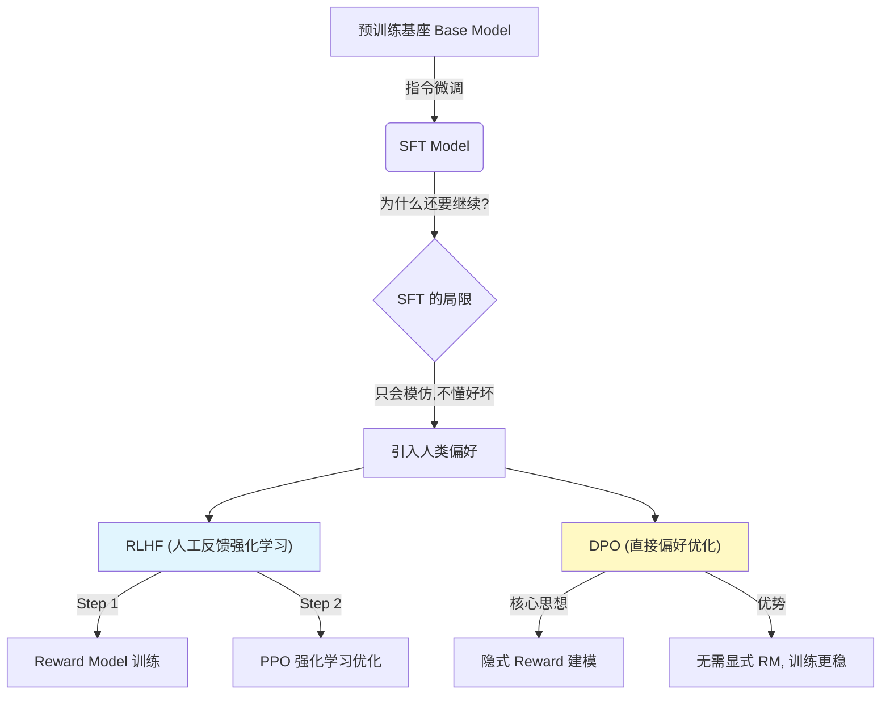
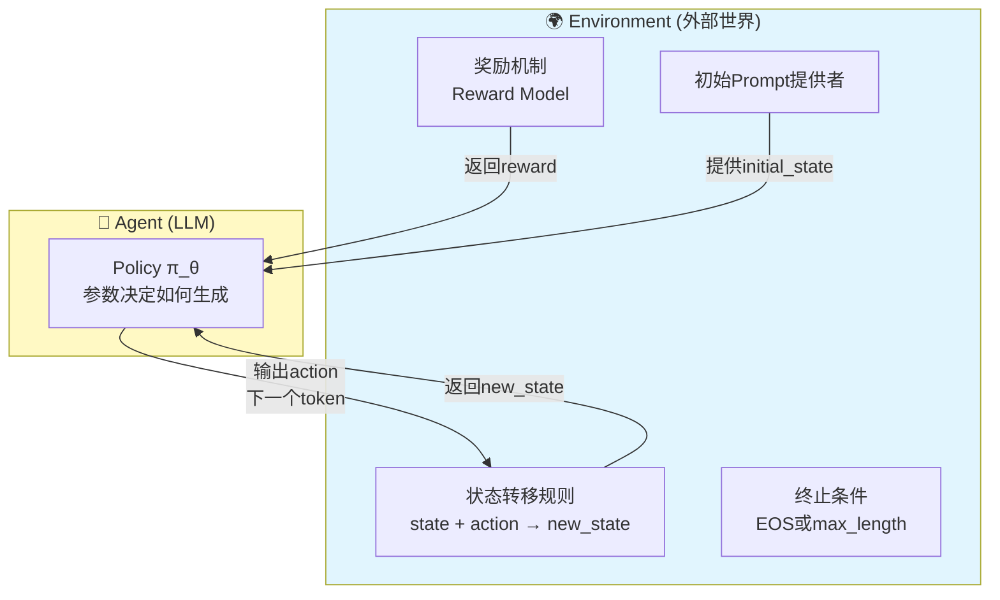
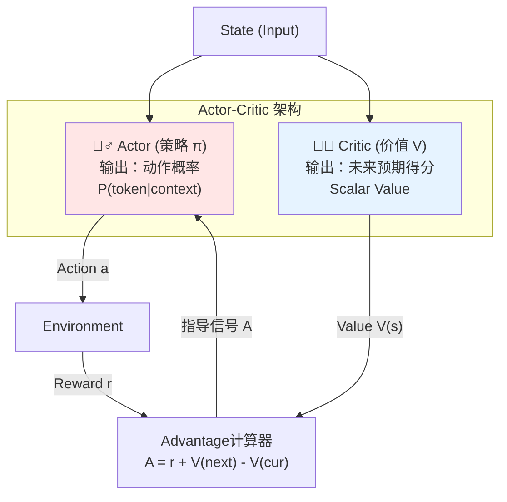
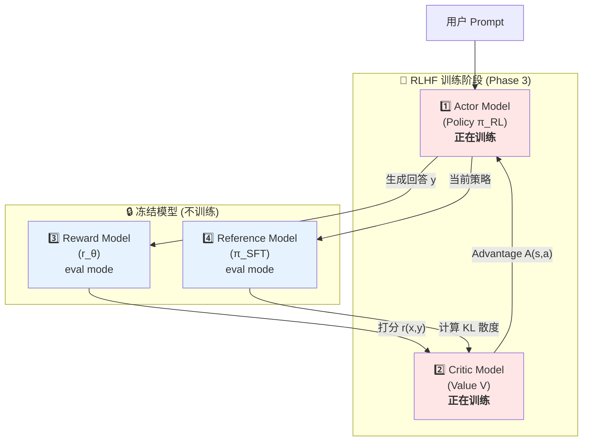
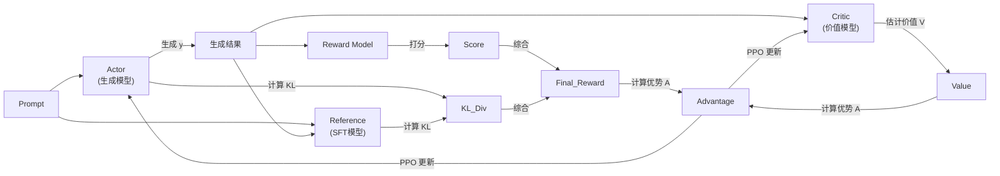
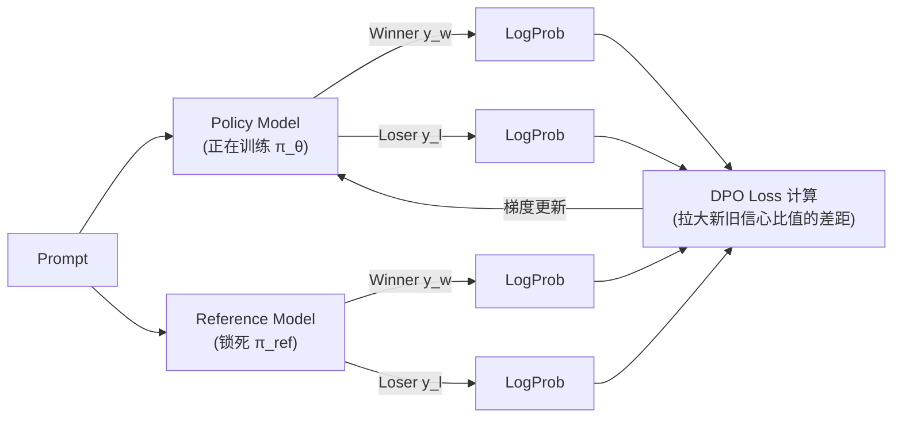
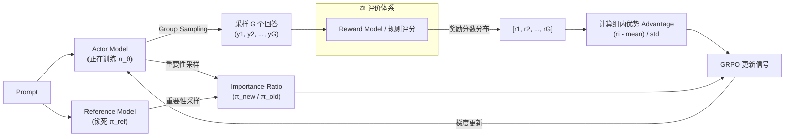
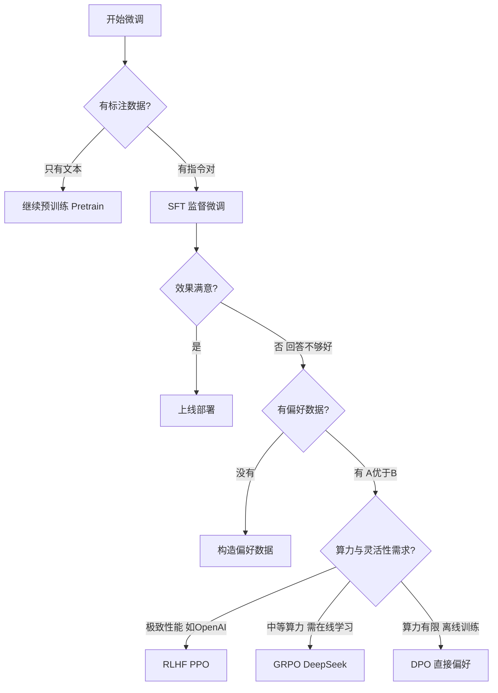
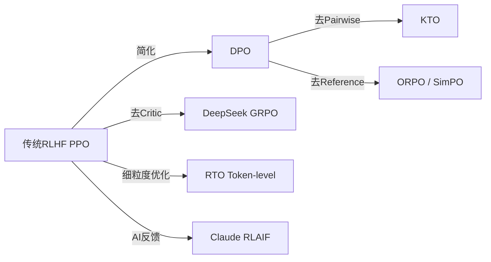

# Week 4 讲义：人类对齐（Alignment）与 RLHF 机制

> **核心目标**：理解从 SFT 到 RLHF 再到 DPO 的对齐演进，掌握强化学习在大模型中的核心机制。
>
> **学习时间**：8 小时
>
> **关键输出**：RLHF 流程图 + 对齐方案选择指南 + VQA 奖励设计
>
> **前置要求**：已完成 Week 3 SFT 的学习，理解 SFT 无法解决什么问题。

---

## 📖 本周知识图谱



---

## 🧠 Part 1: 强化学习基础 (Reinforcement Learning 101)

> [!NOTE]
> **写给 LLM 学习者的话**：
> 既然你已经掌握了 Supervised Learning (SFT)，为什么还需要 RL？
> - **SFT (模仿学习)**：老师给一道题，演示一遍解法，学生**照抄**每一步。
> - **RL (试错学习)**：老师**不给**解法，只给最后的分数（Reward）。学生自己尝试，做对了加分，做错了扣分。
>
> 在 LLM 对齐中，我们往往很难为每一个生成步骤提供完美的"参考答案"（SFT 数据昂贵且难以覆盖所有情况），但我们很容易判断生成的"结果好不好"（Reward）。这就是引入 RL 的核心动力。

### 1.1 RL 的核心五要素

想象你在训练一只狗狗（Agent）玩飞盘（Environment）：

1.  **Agent (智能体)**：这里就是我们的 **LLM**。
2.  **Environment (环境)**：整个文本生成交互系统，它负责：
    - 接收初始 Prompt
    - 接收 Agent 生成的每个 token（Action）
    - 更新上下文（State 转移）
    - 返回奖励信号（Reward）
    - **关键**：Environment 是抽象的"游戏规则"，而不是具体的内容。
3.  **State (状态 $s_t$)**：Agent 在时刻 $t$ 观察到的具体内容 = **Prompt + 已生成的 tokens**。
    - $s_0$ = "请写一首诗：" （初始状态，只有 Prompt）
    - $s_1$ = "请写一首诗：春天" （生成了第1个token后）
    - $s_2$ = "请写一首诗：春天来了" （生成了第2个token后）
4.  **Action (动作 $a_t$)**：LLM 在当前时刻选择生成的 **下一个 Token**。
    - 注意：在标准 RL 中 Action 空间通常很小（如上下左右），但在 LLM 中 Action 空间是整个词表（Vocab Size, e.g., 150k），这极大地增加了难度。
5.  **Reward (奖励 $r_t$)**：
    - 在生成的过程中，通常 $r=0$。
    - 只有当生成结束（生成 `<EOS>`）时，我们会给整个句子打一个分（例如 +1 或 -1）。
    - **核心挑战**：我们只在最后一步得到分数，但前面的几百个 token 都要为这个分数负责（这被称为 *Credit Assignment* 问题）。

> [!NOTE]
> **Environment vs Policy vs State 的完整区分（重要！）**
>
> 很多初学者会混淆这些概念。让我们用"你在参加考试"来类比：
>
> | 概念 | 是什么 | 考试类比 | LLM类比 |
> |------|--------|---------|---------|
> | **Agent** | 决策主体 | **你**（考生） | **LLM模型** |
> | **Policy** | 决策策略 | **你的解题思路**（怎么选择答案） | **LLM的参数θ**（怎么选择下一个token） |
> | **Environment** | 外部系统 | **考试系统**（试卷、计时器、评分规则） | **文本生成框架**（见下方详解） |
> | **State** | 当前观测 | **当前做到第5题，前面答了A、B、C、C** | **当前已生成"春天来了"** |
> | **Action** | 具体动作 | **选择D作为第5题答案** | **生成token "万物"** |
> | **Reward** | 反馈信号 | **交卷后老师给的分数** | **Reward Model的打分** |
>

#### 🔍 Environment 在 LLM 中的具体组成

Environment 不是 LLM 本身，而是 LLM **所处的交互系统**，包含：



#### 📝 完整交互流程（一步一步理解）

 ```python
 # ===== Environment 的组成部分 =====
 class TextGenEnvironment:
     def __init__(self, reward_model, max_length=512):
         # 1. 奖励评估器（外部组件）
         self.reward_model = reward_model
         # 2. 终止条件
         self.max_length = max_length
         # 3. 词表（定义合法的Action空间）
         self.vocab = load_vocab()

     def reset(self, prompt):
         """提供初始Prompt，返回初始State"""
         return {"tokens": tokenize(prompt), "done": False}

     def step(self, state, action):
         """
         接收 Agent 的 Action，返回新 State 和 Reward
         这就是 Environment 的核心职责！
         """
         # 状态转移规则（简单拼接）
         new_tokens = state["tokens"] + [action]

         # 判断是否结束
         done = (action == self.vocab["<EOS>"]) or (len(new_tokens) >= self.max_length)

         # 计算奖励（只在结束时有非零奖励）
         if done:
             reward = self.reward_model(new_tokens)  # 调用外部RM打分
         else:
             reward = 0

         new_state = {"tokens": new_tokens, "done": done}
         return new_state, reward, done

 # ===== Agent (LLM + Policy) =====
 class LLMAgent:
     def __init__(self, model):
         self.model = model  # 这就是 Policy π_θ

     def select_action(self, state):
         """根据当前 State，用 Policy 选择 Action"""
         logits = self.model(state["tokens"])  # LLM前向推理
         action = sample_from_logits(logits)   # 采样下一个token
         return action

 # ===== 完整交互循环 =====
 env = TextGenEnvironment(reward_model=my_reward_model)
 agent = LLMAgent(model=my_llm)

 # 1. Environment 提供初始 Prompt
 state = env.reset(prompt="请写一首诗：")

 # 2. 交互循环
 total_reward = 0
 while not state["done"]:
     # Agent 根据 Policy 选择 Action
     action = agent.select_action(state)  # Policy决策（内部）

     # Environment 接收 Action，返回新 State 和 Reward
     state, reward, done = env.step(state, action)  # Env转移（外部）

     total_reward += reward

 print(f"最终生成: {detokenize(state['tokens'])}")
 print(f"总奖励: {total_reward}")
 ```

#### 🎯 几个关键理解

1. **Environment ≠ Policy**
    - Policy（策略）：LLM 的参数 $\theta$，决定 **"我要生成什么token"**（内部决策）
    - Environment（环境）：外部系统，决定 **"你生成这个token后会怎样"**（外部反馈）

2. **Environment 的职责**
    - ✅ 提供初始 Prompt（`reset()`）
    - ✅ 接收 LLM 的输出，更新 State（`step()`）
    - ✅ 判断是否结束（终止条件）
    - ✅ 计算 Reward（调用 Reward Model）
    - ❌ 不决定生成什么内容（那是 Policy 的事）

3. **Environment vs State vs Reward 的关系（核心混淆点！）**

很多人会问：**Environment 是"包含"了 State 和 Reward，还是"使用"了它们？**

**答案：都不是！准确的关系是：Environment 像一个"工厂"，通过规则**产生/生成**State 和 Reward**。

| 概念 | 本质 | Environment的关系 | 形象类比 |
|------|------|------------------|---------|
| **State** | 数据（某时刻的内容） | Environment **产生**和**转移** State | 工厂生产的产品 |
| **Reward** | 数值（评分信号） | Environment **计算**并**返回** Reward | 工厂的质检报告 |
| **Environment** | 系统/规则 | 定义State如何变化、Reward如何计算 | 工厂的生产线规则 |

>    **象棋类比**（最清楚）：
>    - **State**：某个具体的棋局布局（数据）—— "车在e5，马在c3..."
>    - **Reward**：赢了+1 / 输了-1（数据）
>    - **Environment**：象棋规则系统
>      - ✅ 它定义"走了这步后，棋局变成什么样"（**产生新State**）
>      - ✅ 它定义"将死对方=赢"（**计算Reward**）
>      - ❌ 但它**不包含**某个具体棋局（棋局是独立存在的数据）
>
**代码中的体现**：
```python
class Environment:
    def __init__(self, reward_model):
        self.reward_model = reward_model  # 持有计算工具
        # ❌ 注意：没有 self.state！State不在Environment里

    def step(self, state, action):
        # state 是外部传入的参数（不是Environment的属性）
        new_state = self._transition(state, action)  # 产生新State
        reward = self._compute_reward(new_state)     # 产生Reward
        return new_state, reward  # 返回这两个数据

    def _transition(self, state, action):
        """定义State转移规则"""
        return state + [action]

    def _compute_reward(self, state):
        """定义Reward计算规则"""
        return self.reward_model(state)

# 使用时：
env = Environment(reward_model=my_rm)

# State 是独立存在的变量（不在Environment里）
current_state = [1, 2, 3]

# Environment 像个纯函数：(state, action) → (new_state, reward)
new_state, reward = env.step(current_state, action=4)
# new_state = [1, 2, 3, 4]（新数据）
# reward = 0.8（新数据）
```
4. **为什么 LLM 场景下 Environment 显得"虚"？**
    - 在游戏中，Environment 很"重"：有物理引擎、碰撞检测、复杂的状态转移
    - 在 LLM 中，Environment 很"轻"：状态转移就是简单拼接，核心就是 Reward Model
    - 但概念上它依然存在，代表 **"LLM 之外的评价体系"**

**总结**：

- Environment **不包含** State 和 Reward（它们是独立的数据）
- Environment **产生** State 和 Reward（它是生产这些数据的规则工厂）
- Environment 本质是一个函数：`(state, action) → (new_state, reward)`

### 1.2 简单的 RL 流程（语言模型版）

1.  **观察 (Observe)**：LLM 看到当前的上下文 $s_t$。
2.  **行动 (Act)**：LLM 根据概率采样生成下一个 token $a_t$。
3.  **状态转移 (Trans)**：由于生成了一个 token，上下文变长了，变成了 $s_{t+1}$。
4.  **循环**：重复 1-3 直到生成结束。
5.  **反馈 (Reward)**：人类（或 Reward Model）给**这一整段**话打分 $R$。
6.  **更新 (Update)**：
    - 如果 $R$ 很高，就**增加**刚才生成那串 token 的概率。
    - 如果 $R$ 很低，就**降低**那串 token 的概率。
> [!TIP] 注意，在这个“简单”RL流程中，Reward 是对整个生成序列的评价，而非针对中间过程。

### 1.3 核心概念：策略与价值

1.2 节的基本 RL 流程以一条 Tip 结尾：**Reward 是对整个生成序列的整体评价**。这句话暗示了一个关键悬念——

> 如果奖励只在序列结束时才知道，那生成过程中的每一步，模型究竟应该怎么更新？

要回答这个问题，我们需要先建立两个精确的概念——没有它们，后续任何关于"如何给每一步打分"的讨论都无法展开。

#### 🎯 Policy (策略 $\pi$)
策略就是 Agent 的"大脑"，决定在某个 State 下采取什么 Action 的概率分布。
$$ \pi(a|s) = P(\text{next token} | \text{context}) $$
**这正是我们的 LLM 本身。**

#### 💎 Value Function (价值函数 $V(s)$)
价值函数是对"未来"的预判。
- $Q(s, a)$：在状态 $s$ 采取动作 $a$，未来大概能拿多少分？（即 TD Target）
- $V(s)$：处于状态 $s$，未来预期能拿多少分？

> **直觉理解**：
> 假设 Prompt 是 "请写一首关于春天的诗"。
> - 如果 LLM 生成了 "春天来了，万物..." ($s_1$) -> $V(s_1)$ 可能很高，因为开头不错。
> - 如果 LLM 生成了 "春天是一个..." ($s_2$) -> $V(s_2)$ 中等。
> - 如果 LLM 生成了 "Hasdh 123..." ($s_3$) -> $V(s_3)$ 极低，大概率最后得分为负。
>
> **RL 的训练目标**就是调整 Policy ($\pi$)，让 LLM 尽可能倾向于进入那些 $V(s)$ 高的状态。

---

### 1.4 Credit Assignment 与 Actor-Critic 完整解析

#### 1.4.1 问题：稀疏奖励与功劳分配

在基础的 RL 流程中，我们面临一个核心难题：**奖励是稀疏的 (Sparse Reward)** —— 只有在完整输出结束后才能得到最终分数。然而，LLM 输出的序列可能非常长，最终的低分也许仅仅是因为中间**某一个 Token** 开始跑偏了。

如果简单粗暴地根据最终总分去奖励或惩罚整个序列，就无法精准地定位那个真正"有问题"的 Token。这就是强化学习中经典的 **Credit Assignment（功劳分配）** 问题——**当我们只在序列结束时得到一个总体奖励，如何判断序列中每一步动作对最终结果的贡献大小？**

> [!TIP]
> **💡 术语辨析：稀疏奖励 vs 稠密奖励**
>
> *   **稀疏奖励 (Sparse Reward)**：做了一连串动作，只有在最后才给一个分（如：下围棋只有赢/输、LLM 只有整段回复生成完才打分）。中间的每一步都不知道自己做得对不对，很难训练。
> *   **稠密奖励 (Dense Reward)**：做的每一步动作立刻就能得到反馈（如：赛车游戏每过一个弯道都有加分）。反馈及时，很容易训练。

**LLM 中 Credit Assignment 的具体困难**

假设 LLM 生成了这样一个回答（200个token）：

```
Prompt: "请解释什么是光合作用？"

生成序列:
Token 1-50:    "光合作用是植物..." (✅ 开头不错)
Token 51-100:  "通过叶绿体..." (✅ 继续良好)
Token 101-150: "产生氧气和葡萄糖..." (✅ 核心概念正确)
Token 151-200: "但是恐龙时代没有光合作用..." (❌ 大错特错！)
```

最终 Reward Model 给了 **-1 分**（因为结尾严重错误）。Token 1-150 其实是对的，Token 151-200 是错的——但我们只有一个总分 -1，如何公平分配功劳/过失？

此外，LLM 中的这个问题尤其困难：

| 挑战维度 | LLM 的特点 | 传统 RL（如游戏）的对比 |
|---------|-----------|---------------------|
| **序列长度** | 几百个 token（每个都是决策点） | 通常几十步 |
| **Action 空间** | 150k 种选择（词表大小） | 围棋 361 种，Atari 游戏 ~18 种 |
| **奖励稀疏性** | 只有最后才有反馈，中间 99% 都是 r=0 | 游戏中经常有中间奖励（吃金币、击杀敌人） |
| **延迟因果** | 第 10 个 token 的错误可能到第 200 个才暴露 | 因果关系相对直接 |

#### 1.4.2 解决框架：引入 Actor-Critic

解决 Credit Assignment 的核心思路，是引入第二个模型来**实时估计每一步的价值**——这就是 **Actor-Critic 架构**。

先来理解为什么只有 Actor 是不够的：

- **Policy Gradient（只有 Actor）**：
    - 逻辑：我也没啥计划，试着走。走到了好结果，就死记硬背"这步是对的"；走到了坏结果，就死记硬背"这步是错的"。
    - 缺点：**方差极大 (High Variance)**。运气好碰巧走对一次，就以为是神之一手；运气不好被坑一次，就再也不敢走了。学习效率极低。

- **Actor-Critic（双模型）**：
    - **Actor（执行者）**：负责看路、迈腿（输出 Action）。
    - **Critic（评论家）**：负责看地图、预估未来（输出 Value）。

> **RLHF 的核心魔法**：通过训练一个 Critic Model，把 LLM 原本面临的"稀疏奖励"（只能等结局），强行转换成了"稠密奖励"（每一步都给反馈），从而让模型能学得动。

**Critic 如何降低方差？**

Critic 的核心作用是**提供"基线 (Baseline)"**，从而降低学习时的方差。

> **形象比喻：学打网球**
>
> **场景**：你（Actor）打了一球，稍微出界了。
>
> - **没有 Critic 时**：裁判给你判了"输分" (-1)。你心里想："完了，全错了。"——即使你挥拍动作其实很标准，只是风太大了。**结果**：你会盲目地修改所有动作，好的动作也被改掉了。
>
> - **有 Critic 时**：Critic（教练）知道"这种天气下，你的挥拍动作其实值 0.8 分（满分 1.0），出界主要是运气不好"。裁判判了 -1。Advantage = 实际结果(-1) - 预期(0.8) = **-1.8**。**关键**：你只修正那些**真的比预期差**的动作，学习更加稳健。

把"考试"来类比：我们不看绝对分数 $R$，而是看 $R - V(s)$（优势 Advantage）。如果卷子难（平均分40），你考50分就是优秀；如果卷子简单（平均分90），你考50分就是差劲。**减去基线后，我们过滤掉了环境本身的难易波动，只保留了"你的动作导致的好坏差异"。**

#### 1.4.3 Critic 如何训练：TD Learning

有了 Critic 的概念，下一个问题是：Critic（价值函数 $V(s)$）本身如何学习？

**答案**：通过**时序差分学习 (TD Learning)**——不需要等到整个序列生成完毕，走一步就能构造一次 Critic 的训练信号。

要理解"不需要等"的意义，先看训练 Critic 的本质：需要告诉 Critic "对于状态 $s_t$，你的预测应该是多少"。最直接的方法（**Monte Carlo**）是等整个序列跑完，累加所有折扣奖励作为标签：

$$G_t = r_t + \gamma r_{t+1} + \gamma^2 r_{t+2} + \ldots$$

但 LLM 生成序列动辄 200~1000 个 token，Monte Carlo 必须等到 `<EOS>` 才能得到一个训练样本，且序列越长方差越大。

**TD Learning 的核心思路**：与其等待完整的 $G_t$，不如**走一步，用当前这步的真实奖励 + 下一状态的 Critic 预测来构造训练信号**：

TD Learning 用**后一步的价值来更新前一步**：

$$ V(s_t) \leftarrow V(s_t) + \alpha \underbrace{[r_t + \gamma V(s_{t+1}) - V(s_t)]}_{\text{TD Error（现实与预期的差值）}} $$

**参数解析：**
- **$V(s_t)$**：Critic 在时刻 $t$ 的预测价值（要修正的对象）
- **$r_t$**：这一步的即时奖励（中间步为 KL 散度惩罚；最后一步为 RM 打分）
- **$\gamma$**：折扣因子（通常 0.99），决定对未来奖励的重视程度
- **$V(s_{t+1})$**：下一步的预测价值（"走了一步再看"通常比"原地看"更准）
- **$\alpha$**：学习率，控制每步往目标方向走多远，**不影响目标值本身**

> [!IMPORTANT]
> **⚠️ 易混淆点：$\alpha$ 是步长，不是目标的一部分**
>
> 这个公式容易让人误解成"经过一步更新后，$V(s_t)$ 的新值就是 $V_{\text{target}}$"。但实际上：
>
> - **更新后的新值**：$V_{\text{new}}(s_t) = V(s_t) + \alpha \cdot \text{TD Error}$（含 $\alpha$，是每步走到的中间位置）
> - **真正的目标值**：$V_{\text{target}} = r_t + \gamma V(s_{t+1})$（不含 $\alpha$，是我们希望 $V(s_t)$ 最终收敛到的地方）
>
> $\alpha$ 控制的是**每步走多远**，不管 $\alpha$ 是 0.01 还是 0.1，目标位置始终是 $r_t + \gamma V(s_{t+1})$，不会随步长变化。这个区分在后文 Critic Loss 的公式里非常重要。
- **TD Error**（方括号内的值）：即"现实超出预期了多少"
  - TD Error $> 0$（惊喜）：实际比预想好，调高 $V(s_t)$
  - TD Error $< 0$（失望）：实际比预想差，调低 $V(s_t)$
- **TD Target**：$[r_t + \gamma V(s_{t+1})]$，即对当前步价值的修订估计

> **Monte Carlo vs TD Learning**
>
> | 对比维度 | Monte Carlo | TD Learning |
> |---------|------------|-------------|
> | **训练信号来源** | 完整的真实回报 $G_t$（无偏） | $r_t + \gamma V(s_{t+1})$（含估计，有偏） |
> | **需要等序列结束？** | ✅ 必须等到 `<EOS>` | ❌ 走一步即可更新 |
> | **方差** | 大（路径越长越随机） | 小（只差一步，波动小） |
> | **LLM 场景适用性** | 较差（等待成本高） | 较好（首选方案） |

**关键区分：Bootstrap Target ≠ 真正的 GT**

TD Learning 用于训练 Critic 的目标值，不是真正的 GT，而是一个**自举目标 (Bootstrap Target)**——用 Critic 自己对下一状态的预测，来代替"从 $t+1$ 到序列结束的所有真实奖励之和"：

$$\underbrace{G_t = r_t + \gamma r_{t+1} + \gamma^2 r_{t+2} + \ldots}_{\text{真正的 GT（需跑完整序列才能得到）}} \approx \underbrace{r_t + \gamma V(s_{t+1})}_{\text{Bootstrap Target（用 Critic 自己的预测补全未来部分）}}$$

"自举"意味着模型在**用自己的估计来更新自己的估计**。这引入了一定的偏差（$V(s_{t+1})$ 本身并不完全准确），但换来了**无需等待结局、方差更低**的优势。随着训练推进，$V(s_{t+1})$ 逐步变准，Bootstrap Target 也会持续逼近真实的 $G_t$。

在实际训练中，Critic 的 Loss 是均方误差：

$$ \mathcal{L}_{Critic} = (V_{\text{predicted}} - V_{\text{target}})^2, \quad V_{\text{target}} = r_t + \gamma \cdot V(s_{t+1}) $$

对应关系是：

- $V_{\text{predicted}} = V(s_t)$：Critic **当前**对状态 $s_t$ 的输出，即"推之前"的原始预测
- $V_{\text{target}} = r_t + \gamma V(s_{t+1})$：上文的 Bootstrap Target，即我们希望 $V(s_t)$ **最终收敛到**的值

注意 $V_{\text{target}}$ 不是"经过一步 TD 更新后的 $V(s_t)$"（即 $V(s_t) + \alpha \cdot \text{TD Error}$）。TD 更新公式里的 $\alpha$ 是**学习率**，控制的是每步往目标方向走多远，而不是目标本身是什么。$V_{\text{target}}$ 永远是 $r_t + \gamma V(s_{t+1})$，这是 $V(s_t)$ 应当收敛到的**最终目标值**（Bellman 方程的右侧）。在神经网络版本里，$\alpha$ 不再显式出现——它被吸收进了 optimizer（Adam/SGD）的步长里。

因此，这个 Loss 展开后就是 **TD Error 的平方**：

$$\mathcal{L}_{Critic} = (V_{\text{predicted}} - V_{\text{target}})^2 = \underbrace{(V(s_t) - [r_t + \gamma V(s_{t+1})])^2}_{= (\text{TD Error})^2}$$

这与 TD 更新公式描述的是**同一件事**，只是面向不同的实现方式：

| | TD 更新公式 | Critic Loss |
|---|---|---|
| **适用对象** | 查找表（直接改数值） | 神经网络（走梯度更新权重） |
| **操作** | $V(s_t) \mathrel{+}= \alpha \cdot \text{TD Error}$ | minimize $(\text{TD Error})^2$，反向传播 |
| **数学效果** | 等价 | 等价 |

> [!WARNING]
> **⚠️ 工程细节：$V_{\text{target}}$ 必须 stop gradient**
>
> 你可能注意到：$V_{\text{target}}$ 里的 $V(s_{t+1})$ 也是 Critic 网络算出来的，和 $V_{\text{predicted}}$ 用的是同一套参数 $\theta$。如果对整个 Loss 做反向传播，$V_{\text{target}}$ 也会对 $\theta$ 求梯度——这意味着你在追一个"自己也在移动的靶子"，训练会极度不稳定。
>
> 实际实现中，$V_{\text{target}}$ 在计算完后会**立刻切断梯度**，作为常数对待：
>
> ```python
> v_predicted = critic(s_t)           # 梯度正常流过，用于更新 Critic
>
> with torch.no_grad():               # ← stop gradient：切断梯度
>     v_target = r_t + gamma * critic(s_t_plus_1)  # 算完即为常数
>
> loss = (v_predicted - v_target) ** 2
> loss.backward()  # 只有 v_predicted 一侧有梯度
> ```
>
> 这样 $V_{\text{target}}$ 才真正等同于一个固定标签，"Loss = TD Error 的平方"的逻辑才成立。公式里写 $V(s_{t+1})$ 隐含了这个前提。

Critic Loss 端出来，是为了告诉你"在深度学习框架里，TD Learning 长这样，可以直接 `.backward()`"（完整等价推导见**附录 G**）。

> [!NOTE]
> **关于 $V_{target}$ 的"真实性"**
>
> 你可能会问：$r_t$ 来自 RM，RM 也是个模型，凭什么是"真实"的？
>
> 这里的"真实"是**相对于 Critic 而言**的：在 PPO 阶段，RM 是**冻结**的，对于给定的回答，它的打分是确定且唯一的——这就是这个封闭系统的"法律"。PPO 的目标就是让 Actor 讨好 RM。所以 $r_t$ 不依赖 Critic 的猜测，是来自环境的确定性反馈，可以作为锚点来校准 Critic。

#### 1.4.4 优势函数 (Advantage)

有了 TD Learning，我们就能计算出最终用来指导 Actor 的核心信号——**优势函数 (Advantage)**：

$$ A(s_t, a_t) = \underbrace{[r_t + \gamma V(s_{t+1})]}_{\text{TD Target（即 } Q(s,a) \text{ 的近似）}} - V(s_t) $$

- **第一项**（TD Target）：走了这一步，拿到 $r_t$ 后，加上对未来的展望 $V_{next}$——这是对 $Q(s,a)$ 的最佳估计。
- **第二项**（$V(s_t)$）：走这一步之前的预期/基线。
- **解读**：
  - $A > 0$：这步表现**优于**预期，应该**增加概率**（奖励）
  - $A < 0$：这步表现**劣于**预期，应该**降低概率**（惩罚）
  - $A \approx 0$：这步符合预期，**几乎不更新**（梯度信号趋近于零）

**为什么"减去基线"能降低方差？**

直接用原始奖励 $R$ 更新策略时，奖励本身的绝对值可能很大且波动剧烈——比如两段对话分别得 8 分和 7.9 分，绝对值都很高，但真正有意义的差异只有 0.1 分。以这种大基数的绝对奖励作为梯度信号，噪声大、方差高，训练不稳定。

引入基线 $V(s_t)$ 后，我们只关注**相对差异**（这次比平均水平好了多少/差了多少），有效过滤掉"环境本身难度"带来的噪声，让梯度信号更干净，训练更稳定。这也是为什么 Critic 的核心价值在于提供这个基线，而不只是给一个打分。

> [!NOTE]
> **💡 深度洞察：Advantage 就是 TD Error？**
>
> Advantage 的公式 $A(s_t, a_t) = [r_t + \gamma V(s_{t+1})] - V(s_t)$ 与 Critic 训练时的 **TD Error** 公式完全一致！
>
> **没错，它们在数值上是同一个东西，但"流向"不同：**
> - **作为 TD Error**：指导 **Critic** 更新，目的是让 Critic 的预测更准（让 Error 趋向 0）
> - **作为 Advantage**：指导 **Actor** 更新，目的是让 Actor 多做那些能产生正 Advantage 的动作

**三要素联动流程概览：**

```python
# 1. 生成序列
tokens = actor_model.generate(prompt)  # [t1, t2, ..., t200]

# 2. 用 Critic 估计每一步的价值
values = [critic_model(tokens[:t+1]) for t in range(len(tokens))]
# values[150] = 0.8   (第150步状态很好)
# values[151] = -0.3  (第151步急转直下)

# 3. 计算每个 token 的 Advantage（功劳/过失）
advantages = compute_advantages(values, rewards)
# advantages[0:150]   ≈ [0.1, 0.2, ...]    # 贡献为正
# advantages[151:200] ≈ [-0.8, -0.9, ...]  # 罪魁祸首

# 4. 用 Advantage 加权梯度更新 Actor（每个 token 独立，互不干扰）
policy_loss = -(advantages * log_probs).mean()
```

**为什么 Actor Loss 可以是负数？**

这是与 SFT 最不同的地方。SFT 的交叉熵 loss 永远 ≥ 0，我们的目标是把它压向 0。但 Actor 的 `policy_loss` 可以是负数——这没有问题，因为**我们的目标不是让 loss 趋向 0，而是利用梯度的符号来决定每个 token 的概率往哪个方向走**。

对 `policy_loss = -(A * log π)` 做一步梯度下降：

$$\theta \leftarrow \theta - \text{lr} \cdot \frac{\partial \mathcal{L}}{\partial \theta} = \theta + \text{lr} \cdot A \cdot \frac{\partial \log \pi}{\partial \theta}$$

- **A > 0**（这步比预期好）：梯度把 $\log \pi(a_t|s_t)$ 往上推 → **增加这个 token 的概率**
- **A < 0**（这步比预期差）：梯度把 $\log \pi(a_t|s_t)$ 往下压 → **降低这个 token 的概率**

公式前面的负号是因为我们想**最大化**期望奖励，但优化器是**最小化** loss，取负号后方向一致。

如果你对"为什么用 log π""梯度如何改变概率""这和 SFT 的 loss 有什么本质区别"有疑问，见**附录 H**。

#### 1.4.5 为什么 Actor 和 Critic 必须同步训练

既然 Critic 是在 Reward Model 基础上初始化的，为什么不能先把 Critic 训好、再训 Actor？

原因在于 **"移动靶 (Moving Target)"** 问题。Critic 估计的是 $V^\pi(s)$——即**当前策略 $\pi$ 下**的期望价值，而不是绝对的"上帝价值"。

想象 Actor 是一个正在训练的百米运动员，Critic 是场边的解说员（负责预测成绩）：

1. **第一天（Actor 很菜）**：Actor 跑了 15 秒，Critic 学到"这个运动员大概率跑 15 秒"，$V(s) \approx 15s$。
2. **第十天（Actor 变强了）**：Actor 能跑 11 秒了。
   - **如果 Critic 不更新**：Critic 还认为他只能跑 15 秒。当 Actor 跑出 11 秒，Advantage 计算出现巨大偏差，训练震荡。
   - **如果 Critic 同步更新**：Critic 马上意识到"他变强了，预计 11 秒"。这样 Advantage 才能正确反映"本次发挥是否真的比当前水平更好"，给出有效的优化信号。

**结论**：Actor 的策略 $\pi$ 在变，产生的状态分布也在变。Critic 估计的是当前策略下的价值，所以必须随 Actor 实时更新。这是一场**双人舞**——Actor 每进步一点，Critic 就得赶紧调整基线。

> [!NOTE]
> **关于三个角色的职责**
>
> | 角色 | 身份 | 状态 | 职责 |
> |------|------|------|------|
> | **Reward Model** | **判卷老师** | 🔒 冻结 | 提供最终标准，只在句子结束时打分（高延迟）。 |
> | **Actor** | **考生** | 🔄 训练中 | 正在学习生成，能力每时每刻都在变。 |
> | **Critic** | **估分员** | 🔄 训练中 | 预测 Actor 当前水平能拿多少分——不是教 Actor，是追踪 Actor。 |

#### 1.4.6 Critic 的真身：架构与初始化

**架构**：Critic 通常也是一个 Transformer，与 Actor 规模相当（甚至共享底层参数），只是输出头不同：
- **Actor Head**：输出 `Vocab Size` 维（预测下一个词的概率分布）
- **Critic Head**：输出 `1` 维（预测一个标量价值分数）

**初始化**：Critic 从 **Reward Model (RM)** 的参数初始化而来，而不是随机初始化。原因是 RM 已经学会了判断"什么是好结果"，与 Critic 要学的"什么是好状态"共享大量底层语义特征。用 RM 初始化相当于让 Critic "带着 80% 的功力"开局。

**为什么 RM 不能直接当 Critic？**

它们都在"打分"，但**时间观不同**：

- **Reward Model（事后诸葛亮）**：通常只在句子写完（遇到 `<EOS>`）时才能给出可靠打分。把写了一半的残句扔给它，结果不可靠（训练时只见过完整句子）。
- **Critic Model（实时预言家）**：能看着生成到第 50 个 token 时，就预测出"照这个趋势写下去，最后大概能得多少分"。

Critic 的作用，正是把 RM 那种 **"只有结局才有分"（稀疏）** 的评价，翻译成 **"每一步都有分"（稠密）** 的实时指导信号。

#### 1.4.7 辨析：Critic vs Reward Model

| 维度 | Reward Model（环境的一部分） | Critic Model（Agent的一部分） |
|------|--------------------------|----------------------------|
| **身份类比** | **判卷老师/法律** | **考生的自我感觉/律师** |
| **可变性** | **不可变 (Frozen)**。法律不会因为你考得好而改变。 | **可变 (Trainable)**。随你水平提高，自我感觉越来越准。 |
| **打分对象** | **结果 (Outcome)**，只看最后写得好不好。 | **预期 (Expectation)**，看当前动作是否有前途。 |
| **作用** | 定义什么叫"好"。 | 帮助 Actor 降低方差，平滑学习曲线。 |

> **场景**：你写了一篇作文。
> - **Critic（内心独白）**："我觉得这段写得不错，应该能拿高分。"（$V(s)$）
> - **Reward Model（老师批改）**："跑题了，0分。"（$R$）
> - **Advantage**：$0 - \text{高分} = \text{负值}$
> - **结论**：原来我的"自我感觉"是错的，下次不敢这么写了。**Critic 的作用就是不断修正这种"自我感觉"，使其无限逼近真实的 Reward。**

> [!TIP]
> **💡 总结**
>
> 1.  **Reward（结局）**：对最后结果的判断，不关心中间过程，往往是极端的（0 或 1）。
> 2.  **Critic（过程）**：把"要么对要么错"的二元评价，进化成对每一步的实时估值。通过监测 $V(s)$ 的变化，找出做好的步骤和做坏的步骤。
> 3.  **最终效果**：Critic 帮助精准打击真正犯错的步骤，而不是盲目惩罚整个序列。

> [!NOTE]
> **🔗 与 Week 7 的联系：Critic 有一个"表亲"叫 PRM**
>
> | 特性 | Critic | PRM |
> | :--- | :--- | :--- |
> | **本质** | **预测**"这个状态预计能拿多少分" | **判断**"这一步推理是否正确" |
> | **训练方式** | **在线训练**，和 Actor 一起训练 | **预先训练**，使用时冻结 |
> | **依赖关系** | 随 Actor 水平变化（移动靶） | 独立于被评估的模型 |
> | **类比** | 考生的"自我感觉" | 裁判的"现场判定" |
>
> **关键区别**：Critic 是"预测未来分数"，PRM 是"判断当前对错"。Critic 在 PPO 中帮助做**功劳分配**（Week 4 内容），PRM 在 MCTS 中替代随机 Rollout（Week 7 内容）。

#### 架构图解



**总结**：
- **Credit Assignment 的本质**：稀疏奖励 + 长序列 = 难以判断每步的贡献
- **解决思路**：引入 Critic，用 Advantage 量化每个 token 的贡献
- **PPO 就是一种先进的 Actor-Critic 算法**，所以在 RLHF 中必须同时训练 Actor 和 Critic 两个模型

### 1.5 核心思想转折：从监督学习到强化学习 (Crucial Mental Shifts)

到目前为止，你已经完整地理解了 Actor-Critic 的核心机制——稀疏奖励的困境、Value Function 与 TD Learning、Advantage 函数，以及 Critic 为什么必须与 Actor 同步训练。

在进入 RLHF 实战（Part 2）之前，值得停下来做一次**思维校准**。

如果你在学习过程中对某些设计感到困惑——比如"为什么 Critic 要和 Actor 一起训练？价值不是固定的吗？"——根源往往在于：我们已经非常熟悉监督学习（SFT）的运作方式，而 RL 有两点**本质上**不同于它。理清这两个差异，很多"为什么要这样设计"的问题就会豁然开朗。

#### 🧠 跨越 1：数据的非平稳性 (Non-Stationarity)
- **在监督学习中**：世界是静止的。图片就是图片，猫就是猫。你训练 1 个 epoch 和训练 100 个 epoch，**输入数据的分布是不变的**。
- **在强化学习中**：世界是动态的。**你看到的数据取决于你之前的行为**。
    - 刚开始，Actor 很笨，Critic 看到的数据都是"差生的答案"。
    - 后来，Actor 变强了，Critic 看到的数据变成了"优等生的答案"。
    - **推论**：Critic 面临的"考题"（数据分布）一直在变！所以它**必须**持续学习，不能"学会了就一劳永逸"。

#### 🧠 跨越 2：相对价值 vs 绝对价值
- **直觉**："这个状态是好的"（绝对价值）。比如象棋里多一个车就是好。
- **RL 现实**："对于**当前水平的你**来说，这个状态是好的"（相对价值，$V^\pi(s)$）。
    - 比如：给一个初学者（Actor A）一把狙击枪，可能是个累赘（用不好被反杀），价值低。
    - 给一个职业选手（Actor B）一把狙击枪，是大杀器，价值高。
    - **推论**：同样的 $State$（有一把狙击枪），对不同的 Policy 有不同的 Value。所以 Actor 变了，Value 就变了，Critic 就得重新学！

> **💡 一句话总结**：
> 监督学习是"背诵固定的课本"，强化学习是"在不断变化的赛场上练习"。 **课本不会变，但赛场局势和你的对手（其实是你自己）每时每刻都在变。**

---


---

## ⚙️ Part 2: RLHF 完整体系详解

RLHF (Reinforcement Learning from Human Feedback) 是让大模型"听话"的关键。它不仅让模型学会说话（SFT 做的事），还让模型学会**说人话**（符合人类价值观）。


### 2.1 RLHF 宏观蓝图 (The Blueprint)

在深入具体步骤之前，我们先站在**终局**看问题：RLHF 的最终形态长什么样？

#### 🏗️ 核心架构：发动机与燃油

如果把 RLHF 比作一台机器，它由两个核心部分组成：

1.  **PPO (发动机)**：负责让模型自我进化。它不仅包含正在学习的 LLM (**Actor**)，还包含一个辅助它的教练 (**Critic**)。
2.  **RM (燃油/裁判)**：负责提供动力。PPO 算法运转的核心依赖于**反馈信号 (Reward)**，而 **Reward Model** 就是那个源源不断提供反馈的组件。

为了防止模型训练崩坏，我们还引入了 SFT 模型作为**约束 (Reference)**。这就构成了 RLHF 著名的**四模型架构**：



| 模型 | 角色 | 职责 |
|------|------|------|
| **1️⃣ Actor** | **考生** | 正在被优化的 LLM，负责生成内容。 |
| **2️⃣ Critic** | **老师** | 负责估计状态价值 (Value)，引导 Actor 优化方向。 |
| **3️⃣ Reward Model** | **裁判** | 给出最终分数 (Reward)。它是 PPO 运转的**前提**。 |
| **4️⃣ Reference Model** | **锚点** | 原始 SFT 模型。防止 Actor 训练过头，遗忘语言能力。 |

#### 🧩 为什么会有“三阶段”？

看懂了上面这张图，RLHF 的流水线逻辑就显而易见了：

1.  **Phase 1 (SFT)**：Actor 和 Reference 模型不能是小白，必须先通过 SFT 学会“说人话”。
2.  **Phase 2 (RM)**：图中的 **Reward Model** 不会凭空产生。我们需要先专门训练它，让它学会“什么是好回答”。
3.  **Phase 3 (PPO)**：万事俱备（SFT 模型有了，RM 也有了），终于可以启动图中的**PPO 闭环**进行强化学习了。

---

### 2.2 填补蓝图：构建裁判 (Phase 2: Reward Modeling)

在蓝图中我们看到，PPO 极其依赖 Reward Model 的打分。如果裁判本身价值观歪了，PPO 就会把模型带到沟里（Reward Hacking）。

本节我们专注解决这个问题：**如何训练这个至关重要的裁判？**

**训练过程**：
1. **采样**：用 SFT 模型对同一个 Prompt 生成 $K$ 个回答（如 $K=4$）。
2. **标注**：人工对这 $K$ 个回答进行排序（Rank）。例如 $A > B > C > D$。
3. **配对**：将排序转化为两两对比的 Pair。例如 $(A, B), (A, C), (B, C)...$
4. **损失函数 (Ranking Loss)**：
    $$ \mathcal{L}_{RM} = - \log \sigma (r(x, y_{winner}) - r(x, y_{loser})) $$
    直觉：我们希望 RM 给 $y_{winner}$ 的打分显著高于 $y_{loser}$。

> [!TIP]
> **拓展：如何生成不同的回答？（解码策略）**
>
> 你可能会问：如果是 Greedy Search（每次取概率最大的词），生成的回答不都是一样的吗？
>
> 没错。为了构建对比数据，我们需要**多样性 (Diversity)**。因此，我们通常使用 **Temperature > 0 的随机采样 (Sampling)** 来让模型对同一个 Prompt 生成 K 个不同的回答。
>
> *(关于 Temperature、Top-p 和 Sampling 的详细随机性机制，请参阅文末 **附录 A：解码策略与随机性来源**)*

**实战代码片段 (Reward Model Training)**：

```python
def compute_loss(model, inputs):
    # inputs 包含 chosen_ids 和 rejected_ids
    rewards_chosen = model(inputs["chosen_ids"])
    rewards_rejected = model(inputs["rejected_ids"])
    
    # 我们希望 chosen 的分比 rejected 高
    loss = -torch.nn.functional.logsigmoid(rewards_chosen - rewards_rejected).mean()
    return loss
```

> [!TIP]
> **RM 的架构**：通常就是把 SFT 模型最后一层的 Softmax 去掉，换成一个线性层（Linear Layer），输出一个标量（Scalar），即分数。

> [!NOTE]
> **📌 与 Week 7 的联系：RM = ORM**
>
> 在 **Week 7 讲义 Part 6** 中，你会看到 **ORM（Outcome Reward Model）** 这个概念。这里先做一个预告：
>
> **Week 4 的 Reward Model = Week 7 的 ORM**。它们是同一个东西！
>
> - 都是给最终答案打分
> - 都是冻结的（不参与训练）
> - 都是稀疏奖励（只在最后给分）
>
> 两者的区别在于视角不同：
> - **Week 4 视角**：RM 是 PPO 训练的"燃油"，提供奖励信号
> - **Week 7 视角**：ORM 是推理搜索的"终局判断器"

---

### 2.3 启动引擎：PPO 优化 (Phase 3)

PPO 是目前最流行的 RL 算法，核心在于**稳定性**。

现在，**SFT 模型**（作为 Actor 和 Reference）已经就位，**Reward Model**（作为裁判）也训练好了。我们正式启动 PPO 闭环。

#### 🎯 PPO 的目标函数

在 LLM 语境下，它的目标函数包含三部分：

$\text{Total Reward} = r(x, y) - \beta \cdot \text{KL}(\pi_{RL}(y|x) || \pi_{SFT}(y|x))$

#### 1. 原始奖励 $r(x, y)$
由 Reward Model 给出的分数。模型为了拿高分，可能会去钻空子（Reward Hacking）。
*例如：RM 可能倾向于长句子，LLM 就开始疯狂输出废话来凑字数。*

#### 2. KL 散度惩罚 (KL Penalty)
这是 RLHF 中**最重要**的约束项！
- **含义**：计算当前正在训练的 RL 模型 ($\pi_{RL}$) 和原始 SFT 模型 ($\pi_{SFT}$) 之间的**分布差异**。
- **作用**：我们希望 LLM 这里"变好"（高 Reward），但**不要走太远**，不要变成另一种语言或乱码。我们希望它保留 SFT 学到的语言能力。
- **关键特性 (Token-level)**：
    - KL 散度是针对**每一个生成的 Token** 独立计算的。
    - 这意味着，虽然 RM 只在最后给分（稀疏），但 KL 惩罚在每一步都会产生反馈（稠密）。
    - 公式体现：$R_t = r_{\text{model}}(s_t) - \beta \cdot \text{KL}(s_t)$。对于中间步骤，$r_{\text{model}}=0$，但 KL 不为零，所以 $R_t$ 是一个非零负值。
- **系数 $\beta$**：控制约束力度。$\beta$ 太大，模型学不动；$\beta$ 太小，模型容易崩（Mode Collapse）。

#### 3. PPO 流程图解 (完整闭环)

这张图展示了数据如何在 4 个模型之间流动，最终形成更新信号：


> [!NOTE]
> Actor 和 Critic 为什么必须同步训练？详见 **1.4.5 节**的"移动靶"分析。


### 2.3.1 PPO 梯度更新机制：如何"精准打击"？

**回顾 1.4.1 节留下的问题**：如何精准优化有问题的Token？

虽然 Reward 是整体的（例如 -1 分），但前面 200 个 token 中，Token 1-150 是对的，Token 151-200 是错的。

**🤔 核心困惑**：在参数更新时，如何做到"精准打击"——只惩罚坏的 token（151-200），不影响好的 token（1-150）？

**答案**：Advantage 加权的 Policy Gradient。但在看代码之前，我们需要先理解 PPO 的两个核心直觉。

#### 💡 PPO 的三大核心组件

**1. 优势 (Advantage)：不仅看分高，还要看预判**
*   我们不直接用 Reward 更新模型，而是用 **Advantage = Actual_Reward - Expected_Value**。
*   **作用**：实现了“精准打击”。对于 Token 150，如果 Critic 觉得这步很稳，Advantage 就是正的；对于 Token 151，如果 Critic 发现局势急转直下，Advantage 就是负的。

**2. 重要性比率 (Importance Ratio)：修正“采样”与“更新”的偏差**
*   **为什么需要？** 在 PPO 训练中，我们会让 Actor 采样一次数据，然后**反复学习好几次**。这意味着：
    *   **采样时**：用的是 $\pi_{old}$（旧策略）。
    *   **更新时**：参数变了，变成了 $\pi_{new}$（新策略）。
*   **定义**：$r_t(\theta) = \frac{\pi_{new}(a_t|s_t)}{\pi_{old}(a_t|s_t)}$。
*   **数学意义**：它是一种“重要性采样（Importance Sampling）”权重。它告诉模型：“既然你是用旧策略的数据来练新策略，那么更新步长得乘以这个比率，才能抵消掉分布差异带来的偏差。”

**3. 截断 (Clipping)：小步快跑，防止“扯着蛋”**
*   **风险**：如果 $r_t(\theta)$ 太大（新旧策略差异过巨），会导致梯度爆炸，模型直接崩掉。
*   **PPO 的魔法**：给 $r_t(\theta)$ 加一个 **“安全锁”**。如果比率超过 $[0.8, 1.2]$ 这个范围，多出来的部分就**不算 Loss**。这强迫模型只能“小步快跑”，极大地提高了稳定性。

#### 📊 Policy Gradient 的核心机制 (伪代码逻辑)

> [!TIP]
> **💻 想要看完整的代码实现？**
>
> 我们为您准备了一份包含 **4模型架构、GAE计算、PPO Clip Loss** 的完整 Python 实现示例。
> 请查阅：`sampleCode/week4/ppo_implementation_demo.py`
>
下面仅展示核心逻辑流：

```python
# 假设场景：Prompt="你好"，Actor 生成了 "世界"
# -------------------------------------------------------------
# ⚠️ 注意：以下数值仅为针对 "世界" 这一个 Token 的特写示例
# 实际工程中，所有变量（prob, reward, advantage）都是形状为 [Batch, Seq_Len] 的张量

# 1. 采样阶段 (Rollout)：先让旧模型玩一把，记录数据
# -------------------------------------------------------------
# 旧策略 (Old Policy) 说：生成 "世界" 的概率是 60%
# (即 Softmax 输出的概率值)
prob_old = 0.6

# 2. 打分阶段 (Evaluation)：这步走得怎么样？
# -------------------------------------------------------------
# ⚠️ 注意 Reward 的稀疏性：
# 1. Reward Model 通常只给整个句子的最后一个 token 打分 (如 1.0)
# 2. 但 KL 惩罚 (Reference Model) 是针对每个 token 的 (如 0.1)
# 所以对于中间的 token，Reward 其实是负的微小值 (仅包含 KL 惩罚)
# 这里为了演示简单，假设我们在最后一步：
reward = 1.0 - 0.1 = 0.9 #RM结果1.0+KL散度惩罚。

# 3. 优势计算 (Advantage)：这步比"预期"好多少？
# -------------------------------------------------------------
# Critic (价值模型) 预测：在这个位置，通常能得 0.5 分 (基线)
# 实际得分 (0.9) > 预期得分 (0.5)，说明这步走得太棒了！
values = 0.5 # Critic计算。
advantage = reward - values = +0.4

# 计算回报目标 (Returns)：这是 Critic 努力要预测的"正确答案"
# Returns = Advantage + Value(基线) = 0.4 + 0.5 = 0.9
returns = advantage + values

# 4. 优化阶段 (Optimization)：更新参数，让好动作概率变大
# -------------------------------------------------------------
# ⚠️ 注意：PPO 通常会使用同一批数据反复更新多次 (Epochs)
# 假设我们现在处于某一次中间迭代：

# 因为 Advantage 是正的 (+0.4)，优化器更新 Actor 参数，使其往"增加概率"的方向走
# 结果：新策略 (New Policy) 把生成 "世界" 的概率从 60% 提到了 66%
prob_new = 0.66

# --- 组件 2: 重要性比率 (Importance Ratio) ---
ratio = prob_new / prob_old  # ratio = 1.1

# 5. 计算 Loss (同时优化 Actor 和 Critic)
# -------------------------------------------------------------
# [Actor Loss] 目标：让 Advantage > 0 的动作概率变大
# PPO 的核心魔法：Clip Loss (截断)，防止一次更新步幅过大
actor_loss = -min(ratio * advantage, clip(ratio, 0.8, 1.2) * advantage)

# [Critic Loss] 目标：让价值预测更准 (最小化预测误差)
# Critic 也要更新，它的目标是让 V(s) 越来越接近真实的 Returns
critic_loss = (values - returns)**2

# [总 Loss]
# ⚠️ 前提：RLHF 中 Actor 和 Critic 通常共享同一个 Transformer 主干，
#    只是输出头不同（Actor Head 输出词表概率，Critic Head 输出标量）。
#    梯度需要从两个头同时流回共享主干，因此合并 loss 做一次 backward()。
#    （若两者是完全独立的模型，则需各自独立 backward() 和 optimizer.step()）
loss = actor_loss + 0.5 * critic_loss
# 0.5 是 Critic Loss 的权重系数，防止 Critic 的梯度主导共享主干的更新。

# 反向传播，计算梯度
loss.backward()

# 6. 参数更新 (Parameter Update)
# -------------------------------------------------------------
# 这一步是让模型真正"变聪明"的关键
# 优化器根据算出的梯度，更新 Actor 和 Critic 的参数（以及共享主干的参数）
optimizer.step()
optimizer.zero_grad()
```

#### 🔍 具体案例：Ratio 与 Advantage 的“化学反应”

我们将 PPO 的损耗函数简化为 $Loss = - (Ratio \times Advantage)$，看看它如何精准操控模型：

| 动作 (Token) | 表现 (Advantage) | 比率 (Ratio) | 乘积 (R × A) | 梯度方向 | 结果 (对概率的影响) |
| :--- | :--- | :--- | :--- | :--- | :--- |
| **Token 50** "光合作用" | **+0.1** (好动作) | **1.1** (概率在涨) | **+0.11** | **负梯度** | **进一步增加**概率 ✅ (乘积为正，Loss为负，继续拉大Ratio) |
| **Token 151** "恐龙时代" | **-0.8** (坏动作) | **1.1** (概率在涨) | **-0.88** | **正梯度** | **反向拉低**概率 ❌ (乘积为负，Loss为正，强制缩小Ratio) |

**Importance Ratio 的角色总结：**
1.  **方向盘**：它与 Advantage 的正负号共同决定了梯度是“推”还是“拉”。
2.  **缩放器**：它决定了每一轮更新的力度。Ratio 偏离 1 越多，代表新旧策略差异越大。
3.  **保险丝 (Clipping)**：当 Ratio 跑出安全区（如 1.2 之外），PPO 通过截断机制让梯度归零，防止模型跑飞。

---

#### 💡 进阶思考：为什么不直接用 $\log P$？

在初级强化学习中，我们常用 `loss = -log_prob * advantage`。PPO 费劲引入 Ratio 的核心原因是：
*   **重复利用数据**：在 SFT 中，一行数据只看一遍。在 PPO 中，为了榨干算力，我们会让模型对同一批采样数据反复练 5-10 遍。
*   **修正漂移**：第 1 遍训练后，模型参数变了。第 2 遍训练时，如果还用旧的 `log_prob` 就不准了。**Ratio 能够实时反馈“当前模型”相对于“采样模型”的偏离程度**，从而在多轮训练中保持数学上的正确性。

#### ✅ 总结

**问题**：虽然 Reward 是整体的 -1，如何精准优化每个 token？

**答案**：
1. ✅ Critic 模型计算每个 token 的 **Advantage**（局部贡献）。
2. ✅ 每个 token 的梯度被它的 **Advantage 加权** 并通过 **Importance Ratio** 修正偏差。
3. ✅ **不会误伤**：每个 token 的梯度独立计算，互不干扰。

这就是 Critic 模型的核心价值——不是直接参与生成，而是“公平分配功劳”，让梯度更新能“精准打击”！

---

## 🚀 Part 3: 对齐算法的演进 (Evolution of Alignment)

如果说 PPO 是 RLHF 的"开山鼻祖"，那么后续的算法演进史，就是一部 **"做减法"** 的历史。研究者们发现 PPO 太重、太难调，于是不断尝试丢掉其中的组件。

### 3.1 从 PPO 到 DPO：减去 Reward Model

> **核心洞察**："如果 Reward Model 只是为了告诉 Policy 什么样的答案好，我们为什么不直接用偏好数据来训练 Policy 呢？" —— DPO 论文

#### 1. PPO 的痛点
*   **复杂**：需要同时维护 4 个模型。
*   **不稳定**：Reward Model 也是个模型，它本身就不准。用一个不准的尺子去衡量学生，学生很容易学歪 (Reward Hacking)。

#### 2. DPO 的魔法：如何把 Reward 变没？

**🔍 直觉理解 (逆向思维)：**
*   **RLHF 的逻辑**：先训练一个裁判 (RM)，裁判说 A 好，学生 (Policy) 就学 A。
*   **DPO 的逻辑**：如果一个学生已经是完美的，那他的行为本身就暴露了裁判的喜好。
    *   就像我们不需要问食客“这道菜几分”（显式 Reward），只要看他“每次都点这道菜而不点那道”（偏好行为），就能直接指导厨师调整配方。
    *   **结论**：既然**偏好行为**直接对应了**奖励**，那我们何必还要中间那个裁判 (RM) 呢？

**🌉 从直觉到数学的桥梁：**
有了直觉还不够，我们需要一个数学公式把“偏好”和“策略概率”画上等号。DPO 利用了 **KL 约束下的最优解形式**，推导出一个惊人的结论：

$$ r^*(x, y) = \beta \log \frac{\pi_\theta(y|x)}{\pi_{ref}(y|x)} + \beta \log Z(x) $$

**📝 符号拆解：**
*   **$r^*(x, y)$**：针对提示词 $x$ 和回答 $y$ 的**隐式奖励分**。
*   **$\pi_\theta(y|x)$**：**当前策略**（正在训练的模型）生成 $y$ 的概率。
*   **$\pi_{ref}(y|x)$**：**参考策略**（原始 SFT 模型）生成 $y$ 的概率。
*   **$\beta$**：超参数，控制我们多大程度上必须听从参考模型的约束（类似 PPO 的 KL 系数）。
*   **$\log Z(x)$**：归一化常数（配分函数）。**好消息**：因为它只和 Prompt 有关，在后面计算两个答案的差值时会被抵消掉，所以我们**不需要**去计算它！
*   **$\log \frac{\pi_\theta}{\pi_{ref}}$**：这是一个**比值**。它衡量了“当前模型**相比于**原始模型，有多么**更倾向于**生成这个 $y$”。

**✨ 魔法时刻**：这个公式告诉我们，**Reward 本质上就是“信心提升度”**。只要算出这个概率比值，就等于算出了 Reward！

#### 3. DPO 核心公式与训练流程

既然 Reward 可以用概率比值代替，我们就把这个比值代入到偏好模型（Bradley-Terry）中，得到了 DPO 的最终 Loss：

$$ \mathcal{L}_{DPO} = - \log \sigma \left( \beta \left[ \log \frac{\pi_\theta(y_w|x)}{\pi_{ref}(y_w|x)} - \log \frac{\pi_\theta(y_l|x)}{\pi_{ref}(y_l|x)} \right] \right) $$

**🧠 核心逻辑拆解**：
1.  **Winner 的提升度**：$\log \frac{\pi_\theta(y_w)}{\pi_{ref}(y_w)}$。我们希望这个值越大越好（模型更自信地生成好答案）。
2.  **Loser 的提升度**：$\log \frac{\pi_\theta(y_l)}{\pi_{ref}(y_l)}$。我们希望这个值越小越好（模型不再倾向于生成坏答案）。
3.  **差值 (Gap)**：DPO 的目标是**拉大** Winner 和 Loser 之间的信心差距。即生成好答案的倾向增大，生成坏答案的倾向减小，且生成好答案的倾向大于生成坏答案的倾向。

**🏃 DPO 训练流程图解：**



**🏃 DPO 训练流程 (End-to-End)：**
*   **输入**：一条三元组数据 `(Prompt, Winner, Loser)`。
*   **前向传播**：
    *   **Policy Model**：计算 Winner 和 Loser 的 LogProb。
    *   **Reference Model** (冻结)：计算 Winner 和 Loser 的 LogProb。
*   **计算 Loss**：直接代入上面的公式。
*   **反向传播**：更新 Policy Model。

**⚠️ 关键点：没有 Critic！**
DPO 把 RL 问题转化成了一个**分类问题**（让 Winner 的概率比 Loser 高）。它不需要估计 Value Function，也不需要 GAE。
所以：**DPO 既去掉了 Reward Model，也去掉了 Critic Model。** 它只剩下 Policy (训练) 和 Reference (冻结) 两个模型。

**📉 DPO 的代价：放弃细粒度功劳分配**
*   **PPO (RL)**：通过 Critic 评估每一步的好坏，能做到 Token 级别的精准赏罚。
*   **DPO (Ranking)**：是对**整个序列**进行优化的。它虽然简单，但对于长链条推理任务（哪一步推理错了），它的反馈不如 RL 精准。这也是为什么 DeepSeek-R1 选择回归 RL (GRPO) 的原因。
#### 4. DPO vs PPO
| 维度 | PPO (RLHF v1) | DPO (RLHF v2) |
| :--- | :--- | :--- |
| **模型数量** | **4个** (Actor, Critic, RM, Ref) | **2个** (Actor, Ref) |
| **核心机制** | 显式 Reward + 强化学习 | 隐式 Reward + 监督学习 (分类) |
| **稳定性** | 差 (对超参极其敏感) | 好 (类似 SFT) |
| **显存占用** | 极大 | 中等 |

---

### 3.2 从 DPO 到 GRPO：减去 Critic Model (DeepSeek 的秘密武器)

> **🤔 逻辑辨析**："等等，DPO 不是已经去掉 Critic 了吗？GRPO 再去一次有什么稀奇的？"
>
> **答**：DPO 去掉 Critic 是因为**换了赛道**（变成了分类任务），代价是必须依赖成对数据，且放弃了 Token 级的功劳分配。
> GRPO 的革命性在于：它在**保持 RL 赛道**（具备探索能力、只依赖 Reward 信号、保留功劳分配）的前提下，竟然也把 Critic 给优化掉了！
>
> *(核心机制：用一组回答的平均分来充当基线，替代 Critic 的预测)*

#### 1. DPO 还是不够完美
虽然 DPO 去掉了 RM，但它依然需要**成对的偏好数据 (Pairwise Data)**。
*   在数学/代码推理任务中，造数据很痛苦：你需要先生成两个答案，再找人/模型判断哪个好。
*   而且 DPO 是离线 (Off-policy) 的，模型容易在训练中分布偏移。

#### 2. GRPO (Group Relative Policy Optimization)
DeepSeek 提出的 GRPO 是 PPO 的一种变体，但它做了一个革命性的减法：**去掉了 Value Model (Critic)**。

**工作流程 (Group Sampling)**：
1.  **采样 (Group Rollout)**：对于同一个 Prompt，让 Actor 采样生成一组输出（比如 $G=64$ 个）。
2.  **打分 (Scoring)**：
    *   如果有 RM，用 RM 打分。
    *   如果是数学题，直接验证答案 (Correct=1, Wrong=0)。
3.  **计算优势 (Group Relative Advantage)**：
    *   不靠 Critic 预测基线，而是直接计算这组输出的**奖励分数分布**。
    *   假设这组生成的 64 个回答对应的最终得分是 $R_{group} = [r_1, r_2, \dots, r_{64}]$。
    *   计算这组分数的**平均分 (Mean)** 和 **标准差 (Std)**。
    *   $$ A_i = \frac{r_i - \text{Mean}(R_{group})}{\text{Std}(R_{group})} $$
    *   **直觉**：如果你在这 64 个回答里排在前 10%，你的优势就是正的；如果是垫底的，优势就是负的。

4.  更新：将计算出的序列级优势 $A_i$ 赋予给该序列中的每一个 Token，然后用它来更新 Actor。


    > [!IMPORTANT]
    > **深度辨析：序列级优势 vs. Token 级更新（为什么更新幅度仍有差异？）**
    >
    > 很多学习者会疑惑：如果整句话共用一个 Advantage，是不是每个词的更新力度都一样？
    > **答案是否定的。**
    >
    > 请回看 **Part 2.3.1** 中的 **组件 2：重要性比率 (Importance Ratio)**。在更新公式中，梯度的最终大小是由 $Ratio \times Advantage$ 共同决定的：
    > - **Advantage ($A_i$)**：在 GRPO 中是“粗放”的，整句共享。它决定了这一把是该“奖励”还是“惩罚”。
    > - **Importance Ratio ($r_t$)**：是“精细”的，**逐 Token 独立计算**。它衡量了当前模型对**这个特定词**的信心变动。
    >
    > **结论**：虽然 GRPO 失去了 Critic 带来的“细粒度归因”（它不知道哪个词是关键），但通过 Importance Ratio 机制，它依然保持了 Token 级的更新差异。概率变动更剧烈的词，会获得更大的梯度贡献。

**GRPO 流程图解：**



#### 3. GRPO 的巨大优势
*   **省显存**：不再需要 Critic 模型（通常 Critic 和 Actor 一样大），显存占用直接减半！
*   **适合推理**：特别适合 DeepSeek-R1 这种通过大量采样来涌现思维链 (CoT) 的场景。它让模型在"自我博弈"中进化——只要我这一把比平均水平好，我就受奖励。

### 对齐算法大横评

| 维度 | PPO (RLHF v1) | DPO (RLHF v2) | GRPO (DeepSeek 方案) |
| ------ | ------ | ------ | ------ |
| 活跃模型数 | 4个(Actor, Critic, RM, Ref) | 2个(Actor, Ref) | 3个 (Actor, RM, Ref) |
| 核心机制  | 显式奖励 + 强化学习  | 隐式奖励 + 监督分类 | 组内相对奖励 + 强化学习 |
| 是否需要 RM | 是 (需要单独训练)  | 否 (直接利用偏好数据) | 是 (或使用确定性规则) |
| 自我探索能力 | 强 (在线策略，能涌现新解法) | 弱 (离线策略，主要在模仿) | 强 (在采样组内博弈进化) |
| 数据范式 | 标量奖励信号 | 成对偏好数据 (A > B) | 奖励分布 (只需告诉对不对) |
| 显存占用 | 极大 (Critic 和 Actor 一样大) | 最小 (仅需加载两个模型) | 中等 (砍掉了沉重的 Critic) |

对齐算法的演进还在继续,在后面的**附录**提供了较新的前沿探索。

---

## 🧭 Part 4: 实战指南与作业

### 4.1 对齐方法决策树



### 4.2 作业：设计 VQA 任务的 Reward

针对你的 **CameraBench VQA** 任务，如果我们要引入 DPO/RLHF，"好"与"坏"的标准是什么？

**思考题**：假设 Prompt 是 *"这段视频的摄像机是如何运动的？"*
- **回答 A**：摄像机向左平移。(正确)
- **回答 B**：相机左移。(正确，但简略)
- **回答 C**：摄像机向右平移。(错误)
- **回答 D**：摄像机向左平移，且微微上扬，背景里有只猫。(正确且详细)

**偏好排序**：
- 在 **SFT 阶段**，我们可能只有一个标准答案（比如 A）。
- 在 **DPO 阶段**，我们可以构建这样的 Pair：
    - $D \succ A$ (鼓励更详细的描述)
    - $A \succ B$ (鼓励更规范的术语)
    - $B \succ C$ (正确性高于一切)

**实战任务（Week 4 里程碑）**：
1. 不需要立刻跑 DPO（数据构建成本高）。
2. 先把 Week 3 的 SFT 跑通。
3. 手动构建 10-20 条偏好数据，观察数据结构，感受一下 *"Answer A is better than Answer B"* 的标准制定过程。这是比写代码更难的部分。

---

## 📎 推荐阅读

### 核心论文（按讲义顺序）

1. **PPO 原始论文**: *Proximal Policy Optimization Algorithms* (Schulman et al., 2017)
   - 理解 Clip 机制、Importance Ratio 的数学来源
   - 链接: [arXiv:1707.06347](https://arxiv.org/abs/1707.06347)

2. **InstructGPT 论文**: *Training language models to follow instructions with human feedback* (Ouyang et al., 2022)
   - RLHF 的工业级实践，详解 RM 训练、PPO 微调流程
   - 链接: [arXiv:2203.02155](https://arxiv.org/abs/2203.02155)

3. **DPO 论文**: *Direct Preference Optimization: Your Language Model is Secretly a Reward Model* (Rafailov et al., 2023)
   - 必读！理解隐式 Reward 的数学推导（对应本讲义 Part 3.1 和附录 E）
   - 链接: [arXiv:2305.18290](https://arxiv.org/abs/2305.18290)

4. **DeepSeek-R1 技术报告**: *DeepSeek-R1: Incentivizing Reasoning Capability in LLMs via Reinforcement Learning* (2025)
   - GRPO 算法详解，理解 Group Relative Advantage 的设计思路
   - 链接: [arXiv:2501.12948](https://arxiv.org/abs/2501.12948)

### 前沿算法（选读）

5. **KTO 论文**: *KTO: Model Alignment as Prospect Theoretic Optimization* (Ethayarajh et al., 2024)
   - 去掉成对数据的约束，只需二元反馈
   - 链接: [arXiv:2402.01306](https://arxiv.org/abs/2402.01306)

6. **SimPO 论文**: *SimPO: Simple Preference Optimization with a Reference-Free Reward* (Meng et al., 2024)
   - 去掉 Reference Model，进一步简化对齐流程
   - 链接: [arXiv:2405.14734](https://arxiv.org/abs/2405.14734)

### 实践资源

7. **Hugging Face TRL 库**: [https://github.com/huggingface/trl](https://github.com/huggingface/trl)
   - 包含 SFT, RM, PPO, DPO, KTO 的全套实现
   - 推荐阅读 `examples/` 目录下的示例代码

8. **OpenRLHF 框架**: [https://github.com/OpenRLHF/OpenRLHF](https://github.com/OpenRLHF/OpenRLHF)
   - 支持 70B+ 规模的 RLHF 训练，工业级实现参考

## 📘 附录 A：解码策略与随机性来源

> 为什么大模型每次生成的回答都不一样？这里详细解释 2.2 节中提到的“采样”机制。

我们通常使用 **多项式采样 (Multinomial Sampling)** 配合以下参数来控制生成的多样性：

### 1. 随机性的根本来源：Sampling

- **Greedy Search (贪婪搜索)**：`next_token = argmax(probs)`。每次都选概率最大的词。这是**确定性**的，运行一万次结果都一样。
- **Sampling (随机采样)**：`next_token = sample(probs)`。根据概率分布“掷骰子”。概率高的词中奖率高，但概率低的词也有机会被选中。这是**随机性**的来源。

### 2. 控制参数：Temperature 与 Top-p

这两个参数不产生随机性，而是**调整“抽奖箱”里各个奖项的中奖概率**。

#### A. Temperature (温度 $T$)
调整概率分布的“陡峭”程度。
- **$T \to 0$**：概率分布变得极度陡峭。概率最高的词占比无限趋近 100%。效果接近 Greedy Search。
- **$T = 1$**：保持原始概率分布。
- **$T > 1$**：概率分布变平坦。长尾词的概率提升，输出更多样，但可能逻辑混乱。

#### B. Top-p (Nucleus Sampling / 核采样)
一种截断策略，用于过滤掉那些极其不靠谱的低概率词（防胡言乱语）。
- 逻辑：将词表按概率从高到低排序，只保留累积概率达到 $p$（如 0.9）的前 $N$ 个词。
- 效果：在这个经过筛选的“靠谱词库”里进行随机采样。

### 3. 实战代码逻辑

```python
# 1. 获取原始概率分布
logits = model(context)  # [vocab_size]
probs = softmax(logits / temperature)  # Temperature 调整

# 2. Top-p 过滤（可选）
sorted_probs, sorted_indices = sort(probs, descending=True)
cumsum_probs = cumsum(sorted_probs)
nucleus_indices = sorted_indices[cumsum_probs <= top_p]  # 保留累积概率 ≤ 0.9 的词

# 3. 在筛选后的词库中随机采样（这才是随机性的来源！）
next_token = sample(probs[nucleus_indices])  # 🎲 Rolling the dice!
```

## 📘 附录 B：GAE 算法原理 (Generalized Advantage Estimation)

> 在代码中我们提到了 GAE，它到底比普通的 $A = r + \gamma V_{next} - V_{curr}$ 好在哪里？

### 1. 核心矛盾：偏差 vs 方差

计算 Advantage 时，我们面临两难选择：

1.  **眼见为实 (Monte Carlo)**：一直玩到游戏结束，看总分。
    *   优点：绝对真实，没有估计偏差。
    *   缺点：**方差极大**。因为后面几百步的随机性都会叠加到这一步上。
2.  **步步为营 (TD-0)**：只看这一步的奖励 $r_t$，后面的全靠 Critic 猜 ($V(s_{t+1})$)。
    *   优点：方差小（只受一步随机性影响）。
    *   缺点：**偏差大**。如果 Critic 猜不准，你就被带沟里了。

### 2. GAE 的中庸之道

GAE 引入了一个新参数 $\lambda$ (Lambda)，用来在上述两者之间做**加权平均**。

公式：
$$ \hat{A}_t^{GAE} = \sum_{l=0}^{\infty} (\gamma \lambda)^l \delta_{t+l} $$

其中 $\delta_t = r_t + \gamma V(s_{t+1}) - V(s_t)$ 是单步的 TD Error。

*   **$\lambda = 0$**：等同于 TD-0。只信 Critic，不看未来。**（低方差，高偏差）**
*   **$\lambda = 1$**：等同于 Monte Carlo。完全不信 Critic，只信结果。**（高方差，无偏差）**
*   **$\lambda = 0.95$ (推荐)**：折中方案。既利用了 Critic 的平滑作用，又引入了足够多的真实未来奖励。

**结论**：在 PPO 实战中，我们几乎总是使用 GAE ($\lambda=0.95$) 来替代原始的 Advantage 计算，这能让训练更加稳定收敛。

## 📘 附录 C：KL 散度与其在 RLHF 中的作用

> 为什么我们在代码里常说 "KL 带来的负奖励"？KL 散度本身是负的吗？

### 1. KL 散度的数学性质
**Kullback-Leibler Divergence (KL 散度)** 是衡量两个概率分布 $P$ 和 $Q$ 之间差异的指标。
数学定义：
$$ D_{KL}(P || Q) = \sum P(x) \log \frac{P(x)}{Q(x)} $$

**核心性质：**
*   **非负性**：$D_{KL}(P || Q) \ge 0$。永远是正数（除非两个分布完全一样，那时是 0）。
*   **不对称性**：$D_{KL}(P || Q) \neq D_{KL}(Q || P)$。

### 2. 为什么在 RLHF 中它变成了"负值"？
在 RLHF 的目标函数中，我们把 KL 散度作为一个 **正则化项 (Regularization Term)**：

$$ \text{Reward} = r_{\theta}(x, y) \underbrace{- \beta \cdot D_{KL}(\pi_{\theta} || \pi_{ref})}_{\text{惩罚项 (Penalty)}} $$

*   **$D_{KL}$ (距离)**：是一个正数，表示当前的 Actor ($\pi_{\theta}$) 相比于原始 SFT 模型 ($\pi_{ref}$) 跑偏了多远。
*   **$- \beta$ (系数)**：把这个距离变成了一个**扣分项**。

**直觉解读**：
*   如果 Actor 写出的句子和 SFT 模型很像 $\to$ KL 很小 $\to$ 扣分很少。
*   如果 Actor 写出了 SFT 模型绝对不会写的乱码 $\to$ KL 巨大 $\to$ **重重扣分**。

所以，当我们说“中间 Token 的 Reward 是负的”，是指 **$0 - \beta \cdot \text{KL}$ 的结果是负的**，而不是说 KL 本身是负的。

## 📘 附录 D：PPO 的时间线推演 (Inner Loop)

> 在正文的伪代码中，我们提到了 `prob_new` 会变化。这里详细拆解 PPO 的**"采样一次，更新多次"**的迭代过程。

假设我们采样了一条数据：Prompt="你好" $\to$ Response="世界"。

### 1. 采样阶段 (Rollout)
*   **动作**：用旧模型 ($\pi_{old}$) 生成数据。
*   **记录**：`prob_old = 0.6`。这个值被**锁死**，作为后续所有更新的基准。
*   **计算**：`Advantage = +0.4`。

### 2. 优化循环 (Optimization Loop)
PPO 通常会利用这批数据进行 $K$ 次（例如 $K=4$）梯度更新。

#### **Epoch 1 (第 1 次更新)**
*   **状态**：此时 Actor 参数 $\theta = \theta_{old}$。
*   **计算**：用当前参数算 `prob_new`。因为参数没变，`prob_new = 0.6`。
*   **比率**：`ratio = 0.6 / 0.6 = 1.0`。
*   **动作**：算 Loss，反向传播。因为 Advantage > 0，梯度告诉模型："请调大这个概率！"
*   **结果**：参数更新，$\theta \to \theta_1$。

#### **Epoch 2 (第 2 次更新)**
*   **状态**：此时 Actor 参数是 $\theta_1$ (已经变了一点)。
*   **计算**：用 $\theta_1$ 重新算概率。因为上一步的鼓励，`prob_new` 涨到了 **0.62**。
*   **比率**：`ratio = 0.62 / 0.6 = 1.03`。
*   **动作**：继续算 Loss，反向传播。梯度说："还不够，继续调大！"
*   **结果**：参数更新，$\theta_1 \to \theta_2$。

#### **Epoch ... (后续更新)**
*   **状态**：随着迭代进行，`prob_new` 会不断偏离 `prob_old`。
*   **Clip 触发**：如果到了 Epoch 4，`prob_new` 涨到了 0.75，导致 `ratio = 1.25 > 1.2`。
*   **安全锁**：PPO 的 Clip 机制生效，多出来的部分不再产生梯度。模型停止向这个方向激进更新，防止策略崩塌。

这就是为什么我们在代码中会看到 `prob_new` 和 `prob_old` 不一样的原因——**因为我们正在优化的，是已经进化了好几轮的"新我"，但参照系永远是采样时的"旧我"。**

## 📘 附录 E：DPO 数学推导细节

> 为什么 $r(y)$ 可以被替换成 $\log \frac{\pi(y)}{\pi_{ref}(y)}$？这里展示核心推导步骤。

### 1. RLHF 的最优解形式
RLHF 的目标是最大化奖励同时最小化 KL：
$$ \max_{\pi} \mathbb{E}_{x \sim D, y \sim \pi} [r(x, y)] - \beta \mathbb{D}_{KL}(\pi(y|x) || \pi_{ref}(y|x)) $$

这是一个经典的数学问题，其**最优解 (Optimal Policy)** $\pi^*$ 有一个封闭形式的解析解：
$$ \pi^*(y|x) = \frac{1}{Z(x)} \pi_{ref}(y|x) \exp \left( \frac{r(x, y)}{\beta} \right) $$
*(其中 $Z(x)$ 是归一化常数，保证概率和为 1)*

### 2. 奖励函数的逆变换
我们可以把上面的公式变个形，把 $r(x, y)$ 反解出来：
1. 两边取对数：
   $$ \log \pi^*(y|x) = \log \pi_{ref}(y|x) + \frac{r(x, y)}{\beta} - \log Z(x) $$
2. 移项整理得到 $r$ 的表达式：
   $$ r(x, y) = \beta \log \frac{\pi^*(y|x)}{\pi_{ref}(y|x)} + \beta \log Z(x) $$

**这就是 DPO 的核心！** 它告诉我们：奖励函数完全等价于"最优策略"与"参考策略"的对数比率。

### 3. 引入 Bradley-Terry 模型假设
在 RLHF 中，我们通常假设人类的偏好服从 **Bradley-Terry (BT) 模型**。这是一个经典的成对比较模型，它认为：**"A 比 B 好"的概率，取决于两者潜在得分（Reward）的差值。**

数学形式为：
$$ P(y_w \succ y_l | x) = \sigma(r(x, y_w) - r(x, y_l)) $$

其中：
*   $y_w$ 是胜出的回答 (Winner)
*   $y_l$ 是落败的回答 (Loser)
*   $\sigma$ 是 Sigmoid 函数。当 $r(y_w) \gg r(y_l)$ 时，概率趋近于 1。

### 4. 最终替换（消去 Reward Model）
现在我们做最后一步：把第 2 步推导出的 $r(x, y)$ 表达式，代入到上面的 BT 模型中。

$$
\begin{aligned}
r(x, y_w) - r(x, y_l) &= \left( \beta \log \frac{\pi^*(y_w)}{\pi_{ref}(y_w)} + \beta \log Z(x) \right) - \left( \beta \log \frac{\pi^*(y_l)}{\pi_{ref}(y_l)} + \beta \log Z(x) \right) \\
&= \beta \log \frac{\pi^*(y_w)}{\pi_{ref}(y_w)} - \beta \log \frac{\pi^*(y_l)}{\pi_{ref}(y_l)}
\end{aligned}
$$

*(注意：$\beta \log Z(x)$ 这一项在相减时被完美抵消了！)*

最终，我们得到了只包含策略 $\pi$ 而不包含奖励模型 $r$ 的 DPO 目标函数。

## 附录F：RLHF前沿探索 (Next Gen Alignment)

对齐算法的演进还在继续，2024-2025 年呈现出**去组件化、AI辅助、任务特化**的三大趋势。以下是核心图谱与进展：

#### 1. 算法演进图谱



#### 2. 学界核心算法详解

1.  **KTO (Kahneman-Tversky Optimization)**
    *   **核心理念**：利用**前景理论 (Prospect Theory)**，让模型像人类一样感知得失（损失厌恶）。
    *   **最大优势**：**减去 Pairwise 数据**。DPO 需要 (A > B) 的成对数据，KTO 只需要 (A is Good) 或 (A is Bad) 的二元数据，极大降低数据采集成本。

2.  **ORPO / SimPO (Reference-free)**
    *   **核心理念**：**减去 Reference Model**。传统 DPO 还需要加载一个 SFT 模型作为约束，SimPO/ORPO 直接在 Logits 层面做正则化。
    *   **优势**：显存需求进一步降低，训练流程更简单。

3.  **RTO (Reinforced Token Optimization)**
    *   **核心理念**：解决 RLHF 奖励稀疏问题，将 DPO 的优势引入 PPO，实现 Token 级别的细粒度奖励优化。
    *   **效果**：在 AlpacaEval 2 上有显著提升。

#### 3. 工业界实战验证 (2024-2025)

*   **DeepSeek (GRPO)**:
    *   在 **DeepSeek-R1** 中应用 Group Relative Policy Optimization。
    *   **创新点**：去掉了 Value Function (Critic)，用一组采样的平均分作为 Baseline。显著降低显存，特别适合推理类任务（数学/代码）的“自我博弈”。

*   **Anthropic Claude (Constitutional AI + RLAIF)**:
    *   采用 **RLAIF (Reinforcement Learning from AI Feedback)**。
    *   让 AI 根据“宪法”原则自我批评并生成偏好数据，减少对人类标注的依赖，提升安全性。

*   **Alibaba Qwen**:
    *   Qwen2.5 技术报告披露采用了 **Offline DPO + Online GRPO** 的多阶段对齐策略，结合了离线学习的稳定性和在线学习的探索能力。

#### 4. 方法对比速查表

| 方法 | 需要 Reward Model | 需要 Reference Model | 需要 Pairwise 数据 | 核心优势 |
|------|:---:|:---:|:---:|------|
| **PPO** | ✅ | ✅ | ✅ | 探索能力强，上限高 |
| **DPO** | ❌ | ✅ | ✅ | 简单稳定，无需训练 RM |
| **KTO** | ❌ | ✅ | ❌ | 数据更易获取 (二元标签) |
| **SimPO**| ❌ | ❌ | ✅ | 最省显存，极其轻量 |
| **GRPO** | ✅(或规则) | ✅ | ❌(Group) | 适合推理涌现，省去 Critic |

## 📘 附录 G：TD Learning、Critic Loss、优势函数三者的统一关系

> 关联正文：**1.4.3 节 → Critic 如何训练：TD Learning**

这三个公式表面上各自独立，实际上描述的是**同一个量**从三个视角的呈现，理解它们的对应关系是理解 Actor-Critic 的关键。

#### 变量对应关系

$$
\underbrace{V(s_t)}_{\displaystyle V_{\text{predicted}}} \quad \xleftarrow{\text{想要逼近}} \quad \underbrace{r_t + \gamma V(s_{t+1})}_{\displaystyle V_{\text{target}}}
$$

| 公式中的符号 | 实际含义 |
|------------|--------|
| $V_{\text{predicted}}$ | 就是 $V(s_t)$——Critic 网络对当前状态 $t$ 的输出（前向传播的结果） |
| $V_{\text{target}}$ | 就是 $r_t + \gamma V(s_{t+1})$——即正文所说的 Bootstrap Target（非真正的 GT，用 Critic 自身预测补全未来部分） |

#### TD Learning vs Critic Loss：同一件事的两种实现

**当 $V$ 是查找表（表格 RL）时**，可以直接修改表中的数值：

$$V(s_t) \leftarrow V(s_t) + \alpha \underbrace{[r_t + \gamma V(s_{t+1}) - V(s_t)]}_{\text{TD Error}}$$

**当 $V$ 是神经网络（深度 RL，即 PPO）时**，无法直接修改参数，所以构造损失函数，通过反向传播做梯度下降来等效地完成同样的事：

$$\mathcal{L}_{Critic} = (V_{\text{predicted}} - V_{\text{target}})^2$$

**两者数学等价**：对 $V_{\text{predicted}}$ 求 MSE 的梯度为 $2(V_{\text{predicted}} - V_{\text{target}})$，做一步梯度下降后：

$$V_{\text{predicted}} \leftarrow V_{\text{predicted}} - \alpha \cdot 2\underbrace{(V_{\text{predicted}} - V_{\text{target}})}_{= -\text{TD Error}}$$

整理即得：

$$V_{\text{predicted}} \leftarrow V_{\text{predicted}} + 2\alpha \underbrace{(V_{\text{target}} - V_{\text{predicted}})}_{\text{TD Error}}$$

这正是 TD 更新公式的形式（学习率吸收了系数 2）。**结论：Critic Loss 就是 TD Learning 的神经网络实现。**

#### 优势函数 = TD Error，但"流向"不同

$$A(s_t, a_t) = \underbrace{[r_t + \gamma V(s_{t+1})]}_{\displaystyle V_{\text{target}}} - \underbrace{V(s_t)}_{\displaystyle V_{\text{predicted}}} = \text{TD Error}$$

同一个数值，在同一步被用于两个完全不同的目的：

```
                    TD Error = A = V_target - V_predicted
                          ↙                       ↘
          流向 Critic（更新参数）          流向 Actor（加权梯度）
          通过 Critic Loss 反向传播         policy_loss = -(A · log π)
          目标：让 A → 0（预测越来越准）    目标：A>0 的动作多做，A<0 的少做
```

**关键区别**：Critic 是"用 TD Error 来**消灭**它自己"（让预测误差归零），Actor 是"用同一个 TD Error 来**利用**它"（向着减少负 advantage 的方向更新策略）。

#### 完整联动图

```
        Critic 网络
    输入: state s_t
    输出: V_predicted = V(s_t)
              │
              │  + 环境给的 r_t（来自 RM）
              │  + Critic 对 s_{t+1} 的预测 V(s_{t+1})
              ↓
    ┌──────────────────────────────────────────┐
    │  TD Error = V_target - V_predicted       │
    │           = r_t + γV(s_{t+1}) - V(s_t)  │
    │           = A(s_t, a_t)（Advantage）     │
    └──────────────────────────────────────────┘
              ↙                        ↘
    更新 Critic                   更新 Actor
    L = (V_pred - V_target)²      loss = -(A · log π)
    让 Critic 预测更准             让 Actor 多做 A>0 的动作
    （TD Error → 0）               （向更高 Advantage 的方向走）
```

## 📘 附录 H：策略梯度 Loss 详解：为什么用 log π，概率如何被优化

> 关联正文：**1.4.4 节 → 优势函数 (Advantage)**

#### 从 SFT Loss 说起

SFT 里，给定正确答案 token $y$，loss 是交叉熵：

$$\mathcal{L}_{\text{SFT}} = -\log \pi(y \,|\, \text{context})$$

这个 loss 永远 ≥ 0（因为 $\pi \leq 1$，所以 $\log \pi \leq 0$，取负后 ≥ 0）。最小化它，就是把正确 token 的概率往上推，直到 $\pi(y) = 1$，loss = 0。

RL 里没有"正确 token"标签，只有 Advantage $A$，告诉我们每步比预期好还是差。

#### 策略梯度 Loss 的形式

$$\mathcal{L}_{\text{Actor}} = -\mathbb{E}[A(s_t, a_t) \cdot \log \pi(a_t \,|\, s_t)]$$

实现上就是：

```python
policy_loss = -(advantages * log_probs).mean()
```

#### 梯度如何改变概率——逐步推导

对 $\theta$（Actor 的参数）做一步梯度下降：

$$\frac{\partial \mathcal{L}}{\partial \theta} = -A \cdot \frac{\partial \log \pi(a_t|s_t)}{\partial \theta}$$

$$\theta \leftarrow \theta - \text{lr} \cdot \frac{\partial \mathcal{L}}{\partial \theta} = \theta + \underbrace{\text{lr} \cdot A}_{\text{有符号的步长}} \cdot \frac{\partial \log \pi(a_t|s_t)}{\partial \theta}$$

关键在于 $A$ 是有符号的，它决定了 $\theta$ 沿哪个方向移动：

| A 的值 | 更新方向 | 对 $\log \pi(a_t\|s_t)$ 的影响 | 最终效果 |
|--------|---------|-------------------------------|--------|
| $A > 0$（这步比预期好） | $\theta$ 沿 $+\nabla \log \pi$ 方向 | $\log \pi$ 增大 | $\pi(a_t\|s_t)$ 增大，**这个 token 更可能被生成** |
| $A < 0$（这步比预期差） | $\theta$ 沿 $-\nabla \log \pi$ 方向 | $\log \pi$ 减小 | $\pi(a_t\|s_t)$ 减小，**这个 token 更不可能被生成** |
| $A = 0$（和预期一样） | 不动 | 无变化 | 概率不变 |

**这就是"优化概率方向"的含义**：不是把某个数值推向 0，而是根据 $A$ 的正负，把 token 的生成概率往上或往下调。

#### 为什么 Loss 可以是负数

$\log \pi(a_t|s_t) \leq 0$（概率 $\leq 1$，取 log 后 $\leq 0$）

- $A > 0$：$A \cdot \log \pi \leq 0$，所以 $-(A \cdot \log \pi) \geq 0$（loss 为正）
- $A < 0$：$A \cdot \log \pi \geq 0$，所以 $-(A \cdot \log \pi) \leq 0$（loss 为负）

loss 为负时并不意味着"出错了"。梯度下降本来就是**沿任意方向走，只要梯度指向正确**。loss 的绝对值大小没有意义，梯度方向才重要。

#### 为什么用 log π 而不直接用 π

如果用 $\pi$ 本身：$\mathcal{L} = -A \cdot \pi(a_t|s_t)$

梯度为 $-A \cdot \nabla \pi$。当 $\pi \to 0$ 时，$\pi$ 本身很小，梯度也趋近于 0——概率越低的动作，更新信号越弱，很难从低概率状态恢复。

用 $\log \pi$ 后，梯度为 $-A \cdot \nabla \log \pi = -A \cdot \frac{\nabla \pi}{\pi}$，分母的 $\pi$ 做了**归一化**：低概率动作的梯度反而被放大，高概率动作的梯度被压小。这使得各个 token 的概率更新比例相近，训练更稳定。

#### 与 SFT Loss 的本质对比

SFT 其实是策略梯度的一个**特例**——相当于所有 token 的 $A = 1$：

$$\mathcal{L}_{\text{SFT}} = -\log \pi(y) = -(1 \cdot \log \pi(y))$$

即"对每个正确 token 给固定的正向强化"。RL 的区别在于，不同 token 根据其实际贡献得到不同的 $A$ 值，有的加强、有的削弱，而不是一视同仁地对所有标签 token 做正向强化。

---

## 📘 附录 I：RL 训练实践中的常见问题与应对策略

> 关联正文：**1.4 节 → Actor-Critic 完整解析；Part 2 → PPO 工程实现**

RLHF/PPO 的理论框架在正文中已完整呈现，但真正上手训练时，工程师面临的是另一套挑战——理论上稳定的算法，在实践中会因为各种原因出问题。本附录系统整理五类高频问题及其对应的工程手段。

---

### I.1 训练不稳定（Training Instability）

**症状**：Loss 剧烈震荡、KL 散度突然爆炸、模型输出质量在某轮之后断崖式下跌。

**根本原因**：PPO 中 Actor 和 Critic 同步训练，两者互为依赖（Critic 给 Advantage，Actor 改变策略分布，Critic 又要跟上新分布）。如果某一步更新幅度过大，整个训练闭环就会进入震荡状态。

**应对手段**：

| 手段 | 机制 | 典型值 |
|------|------|--------|
| **PPO Clip**（$\varepsilon$-clipping） | 限制每步策略比率 $r_t(\theta) = \pi_\theta / \pi_{\text{old}}$ 的变化范围，超出 $[1-\varepsilon, 1+\varepsilon]$ 则截断梯度 | $\varepsilon = 0.2$ |
| **梯度裁剪 (Gradient Clipping)** | 对整体梯度 norm 设上限，防止单步更新幅度过大 | max\_norm = 1.0 |
| **Actor/Critic 分开学习率** | Critic 通常需要更高学习率以快速跟上 Actor 的变化；Actor 学习率保守以保持稳定 | Actor: 1e-6, Critic: 1e-5 |
| **KL Early Stopping** | 监测每个 mini-batch 的 KL 散度，超过阈值立即停止本轮内循环 | KL\_threshold ≈ 0.02 |
| **Warmup 阶段先训 Critic** | 在正式训练前先跑若干步只更新 Critic，让基线估计相对准确后再放开 Actor | 视数据量，通常 100~500 steps |

> **工程观察**：LLM 的 PPO 训练对 batch size 极其敏感。batch 太小时，Advantage 的均值/方差估计不准，相当于基线本身带有大量噪声，反而放大了不稳定性。实践中通常用 **Advantage normalization**（在每个 batch 内对 $A$ 做 zero-mean、unit-variance 归一化）来缓解这一问题。

---

### I.2 奖励攻击（Reward Hacking）

**症状**：RM 打分持续上升，但人工评估发现输出质量并没有同步提升，甚至出现各种"高分低质"的奇怪输出。

**本质**：Reward Model 是一个代理目标（Proxy Reward），并不等于真实的人类偏好。Actor 是一个强力优化器，一旦发现 RM 的评分漏洞，就会持续利用，产生 RM 喜欢但人类不喜欢的输出。

**常见 Hacking 模式**：

- **长度偏差**：RM 常常把"更长的回答"评分更高，导致 Actor 学会无限堆砌内容、重复段落
- **语气奉承**：模型发现"先夸用户"能拿高分，学会过度迎合
- **关键词堆砌**：RM 对某些高频正向词敏感，模型学会在开头结尾塞入"当然！""很棒的问题！"
- **格式操控**：加粗、列表、分段能提升 RM 分数，即使内容是废话

**应对手段**：

1. **KL 惩罚项（最核心的防御）**：在 reward 中加入 $-\beta \cdot \text{KL}(\pi_\theta \| \pi_{\text{ref}})$，让 Actor 不能偏离 SFT 基准模型太远，从而约束了探索空间
2. **RM Ensemble**：同时训练多个独立的 RM，取最小分（或平均分），避免 Actor 利用单一 RM 的局部漏洞
3. **长度惩罚**：显式在 reward 中加入长度惩罚项，或在 RM 训练时对长度因素做控制
4. **定期换 RM（Iterated RLHF）**：每隔若干轮重新收集数据、重新训练 RM，防止 Actor 长期针对同一个 RM 过拟合

> **业界实践**：InstructGPT 的论文中明确提到，当不加 KL 惩罚时，模型很快学会了 RM 不希望的行为。$\beta$ 的选取是核心超参——太小则 Hacking 不可避免，太大则策略无法有效优化，通常需要在 0.01~0.1 之间调整。

---

### I.3 Critic 欠拟合（Critic Underfitting）

**症状**：Critic 的 Loss 居高不下，Advantage 估计误差很大，Actor 的更新方向混乱，整体训练进展缓慢。

**原因**：LLM 的生成序列长（几百个 token），每一步的状态空间都不同，Critic 需要对极高维度的中间状态打分。这比游戏 RL 的状态空间复杂得多，Critic 需要更多时间和数据才能收敛。

**应对手段**：

- **从 RM 初始化 Critic**（正文 1.4.6 节已详述）：Critic 带着语义理解"开局"，而非从零学起
- **降低 Critic 学习率，延长训练步数**：Critic 欠拟合时宁可慢慢来，不能用大学习率强行拟合（会引起不稳定）
- **GAE（广义优势估计）**：用多步 TD 而非单步 TD 来计算 Advantage，在偏差和方差之间取得更好的平衡（见附录 B）
- **Critic 预训练阶段**：在正式 PPO 之前，先用已有的完整轨迹数据（蒙特卡洛回报）对 Critic 做监督预训练，给它一个更好的初始值

---

### I.4 模式坍塌（Mode Collapse）

**症状**：Actor 对不同的 prompt 总是生成高度相似的回答，输出多样性严重下降，熵急剧减少。

**原因**：PPO 优化的是**期望回报**，一旦找到某个"稳定高分"的输出模式，就会反复强化，压制其他可能的输出路径。这是 RL 探索-利用权衡的典型失衡问题。

**应对手段**：

- **熵正则化（Entropy Bonus）**：在 Actor Loss 中加入策略熵的正向激励项，鼓励输出多样性：
  $$\mathcal{L}_{\text{Actor}} = -\mathbb{E}[A \cdot \log \pi] - \lambda_{\text{ent}} \cdot H(\pi)$$
  其中 $H(\pi) = -\sum_a \pi(a) \log \pi(a)$ 是当前策略的熵
- **温度采样（Temperature Sampling）**：在 rollout 阶段提高采样温度，强制 Actor 探索更多的 token 路径，而不只是 greedy 地复制高分模板
- **KL 惩罚的间接作用**：KL 惩罚也能防止模式坍塌，因为 SFT 模型本身有较高的输出多样性，KL 约束间接保留了这种多样性

---

### I.5 奖励信号稀疏与延迟（Sparse & Delayed Reward）

**症状**：训练信号极弱，Critic 难以收敛，Actor 的改进非常缓慢，尤其对于长序列任务。

**原因**：标准 RLHF 的 RM 只在句子结束（`<EOS>`）时打一次分。对于 200 个 token 的序列，前 199 个 token 的学习信号全部来自 Critic 的预测，而 Critic 本身也要从这唯一一个终端信号倒推。信号链越长，偏差和噪声的累积越严重。

**应对手段**：

| 方案 | 思路 | 局限性 |
|------|------|--------|
| **Critic 稠密化**（本讲核心）| 训练 Critic 将稀疏的 RM 信号转化为每步的稠密估计 | Critic 本身需要时间学准 |
| **过程奖励模型 PRM**（Week 7）| 训练专门的逐步打分模型，直接提供每步的真实奖励 | 需要昂贵的逐步标注数据 |
| **KL 惩罚作为中间奖励** | 每一步都计算 KL 散度并作为即时惩罚，填补中间信号空白 | 只是惩罚信号，缺乏正向引导 |
| **GRPO（DeepSeek 方案）** | 完全去掉 Critic，改为组级别的相对回报作为 Advantage，规避了 Critic 稠密化问题（见正文 Part 4） | 依赖多次采样，计算开销较大 |

> **整体视角**：上述五类问题并非独立存在，往往相互耦合——Critic 欠拟合会导致 Advantage 估计差，进而引发训练不稳定；过激的 KL 惩罚会压制多样性，加速模式坍塌。实践中需要根据 Loss 曲线、KL 曲线、输出样本三维度联合诊断，而不是只盯着一个指标调参。
