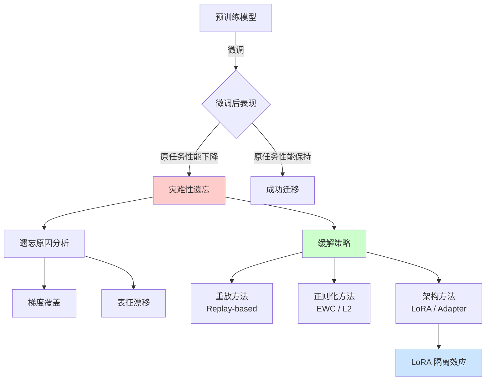
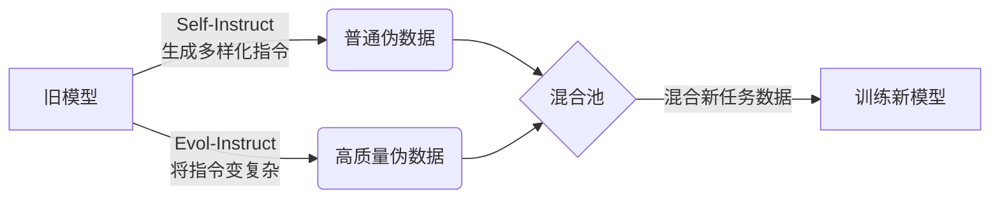
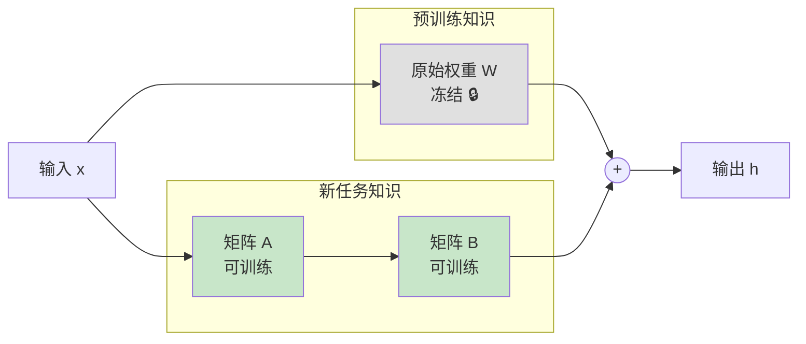
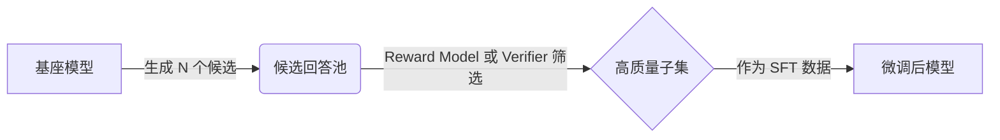
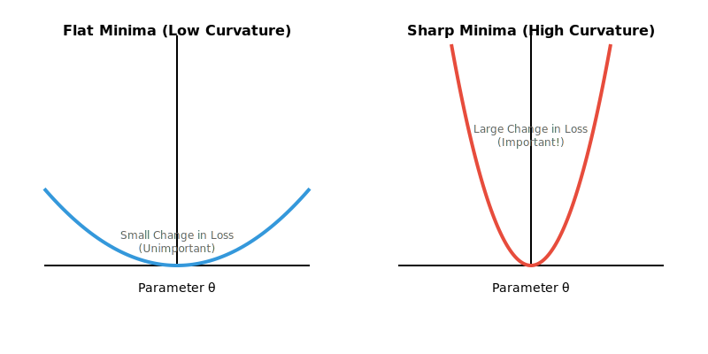

# Week 5 讲义：灾难性遗忘与持续学习

> **核心目标**：理解灾难性遗忘的根本机制，掌握缓解策略，以及 LoRA 在保护预训练知识中的隔离效应。
>
> **学习时间**：6 小时
>
> **关键输出**：遗忘机制分析 + 缓解策略对比表 + 多任务泛化评估框架
>
> **前置要求**：已完成 Week 3（LoRA）和 Week 4（RLHF）的学习，理解微调的基本流程。

---

## 📖 本周知识图谱



---

## 🧭 Part 0: 引言——为什么需要关注"遗忘"？

在前几周的学习中，我们已经掌握了如何对大模型进行微调：

- **Week 3**：使用 LoRA 进行参数高效微调，让模型学会新任务
- **Week 4**：通过 RLHF/DPO 让模型对齐人类偏好

但这里隐藏着一个关键问题：**当模型学会新技能时，它会不会"忘记"旧技能？**

### 💡 一个典型场景

想象你正在用 Qwen-VL 做摄像机运动识别任务：

```text
任务 A：预训练阶段
  模型学会了：图像理解、文本生成、常识推理...
  表现：在通用 VQA 测试上准确率 85%

任务 B：微调阶段（你的任务）
  模型学会了：识别 Pan/Tilt/Zoom 等摄像机运动
  表现：在 CameraBench 上 F1 达到 90%

问题：微调后再测通用 VQA，准确率还剩多少？
```

如果答案是从 85% 骤降到 50%，这就是**灾难性遗忘 (Catastrophic Forgetting)**。

> [!IMPORTANT]
> **本周核心问题**：
> 1. 为什么神经网络会"遗忘"？（机制分析）
> 2. 如何在学习新任务的同时保护旧知识？（缓解策略）
> 3. LoRA 为什么能天然缓解遗忘？（隔离效应原理）

---

## 🔬 Part 1: 灾难性遗忘的定义与现象

### 1.1 什么是灾难性遗忘？

**灾难性遗忘 (Catastrophic Forgetting)** 是指神经网络在学习新任务时，**突然且剧烈地**丧失在旧任务上的性能。

> [!NOTE]
> **"灾难性"的含义**
> 
> 这里的"灾难性"不是夸张修辞，而是精确描述：
> - **人类遗忘**：渐进式的、部分的（你学法语不会忘记英语）
> - **神经网络遗忘**：突然的、几乎完全的（学完任务 B，任务 A 的知识可能荡然无存）

### 1.2 遗忘的程度度量

在持续学习 (Continual Learning) 领域，我们用以下指标量化遗忘：

#### 🎯 前向迁移 (Forward Transfer, FWT)

衡量**同一模型**在学习旧任务后，对学习新任务是否有帮助：
$$\text{FWT} = \frac{1}{T-1} \sum_{i=2}^{T} (a_{i|1:i-1} - b_i)$$

**符号说明**：
- $T$：任务总数
- $a_{i|1:i-1}$：**持续学习模型**在学完任务 1 到 i-1 后，在任务 i 上的初始表现（即"带着旧知识学新任务"的起点）
- $b_i$：**随机初始化模型**（未经过任何训练）在任务 i 上的表现（即"从零开始学新任务"的起点）
- $\frac{1}{T-1}$：对所有任务取平均（从任务 2 开始统计，共 T-1 个）

> [!TIP]
> **Q: 为什么要对比"随机模型"？它肯定什么都不会啊？**
> 
> **A: 正是因为它"什么都不会"，所以它是最好的参照物 (Baseline)。**
> 
> FWT 衡量的是 **"起跑线"的差异**：
> *   $b_i$ 是**小白的起跑线**：就像一个从来没读过书的人，直接去做"高等数学"题（全靠瞎蒙，准确率可能是 25%）。
> *   $a_{i|...}$ 是**你的起跑线**：你学完了"小学数学"（旧任务），现在第一次做"高等数学"题。
> 
> *   如果你做到了 40%，且 $FWT = 40\% - 25\% = 15\% > 0$，说明"小学数学"的基础帮助了你（**正迁移**）。
> *   如果你只做到了 10%（比瞎蒙还低），说明小学数学教的思维定势反而害了你（**负迁移**）。

**解读**：
- **FWT > 0**：正迁移（之前的学习有帮助）
- **FWT < 0**：负迁移（之前的学习有害）

> **Q: 为什么是 $FWT = a_{i|1:i-1} - b_i$ 而不是 $FWT = a_{i|1:i-1} - a_{i|1:i-2}$？**
> 
> **A: 因为我们要衡量的是"整个过去"（从任务 1 到 i-1）带来的积累，而不是只看"上一个任务"（i-1）。**
> 
> *   $a_{i|1:i-1}$ 表示：学完**所有前序任务**后，你在任务 i 上的表现。
> *   如果减去 $a_{i|1:i-2}$，那你衡量的仅仅是**任务 i-1 单独带来的增量**。
> *   FWT 关注的是**"厚积薄发"**：你过去学过的数学、物理、化学（所有旧知识），加在一起，让你在学"生物"（新任务）时快了多少？


> [!INSIGHT]
> **FWT与迁移学习的关系**
> 您的直觉非常准确！**FWT 本质上就是量化"迁移学习" (Transfer Learning) 的效果。**
> *   **传统迁移学习**：通常是单次的 (Pretrain $\to$ Finetune)。
> *   **持续学习**：是连续的 (Task A $\to$ B $\to$ C...)。
> 
> 可以把持续学习看作**"连续的迁移学习"**：每学完一个任务，模型就变成了一个新的、更强大的"预训练模型"，用来初始化下一个任务。FWT 就是在衡量这个"新预训练模型"比"随机初始化"强多少。

#### 🎯 后向迁移 / 遗忘率 (Backward Transfer, BWT)

衡量学习新任务是否损害旧任务：
$$\text{BWT} = \frac{1}{T-1} \sum_{i=1}^{T-1} (a_{i|T} - a_{i|i})$$

**符号说明**：
- $T$：任务总数
- $a_{i|T}$：学完所有 T 个任务后，在任务 i 上的表现（即"最终状态"）
- $a_{i|i}$：刚学完任务 i 时的表现（即"最佳状态"）
- $a_{i|T} - a_{i|i}$：任务 i 的性能变化量（负值表示遗忘）
- $\frac{1}{T-1}$：对前 T-1 个任务取平均（最后一个任务没有被后续任务影响）

**解读**：
- **BWT < 0**：发生遗忘（学新的忘旧的）
- **BWT ≈ 0**：完美记忆

> [!TIP]
> **简化理解**
> 
> - **FWT** 回答：学了 A 对学 B 有帮助吗？
> - **BWT** 回答：学了 B 对保持 A 有伤害吗？
> 
> 理想情况是：FWT > 0（正迁移）且 BWT ≈ 0（无遗忘）。

### 1.3 遗忘在 LLM 微调中的表现

| 微调方法             | 典型遗忘程度 | 说明                               |
| -------------------- | ------------ | ---------------------------------- |
| **Full Fine-tuning** | ⚠️ 严重       | 所有参数更新，原始知识最容易被覆盖 |
| **LoRA**             | ✅ 轻微       | 主干冻结，仅低秩增量变化           |
| **SFT + RLHF**       | ⚠️ 中等       | 多阶段训练可能累积遗忘             |
| **Adapter**          | ✅ 轻微       | 类似 LoRA，原始权重不变            |

---

## 🧠 Part 2: 遗忘的根本原因

灾难性遗忘不是"bug"，而是梯度下降优化的**内在特性**。理解其根本原因，才能设计有效的缓解策略。

### 2.1 原因一：梯度覆盖 (Gradient Overwrite)

这是最直观的遗忘机制。

#### 📐 数学分析

在标准梯度下降中，参数更新规则为：
$$\theta^{new} = \theta^{old} - \eta \nabla_\theta \mathcal{L}_{TaskB}$$

**符号说明**：
- $\theta$：模型的所有可训练参数
- $\theta^{old}$：更新前的参数值
- $\theta^{new}$：更新后的参数值
- $\eta$：学习率（Learning Rate），控制每步更新的幅度
- $\nabla_\theta$：对参数 $\theta$ 求梯度的算子
- $\mathcal{L}_{TaskB}$：任务 B 的损失函数
- $\nabla_\theta \mathcal{L}_{TaskB}$：**任务B的损失函数对参数 $\theta$ 的梯度**，指向损失上升最快的方向

**关键洞察**：梯度 $\nabla_\theta \mathcal{L}_{TaskB}$ 完全只考虑任务 B 的损失，**对任务 A （即原来的任务）的表现没有任何保护**。

#### 🎯 直觉类比

想象神经网络的参数空间是一个多维地形：

```text
任务 A 的最优点：山谷 A（在坐标 θ_A）
任务 B 的最优点：山谷 B（在坐标 θ_B）

Full Fine-tuning 的行为：
  从 θ_A 出发 → 直奔 θ_B
  问题：θ_B 可能远离 θ_A，走过去就回不来了
```

#### 💻 代码示例：观察梯度覆盖

```python
import torch
import torch.nn as nn

# 简化模型
model = nn.Linear(10, 2)

# 任务 A：让 w[0] 变大
loss_A = -model.weight[0, 0]
loss_A.backward()
grad_A = model.weight.grad.clone()

# 任务 B：让 w[0] 变小（与 A 冲突）
model.zero_grad()
loss_B = model.weight[0, 0]
loss_B.backward()
grad_B = model.weight.grad.clone()

# 梯度方向完全相反！
print(f"梯度 A: {grad_A[0, 0]:.4f}")  # 负值
print(f"梯度 B: {grad_B[0, 0]:.4f}")  # 正值
print(f"梯度冲突: {(grad_A * grad_B).sum() < 0}")  # True
```

**结论**：当两个任务需要参数向相反方向更新时，后学的任务会**直接覆盖**前一个任务的优化结果。

### 2.2 原因二：表征漂移 (Representation Drift)

梯度覆盖是"参数层面"的解释，表征漂移则是"语义层面"的解释。

#### 📐 概念解释

神经网络的中间层（隐藏层）学习的是**表征 (Representation)**——将输入映射为高维特征向量。

```text
预训练后的表征空间：
  "猫" → 向量 [0.8, 0.2, ...]（靠近"动物"区域）
  "狗" → 向量 [0.7, 0.3, ...]（也在"动物"区域）
  "汽车" → 向量 [0.1, 0.9, ...]（远离"动物"区域）

微调任务 B 后的表征空间：
  整个空间发生了"旋转"或"拉伸"
  "猫" → 新向量 [0.5, 0.6, ...]（位置变了！）
  
  问题：依赖旧表征的分类器/解码器失效了
```

#### 🔍 表征漂移的本质

表征漂移是梯度覆盖在**隐藏层**的表现：

1. **浅层变化**：输入 → 隐藏层的映射改变
2. **传播效应**：浅层变化导致深层输入分布改变（Covariate Shift）
3. **级联失效**：下游层难以适应新的输入分布

#### 📊 梯度覆盖 vs 表征漂移

| 维度         | 梯度覆盖                                     | 表征漂移                 |
| ------------ | -------------------------------------------- | ------------------------ |
| **观察层面** | 参数（权重矩阵）                             | 激活值（隐藏状态）       |
| **本质**     | 原因                                         | 结果                     |
| **度量方式** | 权重变化量 $\|\theta_{new} - \theta_{old}\|$ | 表征相似度（如 CKA）     |
| **关系**     | 梯度覆盖 **导致** 表征漂移                   | 表征漂移**反映**知识丢失 |

> [!NOTE]
> **两者的关系**
> 
> 梯度覆盖是**机制**，表征漂移是**现象**。
> - 梯度覆盖告诉我们"为什么会遗忘"（参数被改了）
> - 表征漂移告诉我们"遗忘有多严重"（语义空间变形了）

### 2.3 形象总结：搬家类比

想象神经网络是一栋办公楼：

```text
预训练阶段：
  - 一楼（浅层）：前台，负责接待各种访客（通用特征提取）
  - 二楼（中层）：会议室，负责处理特定事务（任务相关表征）
  - 三楼（深层）：决策室，负责最终输出（分类/生成头）

微调任务 B（Full FT）：
  - 一楼前台换了人，规则也变了
  - 结果：之前熟悉的访客（任务 A 的输入）进来后不知所措
  - 二楼会议室收到的信息格式变了，无法正常工作
  - 三楼：即使没换人，也做不出正确决策

LoRA 微调：
  - 一楼前台没变（主干冻结）
  - 只是在前台旁边多放了一个咨询台（低秩增量）
  - 结果：老访客照旧，新访客有专人接待
```

---

## 🛡️ Part 3: 缓解策略体系

既然理解了遗忘的原因，我们就可以设计针对性的解决方案。业界将缓解策略分为三大类。

### 3.1 重放方法 (Replay-based Methods)

**核心思想**：在学习新任务时，同时"复习"旧任务的数据。

#### 📌 经验重放 (Experience Replay)

最直接的方法：保留一部分旧任务的训练数据，在新任务训练中混入使用。

```python
# 混合数据训练
for batch_new in dataloader_taskB:
    # 从旧任务缓冲区采样
    batch_old = sample_from_buffer(task_A_buffer, size=batch_new.size // r)
    
    # 合并损失
    loss_new = criterion(model(batch_new.x), batch_new.y)
    loss_old = criterion(model(batch_old.x), batch_old.y)
    
    total_loss = loss_new + lambda_replay * loss_old
    total_loss.backward()
```

**关键难点：重放比例 (Replay Ratio)**

用户常面临的一个难题是：**新旧数据的比例该如何设置？**

*   **固定比例**：最简单的做法。通常将旧数据设置为 batch 的 1% ~ 10%。
    *   如果旧数据太少（如 <1%），复习效果不明显，仍会遗忘。
    *   如果旧数据太多（如 >50%），会严重拖慢新任务的学习速度，甚至导致新任务学不会（欠拟合）。
*   **常用经验值**：在 LLM 微调中，通常混合 **1% - 5%** 的通用数据即可有效缓解遗忘。

#### 📌 LLM 的特殊性：通用知识重放 (General Knowledge Replay)

对于传统模型，"旧任务"可能只是上一轮分类任务（如 Task A）。但对于 **LLM**，"旧任务"通常指的是**海量的预训练知识**（通用语言能力、逻辑推理、代码能力）。

**问题**：我们无法存储甚至获取全部预训练数据（TB 级别）。

**解决方案**：
1.  **通用数据集重放**：不一定要用原始预训练数据。可以使用开源的高质量通用数据集（如 SlimPajama 的子集、Wikipedia、高质量 SFT 数据集如 ShareGPT）作为"通用能力"的代表。
2.  **指令数据重放**：在进行特定垂直领域微调（如医疗问答）时，混入少量（如 5%）的通用指令微调数据（General SFT），可以防止模型变成"只会看病的傻子"（失去没见过的日常对话能力）。

#### 📌 生成式重放 (Generative Replay)

不存储真实数据，而是用生成模型"回忆"旧任务的样本。

流程：
1. 学完任务 A 后，训练一个生成器 $G_A$（能生成任务 A 的数据）
2. 学习任务 B 时，用 $G_A$ 生成"伪造的任务 A 数据"
3. 用生成数据替代真实数据进行重放

**在 LLM 中的应用：自我合成演练 (Self-Synthesized Rehearsal)**

在 LLM 领域，生成式重放通常被称为 **Self-Synthesized Rehearsal (SSR)** 或 **Self-Replay**。为了避免这些术语混淆，我们将它们拆解为**策略**和具体的**生成技术**：

**1. 核心策略：Self-Synthesized Rehearsal (SSR)**
*   **定义**：这是一种**持续学习策略**。它的核心含义是：在学习新任务之前，利用模型现有的能力，"凭空"生成一批代表其原有水平的数据（即伪样本）。
*   **作用**：将这些"伪样本"作为复习资料，与新任务数据混合训练，从而防止模型在学新知识时"把旧知识忘光"。

**2. 核心技术：如何生成这些数据？**
为了生成高质量的复习资料，我们通常采用以下两种代表性技术，它们分别解决了"广度"和"深度"的问题：

*   **技术 A：Self-Instruct (广度扩展)**
    *   **来源**：*Self-Instruct: Aligning Language Models... (Wang et al., 2022)*
    *   **核心机制**：**"种子-生成-过滤"循环**。
        1.  **Seed**：给模型几个简单的种子指令（如 175 个手动编写的任务）。
        2.  **Generate**：让模型模仿这 175 个种子，生成 52,000 个**新的、不同的**指令及其回答。
        3.  **Filter**：过滤掉低质量或重复的生成结果。
    *   **意义**：它让模型能够**自我扩充任务的多样性**，生成海量的通用问答对，保证了"复习资料"的覆盖面。

*   **技术 B：Self-Evolving / Evol-Instruct (深度进化)**
    *   **来源**：*WizardLM (Xu et al., 2023)*
    *   **核心机制**：**指令进化 (Instruction Mutation)**。它不满足于生成"类似"的指令，而是要求模型将指令**改写得更难**。
        *   **In-Depth Evolution (深度进化)**：添加约束（"不用这个词"）、增加推理步骤、使其更复杂。
        *   **In-Breadth Evolution (广度进化)**：生成全新的话题。
    *   **意义**：它防止了模型在自我复习时"偷懒"（只生成简单样本）。通过不断提升复习资料的难度，保持模型的高级推理能力。

**总结：Self-Replay 流程图**



**生成式重放优缺点总结**：

| 优点                                                    | 缺点                                                           |
| ------------------------------------------------------- | -------------------------------------------------------------- |
| **无需旧数据**：完全保护隐私，零存储成本                | **幻觉风险**：模型可能生成错误事实并自我强化（Self-Poisoning） |
| **提升泛化**：Self-Instruct 带来的多样性有助于 OOD 泛化 | **算力消耗**：生成和筛选数据需要额外的推理算力                 |
| **能力保持**：Evol-Instruct 能防止推理能力退化          | **质量控制**：需要通过 Filter 或 Reward Model 严格把关         |

### 3.2 正则化方法 (Regularization-based Methods)

**核心思想**：在损失函数中添加约束项，惩罚对"重要参数"的改动。

#### 📌 L2 正则化 (最简单的基线)

限制参数不要偏离旧的位置太远：

$$\mathcal{L}_{total} = \mathcal{L}_{TaskB} + \frac{\lambda}{2} \sum_i (\theta_i - \theta_i^{old})^2$$

**符号说明**：
- $\mathcal{L}_{total}$：总损失函数（需要最小化的目标）
- $\mathcal{L}_{TaskB}$：新任务 B 的原始损失
- $\lambda$：正则化强度超参数（$\lambda$ 越大，对参数变化的惩罚越强）
- $\theta_i$：当前参数值（第 i 个参数）
- $\theta_i^{old}$：学完旧任务后的参数值（锚点）
- $(\theta_i - \theta_i^{old})^2$：参数偏移量的平方（惩罚偏离锚点）
- $\sum_i$：对所有参数求和

**问题**：L2 正则对**所有参数一视同仁**，但实际上：
- 有些参数对旧任务很重要（动不得）
- 有些参数对旧任务无关紧要（可以随便改）

#### 📌 EWC: 弹性权重巩固 (Elastic Weight Consolidation) ⭐

EWC 是正则化方法的**里程碑式工作**（Kirkpatrick et al., 2017, DeepMind）。它引入了**参数重要性**的概念。

##### 核心直觉

> [!TIP]
> **EWC 的核心洞察**
> 
> 不是所有参数都同等重要。有些参数是任务 A 的"关键螺丝"，拧动它们系统就崩了；有些参数是"装饰螺丝"，动动无所谓。
> 
> **EWC 的策略**：给每个参数标记"重要程度"，重要的严格保护，不重要的随便改。

##### 数学公式

$$\mathcal{L}_{EWC} = \mathcal{L}_{TaskB}(\theta) + \frac{\lambda}{2} \sum_i F_i (\theta_i - \theta_{A,i}^*)^2$$

其中：
- $\mathcal{L}_{TaskB}(\theta)$：新任务的损失
- $\theta_{A,i}^*$：完成任务 A 训练后的参数值（锚点）
- $F_i$：参数 $\theta_i$ 的**重要性权重**
- $\lambda$：超参数，控制保护力度

##### Fisher 信息矩阵：如何度量重要性？

**关键问题**：$F_i$ 从何而来？

**直觉解释**：

如果改变参数 $\theta_i$ 会**显著影响任务 A 的输出**，那它就是重要的。

数学上，这可以用 **Fisher 信息矩阵 (Fisher Information Matrix)** 的对角元素来近似：

> [!TIP]
> **Fisher 矩阵是什么？**
> 简单来说，它衡量了"如果你稍微改动这个参数，Loss 会变化多大"。变化越大，参数越重要。
> *   想了解它的**物理直觉 (Loss 景观曲率)**？请跳转至文末的 [📚 附录 A：数学直觉补充](#-附录-a数学直觉补充-math-intuition)。

$$F_i = \mathbb{E}_{x \sim D_A} \left[ \left( \frac{\partial \log p(y|x; \theta)}{\partial \theta_i} \right)^2 \right]$$

**符号说明**：
- $F_i$：第 $i$ 个参数的 Fisher 信息值（重要性度量）
- $\mathbb{E}_{x \sim D_A}$：对任务 A 的数据分布 $D_A$ 求期望（即在所有训练样本上取平均）
- $p(y|x; \theta)$：给定输入 $x$ 和参数 $\theta$，模型输出 $y$ 的概率
- $\log p(y|x; \theta)$：对数似然（Log-Likelihood）
- $\frac{\partial}{\partial \theta_i}$：对第 $i$ 个参数求偏导
- $(\cdot)^2$：梯度的平方（确保非负，且放大大梯度的影响）

**过程拆解 (Step-by-Step Breakdown)**：

这个公式其实是在问三个问题，一步步推导出了重要性：

1.  **敏感度探测 (Gradient)**：$\frac{\partial \log p}{\partial \theta_i}$
    *   "如果我稍微把参数 $\theta_i$ 拨动一点点，模型的预测概率会不会剧烈跳变？"
2.  **量级提取 (Squared)**：$(\dots)^2$
    *   "我不在乎是变大还是变小（正负），我只在乎**变化幅度**有多大。"
3.  **全局平均 (Expectation)**：$\mathbb{E}_{x \sim D_A}$
    *   "不能只看一张图片，要看**所有训练数据**。只有在大多数数据上都敏感的参数，才是真正的核心参数。"

**结论**：最终算出来的 $F_i$ 就是该参数在整个任务面上的"平均敏感度"。

> [!IMPORTANT]
> **是矩阵还是向量？(Matrix vs. Diagonal)**
> *   **理论上**：Fisher 信息确实是一个巨大的 $N \times N$ 矩阵（$N$ 是模型总参数量），包含所有参数两两之间的关系。
> *   **实际上**：在 EWC 中，为了计算可行性，我们**只计算对角线元素** (Diagonal Approximation)。
> *   **为什么只算对角线就够了？**
>     1.  **这一步是被迫的**：对于哪怕只有 1B 参数的模型，$N^2$ 的矩阵也太大了（1B * 1B），根本存不下也算不动。
>     2.  **独立性假设**：只保留对角线意味着我们**假设参数之间是独立的**（即参数 A 的变化不会影响参数 B 的重要性）。虽然这在数学上不严谨，但在物理直觉上，它抓住了"这个参数是否敏感"这一核心矛盾，实践中效果已经足够好。
> *   **对象**：这里的 $i$ 指的是**将整个模型（所有层、所有权重矩阵）拉平 (Flatten) 成一个超长向量后的第 $i$ 个标量参数**。
> *   所以我们计算的是每个**独立参数**的重要性，忽略了参数之间的相互影响。

**更直观的理解**：

$$F_i \approx \text{参数 } \theta_i \text{ 对损失的敏感度}$$

- **$F_i$ 大**：动一点 $\theta_i$，损失变化剧烈 → 这个参数很重要，保护它！
- **$F_i$ 小**：动很多 $\theta_i$，损失几乎不变 → 这个参数不重要，可以让给新任务

> [!WARNING]
> **EWC 在 LLM 中的局限与现状 (Reality Check)**
> 
> 尽管 EWC 在理论上很优雅，但在**当前 LLM 工业界微调**中，它**并不是**首选策略。
> 
> 1.  **计算成本过高**：对于 7B+ 参数的大模型，计算和存储完整的 Fisher 矩阵（即使是对角近似）依然非常昂贵。
> 2.  **LoRA 的替代**：LoRA 通过冻结主干参数，天然实现了"参数隔离"，其效果往往优于 EWC，且实现更简单。
> 
> **那大家都在用什么正则化？**
> 
> *   **SFT 阶段 (Supervised Fine-Tuning)**：
>     *   **做法**：标准 SFT 仅最小化交叉熵损失 (Cross-Entropy Loss)，通常**不使用**显式的 KL 散度。
>     *   **目的**：让模型尽可能"有样学样"，快速拟合新数据的分布 (Mode-seeking)。
>     *   *(例外：仅在知识蒸馏或特定持续学习算法中，才会为了对齐 Teacher 分布而引入 KL)*
> *   **RLHF 阶段 (PPO / DPO/ GRPO)**：
>     *   **做法**：在奖励函数或损失函数中强制加入 KL 惩罚项 ($ R - \beta \cdot D_{KL}[\pi_\theta || \pi_{ref}] $)。
>     *   **原因**：强化学习算法极易利用奖励模型的漏洞（Reward Hacking），即模型发现输出某种乱码能骗取高分。
>     *   **目的**：通过 KL 锁住基座模型，确保模型在优化人类偏好的同时，语言生成能力不发生崩坏（还能说“人话”）。

##### 计算流程

```python
import torch

def compute_fisher(model, dataloader, num_samples=1000):
    """计算 Fisher 信息矩阵的对角元素"""
    fisher = {n: torch.zeros_like(p) for n, p in model.named_parameters()}
    model.eval()
    
    for i, (x, y) in enumerate(dataloader):
        if i >= num_samples:
            break
            
        model.zero_grad()
        output = model(x)
        
        # 对数似然的梯度
        log_prob = torch.nn.functional.log_softmax(output, dim=1)
        loss = -log_prob[range(len(y)), y].mean()
        loss.backward()
        
        # 累加梯度的平方
        for n, p in model.named_parameters():
            if p.grad is not None:
                fisher[n] += p.grad ** 2
    
    # 平均
    for n in fisher:
        fisher[n] /= num_samples
    
    return fisher


def ewc_loss(model, fisher, theta_star, lamb=1000):
    """计算 EWC 正则项"""
    loss = 0
    for n, p in model.named_parameters():
        loss += (fisher[n] * (p - theta_star[n]) ** 2).sum()
    return lamb * loss / 2
```

##### EWC 的优缺点

| 优点                     | 缺点                                 |
| ------------------------ | ------------------------------------ |
| 不需要存储旧数据         | 需要计算并存储 Fisher 矩阵           |
| 有理论基础（贝叶斯近似） | 对超参数 λ 敏感                      |
| 可以保护任意比例的参数   | 任务数增多时，"可用参数空间"逐渐缩小 |

### 3.3 架构方法 (Architecture-based Methods)

**核心思想**：通过网络结构设计，将不同任务的知识**物理隔离**。

#### 📌 Progressive Neural Networks

为每个新任务创建新的网络"列"，同时保留旧列不变：

```text
任务 A        任务 B        任务 C
  ↓             ↓             ↓
[网络列1] → [网络列2] → [网络列3]
（冻结）    （冻结）    （训练）
            ↗           ↗
        横向连接    横向连接
```

**特点**：
- ✅ 零遗忘（旧网络完全不动）
- ❌ 参数量线性增长
- ❌ 不适合 LLM（本来就很大了）

#### 📌 参数隔离：Adapter / LoRA 的视角

这就是我们在 Week 3 学过的 PEFT 方法！

```text
传统架构方法的思路：
  "给每个任务单独一套参数"
  
LoRA/Adapter 的思路：
  "原始参数是公共财产（冻结），每个任务只训练自己的小模块"
```

**这正是 LoRA 能缓解遗忘的根本原因，我们将在 Part 4 详细分析。**

### 3.4 三大策略对比

| 策略类型   | 代表方法          | 核心机制     | 存储开销        | 计算开销          | 遗忘缓解效果 |
| ---------- | ----------------- | ------------ | --------------- | ----------------- | ------------ |
| **重放**   | Experience Replay | 复习旧数据   | 高（存数据）    | 中                | ⭐⭐⭐⭐         |
| **正则化** | EWC               | 保护重要参数 | 中（存 Fisher） | 高（计算 Fisher） | ⭐⭐⭐          |
| **架构**   | LoRA/Adapter      | 参数物理隔离 | 低              | 低                | ⭐⭐⭐⭐⭐        |

> [!TIP]
> **实践建议**
> 
> 在 LLM 微调场景下，优先选择**架构方法（LoRA）**，原因：
> 1. 不需要存储/回放旧数据
> 2. 不需要计算 Fisher 矩阵
> 3. 与现有微调框架（Hugging Face PEFT）无缝集成

---

## 🔒 Part 4: LoRA 的遗忘隔离效应

在 Week 3 中，我们学习了 LoRA 可以节省显存。但 LoRA 还有一个同样重要的优势：**天然抵抗灾难性遗忘**。

### 4.1 为什么 LoRA 能保护预训练知识？

#### 📐 数学视角

回顾 LoRA 的核心公式：
$$h = Wx + \frac{\alpha}{r}(BA)x = (W + \Delta W)x$$

其中：
- $W$：预训练权重（**冻结**）
- $\Delta W = \frac{\alpha}{r}BA$：低秩增量（**可训练**）

**关键洞察**：

1. **$W$ 完全不变**：预训练知识被"锁死"在 $W$ 中
2. **$\Delta W$ 是增量**：新任务只能**添加**知识，不能**覆盖**
3. **可逆性**：想恢复原始模型？只需移除 $BA$

#### 🔄 与 EWC 的思想对比

| 方面           | EWC                                | LoRA                           |
| -------------- | ---------------------------------- | ------------------------------ |
| **保护方式**   | "软保护"：梯度中惩罚重要参数的变化 | "硬保护"：直接冻结所有原始参数 |
| **保护粒度**   | 按参数重要性选择性保护             | 全部保护（一刀切）             |
| **新知识容量** | 需要与旧知识"抢"参数空间           | 专属的低秩空间，不干扰旧知识   |
| **实现复杂度** | 需要计算 Fisher 矩阵               | 直接冻结，无额外计算           |

> [!NOTE]
> **LoRA 的隔离效应**
> 
> LoRA 本质上是一种**隐式的架构方法**：
> - EWC 说："别动重要的参数"
> - LoRA 说："我压根不让你动任何原始参数"
> 
> 这种"硬隔离"虽然简单粗暴，但在 LLM 场景下效果极好。

### 4.2 LoRA 隔离的可视化理解



**物理隔离的效果**：
- 预训练知识存储在灰色区域（$W$），永不改变
- 新知识存储在绿色区域（$A, B$），独立优化
- 两部分**加法组合**，而非相互覆盖

### 4.3 LoRA 的局限性：低秩空间的干扰

尽管 LoRA 能有效隔离主干参数，但它并非完美：

#### ⚠️ 问题：多任务 LoRA 的干扰

当你需要在**同一个基座模型上**先后训练多个 LoRA 时：

```text
场景：
1. 训练 LoRA₁ 用于任务 A
2. 在同一基座上训练 LoRA₂ 用于任务 B
3. 合并两个 LoRA 使用

潜在问题：
  LoRA₁ 和 LoRA₂ 可能占用了**重叠的低秩子空间**
  合并时会产生干扰
```

#### 🔬 研究进展：O-LoRA (Orthogonal LoRA) 技术详解

2024 年提出的 O-LoRA 通过**正交子空间约束**，在数学上实现了更严格的任务隔离。

**1. 核心思想：子空间正交化**

在学习新任务 $T_{new}$ 时，强行要求其 LoRA 更新矩阵 ($\Delta W_{new}$) 必须位于旧任务子空间的**零空间 (Null Space)** 中。

$$ \Delta W_{new} \perp \mathcal{S}_{old} $$

这意味着：新任务的参数更新方向，与旧任务已经占据的关键方向是**垂直**的。数学上，这保证了新任务对旧任务特征的干扰理论上为 0。

#### 🔬 研究进展：O-LoRA (Orthogonal LoRA) 技术详解

2024 年提出的 O-LoRA 通过**正交子空间约束**，在数学上实现了更严格的任务隔离。这部分的核心逻辑非常精彩，我们展开讲讲。

**1. 几何直觉：把参数空间切蛋糕**

想象一个 3D 空间（参数空间）：
*   **任务 A** 占用了 X 轴：它学到的特征主要体现在 X 轴方向的变化。
*   **任务 B** 占用了 Y 轴：它学到的特征主要体现在 Y 轴方向的变化。
*   如果**任务 C** 想要学习且不干扰 A 和 B，它应该去哪？
    *   **普通微调**：可能斜着走（同时改变 X, Y, Z），结果把 A 和 B 的特征都破坏了。
    *   **O-LoRA**：强迫任务 C 只能在 **Z 轴**（零空间）上更新。这样无论 C 怎么变，它在 X 和 Y 轴上的投影都是 0，也就是对 A 和 B 的影响为 0。

**2. 核心实现：梯度投影 (Gradient Projection)**

怎么保证新任务只在 Z 轴上跑？O-LoRA 使用了类似 **GPM (Gradient Projection Memory)** 的技术：

*   **Step 1: 提取旧任务基底 (Basis Extraction)**
    *   每学完一个任务（如 Task A），我们收集该任务微调后的关键参数变化（或激活值），通过 **SVD (奇异值分解)** 提取出它的“主成分方向”（即 X 轴）。
    *   将这些方向存入一个**全局正交基缓冲区 (Basis Buffer)** $U_{old}$。

*   **Step 2: 训练新任务时的“紧箍咒”**
    *   在训练 Task B 时，算出梯度 $\nabla \theta$（这个梯度本来想往四面八方走）。
    *   **实时投影**：强行减去梯度在 $U_{old}$ 上的分量。
    
    $$ \nabla \theta_{safe} = \nabla \theta - \nabla \theta \cdot (U_{old} U_{old}^T) $$
    
    *   **结果**：剩下的梯度 $\nabla \theta_{safe}$ 每一寸都垂直于 $U_{old}$。这保证了新的参数更新完全不会触碰旧任务的“地盘”。

**3. 物理含义总结**

O-LoRA 就像是一个**高度自律的建筑师**：
*   Task A 建了一栋楼（占用一部分空间）。
*   Task B 进场时，O-LoRA 划了一道红线：“Task A 的楼不能动”。
*   Task B 只能在**空地（Null Space）**上盖新楼。
*   如果空地也盖满了（子空间耗尽），模型就无法再有效学习（此时可能需要扩大 Rank）。

**优点**：
*   ✅ **Zero Forgetting (理论上)**：数学层面保证不干扰旧知识。
*   ✅ **隐私保护**：不需要存储任何旧任务的原始数据（Replay-free），只存几个方向向量。
*   ✅ **参数高效**：复用了 LoRA 的低秩特性，显存开销小。

### 4.4 实战建议

| 场景           | 推荐策略                                 |
| -------------- | ---------------------------------------- |
| 单任务微调     | 标准 LoRA（无需额外措施）                |
| 多任务顺序微调 | O-LoRA 或任务特定 LoRA + 路由器          |
| 希望完全零遗忘 | 为每个任务训练独立 LoRA，推理时按需加载  |
| 合并多个 LoRA  | 使用 TIES-Merging 或 DARE 等高级合并算法 |

---

## 📊 Part 5: 多任务学习与泛化评估

在实际应用中，我们往往需要模型同时胜任多个任务。本节讨论多任务场景下的特殊问题。

### 5.1 任务干扰理论

当多个任务同时训练时，可能出现**任务干扰**：

#### 📌 负迁移 (Negative Transfer)

**定义**：学习任务 A **降低了**任务 B 的表现（相比单独学习 B）。

**原因**：
- 任务 A 和 B 需要"相反方向"的特征
- 共享层被拉向对 A 最优但对 B 不利的位置

**例子**：
```text
任务 A：情感分析（关注情感词）
任务 B：事实抽取（忽略情感词）

共享的表征层面临冲突：
  - A 希望"terrible"有高激活
  - B 希望"terrible"被忽略
```

#### 📌 正迁移 (Positive Transfer)

**定义**：学习任务 A **提升了**任务 B 的表现。

**条件**：
- 任务 A 和 B 共享底层知识
- A 的表征对 B 同样有益

**例子**：
```text
任务 A：英语语法纠错
任务 B：英语机器翻译

正迁移：A 学到的语法知识有助于 B 生成正确的句子
```

### 5.2 多任务评估框架

#### 📐 评估指标矩阵

设有 $T$ 个任务，$a_{i,j}$ 表示"学完任务 $j$ 后在任务 $i$ 上的准确率"。

完整评估矩阵：

$$A = \begin{bmatrix} a_{1,1} & a_{1,2} & \cdots & a_{1,T} \\ a_{2,1} & a_{2,2} & \cdots & a_{2,T} \\ \vdots & \vdots & \ddots & \vdots \\ a_{T,1} & a_{T,2} & \cdots & a_{T,T} \end{bmatrix}$$

- **对角线** $a_{i,i}$：刚学完任务 $i$ 时的表现（最佳状态）
- **最后一列** $a_{i,T}$：学完所有任务后的表现
- **上三角**：前向迁移（学旧的对新的有没有帮助）
- **下三角**：后向迁移（学新的对旧的有没有伤害）

#### 📊 综合指标

1. **平均准确率 (Average Accuracy)**
   $$\text{ACC} = \frac{1}{T} \sum_{i=1}^{T} a_{i,T}$$
   
   **符号说明**：
   - $T$：任务总数
   - $a_{i,T}$：学完所有任务后，在任务 $i$ 上的准确率（对应矩阵的**最后一列**）
   - $\frac{1}{T} \sum_{i=1}^{T}$：对所有任务取平均
   
2. **遗忘率 (Forgetting)**
   $$\text{FGT} = \frac{1}{T-1} \sum_{i=1}^{T-1} \max_{j \in \{i,...,T-1\}}(a_{i,j} - a_{i,T})$$
   
   **符号说明**：
   - $a_{i,j}$：学完任务 $j$ 后，在任务 $i$ 上的准确率
   - $\max_{j \in \{i,...,T-1\}} a_{i,j}$：任务 $i$ 在学习过程中达到的**最佳表现**
   - $a_{i,j} - a_{i,T}$：最佳表现与最终表现的差距（遗忘量）
   - $\frac{1}{T-1}$：对前 T-1 个任务取平均

3. **学习曲线面积 (Area Under the Curve)**
   考虑整个学习过程的表现，而非只看最终状态

### 5.3 泛化能力评估

除了任务内的准确率，还需要评估**跨任务泛化能力**：

#### 📌 Zero-shot 任务泛化

在从未见过的任务上直接测试：

```python
# 训练阶段
train_tasks = ["情感分析", "命名实体识别", "文本摘要"]
model.train_on(train_tasks)

# 评估阶段（zero-shot）
eval_tasks = ["关系抽取", "问答"]  # 从未训练过
for task in eval_tasks:
    score = model.evaluate(task)
    print(f"{task}: {score}")
```

#### 📌 分布外泛化 (OOD Generalization)

同一任务，但测试数据来自不同分布：

```text
训练：新闻领域的情感分析
测试 1：新闻领域（In-distribution）→ 应该表现好
测试 2：社交媒体领域（OOD）→ 考验泛化能力
```

---

### 5.4 LLM 视角下的多任务与泛化

在 LLM 时代，"多任务学习"的概念发生了质的变化。我们不再仅仅关注几个分类任务的准确率，而是通过**指令微调 (Instruction Tuning)** 这一宏大的多任务学习形式，激发模型的通用能力。

#### 📌 指令微调 = 大规模多任务学习 (Massive Multi-task Learning)

*   **传统视角**：多任务是 `Loss_A + Loss_B`。
*   **LLM 视角**：将数千个不同任务（翻译、摘要、推理...）统一转化为**指令-回复** (Instruction-Response) 格式。
    *   **FLAN (Wei et al.)**：证明了当任务数量足够多（>1800个）时，模型会涌现出强大的 **Zero-shot 泛化能力**。
    *   **核心发现**：这就解释了为什么 SFT 可以让模型学会没见过的任务——它不是死记硬背了所有任务，而是学会了"理解指令"这个元技能。

#### 📌 对齐税 (Alignment Tax)与灾难性遗忘

在 LLM 中，灾难性遗忘往往表现为**能力互斥**，被称为"对齐税"：

*   **现象**：为了让模型变得"安全"（RLHF 拒绝回答有害问题），模型的**代码能力**或**长尾知识**（如 Wikipedia 细节）往往会下降。
*   **评估方法**：
    *   **PPL (Perplexity)**：在 Wikipedia 上的困惑度是否上升（检查知识遗忘）。
    *   **Benchmark 监控**：在训练 Safety 的同时，必须监控 MMLU (知识)、HumanEval (代码) 的分数是否掉得太厉害。

#### 📌 LLM 的特有评估体系 (详细实战指南请复习 Week 3 Sec 2.7)

传统的 `Accuracy` 已经不够用了。LLM 泛化评估通常由三驾马车构成：

1.  **自动化基准 (Automated Benchmarks)**
    *   **MMLU / CMMLU**：综合学科知识（考试题）。
    *   **GSM8K / MATH**：数学推理能力。
    *   **HumanEval / MBPP**：代码生成能力。
    
2.  **LLM-as-a-Judge (用模型评模型)**
    *   **MT-Bench / AlpacaEval**：对于开放式问答（"写首诗"），没有标准答案。
    *   **做法**：让 GPT-4 当裁判，给两个模型的回答打分（1-10分）或判定胜负。这是目前最主流的 Chatbot 评估方式。

3.  **安全性与拒绝能力 (Safety)**
    *   测试模型在这就有害 prompt 时是否能正确拒绝（Refusal），同时在面对安全 prompt 时不过度敏感（Over-refusal）。

---

## 🚀 Part 7: 前沿展望——为未来种下的"种子"

本周我们学习了灾难性遗忘的经典解决方案（EWC、LoRA 隔离）。但这个领域正在快速发展，以下是 2024 年的一些前沿方向，作为你后续深入学习的"种子"。

> [!NOTE]
> 本节内容仅为预告，不要求完全掌握。目的是让你了解领域全貌，激发探索兴趣。

### 7.1 记忆增强型 LLM (Memory-Augmented LLM)

**核心思想**：与其修改模型权重，不如给模型配备"外部记忆"。

```text
传统方法：把知识"刻入"权重 → 容易遗忘
新思路：把知识"存入"外部数据库 → 按需检索

             ┌──────────────┐
   Query ──→ │   LLM 主干    │ ──→ Response
             │  (权重冻结)    │
             └──────┬───────┘
                    ↓ 检索
             ┌──────────────┐
             │ 向量记忆库     │ ← 旧任务知识
             │ (Milvus等)    │
             └──────────────┘
```

**代表技术**：
- **MeLLM**：使用"工作记忆"缓冲区存储高熵样本
- **RACL (Retrieval-Augmented Continual Learning)**：检索增强式持续学习
- **与 RAG 的关系**：可以看作是将 RAG 用于"自我回忆"而非外部知识

### 7.2 动态 Adapter 路由 (C-LoRA / LoRA-Switch)

**核心思想**：不是训练一个"万能 LoRA"，而是维护一个 LoRA 库，按需激活。

```text
传统 LoRA：
  一个 LoRA → 处理所有任务 → 任务间干扰

C-LoRA / LoRA-Switch：
  ┌─────────┬─────────┬─────────┐
  │ LoRA_A  │ LoRA_B  │ LoRA_C  │  ← Adapter 库
  └────┬────┴────┬────┴────┬────┘
       ↓         ↓         ↓
      ┌──────────────────────┐
      │   Router (路由器)     │  ← MoE 风格
      │  "这个输入用哪个?"     │
      └──────────────────────┘
```

**与 MoE 的联系**：类似于专家混合 (Week 2)，但这里的"专家"是 LoRA 模块而非 FFN 层。

### 7.3 任务算术与模型合并 (Task Arithmetic & Model Merging)

**核心洞察**：模型权重可以像向量一样进行"算术运算"，这为"零成本"持续学习提供了可能。

$$\theta_{merged} = \theta_{base} + \lambda_A \cdot \Delta\theta_A + \lambda_B \cdot \Delta\theta_B$$

**符号说明与直觉**：

*   $\theta_{base}$：**基座模型权重**（如 Llama-2-7B）。
*   $\Delta\theta$：**任务向量 (Task Vector)**。即 $\theta_{tuned} - \theta_{base}$，代表为了掌握某任务，模型参数在参数空间中移动的**方向**。
*   **物理含义**：类似于物理中的**向量合成**。我们将指向"任务 A"的能力向量和指向"任务 B"的能力向量线性叠加，让基座模型同时获得两个方向的能力增幅。


**关键文献与技术**：
- **Task Arithmetic**: "Editing Models with Task Arithmetic" (Ilharco et al., 2023) —— 证明了通过简单的权重加减即可组合模型能力。
- **TIES-Merging**: "Resolving Interference When Merging Models" (Yadav et al., 2023) —— 通过符号一致性解决合并时的参数冲突。
- **DARE**: "Language Models are Super Learners" (Yu et al., 2024) —— 证明了随机丢弃 90% 的 Delta 参数仍能保持性能，大幅减少干扰。

**意义**：无需重新训练，直接"算"出多任务模型！

### 7.4 RFT：推理能力的工业增强范式

在数学推理、代码生成等需要**可验证正确性**的任务中，工业界广泛采用 **RFT (Rejection sampling Fine-Tuning)** 作为 SFT 的增强或替代。

**核心流程**：



1. **模型自生成**：让当前模型对同一问题生成多个回答（如 N=64）。
2. **外部验证**：用 Reward Model 或 Ground Truth Verifier（如代码执行器、数学证明器）筛选出正确回答。
3. **自我蒸馏**：用筛选后的"精英样本"继续微调模型。

**与 SFT 的对比**：

| 维度             | SFT                      | RFT                     |
| ---------------- | ------------------------ | ----------------------- |
| **数据来源**     | 人类标注                 | 模型生成 + 验证器筛选   |
| **适用场景**     | 通用指令跟随             | 可验证任务（数学/代码） |
| **分布偏移风险** | 较高（人类 vs 模型分布） | 较低（模型自产数据）    |
| **标注成本**     | 高                       | 低（仅需验证器）        |

**与灾难性遗忘的关系**：

RFT 间接缓解遗忘，原因在于：
- **分布对齐**：训练数据来自模型自身输出，天然更"In-Distribution"，减少表征漂移。
- **能力巩固**：模型在生成候选时"练习"了自己原有的推理能力，类似于 Self-Replay。

**工业案例**：
- **DeepSeek-Math**：使用 RFT 在 GSM8K/MATH 上大幅超越纯 SFT 基线。
- **Qwen2.5-Math**：结合 RFT + GRPO，实现数学推理 SOTA。

> [!TIP]
> **何时选择 RFT？**
> 
> 当你的任务满足以下条件时，优先考虑 RFT：
> 1. **可自动验证**：有 Ground Truth 或可执行的验证器（代码测试、数学证明）
> 2. **样本效率要求高**：人类标注成本过高
> 3. **需要保持基座能力**：担心 SFT 导致通用能力下降

### 7.5 Google Nested Learning (2024)

**核心突破**：Google Research (Ali Behrouz et al.) 在 2024 年提出的 **Nested Learning** 范式，挑战了传统的扁平化深度学习架构。

**工作原理**：
该方法提出了一种**嵌套架构 (Nested Architectures)**，将模型视为一系列嵌套的多级结构。
- **动态深度**：不同的任务或样本可以激活不同深度的"子模型"。
- **持续学习优势**：旧知识可以存储在较浅的、稳定的嵌套层中，而新知识则通过扩展或激活更深层的嵌套来学习。这从架构层面天然通过"包含关系"解决了遗忘问题。

**关键文献**：
- **Nested Learning: The Illusion of Deep Learning Architectures** (Ali Behrouz et al., Google Research, 2024)
- **辨析**：它不同于 **Matryoshka Representation Learning (MRL)**（主要用于构建可伸缩向量），Nested Learning 更侧重于训练范式和模型结构的动态性。

> [!NOTE]
> **其与 LoRA 的精神共鸣**
> 
> 虽然实现不同，但它们都体现了 **"参数子集化"** 的思想——通过只让模型的一部分参数（LoRA 的低秩阵，或 Nested 的特定层级）对当前任务敏感，从而保护其他部分的知识。

### 7.6 领域前沿 Benchmark

*   **LTME (Long-Term Memory Evaluation)**
    *   **核心关注**：**长序列任务下的稳定性**。
    *   **痛点**：传统的 CL 评测往往只包含 5 个左右的任务。LTME 旨在测试当任务长度拉长到 10+ 甚至 50+ 时，模型是否还能记起最早学过的知识（考察"长期"记忆的鲁棒性）。

*   **CIT (Continual-Instruction-Tuning)**
    *   **核心关注**：**指令跟随能力的互斥性**。
    *   **场景**：当模型通过 SFT 学会了"写 Python 代码"（新能力）后，它是否会忘记"写莎士比亚风格诗歌"（旧能力）？
    *   **意义**：这是目前 LLM 对齐阶段最关注的问题——如何在不断注入新技能的同时，保持通用能力的基准线。

> [!TIP]
> **后续学习建议**
> 
> 这些前沿方向将在后续周次中有更深入的展开：
> - **Week 6-7**：推理优化中的 PagedAttention 与 KV Cache，本质上也在解决"如何保存历史信息"
> - **Week 11-12**：Agentic AI 中的持续学习与外部记忆架构

---

## ✅ Part 8: 总结与学习检查点

### 📋 本周核心概念回顾

| 概念           | 定义                       | 关键公式/机制                                                       |
| -------------- | -------------------------- | ------------------------------------------------------------------- |
| **灾难性遗忘** | 学新忘旧，性能突然下降     | BWT < 0                                                             |
| **梯度覆盖**   | 新任务梯度完全不考虑旧任务 | $\theta \leftarrow \theta - \eta \nabla \mathcal{L}_{new}$          |
| **表征漂移**   | 隐藏层激活空间变形         | 梯度覆盖的语义层面表现                                              |
| **EWC**        | 用 Fisher 信息保护重要参数 | $\mathcal{L} = \mathcal{L}_{new} + \sum F_i(\theta_i - \theta^*)^2$ |
| **LoRA 隔离**  | 冻结主干，增量训练         | $h = Wx + BAx$，$W$ 冻结                                            |

### 🎯 学习检查清单

完成本周学习后，你应该能够：

- [ ] **解释遗忘的根本原因**：区分梯度覆盖和表征漂移
- [ ] **理解 EWC 的 Fisher 信息直觉**：为什么它能衡量参数重要性
- [ ] **理解 LoRA 的"隔离"如何保护预训练知识**：与 EWC 的对比
- [ ] **计算 BWT 指标**：评估遗忘程度
- [ ] **选择合适的策略**：根据场景选择重放/正则化/架构方法

### 🔮 下周预告

Week 6 将进入**推理优化与框架生态**：
- PagedAttention 与 KV Cache 优化
- 推理框架对比（vLLM / TensorRT-LLM）
- 推测解码 (Speculative Decoding)

---

## 📚 参考资料

1. **Catastrophic Forgetting & EWC**: Kirkpatrick, J., et al. (2017). "Overcoming catastrophic forgetting in neural networks." PNAS.
2. **LoRA**: Hu, E., et al. (2021). "LoRA: Low-Rank Adaptation of Large Language Models." arXiv.
3. **O-LoRA**: Wang, Z., et al. (2024). "O-LoRA: Orthogonal Low-Rank Adaptation for Continual Learning."
4. **Google Nested Learning**: Behrouz, A., et al. (2024). "Nested Learning: The Illusion of Deep Learning Architectures." NeurIPS 2024.
5. **Task Arithmetic**: Ilharco, G., et al. (2023). "Editing Models with Task Arithmetic." ICLR 2023.
6. **MeLLM**: Li, X., et al. (2024). "MeLLM: Memory-Augmented Large Language Models for Continual Learning."
7. **FLAN**: Wei, J., et al. (2021). "Finetuned Language Models Are Zero-Shot Learners." ICLR 2022.
8. **Self-Instruct**: Wang, Y., et al. (2022). "Self-Instruct: Aligning Language Models with Self-Generated Instructions." ACL 2023.
9. **Stanford Alpaca**: Taori, R., et al. (2023). "Stanford Alpaca: An Instruction-following LLaMA model."
10. **Self-Evolving**: Xu, C., et al. (2023). "WizardLM: Empowering Large Language Models to Follow Complex Instructions." ICLR 2024.
11. **TIES-Merging**: Yadav, P., et al. (2023). "TIES-Merging: Resolving Interference When Merging Models." NeurIPS 2023.
12. **DARE**: Yu, L., et al. (2024). "Language Models are Super Learners with Sparse Expert Layers." arXiv.
13. **LTME**: "Long-Term Memory Evaluation for Large Language Models." (2024).
14. **CIT**: "Continual Instruction Tuning for Large Language Models." (2024).
15. **RFT**: Yuan, Z., et al. (2023). "Scaling Relationship on Learning Mathematical Reasoning with Large Language Models." arXiv.

---

## 📚 附录 A：数学直觉补充 (Math Intuition)

### A.1 Fisher 信息矩阵 (Fisher Information Matrix) 的物理意义

在 EWC (Elastic Weight Consolidation) 中，我们需要知道"哪个参数重要"。Fisher 信息矩阵 $F$ 提供了一个完美的度量。

#### 1. 它是 Loss 景观的"曲率" (Curvature)

想象 Loss 函数是一个山谷：



*   **平坦的谷底 (左图)**：无论你怎么走（改变参数 $\theta$），高度（Loss）几乎不变。
    *   $\rightarrow$ 曲率小 $\rightarrow$ Fisher 信息值小 $\rightarrow$ **参数不重要**。
*   **陡峭的悬崖 (右图)**：稍微挪一步，直接掉下去了（Loss 剧增）。
    *   $\rightarrow$ 曲率大 $\rightarrow$ Fisher 信息值大 $\rightarrow$ **参数极重要**。

*   **平坦的谷底 (左图)**：无论你怎么走（改变参数 $\theta$），高度（Loss）几乎不变。
    *   $\rightarrow$ 曲率小 $\rightarrow$ Fisher 信息值小 $\rightarrow$ **参数不重要**。
*   **陡峭的悬崖 (右图)**：稍微挪一步，直接掉下去了（Loss 剧增）。
    *   $\rightarrow$ 曲率大 $\rightarrow$ Fisher 信息值大 $\rightarrow$ **参数极重要**。

#### 2. 二阶导数的近似

数学上，Hessian 矩阵（二阶导数）描述了曲率。Fisher 信息矩阵是 Hessian 的一种**高效近似**（在最优参数附近，它们期望相等）：

$$ F \approx \mathbb{E} [ \nabla \log p(x|\theta) \nabla \log p(x|\theta)^T ] $$

**EWC 的本质就是**：
在平坦的方向上大胆走（学习新知识），在陡峭的方向上小心走（保护旧知识）。

---

## 📚 附录 B：迁移学习视角下的 LLM 训练 (Transfer Learning Lens)

本附录探讨一个有趣的问题：**LLM 的预训练和后训练范式，与经典迁移学习理论有怎样的联系？**

### B.1 Next Token Prediction 的正向迁移能力

#### 💡 核心洞察

**Next Token Prediction (NTP)** 可能是目前已知的、对下游任务最具正向迁移能力的预训练目标之一。

这一直觉背后有扎实的理论和实证支撑：

#### 📐 为什么 NTP 具有强泛化性？

1. **隐式多任务学习**

   预训练语料（网页、书籍、代码、对话...）本身包含了无数"隐式任务"：
   - 阅读理解（给定上下文，预测答案的下一个词）
   - 翻译（中文后面跟着英文）
   - 摘要（长文后面跟着 TL;DR）
   - 代码补全（函数签名后面跟着实现）

   模型为了降低整体困惑度 (Perplexity)，**必须**学会处理所有这些"子任务"。

2. **任务无关的 Loss 设计**

   NTP 不针对任何特定下游任务设计，这反而带来了极强的"元学习"能力：
   
   $$\mathcal{L}_{NTP} = -\sum_{t} \log P(x_t | x_{<t}; \theta)$$

   这个目标函数本质上是在优化**语言的联合概率分布**，而几乎所有 NLP 任务都可以被表述为这个分布的某种条件形式。

3. **涌现能力 (Emergent Abilities)**

   随着模型规模增大，模型在预训练中学到的"元能力"会突然涌现到从未见过的任务上，这正是 FWT > 0 的极端表现。

#### 📊 实证支撑

| 研究                | 发现                                                               |
| ------------------- | ------------------------------------------------------------------ |
| **GPT-2/3 零样本**  | 仅用 NTP 预训练，即可在多种任务上达到 few-shot 甚至 zero-shot 能力 |
| **Scaling Laws**    | 预训练的 Loss 下降与下游任务性能提升呈强相关                       |
| **Chinchilla 研究** | 更多数据 + 适当规模的 NTP 训练 = 更强的迁移能力                    |

> [!NOTE]
> **与本周主题的联系**
> 
> NTP 的强迁移能力意味着：预训练阶段积累的知识是"高价值资产"，灾难性遗忘的代价就更高——你正在丢失的是对几乎所有任务都有价值的通用能力。

---

### B.2 后训练指令的正向迁移能力

你的问题非常尖锐：**如果预训练的 NTP 任务需要有正向迁移能力，那么后训练的指令选择是否也需要考虑这一点？**

答案是：**是的，而且这是当前研究的热点。**

#### 💡 核心观点：指令微调的本质

后训练阶段（SFT/RLHF）的主要目标不是教模型"新知识"，而是：

> **教模型如何将预训练时积累的能力"正确组合"起来，以响应人类指令。**

这意味着指令的选择直接影响模型的泛化能力。

#### 📐 关键研究

##### 1. FLAN：多样性胜过数量

**核心发现**：在**多样化的任务集合**上进行指令微调，可以显著提升模型在**未见过任务**上的 zero-shot 能力。

```text
FLAN 的实验设计：
- 收集 62 个不同的 NLP 任务（问答、摘要、情感分析...）
- 在这些任务上进行指令微调
- 测试在 held-out 任务上的表现

关键结论：
- 任务多样性 >> 单任务数据量
- 看过更多"任务类型"的模型，在新任务上的 FWT 更高
```

**与 FWT 的关系**：FLAN 证明了指令微调可以**提升** FWT，而不仅仅是保持它。

##### 2. LIMA：Less Is More for Alignment

**惊人发现**：只需要 **~1000 条高质量、多样化的指令数据**，就能达到与数万条数据相当的对齐效果。

**核心洞察**：
- 指令数据的**质量和多样性**远比数量重要
- 每条指令应该"教会"模型一种新的能力组合方式
- 重复相似的指令反而可能导致"过拟合到特定模式"（负迁移风险）

##### 3. 指令的"泛化稀疏性"假说

最新研究（如 LIMA、Alpaca 后续工作）提出了一个假说：

> **假说**：模型在后训练阶段主要学习的是"格式适配"（如何理解指令格式、如何组织输出），而非新的语义知识。真正的知识来自预训练。

**推论**：
- 好的指令应该覆盖多种**格式和能力组合**
- 避免大量相似指令（会导致格式过拟合）
- 保持与预训练分布的一定"距离"但不能太远（否则触发表征漂移）

#### 📊 指令设计的实践建议

| 原则                     | 解释                                              | 避免                                     |
| ------------------------ | ------------------------------------------------- | ---------------------------------------- |
| **覆盖多样任务类型**     | 问答、创作、推理、代码、翻译...                   | 只做单一类型（如只有问答）               |
| **覆盖多种难度级别**     | 简单指令 + 复杂多步指令                           | 只有高难度或只有低难度                   |
| **覆盖多种输出格式**     | JSON、Markdown、自由文本、代码...                 | 只有一种输出格式                         |
| **保持与预训练的连续性** | 部分指令应接近预训练分布（通用对话）              | 全是垂直领域专业术语（导致通用能力退化） |
| **Self-Instruct 扩展**   | 见 Part 3.1，用模型自己生成多样化指令来扩充覆盖面 | 只用人工标注（多样性受限于标注者想象力） |

> [!TIP]
> **与灾难性遗忘的关系**
> 
> 指令的选择直接影响遗忘程度：
> - **过于单一的指令**：模型"只记得"特定模式，通用能力退化（BWT < 0）
> - **多样化的指令**：模型学会更通用的"任务理解能力"，反而**巩固**了预训练知识

---

### B.3 总结：迁移学习视角下的 LLM 训练

| 阶段         | 迁移学习视角                                 | 关键策略                          |
| ------------ | -------------------------------------------- | --------------------------------- |
| **预训练**   | NTP 是"元任务"，对几乎所有下游任务有 FWT > 0 | 规模 + 数据多样性                 |
| **后训练**   | 指令微调"激活"预训练能力的组合方式           | 指令多样性 > 数量；质量 > 覆盖度  |
| **持续学习** | 保护高价值的预训练知识，同时学习新任务       | LoRA 隔离 / 数据重放 / EWC 正则化 |

> [!IMPORTANT]
> **开放问题**
> 
> 这一领域仍有许多未解之谜：
> 1. **预训练的"能力上限"在哪？** 是否存在 NTP 无法迁移的任务类型？
> 2. **最优指令分布是什么？** 如何量化"指令多样性"？
> 3. **能力组合 vs 能力学习**：后训练到底是在"学新东西"还是"重新组合旧东西"？

---

### 📖 B.4 延伸阅读

1. **FLAN 系列**: Wei, J., et al. (2021). "Finetuned Language Models Are Zero-Shot Learners." ICLR 2022.
2. **LIMA**: Zhou, C., et al. (2023). "LIMA: Less Is More for Alignment." NeurIPS 2023.
3. **Scaling Laws**: Kaplan, J., et al. (2020). "Scaling Laws for Neural Language Models." arXiv.
4. **Emergent Abilities**: Wei, J., et al. (2022). "Emergent Abilities of Large Language Models." TMLR.
5. **Instruction Diversity**: Wang, Y., et al. (2023). "How Far Can Camels Go? Exploring the State of Instruction Tuning on Open Resources." NeurIPS 2023.
