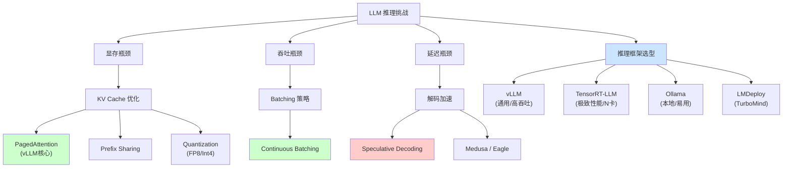

# Week 6 讲义：推理优化与框架生态

> **核心目标**：理解推理优化技术栈，掌握 PagedAttention 原理，能根据场景选择合适的推理框架。
>
> **学习时间**：5 小时
>
> **关键输出**：框架选择指南 + 推测解码实践指南
>
> **前置要求**：已完成 Phase 0 的学习；KV Cache 将在本讲 Part 1 中从工程视角深度展开。

---

## 📖 本周知识图谱



---

## 🧭 Part 0: 引言——推理为何成为瓶颈？

我们在 Phase 0 中了解到，LLM 的生成过程是 **自回归（Auto-regressive）** 的：生成第 N 个 token 必须等待第 N-1 个 token 完成。

这种串行特性带来了两个核心挑战：

1.  **Memory Bound（显存受限）**：
    *   模型权重本身很大（7B FP16 ≈ 14GB）。
    *   **KV Cache** 随着序列长度线性增长，且必须常驻显存（显存布局与带宽代价详见 **Part 1**）。
    *   *例子*：在并发高时，显存往往先于计算单元（Tensor Core）耗尽，导致无法处理更多请求。

> [!TIP]
> **思考题**：既然显存这么重要，为什么 GPU 厂商不直接把显存加到 1TB？这背后涉及到物理封装、带宽平衡和商业版图等多重因素。（详见文末[**附录：显存墙与 HBM 之困**](#附录显存墙与-hbm-之困)）

2.  **低 GPU 利用率**：
    *   GPU 的强大算力经常在"等待数据从显存搬运到计算单元"的过程中被浪费。
    *   但这并不是推理全程都如此——推理其实包含两个**截然不同**的阶段。

**推理优化的核心目标**：在有限的显存中塞入更多的并发请求（提高吞吐），并尽可能减少显存搬运（降低延迟）。

> **🔑 关键过渡**：要理解推理优化，首先必须认识到 LLM 推理**不是一个均质过程**。接下来的 Part 0.5 将详细拆解推理的**两阶段模型**，这是理解后续所有优化技术的**元认知框架**。

---

## 🧩 Part 0.5: 推理的两阶段模型 - Prefill vs Decode 与 PD 分离

在深入后续优化之前，我们需要建立一个**元认知框架**：LLM 推理不是一个均质过程，而是**两个截然不同的阶段**。

### 0.5.1 Prefill 阶段 (首次填充)

*   **输入**：用户输入的完整 Prompt（例如 500 个 token）。
*   **操作**：模型**一次性并行处理**所有 Prompt Token，计算它们的 Key 和 Value，并生成第一个输出 token。
*   **计算特性**：
    *   **GEMM (矩阵-矩阵乘法)**：权重矩阵与包含 500 个 token 的输入矩阵相乘。
    *   **Compute-Bound (计算受限)**：GPU 算力被充分利用，利用率可达 50%+。
    *   **耗时**：与 Prompt 长度成正比，但只执行一次。

### 0.5.2 Decode 阶段 (逐步生成)

*   **输入**：上一步生成的 1 个 token。
*   **操作**：模型基于 **KV Cache** 和**新 token**，**串行生成**下一个 token。这个过程不断重复，直到生成结束符 `<EOS>` 或达到最大长度。
*   **计算特性**：
    *   **GEMV (矩阵-向量乘法)**：权重矩阵与只有 1 个 token 的向量相乘。
    *   **Memory-Bound (访存受限)**：每一步都要把整个模型权重从显存搬到计算单元，但只做极少量的乘法。GPU 利用率通常 < 10%。
    *   **耗时**：每一步都很快，但步数等于输出长度，累积耗时可能很长。

#### 💡 深度对标：为什么 Decode 比 Prefill 更"亏"？

| 维度           | Prefill / 训练 (GEMM)                        | Decode (GEMV)                                  |
| :------------- | :------------------------------------------- | :--------------------------------------------- |
| **基本算子**   | **GEMM** (Matrix-Matrix)                     | **GEMV** (Matrix-Vector)                       |
| **数据复用**   | **高**。1 个权重矩阵与 N 个 token 同时相乘。 | **极低**。1 个权重矩阵只与 1 个新 token 相乘。 |
| **瓶颈类型**   | **Compute Bound** (计算受限)                 | **Memory Bound** (访存受限)                    |
| **算术强度**   | $O(N)$。计算量增长快于访存量。               | $O(1)$。每一比特数据搬运只对应极少计算。       |
| **GPU 利用率** | 通常 > 50% (忙着算)                          | 通常 < 10% (忙着等数据搬运)                    |

> **什么是算术强度 (Arithmetic Intensity)？**
> 简单来说就是 `计算量 / 访存量`。在 Decode 阶段，由于每一步都要把 10GB+ 的模型权重从显存搬入核心计算，却只为了服务 1 个 token，这导致 GPU 虽然算力惊人，但因为"运不进来"而处于严重的饥饿状态。
>
> **逻辑导向**：正因为单请求的 Decode 效率极低，推理框架才必须通过 **Batching**（把多个 GEMV 强行拼回一个 GEMM）来救回效率。

### 0.5.3 为什么需要 PD 分离思维？

| 维度 | Prefill | Decode |
| :--- | :--- | :--- |
| **瓶颈** | 计算 (Compute) | 访存 (Memory Bandwidth) |
| **GPU 利用率** | 高 (50%+) | 低 (<10%) |
| **对硬件的诉求** | 高算力 (TFLOPS) | 高带宽 (GB/s) |
| **延迟特性** | 一次性开销 (TTFT) | 累积开销 (TPS) |

> [!IMPORTANT]
> **核心洞察**：Prefill 和 Decode 对资源的诉求是**正交的**。
> *   如果把它们混在一起跑（逻辑上共用计算资源），两者会互相干扰：长 Prefill 会阻塞 Decode（增加 inter-token latency），而大量 Decode 请求会占满显存导致新 Prefill 无法启动。
> *   **PD 分离**思想就是：在调度层面甚至硬件层面，把这两个阶段拆开处理。

### 0.5.4 PD 分离的工业落地形态

PD 分离的落地是一个**光谱 (Spectrum)**，从"软"到"硬"：

1.  **无分离 (Naive)**：Prefill 和 Decode 完全混合调度。这是早期 HuggingFace Transformers 的默认行为，效率最低。

2.  **软分离 (Chunked Prefill)**：
    *   将长 Prompt 的 Prefill 切成小块（Chunk），与正在进行的 Decode 请求**交替执行**。
    *   **目的**：稳定 inter-token latency，避免长 Prefill 阻塞短 Decode。
    *   **代表**：vLLM V1 默认启用，SGLang。
    *   **状态**：**事实标准 (De facto standard)**，几乎所有现代推理框架都已采用。

3.  **硬分离 (Disaggregated Serving)**：
    *   Prefill 和 Decode 运行在**物理上分离的 GPU 集群**。
    *   Prefill 集群用高算力卡（如 H100 SXM），Decode 集群用高带宽卡或更多 GPU 分摊显存压力。
    *   KV Cache 通过高速网络（如 NVLink/InfiniBand）从 Prefill 集群传输到 Decode 集群。
    *   **代表**：字节跳动 Mooncake, 阿里 PAI-Blade, Microsoft Splitwise (论文), PKU DistServe (论文)。
    *   **状态**：**新兴趋势**，主要被超大规模 API 服务商采用。

> [!TIP]
> **面试加分点**：当被问及"如何优化 LLM 推理"时，先从 PD 分离的视角切入，说明 Prefill 和 Decode 的瓶颈不同，再分别介绍针对性的优化策略（Prefill: Flash Attention, Chunking; Decode: PagedAttention, Batching, Speculative Decoding），会显得非常系统。

---

## 🔧 Part 1: KV Cache 工程深度解析

> [!NOTE]
> **本节定位**：Phase 0 已从算法视角介绍了 KV Cache 的核心思想（缓存历史 K/V、避免重复计算）。本节从**工程视角**深入：先用三情景对比彻底讲清推理时的前向计算过程（1.1），再依次讲解物理布局（1.2）、带宽代价（1.3）、并发制约（1.4）以及架构层面的 KV Cache 压缩（1.5）。理解这些是读懂 PagedAttention 和后续推理优化的基础。
>
> **PD 定位**：KV Cache 贯穿 Prefill 和 Decode 两个阶段。
> *   **Prefill 阶段**：一次性生成所有 Prompt Token 的 K/V，写入缓存。
> *   **Decode 阶段**：每生成一个新 Token，就往 KV Cache 追加一行——显存问题主要体现在此阶段。

### 1.1 推理前向计算全景：Prefill、Decode 与 KV Cache

> 这一节用"三情景对比"的方式，从前向计算的角度彻底讲清 KV Cache 做了什么。符号约定：$N$ = Prompt 长度，$t$ = 已生成的 token 数，$d$ = hidden dimension（单头表示，多头只是把 $d$ 拆为 $H \times d_\text{head}$，不影响逻辑）。

#### A. Prefill 阶段（有无 KV Cache，计算完全一致）

Prefill 将完整 Prompt 一次性并行送入模型。

**输入**：$X \in \mathbb{R}^{N \times d}$（$N$ 个 token 的 embedding 堆成矩阵）

**Q、K、V 的形态**：

$$Q = X W_Q \in \mathbb{R}^{N \times d}, \quad K = X W_K \in \mathbb{R}^{N \times d}, \quad V = X W_V \in \mathbb{R}^{N \times d}$$

三者均为**矩阵**，行数 = Prompt 长度 $N$。

**Attention 计算**（带 Causal Mask，位置 $i$ 只能看到 $j \leq i$ 的 token）：

$$\text{Output} = \text{softmax}\!\left(\frac{QK^\top}{\sqrt{d}}\right) V \in \mathbb{R}^{N \times d}$$

$QK^\top \in \mathbb{R}^{N \times N}$，这是一次 **GEMM（矩阵-矩阵乘法）**，$N$ 个位置同时并行计算，GPU 利用率高。

**KV Cache 的介入点**：Prefill 结束后，将本次计算的 $K$、$V$ 存入缓存：

$$K_\text{cache} \leftarrow K \in \mathbb{R}^{N \times d}, \quad V_\text{cache} \leftarrow V \in \mathbb{R}^{N \times d}$$

> Prefill 阶段的计算本身**有无 KV Cache 完全相同**；区别只是结束时是否将 K/V 保存下来，供后续 Decode 复用。

---

#### B. Decode 阶段，无 KV Cache（朴素方案，不可用）

Decode 第 $t$ 步，目标是生成第 $t+1$ 个输出 token。若没有 KV Cache，必须把**完整上下文**（Prompt + 已生成的 $t$ 个 token）全部重新送入：

**输入**：$X_\text{all} \in \mathbb{R}^{(N+t) \times d}$（完整序列，每步都重建）

**Q、K、V 的形态**：

$$Q = X_\text{all} W_Q \in \mathbb{R}^{(N+t) \times d}, \quad K = X_\text{all} W_K \in \mathbb{R}^{(N+t) \times d}, \quad V = X_\text{all} W_V \in \mathbb{R}^{(N+t) \times d}$$

三者仍为矩阵，但尺寸随 $t$ **不断增长**，且 K/V 每步都从零重算（包括 Prompt 部分）。

**Attention 计算**：

$$\text{Output} = \text{softmax}\!\left(\frac{QK^\top}{\sqrt{d}}\right) V \in \mathbb{R}^{(N+t) \times d}$$

输出是一个 $(N+t) \times d$ 的矩阵，每一行对应一个 token 位置的上下文表示。由于 Causal Mask，第 $i$ 行只能 attend 到位置 $j \leq i$，因此第 $i$ 行代表"看完前 $i$ 个 token 后的状态"，其作用是**预测第 $i+1$ 个 token**。在 Decode 的第 $t$ 步，我们的目标是预测第 $N+t+1$ 个 token，所以只需要最后一行：

$$\hat{y}_{N+t+1} = \text{LM\_Head}\!\left(\text{Output}[-1, :]\right)$$

**致命浪费**：前 $N+t-1$ 行对应的是历史位置——这些位置在之前的步骤里已经算过并使用了，现在重算一遍纯属浪费。单步计算量 $O\!\left((N+t)^2 d\right)$，随序列**平方增长**。

---

#### C. Decode 阶段，有 KV Cache（实际方案）

同样是 Decode 第 $t$ 步，此时 $K_\text{cache}$ 和 $V_\text{cache}$ 已缓存了前 $N+t-1$ 步的历史。

**输入**：$x_\text{new} \in \mathbb{R}^{1 \times d}$（**仅输入最新 1 个 token**）

**Q、K、V 的形态**：

$$q = x_\text{new} W_Q \in \mathbb{R}^{1 \times d} \quad \textbf{（向量，只有 1 行）}$$
$$k_\text{new} = x_\text{new} W_K \in \mathbb{R}^{1 \times d}, \quad v_\text{new} = x_\text{new} W_V \in \mathbb{R}^{1 \times d}$$

**将新 K/V 追加到缓存**：

$$K_\text{cache} \leftarrow \begin{bmatrix} K_\text{cache} \\ k_\text{new} \end{bmatrix} \in \mathbb{R}^{(N+t) \times d}, \quad V_\text{cache} \leftarrow \begin{bmatrix} V_\text{cache} \\ v_\text{new} \end{bmatrix} \in \mathbb{R}^{(N+t) \times d}$$

**Attention 计算**（$q$ 向量 attend 整个 KV Cache）：

$$\text{output} = \text{softmax}\!\left(\frac{q\, K_\text{cache}^\top}{\sqrt{d}}\right) V_\text{cache} \in \mathbb{R}^{1 \times d}$$

$q\, K_\text{cache}^\top \in \mathbb{R}^{1 \times (N+t)}$，这是一次 **GEMV（矩阵-向量乘法）**，只产生 1 行输出，直接用于预测下一个 token。

---

#### 三情景对比汇总

| 情景 | Q 形态 | K 来源 | V 来源 | Attention 算子 | 单步计算量 |
| :--- | :--- | :--- | :--- | :--- | :--- |
| **Prefill**（有/无缓存一致） | $N \times d$ 矩阵 | 新算，$N \times d$ | 新算，$N \times d$ | GEMM | $O(N^2 d)$ |
| **Decode，无 KV Cache** | $(N+t) \times d$ 矩阵 | **全部重算**，$(N+t) \times d$ | **全部重算**，$(N+t) \times d$ | GEMM（浪费） | $O\!\left((N+t)^2 d\right)$ |
| **Decode，有 KV Cache** | $1 \times d$ **向量** | 历史读缓存 + 新算 1 行 | 历史读缓存 + 新算 1 行 | GEMV | $O\!\left((N+t) d\right)$ |

三条核心结论：

1. **Q 的降维**：KV Cache 把 Decode 的 Q 从"$(N+t)$ 行矩阵"压缩为"1 行向量"，Attention 从 GEMM 降为 GEMV。
2. **K/V 的来源变化**：无 KV Cache 时每步对全部历史 token 重算 K/V；有缓存时历史部分直接读取，只为新 token 做 1 次投影运算。
3. **计算量从平方降为线性**：Decode 从 $O((N+t)^2)$ 降至 $O(N+t)$，这是长序列推理得以实用的根本原因。

> **注意**：即使有 KV Cache，Decode 仍然是 Memory-Bound——每一步都要把整个 KV Cache 从显存搬到计算单元（详见 1.3）。KV Cache 消灭了重复**算**的浪费，但没有消灭读取历史 K/V 这份**搬运**开销。

---

#### 具体例子：Prompt "今天｜天气｜好"，生成"啊！"

设 $N=3$（Prompt 3 个 token），模型 1 层 1 头，$d=4$（仅为示意）。

**Step 0 — Prefill**

$$X = \begin{bmatrix} e_\text{今天} \\ e_\text{天气} \\ e_\text{好} \end{bmatrix} \in \mathbb{R}^{3 \times 4}, \quad Q, K, V \in \mathbb{R}^{3 \times 4}$$

Attention 矩阵（Causal Mask 后，$-\infty$ 位置经 softmax 归零）：

$$QK^\top \in \mathbb{R}^{3 \times 3} \to \begin{bmatrix} a_{11} & -\infty & -\infty \\ a_{21} & a_{22} & -\infty \\ a_{31} & a_{32} & a_{33} \end{bmatrix} \xrightarrow{\text{softmax 逐行}} \begin{bmatrix} 1 & 0 & 0 \\ \cdot & \cdot & 0 \\ \cdot & \cdot & \cdot \end{bmatrix}$$

最后一行 $\to$ 预测第一个输出 token = "**啊**"。

保存：$K_\text{cache}, V_\text{cache} \in \mathbb{R}^{3 \times 4}$

---

**Step 1 — Decode，输入"啊"**

$$x_\text{new} = e_\text{啊} \in \mathbb{R}^{1 \times 4}$$

$$q = e_\text{啊} W_Q \in \mathbb{R}^{1 \times 4} \text{（向量）}, \quad k_\text{new}, v_\text{new} \in \mathbb{R}^{1 \times 4}$$

追加后：$K_\text{cache}, V_\text{cache} \in \mathbb{R}^{4 \times 4}$

$$q \cdot K_\text{cache}^\top \in \mathbb{R}^{1 \times 4} \xrightarrow{\text{softmax}} \alpha \xrightarrow{\times V_\text{cache}} \text{output} \in \mathbb{R}^{1 \times 4} \to \text{预测 "！"}$$

---

**Step 2 — Decode，输入"！"**

$$q = e_\text{！} W_Q \in \mathbb{R}^{1 \times 4}$$

追加后：$K_\text{cache}, V_\text{cache} \in \mathbb{R}^{5 \times 4}$

$$q \cdot K_\text{cache}^\top \in \mathbb{R}^{1 \times 5} \to \text{预测} \texttt{<EOS>} \to \text{生成结束}$$

---

**若无 KV Cache，Step 2 的对比**：

$$X_\text{all} = \begin{bmatrix} e_\text{今天} \\ e_\text{天气} \\ e_\text{好} \\ e_\text{啊} \\ e_\text{！} \end{bmatrix} \in \mathbb{R}^{5 \times 4}, \quad Q, K, V \in \mathbb{R}^{5 \times 4}, \quad QK^\top \in \mathbb{R}^{5 \times 5}$$

只用最后 1 行结果，前 4 行计算全部浪费。

---

### 1.2 KV Cache 的物理布局

在 Transformer 的每一个注意力层中，输入向量通过线性投影得到 K 和 V：

$$K = X W_K \in \mathbb{R}^{s \times d_\text{model}}, \quad V = X W_V \in \mathbb{R}^{s \times d_\text{model}}$$

在 Multi-Head Attention（MHA）中，$K$ 和 $V$ 会被拆分成 $H$ 个头，每头维度 $d_\text{head} = d_\text{model} / H$。

**关键约束**：每一层的注意力计算都是独立的，使用的是**本层自己的** $W_K$、$W_V$ 投影矩阵。因此，KV Cache **无法跨层共享**，每一层都需要独立缓存自己的 K 和 V。

**单请求的 KV Cache 布局（MHA）**：

```
第 l 层（共 L 层）:
  K_cache[l]: shape [s, H, d_head]    ← 每生成 1 个新 token，追加 1 行
  V_cache[l]: shape [s, H, d_head]

全部 L 层合计: 2 × L 个张量，每个 shape 为 [s, H, d_head]
```

**精确的显存占用公式（单请求）**：

$$\text{KV\_Size} = 2 \times L \times s \times H \times d_\text{head} \times \text{bytes} = 2 \times L \times s \times d_\text{model} \times \text{bytes}$$

以 LLaMA-3-8B 为例（$L=32$，$d_\text{model}=4096$，FP16，bytes = 2）：

| 序列长度 | 单请求 KV Cache |
| :--- | :--- |
| 1k tokens | $2 \times 32 \times 1024 \times 4096 \times 2 \approx$ **0.5 GB** |
| 4k tokens | ≈ **2 GB** |
| 32k tokens | ≈ **16 GB** |
| 128k tokens | ≈ **64 GB** |

> **两个关键特性**：
> *   **Append-Only**：每生成 1 个 token，所有 L 层同时各追加 1 行 K 和 1 行 V，总追加量为 $2 \times L \times d_\text{model} \times \text{bytes}$。对 LLaMA-3-8B 而言，每个 token 额外占 512 KB 显存。
> *   **全程驻留**：一个请求的整个生命周期内，其 KV Cache 都必须锁在显存里——换出就要重算，代价极高。

### 1.3 带宽视角：每个 Token 的搬运代价

Phase 0 的分析集中在"KV Cache 有多大"，但工程上更关键的问题是：**生成每个新 token，实际要搬运多少数据？**

Decode 阶段第 $t$ 步（生成第 $t+1$ 个 token）的注意力计算：

1. 新 token 经投影得到 $q \in \mathbb{R}^{H \times d_\text{head}}$（仅 1 行）
2. 从显存读取 $K_\text{cache}[l]$（$t$ 行）和 $V_\text{cache}[l]$（$t$ 行）
3. 计算 $\text{softmax}\!\left(q\,K_\text{cache}^T / \sqrt{d_\text{head}}\right) V_\text{cache}$

步骤 2 在第 $l$ 层的带宽开销：$2 \times t \times H \times d_\text{head} \times \text{bytes}$

**对所有 L 层累加，生成 1 个 token 需从显存读取的 KV Cache 总量**：

$$\text{Bandwidth}_\text{KV} = 2 \times L \times t \times d_\text{model} \times \text{bytes}$$

这与当前序列长度为 $t$ 时 KV Cache 的总大小完全相同——也就是说，**每生成一个 token，就要把整个 KV Cache 搬运一遍**。

**Decode 阶段的两类带宽开销**（以 LLaMA-3-8B / A100 为例）：

| 开销来源 | 数据量（序列长 1k tokens） | 数据量（序列长 32k tokens） |
| :--- | :--- | :--- |
| 模型权重（每步固定） | ~14 GB | ~14 GB |
| KV Cache（随序列线性增长） | ~0.5 GB | **~16 GB** |
| **合计** | ~14.5 GB | **~30 GB** |

> **核心洞察**：在短序列时，模型权重是带宽瓶颈；但在长序列（≥ 32k tokens）时，KV Cache 的搬运量可与模型权重持平甚至反超，成为**更大的带宽瓶颈**。这正是为什么长上下文推理比短上下文推理慢得多——并不只是因为上下文 Attention 计算量增加，还有这部分带宽压力。

### 1.4 KV Cache 与并发的张力

KV Cache 不只影响单个请求的延迟，更直接决定了系统能同时服务多少请求。

**显存分配等式**：

$$\underbrace{\text{GPU 总显存}}_{\text{固定}} = \underbrace{\text{模型权重}}_{\text{固定，所有请求共享}} + \underbrace{B \times \text{KV\_Size}(s_\text{max})}_{\text{随并发线性增长}}$$

其中 $B$ 为 Batch Size，$s_\text{max}$ 为预分配的最大序列长度。

**并发上限**：

$$B_\text{max} = \frac{\text{GPU 总显存} - \text{权重显存}}{\text{KV\_Size}(s_\text{max})}$$

以 A100 80GB 部署 LLaMA-3-8B（权重 ≈ 16 GB，FP16）为例：

| 序列长度上限 | 单请求 KV Cache | 可用 KV 显存 | 最大并发 |
| :--- | :--- | :--- | :--- |
| 4k tokens | 2 GB | 64 GB | **~32 个请求** |
| 32k tokens | 16 GB | 64 GB | **~4 个请求** |
| 128k tokens | 64 GB | 64 GB | **不足 1 个请求** |

序列长度翻 8 倍，并发数缩减 8 倍——这正是长上下文推理的核心代价。

**早期框架的碎片化问题**：在 vLLM 出现之前，大多数框架（如 HuggingFace Transformers）采用**预分配**策略——请求进来时直接按 $s_\text{max}$ 申请一整块连续显存。

*   **问题**：
    1.  **内部碎片**：请求实际只生成了 100 个 token 就结束，剩余 1948 个位置的显存白占。
    2.  **外部碎片**：不同请求长度不一，已释放的短序列空间无法被长序列复用。
    3.  **无法共享**：Beam Search 或并行采样时，相同的 Prompt KV Cache 被重复存储多份。

*   **结果**：显存利用率通常 < 40%，实际可服务的并发数远低于理论上限。

> **这就是 Part 2 PagedAttention 要解决的核心问题**：在不改变 KV Cache 逻辑语义的前提下，重新设计其物理存储方式，将利用率从 < 40% 提升至 > 90%。

### 1.5 架构演进对 KV Cache 的影响

Week 2 已从算法角度深讲了 GQA / MQA / MLA，这里从**显存占用**角度重新对齐。

KV Cache 的压缩本质是减少缓存的 KV 头数量或压缩每条 KV 记录的维度：

| 架构 | 缓存的 KV 头数 | 单请求 KV Cache（相对 MHA） | 代表模型 |
| :--- | :--- | :--- | :--- |
| **MHA** | $H$ 个头 | $1\times$（基准） | GPT-2, LLaMA-1 |
| **GQA** | $G$ 个头（$G \ll H$） | $G/H \times$（H=32, G=8 → **1/4×**） | LLaMA-2/3, Qwen2, Mistral |
| **MQA** | 1 个头 | $1/H \times$（H=32 → **1/32×**） | PaLM, Falcon |
| **MLA** | 低秩压缩向量 | 约 $d_c / d_\text{model} \times$（**< 1/10×**） | DeepSeek-V2/V3 |

> **MLA 的特殊性**（将在 Week 12 详解）：MLA 并非减少头数，而是将 K/V 压缩为一个低秩 latent 向量（维度 $d_c \ll H \times d_\text{head}$）存入缓存，推理时再通过矩阵乘法解压出完整 K/V。DeepSeek-V2 的实测压缩率约 **93.3%**——在相同显存下，上下文长度或并发数可提升约 14 倍。
>
> **工程选型启示**：部署时优先选择 GQA 模型（Qwen2.5、LLaMA-3、Mistral）而非 MHA 模型，KV Cache 直接省去 3/4，对长序列并发的提升立竿见影。

---

## 💡 Part 2: PagedAttention 原理详解

vLLM 的核心贡献在于将操作系统的 **虚拟内存（Virtual Memory）** 思想引入了 LLM 推理。

> [!NOTE]
> **PD 定位**：PagedAttention 主要是一个 **Decode 阶段**的显存管理优化。
> *   它解决的是：每生成一个 Token，KV Cache 就要追加一行，如何避免显存碎片化？
> *   **但 Prefill 阶段也受益**：通过 Prefix Sharing，多个请求可以共享相同的 Prompt KV Cache。

### 2.1 核心思想：虚拟内存与分页

在操作系统中，我们在逻辑上认为内存是连续的，但在物理上，内存被切分为一个个离散的 **Page（页）**。

**PagedAttention** 做了同样的事：
*   **逻辑 KV Cache**：对模型来说，KV Cache 依然是连续的张量。
*   **物理 KV Cache**：在显存中被切分为一个个固定大小的 **Block**（例如每个 Block 存 16 个 token）。

> [!NOTE]
> **本质定性：空间优化并非算子优化**
> PagedAttention **完全不改变** Attention 的数学计算公式 $Attention(Q,K,V)$。
> *   它改变的是**寻址方式**（Address Mapping）：从"直接读下标"变成了"查 Block Table -> 读下标"。
> *   它优化的是**显存利用率**（不再有碎片），从而允许更大的 Batch Size，间接提升了吞吐量，但并没有加速单次 Attention 的乘法计算。

### 2.2 Block 分配机制

1.  **按需分配**：当一个新的 token 生成时，如果当前 Block 还有空位，就填入；如果满了，才向 Block Manager 申请一个新的物理 Block。
2.  **非连续存储**：逻辑上相邻的 token，其所在的物理 Block 可以散落在显存的任意位置。
3.  **Block Table**：类似于操作系统的页表（Page Table），维护逻辑 Block 到物理 Block 的映射关系。

**优势**：
*   **零由于预分配导致的浪费**：几乎消除了内部碎片（每个序列最多浪费最后一个 Block 的一部分）。
*   **零外部碎片**：任何物理 Block 都可以被分配给任何请求。

### 2.3 Prefix Sharing (前缀共享)

这可能是 PagedAttention 最强大的特性之一。

**场景**：
*   **Few-shot Learning**：所有请求都有很长的 system prompt 和示例。
*   **Parallel Sampling**：同一个问题，要求生成 5 个不同的回答。
*   **Beam Search**。

**机制**：
*   多个序列的 Block Table 可以指向同一个物理 Block（即 Prompt 部分）。
*   **Copy-on-Write**：当某个序列需要修改共享数据（这在 KV Cache 中不会发生，因为是 append-only）或分叉生成不同内容时，新的 token 写入新的非共享 Block。引用计数机制管理 Block 的生命周期。

**收益**：
*   显存占用大幅降低（对于长 Prompt 场景可降低 50%+）。
*   计算量减少（Prompt 部分的 Attention 只需要计算一次）。

---

#### 💡 核心比喻： "图书架" vs. "活页夹"

为了更好地理解它的变革性，我们可以使用 **Week 2 提到的经典比喻**：

*   **标准方式 (图书架)**：
    你给每个作者（请求）分配了一个固定的长书架（连续显存）。哪怕作者目前只写了一句介绍，你也得把之后放 500 本书的空间都腾出来占着。别人想写书没地方放，你这儿却空荡荡。这也是**预分配**策略导致 Batch Size 上不去的原因。

*   **PagedAttention (活页夹)**：
    你只给作者发一叠**活页纸**。写满一张（Block），你再从仓库里随手拿一张新的补上。这些纸不需要挨在一起放，只要你有一张**目录页**（Block Table）记清楚哪页属于哪个作者就行。结果是：仓库里的纸几乎被 100% 利用，谁也不浪费。

#### 🏆 总结：Attention 优化的双雄

| 优化技术 | 优化阶段 | 计算逻辑是否改变？ | 核心手段 | 解决什么瓶颈？ |
| :--- | :--- | :--- | :--- | :--- |
| **Flash Attention** | 训练 / Prefill | **是** (Tiling + Recomp) | **算子融合**，在 SRAM 内算完，不写回 HBM | **IO 瓶颈** (Memory Bound) |
| **PagedAttention** | 推理 / Decode | **否** (原样计算) | **虚拟内存**，非连续存储，按需分配 | **显存容量/碎片** (Capacity Bound) |

> **一句话总结**：Flash Attention让你算得快（不存草稿），PagedAttention让你装得多（不留空隙）。两者缺一不可。

---

## ⚙️ Part 3: 推理框架生态

目前市面上的推理框架百花齐放，我们重点关注三个代表性框架。

### 3.1 vLLM (高适应性/服务端首选)
*   **核心技术**：PagedAttention + Continuous Batching。
*   **特点**：
    *   **吞吐量极高**：得益于高效的显存管理。
    *   **易用性**：Python 优先，接口类似 HuggingFace，兼容 OpenAI API。
    *   **生态好**：新模型支持速度极快（通常 24h 内支持）。
    *   **支持广泛**：FP16/BF16, GPTQ, AWQ, SGLang, LoRA adapter。
*   **适用场景**：构建高并发的 LLM API 服务，大多数生产环境的默认选择。

> **👨‍💻 Quick Start (vLLM)**
> ```bash
> # 方式 1: 启动 OpenAI 兼容服务器
> python -m vllm.entrypoints.openai.api_server --model Qwen/Qwen2.5-7B-Instruct --port 8000
> ```
> ```python
> # 方式 2: Python 脚本调用
> from vllm import LLM, SamplingParams
> llm = LLM(model="Qwen/Qwen2.5-7B-Instruct")
> output = llm.generate("Hello, who are you?", SamplingParams(temperature=0.7))
> ```

### 3.2 TensorRT-LLM (极致性能/NVIDIA原厂)
*   **核心技术**：Graph Rewriting, Kernel Tuning, TensorRT 编译器。
*   **特点**：
    *   **性能怪兽**：通常比 vLLM 快 20-50%，特别是在 FP8 和 H100 上。
    *   **编译型**：需要先将模型编译成 Engine 文件（耗时），部署灵活性稍差。
    *   **C++ 核心**：底层是 C++，上层 Python wrapper，修改底层逻辑门槛较高。
*   **适用场景**：对延迟和吞吐有极致要求的生产环境，且硬件固定（如全 H800 集群）。

> **👨‍💻 Quick Start (TRT-LLM)**
> *   *Step 1: 编译 (Build Engine)*
>     ```bash
>     trtllm-build --checkpoint ./qwen_ckpt --output_dir ./qwen_engine --gemm_plugin float16
>     ```
> *   *Step 2: 运行 (Run)*
>     ```python
>     import tensorrt_llm
>     runner = tensorrt_llm.Runner.from_checkpoint("./qwen_engine")
>     runner.generate("Hello world")
>     ```

### 3.3 Ollama (本地部署/开发者友好)
*   **核心技术**：基于 llama.cpp (GGUF 格式)。
*   **特点**：
    *   **CPU/Mac 友好**：深度优化 Apple Silicon 和普通 CPU 推理。
    *   **开箱即用**：`ollama run llama3` 一键启动。
    *   **量化优先**：核心是 GGUF 格式的 Int4 量化，适合消费级显卡。
*   **适用场景**：本地开发、个人电脑运行、MacBook 用户、边缘设备。

> **👨‍💻 Quick Start (Ollama)**
> ```bash
> # 1. 下载并运行模型 (自动处理 GGUF 下载)
> ollama run llama3
> 
> # 2. 调用 API
> curl http://localhost:11434/api/generate -d '{
>   "model": "llama3",
>   "prompt": "Why is the sky blue?"
> }'
> ```

### 3.4 LMDeploy (国产之光/TurboMind)
*   **核心技术**：TurboMind 推理引擎 (C++) + Persistent Batching。
*   **背景**：上海人工智能实验室 (InternLM 团队) 开发。
*   **特点**：
    *   **极致优化**：性能直逼 TensorRT-LLM，部分场景下甚至超越。
    *   **量化友好**：原生支持 AWQ / KV Cache Int8/Int4 量化。
    *   **Python 接口**：提供了类似 vLLM 的易用接口，也支持 Gradio 一键启动。
*   **适用场景**：国内生产环境，追求极致性能但又不想折腾 TensorRT 编译的场景。

> **👨‍💻 Quick Start (LMDeploy)**
> ```bash
> # 命令行聊天
> lmdeploy chat turbomind Qwen/Qwen2.5-7B-Instruct
> 
> # 启动 API Server (兼容 OpenAI)
> lmdeploy serve api_server Qwen/Qwen2.5-7B-Instruct --server-port 23333
> ```

### 3.5 框架对比与选型指南

| 特性           | vLLM                  | TensorRT-LLM          | Ollama (llama.cpp)      | LMDeploy           |
| :------------- | :-------------------- | :-------------------- | :---------------------- | :----------------- |
| **显存管理**   | PagedAttention (最优) | PagedAttention (类似) | 静态/动态               | TurboMind (高性能) |
| **吞吐量**     | ⭐⭐⭐⭐                  | ⭐⭐⭐⭐⭐                 | ⭐⭐                      | ⭐⭐⭐⭐⭐              |
| **易用性**     | ⭐⭐⭐⭐⭐                 | ⭐⭐⭐                   | ⭐⭐⭐⭐⭐                   | ⭐⭐⭐⭐               |
| **新模型支持** | 极快                  | 较快 (需 NVIDIA 适配) | 较快 (社区驱动)         | 快                 |
| **硬件支持**   | NVIDIA, AMD, TPU      | NVIDIA Only           | NVIDIA, AMD, Apple, CPU | NVIDIA             |
| **典型用途**   | **企业级 API 服务**   | **极致性能生产环境**  | **本地/边缘计算**       | **高性能服务**     |

> [!TIP]
> **选型建议**：
> *   **初学者/本地玩**：选 **Ollama**。
> *   **公司部署微调模型**：首选 **vLLM**（生态好，坑少，支持 LoRA）。
> *   **固定硬件的大规模服务**：考虑 **TensorRT-LLM** 或 **LMDeploy** 压榨性能。

---

## 🔄 Part 4: Batching 策略

为什么 vLLM 比传统 HF Transformers 快这么多？除了显存管理，**调度策略**也是关键。

> [!NOTE]
> **PD 定位**：Batching 策略的核心挑战是**如何调度 Prefill 和 Decode 混合请求**。
> *   **Prefill 请求**：计算量大，一次性占用大量算力。
> *   **Decode 请求**：计算量小，但需要持续执行直到生成结束。
>
> 如果不加区分地混合执行，**长 Prefill 会阻塞 Decode**，导致 inter-token latency 飙升。
> 这就是为什么现代框架引入了 **Chunked Prefill**（参见 Part 0.5）。

### 4.1 传统 Request-level Batching (Static Batching)

假设 Batch Size = 3，来了 3 个请求：
*   Req A: 输出 10 个 token
*   Req B: 输出 100 个 token
*   Req C: 输出 20 个 token

**过程**：
1.  所有请求同时开始。
2.  第 10 步：Req A 结束。但 GPU **不能停**，因为 Req B 还在跑。Req A 占用的槽位变空，无法释放，只能 padding 空转。
3.  第 20 步：Req C 结束。继续 padding。
4.  第 100 步：Req B 结束。整个 Batch 完成，返回结果。

**问题**：**短板效应**。整个 Batch 的延迟取决于最长的那个请求，短请求被严重拖累，GPU 计算资源大量浪费在 Padding 上。

### 4.2 Continuous Batching (Iteration-level Batching)

也叫 In-flight Batching。

**原理**：将调度粒度从"整个请求"细化到 **"每一次 Iteration (生成一步)"**。

这背后是一个思维方式的根本转变：**不再把 Batch 看作"一组固定的请求"，而看作"一组当前需要计算的 Slot"**。

*   **Static Batching (传统方式)**：
    可以理解为 **"封闭式过山车"**。车上坐满了人（Batch），有人（短请求）中途想下车不行，必须陪着所有人坐完全程。在这个过程中，车门是锁死的，外面排队的人进不来。

*   **Continuous Batching (现代方式)**：
    可以理解为 **"商场旋转门"**。
    *   **调度器 (Scheduler)** 在每一次生成新的 token 后（即每一个 Step），都会暂停下来看一眼。
    *   如果发现 Request A 已经生成了结束符 `<EOS>`，它就立刻把 A 踢出去。
    *   空出来的资源（显存 Block），立刻塞进来一个新的 Request D 的首个 token（Prefill 阶段）。
    *   **下一轮计算时**，Batch 里就变成了 `[Req B(step 5), Req C(step 20), Req D(step 1)]`。虽然大家的进度不同，但都在同一辆车上跑这一个 Step。

> **👨‍💻 代码视角：为什么能插队？**
>
> **Static Batching (开发者写死的 Loop)**
> ```python
> # 这是一个黑盒函数，一旦进去必须等 batch 里所有人生成完才能出来
> # 就像过山车使用了安全锁，中途无法上下人
> outputs = model.generate(batch_inputs) 
> ```
>
> **Continuous Batching (调度器控制的 Loop)**
> ```python
> # 拆解为 "While True" 循环
> while has_requests():
>     # 1. 调度器介入：谁跑完了踢走，谁在排队补位
>     # current_batch 是动态拼凑的，可能包含 Req A(step 10) 和 Req B(step 1)
>     current_batch_inputs = scheduler.schedule() 
>     
>     # 2. 只跑 "一步" (One Step Forward)
>     # 这是一个极快的原子操作
>     logits = model.forward_one_step(current_batch_inputs)
>     
>     # 3. 更新状态，回到第一步
>     # 这里就像旋转门的空隙，每一圈转回来都有机会进出
>     scheduler.update_status(logits)
> ```

**过程**：
1.  Batch 中包含 Req A, B, C。执行一步生成。
2.  第 10 步：Req A 结束。调度器立刻检测到，**马上插入一个新的 Req D** 填补 A 的空位。
3.  第 20 步：Req C 结束。立马插入 Req E。
4.  ...

**优势**：
*   **GPU 永远不空转**：始终保持满负载运行。
*   **延迟解耦**：短请求做完即走，不需要等长请求。
*   **吞吐量大幅提升**：在大并发混杂长短请求的真实场景下，吞吐量可提升 10-20 倍。

> [!NOTE] Continuous Batching的安全性与隔离机制 (Security & Isolation)

很多同学会有疑问：**新请求 D 填补了 A 的位置，会不会"看到" A 的残留信息？**

答案是**绝对不会**。vLLM 通过双重机制保证了严格的请求隔离：

1.  **物理隔离 (Physical Isolation - PagedAttention)**
    *   **不同 Block**：Req A 的 KV Cache 存储在 `[Block 1, Block 2]`。当 A 结束时，这些 Block 被释放回 Free List。
    *   **重新映射**：Req D 虽然占据了 Scheduler 中的逻辑空位，但它会申请**全新的**物理 Block（例如 `Block 8`）。
    *   **独立寻址**：D 的 Block Table 只包含 `[Block 8]`。它根本不知道 `Block 1` 和 `Block 2` 的存在，物理上无法访问旧数据。

2.  **逻辑遮蔽 (Logical Isolation - Attention Mask)**
    *   在计算 Self-Attention 时，我们会构建一个巨大的 Mask 矩阵。
    *   对于 Req D 的计算位，Mask 会将所有**不属于 D** 的位置（包括 A 的残留痕迹、B 和 C 的数据）全部置为 $-\infty$。
    *   经过 Softmax 后，这些位置的权重归零。这意味着从数学上，D 就像在一个真空环境中独自生成，完全不受干扰。

> **💡 餐厅比喻升级版**
> *   **Continuous Batching**：拼桌吃饭。桌子（显存/计算资源）利用率很高。
> *   **物理隔离**：服务员（Block Manager）不仅收走了上一桌的碗筷，甚至**换了一张全新的桌布**（分配新 Block）。你根本碰不到上一桌的油渍。
> *   **逻辑遮蔽**：虽然你和陌生人（其他请求）在一张大桌子（Batch）上，但你们之间竖起了**隔音防视挡板**（Attention Mask）。你看不见也听不见他们在吃什么聊什么。

---

## 🚀 Part 5: Speculative Decoding (推测解码)

> [!NOTE]
> **PD 定位**：Speculative Decoding 是一个纯 **Decode 阶段**的加速技术。
> *   **原理**：Decode 阶段是 Memory-Bound（访存受限），GPU 算力有富余。
> *   **利用富余算力**：用小模型快速"猜"下一批 Token，大模型并行验证，省去串行等待。

解决了显存和调度问题，如何让**单个请求**生成得更快（降低 Latency）？

### 5.1 核心思想：大模型验证，小模型干活

大模型（Target Model，如 70B）生成慢，小模型（Draft Model，如 7B 或专门的 Drafter）生成快。

**直觉**：很多 token 其实很简单（如 "The", "is", 代码中的分号），不需要 70B 模型动用全部脑力去想。

### 5.2 工作流程 (Draft-Verify)

1.  **Draft 阶段**：小模型快速串行生成 K 个 token（比如 K=5）。
    *   *耗时*：小，因为模型小。
2.  **Verify 阶段**：大模型**并行**验证这 K 个 token。
    *   大模型一次前向传播（Forward Pass）可以计算序列中每个位置的概率。
    *   *耗时*：和大模型生成 1 个 token 差不多。
3.  **Accept/Reject**：
    *   大模型对比小模型的预测。如果小模型猜对了前 3 个，第 4 个错了：
    *   保留前 3 个 token。
    *   修正第 4 个 token。
    *   丢弃后续的预测。

### 5.3 延迟-吞吐权衡

$$ \text{Speedup} = \frac{\text{耗时(大模型生成 K+1 个)}}{\text{耗时(小模型生成 K 个) + 耗时(大模型验证 K+1 个)}} \times \text{平均接受长度} $$

*   **适用场景**：
    *   **Bandwidth Bound**：大模型受限于显存带宽（读取权重慢），计算能力有富余。推测解码利用了这些富余的计算能力来验证。
    *   **简单输入**：输入越简单，小模型越容易猜对，加速比越高。
*   **限制**：
    *   需要加载两个模型，显存占用增加。
    *   如果接受率（Acceptance Rate）太低，反而会变慢（因为多了小模型的开销和回退开销）。

---

## 🔬 Part 6: 前沿发展与业界动态 (2024-2025)

推理优化是一个快速演进的领域。以下是截至 2025 年初的一些重要进展。

### 6.1 vLLM 演进：Chunked Prefill 与 V1 架构

vLLM 在 2024-2025 年间持续迭代，其 V1 版本引入了多项重要特性：

*   **Chunked Prefill**：将长 Prompt 的 Prefill 阶段切分成小块（Chunk），与 Decode 请求交替执行。
    *   **目的**：稳定 inter-token latency，避免长 Prefill 阻塞短请求。
    *   **状态**：vLLM V1 中默认启用。
*   **Automatic Prefix Caching (APC)**：基于 hash 的 KV Cache 管理，自动复用相同前缀。
*   **2025 路线图**：重点包括滑动窗口 Attention、原生 KV 量化、MoE 优化、多模态输入流式处理等。

> **参考**：vLLM 官方博客 - "[vLLM V1: A Major Upgrade to vLLM's Core Architecture](https://blog.vllm.ai/2025/01/27/v1-alpha-release.html)" (Jan 2025)

### 6.2 SGLang 与 RadixAttention

SGLang 是 UC Berkeley Lianmin Zheng 团队（与 vLLM 同源）推出的新一代推理框架：

*   **RadixAttention**：一种自动 KV Cache 复用技术，与 PagedAttention 互补。
    *   使用 Radix Tree（基数树）数据结构索引历史 KV Cache。
    *   支持运行时动态匹配前缀，无需预定义。
*   **特点**：在结构化输出（JSON、代码）和 RAG 场景下表现优异，适合需要复杂逻辑控制的应用。
*   **vLLM vs SGLang**：vLLM 适合高吞吐 API 服务；SGLang 适合需要精细控制的交互式/Agent 场景。

> **参考**：Zheng et al. 2024 - "[SGLang: Efficient Execution of Structured Language Model Programs](https://arxiv.org/abs/2312.07104)" (arXiv)

### 6.3 多头推测解码：Medusa 与 EAGLE

传统 Speculative Decoding 需要额外的 Draft Model。Medusa 和 EAGLE 提出了更高效的方案：

#### Medusa (2024)

*   **核心思想**：在 LLM 最后一层添加多个**并行解码头**，每个头预测未来不同位置的 token。
*   **优势**：无需独立的 Draft Model，只需微调新增的解码头。
*   **加速比**：2-3x（Medusa-2 可达 2.2x-3.6x）。
*   **Tree Attention**：使用树形结构组织候选 token，提高采样效率。

> **参考**：Cai et al. 2024 - "[Medusa: Simple LLM Inference Acceleration Framework with Multiple Decoding Heads](https://arxiv.org/abs/2401.10774)" (arXiv)

#### EAGLE (2024)

*   **核心思想**：在特征层面自回归预测，利用 Target Model 的 top-layer 特征训练轻量 Draft 模块。
*   **优势**：无需微调 Target LLM，加速更显著。
*   **加速比**：3x（比 Medusa 快 1.6x）。
*   **EAGLE-3**：结合低/中/高层语义特征，动态生成 Draft Tree。
*   **框架集成**：已集成到 vLLM 和 TensorRT-LLM；Amazon SageMaker 2025 年推出基于 EAGLE 的自适应推测解码。

> **参考**：Li et al. 2024 - "[EAGLE: Speculative Sampling Requires Rethinking Feature Uncertainty](https://arxiv.org/abs/2401.15077)" (arXiv)

### 6.4 DeepSeek 推理优化：MLA 与 FlashMLA

DeepSeek 在 2025 年开源周发布了 **FlashMLA**，这是针对其 Multi-head Latent Attention (MLA) 架构的高度优化推理内核：

*   **MLA 核心**：通过低秩矩阵压缩 KV Cache，将 KV 表示为压缩的 latent vectors。
    *   **收益**：KV Cache 可减少高达 93.3%。
*   **FlashMLA 特性**：
    *   专为 Hopper GPU (H100/H800) 优化。
    *   显存带宽可达 3000 GB/s。
    *   Paged KV Cache (Block Size = 64)。
    *   支持 BF16/FP16/FP8。
*   **vLLM 集成**：vLLM v0.7.1+ 支持 DeepSeek 的 MLA + FP8 优化，吞吐提升 3x，显存容量提升 10x。

> **参考**：DeepSeek GitHub - "[FlashMLA: Efficient MLA Decoding Kernel](https://github.com/deepseek-ai/FlashMLA)" (2025)
> **参考**：DeepSeek-V3 Technical Report (arXiv, 2024)

### 6.5 业界趋势总结

| 趋势              | 代表技术                             | 关键洞察                           |
| :---------------- | :----------------------------------- | :--------------------------------- |
| **KV Cache 压缩** | MLA, GQA, MQA                        | 从架构层面减少 KV 存储             |
| **智能调度**      | Chunked Prefill, Continuous Batching | 细粒度调度，平衡 Prefill 与 Decode |
| **前缀复用**      | PagedAttention, RadixAttention, APC  | 共享 Prompt，减少重复计算          |
| **并行推测**      | Medusa, EAGLE, Lookahead             | 多头/多层预测，减少串行步骤        |
| **硬件定制**      | FlashMLA, FlashAttention-3, FP8      | 针对 Hopper 等新硬件深度优化       |

---

## 📝 总结与实践启示

### 核心回顾

1.  **PagedAttention** 像操作系统管理内存一样管理 KV Cache，解决了显存碎片化问题，是现代推理引擎的基石。
2.  **Continuous Batching** 让调度粒度细化到 token 级别，解决了长短请求并存时的效率问题。
3.  **框架选型**：生产环境通常在 **vLLM**（通用）和 **TensorRT-LLM**（极致性能）之间选择。
4.  **Speculative Decoding** 是一种用"计算换带宽"的策略，适合降低单个请求的延迟。
5.  **前沿方向**：MLA/FlashMLA、Medusa/EAGLE、SGLang 等正在重塑推理优化的技术格局。

### 实践建议

*   **项目实战**：在 Phase 4 的实战中，如果不涉及极端的 QPS 压力，建议直接使用 **vLLM**。它对 HuggingFace 模型支持最好，且内置了 PagedAttention 和 Continuous Batching。
*   **显存规划**：始终记住 KV Cache 是显存大户。在部署前，使用 vLLM 的 `gpu_memory_utilization` 参数预留足够的显存给 KV Cache。
*   **关注 DeepSeek 生态**：如果使用 DeepSeek-V3/R1 模型，务必关注 FlashMLA 和 MLA 相关优化。

### 检查点

*   [ ] 理解 PagedAttention 如何解决 KV Cache 碎片化
*   [ ] 能根据场景选择合适的推理框架 (vLLM vs Ollama)
*   [ ] 理解 Speculative Decoding 的加速原理
*   [ ] 了解 Medusa/EAGLE 与传统推测解码的区别
*   [ ] 了解 DeepSeek MLA/FlashMLA 的核心优化思路

---

## 📚 参考文献

*   **vLLM**: Kwon et al. 2023 - "[Efficient Memory Management for Large Language Model Serving with PagedAttention](https://arxiv.org/abs/2309.06180)" (SOSP '23)
*   **Continuous Batching**: Yu et al. 2022 - "[Orca: A Distributed Serving System for Transformer-Based Generative Models](https://www.usenix.org/conference/osdi22/presentation/yu)" (OSDI '22)
*   **Speculative Decoding**: Leviathan et al. 2023 - "[Fast Inference from Transformers via Speculative Decoding](https://arxiv.org/abs/2211.17192)" (ICML '23)
*   **SGLang**: Zheng et al. 2024 - "[SGLang: Efficient Execution of Structured Language Model Programs](https://arxiv.org/abs/2312.07104)" (arXiv)
*   **Medusa**: Cai et al. 2024 - "[Medusa: Simple LLM Inference Acceleration Framework with Multiple Decoding Heads](https://arxiv.org/abs/2401.10774)" (ICML '24)
*   **EAGLE**: Li et al. 2024 - "[EAGLE: Speculative Sampling Requires Rethinking Feature Uncertainty](https://arxiv.org/abs/2401.15077)" (ICML '24)
*   **DeepSeek-V3**: DeepSeek-AI 2024 - "[DeepSeek-V3 Technical Report](https://arxiv.org/abs/2412.19437)" (arXiv)
*   **FlashMLA**: DeepSeek GitHub - "[FlashMLA Repository](https://github.com/deepseek-ai/FlashMLA)" (2025)

---

## 📚 附录：显存墙与 HBM 之困

针对"为什么 GPU 不直接配更多显存"这一问题的深度解析：

### 1. 速度之困：HBM 与带宽瓶颈
LLM 推理是典型的 **Memory Bound**（受限于带宽）。如果使用便宜但慢速的 DDR 内存，即便配 1TB，搬运权重的速度也跟不上计算速度，导致模型生成速度极慢。
*   **HBM (High Bandwidth Memory)**：为了实现 TB/s 级别的带宽，GPU 使用了 HBM 技术。它将 DRAM 颗粒像叠罗汉一样堆叠在 GPU 芯片旁边。
*   **物理极限**：HBM 通过数千根 TSV（硅通孔）与 GPU 相连，这种布线密度对工艺要求极高。

### 2. 面积之困：CoWoS 封装与 Reticle Limit
显存不是无限加的，受限于 GPU 封装的"地皮"：
*   **中介层 (Interposer)**：GPU 核心和 HBM 颗粒都封装在一个共同的中介层上。
*   **光刻极限**：中介层的面积受限于光刻机的**曝光场极限（Reticle Limit）**。你在 GPU 旁边多塞一堆 HBM 颗粒，就需要更大的中介层，这会显著降低良率并增加复杂性。

### 3. 功耗与热量
HBM 堆栈本身和数千根信号线的翻转会消耗大量能量。
*   **热管理**：GPU 核心和 HBM 紧挨在一起，产生的热量极其集中。进一步增加显存容量会给散热带来巨大挑战。

### 4. 商业的手术刀
显存容量是 NVIDIA 划分产品等级的核心手段。
*   **防止背刺**：如果游戏显卡（如 RTX 4090）也配 80GB 显存，企业可能会购买廉价的游戏卡组集群，而不是购买利润极高的 H100/H200。

### 5. 结论：显存墙（Memory Wall）
这就是业界常说的 **"Memory Wall"**。算力的提升速度远超存储带宽和容量的提升速度。
**这对我们的启示**：在硬件物理极限面前，**PagedAttention** 和 **深层架构优化（如 DeepSeek 的 MLA）** 才是解决推理成本问题的"软实力"。


