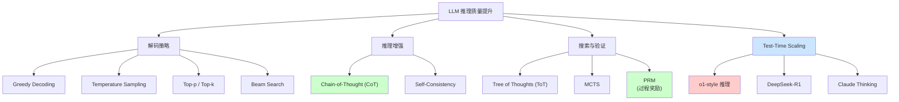
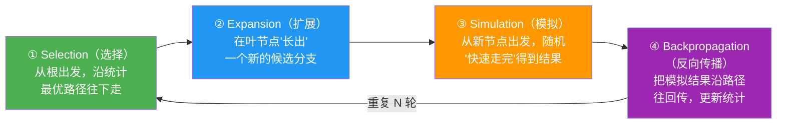

# Week 7 讲义：Test-Time Scaling 与高级推理策略

> **核心目标**：理解 LLM 推理时的算力投入如何提升输出质量，掌握从简单解码到复杂推理增强的技术演进脉络。
>
> **学习时间**：7 小时
>
> **关键输出**：解码策略对比表 + Test-Time Scaling 深度笔记 + PRM/ORM 对比分析
>
> **前置要求**：已完成 Phase 0（基础概念）和 Week 6（推理优化与框架生态）的学习。

---

## 📖 本周知识图谱



---

## 🧭 Part 0: 引言——从"说话"到"思考"

在 Week 6 中，我们学习了如何让 LLM **推理得更快**：通过 PagedAttention 管理显存、用 Continuous Batching 提升吞吐、用 Speculative Decoding 降低延迟。这些都是**系统层面**的优化。

但还有一个根本性的问题我们尚未涉及：**如何让 LLM 推理得更"聪明"**？

### 0.1 两个维度的推理优化

| 维度 | 核心问题 | 代表技术 | Week 6 覆盖 |
| :--- | :--- | :--- | :---: |
| **系统优化** | 如何更快地生成 Token？ | PagedAttention, Speculative Decoding | ✅ |
| **算法优化** | 如何生成更高质量的回答？ | CoT, ToT, MCTS, PRM, o1 | ❌ (本周) |

### 0.2 核心问题：推理时该投入多少算力？

传统观点认为，模型能力主要由**训练时的算力投入**决定（Scaling Law: $L \propto C^{-\alpha}$）。但 2024 年以来，一个新的洞见正在改变这一认知：

> **Test-Time Compute Scaling**：在推理时投入更多算力（更多采样、更长思考链、更复杂的搜索），可以显著提升模型的推理质量——甚至在某些任务上，推理时投入算力的边际收益**超过**训练时投入算力。

这意味着：**同一个模型，用不同的推理策略，可以表现出截然不同的"智力水平"**。

### 0.3 本周学习路线

我们将按照**从简单到复杂**的顺序，逐步理解 Test-Time Scaling 的技术演进：

1. **解码策略**：基础的 Token 采样方法（Greedy → Temperature → Top-p/Top-k）
2. **Chain-of-Thought**：让模型"说出"推理过程
3. **Self-Consistency**：多路采样 + 投票
4. **Tree of Thoughts**：从线性推理到树状探索
5. **MCTS**：蒙特卡洛树搜索在 LLM 推理中的应用
6. **PRM vs ORM**：过程奖励 vs 结果奖励
7. **o1 与 Test-Time Scaling**：长思考链 + RL 训练的推理策略

> **🔑 学习提示**：每一种技术都是对前一种的**自然延伸**。理解"它要解决什么问题"比记住技术细节更重要。

---

## 🎯 Part 1: 解码策略——Token 是怎么选出来的？

在深入推理增强技术之前，我们需要先理解最基础的问题：**当模型输出一个概率分布时，我们如何选择下一个 Token？**

### 1.1 从 Logits 到概率分布

LLM 的每一步输出是一个 **Logits 向量**，维度等于词表大小（如 32000）。每个位置的值表示模型对该 Token 的"原始偏好"。

```python
# 假设词表大小为 5（简化示例）
logits = [2.0, 1.0, 0.5, -1.0, -2.0]  # 模型的原始输出
```

通过 **Softmax**，我们将 Logits 转换为概率分布：

$$
P(t_i) = \frac{e^{z_i}}{\sum_{j} e^{z_j}}
$$

```python
# Softmax 后的概率分布
probs = [0.52, 0.19, 0.12, 0.03, 0.01]  # Token 0 概率最高
```

现在问题来了：**我们应该选概率最高的 Token，还是按概率采样？**

### 1.2 Greedy Decoding（贪婪解码）

最简单的策略：**每一步都选概率最高的 Token**。

```python
next_token = argmax(probs)  # 永远选 Token 0
```

**优点**：

- 确定性输出（相同输入永远产生相同输出）
- 计算简单

**缺点**：

- **缺乏多样性**：永远沿着"最高概率路径"走，可能错过更好的全局解
- **重复退化问题 (Repetition/Degeneration)**：极易陷入无尽的重复循环（如不断输出 "I think that... I think that..."）。
  - *深层原因（自我强化）*：LLM 是自回归模型，刚生成的输出立刻变成下一步的输入。一旦局部碰巧出现了重复片段，这种模式在上下文中就会**不断自我强化**，使得生成同类 Token 的概率越来越高。
  - *为何 Greedy 无法自拔*：因为它**绝对死板**地每次只选最高概率的 Token，没有任何"探索"或"随机性"机制来抓取低概率 Token 以打破这个死循环反馈链。

> **适用场景**：需要确定性输出的任务，如代码生成、事实问答。

### 1.3 Temperature Sampling（温度采样）

引入**温度参数 T** 来控制概率分布的"锐利程度"：

$$
P(t_i) = \frac{e^{z_i / T}}{\sum_{j} e^{z_j / T}}
$$

| Temperature | 效果 | 概率分布形态 |
| :---: | :--- | :--- |
| T → 0 | 接近 Greedy | 最高概率 Token 占比接近 100% |
| T = 1 | 原始分布 | 保持模型训练时的分布 |
| T > 1 | 更"平坦" | 低概率 Token 也有机会被选中 |

```python
# T = 0.5 (更确定)
probs_t05 = [0.72, 0.15, 0.08, 0.03, 0.02]

# T = 2.0 (更随机)
probs_t20 = [0.32, 0.23, 0.18, 0.14, 0.13]
```

> **直觉**：Temperature 就像"创造力旋钮"。T 低 = 保守稳妥，T 高 = 天马行空。

### 1.4 Top-k Sampling

**问题**：即使 Temperature 很高，我们真的希望模型选择那些概率极低的"离谱" Token 吗？

**Top-k** 的做法：**只从概率最高的 k 个 Token 中采样**，其他全部归零。

```python
k = 3
# 原始分布: [0.52, 0.19, 0.12, 0.03, 0.01]
# Top-3 后:  [0.52, 0.19, 0.12, 0.00, 0.00]  # 重新归一化
# 归一化:    [0.63, 0.23, 0.14, 0.00, 0.00]
```

**缺点**：

- 有时候只有 1-2 个合理选项（如"中华人民共和..."后面几乎只能是"国"）
- 有时候有 100+ 个都挺合理（如"我今天想吃..."后面可以是很多食物）

### 1.5 Top-p Sampling (Nucleus Sampling)

**Top-p** 解决了 Top-k 的局限性：**动态选择累积概率达到 p 的最小 Token 集合**。

```python
p = 0.9

# 假设排序后概率: [0.52, 0.19, 0.12, 0.08, 0.05, 0.04]
# 累积概率:       [0.52, 0.71, 0.83, 0.91, ...]
# Top-p=0.9 选择: [0.52, 0.19, 0.12, 0.08]  # 累积到 0.91 时停止
```

**优势**：

- 在"确定性强"的位置自动收窄选择范围
- 在"开放性强"的位置自动扩大选择范围

> [!TIP]
> **工程实践**：大多数生产系统同时使用 Temperature + Top-p。
>
> - `temperature=0.7, top_p=0.9` 是常见的平衡配置
> - OpenAI API 默认 `temperature=1, top_p=1`

### 1.6 Beam Search（束搜索）

上述方法（Greedy, Sampling）都是**逐 Token 决策**，只关注"眼前这一步"的概率最高，这种短视行为很容易导致**局部最优**（比如当前选了一个看似概率很高的前置词，却导致后续很难接上通顺的句意）。

**Beam Search** 的核心思想是：**多往前看几步，同时维护多条候选路径（Beam）**，以寻找全局质量最高的完整序列。它的具体运行机制如下：

1. **设置束宽 (`Beam Width` / `num_beams`)**：这是 Beam Search 中决定搜索空间的**核心超参数**。在学术论文中通常称为 `beam_width`，而在 Hugging Face Transformers 等实际工程框架中，对应的控制参数名叫 `num_beams`。
   - **它的作用**：决定了在模型生成的每一步中，我们要**同时维护和向前推演的候选分支数量（即 Beam 的数量）**。比如设置 `num_beams = 3`，就意味着在任何时刻，系统都只会保留当前累积得分最高的前 3 条未完成的候选子串。
   - **代价权衡**：这个参数设置得越大，探索的空间越广，最终找到全局高质量句型的概率就越高；但相应的代价是，每前进一步所需预测的 Token 分支数也会呈**线性倍数增加**（例如 `num_beams=5` 意味着需要比 Greedy Decoding 多花大约 5 倍的计算量和占用 5 倍的显存）。
2. **候选扩展**：针对这 3 条序列的每一条，模型预测完整的下一 Token 概率分布，并计算新组合的累积得分（通常是**对数概率相加**，以避免小数连乘导致的数值下溢）。
3. **剪枝与更新**：面对 $3 \times |V|$（词表大小）种所有可能的组合，我们从大到小重新排序，只截取累积总分最高的 Top 3 条新路径，淘汰其余所有分支。
4. **终止条件**：当某条路径生成结束符（如 `<EOS>`）时，将其存入完成候选区，直到收集足够多完成的序列，最终返回整体得分（经过长度平均化惩罚后）最高的那一条。

**💡 直观例子**：
假设进行文本补全，Greedy 解码第一步选了局部最高概率的 "The" (0.5)，但后续由于语境不搭，只能接低概率词，使得 "The apple" 总概率为 0.5 × 0.2 = 0.1；
而 Beam Search 也会同时保留第一步中第二高的 "An" (0.4)，在第二步探索时，它发现 "An apple" 的总概率为 0.4 × 0.8 = 0.32。此时全局视野下，0.32 > 0.1，Beam Search 便成功**避开了局部的贪心陷阱**。

**优点**：

- 考虑了序列的**整体流畅度和质量**，大大减少了“一步错、步步错”或烂尾句子的概率。

**缺点**：

- **算力开销成倍增加**：计算量和显存占用大约是 Greedy Decoding 的 `beam_width` 倍。
- **输出过于保守**：Beam Search 倾向于生成极其常见、平铺直叙的"安全"回答。这就导致它在开放式对话和故事生成中缺乏多样性和惊喜感。
- **长句衰减（长度惩罚）**：因为概率越乘越小，模型天生倾向于生成很短的句子。通常工程上需要额外引入**长度惩罚因子 (Length Penalty)** 来强行提拔长句。

> **适用场景**：机器翻译、摘要生成等追求"准确性"的任务。

### 1.7 解码策略小结

| 策略 | 多样性 | 质量稳定性 | 计算成本 | 典型场景 |
| :--- | :---: | :---: | :---: | :--- |
| Greedy | ❌ 低 | ✅ 高 | ✅ 低 | 代码、事实回答 |
| Temperature | ⚡ 可调 | ⚡ 可调 | ✅ 低 | 通用对话 |
| Top-k | ⚡ 中 | ✅ 高 | ✅ 低 | 受控生成 |
| Top-p | ⚡ 中高 | ✅ 高 | ✅ 低 | 创意写作 |
| Beam Search | ❌ 低 | ✅ 最高 | ⚠️ 中 | 翻译、摘要 |

> [!NOTE]
> **工程现实：服务商真的会根据场景切换策略吗？**
>
> 这是一个非常敏锐的问题。在实际的 LLM 服务（如 ChatGPT 网页端或通用 API）中，服务商确实很难预判用户的具体意图。因此，工程上的真实做法通常是：
>
> 1. **To开发者 (API 层)**：把选择权交给调用者。API 提供商会默认一个"万金油"配置（如 `temperature=1.0, top_p=1.0` 或者是 `temperature=0.7, top_p=0.9`），但强制开发者在面临具体场景（如写代码大模型）时自己去调整参数。
> 2. **To普通用户 (Web 端)**：使用固定且保守的**默认经验组合**（比如同时开启 Temperature 和 Top-p）。实际上，现代强大的模型（如 GPT-4）通过 SFT（监督微调），已经使其原始概率分布 $P(x)$ 极度拟合人类偏好，所以即使挂着固定的 $T=0.7$，它也能在写代码和写诗之间表现出不错的兼容性。
> 3. **隐式路由**：少数极致优化的产品框架底层可能会增加一个极轻量的意图分类器，如果探测到用户的 prompt 是 "请写一段排序代码"，系统会在暗中悄悄拉低 Temperature 指标以防发散。
>
> **关键认识**：解码策略解决的是"**如何从分布中采样**"的问题。但如果模型本身对复杂问题的概率分布就是错的，再好的采样也无济于事。这就引出了下一个问题：**如何让模型生成更好的概率分布？**

---

## 💡 Part 2: Chain-of-Thought——让模型"说出来"

### 2.1 问题的起源

考虑这个简单的数学问题：

> **问题**：小明有 5 个苹果，小红给了他 3 个，他又吃掉了 2 个。请问小明现在有几个苹果？

对于 LLM 来说，直接输出答案是一种**压缩**——模型需要在一次前向传播中完成所有推理。这对简单问题没问题，但对于多步推理问题，这种压缩往往会出错。

### 2.2 Chain-of-Thought 的核心思想

**Chain-of-Thought (CoT)** 的核心洞见非常简单：

> **让模型把推理过程"说出来"，而不是直接给答案。**

```text
# 无 CoT（直接回答）
Q: 小明有 5 个苹果，小红给了他 3 个，他又吃掉了 2 个。请问小明现在有几个苹果？
A: 6 个

# 有 CoT（逐步推理）
Q: 小明有 5 个苹果，小红给了他 3 个，他又吃掉了 2 个。请问小明现在有几个苹果？
A: 让我一步一步来思考：
1. 小明最初有 5 个苹果
2. 小红给了他 3 个，所以现在有 5 + 3 = 8 个
3. 他吃掉了 2 个，所以现在有 8 - 2 = 6 个
答案是 6 个。
```

### 2.3 为什么 CoT 有效？

这是一个深刻的问题，目前有几种解释：

#### 解释 1：推理链作为中间表示

Transformer 的每一层可以看作一个"计算步骤"。对于复杂的多步推理，模型的深度可能不足以在一次前向传播中完成所有计算。

**CoT 相当于把"宽度不足"的问题转化为"长度"**：每生成一个中间步骤的 Token，模型就又经过了一次完整的前向传播。

```text
直接回答: 输入 → [一次前向传播] → 答案

CoT: 输入 → [前向传播] → 步骤1 → [前向传播] → 步骤2 → [前向传播] → 答案
```

> **类比**：这就像人类做复杂数学题时，必须在草稿纸上写下中间步骤，而不是只在脑子里算。

#### 解释 2：注意力机制的锚点

推理链中的中间结果会**进入 KV Cache**，成为后续生成时 Attention 可以"回看"的内容。

```text
"5 + 3 = 8" 这个中间结果写出来后：
- 后续计算 "8 - 2" 时，模型可以 attend 到 "8" 这个 Token
- 如果没有写出来，模型必须在隐藏状态中"记住"这个 8
```

#### 解释 3：激活"推理模式"

预训练数据中包含大量"逐步解题"的文本（教科书、论坛答疑等）。CoT 可能**激活了模型在这些数据上学到的推理模式**。

> [!IMPORTANT]
> **CoT 的本质**：CoT **不是在教模型新东西**，而是**释放模型已有的能力**。模型本来就"会"多步推理，只是需要合适的格式来"诱导"它展现出来。

### 2.4 两种 CoT 的用法

#### Zero-shot CoT

最简单的用法：**在 Prompt 末尾加上一句话**。

```text
Q: [复杂问题]
A: Let's think step by step.
```

这句话会"诱导"模型生成推理链，而不是直接给答案。

> **"Let's think step by step"** 是 Kojima et al. (2022) 发现的"魔法咒语"，在 GSM8K 等数学推理数据集上可将准确率从 17% 提升到 78%。

#### Few-shot CoT

提供几个**带有推理链的示例**：

```text
Q: 罗杰有 5 个网球。他又买了 2 罐网球，每罐有 3 个。他现在有多少个网球？
A: 罗杰最初有 5 个球。2 罐 × 3 个/罐 = 6 个球。5 + 6 = 11。答案是 11。

Q: 食堂有 23 个苹果...
A: ...

Q: [你的问题]
A:
```

Few-shot CoT 通过示例"教"模型推理链的格式和风格。

> [!NOTE]
> **延伸思考：CoT 真的只是一句 Prompt 这么简单吗？**
>
> 这是一个非常好的直觉问题！从单纯的“使用”层面看，CoT 确实只是改一改 Prompt。但这种“简单”背后，隐藏着大模型发展史上的几个重要里碑：
>
> 1. **第一阶段：作为“涌现能力”（意外惊喜）**。最初的 CoT（2022年）只是偶然发现的 "Prompt Trick"，证明了模型在预训练中已经内化了逻辑规则，只需要被合适的格式“诱导”出来。
> 2. **第二阶段：从“诱导”到“专门训练”（SFT）**。学术界发现 CoT 有效后，开始在指令微调（SFT）阶段，专门喂给模型几百万条带有推理步骤的数据。现在的很多模型默认就会拆解步骤，正是因为这种训练。（*关于 SFT 微调的详细理论，已在之前的课程中覆盖；在本书 **7.3 节**的 R1 训练流程中也会再次看到它的作用*）
> 3. **第三阶段：向“推理模型”演进（RL 与 o1/R1）**。现在的 CoT 已经进化成了通过大规模强化学习（RL）逼迫模型自己探索正确思维路径的**内置搜索算法**。它不再是一句表面上的 Prompt，而是构成了整个 Test-Time Scaling 路线的核心。（*这部分将在本讲义的 **Part 7: Test-Time Scaling 与 o1** 中进行专门的深度解析*）

### 2.5 CoT 的局限性

1. **单路径**：只生成一条推理链，如果中间步骤错了，答案必然错
2. **无法回溯**：一旦走错，不会"意识到"错误并纠正
3. **长度限制**：推理链会消耗上下文窗口

> **引出问题**：如果一条推理链可能出错，那**多条推理链取众数**会不会更好？

---

## 🔄 Part 3: Self-Consistency——多路采样的力量

### 3.1 核心思想

在 Part 2 中我们知道了 CoT 能让模型"说出推理过程"以提升准确率，但它有一个根本弱点：**只生成一条推理链，如果中间步骤碰巧走错，答案就必然错**。有没有办法降低这种"运气成分"的影响？

**Self-Consistency** (Wang et al., 2022) 的核心想法是：**既然一条推理链可能出错，那就让模型独立跑多条推理链，然后用投票来消除随机错误**。它建立在 CoT 之上，是对 CoT 的直接增强：

1. **多次采样**：对同一个问题，用**较高的 Temperature**（关键！）让模型生成 **多条不同的 CoT 推理链**
2. **提取答案**：从每条推理链中提取最终答案
3. **多数投票 (Majority Vote)**：选择**出现次数最多的答案**作为最终输出

```text
问题: 23 + 45 = ?

采样 1: 先算个位 3+5=8，再算十位 2+4=6 → 68 ✓
采样 2: 23+45，我直接算... → 78 ✗ (中间算错了)
采样 3: 把 45 拆成 40+5，23+40=63，63+5=68 → 68 ✓
采样 4: 20+40=60，3+5=8，60+8=68 → 68 ✓
采样 5: 23+50=73，73-5=58... 不对... → 58 ✗ (推理路径错误)

投票结果: 68 (3票) > 78 (1票) > 58 (1票) → 最终答案: 68
```

> **注意上面例子的关键细节**：5 条推理链走的是**完全不同的路径**（拆个位十位、直接算、拆成整十数...），但其中 3 条殊途同归地得到了相同答案 68。这正是 Self-Consistency 的精髓所在。

### 3.2 为什么有效？

**错误是随机的，正确是一致的。**

- 模型犯错往往是"随机"的——不同的采样路径会犯不同的错误
- 但对于有正确答案的问题，正确的推理路径往往会**趋同于同一个答案**

> **类比**：这就像让多个学生独立解同一道数学题，然后看多数人的答案。如果大多数人得到相同答案，这个答案很可能是对的。

### 3.3 Self-Consistency 的实现

```python
def self_consistency(question, model, n_samples=10, temperature=0.7):
    answers = []
    for _ in range(n_samples):
        # 用 CoT 方式生成推理链（本质就是跑 n 次独立的 CoT）
        cot_response = model.generate(
            prompt=f"{question}\nLet's think step by step.",
            temperature=temperature  # 必须 > 0！否则每次采样结果完全相同
        )
        # 从推理链末尾提取最终答案（如 "答案是 68" → 68）
        answer = extract_answer(cot_response)
        answers.append(answer)

    # 多数投票：选出现次数最多的答案
    return most_common(answers)
```

> [!IMPORTANT]
> **为什么 Temperature 必须设高？**
> 如果 `temperature=0`（等同于 Greedy Decoding），模型每次采样都会走完全相同的路径、得到完全相同的答案——采 100 次也等于只采了 1 次。Temperature 设高（如 0.7~1.0）的目的是**让每次采样走出不同的推理路径**，这样不同路径之间的错误才是"随机且互不相关的"，多数投票才有意义。

### 3.4 计算开销权衡

| 采样数 | 计算成本 | 准确率提升 | 适用场景 |
| :---: | :---: | :---: | :--- |
| 1 | 1x | baseline | 实时交互 |
| 5 | 5x | +5-10% | 中等难度任务 |
| 10-20 | 10-20x | +10-15% | 复杂推理任务 |
| 40+ | 40x+ | 边际递减 | 研究/评测 |

> [!TIP]
> **工程实践**：Self-Consistency 可以**完美并行**——所有采样独立进行，BatchSize 只受显存限制。对于离线评测或不急需响应的场景，这是提升准确率最简单的方法。

### 3.5 局限性

1. **只适用于有"标准答案"的问题**：如数学题、编程题。开放式问题（写故事）无法投票
2. **粗粒度**：只在最终答案上投票，没有利用中间步骤的信息
3. **无搜索**：仍然是独立采样，没有"看到之前的尝试后调整策略"

> 💻 **配套实战代码**：
>
> - 纯逻辑演示：请运行 [`sampleCode/week7/self_consistency_demo.py`](./sampleCode/week7/self_consistency_demo.py) 亲自体验多路采样、多数投票以及 `Temperature` 对结果的深刻影响。
> - 生产级实现：对于希望将此技术融入到真实业务项目中的同学，请参考 [`sampleCode/week7/production_llm_reasoning.py`](./sampleCode/week7/production_llm_reasoning.py) 模块 1，它展示了如何通过异步 `asyncio.gather` 并发请求完美实现低延迟高召回的在线 API 方案。
>
> **引出问题**：如果推理过程可以**分叉探索**多条路径，而不是各自独立呢？

---

## 🌳 Part 4: Tree of Thoughts——从链到树

### 4.1 ToT 是什么？

在前面我们已经知道，CoT 让模型"说出推理过程"，Self-Consistency 让模型"多次独立尝试后投票"。但它们都有一个共同的致命缺陷：**推理过程是线性的、一条路走到黑的**——一旦中间某一步走错，就没有回头路。

**Tree of Thoughts (ToT)** (Yao et al., 2023) 正是为了解决这个问题而提出的。它是一个**完整的推理框架**，核心定义可以概括为：

> **ToT = 将推理过程建模为一棵树 + 在树上进行有策略的搜索**
>
> 其中，树的每个节点是一个"中间推理状态"，每条边是一个"思考步骤"。框架包含三个协同工作的核心模块：
>
> 1. **生成器 (Generator)**：负责在每个节点扩展出多个候选的下一步思路（LLM 扮演）
> 2. **评估器 (Evaluator)**：负责判断每个候选思路的"前景"，决定哪些值得继续、哪些该放弃（LLM 扮演）
> 3. **搜索算法 (Search)**：负责协调整个探索过程——按什么顺序访问节点、何时剪枝、何时回溯（BFS 或 DFS）

```text
        [问题]
           |
    ┌──────┼──────┐
    ↓      ↓      ↓
  [思路A] [思路B] [思路C]    ← 生成器：扩展多个候选
    |      |      |
  评估器  评估器  评估器      ← 评估器：打分判断前景
    |      |      ✗ (剪枝)   ← 搜索算法：砍掉没前景的
   ┌┴┐    ┌┴┐
   ↓ ↓    ↓ ↓               ← 对存活分支重复上述过程
  ... ...  ...
```

| 特性 | CoT / Self-Consistency | Tree of Thoughts |
| :--- | :--- | :--- |
| **结构** | 线性链 | 树状 |
| **探索方式** | 独立采样 | 分支探索 |
| **是否回溯** | ❌ 不能 | ✅ 可以剪枝和回溯 |
| **中间评估** | ❌ 只看最终答案 | ✅ 每步都可评估 |

### 4.2 ToT 的完整工作流程

抽象来看，ToT 的运行流程是一个不断重复的循环：**分解 → 生成 → 评估 → 搜索（剪枝/回溯）**，直到找到满意的答案或搜索预算耗尽。

1. **分解问题 (Thought Decomposition)**：将原始问题拆分为若干个"思考步骤"，每一步产生一个中间状态。步骤的粒度由任务决定（可能是一个段落、一个等式、或一步操作）。
2. **生成候选 (Thought Generation)**：在当前状态下，让 LLM **生成多个不同的候选下一步**（而不是只走一条路）。这就是树的"分叉点"。
3. **评估前景 (State Evaluation)**：对每个候选分支，让 LLM（或外部工具）**判断这条路是否有前景**。这是 ToT 最核心的创新——它不像 Self-Consistency 那样等最终答案出来才评判，而是**在中间步骤就做出取舍**。
4. **搜索与决策 (Search)**：根据评估结果，搜索算法决定：继续探索哪些分支（`sure` / `maybe`）、放弃哪些分支（`impossible` → 剪枝）、以及当所有分支都走不通时**回溯到上一个岔路口**重新选择。

> **关键理解**：生成器、评估器、搜索算法这三者不是独立的组件，而是**在树的每一层、每一个节点上协同运转**的。

#### 评估器的核心机制：LLM 自我评估

在上述流程里，评估器扮演着**最关键的角色**——如果评估不准，剪枝就可能"误杀好路"或"放过烂路"，整棵搜索树的质量直接崩盘。那评估器到底是怎么运作的？

ToT 的一个关键创新是：**评估器本身也是 LLM**——不需要额外训练一个单独的模型，而是通过精心设计的 Prompt，让同一个 LLM 切换到"裁判模式"，对每一个中间状态做出判断。具体做法是，系统会构造一个类似下面的评估 Prompt：

```text
Prompt: 以下是问题 XXX 的一个部分解答：[步骤1, 步骤2, 步骤3]
请评估这个解答到目前为止的进展：
1. sure    - 这条路肯定能得到正确答案
2. maybe   - 可能正确，但不确定
3. impossible - 这条路明显走不通

你的评估是：
```

LLM 返回的三级结果直接驱动搜索算法的决策：

- `sure` → **优先继续探索**这条路径

- `impossible` → **直接剪枝**，放弃这条路径，节省算力

> [!NOTE]
> **为什么这种"自己评估自己"能起作用？**
> 因为"判断一个中间步骤是否合理"和"自己生成一个完整的正确推理链"是**两个难度完全不同的任务**。就像人类也有类似经验：你可能做不出一道数学难题，但如果别人写了一半解法给你看，你通常能判断出"这一步算错了"或"这个方向感觉靠谱"。LLM 的评估能力同理——它做"裁判"的准确率通常比做"选手"高。

下面我们用一个完整的例子来演示生成器、评估器和搜索算法是如何协同运转的。

### 4.3 完整实例：用 ToT 解 Game of 24

我们用 ToT 论文中最经典的 **"Game of 24（24点游戏）"** 来完整走一遍流程：给定 `[4, 9, 10, 13]`，要求用加减乘除算出 24。

#### 第 0 步：问题分解

系统决定将解题分为 **3 步**（每次选两个数字做一次运算，产生一个新数字，数字个数从 4 → 3 → 2 → 1）。整棵树的深度因此被确定为 3 层。

#### 第 1 层：生成 → 评估 → 搜索

**① 生成器工作**：LLM 被要求列举第一步所有可能的运算。这里系统通过以下 Prompt 来激活生成器：

```text
Prompt: 给定数字 [4, 9, 10, 13]，请提出所有可能的第一步运算
（选择两个数字，用 +、-、*、/ 中的一种进行运算），
并给出运算结果和剩余数字。
```

LLM 返回多个候选分支（部分示意）：

| 分支 | 运算 | 剩余数字 |
| :--- | :--- | :--- |
| A | `13 - 9 = 4` | `[4, 4, 10]` |
| B | `13 - 10 = 3` | `[4, 9, 3]` |
| C | `9 + 13 = 22` | `[4, 22, 10]` |
| D | `10 - 4 = 6` | `[6, 9, 13]` |
| ... | ... | ... |

**② 评估器工作**：对于每一个候选分支，系统发送一个**独立的评估 Prompt**，让 LLM 扮演"裁判"来判断前景：

```text
Prompt: 请评估以下 24 点游戏的中间状态。
剩余数字：[4, 4, 10]
这些数字是否有可能通过加减乘除得到 24？
请回答：sure（肯定可以）/ maybe（可能）/ impossible（不可能）
```

LLM 针对各分支的评估结果：

| 分支 | 剩余数字 | LLM 评估 | 理由（LLM 内部推理） |
| :--- | :--- | :---: | :--- |
| A | `[4, 4, 10]` | **sure** | `4 * 10 - 4*4 = 24` ✓ |
| B | `[4, 9, 3]` | maybe | 不太确定，但 `(9-3)*4=24` 其实可以 |
| C | `[4, 22, 10]` | maybe | `22+4-10=16` 不行，但也许有其他方式 |
| D | `[6, 9, 13]` | impossible | 这些数字太分散，难以组合出 24 |

**③ 搜索算法工作（以 BFS 为例）**：假设我们设置 `b=3`（每层保留最多 3 条路径），搜索算法根据评估结果做出决策：

- 分支 D 被评为 `impossible` → **剪枝**，永久放弃
- 分支 A (`sure`)、B (`maybe`)、C (`maybe`) 存活，进入第 2 层

#### 第 2 层：对存活分支重复同样的循环

**以分支 A `[4, 4, 10]` 为例**，再次执行 **生成 → 评估 → 搜索**：

生成器列举第二步的可能运算：`4+4=8 → [8,10]`、`4*4=16 → [16,10]`、`10-4=6 → [6,4]`、`10*4=40 → [40,4]` ...

评估器逐一判断只剩两个数字时能否得到 24：

- `[8, 10]`：`8+10=18`? `8*10=80`? → `impossible`
- `[16, 10]`：`16+10=26`? `16-10=6`? → `impossible`
- `[6, 4]`：`6*4=24` ✓ → **sure**!

搜索算法看到 `sure`，**优先深入这条路径**。

#### 第 3 层：到达叶节点

对 `[6, 4]` 这个最后两个数字的状态，计算 `6 * 4 = 24`。成功！回溯记录完整解法：

```text
13 - 9 = 4  → [4, 4, 10]
10 - 4 = 6  → [6, 4]
6 * 4 = 24  ✓
```

#### 回溯机制

如果分支 A 的所有第二步尝试都被评为 `impossible` 怎么办？搜索算法会**回溯**到第 1 层，改为深入探索分支 B `[4, 9, 3]`，对它再次执行"生成 → 评估 → 搜索"的循环。这就是 ToT 相比 CoT 的根本优势：**走不通的时候可以换一条路**。

### 4.4 ToT 的两种搜索算法实现

上面的例子中提到了"搜索算法"协调整个过程，而这个搜索具体可以用两种经典算法来实现：

#### BFS (广度优先搜索)

**策略**：每一层都生成所有分支、全部评估后，只保留最优的 `b` 条路径，然后再一起推进到下一层。（上面 Game of 24 的例子就是 BFS 风格）

```python
def bfs_tot(problem, model, b=5, T=3):
    """
    b: 每层保留的候选数（束宽）
    T: 搜索深度（步骤数）
    """
    candidates = [problem]  # 初始只有问题本身

    for depth in range(T):
        # ① 生成器：为每条存活路径生成候选下一步
        new_candidates = []
        for candidate in candidates:
            next_thoughts = model.generate_thoughts(candidate, n=b)
            new_candidates.extend(next_thoughts)

        # ② 评估器：让 LLM 对所有候选打分
        scores = [model.evaluate(c) for c in new_candidates]

        # ③ 搜索决策：只保留得分最高的 top-b 条路径（剪枝其余）
        candidates = top_b(new_candidates, scores, b)

    return best(candidates)
```

**特点**：探索更全面，不会错过 `maybe` 中的潜力股。但每一层都要等所有分支评估完才能继续，计算开销更大。

#### DFS (深度优先搜索 + 回溯)

**策略**：选一条看起来最有前景的路先一头扎到底。如果到底后发现答案不对，就**回溯**到上一个岔路口，换一条路继续扎。

```python
def dfs_tot(state, model, depth, max_depth):
    if depth == max_depth:
        return evaluate_final(state)  # 到达叶节点，检查答案

    # ① 生成器：生成候选下一步
    thoughts = model.generate_thoughts(state, n=3)

    for thought in thoughts:
        # ② 评估器：判断这条路的前景
        score = model.evaluate(state + thought)
        if score == "impossible":
            continue  # ③ 搜索决策：剪枝，跳过这条路

        # 递归深入
        result = dfs_tot(state + thought, model, depth + 1, max_depth)
        if result is not None:
            return result  # 找到答案，返回

    return None  # 所有分支都走不通 → 回溯到上一层
```

**特点**：一旦碰巧选对路径，速度极快。但如果第一条路选错了，可能浪费大量时间在错误分支上。

> **如何选择？** 对于答案空间较小、步骤明确的任务（如 Game of 24），BFS 更稳健。对于答案空间很大但"直觉"通常靠谱的任务，DFS 更高效。

### 4.5 ToT 的效果

在 **Game of 24** 任务上的实验结果，直观体现了树状搜索的巨大优势：

| 方法 | 成功率 |
| :--- | :---: |
| CoT (单路) | 4% |
| CoT + Self-Consistency (100 采样) | 9% |
| **ToT (BFS, b=5)** | **74%** |

这个巨大的差异说明：**对于需要"探索-评估-回溯"的问题，树状结构远优于线性链**。即使 Self-Consistency 暴力采样了 100 条路径，也只有 9%——因为每条路径都是独立的，没有利用中间信息来"聪明地"选择方向。

### 4.6 ToT 的局限性

1. **计算成本高**：每个节点都需要 LLM 调用做生成 + LLM 调用做评估，整棵树下来调用次数会很大
2. **需要任务定制**：不同任务的"思考步骤"该怎么分解（粒度多大？分几层？），需要针对性设计
3. **评估器不可靠**：LLM 对自己中间步骤的评估并非总是准确——它可能把一条好路误判为 `impossible`，也可能对一条死路给出 `sure`

> 💻 **配套实战代码**：
>
> - 纯逻辑演示：建议立刻运行 [`sampleCode/week7/tree_of_thoughts_demo.py`](./sampleCode/week7/tree_of_thoughts_demo.py)。内含经典的 Game of 24 场景，不仅展示了 BFS 的成功搜索，还利用一个经过构造的数组直观展示了 DFS **碰壁后回溯撤销**的完整日志。
>
> **引出问题**：有没有更系统的搜索方法，以及更可靠的评估方式？

---

## 🎲 Part 5: MCTS——当搜索需要"统计学直觉"

### 5.1 从 ToT 到 MCTS：为什么需要更系统的搜索？

在 Part 4 中，我们看到 ToT 通过"树状搜索 + LLM 自评估"实现了对推理路径的探索和回溯，在 Game of 24 上将成功率从 4% 提升到 74%。但 ToT 有一个根本性弱点：**它的评估器（LLM 自评估）并不可靠**。

回顾一下 ToT 的评估方式——让 LLM 对中间状态给出 `sure / maybe / impossible` 的判断。这种评估本质上是 LLM 的**主观直觉**，存在两个硬伤：

1. **评估可能严重失准**：LLM 可能把一条好路误判为 `impossible`（误杀），也可能对一条死路乐观地给出 `sure`（放水）
2. **没有统计依据**：一次评估就做出"剪枝/保留"的生死决定，缺乏多次验证

> **引出核心问题**：有没有一种方法，**不依赖 LLM 的主观判断**，而是通过**客观的统计数据**来评估每条路径的优劣？

这正是 **蒙特卡洛树搜索 (Monte Carlo Tree Search, MCTS)** 的核心思路。

#### 一个直觉类比：探索新城市的餐厅

假设你去一座陌生城市出差一周，每天晚上要选一家餐厅吃饭。你的策略是什么？

- **纯利用 (Exploitation)**：第一天碰巧吃了一家 8 分的餐厅，之后 6 天每天都去同一家。——安全但无聊，你可能错过了街角那家 9.5 分的宝藏小店。
- **纯探索 (Exploration)**：每天随机选一家新的。——你尝遍了 7 家，但没有一家去过两次，可能恰好没选到最好的那家。
- **聪明的策略**：前几天多尝新（探索），一旦发现某家特别好就多去几次（利用），同时偶尔再试试新店（保持探索）。

**MCTS 做的正是最后一种策略**——它通过"试吃（模拟）→ 打分（统计）→ 下次优先选高分但也给新店机会（UCB 公式）"的循环，在庞大的搜索空间中高效找到最优路径。

#### MCTS 的一句话定义

**MCTS = 树状搜索 + 随机模拟估值 + 统计驱动的选择策略**

> 它**不需要一个"裁判"来主观打分**（ToT 的方式），而是通过**大量模拟的胜负统计**来客观评估每条路径的价值。这就是它名字中"蒙特卡洛"（统计模拟方法）的由来。

### 5.2 MCTS 的核心循环：四步走一遍

MCTS 的运行方式是**不断重复同一个四步循环**，每循环一次就对搜索树的认知更新一轮。循环次数越多，估值就越精确。

我们先看全貌，再用一个例子完整走一遍。

#### 全貌：四个阶段



1. **Selection（选择）**：从根节点出发，在已经构建好的树中，**按照 UCB 公式**一路选择子节点往下走，直到到达一个"叶节点"（还没被充分探索的节点）
2. **Expansion（扩展）**：在这个叶节点上，**生成一个新的子节点**（相当于"尝试一个新动作"）
3. **Simulation（模拟/Rollout）**：从这个崭新的节点出发，**随机走到底**（不做任何策略性选择，纯随机），得到一个终局结果（成功或失败）
4. **Backpropagation（反向传播）**：将这次模拟的结果（成功/失败）**沿着走过的路径往回传**，更新路径上每个节点的两个统计量——**访问次数**和**累积价值**

> **关键理解**：四步循环的**前三步是"收集一条新数据"**，第四步是 **"用这条数据更新认知"**。循环 100 次，你就有了 100 条模拟数据来估算每条路径的好坏——这就是"蒙特卡洛方法"的精髓：**用大量随机采样的统计结果来逼近真实价值**。
> [!NOTE]
> **终局结果是如何判断的？**
>
> 在第 3 步 Simulation 中，我们说"得到一个终局结果（成功或失败）"，但这个"成功/失败"是怎么判断的？这正是 **Part 6 要讨论的奖励模型（Reward Model）** 的作用：
>
> | 判断方式 | 做法 | 适用场景 |
> | :--- | :--- | :--- |
> | **答案比对** | 直接比较最终答案与标准答案 | 有标准答案的任务（数学、代码） |
> | **ORM（结果奖励）** | 用模型预测"这个答案正确的概率" | 需要评估答案质量的任务 |
> | **PRM（过程奖励）** | 对推理链的每一步单独评分 | 需要细粒度反馈的任务 |
>
> 在 LLM 推理场景中，MCTS 的价值函数通常由 **ORM 或 PRM** 担任——它们负责评判"这条推理路径最终是否正确"或"这个中间状态有多大价值"。这部分将在 Part 6 详细展开。

#### 完整例子：用 MCTS 探索一道数学推理题

假设 LLM 要解决问题："小明有 23 个苹果，又买了 4 袋，每袋 6 个，请问他现在有多少个苹果？"

搜索树的每个节点代表推理链的一个中间状态，每条边代表"写出下一个推理步骤"。

**第 1 轮循环：**

```text
① Selection：树刚刚建立，只有根节点 [问题]，没有子节点可选 → 直接到达叶节点

② Expansion：在根节点下生成一个新子节点
   → 节点 A："先算买了多少：4 × 6 = 24"

③ Simulation：从节点 A 开始，让 LLM 随机快速续写完剩余推理
   → 随机续写："23 + 24 = 47。答案是 47。" → 正确 ✓（得分 = 1）

④ Backpropagation：更新统计
   → 节点 A：访问 1 次，成功 1 次（胜率 1/1 = 100%）
   → 根节点：访问 1 次，成功 1 次
```

**第 2 轮循环：**

```text
① Selection：根节点只有一个子节点 A，且 A 还有"未探索的兄弟位置"
   → UCB 公式判断：应该先探索新方向（探索项很高）→ 回到根节点的叶节点位置

② Expansion：在根节点下生成另一个子节点
   → 节点 B："先把 23 个苹果分成 20 + 3"

③ Simulation：从节点 B 随机续写
   → 随机续写："20 + 4 = 24，3 + 6 = 9，24 + 9 = 33... 答案是 33。" → 错误 ✗（得分 = 0）

④ Backpropagation：更新统计
   → 节点 B：访问 1 次，成功 0 次（胜率 0/1 = 0%）
   → 根节点：访问 2 次，成功 1 次
```

**第 3 轮循环：**

```text
① Selection：根节点有两个子节点
   → A 的胜率 100%，B 的胜率 0%
   → UCB 公式综合考虑"胜率"和"探索需求"后，选择 A（胜率远高于 B）
   → 到达节点 A，它还没被深入探索过 → 这就是本轮的叶节点

② Expansion：在节点 A 下生成子节点
   → 节点 C："然后 23 + 24 = 47"

③ Simulation：从节点 C 随机续写
   → "答案是 47。" → 正确 ✓（得分 = 1）

④ Backpropagation：
   → 节点 C：访问 1 次，成功 1 次
   → 节点 A：访问 2 次，成功 2 次（胜率 100%）
   → 根节点：访问 3 次，成功 2 次
```

**经过多轮循环后**，节点 A 这条路径被模拟了很多次且胜率很高，MCTS 最终**选择访问次数最多的子节点**作为最佳下一步——这就是统计驱动决策的力量。

> [!NOTE]
> **与 ToT 的关键区别**：ToT 的评估是 LLM **看了一眼**说"这条路 `sure`"——一次判断定生死。MCTS 的评估是**模拟 50 次，其中 45 次走到正确答案**——用统计数据说话。后者显然更可靠，只是计算成本更高。

### 5.3 Selection 的秘密武器：UCB 公式

四个阶段中，**Selection（选择）是最关键也最微妙的一步**——它决定了"这一轮循环去探索树的哪个方向"。选得好，搜索效率极高；选得差，大量算力被浪费在无用的分支上。

#### 为什么"只选最好的"不行？

一个朴素的想法是：**每次都选当前胜率最高的节点**。但这有一个致命问题：

> 假设节点 A 被模拟了 2 次，赢了 2 次（胜率 100%）；节点 B 只被模拟了 1 次，输了（胜率 0%）。如果你永远只选胜率最高的 A，那 B 永远不会再被尝试——但 B 的胜率 0% 可能只是因为**样本太少、运气不好**！也许 B 其实是一条更好的路径，只是第一次模拟碰巧走错了。

这就是经典的**探索-利用困境 (Exploration-Exploitation Dilemma)**——也就是前面"餐厅类比"中的问题。

#### UCB 公式：用数学优雅地平衡两者

MCTS 使用 **UCB1 (Upper Confidence Bound)** 公式来解决这个困境：

$$
\text{UCB}(s, a) = \underbrace{\frac{Q(s, a)}{N(s, a)}}_{\text{利用项：平均收益}} + \underbrace{c \cdot \sqrt{\frac{\ln N(s)}{N(s, a)}}}_{\text{探索项：不确定性奖励}}
$$

**每一项是什么意思？** 我们逐个拆解：

| 符号 | 含义 | 直觉 |
| :---: | :--- | :--- |
| $Q(s, a)$ | 从状态 $s$ 选择动作 $a$ 后，所有模拟的**累积得分** | 这条路历史上总共得了多少分 |
| $N(s, a)$ | 动作 $a$ 被选择的**次数** | 这条路被尝试了多少次 |
| $\frac{Q}{N}$ | **平均收益**（利用项） | 这条路的"历史平均成绩" |
| $N(s)$ | 父节点的**总访问次数** | 所有兄弟路径加起来被尝试了多少次 |
| $c$ | **探索系数**（通常取 $\sqrt{2}$） | 控制"多大程度上偏好探索" |
| $c \cdot \sqrt{\frac{\ln N(s)}{N(s,a)}}$ | **探索奖励** | 尝试次数越少，这个值越大 → 越鼓励去尝试 |

**核心直觉**：UCB 得分 = **"这条路有多好"** + **"这条路还有多少未知潜力"**。即使一条路当前平均收益不高，但如果它被尝试的次数极少（探索项很大），UCB 也会给它一个高分，确保它有机会被再次探索。

#### 深入理解：为什么探索项用 $\ln N(s)$ 而不是 $N(s)$？

你可能会好奇：为什么探索项是 $\sqrt{\frac{\ln N(s)}{N(s,a)}}$，而不是 $\sqrt{\frac{N(s)}{N(s,a)}}$？这涉及到 UCB 的理论推导。

**核心原因：对数增长是亚线性的**

```text
N(s) = 1      → ln(1) = 0
N(s) = 10     → ln(10) ≈ 2.3
N(s) = 100    → ln(100) ≈ 4.6
N(s) = 1000   → ln(1000) ≈ 6.9
N(s) = 10000  → ln(10000) ≈ 9.2
```

这意味着：**总访问次数越多，探索奖励的增长越慢** → 策略会逐渐从"探索"转向"利用"。这符合我们的直觉——随着经验积累，应该逐渐减少盲目探索。

**理论推导：Hoeffding 不等式**

UCB1 的公式来源于 **Hoeffding 不等式**的置信区间。假设我们要估计某个动作的真实价值 $\mu$，用 $n$ 次采样的平均值 $\bar{X}$ 来估计，Hoeffding 不等式告诉我们：

$$P(|\bar{X} - \mu| \geq \epsilon) \leq 2e^{-2n\epsilon^2}$$

当我们想要以至少 $1-\delta$ 的概率保证估计准确时，令 $\delta = 2e^{-2n\epsilon^2}$，解得：

$$\epsilon = \sqrt{\frac{\ln(1/\delta)}{2n}}$$

如果令 $\delta = \frac{1}{N(s)^2}$（总访问次数越多，置信度要求越高），就得到：

$$\epsilon = \sqrt{\frac{\ln N(s)}{n}}$$

这就是 UCB 探索项的来源——**它本质上是动作价值估计的置信上界**。

**为什么不是其他形式？**

| 形式 | 问题 |
| :--- | :--- |
| $\sqrt{N(s)/N(s,a)}$ | 增长太快，即使某动作已被证明很差仍会被频繁选择（过度探索） |
| 常数 $c$ | 不随经验调整，探索程度固定（要么不足要么过度） |
| $\sqrt{\ln N(s)/N(s,a)}$ | ✅ 平衡：既保证充分探索，又随经验积累逐渐收敛 |

**渐近保证**

使用 $\ln N(s)$ 有一个重要的理论性质：**每个动作最终都会被无限次尝试**（Regret 最优）。这保证了算法不会因为早期的"坏运气"而永远错过潜在的好动作。

#### 用数字走一遍

假设父节点总共被访问了 $N(s) = 10$ 次，它有三个子节点 A、B、C，探索系数 $c = \sqrt{2} ≈ 1.41$：

| 子节点 | 访问次数 $N$ | 累积得分 $Q$ | 平均收益 $\frac{Q}{N}$ | 探索项 $c\sqrt{\frac{\ln 10}{N}}$ | **UCB 总分** |
| :---: | :---: | :---: | :---: | :---: | :---: |
| A | 5 | 4 | 0.80 | $1.41 \times \sqrt{\frac{2.30}{5}} = 0.96$ | **1.76** |
| B | 4 | 2 | 0.50 | $1.41 \times \sqrt{\frac{2.30}{4}} = 1.07$ | **1.57** |
| C | 1 | 0 | 0.00 | $1.41 \times \sqrt{\frac{2.30}{1}} = 2.14$ | **2.14** ← 最高！ |

**结果**：尽管 C 的平均收益是 0（唯一一次模拟失败了），但因为它只被尝试过 1 次，探索项高达 2.14，**UCB 总分反而最高**！所以 MCTS 这一轮会**选择 C 去再试一次**，而不是盲目地反复选 A。

> [!TIP]
> **探索系数 $c$ 的工程含义**：$c$ 越大，算法越偏好"尝试新路"（探索型）；$c$ 越小，越偏好"走老路"（保守型）。实际应用中，$c$ 是需要根据任务调优的超参数。

### 5.4 MCTS 在 LLM 推理中的落地

理解了 MCTS 的原理后，我们来看它如何被应用到 LLM 推理场景中。核心思路是：**把 LLM 的多步推理过程映射为 MCTS 的搜索树**。

| MCTS 概念 | LLM 推理中的对应 |
| :--- | :--- |
| 状态 (State) | 已生成的推理链（如"先算 4×6=24，然后..."） |
| 动作 (Action) | 生成下一个推理步骤 |
| Simulation (Rollout) | 从当前步快速生成完整答案 |
| 价值函数 | 结果正确性 / ORM / PRM（详见 Part 6） |
| 终局 | 生成完整答案或达到最大步数 |

```python
class MCTSReasoning:
    def search(self, problem, n_iterations=100):
        root = Node(state=problem)

        for _ in range(n_iterations):
            # 1. Selection：用 UCB 选到叶节点
            node = self.select(root)

            # 2. Expansion：让 LLM 生成一个新的推理步骤
            if not node.is_terminal():
                child = self.expand(node)
            else:
                child = node

            # 3. Simulation：从新节点快速 rollout 到终局
            result = self.simulate(child)

            # 4. Backpropagation：用结果更新路径上的统计
            self.backpropagate(child, result)

        # 返回访问次数最多的子节点（最"被信赖"的路径）
        return self.best_child(root)
```

#### Rollout（模拟）的实现方式

在上面的循环中，**步骤 ③ Simulation** 是最消耗算力的环节——你需要从一个中间状态"快速走完"剩余推理，得到一个终局结果。在 LLM 场景中，有三种常见的实现：

| 方式 | 做法 | 精度 | 速度 |
| :--- | :--- | :---: | :---: |
| **Fast Rollout** | 用一个**小模型**快速生成完整答案 | 中 | 快 |
| **Value Network** | 训练一个模型**直接预测当前状态的最终价值**，跳过实际模拟 | 高 | 快 |
| **Self-evaluation** | 让 LLM 自己评估当前推理链的正确概率 | 中 | 中 |

> **工程权衡**：Rollout 越精确，搜索质量越高，但计算成本也越高。在实践中，AlphaGo 选择了 Value Network 路线（训练了一个专门的价值网络来替代随机 Rollout），这也是目前 LLM 推理领域的主流趋势——用 PRM（过程奖励模型，详见 Part 6）来替代随机模拟。

### 5.5 MCTS 的算力开销与工程现实

读到这里，你可能会有一个疑问：**MCTS 需要大量模拟和回滚，这会消耗大量算力，在实际工程中真的可接受吗？**

这是一个非常关键的工程问题。让我们算一笔账。

#### 算力开销分析

| 环节 | 开销 |
| :--- | :--- |
| **Selection** | 轻量（只是树遍历） |
| **Expansion** | 1 次 LLM 调用（生成候选步骤） |
| **Simulation** | **1 次完整 LLM 推理**（从中间状态生成到终局） |
| **Backpropagation** | 轻量（只是更新统计量） |

假设运行 100 轮循环，每轮需要 1 次 Expansion + 1 次 Simulation = **200 次 LLM 调用**。这意味着：

> **单个问题的推理成本 = 普通推理的 100-200 倍**

更糟糕的是，这是**串行**的——每一轮循环都要等上一轮完成才能开始。延迟可能达到几十秒甚至分钟级。

#### 工程上能接受吗？

**答案：取决于场景**

| 场景 | 是否可接受 | 原因 |
| :--- | :---: | :--- |
| 实时对话（ChatGPT 网页版） | ❌ | 用户无法忍受 30 秒延迟 |
| 数学/代码竞赛题 | ✅ | 准确率优先，延迟可接受 |
| 离线批量处理 | ✅ | 可以并行，时间不敏感 |
| 高价值决策（医疗、法律） | ✅ | 准确性价值远超算力成本 |

#### 业界如何解决？

**方案 1：用 PRM 替代随机 Rollout**

AlphaGo 的做法：训练一个 **Value Network** 直接预测状态价值，跳过随机模拟。LLM 领域对应的是 **PRM（过程奖励模型）**：

```text
传统 MCTS：中间状态 → 随机 Rollout 50 次 → 统计胜率（50 次 LLM 调用）
PRM 方式：中间状态 → PRM 一次前向传播 → 直接输出价值（1 次调用）
```

**代价**：需要额外训练一个 PRM 模型，但推理效率提升 50 倍。

**方案 2：o1/R1 的"隐式搜索"**

这是最关键的趋势：**通过 RL 训练，让模型"内化"搜索能力**。

```text
显式 MCTS：运行时进行树搜索 → 高延迟、高算力
o1/R1 方式：训练时学会搜索 → 推理时只需生成长思考链
```

o1/R1 不需要显式构建搜索树，而是让模型通过 RL 学会：

- 自己生成多个候选思路
- 自己评估哪个思路更好
- 自己发现错误并回溯

这就是为什么 DeepSeek-R1 论文中的 **"Aha Moment"** 很重要——模型**自动涌现**了反思和回溯行为，而不需要人工设计搜索算法。（详见 Part 7）

**方案 3：按难度分层处理**

实际工程中通常采用分层策略：

```python
def smart_reasoning(question):
    difficulty = estimate_difficulty(question)

    if difficulty == "easy":
        return greedy_decode(question)           # 快速回答
    elif difficulty == "medium":
        return cot_with_self_consistency(question, n=5)  # 5 次采样
    else:  # hard
        return o1_style_reasoning(question)      # 长思考链
```

#### 总结：MCTS 的工程定位

| 问题 | 答案 |
| :--- | :--- |
| MCTS 算力开销大吗？ | **是的，非常大**（100-200x） |
| 实时场景能接受吗？ | **不能**，延迟不可接受 |
| 那为什么还要学 MCTS？ | 理解原理；PRM/Value Network 仍是核心；o1/R1 本质是"内化的 MCTS" |
| 工程上怎么落地？ | 用 PRM 替代 Rollout；用 RL 内化搜索；按难度分层处理 |

> [!IMPORTANT]
> **核心洞见**：MCTS 的思想（探索-利用平衡、过程评估）是通用的，但具体实现方式在演进——从"显式搜索"到"隐式搜索"（o1/R1）。理解 MCTS 的原理，能帮助你更好地理解 o1/R1 这类推理模型在"思考"时究竟在做什么。

---

## ⚖️ Part 6: PRM vs ORM——过程奖励与结果奖励

### 6.1 问题背景

无论是 Self-Consistency、ToT 还是 MCTS，都需要一种方式来**评估推理质量**。这就涉及到一个核心问题：

> **我们应该评估"最终结果"还是"中间过程"？**

特别地，回顾 Part 5 中 MCTS 的 **Simulation（模拟）** 阶段——我们需要从某个中间状态"随机走到底"，得到一个终局结果。**这个"终局结果"具体是怎么判断的？** 答案正是 ORM 和 PRM：

- **ORM**：判断"这整条推理链最终是否正确"
- **PRM**：判断"这个中间状态有多大价值"（可以作为 MCTS 的 Value Function）

下面我们详细展开这两种奖励模型。

### 6.2 ORM：结果奖励模型

**Outcome Reward Model (ORM)** 只关心最终答案的正确性。

```text
推理链: [步骤1] → [步骤2] → [步骤3] → [答案: 42]
                                         ↑
                                      ORM 评分
```

**训练方式**：

- 收集 (问题, 推理链, 答案, 正确性标签) 数据
- 训练模型预测 P(正确 | 问题, 推理链, 答案)

**优点**：

- 训练数据容易获取（只需知道答案对不对）
- 评估简单

**缺点**：

- **信用分配问题**：中间哪一步错了？不知道
- **稀疏反馈**：一整条推理链只有一个信号
- **可能被欺骗**：错误的推理过程也可能得到正确答案

### 6.3 PRM：过程奖励模型

**Process Reward Model (PRM)** 对推理链的**每一步**单独打分。

```text
推理链: [步骤1] → [步骤2] → [步骤3] → [答案]
            ↑          ↑          ↑
         PRM 评分1  PRM 评分2  PRM 评分3
```

**训练方式**：

- 收集 (问题, 推理步骤, 这一步是否正确) 数据
- 训练模型预测 P(这一步正确 | 问题, 之前步骤, 当前步骤)

**优点**：

- **细粒度反馈**：知道哪一步出错
- **密集信号**：每一步都有反馈，学习效率更高
- **可引导搜索**：MCTS/ToT 可以用 PRM 做 Value Function

**缺点**：

- **标注成本高**：需要人类逐步标注每一步的正确性
- **评估更复杂**：需要理解推理逻辑

### 6.4 Math-Shepherd：PRM 的标杆

**Math-Shepherd** (Wang et al., 2024) 是目前最有影响力的 PRM 工作之一，展示了如何**自动生成 PRM 训练数据**。

核心思想：**用 MCTS 自动发现哪些步骤会导致正确/错误答案**

```text
1. 从某一步开始，多次 rollout 到最终答案
2. 如果多数 rollout 得到正确答案 → 这一步是"好"的
3. 如果多数 rollout 得到错误答案 → 这一步是"坏"的
4. 用这些标签训练 PRM
```

**效果**：在 GSM8K 和 MATH 数据集上，PRM 引导的 Beam Search 显著优于 ORM 和 Self-Consistency。

### 6.5 ORM vs PRM：对比总结

| 维度 | ORM | PRM |
| :--- | :--- | :--- |
| **评估粒度** | 整条推理链 | 每一步 |
| **反馈密度** | 稀疏 | 密集 |
| **标注成本** | 低（只需答案对错） | 高（需逐步标注） |
| **信用分配** | 差 | 好 |
| **与搜索结合** | 只能评估完整路径 | 可引导中间搜索 |
| **典型应用** | RLHF 最终奖励 | MCTS Value Function |

> [!IMPORTANT]
> **核心洞见**：PRM 的价值在于**细粒度的过程监督**。它不仅能评判"对不对"，还能指出"哪里错了"。这对于引导搜索和提升 RL 训练效率至关重要。

### 6.5.1 ORM 与 PRM 的训练方式

了解了 ORM 和 PRM 的区别后，一个自然的问题是：**这两个模型是如何训练的？训练数据从哪里来？**

#### ORM 的训练

**ORM 的训练方式与 Week 4 的 Reward Model 完全相同**：

**数据格式**：

```text
(Prompt, 回答A, 回答B, 人类偏好: A > B)
```

**训练流程**：

```text
1. 采样：用 SFT 模型对同一 Prompt 生成 K 个回答（如 K=4）
2. 标注：人类对这 K 个回答进行排序（Rank）
3. 配对：将排序转化为两两对比（A > B, A > C, B > C...）
4. 训练：使用 Bradley-Terry 损失函数
```

**损失函数**：

$$\mathcal{L}_{ORM} = -\log \sigma(r(x, y_{winner}) - r(x, y_{loser}))$$

直觉：让 Winner 的分数显著高于 Loser。

**模型架构**：

```python
class ORM(nn.Module):
    def __init__(self, base_model):
        self.base = base_model      # 通常是 SFT 模型
        self.head = nn.Linear(hidden_dim, 1)  # 输出一个标量分数

    def forward(self, input_ids):
        hidden = self.base(input_ids).last_hidden_state[:, -1, :]
        score = self.head(hidden)   # 取最后一个 token 的隐藏状态
        return score
```

#### PRM 的训练

PRM 的训练**更复杂**，因为需要**对每一步单独标注**。

**数据格式**：

```text
(Prompt, 推理步骤1, 标签1: 正确/错误)
(Prompt, 推理步骤1 + 推理步骤2, 标签2: 正确/错误)
...
```

**方法 1：人工逐步标注（昂贵但准确）**

```text
问题："小明有 23 个苹果，又买了 4 袋，每袋 6 个..."

步骤1: "先算买了多少：4 × 6 = 24" → 人工标注: ✅ 正确
步骤2: "然后 23 + 24 = 47"       → 人工标注: ✅ 正确
步骤3: "答案是 47"              → 人工标注: ✅ 正确
```

**缺点**：需要人类专家逐步判断，成本极高。

**方法 2：Math-Shepherd（自动生成标签）**

**核心思想**：用 MCTS 自动发现哪些步骤会导致正确/错误答案

```python
def auto_label_step(problem, steps_so_far, next_step, n_rollouts=50):
    """
    自动判断 next_step 这一步是否正确
    """
    correct_count = 0

    for _ in range(n_rollouts):
        # 从 next_step 开始，随机 Rollout 到结尾
        full_answer = steps_so_far + [next_step] + random_rollout()

        # 检查最终答案是否正确
        if check_answer(problem, full_answer):
            correct_count += 1

    # 如果多数 Rollout 得到正确答案，这步就是对的
    return correct_count / n_rollouts > 0.5
```

**具体流程**：

```text
1. 从某一步开始，多次 Rollout 到最终答案（如 50 次）
2. 统计这些 Rollout 得到正确答案的比例
3. 比例高 → 这一步是"好"的（标签=1）
4. 比例低 → 这一步是"坏"的（标签=0）
5. 用这些自动生成的标签训练 PRM
```

**方法 3：PRM800K 数据集（OpenAI）**

OpenAI 发布了 **PRM800K** 数据集，包含 800,000 条逐步标注的数学推理数据：

- 人类标注员对每一步推理进行判断
- 标签：正确 / 错误 / 中性
- 这是目前最大的公开 PRM 训练数据集

#### 训练方式对比

| 维度 | ORM | PRM |
| :--- | :--- | :--- |
| **数据需求** | (Prompt, 完整回答, 偏好) | (Prompt, 每一步, 正确性标签) |
| **标注成本** | 低（只需比较两个完整回答） | 高（需要逐步判断） |
| **自动标注** | 可以用 AI 生成偏好数据 | 可以用 MCTS 自动标注（Math-Shepherd） |
| **公开数据集** | HH-RLHF, SHP, UltraFeedback | PRM800K, Math-Shepherd |
| **架构** | 输出序列级分数 | 输出步骤级分数 |

#### 实际工程中的选择

```text
┌─────────────────────────────────────────────────────────┐
│  你的任务需要 PRM 吗？                                   │
└─────────────────────────────────────────────────────────┘
                          │
                          ▼
              ┌───────────────────────┐
              │ 需要引导中间搜索？     │
              │ (MCTS/ToT/Beam Search)│
              └───────────────────────┘
                    │           │
                   Yes          No
                    │           │
                    ▼           ▼
              ┌─────────┐  ┌─────────┐
              │  PRM    │  │  ORM    │
              │ 更合适   │  │ 足够了   │
              └─────────┘  └─────────┘
```

**简单原则**：

- 如果只需要评估最终答案 → **ORM 足够**

### 6.6 与 Week 4 的联系：ORM/PRM vs Reward Model/Critic

学到这里，你可能会问：**Week 4 讲到的 Reward Model 和 Critic，和这里的 ORM、PRM 是什么关系？**

#### 关系总览

```text
Week 4 (RLHF/PPO)                 Week 7 (Test-Time Scaling)
┌─────────────────────────┐        ┌─────────────────────────┐
│  Reward Model (RM)      │   =    │  ORM (Outcome RM)       │
│  • 给最终答案打分          │        │  • 给最终答案打分         │
│  • 冻结的（不训练）        │        │  • 预先训练，使用时冻结    │
│  • 稀疏奖励（只在最后）     │        │  • 稀疏奖励              │
└─────────────────────────┘        └─────────────────────────┘
                ↓                               ↓
                ↓ (不同于!)                      ↓
┌─────────────────────────┐        ┌─────────────────────────┐
│  Critic (Value Model)   │   ≠    │  PRM (Process RM)       │
│  • 预测预期价值           │        │  • 判断步骤正确性          │
│  • 在线训练（和Actor）    │        │  • 预先训练，冻结使用       │
│  • 随Actor水平变化        │        │  • 独立于被评估模型        │
└─────────────────────────┘        └─────────────────────────┘
```

#### 关键区别：Critic ≠ PRM（最容易混淆！）

| 维度 | Week 4 Critic | Week 7 PRM |
| :--- | :--- | :--- |
| **本质** | 价值**预测** | 正确性**判断** |
| **判断内容** | "这个状态预计能拿多少分" | "这一步推理是否正确" |
| **训练方式** | **在线训练**，和 Actor 一起训练 | **预先训练**，使用时冻结 |
| **依赖关系** | 依赖于当前 Actor 的水平 | 独立于被评估的模型 |
| **类比** | 考试时的**自我感觉** | 裁判的**现场判定** |

#### 形象类比

- **ORM/RM = 判卷老师**：只看最终答案，打一个总分
- **Critic = 考生预估分**：写着写着，估算自己大概能拿多少分（随水平变化）
- **PRM = 过程裁判**：看着你每一步解题，判断这一步对不对（客观标准）

#### 为什么需要 PRM？

回顾 MCTS 的 Simulation 阶段：需要从中间状态"随机走到底"来判断价值。但随机 Rollout 成本极高（100-200 次 LLM 调用）。

**PRM 的作用**：替代随机 Rollout，直接判断中间状态的价值！

```text
传统方式：中间状态 → 随机 Rollout 50 次 → 统计胜率（50 次调用）
PRM 方式：中间状态 → PRM 一次前向 → 直接输出价值（1 次调用）
```

这就是 Week 5 中提到的"用 PRM 替代 Rollout"的含义。

> [!NOTE]
> **提前预告**：如果你对 Critic 的在线训练机制感兴趣，请回顾 **Week 4 讲义 Part 1.3-1.4**，那里详细讲解了 Actor-Critic 架构和 TD Learning。

---

## 🧠 Part 7: Test-Time Scaling 与 o1

### 7.1 Test-Time Compute Scaling Law

2024年，OpenAI 和学术界的研究揭示了一个重要规律：

> **在推理时投入更多算力，可以显著提升模型在复杂推理任务上的表现。**

这被称为 **Test-Time Compute Scaling Law**，与传统的 **Training-Time Scaling Law** 形成对比：

| 维度 | Training-Time Scaling | Test-Time Scaling |
| :--- | :--- | :--- |
| **投入阶段** | 训练 | 推理 |
| **成本性质** | 一次性（固定成本） | 每次推理都付出（边际成本） |
| **边际收益** | 随模型变大递减 | 对困难问题保持较高 |
| **核心方法** | 更大模型、更多数据 | 更长思考链、更多采样、搜索 |

**关键洞见**：对于足够困难的问题，**推理时投入算力的边际收益可能超过训练时**。换句话说，与其训练一个 10x 更大的模型，不如让现有模型"思考得更久"。

### 7.2 o1 的核心机制

OpenAI 的 **o1** 模型（2024年9月发布）是 Test-Time Scaling 的代表性实现。虽然具体技术细节未公开，但从公开信息可以推断其核心机制：

#### 7.2.1 长思考链 (Long Chain-of-Thought)

o1 在回答问题前会生成一段**很长的"思考过程"**（thinking tokens），然后才输出最终答案。

```text
用户: 证明 √2 是无理数

o1 内部思考:
<thinking>
让我回忆一下证明无理数的常用方法...
反证法是一个好选择。假设 √2 是有理数...
那么 √2 = p/q，其中 p, q 互质...
两边平方：2 = p²/q²
所以 p² = 2q²
这意味着 p² 是偶数，所以 p 是偶数...
设 p = 2k，代入得：4k² = 2q²
所以 q² = 2k²，q² 是偶数，q 也是偶数
但这与 p, q 互质矛盾！
所以假设不成立，√2 是无理数。
让我再检查一遍这个证明...
</thinking>

o1 输出:
[简洁的最终证明]
```

#### 7.2.2 RL 训练推理策略

o1 不只是简单地"提示模型多想想"，而是**通过强化学习训练模型学会更好的推理策略**。

推测的训练流程：

```text
1. 收集大量 (问题, 正确答案) 数据
2. 让模型生成多条推理链 + 答案
3. 用答案正确性作为奖励信号
4. 通过 RL（如 PPO）强化"能得到正确答案"的思考模式
5. 可能使用 PRM 提供更密集的奖励信号
```

#### 7.2.3 Thinking Tokens 的作用

o1 的"思考过程"对用户不可见（只显示最终答案），但它们在推理中起到关键作用：

- **扩展计算深度**：每个 thinking token 都意味着额外的 Forward Pass
- **存储中间结果**：KV Cache 中保留了推理的中间状态
- **自我验证**：模型可以"检查"和"修正"之前的推理

### 7.3 DeepSeek-R1：开源的 Reasoning Model

**DeepSeek-R1**（2025年1月）是首个开源的 o1 级别推理模型，提供了宝贵的技术洞见：

#### R1 的训练流程

```text
1. Cold Start（冷启动）
   - 收集高质量的长 CoT 数据（数千条）
   - SFT 微调，让模型学会"长思考"的格式

2. RL Training（强化学习）
   - 使用 GRPO（Group Relative Policy Optimization）
   - 奖励信号来自答案正确性 + 格式规范
   - 训练模型学会更有效的推理策略

3. Rejection Sampling + SFT
   - 用 RL 模型生成大量推理链
   - 只保留答案正确的高质量样本
   - 再次 SFT，进一步提炼推理能力

4. Distillation（蒸馏）
   - 将大模型（671B）的推理能力蒸馏到小模型
   - DeepSeek-R1-Distill-Qwen-7B 效果接近 o1-mini
```

> [!NOTE]
> **什么是 Rejection Sampling（拒绝采样）？**
>
> Rejection Sampling 是一种经典的数据筛选策略，在 LLM 训练中广泛应用：
>
> **核心思想**：
>
> ```text
> 1. 用当前模型对同一问题生成多个回答（如 10 个）
> 2. 用某种标准筛选出"好"的回答（如答案正确的）
> 3. 用这些筛选出的好回答来微调（SFT）模型
> ```
>
> **具体例子**：
>
> ```python
> # 1. 用当前模型生成多个回答
> answers = model.generate_multiple("23 + 4×6 = ?", n=10)
> # 得到：["47"（正确）, "162"（错误）, "46"（错误）, "47"（正确）, ...]
>
> # 2. 筛选正确的回答
> good_answers = [a for a in answers if a == "47"]
>
> # 3. 用这些好回答做 SFT
> train_sft(good_answers)
> ```
>
> **DeepSeek-R1 中的作用**：
>
> - RL 训练后，模型有了强大的"搜索"和"推理"能力
> - 但这种能力是"隐性的"——模型需要"思考"才能答对
> - Rejection Sampling + SFT 把"思考后的正确结果"固化为模型的"本能"
> - 结果：模型不思考也能答对，输出更简洁
>
> **历史说明**：Rejection Sampling 并不是 DeepSeek 独创的。类似的思路在 Self-Taught Reasoning (STaR, 2022)、InstructGPT 等工作中已有应用。DeepSeek-R1 的创新在于把它用在了特定的位置：RL 训练之后。
> [!WARNING]
> **关键限制**：Rejection Sampling **只能用于有确定答案的任务**（如数学、代码）。对于开放任务（创意写作、对话），无法判断"对错"，需要用 RM 筛选或人工标注替代。关于 Rejection Sampling 的适用范围与限制，详见 **附录 C**。

#### R1 的关键发现

> [!NOTE]
> **Aha Moment**：DeepSeek 发现，在足够多的 RL 训练后，模型会**自动涌现**出"反思"和"重新评估"等行为，即使没有显式教导。

这表明：**长 CoT + RL** 可能足以引导模型学会复杂的推理策略，而不需要人工设计 ToT/MCTS 等结构。

### 7.4 Claude Thinking（Extended Thinking）

Anthropic 的 Claude 3.5 也推出了类似功能：

- **用户可见的思考过程**：与 o1 不同，Claude 的 thinking 可以选择展示给用户
- **可控的思考预算**：用户可以设置 `max_thinking_tokens` 限制思考长度
- **思考 token 不计费**：只按最终输出收费

### 7.5 Test-Time Scaling 的代价与权衡

| 维度 | 优势 | 代价 |
| :--- | :--- | :--- |
| **延迟** | - | 显著增加（思考链可能很长） |
| **成本** | - | 每次推理计算成本大增 |
| **简单问题** | 通常无帮助 | 可能反而"想多了" |
| **复杂问题** | 显著提升准确率 | 值得的投入 |
| **可解释性** | ✅ 可以看到推理过程 | - |

> [!TIP]
> **实践建议**：
>
> - 对于简单问题，Greedy/Temperature 采样即可
> - 对于中等难度，CoT + Self-Consistency
> - 对于复杂推理（数学、代码、逻辑），使用 o1/R1 类模型

### 7.6 Test-Time Scaling 的统一视角

我们可以将本周学到的所有技术放在一个统一框架下理解：

```text
                 ┌─────────────────────────────────────────┐
                 │        Test-Time Compute 投入            │
                 └─────────────────────────────────────────┘
                         ↓           ↓           ↓
               ┌─────────────┬─────────────┬─────────────┐
               │  更多采样    │   更长思考    │  更深搜索    │
               └─────────────┴─────────────┴─────────────┘
                     ↓              ↓             ↓
               Self-Consistency    CoT        ToT/MCTS
                     ↓              ↓             ↓
               ┌───────────────────────────────────────────┐
               │              评估/验证                     │
               │    ORM (结果奖励)  ←→  PRM (过程奖励)        │
               └───────────────────────────────────────────┘
                                   ↓
                           ┌─────────────┐
                           │  o1 / R1    │
                           │  统一框架    │
                           └─────────────┘
                           长思考链 + RL
                           (隐式搜索 + 自我验证)
```

**o1/R1 的洞见**：与其让人类设计复杂的搜索算法（ToT/MCTS），不如**让模型通过 RL 自己学会搜索**。模型在"思考"时自动进行探索、评估、回溯——这些行为涌现于 RL 训练过程中。

---

## 📝 总结与实践启示

### 核心回顾

1. **解码策略** 是最基础的 Token 选择方法，Temperature/Top-p 可以控制多样性

2. **Chain-of-Thought** 让模型"说出"推理过程，将推理链作为中间计算

3. **Self-Consistency** 通过多路采样 + 投票提升准确率，简单有效

4. **Tree of Thoughts** 将推理从链式扩展为树状，支持回溯和剪枝

5. **MCTS** 提供了系统的搜索框架，平衡探索与利用

6. **PRM vs ORM**：过程奖励提供更细粒度的反馈，更适合引导搜索

7. **o1/R1** 代表了 Test-Time Scaling 的最新进展，通过长思考链 + RL 实现强大的推理能力

### 技术选型指南

| 任务类型 | 推荐方法 | 计算成本 |
| :--- | :--- | :---: |
| 简单问答/聊天 | Greedy 或 Temperature | 低 |
| 创意写作 | Top-p，高 Temperature | 低 |
| 中等推理（简单数学） | CoT | 低 |
| 复杂推理（困难数学、代码） | Self-Consistency 或 o1/R1 | 中-高 |
| 需要探索的问题（规划、博弈） | ToT/MCTS | 高 |

### 检查点

- [ ] 理解不同解码策略 (Greedy/Sampling/Beam) 的适用场景
- [ ] 能解释 Chain-of-Thought 为什么有效（推理链作为中间表示）
- [ ] 理解 Self-Consistency 如何通过多路采样提升准确性
- [ ] 理解 Tree of Thoughts 与线性 CoT 的区别
- [ ] 理解 PRM 与 ORM 的本质区别及各自优势
- [ ] 理解 Test-Time Compute Scaling Law 的核心洞见
- [ ] 能解释 o1/DeepSeek-R1 的 thinking 机制如何工作

---

## 📚 参考文献

### 经典论文

- **Chain-of-Thought**: Wei et al. 2022 - "[Chain-of-Thought Prompting Elicits Reasoning in Large Language Models](https://arxiv.org/abs/2201.11903)" (NeurIPS '22)
- **Zero-shot CoT**: Kojima et al. 2022 - "[Large Language Models are Zero-Shot Reasoners](https://arxiv.org/abs/2205.11916)" (NeurIPS '22)
- **Self-Consistency**: Wang et al. 2022 - "[Self-Consistency Improves Chain of Thought Reasoning in Language Models](https://arxiv.org/abs/2203.11171)" (ICLR '23)
- **Tree of Thoughts**: Yao et al. 2023 - "[Tree of Thoughts: Deliberate Problem Solving with Large Language Models](https://arxiv.org/abs/2305.10601)" (NeurIPS '23)

### 过程奖励与搜索

- **Let's Verify Step by Step**: Lightman et al. 2023 - "[Let's Verify Step by Step](https://arxiv.org/abs/2305.20050)" (ICLR '24)
- **Math-Shepherd**: Wang et al. 2024 - "[Math-Shepherd: A Label-Free Step-by-Step Verifier for LLM Math Reasoning](https://arxiv.org/abs/2312.08935)" (ACL '24)
- **Scaling Test-Time Compute**: Snell et al. 2024 - "[Scaling LLM Test-Time Compute](https://arxiv.org/abs/2408.03314)" (arXiv)

### o1 与 Reasoning 模型

- **DeepSeek-R1**: DeepSeek-AI 2025 - "[DeepSeek-R1: Incentivizing Reasoning Capability in LLMs via Reinforcement Learning](https://arxiv.org/abs/2501.12948)" (arXiv)
- **OpenAI o1**: OpenAI 2024 - "[Learning to Reason with LLMs](https://openai.com/index/learning-to-reason-with-llms/)" (Blog)
- **Claude Extended Thinking**: Anthropic 2025 - "[Extended Thinking Documentation](https://docs.anthropic.com/en/docs/build-with-claude/extended-thinking)" (Docs)

### 综述与前沿

- **Reasoning Survey**: Huang & Chang 2022 - "[Towards Reasoning in Large Language Models: A Survey](https://arxiv.org/abs/2212.10403)" (ACL '23 Findings)
- **Test-Time Compute Survey**: Wu et al. 2024 - "[Inference Scaling Laws](https://arxiv.org/abs/2501.XXXXX)" (arXiv, 预印本)

---

## 📚 附录：Test-Time Scaling 的前沿动态

### A.1 OpenAI o1 系列演进

| 版本 | 发布时间 | 特点 |
| :--- | :--- | :--- |
| o1-preview | 2024.09 | 首个公开版本 |
| o1-mini | 2024.09 | 更快更便宜的小版本 |
| o1 | 2024.12 | 正式版，更强推理 |
| o3 | 2025.01 | ARC-AGI 87.5%，震惊业界 |

### A.2 DeepSeek-R1 系列

| 模型 | 参数量 | 特点 |
| :--- | :--- | :--- |
| R1 | 671B (MoE) | 完整版，与 o1 对标 |
| R1-Zero | 671B | 无 SFT 冷启动的纯 RL 版本 |
| R1-Distill-Qwen-7B | 7B | 蒸馏到 Qwen2.5-7B |
| R1-Distill-Llama-8B | 8B | 蒸馏到 Llama-3.1-8B |
| R1-Distill-Qwen3-8B | 8B | 蒸馏到 Qwen3-8B，在 AIME 2025 上优于 Gemini 2.5 Flash |

> **重要意义**：R1 证明了 o1 级别的推理能力可以**开源复现**，并且可以**蒸馏到小模型**。

### A.3 2025 年最新进展

> [!NOTE]
> 大模型领域发展迅速，以下是截至 **2026年3月** 的最新进展。

#### OpenAI GPT-5 系列 (2025-2026)

| 模型 | 发布时间 | 关键特性 |
| :--- | :--- | :--- |
| GPT-5 | 2025 末 | 自动应用适量推理，可配置推理力度 |
| GPT-5-mini / nano | 2025 末 | 轻量版，高性价比 |
| **GPT-5.2** | 2026.01 | 最大 256k context，Thinking 模式 |
| GPT-5.2-Codex | 2026.01 | 专注于代码，长上下文理解 |
| o3-mini | 2025.01 | 轻量版，高性价比 |
| **o3** | 2025.04 | 多模态推理，可"think with images" |
| **o4-mini** | 2025.04 | 更小更快，支持视觉分析 |
| o3-pro | 2025.06 | 最强推理版本 |

**关键创新**：

- GPT-5 系列引入 **"minimal reasoning"** 和 **"verbosity"** 参数，可精细控制推理程度
- o3/o4 是首批可以**使用工具**的推理模型——可独立使用 web browsing、Python、图像理解和图像生成

#### Google Gemini

| 模型 | 特点 |
| :--- | :--- |
| Gemini 3.0 Pro | 2026 最新版本 |
| Gemini 2.5 Pro Thinking | 长上下文，强大多模态 |
| Gemini 2.5 Flash Thinking | 快速响应，高性价比 |

#### Anthropic Claude (2025-2026)

| 模型 | 特点 |
| :--- | :--- |
| Claude Opus 4.5 / 4.6 | Extended thinking，SWE-bench 80.9% |
| **Claude Sonnet 5 "Fennec"** | 预期 2026.02-03 发布，代码能力超越 Opus 4.5 |
| Claude Code Security | 2026.02 发布，代码漏洞检测 |

#### DeepSeek (2025-2026)

| 模型 | 特点 |
| :--- | :--- |
| **DeepSeek-V3.2** | 2026.01 发布，推理任务上优于 GPT-5，**27x 更便宜** |
| DeepSeek R2 | 预期 2026 发布（可能推迟） |

#### 2026 开源新势力

- **s1 (Simple Scaling, 2025.01)**：⭐ 重要！
  - 核心思想：用 **Budget Forcing** 控制思考时间
  - 关键发现：只用 **1000 个样本**微调就能达到 o1-preview 水平
  - 论文：[s1: Simple Test-Time Scaling](https://arxiv.org/abs/2501.19393)

- **GLM-4.7 Thinking**：开源可自托管，SWE-bench 89%

- **Doubao-Seed-1.8**（字节跳动）：SWE-bench 75%，当前领先

- **Llama 4**：Meta 最新开源模型

#### 2026 最新研究方向

1. **Test-Time Compute Paradox**：
   - 更多推理计算不一定更好（模型可能"想太多"反而出错）
   - "Underthinking" 问题：模型达到正确答案后继续推理反而会出错

2. **Budget Forcing**：
   - 强制模型在特定 token 停止思考
   - 或者追加 "Wait" 让模型自我修正

3. **Token Efficiency**：
   - DeepSeek-V3.2 虽然能力强，但生成轨迹较长（更多 token）
   - 追求"高质量输出"与"高效率"之间的平衡

### A.4 行业趋势

> [!IMPORTANT]
> **2026 年核心趋势**：
>
> 1. **Test-Time Scaling 成为标配**：推理时算力投入与训练算力同等重要
> 2. **Reasoning 模型全面爆发**：GPT-5、Claude Sonnet 5、DeepSeek-V3.2 等全面支持推理
> 3. **推理效率优化**：s1 证明小模型也能高效推理，Budget Forcing 控制思考时间
> 4. **开源 vs 闭源**：DeepSeek-V3.2 以 27x 更低的成本挑战 GPT-5
> 5. **多模态推理**：o3/o4/Gemini 支持"think with images"
> 6. **推理深度可调**：GPT-5 引入"minimal reasoning"和"verbosity"参数

---

## 🔍 附录 B：Beam Search (束搜索) 深入图解与工程细节

Beam Search 虽然在基础大模型通用对话中用得不多，但它是各类需要**严谨确切输出**场景（如机器翻译、语音提取文本、代码生成精调）的底层基石。这里补充它的具体演算过程和深层逻辑。

### B.1 图解搜索过程 (以 `num_beams = 2` 为例)

假设我们的词表极小，只有 `[A, B, C]`，要求模型生成长度为 2 的序列。

**第 1 步 (Step 1)**：
给定输入，模型预测第一个 Token 的概率：`A(0.4)`, `B(0.5)`, `C(0.1)`
因为只保留 2 个 Beam，我们截取前两名，舍弃 C：

- **存活路径 1**：`[B]` （累积概率 0.5）
- **存活路径 2**：`[A]` （累积概率 0.4）

**第 2 步 (Step 2)**：
分别让这两条存活路径往下接着续写预测全词表。
对于 `[B]` 后续预测分布：`B+A(0.6)`, `B+B(0.3)`, `B+C(0.1)`
对于 `[A]` 后续预测分布：`A+B(0.8)`, `A+A(0.2)`, `A+C(0.0)`

此时，我们计算**新序列的总体概率（相乘）**，我们会得到 $2 \times 3 = 6$ 条候选路径：

- `[B, A]` 的概率 = $0.5 \times 0.6 = 0.30$
- `[B, B]` 的概率 = $0.5 \times 0.3 = 0.15$
...
- `[A, B]` 的概率 = $0.4 \times 0.8 = 0.32$（**注意！**）

重新排列所有 6 个结果，截取全局的 Top 2：

1. **存活路径 1**：`[A, B]` （累积分数 0.32，原本第一步仅排第二的 A 成功逆袭）
2. **存活路径 2**：`[B, A]` （累积分数 0.30）

> **直觉总结**：如果没有 Beam Search（即 Greedy），在第一步时 `[A]` 就会被直接丢弃，永远无法导向 `0.32` 这个全局最高分的结果，系统会卡死在 `[B, A]` 这条次优路线上。

### B.2 致命缺陷：为什么它喜欢说"短话"？

根据概率论，**概率相乘只会越乘越小**。也就是说，生成的序列越长，它的累积概率绝对值就会越小。
如果直接比较长短不同的生成树分支，模型会发现：任何长度为 10 的句子的概率，基本都远低于长度为 3 的句子。最终它会"取巧"：**尽早吐出 `<EOS>` 强行结束生成，以换取高分**。

**解药：长度惩罚 (Length Penalty / $\alpha$)**
为了缓解这个问题，工程上计算得分不再是简单连乘，而是对数概率除以长度惩罚因子：
$$ \text{Score} = \frac{\sum_{t=1}^{L} \log P(t)}{L^\alpha} $$

- **当 $\alpha = 0$ 时**：分母始终为 1，相当于只有连乘，倾向于极度短句。
- **当 $\alpha > 0$ 时**（例如 HF 默认的 1.0）：随着长度增加，因为得分为负数，被大的分母一除，负数的绝对值变小（也就是**分数相对变高了**），从而“人为拔高”了长句子的竞争力，鼓励模型多说话。

### B.3 为什么 ChatGPT/Claude 目前对话鲜少使用它？

既然它能找到更好的全局解，为什么现在主流的 AI 对话产品不用它？

1. **显存和计算墙**：在万卡集群上，并发是核心。`num_beams=5` 代表显存的 KV Cache 取用和推演的算力开销至少翻 5 倍，商业上这会让 Token 成本变得难以承受。

---

## 🔍 附录 C：Rejection Sampling 的适用范围与限制

> [!WARNING]
> **关键限制**：Rejection Sampling **只能用于有确定答案的任务**。

### 适用场景（有确定答案）

| 任务类型 | 判断标准 | 例子 |
| :--- | :--- | :--- |
| **数学推理** | 答案是否正确 | $23 + 4 \times 6 = 47$ ✓/✗ |
| **代码生成** | 是否通过测试用例 | `assert sort([3,1,2]) == [1,2,3]` |
| **事实问答** | 是否与标准答案匹配 | “中国的首都是北京” ✓ |
| **逻辑推理** | 结论是否正确 | 棋类游戏的胜负判定 |

### 不适用场景（无确定答案）

| 任务类型 | 为什么不适用 | 例子 |
| :--- | :--- | :--- |
| **创意写作** | 没有标准答案 | “写一首关于春天的诗” |
| **开放对话** | 评价主观 | “你觉得这部电影怎么样？” |
| **翻译** | 多种译法都正确 | “How are you?” → “你好吗？” / “最近怎么样？” |
| **摘要** | 多种表达方式 | 一篇文章可以有多个合理的摘要 |

### 对于开放任务的替代方案

| 替代方案 | 做法 |
| :--- | :--- |
| **用 ORM/RM 筛选** | 用奖励模型打分，只保留高分回答 |
| **人工标注** | 人工判断哪些回答更好 |
| **AI 评判** | 让强模型（如 GPT-4）评判弱模型的输出质量 |

```python
# 对于开放任务，用 RM 筛选代替确定性判断
def rejection_sampling_with_rm(problem, model, rm, n=10, threshold=0.7):
    answers = model.generate_multiple(problem, n=n)

    # 用 RM 打分，只保留高分回答
    good_answers = []
    for ans in answers:
        score = rm.score(problem, ans)
        if score > threshold:
            good_answers.append(ans)

    return good_answers
```

> [!IMPORTANT]
> **工程启示**：DeepSeek-R1 之所以能大量使用 Rejection Sampling + SFT，正是因为它聚焦于**数学推理和代码**这类有确定答案的任务。如果你的任务没有明确的对错标准，需要考虑其他方案。

---

## 🔍 附录 D：知识蒸馏 (Knowledge Distillation) 详解

在 DeepSeek-R1 的训练流程中，我们看到"Distillation（蒸馏）"这一步——将大模型（671B）的推理能力蒸馏到小模型。那么这个"蒸馏"具体是怎么做的呢？

### D.1 什么是知识蒸馏？

**知识蒸馏 (Knowledge Distillation)** 是一种将大模型（Teacher）的能力迁移到小模型（Student）的技术。

| 概念 | 解释 |
| :--- | :--- |
| **Teacher（老师）** | 能力更强的大模型（如 DeepSeek-R1 671B） |
| **Student（学生）** | 更小更快的模型（如 Qwen2.5-7B） |
| **蒸馏** | 让小模型学习大模型的"思考方式" |

**核心目标**：用小模型的算力，达到接近大模型的性能。

### D.2 蒸馏方法分类

#### 方法 1：SFT 蒸馏（最常用）

这是 DeepSeek-R1 使用的蒸馏方法，也是目前行业的主流做法。

**核心流程**：

```text
1. 用大模型（Teacher）生成推理数据
   → "请详细写出思考过程"
   → Teacher 输出包含 CoT 的完整推理链

2. 用这些数据微调小模型（Student）
   → Student 学习 Teacher 的推理模式

3. Student 学会了"像 Teacher 那样思考"
```

**DeepSeek-R1 的具体做法**：

```text
1. 用 DeepSeek-R1（671B）为每个问题生成详细的 CoT 推理过程
2. 过滤掉答案错误的样本
3. 用 80 万条高质量 CoT 数据微调小模型
   - Qwen2.5-7B → DeepSeek-R1-Distill-Qwen-7B
   - Qwen2.5-32B → DeepSeek-R1-Distill-Qwen-32B
   - Llama-3.1-8B → DeepSeek-R1-Distill-Llama-8B
```

**代码示例**：

```python
# 1. 用 Teacher 生成 CoT 数据
teacher_outputs = []
for problem in math_problems:
    # 强制 Teacher 输出详细推理过程
    output = teacher.generate(
        problem,
        system_prompt="请详细写出你的思考过程，分步推理"
    )
    # 只保留答案正确的
    if check_answer(output.final_answer, problem.answer):
        teacher_outputs.append(output)  # 包含完整 CoT

# 2. 用这些数据微调 Student
train_sft(
    student_model,
    data=teacher_outputs  # (问题, CoT推理过程, 答案)
)
```

#### 方法 2：Response Distillation（响应蒸馏）

不要求 Teacher 输出 CoT，只学习最终的"回答风格"。

```python
# 区别于 CoT 蒸馏
# Response: "答案是 47"（不带推理过程）
# CoT: "先算4×6=24, 再算23+24=47, 答案是47"
```

#### 方法 3：On-Policy Distillation（在线蒸馏）

学生模型不仅学习 Teacher 的输出，还参与推理过程：

```text
1. Student 生成回答
2. Teacher 评估 Student 的回答
3. 根据 Teacher 的反馈调整 Student
4. 重复迭代
```

### D.3 CoT 蒸馏 vs 普通蒸馏

| 维度 | 普通 SFT 蒸馏 | CoT 蒸馏 |
| :--- | :--- | :--- |
| **数据格式** | (问题, 答案) | (问题, CoT过程, 答案) |
| **学习内容** | 直接学习答案 | 学习推理过程 |
| **效果** | 记忆答案 | 学会"如何思考" |
| **典型案例** | 普通对话模型 | DeepSeek-R1-Distill |

> [!NOTE]
> **CoT 蒸馏的关键发现**：研究表明，包含详细解释（CoT）的数据能显著增强模型吸收新知识的能力。SFT 在让模型掌握"慢思考"推理模式方面非常有效。

### D.4 蒸馏的局限性

| 问题 | 说明 |
| :--- | :--- |
| **能力上限** | Student 永远无法超越 Teacher（信息瓶颈） |
| **数据质量依赖** | Teacher 的推理质量决定 Student 的上限 |
| **分布偏移** | Student 可能学会 Teacher 的"坏习惯" |
| **不适用于所有任务** | 对于需要"灵感"的任务，蒸馏效果有限 |

### D.5 行业实践

| 公司/模型 | 蒸馏方法 | 效果 |
| :--- | :--- | :--- |
| **DeepSeek-R1** | CoT SFT 蒸馏 | 7B 模型达到 o1-mini 水平 |
| **OpenAI** | 未公开（可能用 RL + 蒸馏） | GPT-4 → 各种尺寸 |
| **Llama** | SFT 蒸馏 | 大模型 → 小模型 |
| **s1** | CoT SFT（1000 样本） | 32B 达到 o1-preview |

> [!IMPORTANT]
> **蒸馏的意义**：蒸馏让强大的推理能力从"云端"落到"本地"。7B 的 DeepSeek-R1-Distill 可以在消费级 GPU 上运行，成本降低 10-100 倍，同时保留 80%+ 的推理能力。
