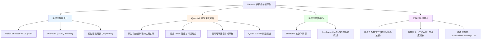
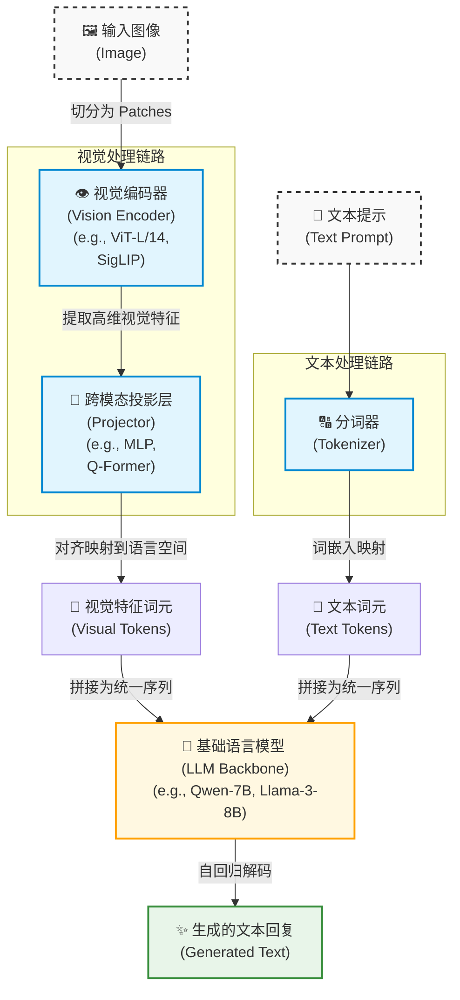
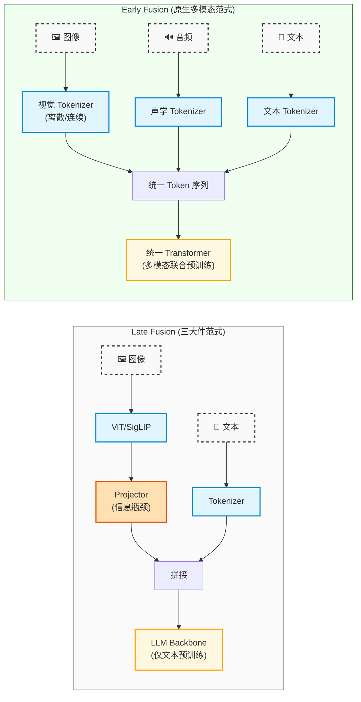

# Week 8 讲义：多模态架构设计与长序列处理

> **核心目标**：深入理解多模态 LLM 架构设计与长序列处理技术，重点关注 Qwen-VL 系列及前沿方案的设计哲学。
>
> **学习时间**：7 小时
>
> **关键输出**：多模态架构模式图 + Qwen-VL 演进分析 + 长序列方案对比表
>
> **前置要求**：已完成 Phase 1-3 的学习，熟悉 Transformer 注意力机制及 RoPE（旋转位置编码）基本原理。

---

## 📖 本周知识图谱



---

## 🧭 Part 0: 引言——走向多维度与无限上下文

在前面的学习中，我们探讨的大部分模型都是“瞎子”：它们只能处理一维的文本 Token。但在现实世界中，人类通过眼睛获取了绝对多数的信息。进入 2024 年底乃至 2025 年初，**多模态（Multimodal，特别是 Vision-Language Models, VLM）**和**超长序列（Long Context）** 已经成为了顶级大模型的“标配”。

多模态和长序列看似是两个毫不相干的话题，但它们在底层的工程挑战上往往殊途同归：
1. **多模态带来了爆炸的 Token 数量**：一张高清图片如果被切成 Patch，会产生数千个 Token；一分钟的视频更是多达数万 Token。
2. **多模态打破了一维的位置假设**：文本是从左到右的一维流，而图像是 2D 的，视频是 3D 的。我们急需新的位置编码及上下文处理方式。

本周我们将深入剖析，大模型是如何“开眼看世界”，并且如何“过目不忘”的。

> [!NOTE]
> 本周聚焦多模态的**技术实现**（"怎么做"）。如果你更想思考 VLM 与 LLM 之间那些**尚无定论的根本问题**（多模态是否真的让模型更强？架构为何不统一？理解与生成为何难以统一？），可在学完本周后阅读延伸专题 **[VLM 与 LLM 的关系与开放难点](专题学习/VLM与LLM的关系与开放难点.md)**（入口见正文末尾"🔗 延伸学习接口"）。

---

## 👁️ Part 1: 多模态 LLM 架构设计

如何让一个只懂文字的 LLM 看懂图片？最朴素的方法是给 LLM 配上“眼睛”（Vision Encoder）和“翻译官”（Projector）。

### 1.1 经典三大件架构模式

当前绝大多数开源 VLM（如 LLaVA，Qwen-VL，DeepSeek-VL）都遵循经典的 **"三大件"范式**。下面是通用的多模态大模型架构图：



> **流程图中的"拼接为统一序列"是整个多模态架构的关键接口**：文本 Tokenizer 产出的是整数 ID，视觉 pipeline 产出的是浮点嵌入向量，两者如何在 Embedding 层精确对接？Qwen-VL 使用哪些 Special Tokens 作为占位符？序列的完整格式是什么？这些问题在 **Part 2.3** 中完整展开。

#### ① 视觉编码器 (Vision Encoder)
充当“眼睛”，负责从像素中提取高维特征图。
**经典选择**：CLIP (ViT-L/14) 或者是目前更主流的 **SigLIP** (Sigmoid Loss for Language-Image Pre-training)。
- **为什么 SigLIP 成为目前的主流？**
  - **逻辑变革**：CLIP 使用的是 Softmax 损失函数，模型需要在一个全局 Batch 内计算所有图文对的相似度归一化，这对大规模并行训练不友好。
  - **Sigmoid 损失**：SigLIP 将每个图文对视为一个独立的二分类任务（匹配或不匹配）。这使得它**解耦了 Batch Size**，极大地提高了显存利用率和分布式训练的扩展性。
  - **训练效率**：在处理像 Web-scale 级别（如数十亿张图）的海量数据时，SigLIP 展现了更好的收敛速度和 Zero-shot 准确率。
- **为什么不用 CNN？** ViT（Vision Transformer）天然把图片切分为一个个 Patch（如 14x14 像素），这与大模型处理 Token 的思维完美契合。

> **📎 配套附录**
>
> 这里只交代了"选 CLIP 还是 SigLIP"，但视觉编码器**本身是怎么构建、怎么训练、VLM 又是怎么接它的**，是一个独立且分量很重的主题。
>
> - **附录 A.9**：视觉编码器的构建全解——ViT 架构本体（Patch Embedding / 双向注意力 / CLS Token）、四种预训练范式（对比 / 自监督 / 自回归 / 蒸馏）、VLM 的取层策略、分辨率三代解法，以及 CLIP → SigLIP2 → AIMv2 → RADIO 的谱系演进与 Encoder-Free 路线。

#### ② 跨模态投影层 (Projector)
充当”翻译官”，负责把 Vision Encoder 提取的特征空间转化为 LLM 认识的词向量（Embedding Space）。
- **线性/MLP Projector**：最简单，直接通过 2 层 MLP 把视觉维度映射到 LLM 维度（LLaVA 选择，Qwen-VL 大量采用）。运算快。
- **Q-Former (BLIP-2 设计)**：通过 Learnable Queries 主动压缩并提取视觉特征。参数量大，计算复杂，现在使用有减少的趋势。

> [!NOTE]
> **编码器 vs 投影层：职责不同，不可互相替代**
>
> 初学者常有一个疑问：既然投影层可以是简单的 MLP，为什么不直接把原始图像像素 / 音频波形通过一个 MLP 映射到 LLM 维度，省掉编码器？
>
> 原因在于两者职责根本不同：
> - **编码器**负责从原始信号中**提取有意义的语义表示**。图像编码器（ViT）通过分 Patch + 多层 Self-Attention，逐层建立”像素 → 边缘 → 纹理 → 物体”的层级语义；音频编码器通过卷积 + 注意力从声学谱图中提取音素级特征。这种层级抽象能力是 MLP 没有的——MLP 缺乏空间/时序归纳偏置，无法从高维原始信号中凭空学出语义结构。
> - **投影层**负责**维度对齐**：把编码器已经提取好的语义特征从视觉空间映射到 LLM 的隐空间。这一步的输入本已具备语义，任务相对简单，2 层 MLP 就足够胜任（LLaVA 的成功印证了这一点）。
>
> 两个组件缺一不可：编码器做语义提取，投影层做空间对齐。省掉编码器直接用 MLP 对接原始像素，等同于让 LLM 在无结构的数字噪声上学习视觉语义，效果会大幅退化。

> **📎 配套附录**
>
> - **附录 A.6**：跨模态投影层的历史演进——从 Perceiver / Flamingo 到 Q-Former，以及当前 MLP 为主的发展趋势

#### ③ 基础语言模型 (LLM Backbone)
提供强大的常识推理和语言组织能力（如 Qwen 系列，Llama-3 系列）。

> [!CAUTION]
> **对齐灾难（Alignment）**
> 很多初学者训练 VLM 时会发现模型“胡说八道”。这是因为视觉空间和语言空间原本毫无关联。训练时必须进行 **Vision-Language Pretraining (对齐预训练)**，在冻结 Vision Encoder 和 LLM 的情况下，用几亿张 [图-文边界对应的弱标签] 猛烈训练 Projector，强迫视觉表征“排布”到词表周围。

### 1.2 原生多模态统一架构 (Native Multimodal Unified Architecture)

上面的"三大件"范式本质上是一种 **后期融合（Late Fusion）** 思想：各模态先由独立编码器处理，最后在 LLM 的输入层才"汇合"。但以 Gemini、GPT-4o、Qwen-Omni 为代表的前沿模型走的是一条完全不同的路：**早期融合（Early Fusion）**——从架构设计之初就把多种模态视为同等地位的一等公民。

#### Early Fusion vs. Late Fusion：本质区别



| 对比维度 | Late Fusion (三大件) | Early Fusion (原生多模态) |
| :--- | :--- | :--- |
| **融合时机** | LLM 输入层才汇合 | 从第一层 Attention 就联合计算 |
| **跨模态交互** | 仅在 LLM 内部的 Self-Attention 中发生，视觉特征已经过 Projector 压缩 | 所有层的 Self-Attention 中，各模态 Token 直接互相"看"见对方的原始特征 |
| **信息瓶颈** | 存在（Projector 是窄口通道） | 不存在（同一个隐空间，同等维度） |
| **架构可扩展性** | 新模态 = 新 Encoder + 新 Projector + 新对齐训练 | 新模态 = 新 Tokenizer + 混入预训练数据即可 |

#### 原生多模态的三种子范式

根据视觉信息进入 Transformer 的方式不同，原生多模态架构可以进一步细分为三种设计流派：

##### 范式 A：连续 Token 早期融合

**代表**：Gemini 系列 (2.5 Pro/3.x), GPT-4o, Qwen2.5-Omni / Qwen3-Omni / Qwen3.5-Omni

- **视觉处理**：仍然使用 ViT 类编码器提取**连续的高维特征向量**（Continuous Embeddings）。
- **关键区别**：这些编码器不是"外挂"的独立模型，而是在模型架构设计之初就**内嵌进去**的组成部分。视觉编码器的输出通过一个轻量投影层映射到与文本 Token 完全相同的隐向量维度，然后**直接混入文本 Token 序列中**，交给统一的 Transformer 骨干一起计算。
- **预训练方式**：模型从预训练的第一天起就同时吞入图文交错的数据（详见 1.3 路线 B），因此跨模态对齐是在 Transformer 全部层中通过海量数据"自然涌现"的，而非靠一个薄薄的 Projector 强行桥接。
- **优势**：连续特征保持了视觉信息的高保真度；Transformer 全层深度融合，跨模态理解最深。
- **劣势（历史遗留，已被部分突破）**：视觉 Token 天然不在离散词表里，模型**纯粹靠自回归生成离散图像 Token 的能力受限**——但 2025 年 GPT-4o 通过引入 Transfusion 架构（见范式 C 新亚种），在同一 Transformer 骨干中内置扩散解码器，实现了原生图像生成，这一劣势正在被消解。

**2025-2026 最新进展**

| 模型系列 | 最新进展 |
| :--- | :--- |
| **Gemini** | 迭代至 Gemini 2.5 Pro (2025年3月，1M+ token 上下文，原生多模态推理能力大幅提升，支持 3 小时视频理解)；2025年底 Gemini 3 Flash 发布，2026年2月 Gemini 3.1 Pro 发布 |
| **OpenAI GPT 系列** | 三步跃迁：① **GPT-4o 原生图像生成**（2025年3月，Transfusion 架构，打破"只能理解不能生成"）；② **o3 / o4-mini**（2025年4月，推理模型首次具备完整视觉推理，可在 thinking 链中分析图像）；③ **GPT-5**（2025年8月，**从头进行原生多模态联合训练**，视觉与文本能力从预训练第一天起协同发展，不依赖任何已有的纯文本基座，是 OpenAI 迄今最彻底的原生多模态实现）；GPT-4o 于 2026年2月退出 ChatGPT 主力 |
| **Qwen-Omni 系列** | Qwen2.5-Omni (2025年3月)引入 **Thinker-Talker 架构**与 **TMRoPE**（时间对齐多模态位置编码，同步视频与音频时间戳）；Qwen3-Omni 升级至 MoE-based Thinker-Talker 设计，音视频基准 36 项中 22 项达到 SOTA；Qwen3.5-Omni (2026年3月) 语音识别覆盖 113 种语言 |
| **Kimi K2.5**（Moonshot AI） | 2026年1月发布，架构为三大件（**MoonViT-3D** + MLP + **Kimi K2 MoE** 骨干，1T 总参数 / 32B 激活），但训练方式上采用三阶段约 **15T 图文视频 token 的联合继续预训练**，已跨越"先训 LLM 再接 Projector 对齐"的传统路线 A 边界。关键工程洞察：**早期低比例均衡视觉融合**（将视觉 token 以固定比例从预训练起持续混入，而非后期集中），在固定 token 预算下优于后期集中视觉训练。MoonViT-3D 基于 SigLIP-SO-400M，支持视频帧四帧分组时序池化（4× 压缩），是目前开源最强的视觉-代理（Visual Agentic）模型之一 |

> [!TIP]
> **Qwen-Omni 的 Thinker-Talker 架构**：Thinker 是核心 LLM（处理所有模态的理解与推理），Talker 是一个轻量流式语音解码器（实现实时语音输出）。两者共享 Transformer 骨干的隐状态，不需要额外的 TTS 后处理，是端到端语音交互模型的典型实现。（Thinker-Talker 的深层原理——为何共享隐状态优于独立 TTS pipeline，以及 TMRoPE 时间对齐位置编码——将在 **Week 13 Qwen 全家桶深度解析** 中系统展开。）

##### 范式 B：离散 Token 统一自回归

**代表（早期）**：Meta Chameleon (2024), BAAI Emu3 / Emu3.5 (2025年10月)

- **核心创新**：用一个 **视觉 Tokenizer**（如基于 VQ-VAE / VQ-GAN 的离散码本）把图像从像素转化为**离散的视觉 Token**——本质上给每个图像 Patch 分配了一个"视觉词汇 ID"，就像文字被 BPE 分词一样。
- **统一词表**：文本词表（如 65,536 个词元）和视觉码本（如 8,192 个视觉词元）合并为一个统一的超大词表。在模型眼中，图像 Token 和文字 Token**地位完全平等、不可区分**。
- **Any-to-Any 生成**：由于所有模态都是离散 Token，模型可以用统一的 Next Token Prediction 目标进行自回归生成——**既能看图说话，也能根据文字直接"吐出"图像 Token**，再由解码器还原为像素。这实现了真正的"全模态输入 + 全模态输出"。
- **劣势**：离散化过程必然带来**量化损失**——视觉码本的容量有限，无法完美还原所有高频细节。目前离散化方案在图像生成质量上通常不如专用的扩散模型。

**2025-2026 最新进展**

这一范式在 2025 年经历了明显的分化：

- **Meta 放弃 Chameleon 路线**，转而研究更有效率的 Transfusion 方案（混合连续+离散，见范式 C）。
- **BAAI Emu3.5 (2025年10月)** 是该路线最活跃的代表。Emu3.5 在超 10 万亿 token 的图文交错数据上端到端预训练，实现了文本/图像/视频的统一生成。工程上，它提出了 **DiDA（Discrete Diffusion Adaptation）**，将逐 token 的自回归解码转换为双向并行预测，图像生成推理速度提升约 **20 倍**，有效缓解了离散路线推理慢的痛点。

> [!NOTE]
> **范式 B 的核心困境**：量化损失 + 超长序列 = 双重瓶颈。一张 256×256 的图像经 VQ 分词后约产生 256 个离散 Token，而高清图像会更多；自回归地逐 Token 生成图像本身非常慢。Emu3.5 的 DiDA 是一种工程缓解方案，但离散路线在生成质量和速度上的挑战依然存在，这也是 Meta 等选择转向 Transfusion 的主要原因。

##### 范式 C：混合式

**设计哲学**：既然连续 Token 理解强但不能直接生成图像，离散 Token 能生成但有量化损失——那就**两者都要**。但"两者都要"的具体实现，在 2025 年分化出了两条截然不同的技术路线：

---

**亚种 C1：连续理解 + 离散生成（编码器/解码器解耦）**

**代表**：DeepSeek Janus-Pro (2025年1月)

- **实现方式**：输入侧用 **SigLIP 提取高维连续语义特征**（保证理解精度），输出侧用 **VQ Tokenizer 将图像转化为离散 ID** 再自回归生成（实现文生图）。两条通路输出均进入**同一个共享 Transformer 骨干**。
- **关键洞察**：理解任务需要语义层面的特征（全局抽象），生成任务需要像素层面的特征（局部细节）——将二者**解耦**，各自用最适合的编码器，再在 Transformer 内联合推理，有效避免了"一个 Encoder 同时服务两个方向"时的目标冲突。
- **Janus-Pro 的改进**：Janus-Pro 相对于原始 Janus，扩大了训练数据和模型规模，在 GenEval 图像生成基准上以 **84.2%** 超过 DALL·E 3（83.5%），是同等参数规模下最强的开源统一多模态模型之一。

**2025年后续发展与演进方向**

C1 路线在 Janus-Pro 之后出现了明显的分化：

- **JanusFlow（DeepSeek，2025年1月，与 Janus-Pro 同期）**：最重要的直接续作。DeepSeek 保留了"理解/生成双编码器解耦"的核心设计，但将生成侧从 VQ 离散自回归替换为 **Rectified Flow（连续流式扩散）**——本质上是向 C2 的生成方式迁移。这一演变表明 DeepSeek 自己也认识到 VQ 量化是 C1 的质量天花板。
- **ILLUME / ILLUME+（腾讯，2025年）**：沿用双编码器路线，将解耦设计扩展至视频理解与生成场景，是 C1 在视频侧最活跃的开源工作。
- **SEED-X（字节跳动）**：保留解耦编码器，在生成侧引入多层级码本设计，尝试在不放弃离散路线的前提下提升生成质量。

> [!NOTE]
> **C1 的历史贡献与局限**：C1 路线验证了"**理解特征 ≠ 生成特征**"这一关键洞察——理解任务依赖全局语义抽象，生成任务依赖像素级局部细节，两者强行共享同一编码器会产生目标冲突。这个结论是正确的，并被后续工作（包括 JanusFlow、ILLUME+）延续。但 VQ 离散生成本身的量化损失是结构性短板，随着 C2（Transfusion）在工业级模型中完成验证，纯 C1 路线的热度在 2025 年后明显下降，"解耦编码器"的思想则作为设计原则被吸收进更新的混合架构。

---

**亚种 C2：连续理解 + 扩散生成（Transfusion）**

**代表**：Meta Transfusion (2024年8月提出)，GPT-4o 原生图像生成 (2025年3月落地)

- **核心创新**：不做视觉离散化，而是在同一个 Transformer 骨干中**并存两种训练目标**：
  - 文本 Token：使用标准的 **Next Token Prediction（自回归）**；
  - 图像区域：将图像编码为 **VAE 潜在空间的连续向量**，使用 **扩散目标（Diffusion Loss）** 进行训练与生成。
- **注意力模式的差异**：文本 Token 使用**因果掩码注意力**（只看左侧），图像 Patch 在同一个图像块内使用**双向注意力**（互相可见），两者在序列中由特殊控制 Token `<BOI>`/`<EOI>` 分界。
- **生成流程**：Transformer 自回归地输出文本描述 + 图像的视觉潜在表示（Latent Plan），再由内置扩散解码器从噪声中逐步还原为像素图像。
- **优势**：规避了离散化带来的量化损失；生成质量接近甚至超过专用扩散模型；理解能力因保留连续特征而不损失。
- **落地验证**：Meta 在论文中展示 7B 参数的 Transfusion 模型在图文生成上均与同规模专用模型相当；OpenAI 的 GPT-4o 原生图像生成（2025年3月）被广泛认为是 Transfusion 架构的商业落地，实现了精准的文字渲染、多轮上下文感知的图像编辑等能力。

> [!IMPORTANT]
> **亚种 C2 的意义**：Transfusion 是目前唯一在工业级模型中验证了"理解质量不降 + 生成质量媲美扩散模型"的架构方案，被认为是 2025 年最重要的多模态架构创新之一。它本质上是对范式 A（连续理解）的扩展，在保留其全部优势的同时，通过引入内置扩散解码消除了范式 A 的最大短板。（深层机制见 **附录 A.7**：VAE 潜在空间与 Patchification、混合注意力掩码设计、双目标损失函数、含 CFG 的推理流程，以及与 Chameleon 的同算力对比实验。）

---

**其他代表：Qwen-VL 理解侧的演进**

Qwen 的 VL（纯视觉理解）分支和 Omni（全模态）分支是分开维护的，前者聚焦于图文/视频理解的极致质量：
- **Qwen2.5-VL（2025年1月）**：Qwen-VL 系列的重大迭代，支持原生动态分辨率，最大上下文 128K，72B 参数版本在多个 VQA 和文档理解基准上超越 GPT-4V（详见 Part 2）。
- **Qwen3-VL（2025年11月）**：进一步升级，增加 MoE 变体（30B-A3B / 235B-A22B），原生支持 256K 交错上下文；同时引入 Dense 版本（2B/4B/8B/32B），覆盖从移动端到服务器端的全场景部署需求。

**三种范式的演进总结（截至 2026 年初）**

| 维度 | 范式 A（连续早期融合）| 范式 B（离散统一自回归）| 范式 C-1（解耦混合）| 范式 C-2（Transfusion）|
| :--- | :--- | :--- | :--- | :--- |
| **理解质量** | ⭐⭐⭐⭐⭐ 最强 | ⭐⭐⭐ 受量化损失影响 | ⭐⭐⭐⭐ 理解侧连续 | ⭐⭐⭐⭐⭐ 与范式A相当 |
| **生成能力** | ⭐⭐ 原本无法直接生成 | ⭐⭐⭐ 能生成但质量受限 | ⭐⭐⭐⭐ 离散生成 | ⭐⭐⭐⭐⭐ 接近专用扩散模型 |
| **架构统一性** | 高 | 最高 | 中（双编码器） | 高（单 Transformer） |
| **代表模型** | Gemini 3.x, Qwen-Omni | Emu3.5 | Janus-Pro | GPT-4o (图像生成), Transfusion |
| **发展趋势** | 稳健迭代，通过 C2 弥补生成短板 | 热度下降，Meta 已转向 C2 | 开源社区活跃 | **2025 年最热门方向** |

> [!NOTE]
> **架构 vs. 训练的关系**
> 细心的同学会注意到：1.2 讲的是**架构形态**（模型长什么样），而接下来的 1.3 讲的是**训练方式**（模型怎么教）。两者密切相关但不完全绑定。例如，即使是"三大件"架构，如果在预训练阶段就混入图文数据（如 Qwen2.5-VL 的做法），也可以部分获得原生多模态的深度融合优势。反过来，原生多模态架构也需要精细的多阶段训练策略。**架构决定能力上限，训练决定能力下限。**

### 1.3 多模态大模型的训练管线 (Training Pipeline)

目前业界在多模态大模型的训练上，存在两条截然不同的路线。理解它们的区别，是搞清楚"Gemini / Claude 和 LLaVA 到底有什么本质不同"的关键。

---

#### 路线 A：模块化拼接训练 (Modular Assembly)
**代表作**：LLaVA, 早期 Qwen-VL, DeepSeek-VL, InternVL

> 这正是 1.2 节中 **"三大件"Late Fusion 范式** 在训练层面的对应：架构上是 Vision Encoder + Projector + LLM 的拼接，训练上也是各模态分阶段独立训练后再对齐。这一路线属于**非原生多模态**方案。

这是开源社区最主流、复现成本最低的方案。核心思路是：**分别训练好各模态的"专家"，再用胶水（Projector）粘在一起**。

##### Stage 0: 单模态基座各自预训练
*在"组装"多模态模型之前，各个组件在各自的领域单独发育。*

- **视觉编码器预训练**：在纯视觉（或图文对比学习）任务上训练。例如，CLIP/SigLIP 通过海量图文对进行对比学习（Contrastive Learning），让相似的图文在特征空间靠近；或者像 ViT 一样在 ImageNet 上做分类/掩码重建。这一步让"眼睛"学会提取高质量的视觉特征，但此时它**不能和语言模型交流**。
- **大语言模型基座预训练**：在海量纯文本数据上进行 Next Token Prediction 训练（如 Llama-3, Qwen2）。这一步让"大脑"掌握了语法、逻辑和丰富的世界知识，但**它是瞎的**。
- **关键特征**：这两个组件通常是**分开单独训练好**的成品，甚至可以直接从开源社区下载（比如直接拿 OpenAI 练好的 CLIP-ViT-L 和 Meta 练好的 Llama-3-8B），然后像搭积木一样拼在一起。

##### Stage 1: 对齐预训练 (Vision-Language Alignment)
*用"翻译官"连接瞎子大脑和哑巴眼睛。*

- **核心目标**：让 LLM "认识"视觉 Token，建立视觉概念到语言空间的基础映射。
- **训练数据**：海量简单的**图文对（Image-Text Pairs）**，如 LAION、CC3M，形式通常为"一张图 + 一句短描述"。
- **模型状态**：**冻结** Vision Encoder 和 LLM，**仅训练 Projector**。保护 LLM 的智力不被简单的短句"洗脑"。

##### Stage 2: 多模态指令微调 (Multimodal Instruction Tuning)
*从"能看懂"走向"会推理"。*

- **核心目标**：赋予模型复杂图文推理、OCR、图表分析等高阶能力。
- **训练数据**：高质量多模态指令数据集。**必须混合纯文本指令数据**，防止灾难性遗忘（Catastrophic Forgetting）导致文本能力断崖下降。
- **模型状态**：**放开 Projector + LLM 全参数**联合微调（有时也解冻 Vision Encoder 后几层）。

> [!NOTE]
> **路线 A 的局限性**：由于各模态是先分别训练再拼接的，模型对跨模态信息的理解深度本质上受限于 Projector 这层"薄薄的翻译层"能传递多少信息。并且，每新增一种模态（音频、视频），都需要额外新加一套 Encoder + Projector + 对齐训练，扩展性差。

---

#### 路线 B：原生多模态训练 (Native Multimodal / Omni Training)
**代表作**：Google Gemini 系列, Anthropic Claude 系列, OpenAI GPT-4o, Qwen-Omni

这是当前**最前沿的闭源顶级模型**所走的路线。核心哲学完全不同：**不再是先训好一个纯文本大脑再外挂眼睛，而是从一开始就让模型同时在多种模态的海量数据中成长**。

##### 核心区别：预训练阶段就吃多模态数据

- **Route A 的预训练阶段**：LLM Base 只吃纯文本。
- **Route B 的预训练阶段**：模型从 Day 1 开始就同时吞入**文本、图像、音频、视频**等多模态数据进行联合预训练。

具体来说，训练数据的排布方式是**原生交错（Interleaved）**：
```text
训练样本示例 (一条完整的训练序列):
[text_tokens: "这张图里，"] [image_tokens: 🖼️一只猫的图片特征] 
[text_tokens: "一只猫正在桌子上"] [audio_tokens: 🔊一段猫叫声特征]
[text_tokens: "发出叫声。在这段视频中，"] [video_tokens: 🎬猫跳下桌子的视频特征] 
[text_tokens: "这只猫从桌上跳了下来。"]
```
模型在统一的**自回归序列建模框架**下训练，把所有模态都映射成排布在同一个序列中的 Token。但要注意这里的"统一"指的是**序列框架统一**，并非所有模态都用同一种损失：真正参与 **Next Token Prediction 交叉熵**的主要是**文本（及离散化后的）Token**，连续模态 Token 多数情况下只作为**条件输入**、其位置损失被屏蔽（连续 Token 为何无法做 NTP、跨模态关联又如何学到，详见**附录 A.10**）。即便如此，模型在学习"下一个词是什么"的同时，**天然就学会了跨模态关联**——因为图像 Token 和描述它的文本 Token 本来就紧挨着出现，而**预测后者必须回看前者**。

**那各模态到底用什么损失？** 既然"统一"不等于同一种损失，这里先给一张速查表，把不同模态处理方式对应的训练目标并列出来（为何如此、完整推导见**附录 A.10**）：

| 模态处理方式 | 训练目标 | 监督形式 | 对应范式 |
| :--- | :--- | :--- | :--- |
| 文本 Token | Next Token Prediction | 词表上的交叉熵 | 所有路线通用 |
| 连续视觉/音频 Token（**仅理解**） | 不预测，仅作条件输入 | 位置损失屏蔽（label = -100） | 范式 A（Qwen-VL、LLaVA） |
| 离散视觉 Token（VQ 码本） | Next Token Prediction | 码本上的交叉熵 | 范式 B（Chameleon、Emu3） |
| 连续视觉 Token（**要生成**） | 扩散去噪 | latent 上的 MSE（回归噪声） | 范式 C-2（Transfusion，见附录 A.7） |

一句话记忆：**NTP 是离散世界的损失；连续模态要么"只看不说"（当条件），要么换上扩散这套连续世界的损失来做生成。**

##### 全模态输入是如何实现的？

你问的"文本、图像、视频、音频都能接受"，Gemini / Claude / GPT-4o 大致的做法是：

1. **每种模态仍然有各自的编码器（Encoder）**：图像用 ViT 变体、音频用类似 Whisper 的声学编码器、视频则通常是对关键帧的视觉编码 + 时序特征提取。这些编码器不是"外挂"的，而是模型架构设计时就**内嵌进去**的组成部分。（"内嵌"到底相对谁而言、是否意味着"从零随机初始化训练"，以及为何各模态仍需独立编码器，详见**附录 A.11**）
2. **统一 Token 空间**：各编码器的输出都通过各自的投影层映射到**同一个隐向量维度空间**，变成和文本 Token 同等地位的"模态 Token"。
3. **一个统一的 Transformer 骨干**：所有模态的 Token 被拼成一条长序列，交给同一个巨型 Transformer 处理。在 Transformer 内部，文本 Token、视觉 Token、音频 Token 之间可以通过 Self-Attention **自由地互相"看到"对方**，实现深层跨模态融合。

**简单类比**：路线 A 像是"一个纯理科生毕业后去美术馆工作，配了个翻译帮忙看画"；路线 B 像是"一个人从小就在美术馆长大，同时学习语言和看画，跨模态理解是刻进 DNA 的"。

##### 为什么原生路线效果更强？

| 对比维度 | 路线 A (模块化拼接) | 路线 B (原生多模态) |
| :--- | :--- | :--- |
| **跨模态理解深度** | 受限于 Projector 的信息瓶颈 | Transformer 全层深度融合，无瓶颈 |
| **新模态扩展** | 每加一种模态需新增 Encoder + 重新对齐 | 架构天然支持，预训练已覆盖 |
| **跨模态推理** | "翻译后推理"，有信息损耗 | "母语级"理解，反应更自然流畅 |
| **训练算力成本** | 低（可用开源基座 + 少量 GPU） | 极高（需从零联合预训练，仅顶级实验室可承受） |
| **典型代表** | LLaVA, InternVL, 早期 Qwen-VL | Gemini, Claude, GPT-4o, Qwen-Omni |

> [!IMPORTANT]
> **两条路线并非完全对立，当前正在趋同。** 开源社区也在向原生方向靠拢（如 Qwen2.5-VL / Qwen-Omni 开始在预训练阶段混入视觉数据），而闭源模型内部也可能在微调阶段使用模块化的分阶段策略。未来的趋势是**原生多模态预训练 + 精细化多阶段微调**的混合方案。

---

## 🦅 Part 2: Qwen-VL 系列深度解析与最新演进

了解了通用架构，我们来看看开源界多模态标杆之一的 **Qwen-VL 系列** 是如何在工程上将架构推向极致的。它经历了 Qwen-VL $\rightarrow$ Qwen2-VL $\rightarrow$ Qwen2.5-VL/Qwen3 的快速演进。

### 2.1 动态分辨率 (Native Dynamic Resolution) 及其工程实现

大部分早期视觉模型（如 CLIP, LLaVA-1.5）都有一个致命缺点：**锁死分辨率**（比如强行将图片 Resize 缩放或 Crop 裁剪成固定的 $224 \times 224$ 或 $336 \times 336$）。
- **如果是长条报表**：被压扁后全是糊的，根本无法 OCR (文字识别)。
- **如果硬切**：会丢失全局上下文。

**Qwen-VL 系列的核心突破**：支持 **原生动态分辨率**。模型不需要把图片压成一个正方形，而是根据图片原始的长宽比，把图片动态切分成由 $M \times N$ 个 Block（区块）组成的网格。

其具体切分逻辑如下：
1.  **像素对齐**：将原始图像的长宽 $(H, W)$ 按比例缩放，并向上取整补齐以满足底层视觉编码器的划分对齐限制：
    - **Qwen2-VL / Qwen2.5-VL**：其使用的是衍生自 **DFN (Data Filtering Networks) 的 ViT (约 675M 参数)**，基础 Patch Size 为 14。后续会进行 2x2 的 Merging，因此要求宽和高必须补齐到 $14 \times 2 = \mathbf{28}$ 的倍数。（DFN 的架构与训练方法详见**附录 A.1**）
    - **Qwen3-VL**：底层视觉编码器升级为集成了 **DeepStack (多层特征融合)** 的新一代 ViT，基础 Patch Size 变更为 16。因此与之对应，要求宽和高必须补齐到 $16 \times 2 = \mathbf{32}$ 的倍数。（DeepStack 的架构原理详见**附录 A.2**）
2.  **动态 Grid**：将对齐后的图像划分为 $\frac{H}{N} \times \frac{W}{N}$ 的视觉 Patch 阵列（Qwen2 时代 $N=28$，Qwen3 时代 $N=32$）。
3.  **序列化与换行**：将 Patch 阵列按行优先顺序平铺为 1D 序列，并在每一行视觉 Token 结束时插入一个特殊的 `<|vision_newline|>` Token。这让 LLM 即使在处理 1D 序列时，也能通过该“换行符”感知到图像的 2D 边界。

#### 🛠️ 工程落地难点：不等长序列如何 Batch？

在实际的工程实现（如 PyTorch）中，Transformer 必须组装成整齐的 Batch 才能矩阵运算。如果不同图片的长宽不一样、切分后的 Token 数量不同，怎么算 Attention 呢？
**Qwen 的解决方案：Padding + 2D Position Mask**

1. 将所有不同数量的视觉 Token 平铺为 1D 序列。
2. 对于较短的序列进行 Padding（填充假 Token）。
3. **最关键的是：** 在 Flash Attention 的 Mask 矩阵中，显式告诉模型哪些 Token 属于同一行（宽度维度），哪些 Token 属于同一列（高度维度）。通过 2D-RoPE（后文详述），即使被平铺和 Padding，模型依然能完美感知 Token 的真实二维几何拓扑，从而实现真正的“无损动态分辨率”。

### 2.2 视觉 Token 池化与特征融合 (2x2 Merging)

#### 问题：视觉 Token 太多了

先感受一下数量级。一张 1080P 图像（1920×1080），ViT 以 14×14 像素为一个 Patch 切割，得到约：

$$\frac{1920}{14} \times \frac{1080}{14} \approx 137 \times 77 \approx \mathbf{10{,}549} \text{ 个视觉 Token}$$

如果全部送进 LLM，仅这一张图就占掉万级别的上下文窗口，Attention 的计算量是 $O(n^2)$，显存和速度都完全不可接受。所以**在 ViT 和 LLM 之间，必须有一个压缩步骤**。

#### Qwen2-VL 的方案：2×2 局部合并

Qwen2-VL 在 Projector 中内置了一个极其简洁的压缩机制：将 ViT 输出的视觉 Token 按空间位置分组，每 **2×2 个相邻 Token 合并为 1 个**。

```text
ViT 输出（8×8 示意）：       合并后（4×4）：
┌──┬──┬──┬──┬──┬──┬──┬──┐   ┌────┬────┬────┬────┐
│T₁│T₂│T₃│T₄│T₅│T₆│T₇│T₈│   │    │    │    │    │
├──┼──┼──┼──┼──┼──┼──┼──┤   │ M₁ │ M₂ │ M₃ │ M₄ │
│T₉│··│  │  │  │  │  │  │   │    │    │    │    │
├──┼──┼──┼──┼──┼──┼──┼──┤   ├────┼────┼────┼────┤
│  │  │  │  │  │  │  │  │   │    │    │    │    │
├──┼──┼──┼──┼──┼──┼──┼──┤   │ M₅ │ M₆ │ M₇ │ M₈ │
│  │  │  │  │  │  │  │  │   │    │    │    │    │
└──┴──┴──┴──┴──┴──┴──┴──┘   └────┴────┴────┴────┘
         64 个 Token                  16 个 Token（减少 75%）
```

每个合并后的 Token $M_i$ 由其对应的 4 个原始 Token 生成：

$$M_i = \text{MLP}\!\left(\text{Concat}(T_{a},\, T_{b},\, T_{c},\, T_{d})\right)$$

其中 $T_a, T_b, T_c, T_d$ 是空间上相邻的 2×2 块。Concat 将 4 个维度为 $d$ 的向量拼接为 $4d$，再由 MLP 投影回 $d$。

#### 为什么不用 Average Pooling？

最简单的压缩方式是对 4 个 Token 求平均：$M_i = \frac{T_a + T_b + T_c + T_d}{4}$。这样做的问题是：

- **平均会抹平差异**。如果 $T_a$ 是一条文字笔画的边缘（激活值很大），$T_b, T_c, T_d$ 是空白区域，平均后边缘信号被大幅稀释。
- **无法学习非线性关系**。4 个 Token 之间的空间关系（哪个在左上、哪个在右下）对理解局部结构很重要，Average Pooling 完全丢掉了这些位置差异。

MLP 方案的优势：
- **Concat 保留了所有原始信息**（4 个 Token 的完整特征都在，只是拼在一起），MLP 再从中学习取舍；
- **MLP 可以学习非线性的局部特征**，例如识别"这 4 个 Token 里有一条水平线"，并在合并后的表示中保留这一结构信号；
- 这也是 Qwen2-VL 能准确识别发票、表格、代码截图中精细文字的关键原因。

#### 效果

| 场景 | 合并前 Token 数 | 合并后 Token 数 | 节省比例 |
| :--- | :--- | :--- | :--- |
| 1080P 图像（约 10K Patch） | ~10,549 | ~2,638 | 75% |
| 4K 图像（约 42K Patch） | ~42,197 | ~10,550 | 75% |
| 视频（32 帧 × 720P） | ~53K | ~13K | 75% |

固定 75% 的压缩比使得 Qwen2-VL 在处理超高清图像和长视频时，视觉 Token 数量始终保持在 LLM 上下文窗口的可接受范围内。

#### Qwen 系列后续版本的压缩方案演进

2×2 MLP Merging 的基本机制在后续版本中被保留，但各版本在此基础上各有补充：

**Qwen2.5-VL（2025年1月）**：沿用相同的 2×2 MLP Merging，主要迭代在训练数据质量和动态分辨率的极限扩展，压缩机制本身未变。

**Qwen3-VL（2025年11月）**：保留 2×2 Merging 的同时，新增了 **DeepStack 多层特征融合**机制。过去 Qwen2-VL 只取 ViT 最终层的输出，Qwen3-VL 改为从 ViT 的**第 8、16、24 层**各抽取一组中间特征，与最终层特征一起融合后再送入 Projector。这样的好处是：最终层特征擅长高层语义（"这是一只猫"），中间层特征保留了更多低层视觉细节（边缘、纹理、细小文字），DeepStack 将两者结合，在表格、图表、UI 截图等细粒度任务上有明显提升。整体空间压缩比约为 **32×**，单图视觉 Token 数控制在 256–1280。

**Qwen3.5-Omni（2026年3月）**：视觉侧继承 Qwen3-VL 的编码器（含 2×2 Merging + DeepStack），并新增 **Chunked Prefilling**：视觉/音频编码器沿时序维度将特征**分块输出**，而非等整个视频/音频处理完毕再一次性送入 LLM。这大幅降低了长视频推理的首 Token 延迟（TTFT）。底层 LLM 骨干改为 Hybrid MoE + **Gated Delta Net（GDN）** 模块，GDN 有线性复杂度，专门针对长音视频序列加速，并显著减少 KV Cache 的 I/O 开销。

> [!NOTE]
> **三个名词速查（它们分别属于推理优化与架构演进，本节只是顺带提及，完整内容在 Week 6 / Week 12-13）**
>
> - **Chunked Prefilling（分块预填充）**：Prefill 是 LLM 推理的第一阶段——把全部输入 Token 跑一遍前向、建好 KV Cache，才吐出第一个输出 Token（见 Week 6）。常规做法要**等整段视频/音频编码完**才能开始 Prefill，长视频会让首 Token 等很久。分块预填充让编码器**沿时间轴边编码边分块吐 Token**，与 LLM 的 Prefill **流水线并行**，从而压低 TTFT。
> - **Gated Delta Net（GDN）**：一种**线性注意力**模块。标准 Self-Attention 是 $O(n^2)$ 且 KV Cache 随序列线性膨胀；线性注意力改用一个**固定大小的状态**循环式地"压缩记忆"过去信息，复杂度降到 $O(n)$、且**没有不断变大的 KV Cache**（这是它省 I/O 的根因），代价是精确检索（recall）弱于全注意力。GDN 在此基础上加了**门控 + delta 更新规则**（可选择性覆盖/遗忘记忆）以尽量保住 recall，由 Qwen3-Next 引入。
> - **Hybrid MoE**：这里的 **"Hybrid" 指注意力层的混合**——大部分层用线性的 GDN、每隔几层插一层标准全注意力（取 GDN 的效率 + 全注意力的 recall），再配上 **MoE 前馈**（MoE 见 Week 2）。即"(GDN + 少量全注意力) 混合骨干 + MoE FFN"，而非"把多个 MoE 混在一起"。

> [!NOTE]
> **关于 Qwen3.6**：Qwen3.6 是 Alibaba 发布的纯文本语言模型（LLM backbone），不包含视觉能力，属于 Qwen3.x 文本系列。多模态模型线是 Qwen-VL 系列（Qwen2-VL / Qwen2.5-VL / Qwen3-VL）和 Qwen-Omni 系列（Qwen2.5-Omni / Qwen3-Omni / Qwen3.5-Omni），两条线独立维护。

#### 业界主流方案横向对比

| 方案 | 代表模型 | 核心做法 | 压缩比 | 主要权衡 |
| :--- | :--- | :--- | :--- | :--- |
| **2×2 MLP 合并** | Qwen2-VL / 2.5-VL / 3-VL，InternVL2（称 Pixel Shuffle）| 2×2 块 Concat → 2 层 MLP | 固定 75% | 保留空间结构，细节可学习，但压缩比固定 |
| **AnyRes Tiling（无压缩）**| LLaVA-NeXT / LLaVA-HD | 把高清图切 Tile，每 Tile 独立过 ViT，全部 Token 拼接 | 0%（不压缩）| 细节保留最完整，但 Token 数巨大，靠大上下文窗口兜底 |
| **固定查询压缩（Q-Former）**| BLIP-2 / InstructBLIP | 32 个可学习 Query 主动压缩为固定长度 | ~97%（1000 → 32）| 输出固定、推理快，但信息瓶颈严重，高分辨率细节损失大 |
| **Perceiver Resampler** | Flamingo / Idefics | N 个 Latent Query 通过 Cross-Attention 提取 | 可调，通常 ~90% | 灵活，能处理变分辨率，但结构复杂 |
| **自适应 Token 压缩（新兴）**| ZipVL、ATP-LLaVA、EvoComp | 按注意力分布 / 语义重要性动态决定每层压缩比 | 动态（内容相关）| 效率最高，但训练和工程复杂，尚未成为主流 |

InternVL2 的 Pixel Shuffle 与 Qwen2-VL 的 2×2 MLP Merging 在数学上完全等价——都是把 2×2 空间相邻块拼接后线性投影，只是命名来自不同领域（Pixel Shuffle 源自超分辨率领域的 ESPCN 论文），两家独立设计出同样的结构，印证了这一方向的合理性。

2025–2026 年的前沿趋势：自适应 Token 压缩是当前学界最活跃的方向之一。核心思路是：图像中不同区域的信息密度差异巨大（白色背景 vs 密密麻麻的表格），用固定 75% 的比率对所有区域一视同仁是浪费——应当让模型"看内容决定压缩比"。ZipVL 通过逐层注意力分数分布动态决定压缩率，ATP-LLaVA 在 LLM 解码器层内部插入自适应剪枝模块，EvoComp 用语义引导的进化标注训练一个轻量压缩器。2026 年 TMLR 发表了该方向的综合综述，CVPR 2026 上也有多篇相关论文。这一方向距离工程落地还有一段距离，但代表了下一代视觉 Token 压缩的演进方向。

> **📎 延伸专题**：视觉 Token 压缩本身是一个独立且 2024–2026 极其活跃的方向，远不止本节的 2×2 Merging。完整的设计空间——**压缩可发生的四个位置**（ViT 内 / Projector / LLM 解码器内 / KV Cache）、**合并 vs 剪枝两大范式**、FastV / VisionZip / TokenPacker 等代表工作，以及自适应压缩与评测陷阱——整理在 `专题学习/视觉Token压缩.md`。

> 现在我们知道了视觉 Token 的数量（2.1 节决定总 Patch 数，2.2 节 ÷4 压缩）。下一节将回答：**这些视觉 Token 和文字 Token，最终是以什么格式拼在一起送给 LLM 的？**

### 2.3 多模态 Tokenizer：文本与视觉 Token 的序列组织

> 这是整个多模态流水线中最容易被忽视的一环——视觉 pipeline 产出的是浮点向量，文本 pipeline 产出的是整数 ID，两者必须在某个精确的接口处"对齐拼接"，LLM 才能统一处理。本节解释这个接口是如何设计的。

#### 2.3.1 文本 Tokenizer 的多模态扩展：Special Tokens

Qwen-VL 系列的文本 Tokenizer（基于 tiktoken 的 BPE，参考 **Week1 Part 0**）在原有约 15 万个文本 token 之外，专门扩展了一批多模态控制用 Special Tokens：

| Token | 作用 |
| :--- | :--- |
| `<\|vision_start\|>` | 标记视觉内容块的开始 |
| `<\|vision_end\|>` | 标记视觉内容块的结束 |
| `<\|image_pad\|>` | 图像视觉 Token 的占位符，每个视觉 Token 对应一个 |
| `<\|video_pad\|>` | 视频帧视觉 Token 的占位符 |
| `<\|vision_newline\|>` | 图像每行末尾的换行标记，帮助 LLM 感知 2D 边界（见 2.1 节）|

这些 token 在词表中有固定的整数 ID，文本 tokenizer 可以正常处理包含这些占位符的模板字符串。

#### 2.3.2 LLM 实际看到的序列长什么样

一个"图文问答"请求，经 tokenizer 处理后，LLM 接收的完整 token 序列大致如下：

```
<|im_start|>system
你是一个有帮助的多模态助手。<|im_end|>
<|im_start|>user
<|vision_start|>
<|image_pad|><|image_pad|> ... （共 N 个，N = 压缩后的视觉 Token 数）
<|vision_end|>
这张图片里有什么？<|im_end|>
<|im_start|>assistant
```

**注意**：这个序列里 `<|image_pad|>` 只是文本侧的 ID 占位符，真正的视觉语义在 **Embedding 层**才被填入：

```
文本 token IDs: [..., vision_start_id, pad_id, pad_id, ..., vision_end_id, ...]
                                           ↓ Embedding 层
实际嵌入向量:   [..., e_start,  v₁,   v₂,  ...,  e_end,  ...]
                                 ↑ 这里不查词表，
                                   直接填入 Projector 输出的视觉嵌入向量
```

这个设计的精妙之处：**文本 tokenizer 负责生成包含占位符的"骨架"序列，视觉 pipeline 负责生成实际的嵌入向量，二者在 Embedding 层无缝对接，Transformer 主干无需感知任何区别**。

#### 2.3.3 Token 数量推导：从像素到序列长度

知道了序列结构，就可以精确计算一张图片最终会占用多少 token 位置：

**以 Qwen2-VL / Qwen2.5-VL 为例**（Patch Size=14，2×2 Merging）：

$$N_\text{visual} = \left\lfloor \frac{H_\text{aligned}}{28} \right\rfloor \times \left\lfloor \frac{W_\text{aligned}}{28} \right\rfloor \div 4$$

加上换行符 `<|vision_newline|>`（每行一个）和起止标记（`<|vision_start|>` + `<|vision_end|>`），总占用为：

$$N_\text{total} = N_\text{visual} + \left\lfloor \frac{H_\text{aligned}}{28} \right\rfloor + 2$$

**数值示例**（448×448 图像）：

| 步骤 | 计算 | 结果 |
| :--- | :--- | :--- |
| ViT Patch 数（14px/patch）| $32 \times 32$ | 1,024 个原始 Patch |
| 2×2 Merging 后 | $16 \times 16$ | 256 个视觉 Token |
| 换行符 | 16 行 × 1 个/行 | 16 个 |
| 起止标记 | 2 个 | 2 个 |
| **序列中总占用** | | **274 个位置** |

**Qwen3-VL**（Patch Size=16，2×2 Merging，分母改为 32）算法完全相同，只是对齐粒度从 28 变为 32。

这个计算对工程非常重要：当你设置批处理或监控显存时，需要预估每张图片会"吃掉"多少上下文窗口。

#### 2.3.4 连续嵌入 vs 离散视觉 Token：两种路线的本质区别

回顾 Part 1.2 的三种范式，多模态中存在**两种本质不同的视觉 Tokenization 路线**，它们在 Tokenizer 层面的表现截然不同：

| 路线 | 对应范式 | 视觉表示形式 | 是否存在于词表中 | 代表模型 |
| :--- | :--- | :--- | :--- | :--- |
| **连续视觉嵌入** | 范式 A / 三大件 | 浮点向量（d_model 维）| 否（占位符替换）| Qwen-VL、LLaVA、GPT-4V |
| **离散视觉 Token** | 范式 B | 整数 ID（视觉码本中）| 是（合并入统一词表）| Chameleon、Emu3 |

**连续路线**（Qwen-VL 所用）：词表里只有 `<|image_pad|>` 这个占位符 ID；视觉 pipeline 的输出（浮点向量）在 Embedding 层直接替换占位符位置，LLM 骨干处理的是混合了浮点视觉向量和文本嵌入向量的统一序列。无量化损失，视觉语义高保真，但模型无法通过 Next Token Prediction 直接生成图像。

**离散路线**（Chameleon / Emu3 所用）：VQ-VAE 将每个图像 Patch 量化为视觉码本中的一个整数 ID（例如 8,192 个视觉词汇之一）；这些 ID 和文字 token ID 地位完全相同，直接拼进序列，模型用同一个 Next Token Prediction 目标同时生成文字和图像。代价是量化损失（见 Part 1.2 范式 B 的讨论）。

**一句话总结**：连续路线的 Tokenizer 角色是"提供占位符、交由 Embedding 层替换"，离散路线的 Tokenizer 才是真正在做"图像→ID"的映射。两者都叫"visual tokenization"，但机制完全不同，混淆是常见误区。

### 2.4 最前沿：从 Qwen2.5 到 Qwen3 的演进

进入 2024 下半年和 2025 年初，Qwen2.5-VL 以及 Qwen3-VL 展现了极其显著的能力跨越，主要体现在：

1. **极致的视觉解析基座加强 (Qwen2.5-VL)**:
   - 显著强化了对于发票、长文档、UI 截图等富文本图像的极度细粒度阅读能力。
   - 引入了对更长视频序列的支持，通过改进的时序信息保留机制来防止丢失动作细节。
2. **通向 Omni 与架构整合 (Qwen3-VL / Qwen3.5-Omni)**:
   - **Qwen3-VL** 引入 **DeepStack** 多层特征融合（机制详见 2.2 节），在细粒度图表、表格、UI 理解上显著提升。原生支持 256K 交错上下文。
   - **Qwen3.5-Omni（2026年3月）** 进一步整合 Thinker-Talker 架构与 Hybrid MoE + Gated Delta Net 骨干，引入 Chunked Prefilling 降低长视频推理的首 Token 延迟，语音识别覆盖 113 种语言（详见 2.2 节）。
   - **视觉强化推理结合 o1-style**：Qwen 系列开始结合强化学习（RL），模型不再是”看图说话”，而是”看图思考”，能够在后台基于视觉输入展开长序列推理链，是视觉感知与 Test-Time Scaling 的结合方向（详见 Week 7）。

---

## 🗺️ Part 3: M-RoPE 与多模态位置编码的数学解耦

讲完了架构，不得不提最核心的细节改革：**位置编码机制**。在 Week 1 中我们详细学过 RoPE（旋转位置编码）。但经典的 RoPE 存在严重的局限：**它是为 1D 文本线性设计的。**

### 3.1 数学直觉：1D RoPE 是如何把 2D 图像弄“晕”的？

要理解 M-RoPE 的伟大，首先要清晰地看到 **1D RoPE 在二维空间下的荒谬性**。

#### 1D RoPE 的本质（复习）

在 1D RoPE 中，对于一个维度为 $d$ 的隐向量，位置 $m$ 处的旋转矩阵操作可简化为：
特征的每一对连续维度 $(i, i+1)$ 都会乘以一个二维旋转矩阵：
$R(m, \theta_i) = \begin{pmatrix} \cos(m\theta_i) & -\sin(m\theta_i) \\ \sin(m\theta_i) & \cos(m\theta_i) \end{pmatrix}$

当我们要计算位置 $m$ 的 Query 和位置 $n$ 的 Key 的内积时（即计算注意力），RoPE 保证了内积结果只与它们的相对距离有关：
$$ \langle q_m, k_n \rangle = f(q, k, m-n) $$
**核心结论：在模型眼中，两个 Token 是否亲密，完全取决于序号差 $(m-n)$。**

#### 灾难的发生：一维序号毁掉二维几何

假设一张图片被切分为 2x2 的 4 个 Patch，并在内存中被强行拉平（Flatten）为一维序列送入大模型：

```text
(真实二维空间)                  (拉平后的一维序列位置 ID)
Patch 1 (左上)  |  Patch 2 (右上)   ----->   Token 1, Token 2
-------------------------------
Patch 3 (左下)  |  Patch 4 (右下)   ----->   Token 3, Token 4
```

如果直接套用 1D RoPE 编号（1, 2, 3, 4），注意模型眼里的“距离”会发生什么：

- Patch 2 (编号 2) 和 Patch 3 (编号 3) 的距离差是 **$3-2=1$**。模型认为它们是**紧紧挨着的邻居**。
- Patch 1 (编号 1) 和 Patch 3 (编号 3) 的距离差是 **$3-1=2$**。模型认为它们隔得比较远。

**但在真实的 2D 物理空间中呢？**

- Patch 2 在右上角，Patch 3 在左下角，它们在几何上是对角线，彼此**最远**！
- Patch 1 在左上，Patch 3 在左下，它们在 $Y$ 轴上是**绝对紧邻的**！

由于 1D RoPE 错误地将“打平后的序列索引差”等同于“物理空间距离”，使得原本精妙的二维网格结构被彻底粉碎，这会导致模型彻底丧失空间定位能力。

### 3.2 Interleaved M-RoPE：特征维度的精细分配

为了解决这个问题，Qwen2-VL 等现代架构抛弃了一维打平，提出了优雅的 **多维旋转位置编码 (Multimodal RoPE, 简称 M-RoPE)**。核心思想是**特征维度解耦与独立计数**。

#### 数学上的维度解耦机制

先复习 1D RoPE 的操作对象。对于一个隐向量 $\mathbf{x} \in \mathbb{R}^d$，RoPE 将其拆分成 $d/2$ 个二维向量对：

$$\mathbf{x} = [(x_0,\, x_1),\; (x_2,\, x_3),\; \ldots,\; (x_{d-2},\, x_{d-1})]$$

对第 $i$ 对，用**同一个位置索引 $m$** 做旋转：

$$\begin{pmatrix} x_{2i}' \\ x_{2i+1}' \end{pmatrix} = \begin{pmatrix} \cos(m\theta_i) & -\sin(m\theta_i) \\ \sin(m\theta_i) & \cos(m\theta_i) \end{pmatrix} \begin{pmatrix} x_{2i} \\ x_{2i+1} \end{pmatrix}, \quad \theta_i = \text{base}^{-2i/d}$$

**关键点：所有 $d/2$ 对都用同一个 $m$。** 这正是 1D RoPE 的本质——所有维度共用一个位置坐标。

假设 LLM 每层的隐向量维度 $d = 128$（包含 64 个旋转组）。在 1D RoPE 中，这 128 个维度都会根据那唯一的变量 $m$ 齐步走参与旋转。

**M-RoPE 的改动只有一处：把"用哪个坐标旋转"这件事，按维度分组独立指定。** 模型将 128 维强行劈成三份，赋予不同的空间属性。以视频处理为例：

- **前 42 维**：指定为 $D_h$ (高度专属维度)。它的旋转矩阵不看一维索引，只认像素网格中的 **高度坐标 $h$**。
- **中 42 维**：指定为 $D_w$ (宽度专属维度)。它的旋转矩阵只认 **宽度坐标 $w$**。
- **后 44 维**：指定为 $D_t$ (时间专属维度)。它的旋转矩阵只认帧的 **时间坐标 $t$**。

每组内部的旋转公式和 1D RoPE **完全一样**，只是喂进去的位置索引不同：

```python
# 标准 1D RoPE：所有维度对用同一个 m
for i in range(d // 2):
    rotate(x[2i : 2i+2], position=m, freq=theta[i])

# M-RoPE：三组维度各用各的坐标
for i in range(D_h // 2):                        # 高度组
    rotate(x[2i : 2i+2], position=h, freq=theta[i])

for i in range(D_w // 2):                        # 宽度组
    rotate(x[D_h + 2i : D_h + 2i+2], position=w, freq=theta[i])

for i in range(D_t // 2):                        # 时间组
    rotate(x[D_h+D_w + 2i : ...], position=t, freq=theta[i])
```

这就是 M-RoPE 的全部"魔法"——**没有引入新的旋转操作，只是让不同的维度分组去"对表"不同的坐标轴。**

#### 为什么这样就能编码二维相对位置

RoPE 有一个核心性质：两个 Token 的 Query-Key 点积，只依赖它们的**相对位置差**（与绝对位置无关）：

$$\langle R(m)\mathbf{q},\; R(n)\mathbf{k} \rangle = f(m - n)$$

M-RoPE 下，这个点积自然分解为三组之和：

$$\langle R_\text{mrope}\,\mathbf{q},\; R_\text{mrope}\,\mathbf{k} \rangle = \underbrace{f_h(h_q - h_k)}_{D_h \text{ 组}} + \underbrace{f_w(w_q - w_k)}_{D_w \text{ 组}} + \underbrace{f_t(t_q - t_k)}_{D_t \text{ 组}}$$

这意味着：

- 两个 Token 同列（$w_q = w_k$）：$D_w$ 组贡献 $f_w(0)$（最大峰值），Attention 只由高度差决定。
- 两个 Token 同行（$h_q = h_k$）：$D_h$ 组贡献最大，Attention 只由宽度差决定。
- 不同帧（$t_q \neq t_k$）：$D_t$ 组产生时间衰减。

**"左右是左右，上下是上下"的物理直觉，在频率域被精确还原，而不是混在同一个一维距离里相互干扰。**

#### 实战解析：计算一张图的左下角 Token

以刚好处理到刚才那张图的左下角 Token (Patch 3) 为例：
在 M-RoPE 体系下，这部分 Token 的位置参数不再是荒谬的 `id=3`，而是拥有严谨的三维独立坐标状态机：`[时间=1, 高度=2, 宽度=1]`。

1. $D_h$ 维度矩阵，代入 `高度=2` 进行旋转角计算。
2. $D_w$ 维度矩阵，代入 `宽度=1` 进行旋转角计算。
3. $D_t$ 维度矩阵，代入 `时间=1` 进行旋转角计算。

**完美的保真**：当计算 Patch 3 `(h=2, w=1)` 和 Patch 1 `(h=1, w=1)` 的注意力时：

- 在宽度维度上，它们的坐标都是 1，相对距离为 0，注意力判定处于极度峰值。
- 只有高度维度的相对距离为 1 ($2-1$) 产生衰减。
左右是左右，上下是上下，二维结构的相对位置在频率域被完美还原。

#### 文本与图像混排的优雅交错 (Interleaved)

这既然是一个语言模型，对于纯文本，它只有一维，该怎么和 3D 的 M-RoPE 兼容？
Qwen2-VL 采取了非常天才的设计：**把一维文本视为“一张极扁长的 1x1 像素序列图”**。其内部的 $Time ID, Height ID, Width ID$ 保持一致同频增量。

**当处理图文混排（Interleaved）内容时，系统通过特殊的控制标签切换状态机：**

```text
文本区：”Look at this picture:”
-> 计数器同步累加：[T=1,H=1,W=1], [T=2,H=2,W=2]... 假设停在了 [10,10,10]。

突然遇到 <|vision_start|> 图片标签：
-> 文本同步计数器冻结。
-> 切换为 2D 空间排布逻辑，给每个 Patch 分配独立的 (h,w)。
[11, 11, 11](右上) | [11, 11, 12](左上)
--------------------------------------
[11, 12, 11](右下) | [11, 12, 12](左下)

遇到 <|vision_end|> 图片结束标签：
-> 2D 逻辑收工。系统清点刚才分配了几个高度，几个宽度。
-> 换算回一维补偿（比如加 2），文本计数器解冻并接续往下累加：
-> 下一句文本的坐标从 [11+2, 11+2, 11+2] 即 [13, 13, 13] 开始。
```

上面的例子有一个值得注意的细节：进入图片时，T 并非”不动”，而是**先增一步（10 → 11），然后在整张图的所有 Patch 上冻住**。H 和 W 则在二维格子里自由变化。视频的逻辑以此类推：T 在每帧之间递增一步，帧内冻住，H 和 W 在该帧的二维网格里变化。

将三种情况整理如下：

| 内容类型 | T | H | W |
| :--- | :--- | :--- | :--- |
| 文本 Token | 每 Token +1 | 每 Token +1 | 每 Token +1 |
| 图片内 Patch | 进入时 +1，然后**冻住** | 随行变化 | 随列变化 |
| 视频内 Patch | 每帧 +1，帧内**冻住** | 每帧内随行变化 | 每帧内随列变化 |
| 视觉块结束后的文本 | 三轴统一补偿后继续同步 +1 | ← 同 | ← 同 |

> **核心结论**：M-RoPE 通过将一维序列动态在局部”膨胀”为二维或三维网格计算，完美实现了文本一维逻辑推理与图像二维/视频三维空间感知的同构计算。

> **📎 配套附录**
>
> - **附录 A.3**：多模态位置编码的方案全景——M-RoPE 之外的路径与 Qwen 系列演进

---

## 📏 Part 4: 长序列处理技术：外推与缩放的数学博弈

当我们成功把巨量图片和视频喂进 LLM 后，上下文长度动辄突破 128K 甚至 1M。如何处理“超长上下文（Long Context）”成为必修课。

### 4.1 频率外推问题：为什么模型一超长就崩溃？

我们通常希望在一个长度为 4K（训练时见过的最大位置 $L=4096$）上预训练的模型，能在推理时自动处理 8K 的文本（这就是**外推 Extrapolation**）。
但实际发现，一旦遇到第 4097 个词，模型输出就会瞬间崩溃。

**核心原因：RoPE 的频率与波长**

RoPE 把隐向量的 $d$ 个维度拆成 $d/2$ 对，每一对分配一个旋转频率：

$$\theta_i = b^{-2i/d} \quad (b = 10000)$$

$i$ 越小，$\theta_i$ 越大，旋转越快；$i$ 越大，$\theta_i$ 越小，旋转越慢。以 $d=128$ 为例：

| 维度对编号 $i$ | 旋转频率 $\theta_i$ | 一条 4096 Token 序列里转多少圈 | 叫做 |
|--------------|-------------------|------------------------------|------|
| $i=0$ | $1$ | $\approx 651$ 圈 | **高频维度** |
| $i=32$ | $\approx 0.01$ | $\approx 6.5$ 圈 | 中频 |
| $i=63$ | $\approx 0.0001$ | $< 0.07$ 圈（不到四分之一圈）| **低频维度** |

这两类维度**感知的是不同尺度的位置关系**（注意 RoPE 编码的是**两个 Token 间的相对角度差** $\Delta\phi_i = (m-n)\theta_i$，而非单个位置的绝对角度）：

- **高频维度**（旋转快）：角度差每隔 $\lambda_i \approx 6$ 个 Token 就绕完一圈，只对**近距离局部顺序**敏感（”我爱你”还是”你爱我”），但无法区分距离 1 和距离 $1 + \lambda_i$（两者角度差相同）。
- **低频维度**（旋转慢）：在训练长度内角度差单调递增不绕圈，是**全局位置信息的唯一载体**——“靠近开头”和”靠近结尾”只有低频维度才能分辨。

可以把它们想象成一组时钟：高频维度是秒针（快速旋转，感知短时间差），低频维度是时针（缓慢旋转，感知长时间差）。

我们可以定义其**波长 (Wavelength)** $\lambda_i = \frac{2\pi}{\theta_i}$，即旋转一整圈所需的 Token 数。

- **高频维度（前面的维度，波长短）**：在一个 4096 长度的窗口内，高频函数已经完成了成百上千次完整的周期旋转。模型在预训练中**已经见过了它所有的相对角度差组合**。
- **低频维度（后面的维度，波长极长）**：比如最后一维的波长可能长达数十万。在短短 4096 长度的训练中，这个维度连”一小半圈”都没转完（只探索了弧度谱的一小角）。
- **崩溃发生点**：当推理时遇到长度 8000，高频维度没什么感觉（反正都是重复的波形周期），但**低频维度进入了一个它在训练集里从未踏足过的未知角度区域（Unseen Region）**。注意力机制在此突然失效，全盘皆输。

> **📎 配套附录**
>
> - **附录 A.5**：完整数值推导——各维度旋转速度、训练中见过的角度范围、PI/NTK/YaRN 的逐维度效果对比，以及高频/低频维度在长序列位置表征中各自承担的角色

### 4.2 修复大法：解构 NTK 与 YaRN

既然低频维度出窍导致崩溃，修复思路其实就是：**如何把没见过的大角度压缩回去。**

#### ① Position Interpolation (PI，绝对位置插值)

- **原理**：PI 唯一做的事，是把位置索引 $m$ 从整数缩放成小数：

  $$m_{\text{PI}} = m \times \frac{L_{\text{train}}}{L_{\text{new}}} = m \times \frac{4096}{8192} = \frac{m}{2}$$

  原本 RoPE 的旋转角 $m\theta_i$ 直接变成 $\frac{m}{2}\theta_i$，其他一切不变。8000 个位置的 ID 被压缩到 0.5~4000，每个 Token 的位置仍然唯一（不存在”超出训练长度后从头循环”的问题），所有角度都落在训练范围内。

- **缺点致命**：这种”一刀切”的缩放破坏了**高频维度（看近处）**的几何精度。相邻两个词的位置差从 $1$ 变成了 $0.5$，旋转角度差也减半，原本极为精准的局部语法解析瞬间糊了（比如连 “I am” 还是 “am I” 都分不清了）。（逐维度数值验证见**附录 A.5 § 四**）

#### ② NTK-aware Scaling

- **原理直觉**：高频分量不用变（近视眼精看局部），只对低频分量进行狠狠缩放（远视眼看轮廓）。类似于人类的视觉系统。

- **数学实现**：先回顾 RoPE 的旋转角公式。对第 $i$ 个维度对，位置 $m$ 处的旋转角为：

  $$\phi_{m,i} = m \cdot \theta_i = m \cdot b^{-2i/d}$$

  其中 $b=10000$，$i$ 越大，$\theta_i$ 越小，旋转越慢（低频）；$i=0$ 时旋转最快（高频）。

  PI 修改 $m$，所有维度统一缩小 $s$ 倍（$s = L_\text{new}/L_\text{train}$）：

  $$\phi_{m,i}^{\text{PI}} = \frac{m}{s} \cdot b^{-2i/d} \quad \Rightarrow \quad \text{所有维度缩放因子均为 } \frac{1}{s}$$

  NTK 转而修改底数 $b$，将其替换为：

  $$b' = b \cdot s^{\,d/(d-2)}$$

  代入后，第 $i$ 个维度的旋转角变为：

  $$\phi_{m,i}^{\text{NTK}} = m \cdot (b')^{-2i/d} = m \cdot b^{-2i/d} \cdot s^{-2i/(d-2)}$$

  与原始 $\phi_{m,i}$ 相比，每个维度的**实际缩放因子**为 $s^{-2i/(d-2)}$，这一因子随 $i$ 变化：

  | 维度 $i$ | 频率 | 缩放因子 $s^{-2i/(d-2)}$ | 效果 |
  |---------|------|------------------------|------|
  | $i = 0$ | 最高频 | $s^0 = 1$ | **完全不缩放** |
  | $i$ 居中 | 中频 | $s^{-1} \approx 1/s$ 的中间值 | 部分缩放 |
  | $i \to d/2$ | 最低频 | $s^{-(d-2)/(d-2)} \approx 1/s$ | **缩放幅度接近 PI** |

  结论：**修改底数 $b$ 这一个参数，自动在维度上产生了差异化的缩放**——高频维度（$i=0$）的旋转角原封不动，低频维度逐渐被压缩回训练范围，不需要对每个维度单独指定缩放系数。（含具体数值的逐维度对比见**附录 A.5 § 五**）

- **优点**：无需任何微调，即便是 4K 模型，换上 NTK 公式，马上能支撑 16K 乃至更长的长度。

#### ③ YaRN (Yet another RoPE extensioN method)

**NTK 的残留问题**

NTK 通过修改底数 $b$，对低频维度自动施加较大的缩放，对高频维度几乎不动。但这个缩放是连续渐变的——高频和低频之间没有明确的”边界”，过渡区域的处理比较粗糙。YaRN（Peng et al., 2023）对此做了更精细的三段式处理。

**第一步：按波长把维度分成三段**

对每个维度对 $i$，计算其旋转一整圈所需的 Token 数（波长）：

$$\lambda_i = \frac{2\pi}{\theta_i} = 2\pi \cdot b^{2i/d}$$

然后和训练长度 $L$ 比较，定出两个阈值 $\alpha$（高频截止）和 $\beta$（低频截止），将维度分为三段：

| 段 | 条件 | 含义 | 操作 |
|----|------|------|------|
| 高频段 | $\lambda_i < \alpha \cdot L$ | 训练时已转了很多圈，什么角度都见过 | **不做任何缩放**，保留原始旋转角 |
| 低频段 | $\lambda_i > \beta \cdot L$ | 训练时连一圈都没转完，长距离全是未知 | **做完整的线性缩放**（等同于 PI，$m \to m/s$） |
| 中间段 | $\alpha L \le \lambda_i \le \beta L$ | 部分见过，部分没见过 | **在两端之间线性插值** |

**第二步：用插值系数 $\gamma(i)$ 混合两种操作**

定义一个随 $\lambda_i$ 变化的混合系数：

$$\gamma(i) = \begin{cases} 0 & \lambda_i < \alpha L \quad (\text{高频，不缩放})\\ 1 & \lambda_i > \beta L \quad (\text{低频，全缩放})\\ \dfrac{\lambda_i / L - \alpha}{\beta - \alpha} & \text{中间段（线性过渡）} \end{cases}$$

对位置 $m$，维度 $i$ 处的实际有效位置为：

$$m'_i = m \cdot \left[(1 - \gamma(i)) \cdot 1 + \gamma(i) \cdot \frac{1}{s}\right] = m \cdot \frac{s - \gamma(i)\,(s-1)}{s}$$

- $\gamma=0$（高频段）：$m'_i = m$，完全不动
- $\gamma=1$（低频段）：$m'_i = m/s$，等同于 PI 的完整压缩
- $\gamma$ 在 0 到 1 之间（中间段）：两者按比例混合

与 NTK 相比，YaRN 明确划定了”完全不动”和”完全压缩”的边界，过渡区域也是由人工设定阈值 $\alpha, \beta$ 控制，而非 NTK 那样由底数公式隐式决定。

**第三步：温度缩放（Temperature Scaling）修复注意力分布**

做完位置压缩后，有一个副作用：**Attention 变”太平均”了**。

原因是：**压缩后所有 Token 的位置 ID 都更密集**，相邻 Token 的**旋转角差变小**，Token 之间的**相似度差异缩小**，导致 Softmax 之前的 **logit 方差下降**，**Attention 分布变得更加均匀**——模型原本能”精准聚焦”到最相关的 Token，压缩后焦点模糊了。

YaRN 通过引入**温度系数 $\sqrt{t}$** 来修复这个问题。具体做法是在 Softmax 之前，将注意力 logit 乘以 $1/\sqrt{t}$（$t > 1$，相当于降低温度，使分布更尖锐）：

$$\text{Attention}(Q, K, V) = \text{Softmax}\!\left(\frac{QK^\top}{\sqrt{d_k} \cdot \sqrt{t}}\right) V$$

这样，原本因位置压缩而变”平”的注意力分布被重新拉”尖”，模型的检索精度得以恢复。

**为什么这套方案有效**

三段划分的逻辑来自对问题本质的分析：
- 高频维度在训练时已经”饱和”了，推理时不管序列多长都不会遇到新角度，不需要任何处理；
- 低频维度在训练时完全”欠采样”，超出训练长度后立刻遇到未知区域，必须做压缩；
- 中间频段部分欠采样，做部分压缩。

YaRN 比 NTK 更细致的地方在于：**高频段真的做到了”一点都不动”**，而不是像 NTK 那样只是”动得很少”。这保留了高频维度的完整精度，也是 YaRN 在超长上下文 Needle-in-a-Haystack（大海捞针精确检索）测试上明显优于 NTK 的原因。

**超参设置与 gap 问题**

YaRN 引入了三个预训练时不存在的超参，这是一个真实的 gap：

- **$\alpha$ 和 $\beta$**（波长阈值）：论文默认值为 $\alpha=1$，$\beta=32$，背后逻辑是"波长小于训练长度的维度至少见过一整圈（不动）；波长超过训练长度 32 倍的维度几乎没见过（全压缩）"。这两个值是在验证集上测不同长度文本的困惑度（Perplexity）调出来的，无严格理论推导。

- **$t$**（温度）：通常取 $t \approx 0.1$（即让 Softmax 分母多除以 $\sqrt{0.1}\approx 0.316$），也有按 $t = \log s / \log(L_\text{new}/L_\text{train})$ 推导的变体。$t$ 是三者中**最敏感**的——设错了不只是次优，而是会让大海捞针检索能力显著下降。

gap 的实际影响大小取决于用法：

| 使用方式 | gap 的影响 |
|---------|-----------|
| 零样本直接推理（不微调） | 适度扩展（2x～4x）可接受；极端扩展（16x+）质量明显下降 |
| 配合少量微调（主流做法） | gap 基本消除，效果接近原生长上下文训练 |

gap 之所以在零样本下尚可忍受，是因为高频维度完全没变（局部推理不受影响），而低频维度在训练时本来也没"学会"精确使用（4K 内它们几乎没动），对它们的改动相对安全。

- **工程落地**：YaRN 通常需要在长上下文数据上做少量微调（500～2000 步）来配合温度参数，是 Llama-3、Qwen 等主流开源模型支持 128K 乃至更长上下文的核心方案。微调的具体做法见下方 ⑤。（YaRN 三段划分的完整数值示例——哪些维度落在哪个区、$\gamma(i)$ 如何计算、与 NTK 效果的对比——见**附录 A.5 § 六**）

---

#### ④ LongRoPE：进化搜索找最优缩放

YaRN 的核心假设是"三段分区 + 线性插值"，这个结构本身是人工设计的。LongRoPE（Microsoft，Ding et al.，2024）更进一步，干脆**放弃固定的插值公式，直接用搜索找最优的每维度缩放因子**。

**核心思路**

对 $d/2$ 个维度对，各自独立地赋予一个缩放因子 $\lambda_i \in [1, s]$（$1$ 表示不压缩，$s$ 表示全压缩）：

$$m'_i = \frac{m}{\lambda_i}$$

这相当于把 YaRN 的三段线性插值推广成"每个维度都有自己的最优缩放比例"，不再受 $\alpha$、$\beta$ 公式的约束。

**搜索方法：进化算法**

直接暴力搜索 $d/2$ 个连续值是不可行的，LongRoPE 使用**进化搜索**（类似遗传算法）：

1. 随机初始化一批候选缩放向量 $\{\boldsymbol{\lambda}^{(1)}, \boldsymbol{\lambda}^{(2)}, \ldots\}$
2. 对每个候选方案，在少量长文本上评估困惑度（Perplexity）
3. 保留表现好的候选，对它们做"交叉"（混合两个方案的维度分配）和"变异"（随机微调某些维度的缩放值）
4. 迭代若干代，收敛到最优的缩放向量

搜索只需要少量 GPU 时间（几十分钟），因为每次评估只用前向推理，不需要反向传播。

**渐进式扩展策略**

LongRoPE 还发现，直接从 4K 扩展到 2M 效果不稳定。更好的方式是分阶段：

```
4K（预训练）→ 搜索缩放因子 → 微调到 256K → 再搜索 → 微调到 2M
```

每一阶段的搜索都以上一阶段微调后的模型为起点，避免一步跳太远导致训练不稳定。

**微调到 2M 之后，原来 4K 的能力还在吗？**

这是一个关键问题：分阶段搜索 + 微调到 2M 之后，模型在 4K 以内的原始任务上还能正常工作吗？

朴素 RoPE 外推方案（如线性位置插值）的最大痛点恰恰是短上下文退化——它把所有频率维度等比压缩，连高频维度（负责感知近距离局部顺序）也一起压了，导致模型处理 4K 以内文本时局部注意力模式被破坏。LongRoPE 的非均匀缩放正是针对这个问题设计的。

非均匀缩放对短上下文的保护来自一个核心观察：**不同频率维度承担不同尺度的距离感知**。

- **高频维度**（$\theta_i$ 大，波长短）：专门感知近距离（几个 Token 之内）的局部顺序，是 4K 以内任务的关键，搜索结果中它们的 $\lambda_i \approx 1$，**几乎不被缩放**；
- **低频维度**（$\theta_i$ 小，波长长）：感知远距离全局关系，是外推瓶颈所在，搜索给它们更大的 $\lambda_i$，承担主要的扩展压力。

由于高频维度基本未动，模型在短序列上的局部注意力模式与原始预训练模型几乎相同，短上下文任务性能得以保留。

此外，分阶段微调的数据策略也至关重要：每阶段微调时都混入**不同长度的样本**（短、中、长均有），而非只喂超长序列。这防止了模型向"专注长上下文"过度偏移——道理与 Week 5 讨论的灾难性遗忘一致：持续在某种分布上训练会导致模型遗忘其他分布。

实测来看，各方案的短上下文保留能力对比如下：

| 外推方案 | 4K 短上下文表现 | 原因 |
| :--- | :--- | :--- |
| 线性位置插值 | 明显下降 | 高频维度被等比压缩，局部感知破坏 |
| YaRN | 轻微下降 | 三段分区比线性好，但高/低频边界是人工设定，不精确 |
| **LongRoPE** | **基本持平** | 非均匀缩放保护高频维度 + 混长短数据微调 |

**与 YaRN 的对比**

| 对比维度 | YaRN | LongRoPE |
| :--- | :--- | :--- |
| 缩放方案 | 三段公式，$\alpha/\beta$ 手动设定 | 每维度独立搜索，无公式约束 |
| 温度超参 $t$ | 需要设置 | 不需要（搜索本身已优化注意力分布） |
| 计算开销 | 零额外开销（公式计算） | 需要搜索时间（可离线完成） |
| 极端扩展（>32x） | 性能下降明显 | 更稳定，已验证到 2M token |
| 工程复杂度 | 低 | 中等 |

---

#### ⑤ 长上下文微调：让模型真正学会新的位置编码

无论用 YaRN 还是 LongRoPE，零样本应用都有 gap。让模型真正掌握长上下文能力，需要在新的位置编码下做一轮专项微调。这个过程比预训练轻很多，但有几个关键细节。

**数据准备**

微调数据必须包含真正长的文档，常见来源：

- 书籍（PG-19、Books3）：完整章节，自然的长程依赖
- 代码仓库（GitHub）：跨文件的函数调用，需要长距离引用
- 学术论文 + 引用链：文章内多处回指
- 长对话/多轮问答：模型在实际使用中的真实场景

**混合短文本防止遗忘**：微调数据通常按约 **80% 长文本 + 20% 原始短文本**混合。如果全用长文本，模型会遗忘短上下文任务的能力（Catastrophic Forgetting，见 Week 5）。

**训练配置**

| 配置项 | 典型设置 | 说明 |
|-------|---------|------|
| 学习率 | $2\times10^{-5}$～$1\times10^{-4}$ | 约为预训练的 1/10，避免过度偏离 |
| 训练步数 | 500～2000 步 | 远少于预训练，模型只需"适应"新位置编码 |
| Batch size | 较小（受显存限制） | 128K 上下文单条样本就需要大量显存 |
| 位置编码 | 从第一步起就用 YaRN/LongRoPE | 让模型从头就在新编码下训练 |
| 训练目标 | 标准 Next Token Prediction | 与预训练相同，只是序列更长 |

**为什么几百步就够**

模型的绝大多数能力（语法、知识、推理）在预训练中已经固化，高频维度的位置编码也完全没变。微调只需要让模型学会：在更长的距离上，低频维度的新角度对应的语义关系是什么。这部分学习量很小，所以步数少、学习率低就够了。

**显存挑战与工程解法**

128K 上下文的微调对显存要求极高。128K 序列的 Attention 矩阵是 $128000^2 \approx 1.6 \times 10^{10}$ 个元素，远超单张 GPU。工程上通常同时使用：

- **Flash Attention**：分块计算 Attention，不在显存中实体化完整矩阵（见 Week 6）
- **梯度检查点（Gradient Checkpointing）**：用重计算换显存，训练时只保留部分激活值
- **序列并行（Sequence Parallelism）**：将超长序列切分到多卡，每卡只处理一段，通过 Ring Attention 通信（机制详见**附录 A.8**）
- **多机多卡**：实际的 128K～2M 微调通常需要 8～64 张 A100/H100

**评估指标**

| 评估任务 | 工具 | 测什么 |
|---------|------|-------|
| Needle-in-a-Haystack | 自定义脚本 | 在不同位置插入特定事实，测能否检索到 |
| LongBench | 标准评测集 | 多跳问答、摘要、代码补全等综合长上下文能力 |
| SCROLLS | 标准评测集 | 书籍摘要、对话、法律文本等 |
| 困惑度（PPL） | 直接计算 | 在长文本上的语言模型质量 |

实践中，Needle-in-a-Haystack 是最直观的"压力测试"——如果模型在 128K 上下文的任意位置都能精确找到插入的针，长上下文能力基本过关。

---

#### ⑥ 两条技术路线的分叉：插值 vs. 外推

至此我们学完了 PI → NTK → YaRN → LongRoPE 这条线索，但值得退一步问：**为什么修复思路都是把位置"压缩"回训练范围，而不是让模型自适应地处理超出范围的角度？**

这个问题的答案揭示了长上下文位置编码的两条根本不同的技术路线。

**插值路线（Interpolation）**：PI/NTK/YaRN/LongRoPE 都属于这条路线。核心逻辑：把超出训练范围的位置 ID 映射回模型"认识"的角度区间，让已有权重处理熟悉的输入。

这条路线之所以有效，依赖一个关键事实：**高频维度本来就不需要插值**。高频维度在 4K 训练窗口内反复绕圈，所有角度值（0 到 2π）都已充分见过；新位置的角度只是已知周期的延续，权重完全胜任。只有低频维度才进入了"未见过的角度区域"，插值方案只对它们施加缩放压力。NTK/YaRN 的精妙之处正是认识到这一点：**高频维度几乎不动，低频维度重点插值**。

**外推路线（Extrapolation）**：另一条路线的出发点是：既然插值会压缩位置精度，何不重新设计位置编码，使其在数学上天然可外推？

- **ALiBi（Press et al., 2021）**：放弃旋转角度，改为在注意力分数上叠加与距离成线性比例的负 bias：

  $$\text{score}_{ij} = q_i k_j^\top - \alpha \cdot |i - j|$$

  线性函数无需任何压缩，任意距离都在"训练分布内"（只是 bias 更大）。模型在 2K 上训练，可以零样本应用到 8K。代价：放弃了 RoPE 相对位置编码的对称性，在需要精确位置感知的任务（代码生成、数学推理）上通常弱于 RoPE。

- **XPOS（Sun et al., 2022）**：对 RoPE 的旋转项叠加一个指数衰减系数，让超出训练距离的 Token 对之间的注意力分数自动趋近于零——相当于"我不知道很远的关系，那就让模型自动忽略它们"。避免了 OOD 崩溃，但真正的长程依赖能力受限。

**为什么外推路线没有成为主流**：根本原因是：Attention 权重是从数据中学到的**经验关联**，不是解析函数。低频维度的权重学到的是"角度差 0.05 rad → 这两个 Token 相距约 200 位置 → 应该这样 attend"。当推理时出现 0.4 rad，权重没有任何理论保证能解读这个角度对应的距离语义——这是经典的分布外泛化（OOD Generalization）问题，权重没有被训练在这些输入上，输出不可预期。

ALiBi 规避了这一点，但代价是更换了位置编码范式；而基于 RoPE 的外推（直接让低频维度超出训练角度）几乎必然崩溃，无法工程化使用。

两条路线对比：

| 维度 | 插值路线（NTK/YaRN/LongRoPE） | 外推路线（ALiBi/XPOS） |
| :--- | :--- | :--- |
| **对 RoPE 的改动** | 保留 RoPE，调整缩放因子 | 替换或修改位置编码范式 |
| **外推能力** | 需要微调才能真正稳定 | ALiBi 可零样本外推 |
| **短上下文精度** | 略有压缩损失，微调可恢复 | ALiBi 在精确位置任务上偏弱 |
| **工程成本** | 低（公式修改或搜索，不改架构） | 需要从头或大规模重训 |
| **2024 年后主流模型采用** | ✅ Llama 3 / Qwen / Gemini | ❌ 基本退出旗舰模型 |

**结论**：插值路线在"保留 RoPE 架构优势 + 工程改动最小"的约束下找到了最优平衡，这是 NTK/YaRN/LongRoPE 成为主流的根本原因。外推路线的核心贡献在于揭示了位置编码的另一个设计维度，ALiBi 在部分轻量化模型中仍有应用。

### 4.3 显存黑洞与系统稀疏化缓解之道

解决了算法泛化问题，工程上还要面对因为极长文本引发的平方级别的注意力计算灾难和 KV Cache 内存爆表。除了 PagedAttention（Week 6），目前前沿探索的方向有：

| 技术 | 核心思想 | 解决痛点 | 适用场景 |
| :--- | :--- | :--- | :--- |
| **Streaming LLM** | 维护极少量的 "Attention Sinks" (最初始的几个 Token，这些 Token 像吸盘一样吸收大量的无用注意力) 和近期滑窗 Token | 解决多轮对话爆显存，实现理论上“无限长度的流式持续生成” | 虚拟终端持续对话，无需高精度的长史追踪场景 |
| **Landmark Attention** | 每隔一段文本打一个 Landmark (地标) 特殊标签，查询时首先看哪个 Landmark 亮了，再去该片段做局部稠密精进 | 从稠密的 $O(N^2)$ 跳转到近似块状检索，极大省去了扫描无用块的运算 | 法律长文档精准提取与问答 (Needle in a Haystack) |

> [!TIP]
> **实践建议**
> 如果在实战项目或业务集群中需要扩展几十万甚至上百万级别的上下文长度，**不要去自己手搓外推算法**。目前 vLLM/SGLang 等高性能框架已经将 YaRN 内置得非常成熟。仅需通过部署参数配置 `rope_scaling={"type": "yarn", "factor": 16.0}`，即可一键将你的模型承载上限拔高。

---

> 📝 **学习小结**：从最初用最简单的文本 Token 构建起 Transformer 帝国，到现在 M-RoPE 为世界搭建多维空间坐标、Qwen 的动态分辨率吞下无损的细节、YaRN 和温度缩放用精巧的数学调和频率长短端之争... 本周我们深刻看到，大模型正在褪去单纯的”文字接龙”外衣，逐步成长为一个能够接纳、解析并理解真实多维物理世界的 **通用感知底座引擎**。

---

## 🔗 延伸学习接口：VLM 与 LLM 的关系与开放难点

本周我们讲透了多模态的**"怎么做"**——架构形态、训练管线、视觉 Token 压缩、M-RoPE 与长序列处理。但在这之上还有一层更根本的**"为什么这么难、哪些至今没有定论"**：

- VLM 真的是 LLM 的"超集"吗？多模态会让模型更强，还是反而**损害**原有的语言能力（多模态税）？
- 为什么 VLM 架构至今无法像 LLM 那样收敛到统一范式？
- 文本的 NSP 目标为何无法直接迁移到视觉？理解与生成为什么会"撕裂"？
- VLM 的后训练、评测、Token 经济学，与纯 LLM 有何本质不同？

这些问题已整理为独立专题 **[VLM 与 LLM 的关系与开放难点](专题学习/VLM与LLM的关系与开放难点.md)**，作为进一步研究 VLM 的**扩展学习接口**。它是一份"问题地图"，逐条给出当前最好的认知、实证证据与仍然开放的部分，并在文末列出可继续深入的方向。

> [!TIP]
> 建议在完成本周技术内容后阅读该专题——它会把你从"会搭 VLM"带到"理解 VLM 这门学科的边界在哪里"。

---

## 📎 附录

### A.1 DFN（Data Filtering Networks）：视觉编码器的训练方法

> 关联正文：**2.1 节 → 像素对齐 → Qwen2-VL / Qwen2.5-VL**

#### 背景：Web 爬取数据的质量危机

CLIP 类视觉编码器的标准训练流程是：从 Common Crawl 等渠道爬取数十亿张图文对，再用对比学习（Contrastive Learning）训练 ViT。然而，网络上的图文对质量极其参差不齐——一张猫的照片配上”双12超值折扣！！”这种完全不匹配的描述，会直接污染模型的视觉-语义对齐质量。直接在未过滤的原始爬取数据上训练，会导致 ViT 学到大量噪声关联，zero-shot 迁移能力受限。

#### DFN 的核心思路：用小模型过滤大数据

DFN（Data Filtering Networks，Apple Research，2023，Fang et al.）提出了一个两阶段方案：**先训练一个”鉴别器”，再用它清洗数据，最后在干净数据上训练真正的大 ViT**。

```
阶段 1：训练过滤网络 DFN
─────────────────────────────────────────
  精心整理小型种子数据集
  （ImageNet + 人工筛选高质量图文对）
           ↓
  用种子集训练一个小型 CLIP（如 ViT-B/32）
  作为 Data Filtering Network
           ↓
  得到 DFN：一个能判断”图文是否真的匹配”的打分器

阶段 2：过滤 + 训练最终大 ViT
─────────────────────────────────────────
  用 DFN 对数十亿条爬取图文对计算相似度得分
           ↓
  按阈值保留高分对，丢弃低分噪声对
  （通常保留约 10%~30% 的高质量子集）
           ↓
  在过滤后的干净数据集上训练最终的大规模 ViT
  （ViT-H/14，~675M 参数）
```

#### DFN ViT 的架构本身

DFN 的架构创新在于**训练数据质量**，而非网络结构本身。最终训练出的 DFN-CLIP 模型是一个标准 ViT-H：

| 属性 | 值 |
|------|-----|
| 架构 | 标准 Vision Transformer（ViT-H） |
| Patch Size | 14×14 像素 |
| 参数量 | ~632M（官方报告）/ Qwen2-VL 使用约 675M 的扩展版 |
| 训练目标 | CLIP 对比学习（InfoNCE Loss） |
| 预训练来源 | 经 DFN 过滤后的高质量图文对数据集 |

#### 与 SigLIP 的关系

DFN 解决的是**数据质量**问题（什么数据用来训练），而 SigLIP（见正文 1.1 节）解决的是**训练目标**问题（用 Sigmoid 损失取代 Softmax，解耦 Batch Size 依赖）。二者正交，可以组合使用——用 DFN 过滤的数据 + SigLIP 损失来训练 ViT，是目前质量最高的视觉编码器训练方案之一。Qwen2-VL 使用的 675M ViT 即是在这一思路下产出的。

---

### A.2 DeepStack：多层特征融合架构

> 关联正文：**2.1 节 → 像素对齐 → Qwen3-VL**

#### 标准 ViT 的信息丢失问题

标准 ViT 只将**最后一层**的输出送给后续的 Projector 和 LLM：

```
图片 → Patch Embed → Layer 1 → Layer 2 → ... → Layer L
                                                    ↑
                                            只用这一层的输出
```

在 ViT 的层级结构中，不同深度的层捕获的是不同粒度的视觉信息：

| 层深度 | 主要捕获的信息 | 对哪些任务重要 |
|--------|--------------|----------------|
| 早期层（1 ~ L/4） | 边缘、纹理、笔画方向等低级特征 | OCR、手写识别、图表细节 |
| 中间层（L/4 ~ L/2） | 物体部件、空间布局等中级特征 | 目标检测、计数、版面分析 |
| 深层（L/2 ~ L） | 语义概念、类别归属等高级特征 | 图像描述、视觉问答、推理 |

**只用最后一层的代价**：高级语义特征保留良好，但早中期的细粒度视觉细节（笔画、线条、像素级细节）已被大量抽象压缩，导致模型在 OCR、文档理解、精细图表解析上能力受限。这正是 Qwen2-VL 的已知短板之一。

#### DeepStack 的解法：堆叠多层特征

DeepStack（Qwen3-VL，阿里，2025）的核心思路是从 ViT 的**多个中间层**同时抽取特征，再融合为一个统一的视觉表示：

```
图片 → Patch Embed
              ↓
         Layer 1
            ...
         Layer L/4  ──────────────────┐ 抽取 f₁（低级特征）
            ...                       │
         Layer L/2  ──────────────────┤ 抽取 f₂（中级特征）
            ...                       │
         Layer 3L/4 ──────────────────┤ 抽取 f₃（中高级特征）
            ...                       │
         Layer L    ──────────────────┘ 抽取 f₄（高级语义）
                                        ↓
                              Stack(f₁, f₂, f₃, f₄)
                                        ↓
                              轻量融合层（MLP 或 Cross-Attn）
                                        ↓
                              送入 Projector → LLM
```

融合方式通常为：在 **Channel 维度 Concatenate** 多层特征，再经过一个轻量 MLP 压缩至目标维度，或通过 Cross-Attention 动态加权各层的贡献。

#### 与 Patch Size 变更的关联

Qwen3-VL 将 Patch Size 从 14 升级到 16，看似是退步（更大的 Patch 意味着更少的 Token，每个 Token 覆盖的像素更多，空间分辨率下降），但这恰好与 DeepStack 配合：

- **更大 Patch → 更少 Token → 计算量可控**：原本 ViT 输出 token 数就已经很大，多层融合后数量会成倍放大。14→16 的 Patch 变更让单层 token 数减少约 23%，为多层堆叠腾出了显存和计算空间。
- **早层特征弥补细节损失**：更大 Patch 损失的像素级细节，由 DeepStack 抽取早期层的低级特征来补偿，整体细粒度能力不降反升。

#### 与类似技术的对比

DeepStack 并非全新概念，同类技术在视觉领域已有先例：

| 技术 | 出处 | 核心思路 |
|------|------|---------|
| **FPN（Feature Pyramid Network）** | 目标检测领域 | 融合多尺度特征图，同时检测大小目标 |
| **DINOv2 多层特征** | Meta，2023 | 拼接多层输出用于下游密集预测任务 |
| **InternViT 多层抽取** | 上海 AI Lab | 从多个 Transformer Block 提取特征融合 |
| **DeepStack（Qwen3-VL）** | 阿里，2025 | 专为 VLM 视觉编码器设计的多层堆叠融合 |

区别在于 DeepStack 是专门为 LLM 的输入格式（1D Token 序列）设计，融合后的特征直接兼容 Projector → LLM 的标准 VLM 推理链路，不需要额外的特征金字塔重排。

---

### A.3 多模态位置编码的方案全景：M-RoPE 之外的路径与 Qwen 系列演进

> 关联正文：**3.2 节 → Interleaved M-RoPE**

#### 问题的根源：视觉 Token 在 LLM 内的"位置困境"

无论用哪种 Vision Encoder，最终进入 LLM 的视觉信息都是一串 1D Token 序列。LLM 的 Self-Attention 本身对 Token 的顺序无感，位置感知完全依赖位置编码——这就带来一个根本矛盾：**图像天然是 2D 的，视频是 3D 的，但 LLM 的位置编码系统最初只为 1D 文本设计**。

不同的模型对这一矛盾的处理方式，构成了一个从"完全忽略"到"精确感知"的方案谱系。

---

#### 方案谱系

**方案一：直接使用 1D 顺序位置 ID（完全忽略空间结构）**

代表：**LLaVA 1.0 / 1.5（2023）**、**PaliGemma**、绝大多数早期 VLM

做法最简单：ViT 输出的所有视觉 Token 按行优先顺序展平后，和文本 Token 一样分配连续的 1D 位置 ID（$1, 2, 3, \ldots$）。

- **优点**：零代码改动，直接复用 LLM 的位置编码。
- **缺点**：LLM 眼中"Patch 5 在 Patch 4 右边"和"Patch 5 在 Patch 4 下面"是完全等价的（相对距离都是 1），根本无从区分行方向和列方向。空间感知完全依赖训练数据中的视觉语义，而非位置编码提供的几何先验。

---

**方案二：用特殊 Token 标记空间结构（结构化提示代替编码）**

代表：**LLaVA-Next / LLaVA-OneVision（2024）**

做法是引入一批特殊 Token（如 `<row_1_col_1>`、`<image_newline>`），在视觉 Token 序列里像"路标"一样标记行列边界，用语言层面的结构性标注来弥补位置编码的缺失。

- **优点**：不改位置编码，兼容所有现有 LLM。
- **缺点**：空间信息通过词表 Token 传递而非几何编码，本质上是让模型"读懂地图文字"而非"感知地图坐标"。高度依赖这些特殊 Token 的训练覆盖度，精细空间推理能力有上限。

---

**方案三：空间结构由 ViT 内部处理，LLM 层面不感知**

代表：**InternVL 系列（上海 AI Lab）**、**早期 Qwen-VL（一代）**

做法是在 ViT 内部使用带 2D 位置编码的结构（InternViT 采用 2D 绝对位置嵌入或 RoPE），让 ViT 自己将空间信息"编码进"视觉特征向量。Projector 之后，LLM 拿到的已经是"隐式携带了空间信息"的特征，不需要在 LLM 层面额外处理位置。

- **优点**：ViT 内部能精确建模 2D 几何关系，工程实现简单。
- **缺点**：空间信息通过特征值隐式传递，经过 Projector 的线性映射后可能有信息损失；LLM 骨干对跨 Token 的相对空间位置仍然无显式感知，长距离图像推理受限。

---

**方案四：乘法复数编码——VisionLLaMA 的 2D RoPE**

代表：**VisionLLaMA（字节跳动，2024）**、**扩散模型 ViT（SD3、FLUX）**

M-RoPE 的维度分割是"加法"思路（不同坐标写在不同维度分组里）。VisionLLaMA 提出另一种思路：用**复数乘法**直接将 2D 位置编码进单个旋转角度。

对于图像中位置 $(h, w)$ 的 Token，定义：

$$\theta_{hw} = h \cdot \theta_H + w \cdot \theta_W$$

然后用这个组合角度对所有维度统一旋转（仍是标准 RoPE 的旋转矩阵，只是角度变成了二维坐标的线性组合）。

两个 Token 的点积依赖：

$$f(h_q - h_k,\; w_q - w_k)$$

即同时对行距和列距敏感，但不像 M-RoPE 那样将二者解耦到不同维度。

- **与 M-RoPE 的本质区别**：M-RoPE 是**维度解耦**（H 和 W 的信息写在不同维度子空间，互不干扰）；VisionLLaMA 是**维度共享**（H 和 W 的信息叠加在同一维度的旋转角上，存在耦合）。
- **应用场景**：VisionLLaMA 用于纯视觉 Transformer；扩散模型 ViT（SD3、FLUX 等图像生成模型）也采用类似的 2D RoPE，因为这些模型完全处理图像，无需兼容 1D 文本序列。
- **对 VLM 的局限**：文本是 1D 的，图像是 2D 的，两种模态在同一序列里混排时，这种"角度叠加"方案难以像 M-RoPE 那样优雅地用统一公式兼容两种模态。

---

**方案五：M-RoPE 的维度分割（正文已详述）**

代表：**Qwen2-VL（阿里，2024）**

核心：将隐向量维度按 $D_h / D_w / D_t$ 分组，各组独立用对应坐标轴做标准 1D RoPE。点积分解为三个独立项，彻底解耦行/列/时间方向的相对距离感知。（详见正文 3.2 节）

---

**方案六：TMRoPE——时间戳对齐的跨模态位置编码**

代表：**Qwen2.5-Omni（阿里，2025年3月）**、**Qwen3.5-Omni（2026年3月）**

M-RoPE 解决了图像/视频的空间坐标问题，但在音视频场景下还有一个新问题：**音频和视频的时间轴步长不同**，如果各自用独立整数计数器分配时间 ID，两种模态就会"时间错位"，模型无法感知它们之间的同步关系。TMRoPE 通过将所有模态的时间 ID 统一锚定到物理时间轴来解决这一问题。（详细推导与数值示例见**附录 A.4**）

---

#### Qwen 系列多模态位置编码演进时间线

| 版本 | 发布时间 | 位置编码方案 | 关键变化 |
|------|---------|------------|---------|
| Qwen-VL（一代） | 2023年9月 | 1D 顺序 ID | 视觉 Token 直接拼入序列，无空间感知 |
| Qwen2-VL | 2024年9月 | **M-RoPE**（T/H/W 维度分割） | 首次引入真正的二维/三维空间坐标感知 |
| Qwen2.5-VL | 2025年1月 | M-RoPE（不变） | 主要提升视觉编码器质量，位置编码框架沿用 |
| Qwen2.5-Omni | 2025年3月 | **TMRoPE**（物理时间戳对齐） | 引入音视频跨模态时间同步 |
| Qwen3-VL | 2025年上半年 | M-RoPE + DeepStack ViT | Patch Size 16→32px 对齐，ViT 多层特征融合 |
| Qwen3.5-Omni | 2026年3月 | TMRoPE（改进版） | 更精细时间粒度，多语言覆盖 |

> **注**：Qwen3.6 及后续版本截至本讲义撰写时（2026年4月）尚无完整公开技术报告，如有新版本发布请以官方报告为准。

---

#### 横向对比：各大厂的位置编码选择

| 模型系列 | 位置编码思路 | 公开程度 |
|---------|------------|---------|
| **LLaVA 系列** | 1D 顺序 ID + 结构化特殊 Token | 完全开源，方案清晰 |
| **InternVL 系列** | ViT 内部 2D 位置编码，LLM 层面不感知 | 开源，有技术报告 |
| **Qwen-VL 系列** | M-RoPE / TMRoPE（维度分割 + 时间戳对齐） | 开源，有详细技术报告 |
| **Gemini 2.5 / 3.x** | 原生多模态统一训练，具体位置编码未公开 | 闭源，方案不透明 |
| **GPT-4o** | 未公开 | 闭源 |
| **Claude 3.x / 4.x** | 未公开 | 闭源 |

目前公开方案中，M-RoPE 系（Qwen 系列）是理论最完整、工程落地最透明的多模态位置编码方案，也是目前学术界和开源社区研究最多的方向。

---

### A.4 TMRoPE 深度解析：音视频时间同步的机制与推导

> 关联正文：**附录 A.3 → 方案六**

#### 一、问题的根源：两条独立的计数器

先用一个最简单的场景还原问题。假设我们有一段 1 秒钟的视频，同时有对应的音频：

- **视频**：25fps，1 秒共 25 帧
- **音频**：50Hz（每秒切出 50 个音频 Token），1 秒共 50 个音频 Token

直觉上很明显：**音频 Token 1、2 对应的是视频帧 1**（都在 0~40ms 范围内），**音频 Token 3、4 对应的是视频帧 2**（40~80ms），以此类推。

现在问：如果用 M-RoPE 的做法——把视频帧和音频 Token 各自从 1 开始分配整数 T_ID，会发生什么？

```
视频帧分配:   [帧1: T=1] [帧2: T=2] [帧3: T=3] ... [帧25: T=25]
音频Token分配: [音1: T=1] [音2: T=2] [音3: T=3] ... [音50: T=50]
```

Attention 计算时，模型看到视频帧 1（T=1）和音频 Token 2（T=2），认为它们的时间距离是 $|1-2|=1$；但同时，视频帧 1（T=1）和音频 Token 1（T=1）的时间距离是 0。**这看起来似乎还好？**

问题出现在偏后的位置。考察**视频帧 10**（对应真实时间 400ms）和**音频 Token 20**（对应真实时间 $20/50 = 400\text{ms}$）——它们在物理上完全同步：

```
视频帧 10 的真实时间：10/25 = 0.40 秒
音频Token 20 的真实时间：20/50 = 0.40 秒
→ 两者在同一时刻，理应强相关
```

但在独立整数计数器方案下，它们的 T_ID 分别是 10 和 20，**时间距离 = 10**。RoPE 的时间分量 $f_t(10 - 20) = f_t(-10)$ 会因为相对距离大而大幅衰减，模型认为这两个 Token "时间上相距很远"——与事实完全相反。

更普遍地说，对于帧率 $F_{video}$ 和音频率 $F_{audio}$：

$$T_{\text{video, frame }k} = k, \quad T_{\text{audio, chunk }j} = j$$

第 $k$ 帧和第 $j$ 个音频块在物理上同步，意味着 $k / F_{video} = j / F_{audio}$，即 $j = k \cdot F_{audio} / F_{video}$。它们的 T_ID 差值为：

$$\Delta T = j - k = k \cdot \frac{F_{audio}}{F_{video}} - k = k \cdot \left(\frac{F_{audio}}{F_{video}} - 1\right)$$

只要 $F_{audio} \neq F_{video}$，这个差值就随着时间 $k$ **线性增大**，越到后面，原本同步的音视频在 T 轴上的"距离"越远，模型对它们的时间相关性估计越错误。

---

#### 二、TMRoPE 的解法：锚定物理时间轴

TMRoPE（Temporal-aligned Multimodal RoPE）的核心思想只有一句话：

> **视频帧和音频块的 T_ID，不按各自模态内部的序号分配，而是统一按真实物理时间戳换算到同一把时间尺上。**

文本和静态图片不涉及物理时间轴，仍沿用 M-RoPE 的计数器规则（文本三轴同步递增，静态图片进入时 T 增一步后冻住）。TMRoPE 的修改只作用于视频帧和音频这两种有时间属性、且帧率/采样率可能不同的模态。

具体做法是引入一个**参考频率** $R$（单位：tick/秒，对齐到视频帧率，即 $R = F_{video}$），然后：

$$T_{\text{video, frame }k} = \left\lfloor \frac{k}{F_{video}} \times R \right\rceil = k$$

$$T_{\text{audio, chunk }j} = \left\lfloor \frac{j}{F_{audio}} \times R \right\rceil = \left\lfloor j \cdot \frac{F_{video}}{F_{audio}} \right\rceil$$

（$\lfloor \cdot \rceil$ 表示四舍五入取整）

以 $F_{video} = 25$，$F_{audio} = 50$ 为例，展开前 10 个音频 Token 的 T_ID 计算：

| 音频 Token | 真实时间 | $j \times 25/50$ | T_ID（四舍五入） | 对应视频帧 |
|-----------|---------|-----------------|----------------|-----------|
| 音频 1 | 20ms | 0.5 | 1 | 帧 1（0~40ms） |
| 音频 2 | 40ms | 1.0 | 1 | 帧 1（0~40ms） |
| 音频 3 | 60ms | 1.5 | 2 | 帧 2（40~80ms） |
| 音频 4 | 80ms | 2.0 | 2 | 帧 2（40~80ms） |
| 音频 5 | 100ms | 2.5 | 3 | 帧 3（80~120ms） |
| 音频 6 | 120ms | 3.0 | 3 | 帧 3（80~120ms） |
| 音频 7 | 140ms | 3.5 | 4 | 帧 4（120~160ms） |
| 音频 8 | 160ms | 4.0 | 4 | 帧 4（120~160ms） |

现在，视频帧 $k$（T_ID = $k$）和对应时段的音频 Token（T_ID $\approx k$）的时间距离 $\approx 0$，无论处于第几秒，这个差值都保持在 $[0, 1]$ 以内，不再随时间线性增大。

---

#### 三、为什么接近 0 的 T_ID 差值很重要

回到 M-RoPE 的点积分解公式（见正文 3.2 节）：

$$\langle R_\text{mrope}\,\mathbf{q},\; R_\text{mrope}\,\mathbf{k} \rangle = f_t(T_q - T_k) + f_h(H_q - H_k) + f_w(W_q - W_k)$$

其中 $f_t(\delta)$ 随 $|\delta|$ 增大而衰减（这是 RoPE 旋转的数学性质，相对位置差越大，高维旋转后的点积越小）。

- **独立计数器方案**：同步的音视频 Token 的 $T_q - T_k$ 随时间线性增大 → $f_t(\cdot)$ 不断衰减 → Attention 机制逐渐"认不出"它们是同步的
- **TMRoPE 方案**：同步的音视频 Token 的 $T_q - T_k \approx 0$ → $f_t(0)$ 取最大值 → Attention 机制天然倾向于关注时间上同步的音视频对

这意味着，**模型不需要专门学习"音频 Token 20 和视频帧 10 是同步的"这一事实**——位置编码的几何结构已经把这个先验写进去了。训练数据只需要告诉模型"同步的音视频内容语义上相关"，位置编码负责告诉模型"哪些 Token 在时间上同步"。两者配合，大幅降低了跨模态时间对齐的学习难度。

---

#### 四、文本 Token 的兼容处理

TMRoPE 只修改了视频帧和音频块的时间坐标，其余模态的规则与 M-RoPE 完全相同。在音视频图文混排的序列中，各模态的坐标分配如下：

| 内容类型 | T | H | W | 备注 |
|---------|---|---|---|------|
| 文本 Token | 每 Token +1（同 M-RoPE） | 同 T | 同 T | 无物理时间轴，沿用计数器 |
| 静态图片 Patch | 进入时 +1 后冻住（同 M-RoPE） | 随行变化 | 随列变化 | 无物理时间轴 |
| 视频帧 Patch | **按物理时间戳换算**，帧内冻住 | 随行变化 | 随列变化 | TMRoPE 的新规则 |
| 音频块 Token | **按物理时间戳换算**（与视频帧对齐） | 0（无空间维度） | 0 | TMRoPE 的新规则 |
| 视觉/音频块结束后的文本 | 三轴统一补偿后继续同步递增 | ← 同 | ← 同 | 计数器恢复 |

---

#### 五、TMRoPE 与 M-RoPE 的关系

TMRoPE 不是对 M-RoPE 的替代，而是**在 M-RoPE 框架上增加了一层时间戳换算规则**：

| 特性 | M-RoPE（Qwen2-VL） | TMRoPE（Qwen2.5-Omni） |
|------|-------------------|----------------------|
| 空间坐标（H/W） | 二维格子里自由变化 | 相同 |
| 时间坐标（T） | 按帧序号整数递增 | **按物理时间戳换算** |
| 音频支持 | 无 | 有，T 与视频帧时间轴对齐 |
| 适用场景 | 图像 + 视频 + 文本 | 图像 + 视频 + 音频 + 文本 |

可以理解为：M-RoPE 是空间维度的正确解，TMRoPE 是在此基础上修复了时间维度在多模态场景下的正确解。

---

### A.5 RoPE 外推失效与修复：从具体数字理解高频、低频与三种方案

> 关联正文：**4.1 节 → 频率外推问题**、**4.2 节 → PI / NTK / YaRN**

本附录以 $d=128$、$b=10000$、训练长度 $L=4096$、扩展目标 $L_\text{new}=8192$（$s=2$）为例，全程用具体数字把"旋转""高频""低频""未知角度区域"变成可以算出来的东西。

---

#### 一、RoPE 的"旋转"是什么

RoPE 把隐向量的每一对维度 $(x_{2i}, x_{2i+1})$ 理解为一个二维平面上的向量，当 Token 位于位置 $m$ 时，就把这个向量在平面上**旋转** $\phi_{m,i}$ 弧度：

$$\phi_{m,i} = m \cdot \theta_i, \quad \theta_i = b^{-2i/d}$$

"旋转"是字面意义上的旋转——向量绕原点转了 $\phi_{m,i}$ 弧度。两个 Token（位置 $m$ 和 $n$）做 Attention 时，点积只依赖它们的**旋转角之差** $\phi_{m,i} - \phi_{n,i} = (m-n)\theta_i$，这就是 RoPE 的位置感知机制。

---

#### 二、高频维度和低频维度的具体数字

$\theta_i = 10000^{-2i/128}$ 对不同 $i$ 的取值：

注意：这里的"转几圈"指的是在**一条长度为 $L=4096$ 的序列里**，位置从 $m=0$ 扫到 $m=4095$ 的过程中，该维度的旋转指针走过了多少圈（$= L \times \theta_i / 2\pi$）。

| 维度对编号 $i$ | $\theta_i$（旋转速度） | 波长 $\lambda_i = 2\pi/\theta_i$（转一圈需多少个 Token） | 一条 4096 Token 的序列里转了几圈 |
|--------------|---------------------|----------------------------------------------------|-------------------------------|
| $i=0$ | $1.0000$ | $6.3$ 个 Token | **651 圈** |
| $i=8$ | $0.1000$ | $62.8$ 个 Token | **65 圈** |
| $i=16$ | $0.0316$ | $198.7$ 个 Token | **20.6 圈** |
| $i=32$ | $0.0100$ | $628.3$ 个 Token | **6.5 圈** |
| $i=48$ | $0.0032$ | $1964$ 个 Token | **2.1 圈** |
| $i=56$ | $0.00075$ | $8380$ 个 Token | **0.49 圈** |
| $i=60$ | $0.00027$ | $23{,}000$ 个 Token | **0.18 圈** |
| $i=63$ | $0.000108$ | $58{,}200$ 个 Token | **0.07 圈** |

**"高频"** = 旋转快，波长短，一条序列里转了很多圈（$i$ 小）。
**"低频"** = 旋转慢，波长极长，一条序列里连一圈都转不完（$i$ 大）。

---

#### 三、为什么低频维度在推理时会"崩溃"

以 $i=63$ 为例，它的旋转速度 $\theta_{63} \approx 1.08 \times 10^{-4}$。

**训练期间见过的角度范围：**

$$\phi_\text{max}^\text{train} = 4096 \times 1.08 \times 10^{-4} \approx 0.442 \text{ 弧度}$$

也就是说，训练中这个维度最多转到 $0.442$ 弧度（不到圆周 $2\pi \approx 6.28$ 的 $7\%$），它只见过 $[0,\ 0.442]$ 这一段角度。

**推理时如果序列超出 4096：**

| 位置 $m$ | 旋转角 $\phi = m \times 1.08\times10^{-4}$ | 是否在训练范围内？ |
|---------|------------------------------------------|----------------|
| 4096 | 0.442 | ✅ 边界 |
| 4500 | 0.486 | ❌ 超出，未见过 |
| 6000 | 0.648 | ❌ 超出，未见过 |
| 8192 | 0.885 | ❌ 超出，未见过 |

当模型遇到 $m=5000$，$i=63$ 维度的旋转角 $\approx 0.54$ 弧度——这是训练集里**从来没有出现过的角度**。注意力机制依赖于旋转角之差来估算相关性，但模型对这个区域的旋转角完全没有概念，Attention 分布随即失效。

相比之下，$i=0$ 维度在 $m=5000$ 时旋转角 $= 5000$ 弧度，而 $5000 \mod 2\pi \approx 1.4$ 弧度——这个角度在训练的前 10 步就见过无数次了，完全不是问题。

**这就是"低频崩溃而高频没事"的根本原因：高频维度训练期间已反复见过所有可能的角度，低频维度的角度空间在训练时几乎没被探索过。**

需要补充一点：RoPE 编码的不是"单个位置的绝对角度"，而是**两个 Token 之间的相对角度差** $\Delta\phi_i = (m-n) \times \theta_i$。Attention 的 Q·K 点积依赖这个角度差——**模型通过训练学习的是"什么角度差对应什么位置关系"的映射**。低频维度崩溃的本质，是这个角度差进入了训练时从未出现过的值，模型没有学过对应的响应，输出因此变成随机的。

---

#### 三点五、高频 vs 低频：谁对长序列位置表征更重要？

这是理解外推问题的核心直觉，值得单独讲清楚。

高频维度（$i=0$）的角度差每 $6.3$ 个 Token 绕一圈，从位置感知的角度看，它**只能区分近距离**：

$$\Delta\phi_{m,n}^{(i=0)} = (m-n) \times 1 \pmod{2\pi}$$

位置 $m=100$ 和 $m=100+6=106$ 的相对角度差几乎一样（都约 $0.3$ 弧度），模型无法通过这个维度区分它们。高频维度编码的是**周期性局部信息**——相邻几个词的顺序（"我爱你"还是"你爱我"），而不是"你在文档第几页"。

低频维度（$i=63$）的角度差在训练长度内单调递增、不绕圈：

$$\Delta\phi_{m,n}^{(i=63)} = (m-n) \times 0.000108$$

距离 $1000$ 的角度差是 $0.108$ 弧度，距离 $3000$ 的角度差是 $0.324$ 弧度，两者清晰可辨。低频维度编码的是**全局位置信息**——"这两个 Token 在文档里相距多远"，这是高频维度做不到的。

| 维度类型 | 编码的信息 | 能区分 | 不能区分 |
|---------|----------|--------|---------|
| 高频（$i$ 小） | 周期性局部顺序 | 距离 1 vs 距离 2 | 距离 1 vs 距离 1+波长（角度差相同）|
| 低频（$i$ 大） | 全局线性距离 | 距离 1000 vs 距离 3000 | 超出训练范围的距离（角度未见过）|

**结论：你的直觉是对的——低频维度是长序列中编码全局位置的唯一载体。** 这正是修复方案不能简单"删掉低频维度"的原因——删掉后，模型完全失去了对文档全局位置的感知。

这也揭示了 NTK/YaRN 压缩低频维度的代价：压缩后，原本能精确区分"距离 2800"和"距离 3000"的角度差缩小了，全局位置的**分辨率下降**。但这个代价是可以接受的——宁可分辨率低一点，也不要完全崩溃。

---

#### 四、PI 如何修复，以及代价是什么

PI 把所有位置索引乘以 $1/s = 1/2$：

$$m' = m/2 \quad\Rightarrow\quad \phi_{m,i}^\text{PI} = \frac{m}{2} \cdot \theta_i$$

对 $i=63$，位置 $m=8192$ 的旋转角变为：

$$\phi = \frac{8192}{2} \times 1.08\times10^{-4} = 4096 \times 1.08\times10^{-4} = 0.442 \text{ 弧度}$$

✅ 恰好回到训练时的最大值，不再超出范围。

但对 $i=0$，相邻两个 Token（$m$ 和 $m+1$）的旋转角之差变成：

$$\Delta\phi = (m+1)/2 \times 1 - m/2 \times 1 = 0.5 \text{ 弧度}$$

训练时相邻 Token 的旋转角之差是 $1$ 弧度，现在变成了 $0.5$。注意力机制靠这个角度差区分"紧邻的词"和"稍远的词"，差值缩小一半后，分辨率也降了一半——模型原本能清晰感知"相差 1 个词"和"相差 2 个词"，现在这两种情况在旋转角上的差异减小，局部语序感知模糊。

**PI 的问题：一刀切，低频维度确实修复了，但高频维度本来没病，被误伤了。**

---

#### 五、NTK 如何只修复低频

NTK 不改 $m$，改底数 $b$。扩展倍率 $s=2$ 时：

$$b' = b \cdot s^{d/(d-2)} = 10000 \times 2^{128/126} \approx 10000 \times 2.023 = 20230$$

用新底数重新计算各维度的旋转速度 $\theta_i' = (b')^{-2i/128} = 20230^{-2i/128}$：

| $i$ | 原始 $\theta_i$ | NTK 后 $\theta_i'$ | 缩放比例 $\theta_i'/\theta_i$ |
|-----|--------------|------------------|--------------------------|
| $0$ | $1.0000$ | $1.0000$ | **$1.00$（完全不变）** |
| $16$ | $0.0316$ | $0.0224$ | $0.71$ |
| $32$ | $0.0100$ | $0.0050$ | $0.50$ |
| $48$ | $0.00316$ | $0.00158$ | $0.50$ |
| $63$ | $0.000108$ | $0.0000540$ | $\approx 0.50$ |

规律清晰：
- $i=0$（高频）：缩放比 = $1$，旋转速度完全不变
- $i$ 越大（越低频）：缩放比越接近 $1/s = 0.5$

验证 $i=63$ 在 $m=8192$ 时是否回到训练范围：

$$\phi = 8192 \times 0.0000540 \approx 0.443 \text{ 弧度} \approx \phi_\text{max}^\text{train}$$

✅ 低频维度被压缩回训练范围，同时高频维度的相邻 Token 旋转角差仍然是 $1$ 弧度，局部精度毫发无损。

**NTK 通过一个参数 $b'$，自动对低频多压、对高频不动，解决了 PI 的一刀切问题。**

---

#### 六、YaRN 的三段划分：哪些维度在哪个区

YaRN 用波长 $\lambda_i$ 与训练长度 $L$ 的比值，将维度显式分为三段（默认 $\alpha=1$，$\beta=32$）：

$$\lambda_i = \frac{2\pi}{\theta_i} = 2\pi \times 10000^{2i/128}$$

各维度的波长与阈值（$\alpha L = 4096$，$\beta L = 131072$）的对比：

| $i$ | $\lambda_i$（步） | 与 $\alpha L=4096$ 比 | 与 $\beta L=131072$ 比 | 所在区 | $\gamma(i)$ |
|-----|---------------|---------------------|----------------------|------|------------|
| $0$ | $6$ | $\ll$ | $\ll$ | 高频：不缩放 | $0$ |
| $16$ | $199$ | $\ll$ | $\ll$ | 高频：不缩放 | $0$ |
| $32$ | $628$ | $\ll$ | $\ll$ | 高频：不缩放 | $0$ |
| $44$ | $3600$ | $< \alpha L$ | $\ll$ | 高频：不缩放 | $0$ |
| $46$ | $5700$ | $> \alpha L$ | $\ll$ | **中间段：部分压缩** | $0.013$ |
| $54$ | $19000$ | $\gg$ | $< \beta L$ | **中间段：部分压缩** | $0.115$ |
| $60$ | $23000$ | $\gg$ | $< \beta L$ | **中间段：部分压缩** | $0.146$ |
| $63$ | $58200$ | $\gg$ | $< \beta L$ | **中间段：部分压缩** | $0.415$ |

注意：对于 $d=128$、$L=4096$、$s=2$，波长超过 $\beta L = 131072$ 的维度不存在（最大波长 $\lambda_{63} \approx 58200 < 131072$），因此**低频区实际上是空的**。问题维度（$i=45$ 到 $63$）全部落在中间段，按各自的 $\gamma(i)$ 做部分压缩。

$\gamma(i)$ 的计算：

$$\gamma(i) = \frac{\lambda_i/L - \alpha}{\beta - \alpha} = \frac{\lambda_i/4096 - 1}{31}$$

以 $i=63$，$\lambda_{63}\approx58200$ 为例：

$$\gamma(63) = \frac{58200/4096 - 1}{31} = \frac{14.2 - 1}{31} = \frac{13.2}{31} \approx 0.426$$

维度 $63$ 处的有效位置：

$$m'_{63} = m \times \frac{s - \gamma \cdot (s-1)}{s} = m \times \frac{2 - 0.426 \times 1}{2} = m \times 0.787$$

验证 $m=8192$：

$$\phi_{8192,63}^\text{YaRN} = (8192 \times 0.787) \times \theta_{63} = 6447 \times 1.08\times10^{-4} \approx 0.696 \text{ 弧度}$$

这超出了训练时的 $0.442$ 弧度，说明 YaRN 在 $s=2$ 的温和扩展下，对 $i=63$ 的压缩程度不如 NTK（NTK 把它压缩到 $0.443$ 弧度）。原因是 $\gamma=0.426$ 属于中间段，YaRN 认为这个维度不需要被完全压缩——这在一定程度上保留了它对长距离位置的辨别能力，代价是在极长序列下可能仍有少量超出。YaRN 的设计哲学是**宁可留一点未知，也不要像 PI 那样破坏已有的感知**。

对高频维度（$i \le 44$，$\gamma=0$）：

$$m'_i = m \times 1 = m \quad\Rightarrow\quad \phi^\text{YaRN} = \phi^\text{原始}$$

高频维度的旋转角分毫未动，相邻 Token 的旋转角差仍是 $1$ 弧度，局部精度完全保留。**这是 YaRN 比 NTK 更彻底的地方——高频维度真正做到了零干预，而非像 NTK 那样"动得极少"。**

---

#### 七、LongRoPE：放弃公式，直接搜索

NTK 的缩放因子由公式 $s^{-2i/(d-2)}$ 决定，YaRN 的缩放因子由分段函数 $\gamma(i)$ 决定，两者都是人工设计的插值公式。

LongRoPE 的出发点是：既然每个维度理论上需要不同的缩放比例，为什么不直接对每个维度独立搜索最优值？

具体地，给每个维度对分配一个缩放因子 $\lambda_i \in [1,\ s]$，有效位置：

$$m'_i = m / \lambda_i$$

$\lambda_i=1$ 表示不压缩（等同于 YaRN 高频区），$\lambda_i=s$ 表示完整压缩（等同于 PI）。

搜索的目标是找到使困惑度（Perplexity）最低的 $\{\lambda_0, \lambda_1, \ldots, \lambda_{d/2-1}\}$。用进化算法搜索（不需要梯度），每次评估只用前向推理，整个搜索可在几十分钟内完成。

搜索结果的形态通常如下（示意）：

```
λ_i
 s |                                          ....-----
   |                                    .----
   |                               .---
   |                          .---
 1 |------------------------
   0                         44              63  → i
     高频区（λ≈1）             中间区（λ逐渐增大）
```

与 YaRN 的三段线性插值相比，搜索得到的曲线形状不规则，能针对具体模型的权重分布找到真正最优的每维度缩放，而不是被公式形状约束。这是 LongRoPE 在极端扩展（$s=32$、$s=64$、乃至 $s=512$）下仍能保持性能的原因。

---

### A.6 跨模态投影层的历史演进：从重采样器到 MLP

> 关联正文：**1.1 节 → ② 跨模态投影层 (Projector)**

在今天的主流 VLM 中，Projector 通常只是一个 2 层 MLP——看起来极其朴素。但这个"朴素"背后，是多年来大量更复杂方案的试错与迭代。本附录梳理 Projector 的演进脉络，帮助你理解为什么行业从复杂走向了简单。

#### 一、问题背景：信息密度的结构性矛盾

Vision Encoder（如 ViT-L/14）对一张 224×224 的图片，会产生 $(224/14)^2 = 256$ 个视觉 Token。如果图片分辨率更高（如 Qwen-VL 的原生动态分辨率可达数千 Token），这个数字会爆炸式增长。

这带来两个相互冲突的需求：

1. **保留信息**：视觉 Token 越多，保留的细粒度空间信息越完整；
2. **压缩长度**：LLM 的注意力计算是 $O(n^2)$ 的，视觉 Token 过多会严重拖慢推理速度，也会挤占文本上下文窗口。

不同 Projector 设计，本质上是在**信息完整性**和**序列长度**之间寻找不同的平衡点。

#### 二、经典方案全景

##### 方案一：线性投影（Linear Projection）

**出现时间**：最早（随 CLIP 多模态工作出现）

**动机**：最小化新引入的结构，将视觉特征直接线性映射到 LLM 的词嵌入空间。

**机制**：对每个视觉 Token $v_i \in \mathbb{R}^{d_v}$，直接做：

$$z_i = W \cdot v_i + b, \quad W \in \mathbb{R}^{d_{llm} \times d_v}$$

**特点**：
- 无压缩，输入多少视觉 Token，输出多少对齐 Token
- 参数量极少（仅一个线性层）
- 训练极快，收敛稳定
- 后来被 2 层 MLP 取代，因为非线性映射的对齐质量更好

---

##### 方案二：Perceiver Resampler（感知重采样器）

**论文来源**：Perceiver IO（Jaegle et al., NeurIPS 2021），被 Flamingo 引入多模态

**动机**：Perceiver 的核心洞察是：视觉 Token 的数量随分辨率变化，但 LLM 希望接收**固定数量**的视觉摘要，因此需要一个能将任意数量输入**压缩到固定输出**的模块。

**机制**：

```
输入：N 个视觉 Token（来自 ViT，N 随分辨率变化，可能是 256、1024 等）

         ┌─────────────────────────────────┐
         │         Perceiver Resampler      │
         │                                  │
         │  Latent Queries（M 个，固定，可学习）│
         │        ↓                         │
         │  Cross-Attention：               │
         │    Q = Latent Queries            │
         │    K, V = 视觉 Token              │
         │        ↓                         │
         │  Self-Attention（Latent 内部）    │
         │        ↓                         │
         │  重复 L 次                        │
         └─────────────────────────────────┘

输出：M 个压缩后的视觉摘要（M << N，固定，通常 64~256）
```

**关键设计**：

- **Latent Queries 是可学习的**：这 M 个查询向量从随机初始化开始，通过训练学会"提问"——主动从视觉 Token 中提取最有用的信息。
- **Cross-Attention 实现主动选择**：Latent Queries 作为 Q，视觉 Token 作为 KV，模型决定从哪些视觉位置"读取"信息，而不是被动地接收所有 Token。
- **输出数量 M 与输入 N 解耦**：无论输入图像分辨率如何，输出都是固定 M 个 Token，天然支持可变分辨率输入。

**缺点**：Cross-Attention + Self-Attention 的堆叠计算量不小；M 的选取是人工超参数，过小会损失细节，过大则减轻压缩效果。

---

##### 方案三：Flamingo——第一个将 Perceiver 引入大规模 VLM 的工作

**论文**：Flamingo: a Visual Language Model for Few-Shot Learning（Alayrac et al., DeepMind，NeurIPS 2022）

**动机**：Flamingo 要解决的问题是：给一个**已经预训练好的大语言模型**（冻结参数），如何以最小的改动赋予它处理图像的能力？这是 2022 年前后业界的核心难题——当时还没有成熟的从零联合训练多模态模型的方法。

**整体架构**：

```
输入图像 → NFNet（卷积特征提取）→ Perceiver Resampler → 固定 64 个视觉 Token
                                                                ↓
文本输入 → 冻结的 Chinchilla LLM → [每隔若干层插入 Gated Cross-Attention]
                                                                ↓
                                                           生成文本输出
```

**三大核心设计**：

1. **Perceiver Resampler 作为视觉压缩器**  
   NFNet（一种卷积网络）从图像提取空间特征图，再由 Perceiver Resampler 将其压缩为固定 64 个视觉摘要 Token。这使得无论输入图像多大，传递给 LLM 的视觉信息始终是固定长度的。

2. **Gated Cross-Attention 层作为"接口"**  
   Flamingo 不修改冻结 LLM 的权重，而是在 LLM 的原生 Self-Attention 层**之间**插入新的 Gated Cross-Attention 层：

   ```
   LLM 原始层 → Gated Cross-Attention（新增，文本 Q 读取视觉 K/V）→ LLM 下一层
   ```

   其中"Gated"指每个 Cross-Attention 块的输出乘以一个可学习的标量门控 $\tanh(\alpha)$（初始化为 0）。这保证了在训练开始时，新插入的层对原始 LLM 的输出没有任何干扰——模型先用纯语言能力起步，再逐渐学会融入视觉信息。这是一种非常稳健的迁移学习策略。

3. **冻结 LLM + 冻结 NFNet，仅训练新增模块**  
   Perceiver Resampler 和所有 Gated Cross-Attention 层是唯一需要训练的部分。冻结 LLM 保护了其语言能力，冻结 NFNet 保护了其视觉特征提取质量。

**训练数据**：
- **M3W（MultiModal MassiveWeb）**：从 CommonCrawl 提取的图文交错网页数据（约 43M 文档，每份包含图像和上下文文字交错排列）
- **ALIGN 图文对数据集**（18 亿图文对）
- **VTP 视频文本对数据集**

**Few-Shot 能力**：Flamingo 最著名的特性之一是极强的 **In-Context Few-Shot 学习能力**——将几张示例图及其描述直接拼接在 Prompt 里，模型能类比理解并生成正确回答，不需要任何梯度更新。这在 2022 年被认为是多模态大模型的重大突破。

**历史意义**：Flamingo 确立了"冻结大模型 + 插入轻量视觉接口"的训练范式，这一思路被后来的 BLIP-2、LLaVA 等大量借鉴。

---

##### 方案四：Q-Former（BLIP-2）

**论文**：BLIP-2: Bootstrapping Language-Image Pre-training with Frozen Image Encoders and Large Language Models（Li et al., Salesforce Research，ICML 2023）

**动机**：BLIP-2 面对的问题和 Flamingo 类似——如何高效地桥接一个冻结的视觉编码器和一个冻结的 LLM？但 BLIP-2 提出了一个更精细的架构：**Q-Former（Querying Transformer）**。其核心思想是：不要直接把视觉特征喂给 LLM，而是先用一个独立的"提炼模块"，让可学习的查询向量主动从视觉特征中提取**对语言任务最有用**的信息。

**Q-Former 的结构**：

```
┌──────────────────────────────────────────────────────┐
│                      Q-Former                         │
│                                                        │
│  Learnable Queries（32个，固定，维度768）               │
│  文本输入（可选，用于图文对齐训练阶段）                   │
│          │                   │                         │
│  ┌───────────────────────────────────────────────┐    │
│  │           共享的 Self-Attention                │    │
│  │   （Queries 与文本 Token 可以互相"看见"对方）    │    │
│  └───────────────────────────────────────────────┘    │
│          │                                             │
│  ┌───────────────────────────────────────────────┐    │
│  │     Cross-Attention（仅 Queries 参与）          │    │
│  │  Q = Learnable Queries                         │    │
│  │  K, V = 冻结 ViT 的视觉 Token                  │    │
│  └───────────────────────────────────────────────┘    │
│          │                                             │
│  ┌───────────────────────────────────────────────┐    │
│  │               Feed-Forward Network             │    │
│  └───────────────────────────────────────────────┘    │
│          │                                             │
│  重复 L=12 层                                          │
└──────────────────────────────────────────────────────┘

输出：32 个提炼后的查询 Token → 经线性投影 → 送入 LLM
```

**Q-Former 与 Perceiver 的关键区别**：

| 维度 | Perceiver Resampler | Q-Former |
|------|--------------------|----|
| 查询与文本的交互 | 无 | ✅ Queries 与文本在 Self-Attention 中共享，引入语言监督 |
| 跨模态注意力 | Cross-Attention，Queries→视觉 | Cross-Attention，Queries→视觉（相同） |
| 层深度 | 较浅（通常 1~6 层） | 更深（12 层 BERT 深度） |
| 训练目标 | 单一重建/压缩目标 | 三个对齐目标（ITC + ITM + ITG，见下）|

**三阶段训练策略**：BLIP-2 的训练精髓在于精细的分阶段设计。

**阶段一：视觉-语言表示学习（冻结 ViT，仅训练 Q-Former）**

同时使用三个目标联合训练：

```
目标 1：ITC（Image-Text Contrastive Learning，图文对比）
─────────────────────────────────────────────────────────
  将 Query 输出的均值作为图像侧表示
  将文本 [CLS] Token 表示作为语言侧表示
  用对比损失（类 CLIP）拉近匹配图文对，推开不匹配对
  → 让 Q-Former 学会提取对图文匹配有用的视觉特征

目标 2：ITM（Image-Text Matching，图文匹配二分类）
─────────────────────────────────────────────────────────
  Queries 与文本在 Self-Attention 中交互
  输出 [CLS] Token 经分类头预测"是否匹配"
  → 精细的图文对齐，让 Q-Former 学会融合视觉-语言细节

目标 3：ITG（Image-Grounded Text Generation，以图引导生成）
─────────────────────────────────────────────────────────
  Queries 读取视觉信息后，文本 Token 基于 Query 输出自回归生成描述
  → 让 Q-Former 学会提取对文本生成有用的"语义摘要"
```

**ITC 与 ITM 的核心区别**在于图像和文本有没有"互相看见对方"：ITC 中 Queries 和文本 Token 各自独立处理（Self-Attention mask 隔开），只在最后把"Query 均值向量"与"文本 [CLS] 向量"放到同一空间做对比；ITM 中两者混合、双向 Attention，[CLS] 在看见所有 Query 的视觉信息之后才做分类。因此 ITC 做的是**全局摘要对齐**，ITM 做的是**面对面的细粒度匹配**——后者能捕捉 ITC 会漏掉的细节错误（如图中是"狗"，文中写"猫"）。两段描述里的 `[CLS]` 是同一个 Token 符号（文本序列的第一个特殊 Token），但由于 Attention 模式不同，其向量含义完全不同：ITC 里是纯文本摘要，ITM 里是融合了视觉 Query 信息之后的图文联合表示。

三个目标互补：ITC 关注全局对齐，ITM 关注细节辨别，ITG 关注生成能力。

**阶段二：视觉-语言生成预训练（接上冻结 LLM）**

将阶段一训练好的 Q-Former 输出（32 个 Token）经过一个线性层，拼接到 LLM 的输入序列前端，再做语言建模损失。这一阶段 Q-Former 和 ViT 仍冻结，只微调线性投影层（以及 LLM 本身——取决于是否使用指令微调的 LLM 变体）。

- **数据**：与阶段一相同的大规模图文对（COCO、CC3M、CC12M、SBU、LAION-400M 子集等），形式均为"一张图 + 一段描述文字"。
- **任务**：图像条件下的语言建模——32 个视觉 Token 作为前缀（软提示词）拼在文本 Token 前端，LLM 自回归地预测后续描述，损失仅计算文本 Token 上的交叉熵。
- **什么在被更新**：线性投影层学习把 Q-Former 的输出维度对齐到 LLM 的词嵌入空间；在原始 BLIP-2 论文中 LLM 本身也冻结，InstructBLIP 等后续变体才会解冻 LLM 做指令微调（即阶段三）。

**阶段三：指令微调（InstructBLIP 阶段，可选）**

在各类下游 VQA、图像描述数据集上进行 Instruction Following 微调，这一步使模型从"能生成描述"升级为"能回答指令式问题"。

**优势**：
- 极强的模块解耦——视觉编码器、Q-Former、LLM 三者可以独立升级；
- 三目标联合训练保证了视觉特征的多维度对齐质量；
- 32 个 Query Token 大幅压缩了视觉序列长度，LLM 接收的视觉信息极为简洁。

**劣势**：
- 训练流程复杂（三阶段、三目标），调参难度高；
- 固定 32 个 Query 对高分辨率图像的细节捕获能力有限；
- 计算量显著高于线性 Projector 或 MLP Projector。

---

##### 方案五：MLP Projector（当前主流）

**代表**：LLaVA / LLaVA-1.5 / LLaVA-NeXT（Haotian Liu et al., 2023~2024），Qwen-VL 系列，InternVL

**动机**：LLaVA 系列提出了一个令人意外的发现：**在大规模数据和充分对齐训练的条件下，一个 2 层 MLP Projector 的效果能够超越 Q-Former 等更复杂的结构**。这一发现彻底改变了行业的 Projector 设计方向。

**LLaVA 的两阶段训练**：

```
阶段 1：特征对齐（Feature Alignment）
─────────────────────────────────────
  冻结 CLIP ViT 和 LLM
  仅训练 MLP Projector
  数据：~595K 图文对（CC3M 等简单图文描述）
  目标：让 Projector 学会将视觉特征映射到 LLM 词嵌入空间附近
  训练量极小，通常在 1-2 个 A100 小时内完成

阶段 2：指令微调（Visual Instruction Tuning）
─────────────────────────────────────────────
  解冻 LLM，冻结 ViT
  训练 Projector + LLM 全量参数
  数据：~158K 高质量视觉对话数据（LLaVA-Instruct）
  目标：让模型学会遵循指令、进行多轮视觉问答
```

**LLaVA-1.5 的关键改进**（Liu et al., 2023）：将线性投影改为 **2 层 MLP（带 GELU 激活）**，训练数据增至 ~665K，LLM 升级为 Vicuna-13B 或 LLaMA-2-13B。这一改进在多个 VQA 基准上取得了当时 SOTA，且计算成本显著低于 BLIP-2。

**为什么 MLP 能胜过 Q-Former**？

这背后有两个关键原因：

1. **规模压制复杂度**：Q-Former 的多目标训练在小数据量下能精确对齐视觉-语言，但当训练数据扩展到数亿甚至数十亿图文对时，LLM 骨干的 Self-Attention 层本身就有足够的容量在其内部完成细粒度的视觉-语言融合。Projector 的职责退化为"维度变换"，MLP 已经足够。

2. **信息压缩是双刃剑**：Q-Former 固定 32 个 Token 的压缩，在数据量小时能有效去噪，但也不可避免地丢失空间细节。随着 LLM 变大、上下文窗口变长，直接保留所有视觉 Token（MLP + 无压缩）反而更有利于细粒度任务（如 OCR、图表理解）。

---

#### 三、发展趋势：从"压缩 Projector"到"高分辨率 + Token 归并"

当 MLP Projector 成为主流后，行业的注意力转向了一个新问题：如何处理更高分辨率图像带来的**超长视觉 Token 序列**，同时不丢失细节？

这催生了一类新的设计思路：**不在 Projector 处压缩，而是在 ViT 特征图提取后，通过 Token 合并/池化来减少数量**。

**代表方案**：

| 方案 | 机制 | 代表模型 |
|------|------|------|
| **Pixel Shuffle / 空间下采样** | 将相邻 2×2 个视觉 Token 合并，空间分辨率减半，通道数增加 4 倍，再经 MLP 投影 | Qwen-VL（见正文 Part 2）|
| **平均池化** | 对空间维度做 2×2 或 4×4 平均池化后接 MLP | InternVL 2.x |
| **Dynamic Compression** | 根据图像内容自适应地决定压缩比率，内容简单的区域更多压缩 | 部分前沿工作（2025年）|
| **AnyRes + Tiling** | 将高分辨率图切块（Tiles），每块独立经过 ViT 处理后拼接，MLP 对所有 Token 统一投影 | LLaVA-NeXT / LLaVA-HD |

这一思路的本质是：**让 ViT 处理高分辨率细节，再用简单的结构聚合，把压缩问题从 Projector 转移到 Token Merging 层**。Q-Former 那种"主动查询压缩"在此背景下显得不必要——因为 LLM 自己就能在上下文窗口扩大后消化更多 Token。

#### 四、各方案横向对比

| 方案 | 压缩策略 | 训练目标 | 复杂度 | 适用场景 |
|------|----------|----------|--------|----------|
| 线性投影 | 无压缩 | 单一对齐 | ⭐ | 验证性实验、资源极有限 |
| Perceiver Resampler | 固定 M 个 Latent Queries | 重建/对比 | ⭐⭐⭐ | 变分辨率输入、固定输出长度需求 |
| Flamingo | Perceiver + Gated Cross-Attn | 图文交错 LM | ⭐⭐⭐⭐ | 冻结大 LLM，少量数据迁移 |
| Q-Former (BLIP-2) | 32 Learnable Queries | ITC + ITM + ITG | ⭐⭐⭐⭐⭐ | 高质量对齐，数据量中等 |
| MLP Projector | 无压缩（或配合 Token Merging）| 端到端对齐 | ⭐⭐ | 大规模数据，当前主流 |

#### 五、小结

跨模态 Projector 的演进体现了一个清晰的规律：**当数据规模和 LLM 能力不足时，精巧的结构设计可以弥补差距；当两者都充足时，简单的结构反而更灵活、扩展性更好**。

Q-Former 等复杂结构并非被证伪——它们在特定约束（数据少、LLM 小、需要固定输出长度）下仍是优选。但在"预训练大 ViT + 大 LLM + 大数据"的现代 VLM 范式下，2 层 MLP 配合高分辨率 Tiling / Token Merging，已经成为工程性价比最高的默认选择。

2025 年以后，随着 Early Fusion（原生多模态）架构的兴起，Projector 的概念本身也在逐渐被消解——当视觉 Tokenizer 和 LLM 从预训练第一天起就联合训练时，"翻译官"这一角色的必要性就彻底消失了。这是多模态架构向更深度统一方向演进的内在逻辑。

---

### A.7 Transfusion 深度解析：在一个 Transformer 中共存自回归与扩散

> 关联正文：**1.2 节 → 亚种 C2：连续理解 + 扩散生成（Transfusion）**

#### 一、问题起点：两种生成范式的根本差异

在理解 Transfusion 之前，需要先明确它要"混合"的两件事为什么本来是冲突的：

| 维度 | 自回归（Autoregressive, AR） | 扩散（Diffusion） |
| :--- | :--- | :--- |
| **信息流向** | 单向：从左到右，逐 Token 生成 | 双向：每步去噪时，模型可以看到整张噪声图 |
| **训练目标** | 最大化下一个 Token 的条件概率（交叉熵）| 最小化预测噪声的均方误差（MSE）|
| **生成方式** | 确定性递推（每步采样一个 Token） | 迭代去噪（从纯高斯噪声逐步还原，通常 20~1000 步）|
| **优势** | 文本序列的语义连贯性强；支持长程条件依赖 | 图像生成质量高（能捕捉连续的像素分布，无量化损失）|

Transfusion 的核心贡献，就是在一个 Transformer 骨干中同时跑这两种目标，让它对文本做 AR、对图像做 Diffusion。

---

#### 二、前置概念：VAE 潜在空间是什么？

扩散模型通常不直接在像素空间（高维、嘈杂）里做去噪，而是先用一个 **变分自编码器（VAE）** 把图像压缩到低维的**潜在空间（Latent Space）**，再在潜在空间里做扩散。

```text
原图像 (H×W×3 像素)
      ↓  VAE 编码器
潜在向量 z  (h×w×c，远小于原图，如 64×64×16)
      ↓  在 z 上做加噪 / 去噪
去噪后的 ẑ
      ↓  VAE 解码器
重建图像 (H×W×3 像素)
```

**为什么不在像素空间做？**  
一张 512×512 的 RGB 图像有 786,432 个数值，直接在此空间做迭代去噪极慢；VAE 把它压缩为比如 64×64×16 = 65,536 个数值，计算量下降 12 倍，且 VAE 编码器已经滤掉了高频噪声，去噪效果更稳定。

在 Transfusion 中，图像区域被表示为**若干个 VAE 潜在向量的序列**（也叫 Latent Patch），这些连续向量直接参与 Transformer 的计算——这正是"连续生成"路线的本质，与范式 B（离散化为词元 ID）的关键区别。

**从 latent 到 Transformer 输入：还有一步"二次切分"（Patchification）**

VAE 输出的 latent 本身仍是一张二维特征图（论文中 256×256 的图像 → 32×32×8 的张量，即每个 8 维 latent 像素大致对应原图一个 8×8 区块），不能直接逐元素喂给 Transformer。Transfusion 在此之上再做一次 **Patchification**：把 latent 切成 $k\times k$ 的小块，每块压成**一个** Transformer 向量。

- 论文测试了 **2×2 / 4×4 / 8×8** 三种 latent patch（对应每张图 **256 / 64 / 16** 个 patch）——patch 越大，序列越短、推理越快，但细节越糊，本质是"序列长度 ↔ 生成质量"的权衡。
- 这一步的编码/解码有两种实现：**线性层**（一个 Linear 直接投影）或 **U-Net 的 up/down 块**。论文发现 U-Net 方案明显更优——带 U-Net 的 **1.4B** 模型在图像生成上甚至能超过用线性层的 **7B** 模型。直觉上，U-Net 的局部卷积更擅长在 patch 内外保留空间细节，弥补了大 patch 带来的信息压缩。

所以更准确地说：序列里的每个"图像 Patch" = 一块 latent 经 Linear 或 U-Net 编码后的连续向量；生成时再用对应解码器把 Transformer 的输出还原回 latent，最后才交给 VAE 解码成像素。

---

#### 三、序列布局：文本与图像如何共存于同一序列？

Transfusion 的输入序列格式如下：

```text
[文本 Token 1] [文本 Token 2] ... <BOI> [图像 Patch 1] [图像 Patch 2] ... [图像 Patch N] <EOI> [文本 Token M] ...
```

- **`<BOI>` / `<EOI>`**（Begin/End of Image）：特殊控制 Token，标记图像区域的边界，由模型像普通文本 Token 一样自回归生成。当模型自回归地"输出"一个 `<BOI>` Token 时，就意味着它决定"接下来要生成一张图"，然后切换到扩散模式。
- **图像 Patch**（Latent Patches）：图像对应的 VAE 潜在向量序列，在训练时是真实图像的编码，在推理时是从纯噪声出发、逐步去噪的目标。
- 文本 Token 和 `<BOI>/<EOI>` 被一视同仁地放入词表，图像 Patch 则是浮点连续向量，两者通过不同的嵌入方式映射到同一个 Transformer 隐空间维度。

---

#### 四、混合注意力掩码：为什么图像要用双向注意力？

这是 Transfusion 最精巧的工程设计之一。整个序列使用**两种不同的注意力模式**：

```text
序列：  [T₁] [T₂] [T₃] <BOI> [P₁] [P₂] [P₃] <EOI> [T₄]
           ↑文本区域(因果掩码)↑   ↑图像区域(双向注意力)↑    ↑
```

**文本 Token（含 `<BOI>/<EOI>`）→ 因果掩码（Causal Mask）**  
文本生成是从左到右、逐步解码的，因此 Token $i$ 只能看到 Token $1, 2, ..., i-1$——这与标准 GPT 完全相同。

**图像 Patch → 双向注意力（Bidirectional Attention）**  
图像的 Patch 之间没有时序依赖关系：左上角的 Patch 和右下角的 Patch 是空间并行的，没有"生成顺序"。更重要的是，**扩散去噪本质上是一个全局迭代过程**——去噪步骤中，模型要从整张噪声图估计噪声分布，因此每个 Patch 必须能看到同一张图像中的所有其他 Patch，才能建立全局的空间一致性。

跨区域的注意力规则：

- 图像 Patch 可以看到它**左侧的所有文本 Token**（利用文本的语义条件）；
- 文本 Token **不能**看到它右侧的图像 Patch（保证因果性，防止文本"提前知道"图像内容）。

这一设计在实现层面，只需在标准注意力掩码矩阵上做一个**分块结构**，同一张图的 Patch 之间设为全 1，其余按因果掩码处理。

---

#### 五、双目标训练损失

Transfusion 的总损失是两项之和：

$$\mathcal{L} = \mathcal{L}_{\text{LM}} + \lambda \cdot \mathcal{L}_{\text{Diffusion}}$$

**① 语言模型损失 $\mathcal{L}_{\text{LM}}$（文本部分）**

标准的自回归交叉熵，仅计算文本 Token 位置（含 `<BOI>/<EOI>`）：

$$\mathcal{L}_{\text{LM}} = -\sum_{i \in \text{文本位置}} \log P(x_i \mid x_{<i})$$

**② 扩散损失 $\mathcal{L}_{\text{Diffusion}}$（图像部分）**

基于 DDPM 式的噪声预测目标。对每张图像的潜在向量 $z_0$（由 VAE 编码器获得），在随机时间步 $t$ 处加噪：

$$z_t = \sqrt{\bar{\alpha}_t} \cdot z_0 + \sqrt{1 - \bar{\alpha}_t} \cdot \varepsilon, \quad \varepsilon \sim \mathcal{N}(0, I)$$

其中 $\bar{\alpha}_t$ 是扩散调度（Noise Schedule）控制的信噪比参数——$t$ 越大，噪声越多。

Transformer 处理整个序列后，在图像 Patch 位置输出隐向量 $h$，将其作为条件，让一个轻量的**去噪网络 $\varepsilon_\theta$** 预测加入的噪声：

$$\mathcal{L}_{\text{Diffusion}} = \mathbb{E}_{z_0, t, \varepsilon}\left[\| \varepsilon - \varepsilon_\theta(z_t, t, h) \|^2\right]$$

> **关键点**：条件 $h$ 来自 Transformer 对**整个序列上下文**（包括之前的文字描述）的编码——这正是"Latent Plan"的含义。Transformer 不是把图像原样输出，而是生成一个富含语义的隐向量，作为扩散解码器还原图像的指导信号。这使得图像生成能够精准感知前文语境（如颜色、物体、风格的文字描述）。

超参数 $\lambda$ 平衡两项损失，论文中通常设为 1.0，实践中可调节以偏重理解或生成任务。

> **训练数据构成与 Token 数量**：训练样本是纯文本样本与图文样本的混合。纯文本样本序列中不出现 `<BOI>/<EOI>`，只计算文本 NTP 损失；图文样本则包含 `<BOI>`、N 个图像 Patch Token（在随机时间步加噪后计算扩散损失）、`<EOI>`，两项损失均参与反向传播。模型学会"何时输出 `<BOI>`"完全来自数据分布——在需要生成图片的样本里 `<BOI>` 自然出现在对应位置，NTP 损失驱动模型学会在适当时机预测它，无需额外控制机制。每张图片的 Patch 数量 N 由**图像分辨率 → VAE latent 尺寸 → patchification 切块数**唯一确定，是训练数据里的已知常数，不是模型"选"出来的。

---

#### 六、推理流程：文字与图像生成如何协作？

推理时，文字和图像的生成机制不同，但由同一个 Transformer 骨干驱动：

```text
Step 1：自回归生成文本
  用户输入文字提示 →
  Transformer 逐 Token 输出文字回复
  直到生成 <BOI> Token（决定"开始生成图像"）

Step 2：准备扩散初始化
  从 N(0, I) 采样一个与目标图像同形状的纯高斯噪声 z_T

Step 3：迭代去噪（扩散推理，T 步，通常 20~50 步）
  for t = T, T-1, ..., 1:
    将当前噪声 z_t 作为图像 Patch 放入序列
    Transformer 前向计算（注意力掩码：图像 Patch 双向）
    取图像 Patch 位置的隐向量 h 作为条件
    用去噪网络 ε_θ(z_t, t, h) 预测噪声
    更新 z_{t-1} = DDPM 去噪公式(z_t, ε_θ)

Step 4：VAE 解码
  z_0 → VAE 解码器 → 还原为像素图像

Step 5：继续生成 <EOI> 及后续文字（若有）
```

注意 Step 3 中 Transformer 需要运行 T 次（每个去噪步都要做一次完整的前向计算），这是 Transfusion 推理比纯 AR 模型更慢的主要原因。工程上通常用 **DDIM / Flow Matching** 等快速采样方法将步数从 1000 步压缩到 20~50 步。

> **关于 `<BOI>` 与 Patch 数量的两点说明**：① `<BOI>` 并非推理时的必然产出——它和其他文本 Token 一样由模型自回归预测，只有上下文需要生成图片时模型才会输出它（这是训练中从数据分布里学到的行为），否则直接生成文本直到结束。② 一旦 `<BOI>` 被生成，其后的 image patch 数量由目标分辨率配置预先确定（与训练时一致），模型不能"临时决定"生成多少个 patch——这与文本生成靠 `<EOS>` 自行控制长度有本质不同。

**Classifier-Free Guidance（CFG）：让图像更"听话"**

上面的伪代码省略了一个实际生成中不可或缺的技巧。Transfusion 沿用了专用扩散模型的成熟经验，在推理时使用 **无分类器引导（CFG）**：每个去噪步同时算两次噪声预测——一次带文本条件 $\varepsilon_\theta(z_t, t, h)$，一次把条件置空 $\varepsilon_\theta(z_t, t, \varnothing)$，再按引导系数 $w$ 外推：

$$\hat{\varepsilon} = \varepsilon_\theta(z_t, t, \varnothing) + w \cdot \big(\varepsilon_\theta(z_t, t, h) - \varepsilon_\theta(z_t, t, \varnothing)\big)$$

$w$ 越大，图像越严格遵循文本描述（但过大会牺牲多样性与真实感）。论文中 $w$ 取 **3~5**，并按不同评测基准微调。（为支持 CFG，训练时会以一定概率随机丢弃文本条件，让同一个模型既学会有条件生成、也学会无条件生成。）这正是扩散式文生图能精准对齐 prompt 的关键之一。

---

#### 七、为什么这个设计"有效"？——核心直觉

Transfusion 有效的根本原因在于：**文本理解（AR）和图像生成（Diffusion）对 Transformer 骨干的需求是兼容的**。

- 两者都需要深层的语义表示——Transformer 的中间隐状态足够丰富，既能支持文本的概率分布预测，也能为扩散解码器提供高质量的条件信号。
- 注意力机制的分块设计（文本因果 + 图像双向）在不损害各自最优信息流的前提下，让两种模态共享同一套参数。
- 对比"三大件"（Vision Encoder + Projector + LLM）路线：Transfusion 中图像的生成条件 $h$ 来自 Transformer 对**全局上下文**的编码，而不是一个薄薄的 Projector 强行桥接——这解释了 GPT-4o 图像生成为何能精准渲染文字、并在多轮对话中保持视觉上下文一致性。

**实验证据：同等算力下完胜离散化路线**

这套设计的优越性不是定性宣称，而是在 Transfusion 论文中用 scaling law 实验与离散化路线（**Chameleon**，即范式 B）做了正面对比。**控制相同 FLOPs** 时：

| 任务 | Transfusion 相对 Chameleon |
| :--- | :--- |
| 文生图（FID / CLIP）| 用**不到 1/3** 的算力即超过 Chameleon，FID 约低一半 |
| 图生文（CIDEr）| 仅用**约 22%** 的算力即可持平 |
| 纯文本（perplexity）| 用 **50~60%** 的算力达到相同困惑度 |

值得注意的是，Transfusion 连**纯文本任务都更省算力**——这印证了前文的判断：图像改走扩散、不再挤占离散词表，反而让文本建模更纯粹。7B 的 Transfusion 在 GenEval 上得 **0.63**，超过 DALL·E 2（0.52）与 SDXL（0.55）、逼近 Stable Diffusion 3（0.68），即用一个**统一模型**达到了专用扩散模型的水准。这组数据正是正文中 **Meta 放弃 Chameleon、转向 Transfusion**（见 1.2 节范式 B 讨论）的直接依据。

> **实验结论的正确读法**：上表的对比基准是 Chameleon（离散统一自回归），而非纯文本 LLM 或专用图像生成模型。Transfusion 在文本任务上优于 Chameleon，根本原因不是"多模态训练提升了文字能力"，而是 **Chameleon 的设计主动损伤了文本建模**——图像 token 并入词表、图像位置也算 NTP loss，两点都给文本学习引入了额外噪声；Transfusion 绕开了这两个问题，文本建模因此更"干净"。Transfusion 与纯文本 LLM 之间是否存在对齐税，论文并未直接测量——几乎可以肯定仍存在一定程度的容量分摊，只是远小于 Chameleon。

**理解与生成的矛盾在 Transfusion 中是否被解决？**

正文 1.2 节讨论 Janus-Pro（范式 C-1）时提到过一个关键洞察：理解任务需要全局语义抽象，生成任务需要像素级局部细节，强行共享同一编码器会产生目标冲突。Transfusion 并没有在**编码器侧**消除这个矛盾（不像 Janus-Pro 用两套编码器分开），而是以另一种方式化解它：

- **输入侧**：无论是理解还是生成，进入 Transformer 的都是 VAE latent——这比"CLIP 语义特征 + VQ 离散码本"的组合更适合共用，因为 VAE latent 在保留足够空间细节的同时维度远低于原始像素，两种任务对它的"需求"不像 CLIP vs VQ 那样南辕北辙。
- **输出侧**：Transformer 在图像位置输出的隐向量 $h$ 仅作为**语义条件**传给扩散解码器，像素级的重建细节完全由扩散解码器负责，Transformer 不需要自己"决定每个像素长什么样"。

这相当于把冲突从"编码器分工"转移到了"解码器分工"：Janus-Pro 在编码器侧分开（理解用 SigLIP，生成用 VQ tokenizer），Transfusion 在解码器侧分开（Transformer 提供语义条件，扩散解码器负责像素重建）。矛盾因此被**分摊吸收**而非彻底消除——理解和生成在 Transformer 层面仍共享参数，但 Transformer 不再需要同时承担"语义理解"和"像素级重建"两件事，任务冲突的烈度大幅降低。

**局限性**：

1. 推理时每次去噪步都需要一次 Transformer 前向，计算成本远高于纯 AR；
2. 训练需要同时维护 VAE 编码器和去噪网络，工程复杂度更高；
3. 目前公开的技术细节（如 GPT-4o 的具体实现）仍不透明，学术界对其精确架构只能推测。

---

### A.8 序列并行与 Ring Attention：超长上下文训练的硬件支柱

> 关联正文：**4.2 节 → ⑤ 长上下文微调 → 显存挑战与工程解法**

#### 一、问题：2M Token 为什么装不进单卡？

LongRoPE 在位置编码层面把上下文扩展到 2M Token，但能不能真正在这个长度上训练，取决于硬件。

一次训练步中，一条长度为 $N$ 的序列需要在显存里保存：

| 数据 | 显存占用 |
| :--- | :--- |
| 注意力分数矩阵 $QK^T$ | $O(N^2)$ |
| 各层激活值（用于反向传播） | $O(N \times L)$（$L$ 为层数）|
| KV Cache（推理时） | $O(N \times L)$ |

$N = 2{,}000{,}000$ 时，注意力矩阵的元素数量约为 $4 \times 10^{12}$——即便用 bfloat16，也需要约 **8 TB 显存**，远超单张 H100 的 80 GB。FlashAttention 把这个从 $O(N^2)$ 降到 $O(N)$，但单序列的激活值本身（$O(N \times L)$）依然是个庞大的数字。

结论：**超长上下文训练必须把单条序列切碎，分散到多张 GPU 上并行处理。** 这就是序列并行（Sequence Parallelism）要解决的问题。

#### 二、序列并行的基本思路

序列并行沿**序列长度维度**切分数据，与 Week 2 讲到的另外三种并行方式形成完整的四维并行体系：

| 并行维度 | 切分对象 | 典型用途 |
| :--- | :--- | :--- |
| 数据并行（DP） | Batch | 通用，微调首选 |
| 张量并行（TP） | 权重矩阵的隐藏维度 | 单机多卡，预训练 |
| 流水线并行（PP） | 模型层数 | 跨节点超大模型 |
| **序列并行（SP）** | **序列长度** | **超长上下文训练** |

假设有 $G$ 张 GPU，每张 GPU 负责序列中连续的 $N/G$ 个 Token。对于 MLP、LayerNorm 等逐 Token 操作，每张卡只处理自己那段，没有任何通信开销。

**难点在 Attention**：标准 Self-Attention 要求每个 Token 都能看到序列中所有其他 Token 的 Key 和 Value。当 K、V 被切分到不同 GPU 上时，每张卡都需要获得完整的 KV——这需要高效的跨卡通信。

#### 三、Ring Attention：环形通信解决 KV 共享

Ring Attention（Liu et al., UC Berkeley，2023）给出了一个优雅的解法：把 GPU 组织成一个**逻辑环**，让 KV 块在环上循环传递，同时在本地做 Attention 计算，通信与计算完全重叠。

环形拓扑：

```text
GPU 0 ──→ GPU 1 ──→ GPU 2 ──→ GPU 3
  ↑                              │
  └──────────────────────────────┘
  （每步向右传递自己的 KV 块）
```

**每一步的操作**（以 4 GPU、序列被切为 4 段 $[S_0, S_1, S_2, S_3]$ 为例）：

```text
初始状态：
  GPU 0 持有 Q₀, K₀, V₀
  GPU 1 持有 Q₁, K₁, V₁
  ...

Step 1：
  GPU 0 用 Q₀ 对 K₀, V₀ 做局部 Attention → 累积到 O₀
  同时，GPU 0 把 (K₀, V₀) 发送给 GPU 1，接收 GPU 3 发来的 (K₃, V₃)

Step 2：
  GPU 0 用 Q₀ 对 K₃, V₃ 做局部 Attention → 继续累积到 O₀
  同时，传递 KV 继续绕环

Step 3, 4：重复，直到每张卡的 Q 与所有 KV 块都做过 Attention

最终：GPU 0 的 O₀ 是 Q₀ 对完整序列所有 KV 的 Attention 结果
```

经过 $G$ 步之后，每张 GPU 都完成了自己 Query 段对全序列 KV 的完整 Attention，正确性与单卡计算完全等价。

**通信与计算重叠**：每一步中，GPU 在做本地 Attention 计算的**同时**，通过 NVLink 或 InfiniBand 向相邻 GPU 传递 KV 块。由于现代 GPU 的计算单元（Tensor Core）和通信单元（NIC/NVLink 控制器）相互独立，两者可以真正并行执行，通信延迟被完全隐藏在计算时间中。

**与 FlashAttention 的配合**：Ring Attention 的每一步"局部 Attention"正是 FlashAttention 的标准调用——分块计算，用 Online Softmax 累积结果，不在显存中实体化完整的 $N^2$ 矩阵。两者天然兼容，共同把显存复杂度从 $O(N^2)$ 压到 $O(N/G)$（每张卡只需存自己那段的激活值）。

#### 四、数值示例：2M Token 能跑起来吗？

以 128 张 H100（每张 80 GB）为例，训练一个 70B 参数的模型：

| 配置 | 每卡序列长度 | 每卡 Attention 显存 | 可行性 |
| :--- | :--- | :--- | :--- |
| 无序列并行（单卡） | 2,000,000 | ~8 TB | ❌ 根本放不下 |
| SP × 128 卡 | 15,625 | ~500 MB | ✅ 完全可行 |

实际工程中，序列并行通常与张量并行、流水线并行叠加使用（4D 并行），进一步分摊权重显存和激活值显存的压力。

#### 五、局限性与工程代价

- **通信量**：每步需要传递 $2 \times (N/G) \times d_{model}$ 的 KV 数据（Key + Value），总通信量约为 $2Nd_{model}$，随序列长度线性增长。带宽要求高，NVLink（机内）优于 InfiniBand（跨节点）。
- **负载均衡**：序列需要均匀切分，处理变长序列时（如 packing 多条短序列）需要额外的 padding 或动态切分策略。
- **实现复杂度**：相比 DP/TP/PP，Ring Attention 的实现涉及自定义 CUDA kernel 和通信调度，工程门槛较高。主流框架（Megatron-LM、DeepSpeed Ulysses）已有成熟实现，直接使用即可。

> **DeepSpeed Ulysses（2023）** 是微软提出的序列并行替代方案：把 Attention 头分配到不同 GPU，通过 All-to-All 通信交换 Q/K/V 的头维度分片，而非环形传递 KV 块。两者计算结果等价，但通信模式不同——Ring Attention 更适合 NVLink 高带宽机内场景，Ulysses 的 All-to-All 在跨节点 InfiniBand 上也有良好表现。

---

### A.9 视觉编码器的构建：从 ViT 架构到预训练范式与谱系演进

> 关联正文：**1.2 节 → ① 视觉编码器**；**2.1 节 → 动态分辨率**

正文只说了"选 CLIP 还是 SigLIP"。但一个能给 VLM 当"眼睛"的视觉编码器，其实由三件事共同决定：**用什么架构（ViT）→ 用什么目标训练它（预训练范式）→ VLM 怎么把它接进来（取层与分辨率）**。本附录把这三层逐一拆开。

---

#### 一、ViT 架构：图像如何变成一串 Token

视觉编码器的骨架是 **Vision Transformer（ViT）**。它的使命是把一张二维图像变成一串向量（Token），好让后续的 Transformer/LLM 能像处理文字一样处理它。整个前向分四步：

```text
图像 (224×224×3)
   │  ① Patch Embedding：切块 + 线性投影
   ▼
patch 序列 (256 个, 每个 1024 维)
   │  ② 拼 [CLS] + 加位置编码
   ▼
输入序列 (257 个 token)
   │  ③ N 层 Transformer Encoder(双向注意力)
   ▼
输出序列 (257 个, 每个 1024 维)
   │  ④ 取 [CLS] → 全局表示；取 patch → 空间特征
   ▼
给检索/分类用 [CLS]；给 VLM 用 256 个 patch 特征
```

**① Patch Embedding：把"切块"变成一次卷积**

ViT 把图像切成不重叠的小方块（如 14×14 像素），每块拉平成向量后做一次线性投影，得到一个 patch 向量。工程上这一步**等价于一个 `kernel_size = stride = patch_size` 的 Conv2d**——卷积核不重叠地扫过图像，每一步吐出一个 patch 向量。一张 224×224 的图、patch=14，就切出 $(224/14)^2 = 16\times16 = 256$ 个 patch。

> **直觉**：这一步就是图像世界的"分词器（Tokenizer）"。文字的 token 是离散符号，图像的 token 是连续向量，但二者地位相同——都是送进 Transformer 的最小单位。这也是正文说"ViT 与大模型处理 Token 的思维完美契合"的真正含义。

**② [CLS] Token 与位置编码**

- **[CLS] Token**：一个额外的、可学习的向量，拼在 patch 序列最前面。经过多层注意力后，它会"汇聚"全图信息，其最终输出被用作**整张图的全局表示**（分类、图文检索都用它）。
- **位置编码（Position Embedding）**：patch 被拉平成 1D 序列后，空间信息（谁在左上、谁在右下）就丢了。原始 ViT 给每个位置配一个**可学习的位置向量**，加到 patch 向量上。⚠️ 注意这里埋了一个伏笔：**可学习位置编码是为固定数量的 patch 训练的**——这正是第四节"分辨率难题"的病根。

**③ Transformer Encoder：与 LLM 最关键的一处不同**

ViT 的主体是 N 层标准 Transformer，但有一个和 LLM **本质不同**的点：

| | ViT（视觉编码器） | LLM（语言模型） |
| :--- | :--- | :--- |
| 注意力掩码 | **双向**（无掩码，每个 patch 看到全图） | **因果**（只能看左侧） |
| 原因 | 图像是空间并行的，没有"先后顺序" | 文本是时序生成的，必须防止偷看未来 |

这呼应了附录 A.7 里 Transfusion 对图像用双向注意力的设计——**只要是"理解一张已经完整存在的图"，就该用双向注意力**。

**④ ViT 的标准配置**

| 型号 | 层数 | 隐藏维度 | 注意力头 | Patch | 参数量 | 典型用途 |
| :--- | :--- | :--- | :--- | :--- | :--- | :--- |
| ViT-B/16 | 12 | 768 | 12 | 16 | ~86M | 轻量 |
| ViT-L/14 | 24 | 1024 | 16 | 14 | ~300M | CLIP 经典款 |
| SoViT-400M | — | 1152 | 16 | 14 | ~400M | SigLIP 形状优化款 |
| InternViT-6B | 48 | 3200 | 25 | 14 | ~6B | 超大规模 |

---

#### 二、让 ViT"懂语义"：四种预训练范式

光有架构还不够——一个随机初始化的 ViT 只是个空壳。**让它"看懂"世界的是预训练目标**。为什么不直接拿 ImageNet 分类来训？因为 ImageNet 只有 1000 个类别，语义空间太窄，学出的特征"只认得这 1000 类东西"。VLM 需要的是**开放世界的语义**。业界为此发展出四条路线：

**范式一：图文对比学习（CLIP）—— 用语言当监督信号**

CLIP 是**双塔结构**：一个图像编码器 + 一个文本编码器，分别把图、文编码成向量，再拉到**同一个语义空间**。训练目标是 InfoNCE（softmax 对比损失）：一个 batch 内 $N$ 个图文对，让配对的图文相似度高、不配对的低。对图像 $i$：

$$\mathcal{L}_i = -\log \frac{\exp(\text{sim}(I_i, T_i)/\tau)}{\sum_{j=1}^{N}\exp(\text{sim}(I_i, T_j)/\tau)}$$

其中 $\text{sim}$ 是归一化点积，$\tau$ 是温度。**语言在这里充当了开放词汇的监督信号**——"一只橘猫坐在键盘上"这样的描述，比一个分类标签携带的语义丰富得多。

> **为什么 softmax 对大规模训练不友好？** 分母要对**整个 batch** 的相似度归一化。分布式训练时，每张卡只有 batch 的一部分，算 softmax 必须把所有卡上的 embedding **all-gather** 汇总——通信开销随 batch 增大而暴涨，而对比学习又偏偏吃大 batch（负样本越多越好）。这就是正文说的"对大规模并行训练不友好"。

**范式二：Sigmoid 对比（SigLIP）—— 解耦 Batch**

SigLIP 把"全局归一化的多分类"改成"**每个图文对独立的二分类**"：

$$\mathcal{L} = -\frac{1}{N}\sum_{i=1}^{N}\sum_{j=1}^{N} \log \frac{1}{1 + \exp\big(z_{ij}(-t\cdot\text{sim}(I_i,T_j) + b)\big)}, \quad z_{ij} = \begin{cases} +1 & i=j \text{（正对）}\\ -1 & i\neq j \text{（负对）}\end{cases}$$

每一对 $(I_i, T_j)$ 自己做一次 sigmoid，问"这俩配不配？"，**不需要分母里的全局求和**。于是不必 all-gather 整个 batch，显存和通信都大幅下降，batch 可以轻松扩到百万级。可学习的 $t$（温度）和 $b$（bias）用来缓解正负对极度不平衡（一个 batch 里 $N$ 个正对、$N^2-N$ 个负对）。这就是正文"解耦 Batch Size"的数学本质。

**范式三 & 四：不靠文本也能学——自监督与自回归**

| 范式 | 代表 | 监督信号 | 一句话原理 | 擅长 |
| :--- | :--- | :--- | :--- | :--- |
| 图文对比 | CLIP / SigLIP | 图文配对 | 配对图文拉近、非配对推远 | 全局语义、零样本分类、图文检索 |
| 自监督蒸馏 | **DINOv2** | 无（纯图像） | 同图不同增强视角互相预测（自蒸馏） | **稠密特征**：分割、深度、grounding |
| 掩码重建 | MAE | 无（纯图像） | 遮住大部分 patch，重建被遮内容 | 通用初始化、迁移学习 |
| 自回归 | **AIMv2** | 图像 patch + 文本 | 像 GPT 一样"预测下一个 patch / token" | 跨模态对齐，训练可像 LLM 一样 scale |

> **关键洞察**：不同范式学到的特征"性格"不同。**CLIP/SigLIP 偏全局语义**（知道"这是猫"），**DINOv2 偏局部稠密**（知道"猫的每根胡须在哪个像素"）。这就是为什么需要 grounding/分割能力的 VLM 常常**把 CLIP 和 DINOv2 的特征拼起来用**（如 Cambrian-1 等系统对比过多编码器组合的工作），也为第五节的"多 teacher 蒸馏"埋下伏笔。

**掩码重建与自回归的预测目标：连续还是离散？**

表中"重建被遮内容"和"预测下一个 patch"有一个共同的隐含挑战：**图像 patch 是连续向量**，不像文本 token 那样可以做多分类，因此损失函数设计需要额外考虑。

| 方法 | 空间 | 损失 | 预测目标（细节）|
| :--- | :--- | :--- | :--- |
| MAE | 连续 | MSE | 被遮 patch 的 **patch 内归一化**像素值（减均值/除标准差，以避免 MSE 聚焦在低频亮度上）|
| AIMv2 | 连续 | MSE（回归）| **下一个** patch 的归一化像素特征（因果注意力，只能看之前的 patch）|
| BEiT | 离散（dVAE token）| 交叉熵 | 被遮 patch 的**离散 token ID**（先用 DALL-E dVAE 量化为固定词表）|
| LlamaGen 等 AR 生成 | 离散（VQ token）| 交叉熵 | **下一个 token ID** |

核心结论：**连续 patch → 只能做回归（MSE）；离散化之后才能做分类（交叉熵）**。BEiT 选择先做 VQ 量化，代价是引入量化误差，好处是直接复用分类损失；MAE 证明不量化、直接预测像素同样能学出高质量表征。离散 AR（LlamaGen 等）选 VQ 的理由完全一样——只有把连续图像映射到有限词表，才能统一套上 NTP 损失。

---

#### 三、VLM 实际怎么接：取哪一层、丢不丢 CLS

训练好的 ViT 接进 VLM 时，有两个常被忽略却很关键的工程决策：

**① 丢掉 [CLS]，用 patch tokens。** [CLS] 是一个把全图压成一个向量的"摘要"，适合检索分类；但 VLM 要回答"图中左下角写了什么字"，需要**空间细节**。所以 VLM 几乎都丢掉 [CLS]，把 256（或 576）个 patch token 全部送给 Projector。

**② 取倒数第二层（penultimate），而非最后一层。** LLaVA 的经典经验：CLIP 最后一层特征已经**高度专精于对比目标**（过度向"全局语义对齐"收敛，丢了局部细节），而**倒数第二层**在语义和空间细节间更平衡，做 VLM 反而更好。

**③ 不止取一层 → 多层特征融合。** 最终层擅长高层语义（"这是一只猫"），中间层保留低层细节（边缘、纹理、细小文字）。把多层一起用，就是 Qwen3-VL 采用的 **DeepStack**（从 ViT 第 8/16/24 层抽特征融合）——机制详见**附录 A.2**。

---

#### 四、分辨率难题：ViT 的固有约束与三代解法

第一节埋的伏笔在这里引爆：**可学习位置编码是按固定 patch 数训练的**。CLIP 在 224×224 上训练 → 256 个位置向量。一旦换成别的分辨率，patch 数就变了，位置编码对不上号。这就是正文 2.1 节说的"早期视觉模型锁死分辨率"的根因。业界三代解法：

| 代际 | 方法 | 代表 | 原理 | 代价 |
| :--- | :--- | :--- | :--- | :--- |
| 第一代 | **插值位置编码** | 早期 ViT 微调 | 把固定的位置编码做双线性/双三次插值，硬拉到新 patch 数 | 简单，但插值有损，分辨率差异大时退化 |
| 第二代 | **AnyRes / Tiling 切图** | LLaVA-NeXT | 把高清图切成若干 224 小块，每块独立过 ViT，再拼接 | 不改编码器，但 token 数暴涨、块间割裂 |
| 第三代 | **原生动态分辨率** | **Qwen2-VL** | 改造 ViT 本体：**去掉可学习位置编码，换成 2D-RoPE** | 工程复杂，但真正"无损"任意分辨率 |

**第三代为什么能根治？** 关键在用 **2D-RoPE 替换可学习位置编码**。RoPE 编码的是**相对位置**且具备良好外推性（见正文 Part 3 / 附录 A.5），不再绑定"固定多少个 patch"；配合 NaViT 式的 **patch packing**（把不同尺寸图像的 patch 打包进一个变长序列，用注意力掩码隔开），ViT 就能吞下任意长宽比、任意分辨率的图。Qwen2-VL 的视觉编码器（约 675M）正是这条路线的代表——这也解释了正文 2.1 节为何强调"原生动态分辨率"是 Qwen-VL 的核心突破。

> 编码器输出后，还要做 **2×2 token 合并**压缩 token 数（正文 2.1 节"压缩步骤"），二者是配套的：原生分辨率负责"无损地看清"，token 合并负责"把看到的压到 LLM 吃得下"。

---

#### 五、视觉编码器谱系：2021 → 2026 的演进

| 时间 | 编码器 | 关键贡献 |
| :--- | :--- | :--- |
| 2021 | **CLIP**（OpenAI） | 开创图文对比，开放词汇语义的起点 |
| 2022 | **OpenCLIP / EVA-CLIP** | 开源复现并放大规模，EVA 引入 MIM 初始化 |
| 2023 | **SigLIP**（Google） | Sigmoid 损失解耦 batch，成为主流首选 |
| 2023 | **DFN**（Apple） | 不改架构，改**数据**——用一个网络过滤训练图文对（详见**附录 A.1**） |
| 2023 | **DINOv2**（Meta） | 纯自监督，稠密特征之王，grounding/分割强 |
| 2024 | **InternViT-6B** | 把视觉编码器放大到 6B，证明视觉侧也吃 scaling |
| 2024 | **AIMv2**（Apple） | 首个纯自回归预训练的视觉编码器，可像 LLM 一样 scale |
| 2024 | **RADIO / AM-RADIO**（NVIDIA） | **多 teacher 蒸馏**：把 CLIP + DINOv2 + SAM 三个老师"凝聚"进一个 backbone，同时具备语义 + 稠密 + 分割能力 |
| 2025 | **SigLIP 2**（Google） | 在 sigmoid 对比基础上**融合多目标**（captioning 预训练 + 自蒸馏 + 掩码预测 + 在线数据筛选），多语言，localization 与稠密任务大幅提升 |

**三条趋势看得很清楚：**
1. **更大**：从 300M（ViT-L）到 6B（InternViT），视觉侧也在 scale。
2. **多目标融合**：SigLIP2 把对比、自监督、生成式目标揉进一个配方——单一目标的时代结束了。
3. **多 teacher 蒸馏**（RADIO）：与其纠结"CLIP 还是 DINOv2"，不如把它们的能力**蒸馏到一个模型**里，一并拿走。

---

#### 六、要不要编码器？Encoder-Free 路线

前面假设了 VLM 必须有一个独立的、预训练好的 ViT。但有一派在挑战这个前提：**Encoder-Free VLM**。

- **Fuyu（Adept）**：彻底取消独立 ViT，直接把图像 patch 做一次**线性投影**就喂进 decoder-only Transformer，让 LLM 主干自己学视觉。
- **EVE / EVEv2**：用一个浅层 patch embedding 处理图像，并在 LLM 隐层内部做视觉对齐，逐步逼近"有编码器"方案的性能。

**权衡：**

| | 有编码器（主流） | Encoder-Free |
| :--- | :--- | :--- |
| 优势 | 站在预训练巨人肩上，数据高效，性能稳 | 架构极简、任意分辨率、无"编码器-LLM"对齐鸿沟 |
| 劣势 | 受编码器分辨率/语义偏置约束，多一段对齐 | 要从头学视觉，吃数据吃算力，性能暂时落后 |

目前**主流仍是"有编码器"路线**（CLIP/SigLIP 系），但 Encoder-Free 与原生多模态（正文范式 A 的极致形态、GPT-5 的从头联合训练思路）方向一致，是值得关注的长期趋势。

---

#### 七、工程选型小结

| 你的任务 | 推荐视觉编码器路线 |
| :--- | :--- |
| 通用理解 / 零样本分类 / 检索 | SigLIP2 或 DFN-CLIP，性价比与性能兼顾 |
| 需要 grounding / 分割 / 稠密预测 | 叠加 DINOv2 特征，或直接用 RADIO（一站式） |
| 文档 / OCR / 图表 / UI 细粒度 | 原生动态分辨率（Qwen2-VL 式）+ 多层融合（DeepStack） |
| 追求极致原生多模态 / 架构极简 | 关注 Encoder-Free（Fuyu / EVE）路线 |

**训练时的冻结策略**（呼应正文 Part 1 三阶段训练）：对齐预训练阶段**冻结编码器**，只训 Projector，保护已学好的视觉表征；到 SFT 后期，可**解冻编码器的后几层**做联合微调，让视觉特征向下游任务轻微适配——但通常不会全参解冻，以免破坏预训练学到的通用语义。

---

### A.10 多模态预训练目标：连续 Token 为什么不做 NTP，以及"统一 NTP"的真正含义

> 关联正文：**1.3 节 → 路线 B：原生多模态训练 → 核心区别：预训练阶段就吃多模态数据**

正文说"模型用统一的 Next Token Prediction（NTP）目标来训练，把所有模态都映射成同一个序列中的 Token"。这句话很容易让人产生一个误解：**所有模态的 Token 都被模型"预测"出来**。但只要追问一句——**连续模态的 Token 是一个没有词表的浮点向量，模型要怎么"预测"它？**——这个简化表述的裂缝就暴露了。本附录就来补上这道裂缝。

#### 一、NTP 的本质：它强依赖一个离散词表

NTP 表面是"预测下一个 Token"，但它的数学实现强依赖一个**离散、有限的目标空间（词表 $V$）**：

$$\mathcal{L}_{\text{NTP}} = -\log P(x_{t+1}\mid x_{\le t}), \qquad P(\cdot) = \mathrm{softmax}(W h_t) \in \mathbb{R}^{|V|}$$

最后那步 `softmax over 词表 + 交叉熵` 是关键：它要求答案是"**词表里的第几个**"，模型才能输出一个类别概率分布、并用交叉熵算损失。由此引出两种模态的分野：

| | 表征形式 | 有没有"词表" | 能否直接做 NTP |
| :--- | :--- | :--- | :--- |
| **离散模态** | VQ-VAE/VQ-GAN 编码成码本 ID | 有（码本即词表） | ✅ 照搬 softmax + 交叉熵（范式 B：Chameleon、Emu3） |
| **连续模态** | Encoder 输出的浮点向量 | 无 | ❌ 没有"第几个"，softmax 无从谈起 |

这正是问题的根源：**连续 Token 没有词表，无法套用 NTP 的分类损失。**

#### 二、连续模态的真实答案：它根本不做 NTP，只当"输入条件"

那连续模态在原生多模态训练里到底怎么处理？答案出人意料地简单：**它不被预测，只被输入。** 连续 Token 照常进入序列参与注意力计算，但**它们所在位置的损失被屏蔽掉**——NTP 交叉熵**只在文本（及离散化后的模态）Token 上计算**：

```text
序列:   [img₁] [img₂] [img₃] [text:"一"] [text:"只"] [text:"猫"] ...
预测目标: (skip) (skip) (skip)   "只"        "猫"       ...
loss:    ✗屏蔽  ✗屏蔽  ✗屏蔽   ✓交叉熵     ✓交叉熵    ✓交叉熵
         └ 连续视觉 Token, label = -100 ┘  └─ 文本 Token, 正常 NTP ─┘
```

工程上就是把视觉 Token 位置的标签设为 `-100`（PyTorch 交叉熵的 ignore_index）。这意味着模型学到的是**条件概率** $P(\text{文本}\mid\text{图像})$——即"**看图说话**"，而不是图像本身的分布 $P(\text{图像})$。视觉 Token 在这里是**只读的上下文**，模型从不被要求"生成"它们，于是"连续 Token 怎么做 NTP"这个困难压根不存在。

#### 三、那"天然学会跨模态关联"是怎么发生的？

既然视觉 Token 自己不算损失，正文说的"天然学会跨模态关联"又从何而来？机制是这样的：

> 要把紧跟在图像后面的"一只猫正在桌子上"预测正确，模型**必须 attend 回前面的视觉 Token**，否则预测不准、loss 降不下去。于是文本侧的 NTP 梯度，**通过注意力反向传播**到视觉 Token 与投影层，逼它们交出对文本预测有用的视觉语义。

所以准确地说，是**文本预测"拉动"了视觉理解**，而不是视觉模态自己做了 NTP。"图文紧挨着出现 → 学到关联"这句话背后的真实传导链路，是"预测后者必须回看前者"。

#### 四、若要连续模态"可生成"：必须更换损失函数

第二节说连续模态"只当条件、不被预测"——这对**只需理解**的模型成立。可一旦希望模型**也能生成**图像/音频，就绕不开"如何监督一个连续输出"的问题，此时 NTP 彻底不够用，必须换损失。业界三条路，恰好对应讲义已有的三种范式：

| 想要 | 做法 | 损失函数 | 对应范式 |
| :--- | :--- | :--- | :--- |
| 连续模态**只理解** | 视觉 Token 仅作条件，不算损失 | 无（仅文本算 NTP） | 范式 A（Qwen-VL、LLaVA） |
| 连续模态**离散生成** | VQ 离散化后照常自回归 | 交叉熵（NTP） | 范式 B（Chameleon/Emu3），代价=量化损失 |
| 连续模态**连续生成** | 在 VAE latent 上做扩散去噪 | **扩散 MSE**（回归噪声） | 范式 C-2 **Transfusion**（附录 A.7） |

**为什么连续生成不能直接用 MSE 回归"预测下一个向量"？** 这是最容易踩的坑。图像/视频的延续是**多峰分布**——同一段上文，下一帧有许多种都合理的可能。若用 MSE 强行回归一个确定向量，模型只能预测所有可能性的**平均值**，结果就是**模糊（blurry）**。这正是生成式建模放弃朴素回归、转向扩散（用迭代去噪建模整个分布而非单点均值）的根本原因，也是 Transfusion 为什么要在连续 latent 上接扩散损失、而非硬套 NTP。

#### 五、小结：把"统一 NTP"这句话说严谨

回到正文那句简化表述，严谨的版本应该是：

> 原生多模态模型在统一的**自回归序列建模框架**下训练，但"统一"指的是**序列框架统一**，而非所有模态共用同一种损失。真正参与 **NTP 交叉熵**的，是**文本与离散化后的模态 Token**；**连续模态 Token 多数情况下只作为条件输入**，其位置损失被屏蔽。若要让连续模态**可生成**，需引入**扩散等回归式目标**（见范式 C-2 / 附录 A.7）。

一句话记忆：**NTP 是离散世界的语言；连续模态要么"只看不说"（当条件），要么换上扩散这套连续世界的语言（做生成）。**

---

### A.11 "内嵌式"编码器辨析：它对比的是谁，又是否等于"从零训练"

> 关联正文：**1.3 节 → 路线 B：原生多模态训练 → 全模态输入是如何实现的？（第 1 点）**

正文说原生多模态模型的各模态编码器"不是'外挂'的，而是模型架构设计时就**内嵌进去**的组成部分"。这句话一旦细想就会冒出两个非常自然、又非常容易答错的问题：

1. **是不是每个模态都有一个单独的 encoder？**
2. **"内嵌"是不是意味着这些 encoder 都是从零（随机初始化）训练出来的？**

这两个问题的答案分别是"**是，但这不是重点**"和"**不一定，而且这正是最大的误解**"。本附录把这两点拆开说清楚。

#### 一、"内嵌 vs 外挂"对比的不是"几个 encoder"，而是"encoder 和主干的关系"

先破除第一个误解：**有没有"各模态单独的 encoder"，根本不是区分两条路线的标准——因为两条路线都有。**

| 对比轴 | 外挂（路线 A，LLaVA 式） | 内嵌（路线 B，原生多模态） |
| :--- | :--- | :--- |
| Encoder 来源 | 拿一个**已独立训练完成**的现成 encoder（如 CLIP-ViT） | Encoder 是架构的一部分，**和主干一起进入预训练** |
| 训练时是否更新权重 | 通常**冻结**（freeze），或仅后期轻微微调 | **参与联合优化**，权重随主干一起更新 |
| 与文本主干的关系 | 文本 LLM 早已训完，事后"插一个翻译器(Projector)"进来 | 从预训练第一天，各模态信号就与文本一起被联合建模 |
| 跨模态融合发生在哪 | 主要靠 Projector 这道**瓶颈**对齐 | Transformer **全层深度融合**，无瓶颈 |

所以"内嵌"强调的是**架构集成 + 联合训练**，"外挂"强调的是**独立训练好之后冷接上去、且通常冻结**。区别在"关系"，不在"数量"。

#### 二、为什么两条路线都必须有"各模态单独的 encoder"

因为原始信号的结构天差地别，无法直接喂进 Transformer：

| 模态 | 原始形态 | 必须的专属编码器 |
| :--- | :--- | :--- |
| 图像 | 2D 像素网格 | ViT：切 patch → 线性投影 → Transformer |
| 音频 | 1D 波形 / 频谱 | 类 Whisper 声学编码器（卷积下采样 + Transformer） |
| 视频 | 时间 × 空间 | 抽帧做视觉编码 + 时序建模 |

这些编码器的共同职责，是把异构的原始信号**翻译成与文本 Token 同维度的向量**（即正文第 2、3 点说的"统一 Token 空间"）。**无论原生还是外挂，这一步都省不掉。** 区别只在于：这些编码器在训练中是"被冻结的外人"，还是"跟着一起长大的家人"。

#### 三、关键澄清：**"内嵌" ≠ "随机初始化从零训练"**

这是本附录最想纠正的一点。"内嵌"很容易被读成"从零把 encoder 也练出来"，但实际工程中并非如此：

> 即便是原生多模态模型，视觉 encoder 也**常常用一个预训练好的 ViT 来"热启动"（warm start）**——因为从随机权重开始训练一个视觉编码器既慢又极度吃数据，没有必要重复造轮子。

那么"内嵌"的真正判据是什么？不是初始化方式，而是：

> **它参与联合预训练、权重会被一起更新**（而不是冻结后挂在外面只做特征提取）。

换言之，**warm start（热启动）和 trained-from-scratch（从零）是两回事**：

- **热启动**：权重的**初始值**来自一个预训练模型；
- **是否内嵌**：取决于之后这些权重**是否随主干一起被梯度更新**。

一个 encoder 完全可以"热启动初始化 + 全程联合更新"——这恰恰是多数原生多模态模型的真实做法，它依然是**内嵌**的。

#### 四、那正文表格里的"从零联合预训练"又指什么？

正文 1.3 节对比表（路线 B 的"训练算力成本"一栏）写的是"**需从零联合预训练**"。这里的"从零"是**系统层面**的，不是 encoder 参数层面的：

- 它指的是"**把'文本 + 各模态 encoder + 主干'当作一个整体走一遍预训练**"；
- 而**不是**"每个 encoder 的参数都从随机噪声开始"。

对照两条路线的"起点"，差异就清楚了：

- **外挂**：文本 LLM 预训练 = 已完成 ✅ → 再单独训 / 接 Projector（主干基本不动）
- **内嵌**：从预训练阶段就把"文本 + 各模态 encoder + 主干"放进**同一锅联合优化**（encoder 可热启动，但全程跟着更新主干）

正因为"内嵌"要让整个系统重走一遍联合预训练，它的算力成本才"极高、仅顶级实验室可承受"——贵在**联合预训练的规模**，而非"重新发明一个视觉编码器"。

#### 五、小结：把"内嵌"这句话说严谨

把正文那句话补全，严谨的版本是：

> 原生多模态模型的各模态编码器是**架构内嵌**的：它们**参与联合预训练、权重随主干一起更新**（而非像外挂路线那样独立训练好后冻结、冷接）。"内嵌"指的是这种**联合训练关系**，**不**等于"随机初始化从零训练"——encoder 通常仍会热启动；表格中"从零联合预训练"说的是**系统级的联合预训练**，而非 encoder 的初始化方式。

一句话记忆：**各模态单独的 encoder 两条路线都有；"内嵌"= 纳入联合预训练、权重一起更新，而"热启动初始化"与"是否内嵌"是两个正交的维度。**
